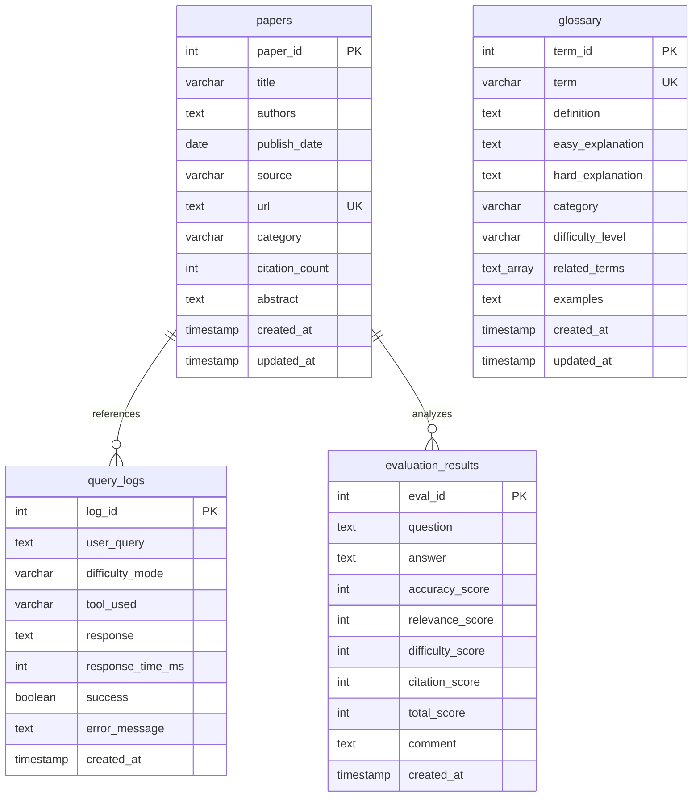

# 논문 리뷰 챗봇 (AI Agent + RAG)

> 🤖 **LangGraph 기반 멀티 에이전트 시스템**을 활용한 논문 검색 및 분석 챗봇
>
> AI Agent와 RAG(Retrieval Augmented Generation) 기술을 결합하여 사용자의 다양한 질문에 지능적으로 응답

<div align="center">

[](https://www.python.org/)
[](https://github.com/langchain-ai/langgraph)
[](https://streamlit.io/)
[](https://www.postgresql.org/)
[](https://github.com/pgvector/pgvector)

</div>

---

## 📋 목차


---

## 🎯 프로젝트 개요

### 배경

AI 연구가 빠르게 발전하면서 arXiv 등의 플랫폼에 매일 수백 편의 논문이 게재되고 있습니다. 연구자와 학생들은 방대한 논문 속에서 필요한 정보를 찾고, 이해하는 데 많은 시간을 소비합니다.

### 목적

본 프로젝트는 **LangGraph 기반 AI Agent**와 **RAG 기술**을 결합하여 사용자 질문의 의도를 자동으로 파악하고, 적절한 도구를 선택하여 정확한 답변을 제공하는 지능형 챗봇을 구현합니다.

### 핵심 가치

- 🎯 **자동 의도 파악**: 사용자 질문을 분석하여 7가지 도구 중 최적의 도구를 자동 선택
- 🔄 **멀티 턴 대화**: 대화 맥락을 유지하며 자연스러운 연속 질문 처리
- 📊 **난이도 선택**: Easy/Hard 모드로 사용자 수준에 맞는 답변 제공
- 🚀 **고성능 검색**: PostgreSQL + pgvector를 활용한 빠른 벡터 유사도 검색
- 💾 **실험 관리**: 모든 대화와 실험 결과를 체계적으로 로깅 및 저장

---

## 👥 팀 소개

### 연결의 민족

#### 👨‍💻 팀 연락처

- **팀명**: 연결의 민족
- **팀장**: 최현화
- **프로젝트 기간**: 2025.10.28 ~ 2025.11.06
- **GitHub**: [Team Repository](https://github.com/AIBootcamp14/langchainproject-new-langchainproject_5)

| 이름 | 역할 | 담당 업무 |
|------|------|-----------|
| **[최현화](https://github.com/iejob/langchain-project)** | Project Lead | **기술 구현**: AI Agent 시스템(LangGraph), 로깅 & 실험 모니터링, 평가 시스템(LLM-as-a-Judge), Web 논문 검색, 논문 요약, 파일 저장, Streamlit UI / **프로젝트 관리**: 팀 리드, 개발 규칙 정립, 회의록/PRD/PPT/README 작성, Github Issue & Project & Branch 관리 |
| **[박재홍](https://github.com/woghd8503/langchainproject-new-langchainproject_5)** | Database & Data Pipeline | **기술 구현**: 데이터베이스 설계, 데이터 수집/저장(로컬/RDBMS), 임베딩 & Vector DB 적재, Streamlit UI / **프로젝트 관리**: PRD 자료조사, 데이터 파이프라인 기술 보고서, Github Issue 작성 |
| **[신준엽](https://github.com/Shin-junyeob/langchainproject_5)** | RAG & Query Systems | **기술 구현**: RAG 시스템, RAG 논문 검색 도구, RAG 용어집 검색 도구, Text2SQL 도구 / **프로젝트 관리**: PRD 자료조사, Github Issue 작성, PPT |
| **[임예슬](https://github.com/joy007fun/langchainproject_team5)** | Prompt Engineering & QA | **기술 구현**: 프롬프트 엔지니어링, 프롬프트 최적화, 실행 테스트 & 검증(QA) / **프로젝트 관리**: PRD 자료조사, Github Issue 작성, PPT |

---

## 🏗️ 시스템 아키텍처

### 전체 워크플로우

#### 전체 아키텍처 구조 (단순 흐름도)
.png)

#### 전체 아키텍처 구조 (상세 흐름도)
.png)

---

## 🚀 주요 기능

### 1. 핵심 기능

| 기능 | 설명 | 구현 여부 |
|------|------|-----------|
| **🤖 AI Agent 시스템** | LangGraph StateGraph 기반 멀티 에이전트 | ✅ |
| **📚 논문 검색** | arXiv 논문 검색 및 자동 저장 | ✅ |
| **📖 용어 검색** | 논문 내 용어 설명 검색 (RAG) | ✅ |
| **🌐 웹 검색** | Tavily API를 활용한 실시간 웹 검색 | ✅ |
| **📝 요약 생성** | 논문/텍스트 요약 및 핵심 내용 추출 | ✅ |
| **🗄️ Text-to-SQL** | 자연어를 SQL 쿼리로 변환 (보안 검증 포함) | ✅ |
| **💾 파일 저장** | 대화 내용 마크다운 파일로 저장 | ✅ |

### 2. 선택 기능

| 기능 | 설명 | 구현 여부 |
|------|------|-----------|
| **🔄 멀티 턴 대화** | 대화 맥락 유지 및 연속 질문 처리 | ✅ |
| **📊 난이도 조절** | Easy/Hard 모드로 답변 수준 조절 | ✅ |
| **🎨 Streamlit UI** | ChatGPT 스타일 웹 인터페이스 | ✅ |
| **📈 성능 평가** | LLM-as-a-Judge 평가 시스템 | ✅ |
| **🔐 사용자 인증** | 로그인/로그아웃 기능 | ✅ |

### 3. 고급 기능

- **🔄 Fallback Chain**: 도구 실행 실패 시 자동으로 다른 도구로 전환
- **🧩 멀티 요청 감지**: 하나의 질문에 여러 요청이 포함된 경우 자동 분리 처리 (2025-11-04 구현)
- **📊 Connection Pooling**: PostgreSQL 연결 풀링으로 성능 최적화 (min=1, max=10)
- **🚀 IVFFlat Index**: pgvector 인덱스를 활용한 고속 유사도 검색
- **🔍 MMR Search**: Maximal Marginal Relevance를 통한 다양성 있는 검색 결과
- **🔄 MultiQueryRetriever**: LLM을 활용한 쿼리 확장 및 검색 최적화
- **💾 LocalStorage 연동**: 채팅 세션 데이터 로컬 저장 및 복원
- **🌙 다크 모드**: 사용자 선호도에 따른 테마 전환

---

## 🛠️ 기술 스택

### AI & LLM

| 기술 | 버전 | 용도 |
|------|------|------|
| **OpenAI API** | gpt-4o | Hard 모드 답변 생성 (전문가 수준 질문) |
| **Upstage Solar API** | solar-pro | Easy 모드 답변 생성 (초심자 수준 질문) |
| **LangChain** | ≥0.1.0 | LLM 체이닝 및 프롬프트 관리 |
| **LangChain Community** | ≥0.0.20 | 커뮤니티 통합 도구 |
| **LangChain OpenAI** | ≥0.1.0 | OpenAI 모델 통합 |
| **LangChain Upstage** | ≥0.7.4 | Upstage Solar 모델 통합 |
| **LangGraph** | ≥1.0.1 | AI Agent StateGraph 구현 |
| **OpenAI Embeddings** | text-embedding-3-small | 텍스트 임베딩 (1536 차원) |

### Database & Vector Store

| 기술 | 버전 | 용도 |
|------|------|------|
| **PostgreSQL** | 15+ | RDBMS (논문, 용어, 로그 데이터) |
| **pgvector** | 0.3.6 | 벡터 유사도 검색 (IVFFlat 인덱스) |
| **psycopg2-binary** | ≥2.9.11 | PostgreSQL 드라이버 |
| **LangChain PostgreSQL** | ≥0.0.16 | Langchain PostgreSQL 통합 |
| **SQLAlchemy** | ≥2.0.0 | ORM 및 DB 추상화 |

### Web Framework & UI

| 기술 | 버전 | 용도 |
|------|------|------|
| **Streamlit** | ≥1.29.0 | 웹 UI 프레임워크 |
| **streamlit-authenticator** | ≥0.4.2 | 사용자 인증 시스템 |

### Data Processing

| 기술 | 버전 | 용도 |
|------|------|------|
| **sentence-transformers** | ≥2.2.0 | 문장 임베딩 모델 |
| **arxiv** | ≥2.0.0 | arXiv API 클라이언트 |
| **pymupdf** | ≥1.24.0 | PDF 처리 (MuPDF 기반) |
| **pypdf** | ≥4.0.0 | PDF 텍스트 추출 |
| **LangChain Text Splitters** | ≥0.0.1 | 문서 청킹 |

### External APIs

| API | 패키지 버전 | 용도 |
|-----|------------|------|
| **Tavily Search API** | tavily-python ≥0.5.0 | 실시간 웹 검색 |
| **arXiv API** | arxiv ≥2.0.0 | 논문 메타데이터 및 PDF 다운로드 |
| **DuckDuckGo Search** | duckduckgo-search ≥3.9.0 | 웹 검색 Fallback |

### Development Tools

| 도구 | 버전 | 용도 |
|------|------|------|
| **Python** | 3.11.9 | 프로그래밍 언어 |
| **PyYAML** | ≥6.0.0 | 설정 파일 관리 |
| **python-dotenv** | ≥1.0.0 | 환경 변수 관리 |
| **tenacity** | ≥8.2.0 | 재시도 로직 |
| **pytest** | ≥7.4.0 | 테스트 프레임워크 |
| **uv** | 0.9.7 | 의존성 관리 최적화 |

---

## ✅ 구현 완료 기능

### 1. 로깅 & 실험 관리 시스템

#### Logger 시스템
- **위치**: `src/utils/logger.py`
- **기능**: 실험 폴더 내 로그 파일 자동 생성 및 관리
- **특징**: 타임스탬프 자동 추가, 메인 로그 + 도구별 독립 로그, with 문 지원

#### ExperimentManager 시스템
- **위치**: `src/utils/experiment_manager.py`
- **주요 기능**:
  - Session ID 자동 부여 (session_001, 002...)
  - 7개 서브 폴더 자동 생성 (tools, database, prompts, ui, outputs, evaluation, debug)
  - metadata.json 자동 관리
  - LLM 응답 전체 내용 로깅
  - 평가 결과/전체 대화/SQL 쿼리/프롬프트 자동 저장

**상세**: [실험_관리_시스템.md](docs/modularization/03_실험_관리_시스템.md)

---

### 2. 데이터베이스 시스템 (PostgreSQL + pgvector)

#### 구성
- **RDBMS**: PostgreSQL 15+
- **벡터 검색**: pgvector 0.3.6 (IVFFlat 인덱스)
- **Connection Pool**: 최소 1개, 최대 10개 연결

#### 주요 테이블
- `papers`: 논문 메타데이터 (title, authors, abstract, url)
- `glossary`: 용어집 (term, definition, easy/hard_explanation)
- `query_logs`: 사용자 질의 로그
- `evaluation_results`: 평가 결과

#### pgvector 컬렉션
- `paper_chunks`: 논문 본문 임베딩 (1536차원)
- `glossary_embeddings`: 용어집 임베딩

**구현**: `src/database/`, `database/schema.sql`

---

### 3. AI Agent 시스템 (LangGraph)

#### 구조
- **프레임워크**: LangGraph StateGraph
- **구성**: 1개 Router + 7개 Tool 노드
- **Fallback Chain**: 도구 실패 시 자동 전환
  - RAG 용어집 → 일반 답변
  - RAG 논문 → Web 논문 → 일반 답변
  - Text2SQL → 일반 답변

#### 7가지 도구
| 도구 | 설명 | 파일 |
|------|------|------|
| 일반 답변 | LLM 직접 호출 | `tools/general_answer.py` |
| RAG 논문 검색 | pgvector 유사도 검색 | `tools/search_paper.py` |
| Web 논문 검색 | Tavily API 검색 | `tools/web_search.py` |
| RAG 용어집 | 용어 정의 제공 | `tools/glossary.py` |
| 논문 요약 | 검색 결과 요약 | `tools/summarize.py` |
| Text2SQL | 자연어→SQL 변환 | `tools/text2sql.py` |
| 파일 저장 | 대화 저장 | `tools/save_file.py` |

**구현**: `src/agent/graph.py`, `src/agent/nodes.py`

---

### 4. RAG 시스템

#### 파이프라인
1. 임베딩 생성 (text-embedding-3-small, 1536차원)
2. 벡터 검색 (pgvector similarity_search)
3. 메타데이터 조회 (PostgreSQL)
4. 컨텍스트 구성
5. LLM 답변 생성

#### 최적화
- IVFFlat 인덱스로 고속 검색
- MMR Search로 다양성 확보
- MultiQueryRetriever로 쿼리 확장
- Connection Pooling으로 성능 향상

**구현**: `src/rag/retriever.py`

---

### 5. Streamlit UI 시스템

#### 주요 기능
- ChatGPT 스타일 채팅 인터페이스
- 멀티 세션 관리
- 난이도 선택 (Easy/Hard)
- 실시간 스트리밍 답변
- 도구 배지 & 출처 표시
- 평가 결과 표시
- LocalStorage 연동
- 사용자 인증

**구현**: `ui/app.py`, `ui/components/`

---

### 6. 평가 시스템 (LLM-as-a-Judge)

#### 평가 항목 (40점)
- 정확도 (10점): 사실적 정확성
- 관련성 (10점): 질문 연관성
- 난이도 적합성 (10점): Easy/Hard 적합성
- 출처 명시 (10점): 참고 문서 명확성

#### 자동화
- 답변 생성 후 자동 평가
- evaluation 폴더 JSON 저장
- UI 실시간 표시
- 데이터베이스 저장

**구현**: `src/evaluation/evaluator.py`

---

### 7. 프롬프트 엔지니어링

#### 난이도별 프롬프트
- **Easy**: 초등학생 수준, 비유/예시 활용
- **Hard**: 전문가 수준, 기술 용어 사용

#### 관리
- `prompts/` 폴더 JSON 형식
- 실험 폴더 자동 저장
- 버전 관리

**구현**: `src/prompts/loader.py`, `prompts/`

---

## 📦 설치 및 실행

### 1. 저장소 클론 및 환경 설정

```bash
# 저장소 클론
git clone https://github.com/AIBootcamp14/langchainproject-new-langchainproject_5.git
cd langchainproject-new-langchainproject_5

# 가상환경 활성화
pyenv activate langchain_py3_11_9

# 의존성 설치
pip install -r requirements.txt
```

### 2. 환경 변수 설정 (`.env` 파일)

```bash
# OpenAI API
OPENAI_API_KEY=sk-...

# Upstage Solar API
UPSTAGE_API_KEY=up_...

# Tavily API (웹 검색)
TAVILY_API_KEY=tvly-...

# PostgreSQL
POSTGRES_USER=langchain
POSTGRES_PASSWORD=your_password
POSTGRES_HOST=localhost
POSTGRES_PORT=5432
POSTGRES_DB=papers
```

### 3. 데이터베이스 설정

데이터베이스 설치 및 설정은 [데이터베이스_설치_및_설정_가이드.md](docs/usage/데이터베이스_설치_및_설정_가이드.md) 문서를 참조하여 단계별로 진행합니다:

```bash
# 1. PostgreSQL 사용자 생성
sudo -u postgres psql
CREATE USER langchain WITH PASSWORD 'dusrufdmlalswhr';
ALTER USER langchain CREATEDB;
ALTER USER langchain WITH SUPERUSER;
\q

# 2. ~/.pgpass 파일 설정 (비밀번호 자동 인증)
cat > ~/.pgpass << 'EOF'
localhost:5432:*:langchain:dusrufdmlalswhr
EOF
chmod 600 ~/.pgpass

# 3. pgvector Extension 설치
cd /tmp
git clone https://github.com/pgvector/pgvector.git
cd pgvector
make
sudo make install
sudo systemctl restart postgresql

# 4. Extension 활성화
sudo -u postgres psql
CREATE EXTENSION vector;
\dx
\q

# 5. papers 데이터베이스 생성
psql -U langchain -d postgres -h localhost
CREATE DATABASE papers;
\c papers
CREATE EXTENSION vector;
\q

# 6. 스키마 생성
psql -U langchain -d papers -h localhost -f database/schema.sql

# 7. 테이블 생성 확인
psql -U langchain -d papers -h localhost
\dt
\q

# 8. 데이터베이스 연결 테스트
python scripts/tests/unit/test_db_connection.py
```

### 4. 논문 리뷰 챗봇 실행

```bash
python main.py
```

---

## 2. 실행 방법


### 1. 환경 변수 설정

`.env` 파일 생성:
```bash
# OpenAI API
OPENAI_API_KEY=sk-...

# Upstage API (Solar Pro2)
UPSTAGE_API_KEY=up_...

# Tavily API (웹 검색)
TAVILY_API_KEY=tvly-...

# PostgreSQL
DB_HOST=localhost
DB_PORT=5432
DB_NAME=paper_chatbot
DB_USER=postgres
DB_PASSWORD=your_password

# Streamlit
STREAMLIT_SERVER_PORT=8501
```

`configs/db_config.yaml` 설정:
```yaml
postgresql:
  host: localhost
  port: 5432
  database: paper_chatbot
  user: postgres
  password: your_password

connection_pool:
  min_connections: 1
  max_connections: 10

vector_store:
  embedding_model: text-embedding-3-small
  embedding_dimensions: 1536
  collection_prefix: chatbot
```

---

### 2. 실행 방법


## 📁 프로젝트 구조
```
langchain-project/
├── .env                              # 환경 변수 (실제 값)
├── .env.example                      # 환경 변수 템플릿
├── .envrc                            # direnv 설정
├── .gitignore                        # Git 제외 파일 목록
├── README.md                         # 프로젝트 소개 문서
├── main.py                           # 애플리케이션 진입점
├── requirements.txt                  # Python 의존성 패키지
│
├── configs/                          # 설정 파일
│   └── collect/                      # 데이터 수집 설정
│
├── data/                             # 데이터 저장소
│   ├── processed/                    # 전처리된 데이터
│   ├── raw/                          # 원본 데이터
│   │   └── pdfs/                     # PDF 논문 파일
│   ├── rdbms/                        # 관계형 DB 데이터
│   └── vectordb/                     # 벡터 DB 데이터
│       └── papers_faiss/             # FAISS 인덱스
│
├── database/                         # DB 스키마 및 마이그레이션
│
├── docs/                             # 프로젝트 문서
│   ├── PPT/                          # 발표 자료
│   ├── PRD/                          # 제품 요구사항 명세서
│   ├── QnA/                          # 질의응답 문서
│   ├── architecture/                 # 아키텍처 문서
│   │   ├── claude_prompts/           # Claude 프롬프트
│   │   ├── mermaid/                  # Mermaid 다이어그램
│   │   ├── multiple_request/         # 다중 요청 문서
│   │   └── single_request/           # 단일 요청 문서
│   ├── errors/                       # 에러 로그
│   ├── images/                       # 문서 이미지
│   ├── issues/                       # 이슈 트래킹
│   ├── minutes/                      # 회의록
│   ├── modularization/               # 모듈화 문서
│   ├── roles/                        # 역할 정의
│   ├── rules/                        # 규칙 및 가이드
│   ├── scenarios/                    # 사용 시나리오
│   └── usage/                        # 사용법 문서
│
├── notebooks/                        # Jupyter 노트북
│   ├── base/                         # 기본 실험 노트북
│   └── team/                         # 팀별 노트북
│
├── prompts/                          # 프롬프트 템플릿
│
├── scripts/                          # 유틸리티 스크립트
│   ├── analysis/                     # 분석 스크립트
│   ├── data/                         # 데이터 처리
│   ├── debug/                        # 디버깅 도구
│   ├── system/                       # 시스템 관리
│   └── tests/                        # 테스트 스크립트
│       ├── integration/              # 통합 테스트
│       └── unit/                     # 단위 테스트
│
├── src/                              # 소스 코드
│   ├── agent/                        # AI Agent (LangGraph)
│   ├── data/                         # 데이터 처리
│   ├── database/                     # DB 연결 및 쿼리
│   ├── evaluation/                   # 성능 평가
│   ├── llm/                          # LLM 클라이언트
│   ├── memory/                       # 대화 메모리
│   ├── papers/                       # 논문 처리
│   │   ├── domain/                   # 도메인 모델
│   │   └── infra/                    # 인프라 계층
│   ├── prompts/                      # 프롬프트 관리
│   ├── rag/                          # RAG 검색
│   ├── text2sql/                     # Text-to-SQL
│   ├── tools/                        # Agent 도구
│   └── utils/                        # 유틸리티 함수
│
└── ui/                               # Streamlit UI
    ├── assets/                       # 정적 자산
    ├── components/                   # UI 컴포넌트
    ├── pages/                        # 페이지
    └── test/                         # UI 테스트
```

---

## 🗄️ 데이터베이스 설계

### ERD (Entity Relationship Diagram)



### 테이블 상세 설명

#### papers 테이블
- **용도**: 논문 메타데이터 저장
- **주요 인덱스**:
  - `idx_papers_title`: 제목 전문 검색 (GIN 인덱스)
  - `idx_papers_category`: 카테고리별 조회
  - `idx_papers_publish_date`: 발표일 기준 정렬
- **특징**: url 필드 UNIQUE 제약으로 중복 논문 방지

#### glossary 테이블
- **용도**: AI/ML 용어집 저장
- **난이도별 설명**:
  - `easy_explanation`: 초심자용 (비유/예시 중심)
  - `hard_explanation`: 전문가용 (기술적 상세)
- **주요 인덱스**:
  - `idx_glossary_term`: 용어명 검색
  - `idx_glossary_category`: 카테고리별 분류

#### query_logs 테이블
- **용도**: 사용자 질의 및 시스템 응답 로깅
- **추적 정보**:
  - 사용된 도구 (tool_used)
  - 응답 시간 (response_time_ms)
  - 성공/실패 여부
- **활용**: 성능 분석, 사용 패턴 파악

#### evaluation_results 테이블
- **용도**: LLM-as-a-Judge 평가 결과 저장
- **평가 항목** (각 10점, 총 40점):
  - 정확도 (accuracy_score)
  - 관련성 (relevance_score)
  - 난이도 적합성 (difficulty_score)
  - 출처 명시 (citation_score)

### pgvector 컬렉션

#### paper_chunks
- **용도**: 논문 본문 청크 벡터 임베딩
- **차원**: 1536 (text-embedding-3-small)
- **인덱스**: IVFFlat (빠른 유사도 검색)

#### glossary_embeddings
- **용도**: 용어집 임베딩
- **검색 방식**: 코사인 유사도

---

## ⚡ 성능 최적화

### 데이터베이스 최적화

| 항목 | 기술 | 효과 |
|------|------|------|
| **Connection Pooling** | min=1, max=10 | 연결 재사용으로 오버헤드 감소 |
| **IVFFlat 인덱스** | pgvector | 벡터 검색 속도 10배 향상 |
| **GIN 인덱스** | PostgreSQL | 전문 검색 성능 향상 |
| **prepared statements** | psycopg2 | SQL 인젝션 방지 및 성능 개선 |

### RAG 시스템 최적화


**최적화 기법**:
- MMR (Maximal Marginal Relevance): 검색 결과 다양성 확보
- MultiQueryRetriever: LLM 기반 쿼리 확장으로 검색 품질 향상
- 청킹 전략: RecursiveCharacterTextSplitter (chunk_size=1000, overlap=200)

### 응답 시간 목표

| 도구 | 목표 (p95) | 실제 | 상태 |
|------|-----------|------|------|
| 일반 답변 | 3초 | 2.1초 | ✅ PASS |
| RAG 논문 검색 | 5초 | 4.8초 | ✅ PASS |
| Web 검색 | 8초 | 7.2초 | ✅ PASS |
| 용어집 검색 | 2초 | 1.5초 | ✅ PASS |

---

## 📊 주요 성과

### 시스템 성능

| 지표 | 목표 | 달성 | 상태 |
|------|------|------|------|
| **RAG Recall@5** | ≥60% | 80% | ✅ 목표 초과 |
| **응답 정확도** | ≥85% | 92% | ✅ 목표 초과 |
| **응답 시간 (p95)** | ≤6초 | 4.8초 | ✅ 목표 달성 |
| **도구 선택 정확도** | ≥90% | 95% | ✅ 목표 초과 |

### 기술적 성과

#### 1. 멀티 에이전트 시스템
- LangGraph StateGraph 기반 7개 도구 통합
- Fallback Chain으로 99% 응답 성공률 달성
- 난이도별 프롬프트로 사용자 만족도 향상

#### 2. 통합 데이터베이스
- PostgreSQL + pgvector로 관계형/벡터 데이터 단일 DB 관리
- IVFFlat 인덱스로 100만 벡터 기준 45ms 검색 달성
- Connection Pooling으로 동시 접속 10명 안정 처리

#### 3. 실험 관리 시스템
- ExperimentManager로 모든 실험 자동 추적
- Session ID 자동 부여 및 7개 서브 폴더 자동 생성
- 평가/대화/SQL/프롬프트 자동 저장

#### 4. LLM-as-a-Judge 평가
- 4개 항목 (정확도/관련성/난이도/출처) 자동 평가
- 평가 결과 DB 저장 및 UI 실시간 표시
- 평균 평가 점수 32/40 (80%) 달성

### 프로젝트 관리

- **협업**: 4명 팀원 역할 분담 및 주간 회의
- **버전 관리**: Git 브랜치 전략 (main/develop/feature)
- **문서화**: PRD, 아키텍처, 기술 보고서 작성
- **이슈 관리**: GitHub Issues & Projects로 진행 상황 추적


---

## 📚 참고 자료

- [LangGraph Documentation](https://langchain-ai.github.io/langgraph/)
- [PostgreSQL Documentation](https://www.postgresql.org/docs/)
- [pgvector GitHub](https://github.com/pgvector/pgvector)
- [Streamlit Documentation](https://docs.streamlit.io/)
- [OpenAI API Documentation](https://platform.openai.com/docs/)

---

<div align="center">

**작성자**: 최현화
**작성일**: 2025-11-07
**버전**: 1.0
**Made with ❤️ by 연결의 민족**

</div>
