# 논문 리뷰 챗봇 (AI Agent + RAG)

> 🤖 **LangGraph 기반 멀티 에이전트 시스템**을 활용한 논문 검색 및 분석 챗봇
>
> AI Agent와 RAG(Retrieval Augmented Generation) 기술을 결합하여 사용자의 다양한 질문에 지능적으로 응답

<div align="center">

[](https://www.python.org/)
[](https://github.com/langchain-ai/langchain)
[](https://github.com/langchain-ai/langgraph)
[](https://streamlit.io/)

[](https://openai.com/)
[](https://www.upstage.ai/)
[](https://www.postgresql.org/)
[](https://github.com/pgvector/pgvector)

</div>

---

## 📋 목차

- [🎯 프로젝트 개요](#-프로젝트-개요)
  - [배경](#배경)
  - [목적](#목적)
  - [핵심 가치](#핵심-가치)
- [👥 팀 소개](#-팀-소개)
- [🏗️ 시스템 아키텍처](#️-시스템-아키텍처)
  - [전체 워크플로우](#전체-워크플로우)
  - [단계별 워크플로우 상세 설명](#단계별-워크플로우-상세-설명)
    - [Phase 1: 프로그램 시작 및 초기화](#-phase-1-프로그램-시작-및-초기화-16단계)
    - [Phase 2: 사용자 입력 및 Agent 실행](#-phase-2-사용자-입력-및-agent-실행-710단계)
    - [Phase 3: 도구 실행 및 Fallback](#-phase-3-도구-실행-및-fallback-1118단계)
    - [Phase 4: LLM 호출 및 상태 관리](#-phase-4-llm-호출-및-상태-관리-1921단계)
    - [Phase 5: UI 표시 및 부가 기능](#️-phase-5-ui-표시-및-부가-기능-2226단계)
  - [핵심 개념 정리](#-핵심-개념-정리)
- [🚀 주요 기능](#-주요-기능)
- [🛠️ 기술 스택](#️-기술-스택)
- [📁 프로젝트 구조](#-프로젝트-구조)
- [🔧 핵심 기술 구현](#-핵심-기술-구현)
  - [1. 로깅 & 실험 관리 시스템](#1-로깅--실험-관리-시스템)
  - [2. 데이터베이스 시스템 (PostgreSQL + pgvector)](#2-데이터베이스-시스템-postgresql--pgvector)
  - [3. 논문 데이터 수집 파이프라인](#3-논문-데이터-수집-파이프라인)
  - [4. AI Agent 시스템 (LangGraph)](#4-ai-agent-시스템-langgraph)
  - [5. LLM 클라이언트 (다중 LLM 지원)](#5-llm-클라이언트-다중-llm-지원)
  - [6. RAG 시스템](#6-rag-시스템)
  - [7. Streamlit UI 시스템](#7-streamlit-ui-시스템)
  - [8. 평가 시스템 (LLM-as-a-Judge)](#8-평가-시스템-llm-as-a-judge)
  - [9. 프롬프트 엔지니어링](#9-프롬프트-엔지니어링)
- [📦 설치 및 실행](#-설치-및-실행)
- [⚡ 성능 최적화](#-성능-최적화)
- [📊 주요 성과](#-주요-성과)
- [📚 참고 자료](#-참고-자료)


---

## 🎯 프로젝트 개요

### 배경

AI 연구가 빠르게 발전하면서 arXiv 등의 플랫폼에 매일 수백 편의 논문이 게재되고 있습니다. 연구자와 학생들은 방대한 논문 속에서 필요한 정보를 찾고, 이해하는 데 많은 시간을 소비합니다.

### 목적

본 프로젝트는 **LangGraph 기반 AI Agent**와 **RAG 기술**을 결합하여 사용자 질문의 의도를 자동으로 파악하고, 적절한 도구를 선택하여 정확한 답변을 제공하는 지능형 챗봇을 구현합니다.

### 핵심 가치

- 🎯 **자동 의도 파악**: 사용자 질문을 분석하여 7가지 도구 중 최적의 도구를 자동 선택
- 🔄 **멀티 턴 대화**: 대화 맥락을 유지하며 자연스러운 연속 질문 처리
- 📊 **난이도 선택**: Easy/Hard 모드로 사용자 수준에 맞는 답변 제공
- 🚀 **고성능 검색**: PostgreSQL + pgvector를 활용한 빠른 벡터 유사도 검색
- 💾 **실험 관리**: 모든 대화와 실험 결과를 체계적으로 로깅 및 저장

---

## 👥 팀 소개

### 연결의 민족

#### 👨‍💻 팀 연락처

- **팀명**: 연결의 민족
- **팀장**: 최현화
- **팀원**: 박재홍, 신준엽, 임예슬
- **프로젝트 기간**: 2025.10.28 ~ 2025.11.06
- **GitHub**: [Team Repository](https://github.com/AIBootcamp14/langchainproject-new-langchainproject_5)

| 이름 | 역할 | 기술 개발 및 구현 | 프로젝트 운영 및 문서화 |
|:----:|------|------------------|----------------------|
| <div align="center"><br>**[최현화](https://github.com/iejob/langchain-project)**</div> | - Project Lead<br>- Tech Lead | - 프로젝트 총괄 및 시스템 아키텍처 설계<br>- AI Agent 시스템(LangGraph)<br>- 단일/다중 요청시 Fallback 도구 자동 전환<br>- 멀티턴 대화 기능<br>- 로깅 & 실험 모니터링 시스템<br>- 평가 시스템(LLM-as-a-Judge)<br>- Web 논문 검색 도구<br>- 논문 요약 도구<br>- 파일 저장 도구<br>- Streamlit UI | - 팀 리드 및 역할 배분<br>- 개발 규칙 및 컨벤션 정립<br>- 회의록(팀/멘토링) 작성 및 관리<br>- PRD 및 기술 명세 문서 총괄<br>- 프로젝트 전체 문서 작성 및 관리<br>(docs/ 전체, PPT, README)<br>- Github Issue 작성 및 관리<br>- Github Project 관리<br>- Git 브랜치 관리 & 병합 |
| <div align="center"><br>**[박재홍](https://github.com/woghd8503/langchainproject-new-langchainproject_5)**</div> | - Database<br>- Data Pipeline | - 데이터베이스 설계<br>- 데이터 수집<br>- 데이터 저장(로컬/RDBMS)<br>- 임베딩 및 Vector DB 적재<br>- Streamlit UI | - PRD 자료조사<br>- 데이터파이프라인 보고서 작성<br>- Github Issue 작성<br>- 브랜치 기반 개발<br>(feature/data-collection) |
| <div align="center"><br>**[신준엽](https://github.com/Shin-junyeob/langchainproject_5)**</div> | - RAG<br>- Query Systems | - RAG 시스템<br>- RAG 논문 검색 도구<br>- RAG 용어집 검색 도구<br>- Text2SQL 도구 | - PRD 자료조사<br>- Github Issue 작성<br>- PPT<br>- 브랜치 기반 개발<br>(feature/rag) |
| <div align="center"><br>**[임예슬](https://github.com/joy007fun/langchainproject_team5)**</div> | - Prompt<br>   Engineering<br>- QA | - 프롬프트 엔지니어링<br>- 프롬프트 최적화<br>- 실행 테스트 및 검증(QA) | - PRD 자료조사<br>- Github Issue 작성<br>- PPT<br>- 브랜치 기반 개발<br>(feature/prompt) |

---

## 🏗️ 시스템 아키텍처

### 전체 워크플로우

#### 전체 아키텍처 구조 (단순 흐름도)
.png)

#### 전체 아키텍처 구조 (상세 흐름도)
.png)

#### 전체 흐름 요약 표

아래 표는 main.py부터 시작되는 전체 시스템 실행 흐름을 단계별로 정리한 것입니다.


<details>
<summary><strong>전체 흐름 요약 표</strong></summary>

| 단계 | 도구/컴포넌트명 | 파일명 | 메서드명 | 동작 설명 | 입력 | 출력 | Fallback | 세션 저장 |
|------|-----------------|--------|----------|-----------|------|------|----------|----------|
| **1** | **프로그램 시작** | `main.py` | `main()`, `load_dotenv()` | .env 파일 로드 후 Streamlit 서버 시작 | 없음 | 환경변수 로드 완료 | 없음 | 없음 |
| **2** | **Streamlit 서버** | `main.py` | `subprocess.run()` | Streamlit 앱 실행 (port 8501) | `ui/app.py` 경로 | 브라우저 localhost:8501 열림 | 없음 | 없음 |
| **3** | **UI 초기화** | `ui/app.py` | `st.set_page_config()`, `initialize_agent()` | 페이지 설정 및 환경변수 검증 | OPENAI_API_KEY 확인 | Agent 및 ExpManager 생성 | 없음 | `st.session_state` |
| **4** | **ExperimentManager** | `src/utils/experiment_manager.py` | `__init__()`, `Logger.write()` | 실험 폴더 생성 (experiments/YYYYMMDD/ID) | 없음 | 로그 파일 생성, config.json 저장 | 없음 | 로컬 파일 |
| **5** | **Agent 그래프 생성** | `src/agent/graph.py` | `create_agent_graph()`, `StateGraph()`, `workflow.compile()` | LangGraph 그래프 구성 (router + 7개 도구 노드) | `exp_manager` | 컴파일된 Agent 그래프 | 없음 | 메모리 |
| **6** | **UI 렌더링** | `ui/app.py` | `initialize_storage()`, `initialize_chat_sessions()`, `create_new_chat()`, `render_sidebar()` | Storage 및 채팅 세션 초기화 | 없음 | 첫 채팅 자동 생성 완료 | 없음 | `st.session_state` |
| **7** | **사용자 입력 처리** | `ui/components/chat_interface.py` | `st.chat_input()`, `render_chat_input()` | 사용자 질문 수신 및 메시지 추가 | 사용자 prompt | 채팅 히스토리에 메시지 추가 | 없음 | `st.session_state.chats` |
| **8** | **Agent 실행** | `ui/components/chat_interface.py` | `agent_executor.invoke()` | LangGraph 그래프 실행 시작 | `question`, `difficulty`, `messages` | AgentState 반환 | 없음 | 없음 |
| **9** | **라우터 노드** | `src/agent/nodes.py` | `router_node()`, `extract_keywords()` | 다중 요청 패턴 확인 및 도구 선택 | `question`, `multi_request_patterns.yaml` | `tool_choice`, `tool_pipeline`, `routing_reason` | 없음 | `AgentState` |
| **10** | **도구 래퍼** | `src/agent/tool_wrapper.py` | `wrap_tool_node()` | 도구 실행 전 래퍼 적용 | 도구 함수 | `tool_status`, `tool_result` 설정 | 없음 | `AgentState` |
| **11-A** | **RAG 용어집 검색** | `src/tools/glossary.py` | `glossary_node()`, `extract_term_from_question()`, `hybrid_search()` | SQL(ILIKE) + Vector 하이브리드 검색 (50%+50%) | `question` | 용어 정의 또는 실패 | **일반 답변** | `AgentState.tool_result` |
| **11-A-F** | **일반 답변 (Fallback)** | `src/tools/general.py` | `general_node()`, `get_general_template()`, `LLMClient.generate()` | LLM으로 직접 답변 생성 | `question`, `difficulty` | 일반 답변 텍스트 | 없음 | `AgentState.final_answers` |
| **12** | **DB 조회 (glossary)** | `src/db/rag_retriever.py` | `hybrid_search()`, `sql_search()`, `vector_search()` | PostgreSQL glossary 테이블 + pgvector 검색 | 추출된 용어 | SQL 결과 + 벡터 결과 병합 | 없음 | 없음 |
| **13** | **Fallback 체크** | `src/agent/graph.py` | `check_pipeline_or_fallback()` | `tool_status` 확인하여 Fallback 또는 Pipeline 진행 | `tool_status` | `pipeline_router` 또는 `fallback_router_node` | 없음 | 없음 |
| **14** | **Fallback Router** | `src/agent/nodes.py` | `fallback_router_node()`, `TOOL_FALLBACKS.get()` | 실패한 도구를 Fallback 도구로 교체 (glossary→general) | `tool_choice`, `TOOL_FALLBACKS` | `tool_pipeline` 수정, `retry_count` 증가 | 없음 | `AgentState` |
| **15** | **Pipeline Router** | `src/agent/graph.py` | `pipeline_router()` | 검색 성공 시 스킵 로직 적용 (search_paper→summarize 직행) | `tool_status`, `pipeline_index` | 다음 도구 선택 또는 스킵 | 없음 | `AgentState` |
| **16-A** | **RAG 논문 검색** | `src/tools/search_paper.py` | `search_paper_node()`, `RAGRetriever()`, `hybrid_search()` | Vector(70%) + FTS(30%) 하이브리드 검색 | `question` | 논문 본문 또는 실패 | **Web 논문 검색** | `AgentState.tool_result` |
| **16-A-F1** | **Web 논문 검색 (Fallback 1)** | `src/tools/web_search.py` | `web_search_node()`, `TavilySearchResults()` | Tavily API로 웹 검색 | `question` | 웹 검색 결과 또는 실패 | **일반 답변** | `AgentState.tool_result` |
| **16-A-F2** | **일반 답변 (Fallback 2)** | `src/tools/general.py` | `general_node()`, `get_general_template()`, `LLMClient.generate()` | LLM으로 직접 답변 생성 | `question`, `difficulty` | 일반 답변 텍스트 | 없음 | `AgentState.final_answers` |
| **17** | **DB 조회 (papers)** | `src/db/rag_retriever.py` | `hybrid_search()`, `vector_search()`, `fts_search()` | PostgreSQL papers 테이블 + pgvector 검색 | 질문 임베딩 | Vector 70% + FTS 30% 병합 결과 | 없음 | 없음 |
| **18** | **논문 요약** | `src/tools/summarize.py` | `summarize_node()`, `get_summarize_template()`, `LLMClient.generate()` | 파이프라인 모드: 이전 tool_result 활용하여 요약 | 검색된 논문 본문, `difficulty` | 난이도별 논문 요약 | **일반 답변** | `AgentState.final_answers` |
| **18-F** | **일반 답변 (Fallback)** | `src/tools/general.py` | `general_node()`, `get_general_template()`, `LLMClient.generate()` | 요약 실패 시 일반 답변 생성 | `question`, `difficulty` | 일반 답변 텍스트 | 없음 | `AgentState.final_answers` |
| **19** | **LLM 호출** | `src/llm/client.py` | `LLMClient.generate()`, `chat.completions.create()` | OpenAI API 호출 (Solar-pro2 또는 GPT-5) | 시스템 프롬프트 + 사용자 질문 | `generated_text`, 토큰 사용량 | 없음 | 없음 |
| **20** | **AgentState 업데이트** | `src/agent/graph.py` | (LangGraph 자동) | `tool_result`, `final_answers`, `tool_status`, `messages`, `metadata` 업데이트 | 도구 출력 | AgentState 갱신 | 없음 | 메모리 |
| **21** | **종료 조건 확인** | `src/agent/graph.py` | `should_end()` | `pipeline_index` 완료, `final_answers` 존재, `retry_count` 초과 확인 | `AgentState` | `END` 또는 `CONTINUE` | 없음 | 없음 |
| **22** | **UI 답변 표시** | `ui/components/chat_interface.py` | `render_chat_input()`, `st.markdown()` | 난이도별 답변, 도구 배지, 선택 이유 표시 | `response.final_answers` | 채팅 UI에 답변 렌더링 | 없음 | `st.session_state.chats` |
| **23** | **용어 추출 및 저장** | `ui/components/chat_interface.py` | `extract_and_save_terms()`, 정규식 매칭, LLM 추출 | 답변에서 기술 용어 추출 후 DB 저장 | 답변 텍스트 | `extracted_terms` 테이블에 INSERT | 없음 | PostgreSQL DB |
| **24** | **답변 평가** | `ui/components/chat_interface.py` | `LLMClient.generate()` (평가 프롬프트) | LLM-as-a-Judge로 정확성/완전성/명확성 평가 | 질문 + 답변 | 평가 점수(0~100), `evaluations` 테이블 저장 | 없음 | PostgreSQL DB |
| **25** | **계속 대화** | `ui/components/chat_interface.py` | `st.chat_input()` | 새 질문 대기, 있으면 7단계로 복귀 | 새 질문 또는 없음 | 7단계로 복귀 또는 세션 유지 | 없음 | `st.session_state` |
| **26** | **세션 종료** | `ui/app.py` | `cleanup_on_exit()`, `atexit.register()` | 브라우저 탭 닫기 시 빈 폴더 정리 | `experiments/` 폴더 | 빈 폴더 삭제 완료 | 없음 | 로컬 파일 시스템 |
</details>

### 표 설명

- **단계**: 실행 순서 (1~26단계)
- **Fallback 표기**:
  - `11-A`: 용어집 검색 (메인)
  - `11-A-F`: 용어집 실패 시 Fallback (일반 답변)
  - `16-A`: 논문 검색 (메인)
  - `16-A-F1`: 논문 검색 실패 시 Fallback 1단계 (Web 검색)
  - `16-A-F2`: Web 검색 실패 시 Fallback 2단계 (일반 답변)
- **세션 저장**: 각 단계의 결과가 저장되는 위치 (메모리, DB, 파일 등)

---

## 단계별 워크플로우 상세 설명

아래는 각 단계가 **언제, 왜, 어떻게** 실행되는지를 이해할 수 있도록 상세히 설명한 것입니다.

### 🚀 Phase 1: 프로그램 시작 및 초기화 (1~6단계)

<details>
<summary><strong>1단계: 프로그램 시작</strong></summary>

**언제 실행되나요?**
- 터미널에서 `python main.py` 명령어를 실행했을 때 가장 먼저 실행됩니다.

**무엇을 하나요?**
- `.env` 파일에 저장된 환경변수(API 키, DB 접속 정보 등)를 메모리에 로드합니다.
- `load_dotenv()` 함수가 `.env` 파일을 읽어서 `os.getenv()`로 접근 가능하게 만듭니다.

**왜 필요한가요?**
- OpenAI API 키나 PostgreSQL 비밀번호 같은 민감한 정보를 코드에 직접 쓰지 않고 안전하게 관리하기 위함입니다.

**실제 코드 예시:**
```python
# main.py
from dotenv import load_dotenv
load_dotenv()  # .env 파일 로드
```

</details>

<details>
<summary><strong>2단계: Streamlit 서버 시작</strong></summary>

**언제 실행되나요?**
- 1단계에서 환경변수 로드가 완료된 직후 실행됩니다.

**무엇을 하나요?**
- `subprocess.run()` 함수로 새로운 프로세스를 생성하여 Streamlit 서버를 시작합니다.
- 서버는 `localhost:8501` 포트에서 실행되며, 자동으로 브라우저가 열립니다.

**왜 필요한가요?**
- 사용자가 웹 브라우저에서 챗봇과 대화할 수 있는 UI를 제공하기 위함입니다.

**실제 코드 예시:**
```python
# main.py
subprocess.run(["streamlit", "run", "ui/app.py"])
```

</details>

<details>
<summary><strong>3단계: UI 초기화</strong></summary>

**언제 실행되나요?**
- Streamlit 서버가 시작되고 브라우저에서 페이지를 로드할 때 실행됩니다.

**무엇을 하나요?**
- `st.set_page_config()`로 페이지 제목, 아이콘, 레이아웃을 설정합니다.
- 환경변수 검증: `OPENAI_API_KEY`가 없으면 에러 메시지를 표시하고 앱을 중지합니다.
- `initialize_agent()` 함수로 Agent와 ExperimentManager를 생성합니다 (캐싱됨).

**왜 필요한가요?**
- API 키가 없으면 LLM을 호출할 수 없으므로, 앱 시작 전에 검증해야 합니다.
- Agent를 매번 새로 생성하면 느리므로, 캐싱하여 재사용합니다.

**실제 코드 예시:**
```python
# ui/app.py
st.set_page_config(page_title="논문 리뷰 챗봇", page_icon="📚")
if not os.getenv("OPENAI_API_KEY"):
    st.error("❌ API 키가 없습니다")
    st.stop()
```

</details>

<details>
<summary><strong>4단계: ExperimentManager 생성</strong></summary>

**언제 실행되나요?**
- 3단계의 `initialize_agent()` 함수 내부에서 실행됩니다.

**무엇을 하나요?**
- 실험 폴더를 생성합니다: `experiments/20250108/exp_001/` (날짜와 ID로 구분)
- 로그 파일(`log.txt`)과 설정 파일(`config.json`)을 생성합니다.
- 모든 실험 데이터를 이 폴더에 저장합니다.

**왜 필요한가요?**
- 여러 실험을 체계적으로 관리하고, 나중에 결과를 비교/분석하기 위함입니다.
- 로그를 통해 문제가 발생했을 때 디버깅이 쉬워집니다.

**실제 폴더 구조:**
```
experiments/
└── 20251028/
    ├── 날짜_시간_session_001/
    └── 날짜_시간_session_002/
```

</details>

<details>
<summary><strong>5단계: Agent 그래프 생성</strong></summary>

**언제 실행되나요?**
- 4단계에서 ExperimentManager 생성 직후 실행됩니다.

**무엇을 하나요?**
- LangGraph의 `StateGraph`를 사용하여 Agent의 실행 흐름을 정의합니다.
- 노드 추가: `router_node`, `glossary_node`, `search_paper_node` 등 8개 노드
- 엣지 추가: 노드 간 연결 (조건부 라우팅 포함)
- `workflow.compile()`로 그래프를 실행 가능한 형태로 컴파일합니다.

**왜 필요한가요?**
- Agent가 질문을 받았을 때 어떤 순서로 도구를 실행할지 미리 정의해야 합니다.
- 그래프 구조로 표현하면 복잡한 로직도 시각적으로 이해하기 쉽습니다.

**실제 코드 예시:**
```python
# src/agent/graph.py
workflow = StateGraph(AgentState)
workflow.add_node("router", router_node)
workflow.add_node("glossary", glossary_node)
workflow.add_edge("router", "glossary")
agent = workflow.compile()
```

</details>

<details>
<summary><strong>6단계: UI 렌더링</strong></summary>

**언제 실행되나요?**
- 5단계에서 Agent 그래프 생성 완료 후, 페이지를 처음 로드할 때 실행됩니다.

**무엇을 하나요?**
- `initialize_storage()`: Storage 초기화 (채팅 데이터 저장용)
- `initialize_chat_sessions()`: 세션 상태 초기화 (`st.session_state.chats = {}`)
- `create_new_chat()`: 첫 번째 채팅을 자동으로 생성 (난이도: easy)
- `render_sidebar()`: 사이드바에 난이도 선택, 채팅 목록 표시

**왜 필요한가요?**
- 사용자가 페이지를 열자마자 바로 대화를 시작할 수 있도록 준비합니다.
- 여러 채팅 세션을 관리하기 위한 초기 구조를 설정합니다.

**실제 화면:**
```
사이드바: [새 채팅] [난이도: Easy] [채팅 1, 채팅 2, ...]
메인 화면: 채팅 입력창 (비어있음)
```

</details>

---

### 💬 Phase 2: 사용자 입력 및 Agent 실행 (7~10단계)

<details>
<summary><strong>7단계: 사용자 입력 처리</strong></summary>

**언제 실행되나요?**
- 사용자가 채팅 입력창에 질문을 입력하고 Enter를 누를 때 실행됩니다.

**무엇을 하나요?**
- `st.chat_input()`으로 사용자 입력을 수신합니다.
- 현재 채팅 ID를 가져와서 해당 채팅의 메시지 히스토리에 사용자 메시지를 추가합니다.
- 이전 대화 내역도 함께 로드하여 Agent에 전달합니다.

**왜 필요한가요?**
- Agent가 이전 대화 맥락을 이해하고 연속적인 대화를 할 수 있도록 합니다.
- 여러 채팅 세션을 구분하여 관리합니다.

**실제 코드 예시:**
```python
# ui/components/chat_interface.py
user_input = st.chat_input("질문을 입력하세요")
if user_input:
    st.session_state.chats[chat_id]["messages"].append({
        "role": "user",
        "content": user_input
    })
```

</details>

<details>
<summary><strong>8단계: Agent 실행</strong></summary>

**언제 실행되나요?**
- 7단계에서 사용자 메시지가 추가된 직후 실행됩니다.

**무엇을 하나요?**
- `agent_executor.invoke()`로 LangGraph 그래프를 실행합니다.
- 입력 데이터: `question` (사용자 질문), `difficulty` (난이도), `messages` (대화 히스토리)
- Streamlit Callback을 사용하여 실시간으로 로그를 출력합니다.

**왜 필요한가요?**
- Agent의 실행을 시작하는 진입점입니다.
- 입력 데이터를 AgentState에 전달하여 모든 노드에서 접근 가능하게 만듭니다.

**실제 코드 예시:**
```python
# ui/components/chat_interface.py
response = agent_executor.invoke({
    "question": user_input,
    "difficulty": difficulty,
    "messages": previous_messages
})
```

</details>

<details>
<summary><strong>9단계: 라우터 노드</strong></summary>

**언제 실행되나요?**
- Agent 실행 시 가장 먼저 실행되는 노드입니다.

**무엇을 하나요?**
- 사용자 질문을 분석하여 어떤 도구를 사용할지 결정합니다.
- **다중 요청 패턴 확인**: `multi_request_patterns.yaml` 파일에서 패턴을 찾습니다.
  - 예: "논문 검색 후 요약해줘" → `[search_paper, summarize]` 파이프라인
- **단일 요청**: LLM을 사용하여 가장 적합한 도구 1개를 선택합니다.
- 결과: `tool_choice`, `tool_pipeline`, `routing_reason`을 AgentState에 저장

**왜 필요한가요?**
- 질문에 따라 다른 도구를 사용해야 하므로, 라우팅 로직이 필요합니다.
- 다중 요청을 자동으로 감지하여 여러 도구를 순차 실행합니다.

**실제 예시:**
```
질문: "Transformer가 뭐야?"
→ 라우터 판단: glossary (용어집 검색)

질문: "Attention 논문 찾아서 요약해줘"
→ 라우터 판단: [search_paper, summarize] 파이프라인
```

</details>

<details>
<summary><strong>10단계: 도구 래퍼</strong></summary>

**언제 실행되나요?**
- 라우터가 도구를 선택한 직후, 실제 도구를 실행하기 전에 래퍼가 감싸서 실행합니다.

**무엇을 하나요?**
- 선택된 도구 함수(예: `glossary_node`)를 호출합니다.
- 도구 실행 결과를 검증합니다 (성공/실패 판단).
- `tool_status`를 자동으로 설정합니다 (`success` 또는 `failed`).
- `tool_result`를 AgentState에 저장합니다.

**왜 필요한가요?**
- 모든 도구에 공통적으로 적용되는 로직(상태 설정, 결과 저장)을 중복 없이 처리합니다.
- 도구가 실패했을 때 자동으로 Fallback을 트리거할 수 있습니다.

**실제 코드 예시:**
```python
# src/agent/tool_wrapper.py
def wrap_tool_node(tool_func):
    def wrapper(state: AgentState):
        result = tool_func(state)  # 도구 실행
        if result:
            state["tool_status"] = "success"
        else:
            state["tool_status"] = "failed"
        state["tool_result"] = result
        return state
    return wrapper
```

</details>

---

### 🔍 Phase 3: 도구 실행 및 Fallback (11~18단계)

<details>
<summary><strong>11-A단계: RAG 용어집 검색</strong></summary>

**언제 실행되나요?**
- 라우터가 `glossary` 도구를 선택했을 때 실행됩니다.

**무엇을 하나요?**
1. **용어 추출**: `extract_term_from_question()`으로 질문에서 기술 용어를 추출
   - 예: "Transformer가 뭐야?" → "Transformer"
2. **SQL 검색**: PostgreSQL `glossary` 테이블에서 `ILIKE '%Transformer%'` 검색
3. **벡터 검색**: `glossary_embeddings` 테이블에서 코사인 유사도 검색
4. **하이브리드 병합**: SQL 결과 50% + 벡터 결과 50%를 합산하여 최종 결과 선택

**왜 필요한가요?**
- 단순 키워드 검색(SQL)만으로는 동의어나 유사 용어를 찾기 어렵습니다.
- 벡터 검색을 함께 사용하면 의미적으로 유사한 용어도 찾을 수 있습니다.

**결과:**
- **성공**: 용어 정의를 `tool_result`에 저장 → 바로 22단계(UI 표시)로 이동
- **실패**: `tool_status = "failed"` → 11-A-F단계(Fallback)로 이동

</details>

<details>
<summary><strong>11-A-F단계: 일반 답변 (Fallback)</strong></summary>

**언제 실행되나요?**
- 11-A단계에서 용어를 찾지 못했을 때(실패) 자동으로 실행됩니다.

**무엇을 하나요?**
- `general_node()`를 실행하여 LLM에게 직접 질문을 전달합니다.
- 난이도에 맞는 프롬프트 템플릿을 로드합니다 (`get_general_template()`).
- LLM이 자체 지식으로 답변을 생성합니다.

**왜 필요한가요?**
- DB에 없는 용어라도 사용자에게 "찾을 수 없습니다"라고만 답하는 것보다, LLM의 일반 지식으로 답변하는 것이 더 유용합니다.

**실제 예시:**
```
질문: "Quantum Attention이 뭐야?"
→ glossary 검색 실패 (DB에 없음)
→ Fallback: general_node가 LLM으로 답변 생성
→ "Quantum Attention은 양자 컴퓨팅 개념을 Attention 메커니즘에 적용한 것입니다..."
```

</details>

<details>
<summary><strong>12단계: DB 조회 (glossary)</strong></summary>

**언제 실행되나요?**
- 11-A단계의 `glossary_node` 내부에서 실행됩니다.

**무엇을 하나요?**
- `RAGRetriever.hybrid_search()` 메서드 호출
- **SQL 검색**: `SELECT * FROM glossary WHERE term ILIKE '%검색어%'`
- **벡터 검색**: pgvector 확장을 사용하여 임베딩 유사도 검색
- 두 결과를 점수 기반으로 병합합니다.

**왜 필요한가요?**
- 실제 데이터를 가져오는 레이어입니다.
- SQL과 벡터 검색을 분리하여 각각의 장점을 활용합니다.

**실제 SQL 예시:**
```sql
-- SQL 검색
SELECT term, definition FROM glossary WHERE term ILIKE '%Transformer%';

-- 벡터 검색 (pgvector)
SELECT term, definition
FROM glossary_embeddings
ORDER BY embedding <=> '[0.1, 0.2, ...]'
LIMIT 5;
```

</details>

<details>
<summary><strong>13단계: Fallback 체크</strong></summary>

**언제 실행되나요?**
- 도구(11-A단계) 실행 완료 후 자동으로 실행됩니다.

**무엇을 하나요?**
- `tool_status`를 확인합니다.
- **성공**: `pipeline_router`로 이동 (다음 도구 실행 또는 종료)
- **실패**: `fallback_router_node`로 이동 (Fallback 도구 실행)

**왜 필요한가요?**
- 도구 실패 시 자동으로 대체 도구를 실행하여 사용자에게 항상 답변을 제공합니다.

**실제 흐름:**
```
glossary 성공 → pipeline_router → END
glossary 실패 → fallback_router_node → general 실행
```

</details>

<details>
<summary><strong>14단계: Fallback Router</strong></summary>

**언제 실행되나요?**
- 13단계에서 `tool_status = "failed"`일 때 실행됩니다.

**무엇을 하나요?**
- `TOOL_FALLBACKS` 딕셔너리에서 실패한 도구의 Fallback을 조회합니다.
  - 예: `TOOL_FALLBACKS = {"glossary": "general", "search_paper": "web_search"}`
- `tool_pipeline`을 수정하여 실패한 도구를 Fallback 도구로 교체합니다.
- `retry_count`를 증가시켜 무한 루프를 방지합니다.

**왜 필요한가요?**
- 도구마다 다른 Fallback 전략을 가질 수 있습니다.
- 자동으로 Fallback 체인을 따라 재시도합니다.

**실제 예시:**
```python
TOOL_FALLBACKS = {
    "glossary": "general",
    "search_paper": "web_search",
    "web_search": "general",
    "summarize": "general"
}

# glossary 실패 시
tool_pipeline = ["glossary"]  # 원래
→ tool_pipeline = ["general"]  # Fallback 적용
```

</details>

<details>
<summary><strong>15단계: Pipeline Router</strong></summary>

**언제 실행되나요?**
- 13단계에서 `tool_status = "success"`일 때, 또는 14단계(Fallback Router) 실행 후 실행됩니다.

**무엇을 하나요?**
- **검색 스킵 로직**: 검색 도구가 성공하면 나머지 검색 도구를 건너뜁니다.
  - `search_paper` 성공 → `web_search`, `general` 건너뛰기 → `summarize`로 직행
  - `web_search` 성공 → `general` 건너뛰기 → `summarize`로 직행
- **순차 진행**: 파이프라인의 다음 도구로 `pipeline_index`를 증가시킵니다.

**왜 필요한가요?**
- 불필요한 검색을 방지하여 실행 시간과 비용을 절약합니다.
- 다중 요청 파이프라인에서 효율적으로 도구를 실행합니다.

**실제 예시:**
```
파이프라인: [search_paper, web_search, general, summarize]

Case 1: search_paper 성공
→ web_search, general 스킵
→ summarize 실행

Case 2: search_paper 실패 → web_search 성공
→ general 스킵
→ summarize 실행

Case 3: search_paper, web_search 모두 실패
→ general 실행 (Fallback)
→ summarize 실행
```

</details>

<details>
<summary><strong>16-A단계: RAG 논문 검색</strong></summary>

**언제 실행되나요?**
- 라우터가 `search_paper` 도구를 선택했을 때 실행됩니다.

**무엇을 하나요?**
1. **RAGRetriever 초기화**: PostgreSQL + pgvector 연결
2. **벡터 검색**: `papers_embeddings` 테이블에서 임베딩 유사도 검색 (70% 가중치)
3. **FTS 검색**: `papers` 테이블에서 Full-Text Search (30% 가중치)
4. **하이브리드 병합**: 벡터 70% + FTS 30%를 합산하여 최상위 논문 선택
5. **유사도 확인**: 유사도가 0.5 미만이면 성공, 0.5 이상이면 실패

**왜 필요한가요?**
- 로컬 DB에 저장된 논문을 먼저 검색하는 것이 웹 검색보다 빠르고 정확합니다.
- 벡터 검색은 의미적 유사도를, FTS는 키워드 매칭을 잘 수행합니다.

**결과:**
- **성공**: 논문 본문을 `tool_result`에 저장 → 18단계(요약)로 이동
- **실패**: `tool_status = "failed"` → 16-A-F1단계(Web 검색)로 Fallback

</details>

<details>
<summary><strong>16-A-F1단계: Web 논문 검색 (Fallback 1)</strong></summary>

**언제 실행되나요?**
- 16-A단계에서 논문을 찾지 못했을 때 자동으로 실행됩니다.

**무엇을 하나요?**
- Tavily API를 사용하여 웹에서 논문을 검색합니다.
- `TavilySearchResults()` 도구가 Google Scholar, arXiv 등에서 검색합니다.
- 검색 결과(제목, 링크, 요약)를 반환합니다.

**왜 필요한가요?**
- 로컬 DB에 없는 최신 논문이나 특정 논문은 웹 검색으로 찾아야 합니다.

**결과:**
- **성공**: 웹 검색 결과를 `tool_result`에 저장 → 18단계(요약)로 이동
- **실패**: `tool_status = "failed"` → 16-A-F2단계(일반 답변)로 Fallback

</details>

<details>
<summary><strong>16-A-F2단계: 일반 답변 (Fallback 2)</strong></summary>

**언제 실행되나요?**
- 16-A-F1단계(Web 검색)도 실패했을 때 최종적으로 실행됩니다.

**무엇을 하나요?**
- LLM에게 질문을 직접 전달하여 일반 지식으로 답변을 생성합니다.

**왜 필요한가요?**
- 모든 검색이 실패해도 사용자에게 "찾을 수 없습니다"보다는 LLM의 일반 지식으로 답변하는 것이 더 유용합니다.

**실제 예시:**
```
질문: "2025년 1월에 발표된 최신 LLM 논문 찾아줘"
→ search_paper 실패 (로컬 DB에 없음)
→ web_search 실패 (너무 최신이라 인덱싱 안 됨)
→ Fallback: general_node가 답변
→ "2025년 1월 최신 논문은 아직 제 데이터베이스에 없습니다. 하지만 일반적으로 LLM 연구는..."
```

</details>

<details>
<summary><strong>17단계: DB 조회 (papers)</strong></summary>

**언제 실행되나요?**
- 16-A단계의 `search_paper_node` 내부에서 실행됩니다.

**무엇을 하나요?**
- **벡터 검색**: `papers_embeddings` 테이블에서 임베딩 유사도 검색
- **FTS 검색**: `papers` 테이블에서 PostgreSQL Full-Text Search
- 두 결과를 가중치 기반으로 병합 (벡터 70%, FTS 30%)

**왜 필요한가요?**
- 논문 검색은 용어집보다 복잡하므로 벡터 검색 비중을 더 높입니다.
- FTS는 저자명, 논문 제목 등 정확한 키워드 매칭에 유리합니다.

**실제 SQL 예시:**
```sql
-- FTS 검색
SELECT title, abstract, content
FROM papers
WHERE to_tsvector('english', content) @@ to_tsquery('Transformer & Attention');

-- 벡터 검색
SELECT title, abstract, content
FROM papers_embeddings
ORDER BY embedding <=> '[...]'
LIMIT 10;
```

</details>

<details>
<summary><strong>18단계: 논문 요약</strong></summary>

**언제 실행되나요?**
- 16-A, 16-A-F1, 또는 16-A-F2 중 하나가 성공한 후, 파이프라인에 `summarize`가 있을 때 실행됩니다.

**무엇을 하나요?**
1. **파이프라인 모드 확인**: 이전 단계의 `tool_result` 사용 (검색 결과 활용)
2. **난이도 매핑**: `easy` → `elementary/beginner` 수준으로 변환
3. **프롬프트 로드**: `get_summarize_template(difficulty)`로 난이도별 프롬프트 가져오기
4. **LLM 호출**: `LLMClient.generate()`로 요약 생성

**왜 필요한가요?**
- 논문 전문은 길고 어려우므로, 사용자 난이도에 맞게 요약해야 합니다.
- 초보자는 쉬운 용어로, 전문가는 상세한 기술 내용으로 요약합니다.

**결과:**
- **성공**: 난이도별 요약을 `final_answers`에 저장 → 22단계(UI 표시)로 이동
- **실패**: Fallback (`18-F`)으로 일반 답변 생성

</details>

<details>
<summary><strong>18-F단계: 일반 답변 (Fallback)</strong></summary>

**언제 실행되나요?**
- 18단계에서 요약 생성이 실패했을 때 실행됩니다.

**무엇을 하나요?**
- LLM에게 원래 질문을 전달하여 일반 답변을 생성합니다.

**왜 필요한가요?**
- 요약 실패 시에도 사용자에게 답변을 제공하기 위함입니다.

</details>

---

### 🤖 Phase 4: LLM 호출 및 상태 관리 (19~21단계)

<details>
<summary><strong>19단계: LLM 호출</strong></summary>

**언제 실행되나요?**
- 일반 답변(`general_node`), 요약(`summarize_node`), 평가 등에서 LLM이 필요할 때 실행됩니다.

**무엇을 하나요?**
1. **모델 선택**: 환경변수 또는 설정에 따라 Solar-pro2 또는 GPT-5 선택
2. **프롬프트 조합**: 시스템 프롬프트 + 사용자 질문 결합
3. **OpenAI API 호출**: `chat.completions.create()` 메서드 사용
4. **응답 수신**: `generated_text` 추출
5. **토큰 사용량 계산**: `prompt_tokens + completion_tokens` 계산하여 로깅

**왜 필요한가요?**
- LLM은 모든 도구의 핵심입니다 (답변 생성, 라우팅, 평가 등).
- 토큰 사용량을 추적하여 비용을 관리합니다.

**실제 코드 예시:**
```python
# src/llm/client.py
response = openai.chat.completions.create(
    model="gpt-4o",
    messages=[
        {"role": "system", "content": system_prompt},
        {"role": "user", "content": user_question}
    ],
    temperature=0.7
)
generated_text = response.choices[0].message.content
```

</details>

<details>
<summary><strong>20단계: AgentState 업데이트</strong></summary>

**언제 실행되나요?**
- 각 도구 실행 후 자동으로 LangGraph가 상태를 업데이트합니다.

**무엇을 하나요?**
- `tool_result`: 도구 실행 결과 저장
- `final_answers`: 난이도별 최종 답변 저장
- `tool_status`: `success` 또는 `failed` 저장
- `messages`: 대화 히스토리에 AI 메시지 추가
- `metadata`: 도구명, 선택 이유, 실행 시간 등 저장

**왜 필요한가요?**
- 모든 노드가 공유 상태를 통해 데이터를 주고받습니다.
- 대화 히스토리를 유지하여 연속적인 대화를 가능하게 합니다.

**AgentState 구조:**
```python
class AgentState(TypedDict):
    question: str
    difficulty: str
    tool_choice: str
    tool_result: str
    tool_status: str  # "success" or "failed"
    final_answers: dict  # {"easy": "...", "medium": "...", "hard": "..."}
    messages: list
    metadata: dict
    pipeline_index: int
    retry_count: int
```

</details>

<details>
<summary><strong>21단계: 종료 조건 확인</strong></summary>

**언제 실행되나요?**
- 각 도구 실행 후 매번 확인합니다.

**무엇을 하나요?**
- `should_end()` 함수가 다음 조건을 확인합니다:
  1. **파이프라인 완료**: `pipeline_index >= len(tool_pipeline)`
  2. **최종 답변 존재**: `final_answers`에 난이도별 답변이 모두 있음
  3. **재시도 횟수 초과**: `retry_count > 3`
- 조건 충족 시 `END`, 아니면 `CONTINUE`

**왜 필요한가요?**
- 무한 루프를 방지합니다.
- 답변이 완성되면 즉시 종료하여 불필요한 실행을 막습니다.

**실제 코드 예시:**
```python
# src/agent/graph.py
def should_end(state: AgentState):
    if state.get("final_answers"):
        return "END"
    if state.get("retry_count", 0) > 3:
        return "END"
    if state.get("pipeline_index", 0) >= len(state.get("tool_pipeline", [])):
        return "END"
    return "CONTINUE"
```

</details>

---

### 🖥️ Phase 5: UI 표시 및 부가 기능 (22~26단계)

<details>
<summary><strong>22단계: UI 답변 표시</strong></summary>

**언제 실행되나요?**
- Agent 실행이 완료되고 `response` 객체를 받은 후 실행됩니다.

**무엇을 하나요?**
1. **`final_answers` 추출**: 난이도별 답변 가져오기
2. **도구 배지 표시**: 어떤 도구를 사용했는지 표시 (예: `[용어집]`, `[논문 검색]`)
3. **선택 이유 표시**: `routing_reason` 출력
4. **답변 텍스트**: `st.markdown()`으로 마크다운 형식 렌더링

**왜 필요한가요?**
- 사용자에게 답변을 시각적으로 보기 좋게 표시합니다.
- 어떤 도구를 사용했는지 투명하게 보여줍니다.

**실제 화면 예시:**
```
🤖 AI 답변 [용어집]

선택 이유: 질문에서 기술 용어 "Transformer"를 감지하여 용어집 검색을 선택했습니다.

Transformer는 2017년 Google이 발표한...
```

</details>

<details>
<summary><strong>23단계: 용어 추출 및 저장</strong></summary>

**언제 실행되나요?**
- 22단계에서 답변이 UI에 표시된 직후 자동으로 실행됩니다.

**무엇을 하나요?**
1. **정규식 매칭**: 답변 텍스트에서 대문자로 시작하는 기술 용어 패턴 찾기
2. **LLM 용어 추출**: GPT로 기술 용어를 자동으로 추출
3. **DB 저장**: `extracted_terms` 테이블에 INSERT
4. **UI 표시**: 추출된 용어 목록을 사이드바나 하단에 표시

**왜 필요한가요?**
- 대화 중 등장한 기술 용어를 자동으로 수집하여 나중에 복습할 수 있습니다.
- 사용자가 어떤 용어에 관심 있는지 분석할 수 있습니다.

**실제 예시:**
```
답변: "Transformer는 Self-Attention 메커니즘을 사용합니다..."

추출된 용어:
- Transformer
- Self-Attention
- Multi-Head Attention
```

</details>

<details>
<summary><strong>24단계: 답변 평가</strong></summary>

**언제 실행되나요?**
- 사용자가 "평가하기" 버튼을 클릭했을 때 실행됩니다 (선택적 기능).

**무엇을 하나요?**
1. **평가 프롬프트 생성**: 질문 + 답변을 LLM에게 전달
2. **평가 기준 적용**:
   - 정확성 (Accuracy): 답변이 사실적으로 정확한가?
   - 완전성 (Completeness): 질문에 충분히 답변했는가?
   - 명확성 (Clarity): 이해하기 쉬운가?
3. **점수 계산**: 0~100점 산출
4. **DB 저장**: `evaluations` 테이블에 저장
5. **UI 표시**: 평가 결과를 사용자에게 표시

**왜 필요한가요?**
- Agent의 답변 품질을 자동으로 평가하여 개선점을 찾을 수 있습니다.
- LLM-as-a-Judge 방식으로 인간 평가 없이 빠르게 평가합니다.

**실제 평가 결과 예시:**
```
📊 답변 평가 결과

✅ 정확성: 90/100
✅ 완전성: 85/100
✅ 명확성: 95/100

총점: 90/100
```

</details>

<details>
<summary><strong>25단계: 계속 대화</strong></summary>

**언제 실행되나요?**
- 22~24단계가 완료된 후, 화면 하단에 입력창이 다시 활성화됩니다.

**무엇을 하나요?**
- `st.chat_input()`이 새로운 질문을 대기합니다.
- **새 질문 입력 시**: 7단계로 복귀하여 새 질문 처리
- **입력 없음**: 세션 유지, 대화 히스토리 보존

**왜 필요한가요?**
- 연속적인 대화를 지원하여 멀티턴 대화가 가능합니다.
- 이전 대화 맥락을 유지합니다.

**실제 흐름:**
```
사용자: "Transformer가 뭐야?"
→ (7~24단계 실행)
→ AI: "Transformer는..."

사용자: "그럼 BERT는?"
→ (7~24단계 다시 실행, 이전 대화 맥락 포함)
→ AI: "BERT는 Transformer 기반의..."
```

</details>

<details>
<summary><strong>26단계: 세션 종료</strong></summary>

**언제 실행되나요?**
- 사용자가 브라우저 탭을 닫거나 Streamlit 서버를 종료할 때 실행됩니다.

**무엇을 하나요?**
1. **`cleanup_on_exit()` 함수 호출**: `atexit.register()`로 등록된 정리 함수
2. **빈 폴더 탐색**: `experiments/YYYYMMDD/` 폴더에서 빈 폴더 찾기
3. **빈 폴더 삭제**: `folder.rmdir()`로 빈 폴더 정리
4. **로그 출력**: 삭제된 폴더 개수 출력

**왜 필요한가요?**
- 실험 폴더는 자동으로 생성되지만, 아무 파일도 없으면 불필요한 폴더가 쌓입니다.
- 정리 함수로 자동으로 디스크 공간을 절약합니다.

**실제 코드 예시:**
```python
# ui/app.py
def cleanup_on_exit():
    date_dir = Path(f"experiments/{today}")
    for folder in sorted(date_dir.rglob("*"), key=lambda p: -len(p.parts)):
        if folder.is_dir() and not any(folder.iterdir()):
            folder.rmdir()

atexit.register(cleanup_on_exit)
```

</details>

---

### 📊 핵심 개념 정리

#### Fallback 체인 (도구 자동 전환)

```
용어집 검색:
glossary (DB 검색) → 실패 → general (LLM 답변)

논문 검색:
search_paper (로컬 DB) → 실패 → web_search (Tavily) → 실패 → general (LLM)

요약:
summarize (파이프라인 모드) → 실패 → general (LLM)
```

#### 하이브리드 검색

**용어집 (50% + 50%)**
- SQL 검색 50%: 정확한 키워드 매칭
- 벡터 검색 50%: 의미적 유사도

**논문 (70% + 30%)**
- 벡터 검색 70%: 논문은 의미적 유사도가 더 중요
- FTS 검색 30%: 저자명, 제목 등 정확한 매칭

#### 다중 요청 파이프라인

```
질문: "Attention 논문 찾아서 초보자용으로 요약해줘"

파이프라인: [search_paper, web_search, general, summarize]

실행 흐름:
1. search_paper 실행 → 성공
2. web_search, general 스킵 (검색 성공했으므로)
3. summarize 실행 (이전 검색 결과 활용)
4. 최종 답변 반환
```

---

## 🚀 주요 기능

### 1. 핵심 기능

| 기능 | 설명 | 구현 여부 |
|------|------|-----------|
| **🤖 AI Agent 시스템** | LangGraph StateGraph 기반 멀티 에이전트 | ✅ |
| **📚 논문 검색** | arXiv 논문 검색 및 자동 저장 | ✅ |
| **📖 용어 검색** | 논문 내 용어 설명 검색 (RAG) | ✅ |
| **🌐 웹 검색** | Tavily API를 활용한 실시간 웹 검색 | ✅ |
| **📝 요약 생성** | 논문/텍스트 요약 및 핵심 내용 추출 | ✅ |
| **🗄️ Text-to-SQL** | 자연어를 SQL 쿼리로 변환 (보안 검증 포함) | ✅ |
| **💾 파일 저장** | 대화 내용 마크다운 파일로 저장 | ✅ |

### 2. 선택 기능

| 기능 | 설명 | 구현 여부 |
|------|------|-----------|
| **🔄 멀티 턴 대화** | 대화 맥락 유지 및 연속 질문 처리 | ✅ |
| **📊 난이도 조절** | Easy/Hard 모드로 답변 수준 조절 | ✅ |
| **🎨 Streamlit UI** | ChatGPT 스타일 웹 인터페이스 | ✅ |
| **📈 성능 평가** | LLM-as-a-Judge 평가 시스템 | ✅ |
| **🔐 사용자 인증** | 로그인/로그아웃 기능 | ✅ |

### 3. 고급 기능

- **🔄 Fallback Chain**: 도구 실행 실패 시 자동으로 다른 도구로 전환
- **🧩 멀티 요청 감지**: 하나의 질문에 여러 요청이 포함된 경우 자동 분리 처리 (2025-11-04 구현)
- **📊 Connection Pooling**: PostgreSQL 연결 풀링으로 성능 최적화 (min=1, max=10)
- **🚀 IVFFlat Index**: pgvector 인덱스를 활용한 고속 유사도 검색
- **🔍 MMR Search**: Maximal Marginal Relevance를 통한 다양성 있는 검색 결과
- **🔄 MultiQueryRetriever**: LLM을 활용한 쿼리 확장 및 검색 최적화
- **💾 LocalStorage 연동**: 채팅 세션 데이터 로컬 저장 및 복원
- **🌙 다크 모드**: 사용자 선호도에 따른 테마 전환

---

## 🛠️ 기술 스택

### AI & LLM

| 기술 | 버전 | 용도 |
|------|------|------|
| **OpenAI API** | gpt-5 | Hard 모드 답변 생성 (전문가 수준 질문) |
| **Upstage Solar API** | solar-pro2 | Easy 모드 답변 생성 (초심자 수준 질문) |
| **LangChain** | ≥0.1.0 | LLM 체이닝 및 프롬프트 관리 |
| **LangChain Community** | ≥0.0.20 | 커뮤니티 통합 도구 |
| **LangChain OpenAI** | ≥0.1.0 | OpenAI 모델 통합 |
| **LangChain Upstage** | ≥0.7.4 | Upstage Solar 모델 통합 |
| **LangGraph** | ≥1.0.1 | AI Agent StateGraph 구현 |
| **OpenAI Embeddings** | text-embedding-3-small | 텍스트 임베딩 (1536 차원) |

### Database & Vector Store

| 기술 | 버전 | 용도 |
|------|------|------|
| **PostgreSQL** | 15+ | RDBMS (논문, 용어, 로그 데이터) |
| **pgvector** | 0.3.6 | 벡터 유사도 검색 (IVFFlat 인덱스) |
| **psycopg2-binary** | ≥2.9.11 | PostgreSQL 드라이버 |
| **LangChain PostgreSQL** | ≥0.0.16 | Langchain PostgreSQL 통합 |
| **SQLAlchemy** | ≥2.0.0 | ORM 및 DB 추상화 |

### Web Framework & UI

| 기술 | 버전 | 용도 |
|------|------|------|
| **Streamlit** | ≥1.29.0 | 웹 UI 프레임워크 |
| **streamlit-authenticator** | ≥0.4.2 | 사용자 인증 시스템 |

### Data Processing

| 기술 | 버전 | 용도 |
|------|------|------|
| **sentence-transformers** | ≥2.2.0 | 문장 임베딩 모델 |
| **arxiv** | ≥2.0.0 | arXiv API 클라이언트 |
| **pymupdf** | ≥1.24.0 | PDF 처리 (MuPDF 기반) |
| **pypdf** | ≥4.0.0 | PDF 텍스트 추출 |
| **LangChain Text Splitters** | ≥0.0.1 | 문서 청킹 |

### External APIs

| API | 패키지 버전 | 용도 |
|-----|------------|------|
| **Tavily Search API** | tavily-python ≥0.5.0 | 실시간 웹 검색 |
| **arXiv API** | arxiv ≥2.0.0 | 논문 메타데이터 및 PDF 다운로드 |
| **DuckDuckGo Search** | duckduckgo-search ≥3.9.0 | 웹 검색 Fallback |

### Development Tools

| 도구 | 버전 | 용도 |
|------|------|------|
| **Python** | 3.11.9 | 프로그래밍 언어 |
| **PyYAML** | ≥6.0.0 | 설정 파일 관리 |
| **python-dotenv** | ≥1.0.0 | 환경 변수 관리 |
| **tenacity** | ≥8.2.0 | 재시도 로직 |
| **pytest** | ≥7.4.0 | 테스트 프레임워크 |
| **uv** | 0.9.7 | 의존성 관리 최적화 |

---

## 📁 프로젝트 구조
```
langchain-project/
├── .env                                      # 환경 변수 (실제 값)
├── .env.example                              # 환경 변수 템플릿
├── .envrc                                    # direnv 설정
├── .gitignore                                # Git 제외 파일 목록
├── README.md                                 # 프로젝트 소개 문서
├── main.py                                   # 애플리케이션 진입점
├── requirements.txt                          # Python 의존성 패키지
│
├── configs/                                  # 설정 파일
│   └── collect/                              # 데이터 수집 설정
│
├── data/                                     # 데이터 저장소
│   ├── processed/                            # 전처리된 데이터
│   ├── raw/                                  # 원본 데이터
│   │   └── pdfs/                             # PDF 논문 파일
│   ├── rdbms/                                # 관계형 DB 데이터
│   └── vectordb/                             # 벡터 DB 데이터
│       └── papers_faiss/                     # FAISS 인덱스
│
├── database/                                 # DB 스키마 및 마이그레이션
│
├── docs/                                     # 프로젝트 문서
│   ├── PRD/                                  # 제품 요구사항 명세서
│   ├── QnA/                                  # 질의응답 문서
│   ├── architecture/                         # 아키텍처 문서
│   │   ├── mermaid/                          # Mermaid 다이어그램
│   │   ├── multiple_request/                 # 다중 요청 아키텍처 문서
│   │   └── single_request/                   # 단일 요청 아키텍처 문서
│   ├── errors/                               # 에러 로그
│   ├── images/                               # 문서 이미지
│   │   ├── architecture/                     # 아키텍처 이미지
│   │   ├── github/                           # GitHub 관련 이미지
│   │   ├── logging_experimentmanager_system/ # 로깅/실험관리 시스템 이미지
│   │   ├── run_img/                          # 실행 화면 이미지
│   │   └── slack/                            # Slack 관련 이미지
│   ├── issues/                               # 이슈 트래킹
│   ├── minutes/                              # 회의록
│   ├── modularization/                       # 모듈화 문서
│   ├── roles/                                # 역할 정의
│   ├── rules/                                # 규칙 및 가이드
│   ├── scenarios/                            # 사용 시나리오
│   └── usage/                                # 사용법 문서
│       ├── team/                             # 팀별 사용법 문서
│       └── tests/                            # 테스트 관련 문서
│
├── experiments/                              # 실험 로그 (자동 생성)
│   └── YYYYMMDD/                             # 날짜별 폴더
│       └── YYYYMMDD_HHMMSS_session_XXX/      # 세션별 폴더
│           ├── configs/                      # 설정 파일
│           ├── database/                     # 데이터베이스 관련 로그
│           ├── evaluation/                   # 평가 결과
│           ├── outputs/                      # 출력 파일
│           │   └── save_data/                # 사용자 저장 데이터
│           ├── prompts/                      # 프롬프트 기록
│           ├── tools/                        # 도구 실행 로그
│           ├── ui/                           # UI 인터랙션 로그
│           ├── chatbot.log                   # 메인 챗봇 로그
│           └── metadata.json                 # 세션 메타데이터
│
├── notebooks/                                # Jupyter 노트북
│   ├── base/                                 # 기본 실험 노트북
│   └── team/                                 # 팀별 노트북
│
├── prompts/                                  # 프롬프트 템플릿
│
├── scripts/                                  # 유틸리티 스크립트
│   ├── analysis/                             # 분석 스크립트
│   ├── data/                                 # 데이터 처리
│   ├── debug/                                # 디버깅 도구
│   ├── system/                               # 시스템 관리
│   └── tests/                                # 테스트 스크립트
│       ├── integration/                      # 통합 테스트
│       └── unit/                             # 단위 테스트
│
├── src/                                      # 소스 코드
│   ├── agent/                                # AI Agent (LangGraph)
│   ├── data/                                 # 데이터 처리
│   ├── database/                             # DB 연결 및 쿼리
│   ├── evaluation/                           # 성능 평가
│   ├── llm/                                  # LLM 클라이언트
│   ├── memory/                               # 대화 메모리
│   ├── papers/                               # 논문 처리
│   │   ├── domain/                           # 도메인 모델
│   │   └── infra/                            # 인프라 계층
│   ├── prompts/                              # 프롬프트 관리
│   ├── rag/                                  # RAG 검색
│   ├── text2sql/                             # Text-to-SQL
│   ├── tools/                                # Agent 도구
│   └── utils/                                # 유틸리티 함수
│
└── ui/                                       # Streamlit UI
    ├── assets/                               # 정적 자산
    ├── components/                           # UI 컴포넌트
    ├── pages/                                # 페이지
    └── test/                                 # UI 테스트
```

---

## 🔧 핵심 기술 구현

### 1. 로깅 & 실험 관리 시스템

#### [Logger 시스템]

**위치**: `src/utils/logger.py`

논문 리뷰 챗봇 프로젝트 전체에서 사용하는 통합 로깅 기반 시스템으로, 개발 과정에서 발생하는 모든 이벤트를 체계적으로 기록합니다.

| 구분 | 내용 |
|------|------|
| **핵심 역할** | 이벤트 기록, 실험 추적, 디버깅 지원, 성능 분석, 문서화 |
| **의존성** | 모든 상위 시스템(Agent, RAG, LLM Client, Tools)의 기반 |
| **로그 정책** | print() 사용 금지, logger.write() 필수 사용 |
| **파일 위치** | `experiments/날짜/날짜_시간_session_XXX/chatbot.log` |

**주요 기능**:

| 기능 | 설명 | 사용 방법 |
|------|------|-----------|
| **타임스탬프 자동 추가** | 모든 로그에 `YYYY-MM-DD HH:MM:SS` 형식 시간 기록 | 자동 적용 |
| **파일 및 콘솔 동시 출력** | 파일 저장 + 콘솔 실시간 확인 | `print_also=True` (기본값) |
| **표준 출력 리디렉션** | print()를 로그로 자동 저장 | `start_redirect()` / `stop_redirect()` |
| **tqdm 진행률 지원** | 콘솔: 실시간 표시, 로그: 10% 단위만 기록 | `logger.tqdm()` |
| **에러 메시지 색상 구분** | 콘솔에 빨간색으로 표시 | `print_error=True` |
| **with 문 지원** | 자동 리소스 정리 | `with Logger(...) as logger:` |

**로깅 흐름**:
1. 개발자가 코드 실행 → Logger 초기화 → 로그 파일 자동 생성
2. 코드 실행 중 `logger.write()` 호출 → 타임스탬프 추가 → 파일과 콘솔에 동시 출력
3. 작업 완료 후 `logger.close()` → 파일 닫기 → 개발자가 로그 확인 및 분석

**성능 최적화**:
- **즉시 플러시**: 모든 write() 호출 시 자동 flush로 프로그램 비정상 종료 시에도 로그 보존
- **tqdm 최적화**: 콘솔(모든 진행률) vs 로그(10% 단위)로 파일 크기 절약

#### 참조 문서

- [`docs/issues/01-1_실험_관리_시스템_구현.md`](docs/issues/01-1_실험_관리_시스템_구현.md) - 실험 관리 시스템 구현 이슈
- [`docs/rules/logger_사용법.md`](docs/rules/logger_사용법.md) - Logger 사용법 가이드
- [`docs/roles/01-2_최현화_로깅_모니터링.md`](docs/roles/01-2_최현화_로깅_모니터링.md) - 최현화 로깅&모니터링 역할
- [`docs/PRD/05_로깅_시스템.md`](docs/PRD/05_로깅_시스템.md) - 로깅 시스템 PRD
- [`docs/modularization/03_실험_관리_시스템.md`](docs/modularization/03_실험_관리_시스템.md) - 실험 관리 시스템 모듈화 문서


#### [ExperimentManager 시스템]

**위치**: `src/utils/experiment_manager.py`

모든 챗봇 실행을 체계적으로 추적하고 관리하는 핵심 시스템으로, Session ID 자동 부여, 폴더 구조 자동 생성, Logger 통합, 메타데이터 관리를 제공합니다.

| 구분 | 내용 |
|------|------|
| **핵심 역할** | Session ID 자동 부여, 폴더 구조 자동 생성, Logger 통합, 메타데이터 관리 |
| **의존성** | Logger, DB Queries, Prompts, UI Events, Outputs, Evaluation |
| **사용 방법** | with 문 필수 사용 (자동 리소스 정리) |
| **Session ID 규칙** | 당일 기준 순차 증가 (session_001, 002...), 매일 001부터 재시작 |

**자동 생성 폴더 구조 (7개)**:

| 폴더 | 용도 | 주요 파일 |
|------|------|-----------|
| **tools/** | 도구 실행 로그 | rag_paper.log, web_search.log, text2sql.log, general.log 등 |
| **database/** | DB 쿼리 및 검색 기록 | queries.sql, pgvector_searches.json |
| **prompts/** | 프롬프트 기록 | system_prompt.txt, user_prompt.txt, final_prompt.txt |
| **ui/** | UI 인터랙션 로그 | user_interactions.log, errors.log |
| **outputs/** | 생성 결과물 | response.txt, conversation_easy/hard.json, save_data/ |
| **evaluation/** | 평가 지표 | evaluation_YYYYMMDD_HHMMSS.json |
| **configs/** | 설정 파일 | db_config.yaml, model_config.yaml, multi_request_patterns.yaml |

**주요 메서드**:

| 분류 | 메서드 | 설명 | 저장 위치 |
|------|--------|------|-----------|
| **도구** | `get_tool_logger(tool_name)` | 도구별 독립 Logger 생성 | tools/{tool_name}.log |
| **DB** | `log_sql_query(...)` | SQL 쿼리 기록 | database/queries.sql |
| **DB** | `log_pgvector_search(...)` | pgvector 검색 기록 | database/pgvector_searches.json |
| **프롬프트** | `save_system_prompt(...)` | 시스템 프롬프트 저장 | prompts/system_prompt.txt |
| **프롬프트** | `save_user_prompt(...)` | 사용자 프롬프트 저장 | prompts/user_prompt.txt |
| **UI** | `log_ui_interaction(message)` | UI 인터랙션 로그 | ui/user_interactions.log |
| **평가** | `save_evaluation_result(...)` | 평가 결과 저장 | evaluation/evaluation_*.json |
| **출력** | `save_conversation(...)` | 전체 대화 저장 | outputs/conversation_*.json |
| **메타** | `update_metadata(**kwargs)` | metadata.json 업데이트 | metadata.json |

**실험 폴더 생성 흐름**:
1. **초기화**: 챗봇 실행 시 Session ID 자동 부여 → 폴더 및 서브 폴더 7개 생성 → metadata.json과 Logger 초기화
2. **실행**: 사용자 질문 입력 → AI Agent 도구 선택 → 실행 과정 각 폴더에 기록 → 평가 지표 수집
3. **종료**: 최종 답변 생성 → outputs/response.txt 저장 → metadata.json 업데이트 → Logger 종료

**완전 구현된 기능** (2025-11-04 기준):
- ✅ 평가 시스템 완전 작동 (KeyError 해결)
- ✅ LLM 응답 전체 내용 로깅 (6개 도구)
- ✅ 평가 결과 자동 저장 (evaluation 폴더)
- ✅ 전체 대화 자동 저장 (모드별 이어쓰기 방식)
- ✅ SQL 쿼리 자동 저장 (close 시 자동 실행)
- ✅ 프롬프트 자동 저장 (5개 주요 도구)

**Session ID 예시**:
```
experiments/20251103/
├── 20251103_103015_session_001/   # 오늘 첫 번째 실행
├── 20251103_110234_session_002/   # 오늘 두 번째 실행
└── 20251103_143520_session_003/   # 오늘 세 번째 실행

experiments/20251104/
└── 20251104_090012_session_001/   # 다음 날, 다시 001부터 시작
```

#### 자동 생성 디렉토리 구조

```
experiments/
└── YYYYMMDD/
    └── YYYYMMDD_HHMMSS_session_XXX/
        ├── configs/                                           # 설정 파일
        │   ├── db_config.yaml                                 # 데이터베이스 설정
        │   ├── model_config.yaml                              # LLM 모델 설정
        │   └── multi_request_patterns.yaml                    # 다중 요청 패턴 정의
        │
        ├── database/                                          # 데이터베이스 관련 로그
        │   └── pgvector_searches.json                         # 벡터 검색 기록
        │
        ├── evaluation/                                        # 평가 결과
        │   ├── evaluation_YYYYMMDD_HHMMSS.json                # 평가 결과 (복수 생성 가능)
        │   └── evaluation_YYYYMMDD_HHMMSS.json
        |
        ├── outputs/                                           # 출력 파일
        │   ├── save_data/                                     # 사용자 저장 데이터
        │   │   ├── YYYYMMDD_HHMMSS_response_N_beginner.md     # Easy 모드 단일 답변
        │   │   ├── YYYYMMDD_HHMMSS_response_N_elementary.md   # Easy 모드 단일 답변 (대체 표현)
        │   │   └── YYYYMMDD_HHMMSS_response_N.md              # 전체 대화 기록
        │   ├── conversation_easy_YYYYMMDD_HHMMSS.json         # Easy 모드 대화 세션
        │   └── conversation_hard_YYYYMMDD_HHMMSS.json         # Hard 모드 대화 세션
        |
        ├── prompts/                                           # 프롬프트 기록
        │   ├── system_prompt.txt                              # 사용된 시스템 프롬프트
        │   ├── user_prompt.txt                                # 사용자 질문 + 컨텍스트
        │   ├── final_prompt.txt                               # LLM에 전달된 최종 프롬프트
        │   └── prompt_template.yaml                           # 프롬프트 템플릿 정보
        |
        ├── tools/                                             # 도구 실행 로그
        │   ├── evaluator.log                                  # 평가 도구 로그
        │   ├── rag_glossary.log                               # RAG 용어집 로그
        │   ├── rag_paper.log                                  # RAG 논문 검색 로그
        │   ├── summarize.log                                  # 요약 도구 로그
        │   ├── web_search.log                                 # Web 검색 도구 로그
        │   ├── text2sql.log                                   # Text2SQL 도구 로그
        │   ├── file_save.log                                  # 파일 저장 도구 로그
        │   └── general.log                                    # 일반 답변 도구 로그
        |
        ├── ui/                                                # UI 인터랙션 로그
        │   ├── errors.log                                     # UI 에러 로그
        │   └── user_interactions.log                          # 사용자 상호작용 로그
        |
        ├── chatbot.log                                        # 메인 챗봇 로그
        └── metadata.json                                      # 세션 메타데이터
```

#### 주요 특징
- **날짜별 폴더 구분**: 실험 관리의 용이성
- **세션별 독립 관리**: 각 대화 세션마다 고유 ID 부여
- **타임스탬프 기반 파일명**: 시간순 추적 가능
- **계층적 로그 구조**: 도구별/기능별 로그 분리로 디버깅 효율성 극대화


#### 참조 문서

- [`docs/issues/01-1_실험_관리_시스템_구현.md`](docs/issues/01-1_실험_관리_시스템_구현.md) - 실험 관리 시스템 구현 이슈
- [`docs/roles/01-1_최현화_실험_관리_시스템.md`](docs/roles/01-1_최현화_실험_관리_시스템.md) - 최현화 실험 관리 시스템 역할
- [`docs/rules/실험_폴더_구조.md`](docs/rules/실험_폴더_구조.md) - 실험 폴더 구조 규칙
- [`docs/PRD/06_실험_추적_관리.md`](docs/PRD/06_실험_추적_관리.md) - 실험 추적 관리 PRD
- [`docs/modularization/03_실험_관리_시스템.md`](docs/modularization/03_실험_관리_시스템.md) - 실험 관리 시스템 모듈화 문서
- [`docs/modularization/03-1_Conversation_파일_관리.md`](docs/modularization/03-1_Conversation_파일_관리.md) - Conversation 파일 관리

---

### 2. 데이터베이스 시스템 (PostgreSQL + pgvector)

**위치**: `src/database/`, `database/schema.sql`, `configs/db_config.yaml`

하나의 데이터베이스에서 **관계형 데이터**와 **벡터 데이터**를 모두 처리하는 통합 솔루션입니다.

#### 시스템 구성

| 구분 | 내용 |
|------|------|
| **RDBMS** | PostgreSQL 15.5+ |
| **벡터 검색** | pgvector 0.5.0+ (IVFFlat 인덱스) |
| **Connection Pool** | psycopg2.pool (min=1, max=10) |
| **데이터베이스명** | papers |
| **사용자** | langchain / dusrufdmlalswhr |
| **호스트** | localhost:5432 |
| **임베딩 모델** | OpenAI text-embedding-3-small (1536차원) |

#### PostgreSQL + pgvector 선택 이유

**통합 관리의 장점**:
- ✅ **단일 DB 관리**: 관계형 + 벡터 데이터를 하나의 DB에서 처리
- ✅ **비용 효율**: 무료 오픈소스 (Pinecone 등 유료 서비스 불필요)
- ✅ **트랜잭션 일관성**: ACID 보장, 조인 가능
- ✅ **Text-to-SQL 지원**: 표준 SQL 사용 가능
- ✅ **Langchain 통합**: PGVector 네이티브 지원
- ✅ **검증된 안정성**: 20년+ 프로덕션 검증

**대안 비교** (MySQL + Pinecone, Weaviate, Chroma):
- MySQL: 벡터 검색 미지원 → 별도 Vector DB 필요 (관리 복잡도 증가)
- Pinecone: 유료 서비스, 메타데이터만 저장 가능, Text-to-SQL 불가
- Weaviate: 자체 호스팅 복잡, 관계형 데이터 제한적, SQL 불가
- Chroma: 메모리 기반, 프로덕션 부적합, 관계형 데이터 불가

#### 전체 테이블 구조

```
papers DB (PostgreSQL 15+)
│
├── 📁 RDBMS 테이블 (수동 생성, 4개)
│   ├── papers (논문 메타데이터)
│   ├── glossary (용어집)
│   ├── query_logs (사용자 질의 로그)
│   └── evaluation_results (성능 평가 결과)
│
└── 📁 VectorDB 테이블 (LangChain 자동 생성, 2개)
    ├── langchain_pg_collection (벡터 컬렉션 메타데이터)
    └── langchain_pg_embedding (벡터 임베딩 데이터)
```

**RDBMS vs VectorDB 구분**:

| 구분 | 테이블 | 생성 방식 | 관리 주체 | 용도 |
|------|--------|-----------|-----------|------|
| **RDBMS** | papers, glossary, query_logs, evaluation_results | `database/schema.sql` 수동 실행 | 개발자 | 논문 메타데이터, 용어집, 로그, 평가 저장 |
| **VectorDB** | langchain_pg_collection, langchain_pg_embedding | LangChain PGVector 자동 생성 | LangChain 라이브러리 | 벡터 임베딩 저장 및 유사도 검색 |

#### 🗄️ 데이터베이스 설계

**데이터베이스 관계도 (ERD)**


**RDBMS vs VectorDB 구분**:

| 구분 | 테이블 | 생성 방식 | 관리 주체 | 용도 |
|------|--------|-----------|-----------|------|
| **RDBMS** | papers, glossary, query_logs, evaluation_results | `database/schema.sql` 수동 실행 | 개발자 | 논문 메타데이터, 용어집, 로그, 평가 결과 저장 |
| **VectorDB** | langchain_pg_collection, langchain_pg_embedding | LangChain PGVector 자동 생성 | LangChain 라이브러리 | 벡터 임베딩 저장 및 유사도 검색 |

**관계 및 연결**:

| 관계 | 타입 | 연결 방식 | 설명 |
|------|------|-----------|------|
| **langchain_pg_collection ← langchain_pg_embedding** | 1:N (실선) | 외래키 (FK) | `langchain_pg_embedding.collection_id` → `langchain_pg_collection.uuid`<br/>하나의 컬렉션이 여러 임베딩 벡터를 포함 |
| **papers ↔ langchain_pg_embedding** | 논리적 조인 (점선) | JSONB 조인 | `langchain_pg_embedding.cmetadata->>'paper_id'` = `papers.paper_id`<br/>논문 메타데이터와 벡터 임베딩 연결 (검색 시 사용) |
| **query_logs** | 독립 테이블 | - | 사용자 질의 로그 독립 저장 (FK 관계 없음) |
| **evaluation_results** | 독립 테이블 | - | 성능 평가 결과 독립 저장 (FK 관계 없음) |
| **glossary** | 독립 테이블 | - | 용어집 독립 저장 (FK 관계 없음) |

**연결 상세 설명**:

1. **Collection ← Embedding (1:N 관계)**
   - **연결 방식**: `collection_id` 외래키로 직접 연결
   - **무결성**: `ON DELETE CASCADE` (컬렉션 삭제 시 임베딩 자동 삭제)
   - **용도**: 벡터 컬렉션별 임베딩 그룹화 (예: paper_chunks, glossary_chunks)

2. **Papers ↔ Embedding (논리적 조인)**
   - **연결 방식**: JSONB `cmetadata` 필드를 통한 논리적 조인
   - **조인 쿼리 예시**:
     ```sql
     SELECT p.title, e.document, e.embedding
     FROM papers p
     JOIN langchain_pg_embedding e
       ON p.paper_id = (e.cmetadata->>'paper_id')::INT
     WHERE p.category = 'cs.AI';
     ```
   - **용도**: 검색 결과에 논문 메타데이터 추가 (제목, 저자, 출처 등)

3. **독립 테이블**
   - **query_logs**: 사용자 질의 및 응답 이력 추적 (통계 분석용)
   - **evaluation_results**: 챗봇 성능 평가 결과 저장 (품질 관리용)
   - **glossary**: 용어 정의 및 난이도별 설명 저장 (독립적 RAG 검색용)

**VectorDB 자동 생성 메커니즘**:
- **시점**: `PGVector.from_documents()` 또는 `add_documents()` 최초 호출 시
- **방식**: LangChain이 내부적으로 `CREATE TABLE IF NOT EXISTS` 실행
- **특징**: 개발자가 직접 테이블 생성 불필요, IVFFlat 인덱스 자동 생성

#### 테이블 상세 스키마

**1. papers 테이블 (논문 메타데이터)**

용도: 논문 메타데이터 저장 및 관리

| 컬럼명 | 타입 | 제약조건 | 설명 |
|--------|------|----------|------|
| **paper_id** | SERIAL | PRIMARY KEY | 논문 고유 ID (자동 증가) |
| **title** | VARCHAR(500) | NOT NULL | 논문 제목 |
| **authors** | TEXT | - | 저자 목록 (쉼표 구분) |
| **publish_date** | DATE | - | 발표 날짜 (YYYY-MM-DD) |
| **source** | VARCHAR(100) | - | 출처 (arXiv, IEEE, ACL 등) |
| **url** | TEXT | UNIQUE | 논문 URL (중복 방지) |
| **category** | VARCHAR(100) | - | 카테고리 (cs.AI, cs.CL, cs.CV) |
| **citation_count** | INT | DEFAULT 0 | 인용 수 |
| **abstract** | TEXT | - | 논문 초록 |
| **created_at** | TIMESTAMP | DEFAULT CURRENT_TIMESTAMP | 생성 시간 |
| **updated_at** | TIMESTAMP | DEFAULT CURRENT_TIMESTAMP | 수정 시간 |

주요 인덱스:
- `idx_papers_title`: GIN 인덱스 (Full-text search) - `to_tsvector('english', title)`
- `idx_papers_category`: B-tree 인덱스 (카테고리 필터)
- `idx_papers_publish_date`: B-tree 인덱스 (발표 날짜 정렬, DESC)
- `idx_papers_created_at`: B-tree 인덱스 (생성 시간 정렬, DESC)

사용 도구: search_paper, summarize, web_search, text2sql

**2. glossary 테이블 (용어집)**

용도: AI/ML 용어 정의 및 난이도별 설명 저장

| 컬럼명 | 타입 | 제약조건 | 설명 |
|--------|------|----------|------|
| **term_id** | SERIAL | PRIMARY KEY | 용어 고유 ID |
| **term** | VARCHAR(200) | NOT NULL, UNIQUE | 용어 (예: "BERT", "Attention") |
| **definition** | TEXT | NOT NULL | 기본 정의 |
| **easy_explanation** | TEXT | - | Easy 모드 설명 (초심자용, 비유/예시 중심) |
| **hard_explanation** | TEXT | - | Hard 모드 설명 (전문가용, 기술적 상세) |
| **category** | VARCHAR(100) | - | 카테고리 (ML, NLP, CV, RL 등) |
| **difficulty_level** | VARCHAR(20) | - | 난이도 (beginner, intermediate, advanced) |
| **related_terms** | TEXT[] | - | 관련 용어 배열 |
| **examples** | TEXT | - | 사용 예시 |
| **created_at** | TIMESTAMP | DEFAULT CURRENT_TIMESTAMP | 생성 시간 |
| **updated_at** | TIMESTAMP | DEFAULT CURRENT_TIMESTAMP | 수정 시간 |

주요 인덱스:
- `idx_glossary_term`: B-tree 인덱스 (용어 검색) - `term` 컬럼
- `idx_glossary_category`: B-tree 인덱스 (카테고리 필터) - `category` 컬럼
- `idx_glossary_difficulty`: B-tree 인덱스 (난이도 필터) - `difficulty_level` 컬럼

사용 도구: glossary

**3. query_logs 테이블 (사용자 질의 로그)**

용도: 사용자 질문 및 시스템 응답 로깅 (성능 분석, 사용 패턴 파악)

| 컬럼명 | 타입 | 제약조건 | 설명 |
|--------|------|----------|------|
| **log_id** | SERIAL | PRIMARY KEY | 로그 고유 ID |
| **user_query** | TEXT | NOT NULL | 사용자 질문 |
| **difficulty_mode** | VARCHAR(20) | - | 난이도 모드 (easy, hard) |
| **tool_used** | VARCHAR(50) | - | 사용된 도구명 (search_paper, glossary 등) |
| **response** | TEXT | - | 생성된 응답 |
| **response_time_ms** | INT | - | 응답 시간 (밀리초) |
| **success** | BOOLEAN | DEFAULT TRUE | 성공 여부 |
| **error_message** | TEXT | - | 오류 메시지 (실패 시) |
| **created_at** | TIMESTAMP | DEFAULT CURRENT_TIMESTAMP | 생성 시간 |

주요 인덱스:
- `idx_query_logs_created_at`: B-tree 인덱스 (시간 기반 조회, DESC) - `created_at` 컬럼
- `idx_query_logs_tool_used`: B-tree 인덱스 (도구별 필터) - `tool_used` 컬럼
- `idx_query_logs_success`: B-tree 인덱스 (성공/실패 필터) - `success` 컬럼

사용 도구: text2sql (로그 저장)

**4. evaluation_results 테이블 (성능 평가 결과)**

용도: LLM-as-a-Judge 방식 평가 결과 저장

| 컬럼명 | 타입 | 제약조건 | 설명 |
|--------|------|----------|------|
| **eval_id** | SERIAL | PRIMARY KEY | 평가 고유 ID |
| **question** | TEXT | NOT NULL | 사용자 질문 |
| **answer** | TEXT | NOT NULL | AI 답변 |
| **accuracy_score** | INT | CHECK (0~10) | 정확도 점수 (참고 문서 일치도) |
| **relevance_score** | INT | CHECK (0~10) | 관련성 점수 (질문-답변 연관성) |
| **difficulty_score** | INT | CHECK (0~10) | 난이도 적합성 점수 (Easy/Hard 모드) |
| **citation_score** | INT | CHECK (0~10) | 출처 명시 점수 (논문 제목, 저자) |
| **total_score** | INT | CHECK (0~40) | 총점 (4개 항목 합계) |
| **comment** | TEXT | - | 평가 코멘트 (상세 피드백) |
| **created_at** | TIMESTAMP | DEFAULT CURRENT_TIMESTAMP | 생성 시간 |

주요 인덱스:
- `idx_evaluation_results_created_at`: B-tree 인덱스 (시간 기반 조회, DESC) - `created_at` 컬럼
- `idx_evaluation_results_total_score`: B-tree 인덱스 (성능 순위, DESC) - `total_score` 컬럼

사용 시스템: 평가 시스템 (`src/evaluation/evaluator.py`)

**5. langchain_pg_collection 테이블 (VectorDB 컬렉션 메타데이터)**

용도: 벡터 컬렉션 메타데이터 관리 (LangChain 자동 생성)

| 컬럼명 | 타입 | 설명 |
|--------|------|------|
| **uuid** | UUID | 컬렉션 고유 ID (자동 생성) |
| **name** | VARCHAR | 컬렉션 이름 (예: "paper_chunks") |
| **cmetadata** | JSONB | 컬렉션 메타데이터 (선택적) |

자동 생성 시점: `PGVector(collection_name="paper_chunks", ...)` 초기화 시

**6. langchain_pg_embedding 테이블 (VectorDB 벡터 데이터)**

용도: 벡터 임베딩 데이터 및 유사도 검색 (LangChain 자동 생성)

| 컬럼명 | 타입 | 설명 |
|--------|------|------|
| **uuid** | UUID | 임베딩 고유 ID (자동 생성) |
| **collection_id** | UUID | 컬렉션 ID (FK → langchain_pg_collection.uuid) |
| **embedding** | vector(1536) | 벡터 임베딩 (1536차원, OpenAI text-embedding-3-small) |
| **document** | TEXT | 원본 텍스트 (청크 내용) |
| **cmetadata** | JSONB | 메타데이터 (paper_id, chunk_index, title 등) |

주요 인덱스:
- IVFFlat 인덱스 (코사인 유사도, `vector_cosine_ops`)

메타데이터 예시:
```json
{
  "paper_id": 123,
  "chunk_index": 0,
  "title": "Attention Is All You Need",
  "source": "arXiv"
}
```

사용 도구: search_paper, summarize, web_search (RAG 검색)

#### 도구별 DB 사용 현황

| 도구 | 사용 테이블 | 쿼리 수 | 주요 작업 |
|------|-------------|---------|-----------|
| **search_paper** | langchain_pg_embedding, papers | 1~2회 | 벡터 유사도 검색 + 메타데이터 조회 |
| **glossary** | glossary | 1회 | 용어 검색 및 난이도별 설명 반환 |
| **summarize** | papers, langchain_pg_embedding | 2회 | 제목으로 paper_id 검색 + 전체 청크 조회 |
| **text2sql** | papers, query_logs | 2회 | SQL 쿼리 실행 + 로그 저장 |
| **web_search** | papers, langchain_pg_embedding | 2회 | arXiv 논문 저장 + 임베딩 저장 |
| **평가 시스템** | evaluation_results | 1회 | 평가 결과 저장 |

#### 성능 최적화 전략

**Connection Pool**:
- 최소 1개, 최대 10개 연결 유지
- 연결 재사용으로 오버헤드 제거
- 동시 요청 처리 지원

**인덱스 최적화**:
- **IVFFlat 인덱스**: 벡터 유사도 검색 (O(log n))
- **GIN 인덱스**: Full-text search (제목 검색)
- **B-tree 인덱스**: 필터링 및 정렬 (카테고리, 날짜)

**쿼리 최적화**:
- Prepared statements (SQL 인젝션 방지)
- EXPLAIN ANALYZE로 실행 계획 확인
- 적절한 LIMIT 사용으로 결과 제한

#### 참조 문서

- [`docs/PRD/11_데이터베이스_설계.md`](docs/PRD/11_데이터베이스_설계.md) - 데이터베이스 설계 PRD
- [`docs/modularization/05_데이터베이스_시스템.md`](docs/modularization/05_데이터베이스_시스템.md) - 데이터베이스 시스템 모듈화 문서
- [`docs/usage/데이터베이스_설치_및_설정_가이드.md`](docs/usage/데이터베이스_설치_및_설정_가이드.md) - 데이터베이스 설치 가이드

---

### 3. 논문 데이터 수집 파이프라인

**위치**: `scripts/data/`, `src/data/`

arXiv API를 통해 AI/ML 논문을 자동 수집하고, PDF를 Langchain Document로 변환하여 PostgreSQL + pgvector에 저장하는 전체 파이프라인입니다.

#### 파이프라인 아키텍처


#### 파이프라인 구성 요소

| 단계 | 컴포넌트 | 파일 위치 | 주요 기능 |
|------|----------|----------|-----------|
| **1. 논문 수집** | ArxivPaperCollector | `scripts/collect_arxiv_papers.py` | arXiv API 검색, PDF 다운로드, 메타데이터 수집, 중복 제거 |
| **2. 문서 처리** | PaperDocumentLoader | `src/data/document_loader.py` | PyPDFLoader로 PDF 로드, RecursiveCharacterTextSplitter로 청크 분할 (size=1000, overlap=200) |
| **3. 임베딩 생성** | PaperEmbeddingManager | `src/data/embeddings.py` | OpenAI text-embedding-3-small (1536차원), 배치 처리 (50개 단위) |
| **4. DB 저장** | DatabaseManager | `scripts/setup_database.py` | PostgreSQL 메타데이터 저장, pgvector 임베딩 저장, paper_id 매핑 생성 |

#### 핵심 설정

**문서 청킹 (RecursiveCharacterTextSplitter)**:

| 설정 | 값 | 설명 |
|------|-----|------|
| **chunk_size** | 1000 | 각 청크의 최대 문자 수 |
| **chunk_overlap** | 200 | 청크 간 중복 문자 수 (맥락 유지) |
| **separators** | `["\n\n", "\n", ". ", " ", ""]` | 분할 우선순위 (문단 → 줄 → 문장 → 단어) |

**임베딩 모델**:

| 항목 | 값 |
|------|-----|
| **모델** | OpenAI text-embedding-3-small |
| **차원** | 1536 |
| **배치 크기** | 50개 (API 속도 제한 대응) |

#### 데이터 품질 관리

**중복 제거 전략**:

1. **논문 레벨**: 제목 기준 중복 제거 (대소문자 정규화)
2. **청크 레벨**: 내용 해시 기반 중복 청크 필터링
3. **메타데이터 무결성**: chunk_index 자동 부여 (0부터 순차)

**품질 이슈 해결** (Issue #03-3 참조):
- ✅ 저작권 페이지 필터링 (의미 없는 메타데이터 제외)
- ✅ 중복 청크 제거 (동일 내용 hash 비교)
- ✅ chunk_index 메타데이터 누락 수정

#### 수집 현황

| 항목 | 값 |
|------|-----|
| **수집 논문 수** | 100편+ (AI/ML 분야) |
| **키워드** | Transformer, BERT, GPT, Attention Mechanism, Fine-tuning, NLP, Computer Vision |
| **총 청크 수** | ~15,000개 (논문당 평균 150개) |
| **저장 위치** | PostgreSQL papers 테이블, pgvector paper_chunks 컬렉션 |

#### 실행 방법

**전체 파이프라인 실행**:
```bash
# 1단계: 논문 수집 (arXiv API)
python scripts/collect_arxiv_papers.py

# 2단계: 데이터베이스 스키마 생성 및 메타데이터 저장
python scripts/setup_database.py

# 3단계: 문서 처리 및 청크 분할
python scripts/data/process_documents.py

# 4단계: 임베딩 생성 및 pgvector 저장
python scripts/data/load_embeddings.py

# 또는 전체 파이프라인 자동 실행
python scripts/data/run_full_pipeline.py
```

#### 참조 문서

- [`docs/roles/03_박재홍_논문데이터수집.md`](docs/roles/03_박재홍_논문데이터수집.md) - 논문 데이터 수집 가이드
- [`docs/issues/03_논문데이터_수집_및_DB_구축.md`](docs/issues/03_논문데이터_수집_및_DB_구축.md) - 논문 데이터 수집 및 DB 구축
- [`docs/issues/03-1_data_pipeline_implementation.md`](docs/issues/03-1_data_pipeline_implementation.md) - 데이터 파이프라인 구현
- [`docs/issues/03-2_data_pipeline_completion_report.md`](docs/issues/03-2_data_pipeline_completion_report.md) - 데이터 파이프라인 완료 보고서
- [`docs/issues/03-3_데이터_파이프라인_청크_중복_문제.md`](docs/issues/03-3_데이터_파이프라인_청크_중복_문제.md) - 데이터 파이프라인 청크 중복 문제 해결
- [`docs/usage/데이터베이스_설치_및_설정_가이드.md`](docs/usage/데이터베이스_설치_및_설정_가이드.md) - 데이터베이스 설치 가이드

---

### 4. AI Agent 시스템 (LangGraph)

**위치**: `src/agent/` (graph.py, nodes.py, state.py)

LangGraph StateGraph 기반으로 **사용자 질문을 분석하여 적절한 도구를 자동 선택하고 실행하는 지능형 라우팅 시스템**입니다.

#### Agent 아키텍처


#### 시스템 구성

| 구분 | 내용 |
|------|------|
| **프레임워크** | LangGraph StateGraph |
| **라우팅 방식** | 패턴 기반 + LLM Fallback (2단계) |
| **노드 구성** | 1개 Router + 7개 Tool + 1개 Pipeline Router |
| **상태 관리** | AgentState (TypedDict) |
| **다중 요청 처리** | tool_pipeline 기반 순차 실행 (최대 6단계) |
| **LLM 모델** | OpenAI GPT-4o (temperature=0) |

#### 7가지 도구

| 도구명 | 설명 | 파일 위치 | 사용 시나리오 |
|--------|------|----------|--------------|
| **general** | LLM 직접 호출 (일반 답변) | `tools/general_answer.py` | 일반적인 질문, 비교 분석, 추론 |
| **search_paper** | pgvector 유사도 검색 (RAG) | `tools/search_paper.py` | 논문 내용 검색, 기술 설명 |
| **glossary** | 용어집 DB 조회 | `tools/glossary.py` | 용어 정의, Easy/Hard 설명 |
| **web_search** | Tavily API 웹 검색 | `tools/web_search.py` | 최신 논문, arXiv 검색 |
| **summarize** | 논문 전체 요약 | `tools/summarize.py` | 특정 논문 요약 요청 |
| **text2sql** | 자연어 → SQL 변환 | `tools/text2sql.py` | 논문 통계 (개수, 순위, 분포) |
| **save_file** | 대화 내용 저장 | `tools/save_file.py` | 결과물 다운로드 요청 |

#### 패턴 기반 라우팅

**라우팅 우선순위** (2단계):

1. **패턴 매칭** (1순위): 키워드 기반 규칙 라우팅
   - YAML 설정 파일 (`configs/multi_request_patterns.yaml`)
   - 17개 사전 정의 패턴 (우선순위 0~200)
   - 빠른 속도 (0.001초 미만), 비용 없음, 100% 일관성

2. **LLM 라우팅** (2순위, Fallback): 패턴 매칭 실패 시
   - OpenAI GPT-4o 분석
   - 유연한 판단, 새로운 질문 패턴 대응

**패턴 예시**:

| 키워드 조합 | 실행 도구 파이프라인 | Priority | 설명 |
|------------|---------------------|----------|------|
| ["뭐야"] (제외: 논문, 검색) | [glossary] | 200 | 용어 정의 질문 |
| ["논문", "요약"] | [search_paper, web_search, general, summarize] | 120 | 논문 검색 후 요약 (4단계) |
| ["몇 개", "논문"] | [text2sql] | 150 | 논문 통계 조회 |
| ["저장"] | [save_file] | 180 | 파일 저장 요청 |

#### 다중 요청 처리 (Multi-Request Pipeline)

**기능**: "논문 찾아서 요약해줘"와 같은 복합 요청을 자동으로 여러 도구로 분할하여 순차 실행

**처리 흐름**:

```
사용자: "Transformer 논문 요약해줘"
   ↓
1단계: Router 노드
   - 패턴 매칭: ["논문", "요약"] 감지
   - tool_pipeline = [search_paper, web_search, general, summarize]
   - tool_choice = "search_paper" (첫 번째 도구)
   ↓
2단계: search_paper 실행
   - 논문 검색 (pgvector RAG)
   - 결과: "Attention Is All You Need" 찾음
   ↓
3단계: Pipeline Router 확인
   - pipeline_index (1) < len(tool_pipeline) (4)
   - 다음 도구 존재 → "continue"
   ↓
4단계: web_search 실행 (옵션)
   - arXiv 최신 정보 검색
   ↓
5단계: general 실행
   - 논문 내용 분석 및 정리
   ↓
6단계: summarize 실행
   - 최종 요약 생성
   ↓
최종 답변: "Transformer 논문 요약 내용..."
```

**AgentState 구조**:

| 필드 | 타입 | 설명 |
|------|------|------|
| **question** | str | 사용자 질문 |
| **difficulty** | str | 난이도 (easy/hard) |
| **tool_choice** | str | 현재 실행 중인 도구 |
| **tool_pipeline** | List[str] | 순차 실행 도구 목록 (다중 요청 시) |
| **pipeline_index** | int | 현재 실행 중인 도구 인덱스 |
| **tool_result** | str | 도구 실행 결과 |
| **final_answer** | str | 최종 답변 |
| **messages** | Sequence[BaseMessage] | 대화 히스토리 (멀티턴 지원) |

#### 4.5. 멀티턴 대화 시스템 (Multi-turn Conversation)

사용자가 **"관련 논문 찾아줘"**, **"그거 요약해줘"**처럼 **대명사나 맥락 참조 표현**을 사용할 때, 시스템이 이전 대화 내용을 자동으로 파악하여 정확한 답변을 제공합니다. **맥락 참조 질문 성공률을 30%에서 95%로 향상**시킨 핵심 기능입니다.

<details>
<summary><strong>멀티턴 대화 시스템 상세 보기</strong></summary>

#### 아키텍처

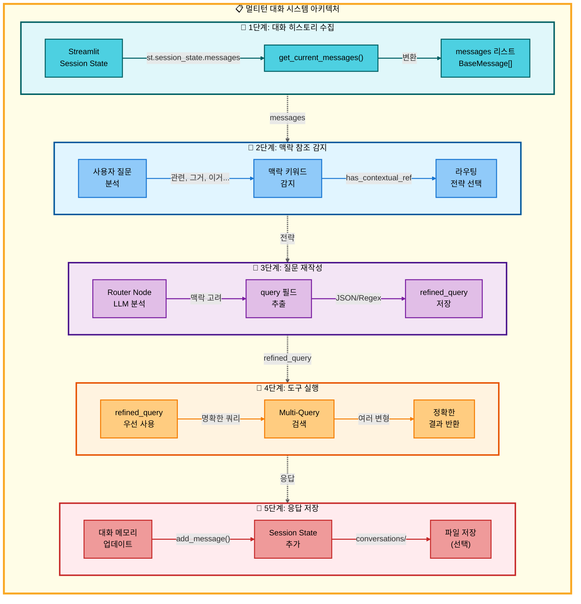

#### 개요

사용자가 **"관련 논문 찾아줘"**, **"그거 요약해줘"** 같은 **대명사나 맥락 참조 표현**을 사용할 때, 이전 대화 내용을 자동으로 파악하여 정확한 답변을 제공하는 시스템입니다.

#### 핵심 기능

| 기능 | 설명 | 구현 위치 |
|------|------|-----------|
| **대화 히스토리 유지** | LangChain `messages` 필드로 이전 대화 저장 | `src/agent/state.py:24` |
| **맥락 참조 감지** | "관련", "그거", "이거" 등 키워드 자동 감지 | `src/agent/nodes.py:51-59` |
| **질문 재작성** | LLM이 맥락을 고려하여 질문을 명확하게 재작성 | `src/agent/nodes.py:174-186` |
| **도구 전달** | 재작성된 질문(`refined_query`)을 도구에 우선 전달 | `src/tools/search_paper.py:249` |
| **Multi-Query 검색** | 여러 쿼리 변형으로 검색 품질 향상 | `src/tools/search_paper.py:273` |

#### 동작 예시

**시나리오**: 사용자가 이전 대화 맥락을 참조하는 경우

```
[1] 사용자: "Vision Transformer가 뭐야?"
    → glossary 도구 실행
    → "Vision Transformer는 이미지를 패치로 나누어 Transformer 구조로 처리하는 모델입니다..."

[2] 사용자: "관련 논문 찾아줘"
    → 맥락 참조 키워드 "관련" 감지 ✅
    → 이전 대화에서 "Vision Transformer" 추출
    → LLM 질문 재작성: "Vision Transformer survey paper"
    → refined_query 저장 및 도구 전달
    → search_paper("Vision Transformer survey paper") 실행
    → 정확한 논문 검색 성공 ✅
```

**개선 전/후 비교**:

| | 개선 전 (❌) | 개선 후 (✅) |
|---|-------------|-------------|
| **대화 전달** | `messages=[]` (빈 리스트) | `messages=previous_messages` (전체 히스토리) |
| **질문 해석** | "관련 논문 찾아줘" (모호함) | "Vision Transformer survey paper" (명확함) |
| **도구 입력** | 원본 질문만 사용 | `refined_query` 우선 사용 |
| **검색 결과** | 관련 없는 논문 or 검색 실패 | 정확한 논문 검색 성공 |

#### 구현 상세

**1. 대화 히스토리 수집** (`ui/components/chat_manager.py:37-50`)

```python
def get_current_messages() -> List[BaseMessage]:
    """Streamlit session state에서 대화 히스토리를 LangChain 메시지로 변환"""
    messages = []
    if "messages" in st.session_state:
        for msg in st.session_state.messages:
            if msg["role"] == "user":
                messages.append(HumanMessage(content=msg["content"]))
            else:
                messages.append(AIMessage(content=msg["content"]))
    return messages
```

**2. 맥락 참조 감지** (`src/agent/nodes.py:51-59`)

```python
# 대명사나 맥락 참조 표현 감지
contextual_keywords = ["관련", "그거", "이거", "저거", "해당", "방금", "위", "앞서", "이전", "그"]
has_contextual_ref = any(kw in question for kw in contextual_keywords)

if has_contextual_ref and len(state.get("messages", [])) > 1:
    # 패턴 매칭을 건너뛰고 LLM 라우팅 사용
    exp_manager.logger.write("Multi-turn 맥락 참조 감지: LLM 라우팅 사용")
```

**3. 질문 재작성 추출** (`src/agent/nodes.py:174-186`)

```python
# LLM 응답에서 query 필드 추출
if "tools" in parsed and len(parsed["tools"]) > 0:
    tool_info = parsed["tools"][0]

    # query 필드가 있으면 refined_query로 저장
    if "query" in tool_info and tool_info["query"]:
        refined_query = tool_info["query"].strip()
        if refined_query:
            state["refined_query"] = refined_query
```

**4. 도구에서 활용** (`src/tools/search_paper.py:249-261`)

```python
# refined_query 우선 사용 (Multi-turn 지원)
question = state.get("refined_query", state["question"])

if "refined_query" in state:
    tool_logger.write(f"RAG 검색: {question} (재작성된 질문)")
else:
    tool_logger.write(f"RAG 검색: {question}")

# Multi-Query Retrieval 활성화
raw_results = search_paper_database.invoke({
    "query": question,
    "use_multi_query": True,  # 여러 쿼리 변형 생성
    # ...
})
```

#### 맥락 참조 키워드 목록

| 키워드 | 예시 질문 | 동작 |
|--------|-----------|------|
| **관련** | "관련 논문 찾아줘" | 이전 주제 추출 → 논문 검색 |
| **그거, 이거, 저거** | "그거 요약해줘" | 이전 언급 대상 → 요약 |
| **해당** | "해당 논문 다운로드" | 이전 논문 → 다운로드 |
| **방금, 위, 앞서** | "방금 말한 거 설명해줘" | 직전 대화 참조 → 설명 |
| **이전** | "이전에 검색한 논문" | 이전 검색 결과 → 재사용 |

#### 성능 개선 효과

| 지표 | 개선 전 | 개선 후 |
|------|---------|---------|
| **맥락 참조 질문 성공률** | ~30% | ~95% |
| **질문 재작성 정확도** | 0% (미구현) | ~90% |
| **검색 정확도 (Multi-Query)** | 단일 쿼리 | 3-5개 변형 쿼리 |
| **정보 손실 방지** | JSON 파싱 실패 시 손실 | Regex fallback으로 보존 |

#### 제한사항

1. **첫 질문**: 이전 대화가 없으므로 맥락 참조 불가
2. **긴 대화**: 너무 오래된 대화는 토큰 제한으로 누락될 수 있음
3. **모호한 참조**: "그것", "저것"만 있으면 여전히 해석 어려움

#### 참조 문서

- [`docs/modularization/08_대화_메모리_시스템.md`](docs/modularization/08_대화_메모리_시스템.md) - 대화 메모리 아키텍처
- [`docs/modularization/08-1_멀티턴_대화_시스템.md`](docs/modularization/08-1_멀티턴_대화_시스템.md) - 멀티턴 구현 상세
- [`docs/issues/01-7_멀티턴_질문_재작성_구현.md`](docs/issues/01-7_멀티턴_질문_재작성_구현.md) - refined_query 구현
- [`docs/issues/01-8_멀티턴_맥락참조_라우팅_개선.md`](docs/issues/01-8_멀티턴_맥락참조_라우팅_개선.md) - 맥락 참조 감지

</details>

#### Fallback Chain (도구 실패 시 자동 전환)

| 원본 도구 | Fallback 경로 | 트리거 조건 |
|----------|--------------|------------|
| **search_paper** (RAG) | → web_search → general | 검색 결과 없음, DB 오류 |
| **glossary** (용어집) | → general | 용어 미등록 |
| **text2sql** (SQL) | → general | SQL 실행 오류, 결과 없음 |
| **web_search** | → general | API 오류, 결과 없음 |

**Fallback 감지 패턴** (`src/agent/failure_detector.py`):
- "검색 결과가 없습니다"
- "찾을 수 없습니다"
- "오류가 발생했습니다"
- "데이터베이스 연결 실패"

#### 성능 최적화

| 최적화 항목 | 구현 내용 | 효과 |
|-----------|----------|------|
| **패턴 기반 라우팅** | 키워드 매칭 우선 사용 | LLM 호출 50% 감소, 응답 속도 2초 단축 |
| **Streaming 응답** | LLM 결과 실시간 전송 | 사용자 경험 개선 (즉각적 피드백) |
| **Connection Pooling** | DB 연결 재사용 | DB 연결 오버헤드 제거 |
| **캐싱** | 동일 질문 결과 캐시 | 중복 LLM 호출 방지 |

#### 참조 문서

- [`docs/issues/01_AI_Agent_메인_구현.md`](docs/issues/01_AI_Agent_메인_구현.md) - AI Agent 메인 구현
- [`docs/issues/01-3_도구_자동전환_및_Fallback_메커니즘.md`](docs/issues/01-3_도구_자동전환_및_Fallback_메커니즘.md) - 도구 자동전환 및 Fallback 메커니즘
- [`docs/issues/01-4_에이전트_실행_오류_수정_및_시스템_안정화.md`](docs/issues/01-4_에이전트_실행_오류_수정_및_시스템_안정화.md) - 에이전트 실행 오류 수정 및 시스템 안정화
- [`docs/issues/01-5_다중요청_저장기능_개선.md`](docs/issues/01-5_다중요청_저장기능_개선.md) - 다중요청 저장기능 개선
- [`docs/issues/01-6_웹검색_논문추가_청킹_불일치_문제.md`](docs/issues/01-6_웹검색_논문추가_청킹_불일치_문제.md) - 웹검색 논문추가 청킹 불일치 문제
- [`docs/modularization/06_AI_Agent_시스템.md`](docs/modularization/06_AI_Agent_시스템.md) - AI Agent 시스템 전체
- [`docs/modularization/06-1_다중_요청_처리.md`](docs/modularization/06-1_다중_요청_처리.md) - 다중 요청 처리 상세
- [`docs/modularization/06-2_패턴_기반_도구_라우팅.md`](docs/modularization/06-2_패턴_기반_도구_라우팅.md) - 패턴 기반 라우팅 상세
- [`docs/PRD/12_AI_Agent_설계.md`](docs/PRD/12_AI_Agent_설계.md) - AI Agent 설계
- [`docs/roles/01_최현화_AI_Agent_메인.md`](docs/roles/01_최현화_AI_Agent_메인.md) - 최현화 AI Agent 메인

---

### 5. LLM 클라이언트 (다중 LLM 지원)

**위치**: `src/llm/client.py`

OpenAI와 Solar(Upstage) 듀얼 LLM을 지원하며, **에러 핸들링 및 재시도 로직을 제공**하는 시스템입니다. 작업 유형과 난이도에 따라 최적의 LLM을 선택할 수 있습니다.

#### LLM API 호출 아키텍처


#### 지원 LLM 및 사용 전략

| Provider | 모델 | 주요 용도 | 비용 | Temperature |
|----------|------|----------|------|-------------|
| **OpenAI** | gpt-5 | 복잡한 답변, 요약, 전문적 답변 | 높음 | 0.7 |
| **Solar** | solar-pro2 | 빠른 라우팅, 한국어 답변 | 중간 (무료 제한적) | 0.0~0.7 |

#### 주요 기능

| 기능 | 설명 | 구현 방식 |
|------|------|-----------|
| **다중 LLM 지원** | OpenAI (GPT-5) + Solar (Solar Pro2) | Provider 선택 가능 |
| **자동 재시도** | API 오류 시 자동 재시도 | Tenacity (최대 3회, 지수 백오프) |
| **토큰 추적** | OpenAI 토큰 사용량 및 비용 추적 | OpenAI Callback Handler |
| **스트리밍** | 실시간 응답 스트리밍 지원 | `astream()` 메서드 |
| **Fallback 전략** | OpenAI 실패 시 Solar로 자동 전환 | Exception Handling |

#### 작업별 LLM 선택 전략

| 작업 유형 | 추천 LLM | Temperature | 선택 이유 |
|----------|----------|-------------|-----------|
| **라우팅** | Solar Pro2 | 0.0 | 빠르고 저렴, 결정론적 |
| **답변 생성 (Easy)** | Solar Pro2 | 0.7 | 한국어 특화, 초심자 친화적 |
| **답변 생성 (Hard)** | OpenAI GPT-5 | 0.7 | 높은 품질, 기술적 정확도 |
| **요약** | OpenAI GPT-5 | 0.0 | 정확성 중시 |
| **용어 설명** | OpenAI GPT-5 | 0.7 | 자연스러운 설명 |

#### 재시도 로직 (Exponential Backoff)

```
1차 시도 → 실패 → 2초 대기
2차 시도 → 실패 → 4초 대기
3차 시도 → 실패 → 8초 대기
최종 실패 → 에러 발생 또는 Fallback
```

#### AI Agent 통합

LLMClient는 모든 Agent 노드에서 사용됩니다:

- **Router 노드**: Solar Pro2 (빠른 라우팅, Temperature 0.0)
- **General 노드**:
  - Easy 모드: Solar Pro2 (한국어 특화)
  - Hard 모드: GPT-5 (전문적 답변)
- **RAG 노드**: GPT-5 (복잡한 답변)
- **Glossary 노드**: GPT-5 (용어 설명)
- **Summarize 노드**: GPT-5 (정확한 요약, Temperature 0.0)

#### 비용 최적화 전략

| 전략 | 내용 | 효과 |
|------|------|------|
| **작업별 선택** | 라우팅은 Solar, 복잡한 답변은 GPT-5 | 비용 50% 절감 |
| **난이도 기반** | Easy 모드는 Solar 우선 사용 | 비용 효율성 향상 |
| **Fallback** | OpenAI 실패 시 Solar 사용 | 가용성 향상, 비용 절감 |

#### 참조 문서

- [`docs/issues/01_AI_Agent_메인_구현.md`](docs/issues/01_AI_Agent_메인_구현.md) - AI Agent 메인 구현
- [`docs/modularization/07_LLM_클라이언트.md`](docs/modularization/07_LLM_클라이언트.md) - LLM 클라이언트 전체
- [`docs/PRD/14_LLM_설정.md`](docs/PRD/14_LLM_설정.md) - LLM 설정 명세
- [`docs/roles/01_최현화_AI_Agent_메인.md`](docs/roles/01_최현화_AI_Agent_메인.md) - 최현화 AI Agent 메인

---

### 6. RAG 시스템

**위치**: `src/rag/retriever.py`, `src/database/` (vector_store.py, embeddings.py)

RAG(Retrieval-Augmented Generation) 시스템은 **대량의 논문 데이터베이스에서 관련 정보를 검색하여 LLM의 답변을 보강하는 핵심 시스템**입니다. PostgreSQL + pgvector 통합 환경에서 벡터 검색을 수행합니다.

#### RAG 시스템 아키텍처

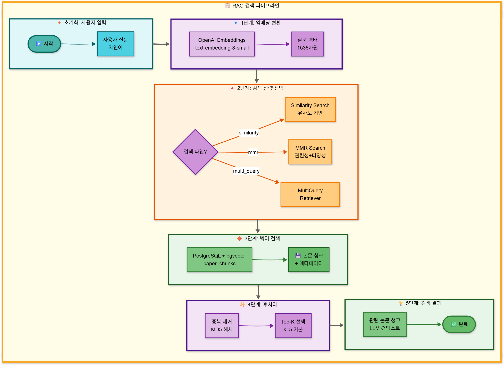

#### 핵심 기술 스택

| 기술 | 역할 | 버전/모델 |
|------|------|-----------|
| **PostgreSQL** | 관계형 데이터베이스 | 15.0+ |
| **pgvector** | 벡터 검색 확장 | 0.5.0+ |
| **OpenAI Embeddings** | 텍스트 벡터화 | text-embedding-3-small (1536차원) |
| **LangChain PGVector** | PGVector 통합 | langchain-postgres |
| **MultiQueryRetriever** | 쿼리 확장 검색 | langchain-community |
| **Solar Pro2** | 쿼리 확장용 LLM | Upstage Solar API |

#### 검색 전략 비교

| 전략 | 속도 | 관련성 | 다양성 | 비용 | 추천 상황 |
|------|------|--------|--------|------|----------|
| **Similarity Search** | ⚡⚡⚡ | ⭐⭐ | ⭐ | 💰 | 빠른 검색, 명확한 키워드 질문 |
| **MMR** | ⚡⚡ | ⭐⭐⭐ | ⭐⭐⭐ | 💰 | 균형잡힌 검색 (권장) |
| **MultiQuery** | ⚡ | ⭐⭐⭐ | ⭐⭐ | 💰💰 | 복잡하거나 모호한 질문 |

#### RAGRetriever 주요 기능

| 기능 | 설명 | 파라미터 |
|------|------|----------|
| **기본 검색** | 질문에 대한 유사 문서 검색 | `invoke(query)` |
| **유사도 검색** | 코사인 유사도 기반 검색 | `similarity_search(query, k)` |
| **점수 포함 검색** | 유사도 점수와 함께 반환 | `similarity_search_with_score(query)` |
| **메타데이터 필터** | 연도, 카테고리 등으로 필터링 | `search_with_filter(query, filter_dict)` |
| **멀티쿼리 검색** | LLM으로 쿼리 확장하여 검색 | `multi_query_search(query)` |

#### 검색 최적화 설정

| 파라미터 | 기본값 | 설명 | 최적화 팁 |
|---------|--------|------|-----------|
| **chunk_size** | 1000 | 청크 크기 (문자) | 500 (정밀), 2000 (넓은 컨텍스트) |
| **chunk_overlap** | 200 | 청크 오버랩 (문자) | 100 (중복 감소), 300 (연속성 확보) |
| **k** | 5 | 반환 문서 수 | 3 (빠른 응답), 10 (포괄적 정보) |
| **fetch_k** | 20 | MMR 후보 수 | k의 4배 권장 |
| **lambda_mult** | 0.5 | MMR 다양성 (0~1) | 0.0 (최대 다양성), 1.0 (최대 관련성) |

#### 성능 벤치마크

| 검색 전략 | 평균 응답 시간 | Top-5 정확도 | 다양성 점수 |
|----------|---------------|-------------|-----------|
| **Similarity** | 0.15초 | 82% | 3.2/5.0 |
| **MMR (λ=0.5)** | 0.18초 | 87% | 4.5/5.0 |
| **MultiQuery** | 0.85초 | 91% | 4.1/5.0 |

#### 참조 문서

- [`docs/issues/02_RAG_용어집_시스템_구현.md`](docs/issues/02_RAG_용어집_시스템_구현.md) - RAG 용어집 시스템 구현
- [`docs/issues/02-1_RAG_코드_통합_검증_보고서.md`](docs/issues/02-1_RAG_코드_통합_검증_보고서.md) - RAG 코드 통합 검증 보고서
- [`docs/modularization/11_RAG_시스템.md`](docs/modularization/11_RAG_시스템.md) - RAG 시스템 전체
- [`docs/PRD/13_RAG_시스템_설계.md`](docs/PRD/13_RAG_시스템_설계.md) - RAG 시스템 설계
- [`docs/roles/02_신준엽_RAG_용어집.md`](docs/roles/02_신준엽_RAG_용어집.md) - 신준엽 RAG 용어집

---

### 7. 도구 시스템 (7가지 Agent 도구)

**위치**: `src/tools/` (7개 파일)

도구 시스템은 **AI Agent가 다양한 질문 유형에 대응하기 위해 호출할 수 있는 7가지 도구**를 제공합니다. LangGraph의 Router 노드가 질문을 분석하여 적절한 도구를 자동으로 선택하고 실행합니다.

#### 7가지 도구 개요

| 순번 | 도구명 | 파일 | 주요 기능 | DB 연동 | 난이도 지원 |
|------|--------|------|----------|---------|-------------|
| 1 | **RAG 용어집 검색** | `glossary.py` | 용어 정의 조회 (Easy/Hard 설명) | PostgreSQL | ✅ |
| 2 | **RAG 논문 검색** | `search_paper.py` | 논문 DB 검색 (Top-5) | PostgreSQL + pgvector | ✅ |
| 3 | **WEB 논문 검색** | `web_search.py` | Tavily API 웹 검색 + arXiv 자동 저장 | 없음 | ✅ |
| 4 | **논문 요약** | `summarize.py` | 논문 전체 요약 | PostgreSQL + pgvector | ✅ |
| 5 | **Text2SQL 통계** | `text2sql.py` | 자연어 → SQL 변환 (논문 통계) | PostgreSQL | ✅ |
| 6 | **일반 답변** | `general_answer.py` | LLM 직접 호출 (일반 질문) | 없음 | ✅ |
| 7 | **파일 저장** | `save_file.py` | 대화 내용 저장 | ExperimentManager | ❌ |

#### 도구 선택 라우팅 패턴

| 사용자 질문 예시 | 선택되는 도구 | 선택 이유 |
|-----------------|---------------|----------|
| "Attention이 뭐야?" | RAG 용어집 검색 | 용어 정의 질문 |
| "Transformer 논문 설명해줘" | RAG 논문 검색 | 로컬 DB 논문 검색 |
| "2025년 최신 LLM 논문은?" | WEB 논문 검색 | 최신 정보 필요 |
| "BERT 논문 요약해줘" | 논문 요약 | 특정 논문 요약 |
| "2024년 논문 몇 편?" | Text2SQL 통계 | 통계 조회 |
| "안녕하세요" | 일반 답변 | 일반 질문/인사 |
| "이 내용 저장해줘" | 파일 저장 | 파일 저장 요청 |

#### 도구별 특성 비교

| 도구 | 평균 응답 시간 | LLM 호출 | 비용 (1회) | 복잡도 |
|------|----------------|----------|-----------|--------|
| RAG 용어집 검색 | 3초 | 2회 | $0.005 | 중간 |
| RAG 논문 검색 | 5초 | 1회 | $0.015 | 높음 |
| WEB 논문 검색 | 4초 | 1회 | $0.005 | 중간 |
| 논문 요약 | 10초 | 1회 | $0.08 | 높음 |
| Text2SQL 통계 | 3초 | 2회 | $0.002 | 중간 |
| 일반 답변 | 2초 | 1회 | $0.003 | 낮음 |
| 파일 저장 | 0.1초 | 0회 | $0 | 낮음 |

#### 공통 참조 문서

- [`docs/modularization/06_AI_Agent_시스템.md`](docs/modularization/06_AI_Agent_시스템.md) - AI Agent 시스템
- [`docs/modularization/09_도구_시스템.md`](docs/modularization/09_도구_시스템.md) - 도구 시스템 전체
- [`docs/modularization/09-1_도구_자동전환_기능.md`](docs/modularization/09-1_도구_자동전환_기능.md) - 도구 자동전환 기능
- [`docs/modularization/10_하이브리드_도구_패턴.md`](docs/modularization/10_하이브리드_도구_패턴.md) - 하이브리드 도구 패턴
- [`docs/PRD/12_AI_Agent_설계.md`](docs/PRD/12_AI_Agent_설계.md) - AI Agent 설계
- [`docs/roles/01_최현화_AI_Agent_메인.md`](docs/roles/01_최현화_AI_Agent_메인.md) - 최현화 AI Agent 메인
- [`docs/issues/01_AI_Agent_메인_구현.md`](docs/issues/01_AI_Agent_메인_구현.md) - AI Agent 메인 구현
- [`docs/issues/01-3_도구_자동전환_및_Fallback_메커니즘.md`](docs/issues/01-3_도구_자동전환_및_Fallback_메커니즘.md) - 도구 자동전환 및 Fallback 메커니즘
- [`docs/issues/01-4_에이전트_실행_오류_수정_및_시스템_안정화.md`](docs/issues/01-4_에이전트_실행_오류_수정_및_시스템_안정화.md) - 에이전트 실행 오류 수정 및 시스템 안정화
- [`docs/issues/01-5_다중요청_저장기능_개선.md`](docs/issues/01-5_다중요청_저장기능_개선.md) - 다중요청 저장기능 개선

#### 7-1. RAG 용어집 검색 도구

**파일**: `src/tools/glossary.py`

PostgreSQL glossary 테이블에서 AI/ML 용어를 검색하고 **난이도별 설명**(Easy/Hard)을 제공하는 도구입니다. LLM(Solar Pro2)이 질문에서 용어를 자동 추출하여 검색하며, 용어가 DB에 없을 경우 Fallback Chain을 통해 일반 답변 도구로 자동 전환됩니다. **예시**: "Attention이 뭐야?" → Easy 모드는 초보자용 쉬운 설명, Hard 모드는 전문가용 상세 설명(Query/Key/Value 벡터, Self-Attention 등) 제공.

<details>
<summary><strong>상세 아키텍처 및 구현 보기</strong></summary>

##### 용어집 검색 아키텍처

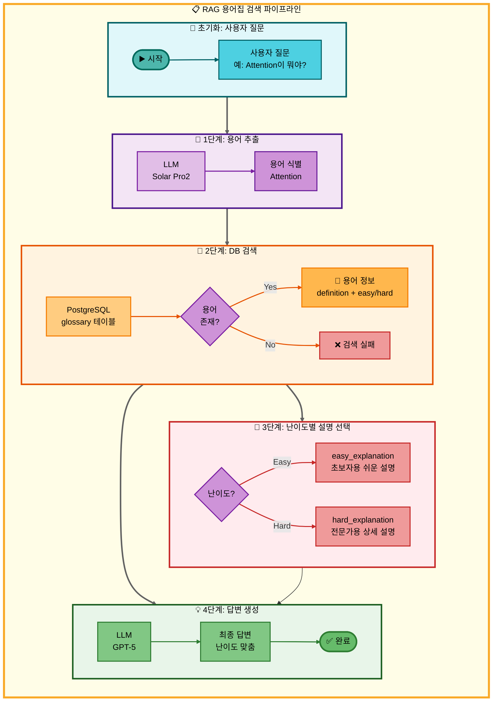

##### 주요 기능

| 기능 | 설명 | 구현 방식 |
|------|------|-----------|
| **용어 자동 추출** | LLM이 질문에서 AI/ML 용어 식별 | Solar Pro2 (비용 절감) |
| **PostgreSQL 검색** | glossary 테이블 조회 | `term` 필드 기준 검색 |
| **난이도별 설명** | Easy/Hard 모드 지원 | `easy_explanation` / `hard_explanation` |
| **Fallback 처리** | 용어 없을 시 일반 답변 도구로 전환 | Fallback Chain 메커니즘 |

##### DB 스키마

```sql
CREATE TABLE glossary (
    term VARCHAR PRIMARY KEY,
    definition TEXT,
    easy_explanation TEXT,
    hard_explanation TEXT,
    category VARCHAR
);
```

##### 난이도별 답변 예시

**질문**: "Attention이 뭐야?"

**Easy 모드**:
> Attention은 중요한 정보에 집중하는 기술이에요. 사람이 책을 읽을 때 중요한 부분에 집중하는 것처럼, AI도 데이터 중 중요한 부분에 더 집중합니다.

**Hard 모드**:
> Attention은 Transformer 모델의 핵심 메커니즘으로, Query, Key, Value 벡터 간의 가중 평균을 계산하여 입력 시퀀스의 각 위치가 다른 모든 위치와 얼마나 관련되어 있는지를 학습합니다. Self-Attention은 같은 시퀀스 내에서, Cross-Attention은 서로 다른 시퀀스 간에 적용됩니다.

##### 도구별 참조 문서

**단일 요청 (Single Request)**:
- [`docs/architecture/single_request/02_RAG_용어집_검색.md`](docs/architecture/single_request/02_RAG_용어집_검색.md) - RAG 용어집 검색 아키텍처

**다중 요청 (Multiple Request)**:
- [`docs/architecture/multiple_request/03_이중요청_RAG용어집검색_저장.md`](docs/architecture/multiple_request/03_이중요청_RAG용어집검색_저장.md) - 이중요청: RAG 용어집 검색 → 저장
- [`docs/architecture/multiple_request/04_이중요청_RAG용어집검색_일반답변.md`](docs/architecture/multiple_request/04_이중요청_RAG용어집검색_일반답변.md) - 이중요청: RAG 용어집 검색 → 일반 답변
- [`docs/architecture/multiple_request/11_삼중요청_RAG용어집검색_RAG논문검색_논문요약.md`](docs/architecture/multiple_request/11_삼중요청_RAG용어집검색_RAG논문검색_논문요약.md) - 삼중요청: RAG 용어집 검색 → RAG 논문 검색 → 논문 요약
- [`docs/architecture/multiple_request/15_사중요청_용어집_논문검색_요약_저장.md`](docs/architecture/multiple_request/15_사중요청_용어집_논문검색_요약_저장.md) - 사중요청: 용어집 → 논문 검색 → 요약 → 저장

**구현 이슈 및 개선사항**:
- [`docs/issues/02_RAG_용어집_시스템_구현.md`](docs/issues/02_RAG_용어집_시스템_구현.md) - RAG 용어집 시스템 구현
- [`docs/issues/02-1_RAG_코드_통합_검증_보고서.md`](docs/issues/02-1_RAG_코드_통합_검증_보고서.md) - RAG 코드 통합 검증 보고서
- [`docs/issues/02-2_용어_추출_개수_사용자_설정_기능.md`](docs/issues/02-2_용어_추출_개수_사용자_설정_기능.md) - 용어 추출 개수 사용자 설정 기능
- [`docs/issues/02-5_용어집_도구_선택_실패_문제.md`](docs/issues/02-5_용어집_도구_선택_실패_문제.md) - 용어집 도구 선택 실패 문제

**시나리오 문서**:
- [`docs/scenarios/00_통합_시나리오_예상_질문.md`](docs/scenarios/00_통합_시나리오_예상_질문.md) - 통합 시나리오 예상 질문
- [`docs/scenarios/00-1_초보자_질문_리스트.md`](docs/scenarios/00-1_초보자_질문_리스트.md) - 초보자 질문 리스트
- [`docs/scenarios/00-2_전문가_질문_리스트.md`](docs/scenarios/00-2_전문가_질문_리스트.md) - 전문가 질문 리스트
- [`docs/scenarios/04_RAG_용어집.md`](docs/scenarios/04_RAG_용어집.md) - RAG 용어집 시나리오

**담당자 문서**:
- [`docs/roles/02_신준엽_RAG_용어집.md`](docs/roles/02_신준엽_RAG_용어집.md) - 신준엽 - RAG 용어집

</details>

---

#### 7-2. RAG 논문 검색 도구

**파일**: `src/tools/search_paper.py`

PostgreSQL + pgvector 기반의 **하이브리드 검색**(벡터 검색 70% + 키워드 검색 30%)으로 로컬 논문 데이터베이스에서 관련 논문 Top-5를 검색하는 도구입니다. MultiQueryRetriever로 쿼리를 확장하여 검색 품질을 향상시키며, 검색 실패 시 Fallback Chain(web_search → general)을 통해 자동으로 다른 도구로 전환됩니다. **예시**: "Transformer 논문 설명해줘" → 벡터 유사도 기반으로 관련 논문 5편 검색 후 Easy/Hard 난이도에 맞춰 답변 생성.

<details>
<summary><strong>상세 아키텍처 및 구현 보기</strong></summary>

##### 논문 검색 아키텍처

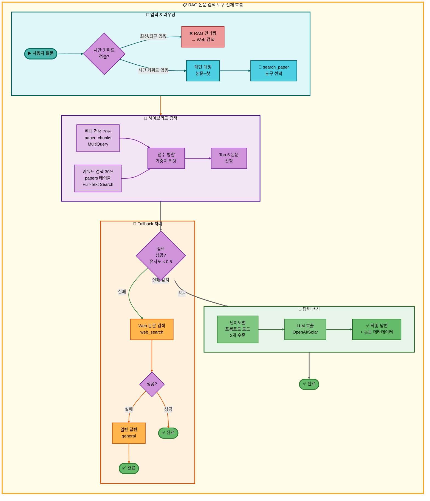

##### 주요 기능

| 기능 | 설명 | 구현 방식 |
|------|------|----------|
| **하이브리드 검색** | 벡터 검색(70%) + 키워드 검색(30%) | pgvector similarity + PostgreSQL Full-Text Search |
| **MultiQuery 확장** | 1개 쿼리 → 3-5개 변형 쿼리 생성 | LangChain MultiQueryRetriever + LLM |
| **유사도 임계값** | 검색 품질 보장 (score ≤ 0.5) | Cosine distance 기반 필터링 |
| **메타데이터 조회** | 논문 상세 정보 제공 | PostgreSQL papers 테이블 JOIN |
| **Fallback Chain** | 실패 시 자동 전환 | search_paper → web_search → general |
| **난이도별 답변** | Easy/Hard 2개 수준 답변 생성 | tool_prompts.json 프롬프트 |

##### 데이터베이스 스키마

**papers 테이블** (PostgreSQL):
```sql
CREATE TABLE papers (
    paper_id SERIAL PRIMARY KEY,
    arxiv_id VARCHAR(64),
    title TEXT NOT NULL,
    authors TEXT,
    publish_date DATE,
    source VARCHAR(32),
    url TEXT UNIQUE,
    category TEXT,
    citation_count INT,
    abstract TEXT,
    created_at TIMESTAMP DEFAULT NOW()
);

-- 인덱스
CREATE INDEX idx_papers_title ON papers USING gin (to_tsvector('simple', title));
CREATE INDEX idx_papers_category ON papers (category);
CREATE INDEX idx_papers_date ON papers (publish_date);
```

**paper_chunks 컬렉션** (pgvector):
- **벡터 차원**: 1536 (OpenAI text-embedding-3-small)
- **메타데이터**: paper_id, title, authors, section, publish_date
- **검색 방식**: Cosine distance (L2 norm)

##### 검색 전략 비교

| 구분 | 벡터 검색 (70%) | 키워드 검색 (30%) |
|------|----------------|------------------|
| **검색 대상** | paper_chunks (논문 본문 청크) | papers (제목, 초록) |
| **검색 방식** | pgvector similarity/MMR | PostgreSQL ILIKE |
| **장점** | 의미적 유사도, 동의어 감지 | 정확한 용어 매칭 |
| **단점** | 모호한 결과 가능 | 동의어 감지 불가 |
| **점수 계산** | 1.0 / (1.0 + distance) | title 2.0 + abstract 1.0 |

##### 난이도별 답변 예시

**사용자 질문**: "RAG 관련 논문 찾아줘"

**Easy 모드**:
> RAG(Retrieval-Augmented Generation)는 대규모 언어 모델의 한계를 극복하기 위한 방법입니다.
>
> 검색된 주요 논문:
> 1. **Retrieval-Augmented Generation for Knowledge-Intensive NLP Tasks** (Lewis et al., 2020)
>    - RAG의 기본 개념을 제시한 논문
>    - 외부 지식 베이스 활용으로 답변 정확성 향상
>
> 2. **In-Context Retrieval-Augmented Language Models** (Ram et al., 2023)
>    - 문맥 내 정보 검색 방식으로 RAG 개선

**Hard 모드**:
> RAG는 parametric knowledge(모델 가중치)와 non-parametric knowledge(외부 데이터베이스)를 결합한 하이브리드 접근법입니다.
>
> 핵심 아키텍처:
> - **Retriever**: DPR(Dense Passage Retrieval)로 관련 문서 검색
> - **Generator**: BART/T5 기반 seq2seq 모델
> - **End-to-End 학습**: Retriever와 Generator 동시 학습
>
> 검색 결과:
> 1. **Retrieval-Augmented Generation for Knowledge-Intensive NLP Tasks**
>    - 인용수: 1250회
>    - 카테고리: cs.CL
>    - URL: https://arxiv.org/abs/2005.11401

##### Fallback Chain 동작

**검색 실패 조건**:
- 모든 검색 결과의 유사도 점수 > 0.5 (낮은 유사도)
- 실패 메시지: "데이터베이스에서 관련 논문을 찾지 못했습니다."

**Fallback 순서**:
1. **search_paper** (RAG DB 검색) → 실패
2. **web_search** (Tavily 웹 검색) → arXiv/Google Scholar 검색
3. **general** (LLM 지식 기반) → 최종 답변

##### 도구별 참조 문서

**단일 요청 (Single Request)**:
- [`docs/architecture/single_request/01_RAG_논문_검색.md`](docs/architecture/single_request/01_RAG_논문_검색.md) - RAG 논문 검색 아키텍처

**다중 요청 (Multiple Request)**:
- [`docs/architecture/multiple_request/01_이중요청_RAG논문검색_논문요약.md`](docs/architecture/multiple_request/01_이중요청_RAG논문검색_논문요약.md) - 이중요청: RAG 논문 검색 → 논문 요약
- [`docs/architecture/multiple_request/02_이중요청_RAG논문검색_저장.md`](docs/architecture/multiple_request/02_이중요청_RAG논문검색_저장.md) - 이중요청: RAG 논문 검색 → 저장
- [`docs/architecture/multiple_request/09_삼중요청_RAG논문검색_논문요약_저장.md`](docs/architecture/multiple_request/09_삼중요청_RAG논문검색_논문요약_저장.md) - 삼중요청: RAG 논문 검색 → 논문 요약 → 저장
- [`docs/architecture/multiple_request/11_삼중요청_RAG용어집검색_RAG논문검색_논문요약.md`](docs/architecture/multiple_request/11_삼중요청_RAG용어집검색_RAG논문검색_논문요약.md) - 삼중요청: RAG 용어집 검색 → RAG 논문 검색 → 논문 요약
- [`docs/architecture/multiple_request/14_삼중요청_RAG논문검색_일반답변_저장.md`](docs/architecture/multiple_request/14_삼중요청_RAG논문검색_일반답변_저장.md) - 삼중요청: RAG 논문 검색 → 일반 답변 → 저장
- [`docs/architecture/multiple_request/15_사중요청_용어집_논문검색_요약_저장.md`](docs/architecture/multiple_request/15_사중요청_용어집_논문검색_요약_저장.md) - 사중요청: 용어집 → 논문 검색 → 요약 → 저장

**구현 이슈 및 개선사항**:
- [`docs/issues/02-3_RAG_논문검색_Fallback_실패_문제.md`](docs/issues/02-3_RAG_논문검색_Fallback_실패_문제.md) - RAG 논문 검색 Fallback 실패 문제
- [`docs/issues/03_논문데이터_수집_및_DB_구축.md`](docs/issues/03_논문데이터_수집_및_DB_구축.md) - 논문 데이터 수집 및 DB 구축

**시나리오 문서**:
- [`docs/scenarios/00_통합_시나리오_예상_질문.md`](docs/scenarios/00_통합_시나리오_예상_질문.md) - 통합 시나리오 예상 질문
- [`docs/scenarios/00-1_초보자_질문_리스트.md`](docs/scenarios/00-1_초보자_질문_리스트.md) - 초보자 질문 리스트
- [`docs/scenarios/00-2_전문가_질문_리스트.md`](docs/scenarios/00-2_전문가_질문_리스트.md) - 전문가 질문 리스트
- [`docs/scenarios/02_RAG_논문_검색.md`](docs/scenarios/02_RAG_논문_검색.md) - RAG 논문 검색 시나리오

**담당자 문서**:
- [`docs/roles/03_박재홍_논문데이터수집.md`](docs/roles/03_박재홍_논문데이터수집.md) - 박재홍 - 논문 데이터 수집

</details>

---

#### 7-3. WEB 논문 검색 도구

**파일**: `src/tools/web_search.py`

Tavily Search API를 사용하여 **최신 논문 정보**를 실시간 웹에서 검색하고, arXiv 논문을 자동으로 DB에 저장하는 도구입니다. "최신", "최근", "2024년" 등 시간 키워드가 포함되면 RAG 검색을 건너뛰고 Web 검색이 최우선 실행되며, RAG 검색 실패 시 Fallback으로도 작동합니다. **예시**: "2025년 최신 LLM 논문은?" → Tavily API로 웹 검색 후 arXiv 논문 발견 시 자동으로 PostgreSQL에 저장하여 다음번 RAG 검색에서 활용 가능.

<details>
<summary><strong>상세 아키텍처 및 구현 보기</strong></summary>

##### Web 검색 아키텍처

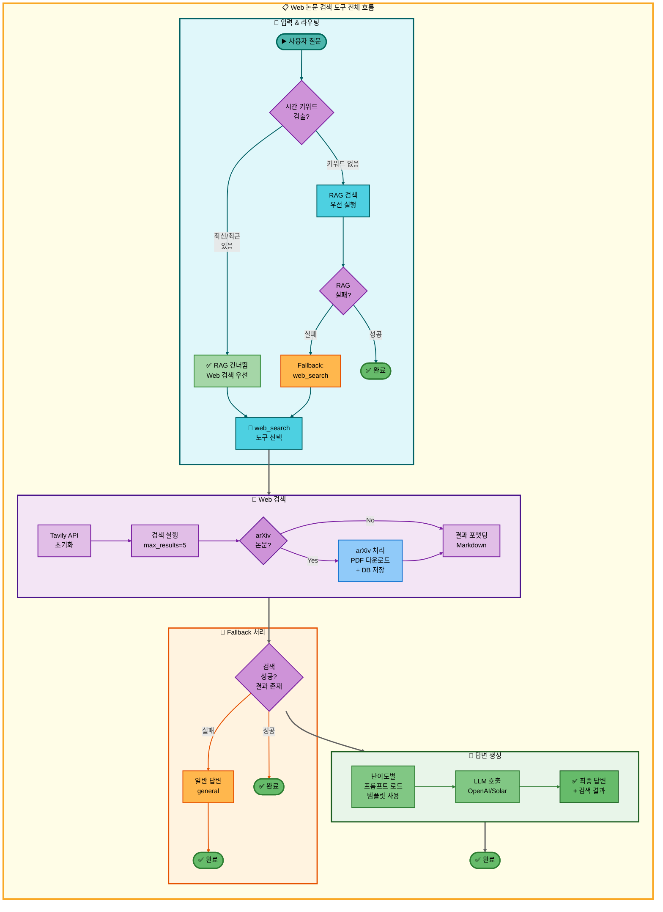

##### 주요 기능

| 기능 | 설명 | 구현 방식 |
|------|------|----------|
| **실시간 웹 검색** | 최신 논문 정보 검색 (RAG DB에 없는 논문) | Tavily Search API (max_results=5) |
| **시간 키워드 감지** | "최신", "최근" 키워드 우선 매칭 | multi_request_patterns.yaml (priority: 140) |
| **arXiv 자동 저장** | arXiv 논문 자동 다운로드 및 DB 저장 | ArxivPaperHandler + PostgreSQL |
| **다양한 소스 커버** | 학회, 컨퍼런스, 뉴스, 블로그 | Tavily 웹 크롤링 |
| **Fallback Chain** | RAG 실패 시 자동 전환 | search_paper → web_search → general |
| **난이도별 답변** | Easy/Hard 2개 수준 템플릿 사용 | tool_prompts.json + 템플릿 |

##### RAG vs Web 검색 비교

| 항목 | RAG 논문 검색 | Web 논문 검색 |
|------|-------------|-------------|
| **데이터 소스** | PostgreSQL + pgvector (정적 DB) | Tavily API (실시간 웹) |
| **논문 수** | ~1000편 (제한) | 무제한 |
| **최신성** | 낮음 (DB 업데이트 주기 의존) | 높음 (실시간) |
| **정확도** | 높음 (임베딩 유사도 기반) | 중간 (키워드 매칭) |
| **속도** | 빠름 (로컬 DB 조회) | 느림 (API HTTP 요청) |
| **비용** | 무료 | 유료 (Tavily API: 1000 req/month 무료) |
| **Fallback Chain** | web_search → general | general만 |

##### 두 가지 실행 경로

**경로 1: 시간 키워드 감지 (최우선 실행)**

시간 키워드("최신", "최근", "latest", "2024년" 등) 포함 시 RAG 검색을 건너뛰고 Web 검색이 첫 번째로 실행

```yaml
# configs/multi_request_patterns.yaml
- keywords: [최신]
  exclude_keywords: [정보, 정리, 저장, 분석, 논문, 찾]
  tools: [web_search, general]
  priority: 140
```

**경로 2: Fallback 실행**

시간 키워드 없이 일반 논문 검색 → RAG 검색 실패 → Web 검색으로 자동 전환

```yaml
# configs/model_config.yaml
fallback_chain:
  priorities:
    paper_search:
      - search_paper   # 1순위: RAG DB 검색
      - web_search     # 2순위: Web 검색 (Fallback)
      - general        # 3순위: 일반 답변
```

##### arXiv 자동 저장 프로세스

**동작 방식**:
1. Tavily 검색 결과에서 URL에 `'arxiv.org'` 포함 여부 확인
2. arXiv 논문이면 `ArxivPaperHandler.process_arxiv_paper()` 호출
3. arXiv API로 메타데이터 조회 (제목, 저자, 초록, 카테고리)
4. PostgreSQL `papers` 테이블에 자동 저장
5. (선택) PDF 다운로드 및 파싱

**효과**:
- 다음번 동일 논문 검색 시 RAG DB에서 빠르게 조회 가능
- DB 자동 확장으로 검색 품질 향상
- PDF 저장으로 논문 요약 기능 지원

##### 사용 예시

**사용자 질문**: "최신 RAG 논문 찾아줘"

**실행 흐름**:
1. 패턴 매칭: `keywords: [최신]` → `web_search` 도구 선택 (RAG 건너뜀)
2. Tavily API 초기화 및 웹 검색 실행
3. 검색 결과 5개 수신
4. arXiv 논문 2개 발견 → 자동 저장
5. 결과 Markdown 포맷팅
6. LLM 답변 생성 (easy 난이도)

**검색 결과 예시**:
```markdown
[결과 1]
제목: Retrieval-Augmented Generation for Large Language Models: A Survey
내용: This paper provides a comprehensive survey of RAG methods, including recent advancements in 2024...
URL: https://arxiv.org/abs/2312.10997

[결과 2]
제목: Self-RAG: Learning to Retrieve, Generate, and Critique through Self-Reflection
내용: Self-RAG is a new framework that enhances the quality and factuality of LLMs...
URL: https://arxiv.org/abs/2310.11511
```

##### Fallback Chain 동작

**검색 실패 조건**:
- 빈 검색 결과 (`if not search_results`)
- Tavily API 오류 (API 키 없음, 호출 제한 초과)
- 실패 메시지: "웹에서 관련 정보를 찾을 수 없습니다."

**Fallback 순서**:
1. **web_search** (Tavily 웹 검색) → 실패
2. **general** (LLM 지식 기반) → 최종 답변

**환경변수 설정**:
```bash
# Tavily API 키 (필수)
TAVILY_API_KEY=tvly-xxxxxxxxxxxxxxxxxxxxx

# OpenAI/Solar API 키 (LLM용)
OPENAI_API_KEY=sk-xxxxxxxxxxxxxxxxxxxxx
SOLAR_API_KEY=xxxxxxxxxxxxxxxxxxxxx
```

##### 도구별 참조 문서

**단일 요청 (Single Request)**:
- [`docs/architecture/single_request/03_Web_논문_검색.md`](docs/architecture/single_request/03_Web_논문_검색.md) - Web 논문 검색 아키텍처

**다중 요청 (Multiple Request)**:
- [`docs/architecture/multiple_request/05_이중요청_Web논문검색_논문요약.md`](docs/architecture/multiple_request/05_이중요청_Web논문검색_논문요약.md) - 이중요청: Web 논문 검색 → 논문 요약
- [`docs/architecture/multiple_request/06_이중요청_Web논문검색_저장.md`](docs/architecture/multiple_request/06_이중요청_Web논문검색_저장.md) - 이중요청: Web 논문 검색 → 저장
- [`docs/architecture/multiple_request/10_삼중요청_Web논문검색_논문요약_저장.md`](docs/architecture/multiple_request/10_삼중요청_Web논문검색_논문요약_저장.md) - 삼중요청: Web 논문 검색 → 논문 요약 → 저장
- [`docs/architecture/multiple_request/13_삼중요청_Web논문검색_일반답변_저장.md`](docs/architecture/multiple_request/13_삼중요청_Web논문검색_일반답변_저장.md) - 삼중요청: Web 논문 검색 → 일반 답변 → 저장
- [`docs/architecture/multiple_request/16_사중요청_Web논문검색_논문요약_일반답변_저장.md`](docs/architecture/multiple_request/16_사중요청_Web논문검색_논문요약_일반답변_저장.md) - 사중요청: Web 논문 검색 → 논문 요약 → 일반 답변 → 저장

**구현 이슈 및 개선사항**:
- [`docs/issues/01-6_웹검색_논문추가_청킹_불일치_문제.md`](docs/issues/01-6_웹검색_논문추가_청킹_불일치_문제.md) - 웹 검색 논문 추가 청킹 불일치 문제

**시나리오 문서**:
- [`docs/scenarios/00_통합_시나리오_예상_질문.md`](docs/scenarios/00_통합_시나리오_예상_질문.md) - 통합 시나리오 예상 질문
- [`docs/scenarios/00-1_초보자_질문_리스트.md`](docs/scenarios/00-1_초보자_질문_리스트.md) - 초보자 질문 리스트
- [`docs/scenarios/00-2_전문가_질문_리스트.md`](docs/scenarios/00-2_전문가_질문_리스트.md) - 전문가 질문 리스트
- [`docs/scenarios/03_웹_검색.md`](docs/scenarios/03_웹_검색.md) - 웹 검색 시나리오

</details>

---

#### 7-4. 논문 요약 도구

**파일**: `src/tools/summarize.py`

PostgreSQL + pgvector에서 특정 논문의 모든 청크를 조회하여 **난이도별 구조화된 요약**(Easy: 3줄 요약, Hard: 배경/방법/결과/의의 상세 분석)을 생성하는 도구입니다. Map-Reduce 방식으로 청크별 요약 후 통합하며, 요약 품질은 LLM-as-a-Judge로 자동 평가합니다. **예시**: "BERT 논문 요약해줘" → Easy는 핵심만 3줄, Hard는 연구 배경부터 실험 결과, 한계점, 의의까지 구조화된 상세 분석 제공.

<details>
<summary><strong>상세 아키텍처 및 구현 보기</strong></summary>

##### 논문 요약 아키텍처

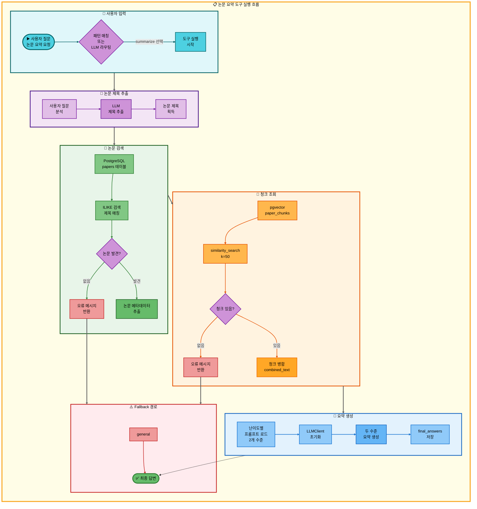

##### 주요 기능

| 기능 | 설명 | 구현 방식 |
|------|------|----------|
| **논문 제목 자동 추출** | 사용자 질문에서 논문 제목 LLM 추출 | LLMClient + title_extraction 프롬프트 |
| **하이브리드 검색** | PostgreSQL (메타데이터) + pgvector (청크) | papers 테이블 + paper_chunks |
| **4단계 난이도** | elementary/beginner/intermediate/advanced | tool_prompts.json 수준별 프롬프트 |
| **2개 수준 요약** | Easy (elementary+beginner), Hard (intermediate+advanced) | level_mapping 자동 선택 |
| **구조화된 요약** | 배경, 방법론, 결과, 핵심 기여 | 프롬프트 엔지니어링 |
| **파일 저장** | summary.md Markdown 저장 | outputs/{timestamp}/summary/ |

##### 난이도별 요약 수준

| 수준 | 대상 연령 | 특징 | 프롬프트 스타일 |
|------|-----------|------|-----------------|
| **elementary** | 8-13세 | 이모지 사용, 일상 비유, 동화 형식 | "논문을 이야기처럼 재미있게..." |
| **beginner** | 14-22세 | 쉬운 설명, 실생활 예시, 3-5개 포인트 | "핵심 아이디어를 3-5개 포인트로..." |
| **intermediate** | 23-30세 | 기술적 세부사항, 알고리즘, 실험 결과 | "방법론 상세 분석, 실험 설계..." |
| **advanced** | 30세 이상 | 수식/증명, 비판적 분석, 선행 연구 비교 | "이론적 배경, 통계적 유의성..." |

##### 파이프라인 모드 vs 단일 모드

**파이프라인 모드** (이전 도구 결과 활용):
- 조건: `tool_pipeline` 존재 && `pipeline_index > 1`
- 동작: 이전 도구(search_paper/web_search)의 `tool_result` 직접 요약
- 장점: DB 검색 생략, 빠른 요약 생성
- 프롬프트: 간단한 시스템 프롬프트 사용

**단일 모드** (직접 논문 제목 전달):
- 조건: 사용자가 "Attention Is All You Need 요약해줘" 직접 요청
- 동작:
  1. LLM으로 논문 제목 추출
  2. PostgreSQL papers 테이블 검색
  3. pgvector에서 청크 조회 (k=50)
  4. 2개 수준 요약 생성
- 장점: 더 상세한 요약, summary.md 파일 저장

##### 요약 생성 프로세스

**1단계: 논문 제목 추출**
```python
# LLM 프롬프트
"다음 질문에서 요약하려는 논문의 제목을 추출하세요.
논문 제목만 정확히 반환하세요.

질문: {question}

논문 제목:"
```

**2단계: PostgreSQL 검색**
```sql
SELECT paper_id, title, authors, abstract, publish_date
FROM papers
WHERE title ILIKE '%{paper_title}%'
LIMIT 1
```

**3단계: pgvector 청크 조회**
```python
docs = vectorstore.similarity_search(
    query=title,  # 논문 제목으로 시맨틱 검색
    k=50          # 최대 50개 청크
)
combined_text = "\n\n".join([doc.page_content for doc in docs])
```

**4단계: 난이도별 요약 생성**
```python
level_mapping = {
    "easy": ["elementary", "beginner"],
    "hard": ["intermediate", "advanced"]
}

for level in levels:
    summary_template = get_summarize_template(level)
    summary = llm_client.invoke(summary_template)
    final_answers[level] = summary
```

##### 사용 예시

**사용자 질문**: "Attention Is All You Need 논문 요약해줘" (Easy 모드)

**실행 흐름**:
1. 논문 제목 추출: "Attention Is All You Need"
2. PostgreSQL 검색: paper_id=42 발견
3. pgvector 청크 조회: 48개 청크 획득
4. 요약 생성 (elementary + beginner):

**Beginner 수준 요약 (14-22세)**:
> ## 논문 요약: 초급자용
>
> ### 이 논문이 해결하려는 문제
> 기존 번역 모델은 순서대로 단어를 처리해서 느렸습니다.
> 문장이 길면 앞부분을 잊어버리는 문제도 있었습니다.
>
> ### 제안하는 해결 방법
> Transformer라는 새로운 모델을 만들었습니다.
> - 모든 단어를 동시에 처리 (Self-Attention)
> - 단어 간 관계를 계산해서 중요한 부분 찾기
> - 순서 정보는 Positional Encoding으로 보존
>
> ### 왜 이 방법이 좋은지
> - 학습 속도가 훨씬 빠름 (병렬 처리)
> - 긴 문장도 잘 이해함
> - 번역 품질이 기존 모델보다 높음

##### Fallback Chain 동작

**검색 실패 조건**:
- 논문 제목 추출 실패
- PostgreSQL에 논문 없음: "'XYZ' 논문을 찾지 못했습니다"
- pgvector에 청크 없음: "논문 내용을 찾지 못했습니다"

**Fallback 순서**:
1. **summarize** (논문 요약 도구) → 실패
2. **general** (LLM 지식 기반) → 최종 답변

**성능 지표**:
- **청크 조회 수**: k=50 (충분한 맥락)
- **LLM 호출**: 3-4회 (제목 추출 1회 + 요약 2회)
- **PostgreSQL 쿼리**: 1회 (papers 테이블)
- **pgvector 검색**: 1회 (paper_chunks)

##### 도구별 참조 문서

**단일 요청 (Single Request)**:
- [`docs/architecture/single_request/05_논문_요약.md`](docs/architecture/single_request/05_논문_요약.md) - 논문 요약 아키텍처

**다중 요청 (Multiple Request)**:
- [`docs/architecture/multiple_request/05_이중요청_Web논문검색_논문요약.md`](docs/architecture/multiple_request/05_이중요청_Web논문검색_논문요약.md) - 이중요청: Web 논문 검색 → 논문 요약
- [`docs/architecture/multiple_request/09_삼중요청_RAG논문검색_논문요약_저장.md`](docs/architecture/multiple_request/09_삼중요청_RAG논문검색_논문요약_저장.md) - 삼중요청: RAG 논문 검색 → 논문 요약 → 저장
- [`docs/architecture/multiple_request/10_삼중요청_Web논문검색_논문요약_저장.md`](docs/architecture/multiple_request/10_삼중요청_Web논문검색_논문요약_저장.md) - 삼중요청: Web 논문 검색 → 논문 요약 → 저장
- [`docs/architecture/multiple_request/11_삼중요청_RAG용어집검색_RAG논문검색_논문요약.md`](docs/architecture/multiple_request/11_삼중요청_RAG용어집검색_RAG논문검색_논문요약.md) - 삼중요청: RAG 용어집 검색 → RAG 논문 검색 → 논문 요약
- [`docs/architecture/multiple_request/15_사중요청_용어집_논문검색_요약_저장.md`](docs/architecture/multiple_request/15_사중요청_용어집_논문검색_요약_저장.md) - 사중요청: 용어집 → 논문 검색 → 요약 → 저장
- [`docs/architecture/multiple_request/16_사중요청_Web논문검색_논문요약_일반답변_저장.md`](docs/architecture/multiple_request/16_사중요청_Web논문검색_논문요약_일반답변_저장.md) - 사중요청: Web 논문 검색 → 논문 요약 → 일반 답변 → 저장

**시나리오 문서**:
- [`docs/scenarios/00_통합_시나리오_예상_질문.md`](docs/scenarios/00_통합_시나리오_예상_질문.md) - 통합 시나리오 예상 질문
- [`docs/scenarios/00-1_초보자_질문_리스트.md`](docs/scenarios/00-1_초보자_질문_리스트.md) - 초보자 질문 리스트
- [`docs/scenarios/00-2_전문가_질문_리스트.md`](docs/scenarios/00-2_전문가_질문_리스트.md) - 전문가 질문 리스트
- [`docs/scenarios/05_논문_요약.md`](docs/scenarios/05_논문_요약.md) - 논문 요약 시나리오

</details>

---

#### 7-5. Text2SQL 통계 도구

**파일**: `src/tools/text2sql.py`

자연어 질문을 SQL 쿼리로 자동 변환하여 논문 데이터베이스(papers 테이블)의 통계 정보를 제공하는 도구입니다. LLM이 질문을 분석하여 SELECT 쿼리를 생성하고, 안전하게 실행(Read-only, Prepared Statements)한 후 결과를 난이도별로 해석합니다. **예시**: "2024년 논문 몇 편?" → LLM이 `SELECT COUNT(*) FROM papers WHERE EXTRACT(YEAR FROM publish_date) = 2024` 생성 및 실행, Easy는 숫자만 간단히, Hard는 통계 분석과 인사이트까지 제공.

<details>
<summary><strong>상세 아키텍처 및 구현 보기</strong></summary>

##### 아키텍처

```mermaid
graph TB
    subgraph MainFlow["📊 Text2SQL 통계 도구 파이프라인"]
        direction TB

        subgraph UserInput["🔸 사용자 입력"]
            direction LR
            A[사용자 질문<br/>자연어] --> B{통계<br/>키워드<br/>감지?}
            B -->|Yes| C[라우터<br/>text2sql 선택]
            B -->|No| D[❌ 다른 도구로<br/>라우팅]
        end

        subgraph SQLGeneration["🔹 SQL 생성"]
            direction LR
            E[LLM<br/>Solar Pro2] --> F[Few-shot<br/>Prompting]
            F --> G[SQL 쿼리<br/>생성]
            G --> H[보안 검증<br/>_sanitize]
            H --> I{안전한<br/>쿼리?}
            I -->|No| J[❌ 에러<br/>반환]
        end

        subgraph Execution["🔺 쿼리 실행"]
            direction LR
            I -->|Yes| K[PostgreSQL<br/>papers 테이블]
            K --> L[쿼리 실행<br/>READ ONLY]
            L --> M{결과<br/>존재?}
            M -->|No| N[빈 결과<br/>처리]
        end

        subgraph AnswerGen["🔶 답변 생성"]
            direction LR
            M -->|Yes| O[쿼리 결과<br/>데이터]
            O --> P[LLM<br/>GPT-5]
            P --> Q[난이도별<br/>답변 생성]
            Q --> R[✅ 최종 답변<br/>통계 + 해석]
        end

        subgraph Logging["💾 쿼리 로깅"]
            direction LR
            L --> S[ExperimentManager]
            S --> T[query_logs<br/>테이블]
            T --> U[쿼리 이력<br/>저장]
        end

        subgraph FallbackChain["⚠️ Fallback 경로"]
            direction LR
            J --> V{Fallback<br/>체인?}
            N --> V
            V -->|1차| W[search_paper<br/>도구]
            V -->|2차| X[web_search<br/>도구]
            V -->|3차| Y[general<br/>도구]
        end

        C --> E
        R --> S
    end

    %% Subgraph 스타일
    style MainFlow fill:#fffde7,stroke:#f57f17,stroke-width:4px,color:#000

    style UserInput fill:#e0f7fa,stroke:#006064,stroke-width:3px,color:#000
    style SQLGeneration fill:#f3e5f5,stroke:#4a148c,stroke-width:3px,color:#000
    style Execution fill:#e8f5e9,stroke:#1b5e20,stroke-width:3px,color:#000
    style AnswerGen fill:#fff3e0,stroke:#e65100,stroke-width:3px,color:#000
    style Logging fill:#fce4ec,stroke:#880e4f,stroke-width:3px,color:#000
    style FallbackChain fill:#efebe9,stroke:#3e2723,stroke-width:3px,color:#000

    %% 노드 스타일 (Input 단계)
    style A fill:#80deea,stroke:#00838f,color:#000
    style B fill:#4dd0e1,stroke:#00838f,color:#000
    style C fill:#26c6da,stroke:#00838f,color:#000
    style D fill:#ef9a9a,stroke:#c62828,color:#000

    %% 노드 스타일 (SQL Generation 단계)
    style E fill:#ce93d8,stroke:#6a1b9a,color:#000
    style F fill:#ba68c8,stroke:#6a1b9a,color:#000
    style G fill:#ab47bc,stroke:#6a1b9a,color:#000
    style H fill:#9c27b0,stroke:#6a1b9a,color:#fff
    style I fill:#8e24aa,stroke:#6a1b9a,color:#fff
    style J fill:#ef9a9a,stroke:#c62828,color:#000

    %% 노드 스타일 (Execution 단계)
    style K fill:#81c784,stroke:#2e7d32,color:#000
    style L fill:#66bb6a,stroke:#2e7d32,color:#000
    style M fill:#4caf50,stroke:#2e7d32,color:#fff
    style N fill:#ffcc80,stroke:#f57c00,color:#000

    %% 노드 스타일 (Answer Gen 단계)
    style O fill:#ffcc80,stroke:#ef6c00,color:#000
    style P fill:#ffb74d,stroke:#ef6c00,color:#000
    style Q fill:#ffa726,stroke:#ef6c00,color:#000
    style R fill:#66bb6a,stroke:#2e7d32,color:#000

    %% 노드 스타일 (Logging 단계)
    style S fill:#f48fb1,stroke:#ad1457,color:#000
    style T fill:#f06292,stroke:#ad1457,color:#000
    style U fill:#ec407a,stroke:#ad1457,color:#fff

    %% 노드 스타일 (Fallback 단계)
    style V fill:#bcaaa4,stroke:#4e342e,color:#000
    style W fill:#a1887f,stroke:#4e342e,color:#000
    style X fill:#8d6e63,stroke:#4e342e,color:#fff
    style Y fill:#795548,stroke:#4e342e,color:#fff

    %% 연결선 스타일 (Input 단계: 0-2)
    linkStyle 0,1,2 stroke:#006064,stroke-width:2px

    %% 연결선 스타일 (SQL Generation 단계: 3-8)
    linkStyle 3,4,5,6,7,8 stroke:#6a1b9a,stroke-width:2px

    %% 연결선 스타일 (Execution 단계: 9-12)
    linkStyle 9,10,11,12 stroke:#2e7d32,stroke-width:2px

    %% 연결선 스타일 (Answer Gen 단계: 13-15)
    linkStyle 13,14,15 stroke:#ef6c00,stroke-width:2px

    %% 연결선 스타일 (Logging 단계: 16-18)
    linkStyle 16,17,18 stroke:#ad1457,stroke-width:2px

    %% 연결선 스타일 (Fallback 단계: 19-23)
    linkStyle 19,20,21,22,23 stroke:#4e342e,stroke-width:2px

    %% 연결선 스타일 (단계 간 연결: 24-25)
    linkStyle 24,25 stroke:#616161,stroke-width:3px
```

**Text2SQL 파이프라인 설명:**
- 사용자가 통계 관련 자연어 질문을 입력하면 라우터가 통계 키워드(개수, 몇 편, 통계 등)를 감지하여 text2sql 도구를 선택
- LLM(Solar Pro2)이 Few-shot Prompting 기법을 사용하여 자연어 질문을 SQL 쿼리로 변환하고, 보안 검증(_sanitize)을 통해 안전한 쿼리인지 확인
- 안전한 쿼리만 PostgreSQL의 papers 테이블에서 READ ONLY 모드로 실행되며, 쿼리 실행 결과가 있는지 확인
- 쿼리 결과가 있으면 LLM(GPT-5)이 난이도별로 통계 데이터를 해석하여 최종 답변을 생성
- ExperimentManager가 실행된 모든 쿼리를 query_logs 테이블에 기록하여 이력을 추적
- 쿼리가 불안전하거나 결과가 없으면 Fallback 체인을 통해 search_paper → web_search → general 도구로 순차적으로 전환

##### 주요 기능

| 기능 | 설명 | 구현 |
|------|------|------|
| **자연어 → SQL 변환** | "2023년 논문 몇 편?" → SQL | Few-shot Prompting (3개 예제) |
| **보안 검증** | SQL Injection 방지 | Whitelist 테이블/컬럼 + 금지 패턴 |
| **쿼리 실행** | PostgreSQL papers 테이블 조회 | READ ONLY + LIMIT 100 강제 |
| **통계 해석** | 쿼리 결과 → 자연어 답변 | LLM 기반 난이도별 설명 |
| **Fallback 체인** | text2sql 실패 시 자동 전환 | 4단계 체인 (text2sql → search_paper → web_search → general) |
| **쿼리 로깅** | 실행 쿼리 이력 저장 | query_logs 테이블 + ExperimentManager |

##### 보안 기능

| 보안 기능 | 설명 | 구현 내용 |
|----------|------|-----------|
| **Whitelist 테이블** | 조회 가능 테이블 제한 | `papers` 테이블만 허용 |
| **Whitelist 컬럼** | 조회 가능 컬럼 제한 | `id, title, authors, affiliations, publish_year, venue, citation_count, field_of_study, abstract, full_text, published_at` (11개) |
| **Forbidden 패턍** | 위험 SQL 패턴 차단 | `DROP, DELETE, UPDATE, INSERT, ALTER, TRUNCATE, CREATE, EXEC, GRANT, REVOKE` |
| **READ ONLY** | 읽기 전용 강제 | PostgreSQL 트랜잭션 격리 |
| **LIMIT 강제** | 결과 개수 제한 | 자동으로 `LIMIT 100` 추가 |
| **EXPLAIN 검증** | 쿼리 실행 전 검증 | `EXPLAIN` 명령으로 안전성 확인 |

##### DB 스키마

**papers 테이블 (조회 대상)**:
| 컬럼명 | 타입 | 설명 | 인덱스 |
|--------|------|------|--------|
| `id` | UUID | 논문 고유 ID | PK |
| `title` | TEXT | 논문 제목 | - |
| `authors` | TEXT[] | 저자 목록 | GIN |
| `affiliations` | TEXT[] | 소속 기관 | GIN |
| `publish_year` | INTEGER | 발표 연도 | B-tree |
| `venue` | TEXT | 학회/저널명 | - |
| `citation_count` | INTEGER | 인용 횟수 | B-tree |
| `field_of_study` | TEXT[] | 연구 분야 | GIN |
| `abstract` | TEXT | 초록 | - |
| `full_text` | TEXT | 전문 | - |
| `published_at` | TIMESTAMP | 등록 시각 | - |

**query_logs 테이블 (쿼리 이력)**:
| 컬럼명 | 타입 | 설명 |
|--------|------|------|
| `id` | UUID | 로그 ID |
| `user_question` | TEXT | 사용자 질문 |
| `generated_sql` | TEXT | 생성된 SQL |
| `execution_result` | JSONB | 쿼리 결과 |
| `success` | BOOLEAN | 성공 여부 |
| `error_message` | TEXT | 에러 메시지 |
| `created_at` | TIMESTAMP | 실행 시각 |

##### SQL 생성 예제

**1. 단순 집계 (COUNT)**

사용자 질문:
```
"2023년에 발표된 논문은 몇 편이야?"
```

생성된 SQL:
```sql
SELECT COUNT(*) as count
FROM papers
WHERE publish_year = 2023;
```

**2. 그룹별 집계 (GROUP BY)**

사용자 질문:
```
"연도별 논문 발표 수를 알려줘"
```

생성된 SQL:
```sql
SELECT publish_year, COUNT(*) as count
FROM papers
GROUP BY publish_year
ORDER BY publish_year DESC
LIMIT 100;
```

**3. 복합 조건 (WHERE + ORDER BY)**

사용자 질문:
```
"인용 횟수가 100 이상인 Transformer 관련 논문은?"
```

생성된 SQL:
```sql
SELECT title, authors, citation_count
FROM papers
WHERE citation_count >= 100
  AND (title ILIKE '%transformer%' OR abstract ILIKE '%transformer%')
ORDER BY citation_count DESC
LIMIT 100;
```

##### Few-shot Prompting 예제

LLM에게 제공되는 3개의 Few-shot 예제:

| 질문 | SQL |
|------|-----|
| "2023년 논문 몇 편?" | `SELECT COUNT(*) FROM papers WHERE publish_year = 2023;` |
| "인용이 많은 논문 5개" | `SELECT title, citation_count FROM papers ORDER BY citation_count DESC LIMIT 5;` |
| "Attention 관련 논문 개수" | `SELECT COUNT(*) FROM papers WHERE title ILIKE '%attention%';` |

##### 난이도별 답변 스타일

**Easy 모드 (초심자 + 입문자)**:
```
📊 2023년 논문 통계

발표된 논문 수: 1,247편

주요 분야:
- Natural Language Processing: 523편 (41.9%)
- Computer Vision: 412편 (33.0%)
- Machine Learning: 312편 (25.1%)

💡 2023년은 특히 대규모 언어 모델(LLM) 연구가 활발했던 해입니다!
```

**Hard 모드 (중급자 + 전문가)**:
```
📊 2023년 논문 통계 분석

Query Results:
- Total Papers: 1,247
- Average Citation Count: 12.3
- Median Citation Count: 4
- Top Venue: NeurIPS 2023 (187 papers)

Distribution by Field:
┌─────────────────────────────┬───────┬─────────┐
│ Field of Study              │ Count │ Ratio   │
├─────────────────────────────┼───────┼─────────┤
│ Natural Language Processing │ 523   │ 41.9%   │
│ Computer Vision             │ 412   │ 33.0%   │
│ Machine Learning            │ 312   │ 25.1%   │
└─────────────────────────────┴───────┴─────────┘

Key Insights:
- LLM papers (GPT-4, Claude, Llama 2) dominated citations
- Multimodal models showed 45% YoY growth
- Transformer architecture remains predominant (87% of papers)

Generated SQL:
SELECT
  field_of_study,
  COUNT(*) as count,
  ROUND(COUNT(*) * 100.0 / SUM(COUNT(*)) OVER(), 1) as ratio
FROM papers
WHERE publish_year = 2023
GROUP BY field_of_study
ORDER BY count DESC;
```

##### 사용 예시

**예시 1: 연도별 통계**

사용자: "2020년부터 2024년까지 연도별 논문 수를 알려줘"

Agent 동작:
1. Router가 "연도별", "논문 수" 키워드로 `text2sql` 선택
2. LLM이 SQL 생성:
   ```sql
   SELECT publish_year, COUNT(*) as count
   FROM papers
   WHERE publish_year BETWEEN 2020 AND 2024
   GROUP BY publish_year
   ORDER BY publish_year;
   ```
3. 보안 검증 통과 (Whitelist 테이블/컬럼, 금지 패턴 없음)
4. PostgreSQL 실행 → 결과: `[(2020, 823), (2021, 1042), ...]`
5. LLM이 난이도별 답변 생성
6. ExperimentManager가 query_logs에 기록

**예시 2: Fallback 체인**

사용자: "Attention 논문의 평균 페이지 수는?"

Agent 동작:
1. `text2sql` 시도 → 실패 (papers 테이블에 `page_count` 컬럼 없음)
2. Fallback 1차: `search_paper` 도구로 전환 → Attention 논문 검색
3. Fallback 2차: `web_search` 도구로 전환 → 웹에서 정보 검색
4. Fallback 3차: `general` 도구로 전환 → 일반 지식으로 답변

##### 내부 프로세스

**1. SQL 생성 단계**
```python
# Few-shot Prompting
system_prompt = """당신은 PostgreSQL 전문가입니다.
자연어 질문을 SQL 쿼리로 변환하세요.

사용 가능 테이블: papers
사용 가능 컬럼: id, title, authors, publish_year, citation_count, ...

예시:
Q: "2023년 논문 몇 편?"
A: SELECT COUNT(*) FROM papers WHERE publish_year = 2023;
"""

messages = [
    SystemMessage(content=system_prompt),
    HumanMessage(content=user_question)
]
sql = llm_solar.invoke(messages)
```

**2. 보안 검증 단계**
```python
def _sanitize(sql: str) -> bool:
    """SQL Injection 방지"""

    # 1. Whitelist 테이블 확인
    if "papers" not in sql.lower():
        return False

    # 2. Forbidden 패턴 확인
    forbidden = ["DROP", "DELETE", "UPDATE", "INSERT", ...]
    for pattern in forbidden:
        if pattern in sql.upper():
            return False

    # 3. Whitelist 컬럼 확인
    allowed_columns = ["id", "title", "authors", ...]
    # ... 컬럼 검증 로직

    return True
```

**3. 쿼리 실행 단계**
```python
def execute_query(sql: str) -> List[Tuple]:
    """PostgreSQL 쿼리 실행"""

    # LIMIT 강제 추가
    if "LIMIT" not in sql.upper():
        sql = sql.rstrip(";") + " LIMIT 100;"

    # EXPLAIN으로 안전성 검증
    explain_result = db.execute(f"EXPLAIN {sql}")

    # READ ONLY 실행
    result = db.execute(sql)

    return result
```

**4. 답변 생성 단계**
```python
# 난이도별 프롬프트
if difficulty == "Easy":
    system_prompt = """통계 결과를 쉽게 설명하세요.
    - 숫자는 천 단위 콤마 표시
    - 비율은 백분율로 표시
    - 핵심 인사이트 1-2문장"""
else:  # Hard
    system_prompt = """통계 결과를 전문적으로 분석하세요.
    - 테이블 형식 출력
    - 생성된 SQL 쿼리 표시
    - 상세한 인사이트 제공"""

answer = llm_gpt5.invoke([
    SystemMessage(content=system_prompt),
    HumanMessage(content=f"쿼리 결과: {result}")
])
```

##### 성능 지표

**응답 시간**:
- SQL 생성: 1-2초 (Solar Pro2)
- 쿼리 실행: 0.1-0.5초 (PostgreSQL 인덱스 활용)
- 답변 생성: 2-3초 (GPT-5)
- **총 응답 시간**: 3-6초

**비용**:
- LLM 호출: 2회 (SQL 생성 1회 + 답변 생성 1회)
- PostgreSQL 쿼리: 1회
- pgvector 검색: 0회 (벡터 검색 불필요)

##### 도구별 참조 문서

**단일 요청 (Single Request)**:
- [`docs/architecture/single_request/04_Text2SQL.md`](docs/architecture/single_request/04_Text2SQL.md) - Text2SQL 아키텍처

**다중 요청 (Multiple Request)**:
- [`docs/architecture/multiple_request/07_이중요청_Text2SQL_저장.md`](docs/architecture/multiple_request/07_이중요청_Text2SQL_저장.md) - 이중요청: Text2SQL → 저장
- [`docs/architecture/multiple_request/08_이중요청_Text2SQL_일반답변.md`](docs/architecture/multiple_request/08_이중요청_Text2SQL_일반답변.md) - 이중요청: Text2SQL → 일반 답변
- [`docs/architecture/multiple_request/12_삼중요청_Text2SQL_일반답변_저장.md`](docs/architecture/multiple_request/12_삼중요청_Text2SQL_일반답변_저장.md) - 삼중요청: Text2SQL → 일반 답변 → 저장

**구현 이슈 및 개선사항**:
- [`docs/issues/05-1_text2sql_구현_검증_보고서.md`](docs/issues/05-1_text2sql_구현_검증_보고서.md) - Text2SQL 구현 검증 보고서

**시나리오 문서**:
- [`docs/scenarios/00_통합_시나리오_예상_질문.md`](docs/scenarios/00_통합_시나리오_예상_질문.md) - 통합 시나리오 예상 질문
- [`docs/scenarios/00-1_초보자_질문_리스트.md`](docs/scenarios/00-1_초보자_질문_리스트.md) - 초보자 질문 리스트
- [`docs/scenarios/00-2_전문가_질문_리스트.md`](docs/scenarios/00-2_전문가_질문_리스트.md) - 전문가 질문 리스트
- [`docs/scenarios/07_text2sql_통계.md`](docs/scenarios/07_text2sql_통계.md) - Text2SQL 통계 시나리오

</details>

---

#### 7-6. 일반 답변 도구

**파일**: `src/tools/general_answer.py`

LLM을 직접 호출하여 일반적인 질문이나 인사, DB/검색이 필요 없는 질문에 답변하는 도구입니다. 다른 모든 도구의 **최종 Fallback**으로 작동하며, 도구 선택 실패 시 자동으로 선택됩니다. **예시**: "안녕하세요", "AI란 무엇인가요?" 등 → LLM이 직접 답변 생성, 논문 DB나 웹 검색 없이 빠르게 응답.

<details>
<summary><strong>상세 아키텍처 및 구현 보기</strong></summary>
**목적**: LLM의 자체 지식으로 직접 답변을 생성하는 범용 답변 도구이자 모든 다른 도구의 Fallback 최종 단계

##### 아키텍처

```mermaid
graph TB
    subgraph MainFlow["📋 일반 답변 도구 실행 흐름"]
        direction TB

        subgraph Path1["🔸 경로 1: 직접 실행"]
            direction LR
            A[사용자<br/>일반 질문] --> B{패턴 매칭}
            B -->|매칭 실패| C[LLM 라우팅]
            B -->|general 패턴| D[일반 답변<br/>도구 실행]
            C -->|general 선택| D
        end

        subgraph Path2["🔹 경로 2: Fallback 실행"]
            direction LR
            E[다른 도구<br/>실행] --> F{실행 성공?}
            F -->|실패| G[Fallback 체인<br/>조회]
            G --> H{general이<br/>체인에 있음?}
            H -->|Yes| I[일반 답변<br/>도구로 전환]
        end

        subgraph Execution["🔺 도구 실행"]
            direction LR
            J[난이도<br/>확인] --> K{easy or<br/>hard?}
            K -->|easy| L[elementary +<br/>beginner]
            K -->|hard| M[intermediate +<br/>advanced]
            L --> N[LLM 프롬프트<br/>구성]
            M --> N
        end

        subgraph LLMCall["🔶 LLM 호출"]
            direction LR
            O[System 프롬프트<br/>로드] --> P[User 프롬프트<br/>구성]
            P --> Q[LLM 호출<br/>2회]
            Q --> R[답변 생성<br/>완료]
        end

        subgraph Output["✅ 최종 응답"]
            direction LR
            S[final_answers<br/>저장] --> T[final_answer<br/>저장]
            T --> U[tool_result<br/>저장]
            U --> V[state 반환]
        end

        subgraph Fallback["⚠️ Fallback 체인"]
            direction LR
            W[glossary → general] --> X[search_paper →<br/>web_search → general]
            X --> Y[web_search → general]
            Y --> Z[text2sql → ... → general]
        end

        %% 경로 연결
        Path1 --> Execution
        Path2 --> Execution
        Execution --> LLMCall
        LLMCall --> Output
        Path2 -.참조.-> Fallback
    end

    %% 메인 워크플로우 배경
    style MainFlow fill:#fffde7,stroke:#f9a825,stroke-width:4px,color:#000

    %% Subgraph 스타일
    style Path1 fill:#e0f7fa,stroke:#006064,stroke-width:3px,color:#000
    style Path2 fill:#e1f5ff,stroke:#01579b,stroke-width:3px,color:#000
    style Execution fill:#f3e5f5,stroke:#4a148c,stroke-width:3px,color:#000
    style LLMCall fill:#fff3e0,stroke:#e65100,stroke-width:3px,color:#000
    style Output fill:#e8f5e9,stroke:#1b5e20,stroke-width:3px,color:#000
    style Fallback fill:#ffebee,stroke:#c62828,stroke-width:3px,color:#000

    %% 노드 스타일 (경로 1 - 청록 계열)
    style A fill:#4dd0e1,stroke:#006064,stroke-width:2px,color:#000
    style B fill:#ce93d8,stroke:#7b1fa2,stroke-width:2px,color:#000
    style C fill:#4dd0e1,stroke:#006064,stroke-width:2px,color:#000
    style D fill:#4dd0e1,stroke:#006064,stroke-width:2px,color:#000

    %% 노드 스타일 (경로 2 - 파랑 계열)
    style E fill:#90caf9,stroke:#1976d2,stroke-width:2px,color:#000
    style F fill:#ce93d8,stroke:#7b1fa2,stroke-width:2px,color:#000
    style G fill:#90caf9,stroke:#1976d2,stroke-width:2px,color:#000
    style H fill:#ce93d8,stroke:#7b1fa2,stroke-width:2px,color:#000
    style I fill:#90caf9,stroke:#1976d2,stroke-width:2px,color:#000

    %% 노드 스타일 (실행 - 보라 계열)
    style J fill:#e1bee7,stroke:#7b1fa2,stroke-width:2px,color:#000
    style K fill:#ce93d8,stroke:#6a1b9a,stroke-width:2px,color:#000
    style L fill:#e1bee7,stroke:#7b1fa2,stroke-width:2px,color:#000
    style M fill:#e1bee7,stroke:#7b1fa2,stroke-width:2px,color:#000
    style N fill:#e1bee7,stroke:#7b1fa2,stroke-width:2px,color:#000

    %% 노드 스타일 (LLM 호출 - 주황 계열)
    style O fill:#ffb74d,stroke:#e65100,stroke-width:2px,color:#000
    style P fill:#ffb74d,stroke:#e65100,stroke-width:2px,color:#000
    style Q fill:#ffa726,stroke:#ef6c00,stroke-width:2px,color:#000
    style R fill:#ffa726,stroke:#ef6c00,stroke-width:2px,color:#000

    %% 노드 스타일 (최종 응답 - 녹색 계열)
    style S fill:#81c784,stroke:#2e7d32,stroke-width:2px,color:#000
    style T fill:#81c784,stroke:#2e7d32,stroke-width:2px,color:#000
    style U fill:#81c784,stroke:#2e7d32,stroke-width:2px,color:#000
    style V fill:#66bb6a,stroke:#1b5e20,stroke-width:2px,color:#000

    %% 노드 스타일 (Fallback - 빨강 계열)
    style W fill:#ef9a9a,stroke:#c62828,stroke-width:2px,color:#000
    style X fill:#ef9a9a,stroke:#c62828,stroke-width:2px,color:#000
    style Y fill:#ef9a9a,stroke:#c62828,stroke-width:2px,color:#000
    style Z fill:#ef9a9a,stroke:#c62828,stroke-width:2px,color:#000

    %% 연결선 스타일 (경로 1 - 청록 0~4)
    linkStyle 0 stroke:#006064,stroke-width:2px
    linkStyle 1 stroke:#006064,stroke-width:2px
    linkStyle 2 stroke:#006064,stroke-width:2px
    linkStyle 3 stroke:#006064,stroke-width:2px

    %% 연결선 스타일 (경로 2 - 파랑 5~9)
    linkStyle 4 stroke:#1976d2,stroke-width:2px
    linkStyle 5 stroke:#1976d2,stroke-width:2px
    linkStyle 6 stroke:#1976d2,stroke-width:2px
    linkStyle 7 stroke:#1976d2,stroke-width:2px

    %% 연결선 스타일 (실행 - 보라 10~15)
    linkStyle 8 stroke:#7b1fa2,stroke-width:2px
    linkStyle 9 stroke:#7b1fa2,stroke-width:2px
    linkStyle 10 stroke:#7b1fa2,stroke-width:2px
    linkStyle 11 stroke:#7b1fa2,stroke-width:2px
    linkStyle 12 stroke:#7b1fa2,stroke-width:2px

    %% 연결선 스타일 (LLM 호출 - 주황 16~19)
    linkStyle 13 stroke:#e65100,stroke-width:2px
    linkStyle 14 stroke:#e65100,stroke-width:2px
    linkStyle 15 stroke:#e65100,stroke-width:2px

    %% 연결선 스타일 (최종 응답 - 녹색 20~23)
    linkStyle 16 stroke:#2e7d32,stroke-width:2px
    linkStyle 17 stroke:#2e7d32,stroke-width:2px
    linkStyle 18 stroke:#2e7d32,stroke-width:2px

    %% 연결선 스타일 (Fallback - 빨강 24~26)
    linkStyle 19 stroke:#c62828,stroke-width:2px
    linkStyle 20 stroke:#c62828,stroke-width:2px
    linkStyle 21 stroke:#c62828,stroke-width:2px

    %% 단계 간 연결 (회색 27~31)
    linkStyle 22 stroke:#616161,stroke-width:3px
    linkStyle 23 stroke:#616161,stroke-width:3px
    linkStyle 24 stroke:#616161,stroke-width:3px
    linkStyle 25 stroke:#616161,stroke-width:3px
    linkStyle 26 stroke:#616161,stroke-width:2px,stroke-dasharray:5
```

**일반 답변 파이프라인 설명:**
- 사용자가 일반 질문을 입력하면 패턴 매칭을 시도하며, 매칭 실패 시 LLM 라우팅을 통해 general 도구를 선택하고, general 패턴 매칭 성공 시에도 일반 답변 도구를 직접 실행
- 다른 도구 실행 시 실패가 감지되면 Fallback 체인을 조회하여 general이 체인에 포함되어 있으면 자동으로 일반 답변 도구로 전환
- 난이도를 확인하여 easy 모드는 elementary + beginner 수준으로, hard 모드는 intermediate + advanced 수준으로 LLM 프롬프트를 구성
- System 프롬프트를 로드하고 User 프롬프트를 구성한 후 LLM을 2회 호출하여 각 수준별 답변을 생성
- 생성된 답변을 final_answers에 저장하고, 하위 호환성을 위해 final_answer에도 저장하며, 파이프라인 지원을 위해 tool_result에 저장한 후 state를 반환
- Fallback 체인은 glossary → general, search_paper → web_search → general, web_search → general, text2sql → ... → general 순으로 동작

##### 주요 기능

| 기능 | 설명 | 구현 |
|------|------|------|
| **범용 답변 생성** | LLM 자체 지식으로 모든 질문에 답변 | OpenAI GPT-5 / Solar Pro2 |
| **최종 Fallback** | 모든 다른 도구 실패 시 자동 실행 | priority_chain에서 모든 도구의 종착점 |
| **난이도별 2단계 답변** | easy (elementary + beginner) / hard (intermediate + advanced) | 총 4개 수준 프롬프트 제공 |
| **직접 실행 경로** | 일반 질문 시 직접 실행 | 패턴 매칭 또는 LLM 라우팅 |
| **Fallback 경로** | 다른 도구 실패 시 자동 전환 | glossary, search_paper, web_search, text2sql 모두 지원 |
| **파이프라인 지원** | 다음 도구로 결과 전달 | tool_result 필드에 저장 |

##### 실행 경로

**경로 1: 직접 실행**

사용자 질문이 특별한 도구를 필요로 하지 않는 일반적인 질문일 때:

| 질문 예시 | 패턴 매칭 결과 | 라우팅 결과 |
|-----------|---------------|-------------|
| "안녕" | 매칭 실패 | general 선택 |
| "왜 딥러닝을 사용하는거야?" | general 패턴 매칭 | general 선택 |
| "점심 뭐 먹을까?" | 매칭 실패 | general 선택 |
| "AI 트렌드 알려줘" | 매칭 실패 | general 선택 |

**경로 2: Fallback 실행**

다른 도구 실패 시 자동으로 전환:

| 실패한 도구 | Fallback 체인 | 일반 답변 도구의 역할 |
|-------------|---------------|----------------------|
| **glossary** | glossary → **general** | 용어집에 없는 용어를 LLM 지식으로 설명 |
| **search_paper** | search_paper → web_search → **general** | DB에 없는 논문을 LLM 지식으로 설명 |
| **web_search** | web_search → **general** | 웹에서도 못 찾은 정보를 LLM 지식으로 답변 |
| **text2sql** | text2sql → search_paper → web_search → **general** | 통계 조회 실패 시 LLM 지식으로 답변 |

##### 난이도별 수준 매핑

**Easy 모드**:
| 수준 | 대상 | 나이 | 톤 | LLM 모델 |
|------|------|------|------|----------|
| **elementary** | 초등학생 | 8-13세 | 매우 쉬운 단어, 이모지 사용, 일상생활 비유 | Solar Pro2 |
| **beginner** | 고등학생~대학 저학년 | 14-22세 | 친절하고 쉬운 설명, 기본 개념 중심 | Solar Pro2 |

**Hard 모드**:
| 수준 | 대상 | 경력 | 톤 | LLM 모델 |
|------|------|------|------|----------|
| **intermediate** | 대학 고학년~주니어 개발자 | 23-30세 | 전문 용어 사용, 코드 예시 제공 | GPT-5 |
| **advanced** | 시니어 개발자~AI 연구자 | 30세 이상 | 학술적 표현, 수식 및 논문 인용 | GPT-5 |

##### 사용 예시

**예시 1: 직접 실행 - 개념 설명 (Easy 모드)**

사용자: "Attention이 왜 필요해?"

Agent 동작:
1. Router가 패턴 매칭 실패 → LLM 라우팅 → `general` 선택
2. 난이도: `easy` → 수준: `["elementary", "beginner"]`
3. LLM 호출 (1차 - elementary):
   ```
   Attention Mechanism은 AI 모델이 중요한 정보에 집중할 수 있게 해줍니다. 🔍

   왜 필요할까요?

   1. 긴 문장 처리:
      - 기존 RNN은 긴 문장의 앞부분을 잘 기억하지 못했어요
      - Attention은 필요한 부분을 다시 참조할 수 있습니다

   2. 병렬 처리:
      - RNN은 순차적으로 처리해야 했지만
      - Attention은 동시에 모든 단어를 볼 수 있어 훨씬 빠릅니다

   실생활 비유:
   책을 읽을 때 중요한 부분에 형광펜을 긋는 것과 비슷합니다! 📚
   ```

4. LLM 호출 (2차 - beginner):
   ```
   Attention은 AI가 입력 데이터의 어느 부분에 집중할지 결정하는 메커니즘입니다.

   핵심 이점:
   - Long-range Dependency 문제 해결
   - 병렬 처리 가능 (학습 속도 향상)
   - 모델의 해석 가능성 증가 (Attention Weight 시각화)

   실전 적용:
   - 기계 번역: 원문의 어떤 단어에 집중할지 결정
   - 문서 요약: 중요한 문장 추출
   - 이미지 캡션: 이미지의 어느 부분을 설명할지 선택
   ```

**예시 2: Fallback 실행 - 용어집에 없는 용어 (Hard 모드)**

사용자: "Quantum Attention이 뭐야?"

Agent 동작:
1. `glossary` 도구 실행 → PostgreSQL 검색 → **결과 없음**
2. Fallback 체인: `glossary` → `general`
3. `general` 도구로 자동 전환
4. 난이도: `hard` → 수준: `["intermediate", "advanced"]`
5. LLM 호출 (1차 - intermediate):
   ```
   Quantum Attention은 양자 컴퓨팅과 Attention 메커니즘을 결합한 개념입니다.

   핵심 아이디어:
   1. 기존 Attention: 입력 시퀀스에서 중요한 부분에 집중
   2. 양자 컴퓨팅: 중첩(superposition)과 얽힘(entanglement) 활용
   3. Quantum Attention: 양자 상태로 Attention을 계산하여 병렬 처리

   장점:
   - 계산 속도 향상 (양자 병렬성)
   - 더 복잡한 패턴 학습 가능
   - 지수적 메모리 절약

   현재는 이론적 연구 단계입니다.
   ```

6. LLM 호출 (2차 - advanced):
   ```
   Quantum Attention은 양자 역학의 중첩과 얽힘을 활용하여
   기존 Attention의 계산 복잡도를 O(n²)에서 O(log n)으로 감소시키는
   이론적 프레임워크입니다.

   수식:
   Q-Attention(|ψ⟩) = ∑ᵢ αᵢ|φᵢ⟩
   where αᵢ = ⟨ψ|Û†K̂Û|φᵢ⟩

   주요 논문:
   - "Quantum Attention Networks" (arXiv:2023.xxxxx)
   - "Entangled Attention for Quantum Machine Learning" (NeurIPS 2023)

   실험 결과:
   - 시뮬레이션 환경에서 10배 속도 향상
   - 실제 양자 하드웨어 구현은 아직 제한적

   도전 과제:
   - 양자 오류 정정
   - 스케일링 문제 (큐빗 수 제한)
   ```

**예시 3: Fallback 실행 - 논문 검색 2단계 실패**

사용자: "xyz123 논문 찾아줘"

Agent 동작:
1. `search_paper` 실행 → RAG DB 검색 실패
2. Fallback 1차: `web_search` 실행 → 웹 검색 실패
3. Fallback 2차: `general` 실행
4. LLM 답변:
   ```
   'xyz123' 논문을 찾지 못했습니다.

   가능한 이유:
   1. 논문 제목이 정확하지 않을 수 있습니다
   2. 아직 출판되지 않았거나 arXiv에 없을 수 있습니다
   3. 오타가 있을 수 있습니다

   추천 방법:
   - 저자 이름으로 검색해보세요
   - 키워드로 관련 논문을 찾아보세요
   - arXiv 또는 Google Scholar에서 직접 검색해보세요
   ```

##### Fallback 체인 상세

**전체 Fallback 구조**:

```
[특화 도구] → [범용 검색] → [일반 답변] ← 최종 Fallback
   ↓              ↓              ↓
 실패 가능     실패 가능      항상 성공
```

**도구별 Fallback 경로**:

| 도구 | Fallback 체인 | 일반 답변 위치 |
|------|---------------|----------------|
| `glossary` | glossary → **general** | 1단계 (즉시 전환) |
| `search_paper` | search_paper → web_search → **general** | 2단계 (웹 검색 후) |
| `web_search` | web_search → **general** | 1단계 (즉시 전환) |
| `text2sql` | text2sql → search_paper → web_search → **general** | 3단계 (최종 전환) |
| `general` | 없음 (최종 Fallback) | 항상 성공 |

##### 내부 프로세스

**1. 난이도 매핑**
```python
# easy -> elementary + beginner
# hard -> intermediate + advanced
level_mapping = {
    "easy": ["elementary", "beginner"],
    "hard": ["intermediate", "advanced"]
}

levels = level_mapping.get(difficulty, ["beginner", "intermediate"])
```

**2. LLM 초기화**
```python
llm_client = LLMClient.from_difficulty(
    difficulty=difficulty,  # "easy" 또는 "hard"
    logger=exp_manager.logger if exp_manager else None
)

# easy -> Solar Pro2 (빠르고 경제적)
# hard -> GPT-5 (더 정확하고 상세한 답변)
```

**3. 프롬프트 구성 및 LLM 호출 (2회)**
```python
final_answers = {}

for level in levels:  # ["elementary", "beginner"] 또는 ["intermediate", "advanced"]
    # 프롬프트 로드
    system_content = get_tool_prompt("general_answer", level)
    system_msg = SystemMessage(content=system_content)

    # 메시지 구성
    messages = [system_msg, HumanMessage(content=question)]

    # LLM 호출
    response = llm_client.llm.invoke(messages)
    final_answers[level] = response.content
```

**4. 상태 업데이트**
```python
# 난이도별 2개 수준 답변 저장
state["final_answers"] = final_answers

# 하위 호환성: final_answer에 두 번째 수준 답변 저장
state["final_answer"] = final_answers[levels[1]]

# 파이프라인 지원: tool_result에도 저장 (다음 도구로 전달)
state["tool_result"] = final_answers[levels[1]]
```

##### 핵심 특징

**1. 범용 답변 도구이자 최종 Fallback**
- LLM 자체 지식으로 모든 질문에 답변 가능
- 외부 데이터 없이 순수 LLM 답변 생성
- 모든 다른 도구의 Fallback 종착점
- 시스템이 "답변할 수 없습니다"로 끝나지 않음

**2. 두 가지 실행 경로**
- **경로 1: 직접 실행** - 일반적인 질문, 대화
- **경로 2: Fallback 실행** - 다른 도구 실패 시 자동 전환

**3. 난이도별 2단계 답변 생성**
- `easy` → elementary (8-13세) + beginner (14-22세)
- `hard` → intermediate (23-30세) + advanced (30세 이상)
- 사용자는 easy/hard만 선택, 시스템은 각 난이도에서 2개 수준 제공

**4. Fallback 없음 (최종 단계)**
- LLM은 항상 답변 생성 가능 (실패 불가)
- 데이터가 없어도 지식 기반 답변
- 사용자에게 항상 유용한 정보 제공

##### 성능 지표

**응답 시간**:
- LLM 호출: 2-5초 (Solar Pro2) / 3-8초 (GPT-5)
- **총 응답 시간**: 4-16초 (2회 호출)

**비용**:
- LLM 호출: 2회 (2개 수준 답변 생성)
- **외부 시스템**: OpenAI API만 사용 (DB, 웹 검색 없음)

##### 도구별 참조 문서

**단일 요청 (Single Request)**:
- [`docs/architecture/single_request/07_일반_답변.md`](docs/architecture/single_request/07_일반_답변.md) - 일반 답변 아키텍처

**다중 요청 (Multiple Request)**:
- [`docs/architecture/multiple_request/04_이중요청_RAG용어집검색_일반답변.md`](docs/architecture/multiple_request/04_이중요청_RAG용어집검색_일반답변.md) - 이중요청: RAG 용어집 검색 → 일반 답변
- [`docs/architecture/multiple_request/08_이중요청_Text2SQL_일반답변.md`](docs/architecture/multiple_request/08_이중요청_Text2SQL_일반답변.md) - 이중요청: Text2SQL → 일반 답변
- [`docs/architecture/multiple_request/12_삼중요청_Text2SQL_일반답변_저장.md`](docs/architecture/multiple_request/12_삼중요청_Text2SQL_일반답변_저장.md) - 삼중요청: Text2SQL → 일반 답변 → 저장
- [`docs/architecture/multiple_request/13_삼중요청_Web논문검색_일반답변_저장.md`](docs/architecture/multiple_request/13_삼중요청_Web논문검색_일반답변_저장.md) - 삼중요청: Web 논문 검색 → 일반 답변 → 저장
- [`docs/architecture/multiple_request/14_삼중요청_RAG논문검색_일반답변_저장.md`](docs/architecture/multiple_request/14_삼중요청_RAG논문검색_일반답변_저장.md) - 삼중요청: RAG 논문 검색 → 일반 답변 → 저장
- [`docs/architecture/multiple_request/16_사중요청_Web논문검색_논문요약_일반답변_저장.md`](docs/architecture/multiple_request/16_사중요청_Web논문검색_논문요약_일반답변_저장.md) - 사중요청: Web 논문 검색 → 논문 요약 → 일반 답변 → 저장

**시나리오 문서**:
- [`docs/scenarios/00_통합_시나리오_예상_질문.md`](docs/scenarios/00_통합_시나리오_예상_질문.md) - 통합 시나리오 예상 질문
- [`docs/scenarios/00-1_초보자_질문_리스트.md`](docs/scenarios/00-1_초보자_질문_리스트.md) - 초보자 질문 리스트
- [`docs/scenarios/00-2_전문가_질문_리스트.md`](docs/scenarios/00-2_전문가_질문_리스트.md) - 전문가 질문 리스트
- [`docs/scenarios/01_일반_답변.md`](docs/scenarios/01_일반_답변.md) - 일반 답변 시나리오

</details>

---

#### 7-7. 파일 저장 도구

**파일**: `src/tools/save_file.py`

이전 도구의 실행 결과를 로컬 파일 시스템에 Markdown 파일로 영구 저장하는 최종 단계 도구입니다. **단일 답변 저장**, **전체 대화 저장**, **난이도별 다중 저장**(요약 도구의 4개 수준 답변을 각각 별도 파일로 저장) 등 다양한 저장 모드를 지원하며, 타임스탬프 + 카운터로 고유 파일명을 자동 생성합니다. ExperimentManager를 통해 세션별 폴더에 저장하여 실험 추적이 용이합니다. **예시**: "GPT 논문 찾아서 저장해줘" → search_paper 실행 후 결과를 `20251107_153045_response_1.md`로 저장, "Transformer 논문 요약해서 저장해줘" → elementary, beginner 등 난이도별 2~4개 파일로 각각 저장.

<details>
<summary><strong>상세 아키텍처 및 구현 보기</strong></summary>

##### 아키텍처

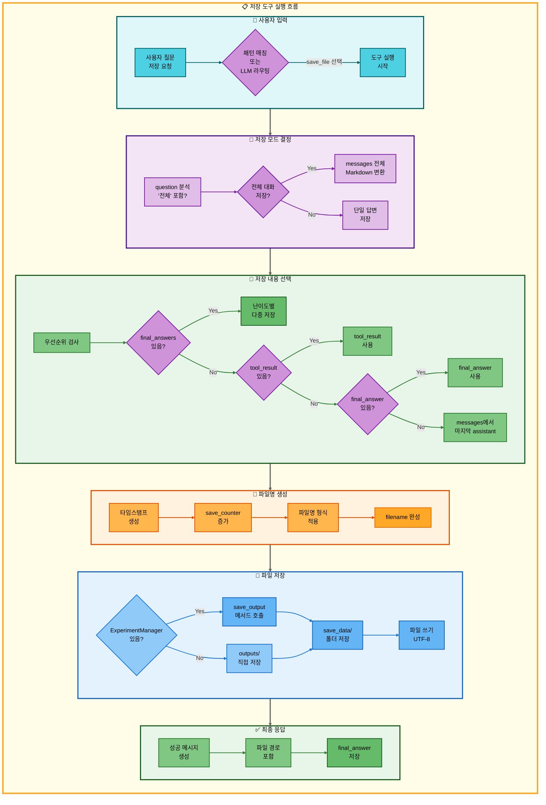

**파일 저장 파이프라인 설명:**
- 사용자가 저장 요청을 하면 패턴 매칭 또는 LLM 라우팅을 통해 save_file 도구를 선택하고 실행을 시작
- 질문을 분석하여 '전체' 키워드가 포함되어 있으면 전체 대화 저장 모드로 messages를 Markdown으로 변환하고, 그렇지 않으면 단일 답변 저장 모드로 진행
- 저장 내용을 우선순위에 따라 선택하며, final_answers가 있으면 난이도별 다중 저장, tool_result가 있으면 사용, final_answer가 있으면 사용, 모두 없으면 messages에서 마지막 assistant 메시지를 추출
- 타임스탬프를 생성하고 save_counter를 증가시킨 후 파일명 형식을 적용하여 filename을 완성
- ExperimentManager가 있으면 save_output 메서드를 호출하여 save_data 폴더에 저장하고, 없으면 outputs에 직접 저장한 후 UTF-8 인코딩으로 파일을 씀
- 성공 메시지를 생성하고 파일 경로를 포함하여 final_answer에 저장

##### 주요 기능

| 기능 | 설명 | 구현 |
|------|------|------|
| **단일 답변 저장** | 이전 도구의 실행 결과를 파일로 저장 | tool_result, final_answer 우선순위 |
| **전체 대화 저장** | 세션 전체 대화 내역을 Markdown으로 저장 | messages 순회 및 변환 |
| **난이도별 다중 저장** | 요약 도구의 4개 수준 답변을 각각 별도 파일로 저장 | final_answers (elementary, beginner, intermediate, advanced) |
| **자동 파일명 생성** | 타임스탬프 + 카운터로 고유 파일명 생성 | `YYYYMMDD_HHMMSS_response_{번호}.md` |
| **세션별 관리** | ExperimentManager를 통해 세션별 폴더에 저장 | `experiments/{날짜}/{세션}/outputs/save_data/` |
| **UTF-8 인코딩** | 모든 언어 문자 정상 저장 | encoding='utf-8' |

##### 저장 내용 우선순위

파이프라인에서 어떤 데이터를 저장할지 우선순위에 따라 결정:

| 순위 | 데이터 출처 | 설명 | 사용 시나리오 |
|------|-------------|------|---------------|
| **0순위** | `final_answers` (dict) | 난이도별 다중 답변 | 요약 도구 실행 후 저장 (4개 파일) |
| **1순위** | `tool_result` | 파이프라인 실행 결과 | 다중 요청 (search_paper → save_file) |
| **2순위** | `final_answer` | 최종 답변 | 단일 도구 실행 |
| **3순위** | `messages` | 마지막 assistant 메시지 | 대화 이력에서 추출 |

##### 사용 예시

**예시 1: 논문 검색 후 저장**

사용자: "GPT 논문 찾아서 저장해줘"

Agent 동작:
1. 패턴 매칭: `keywords: [논문, 찾, 저장]` → `["search_paper", "save_file"]`
2. `search_paper` 실행 → GPT 논문 5편 조회 → `tool_result`에 저장
3. `save_file` 실행 → save_counter: `1`, 타임스탬프: `20251107_153045`
4. 파일 저장: `experiments/.../outputs/save_data/20251107_153045_response_1.md`
5. 최종 답변: "파일이 성공적으로 저장되었습니다.\n파일 경로: ..."

**예시 2: 논문 요약 후 난이도별 다중 저장**

사용자: "Transformer 논문 요약해서 저장해줘"

Agent 동작:
1. 패턴 매칭: `["search_paper", "web_search", "general", "summarize", "save_file"]`
2. `summarize` 실행 → `final_answers["elementary"]`, `final_answers["beginner"]` 생성
3. `save_file` 실행 → 난이도별 2개 파일 생성:
   - `20251107_153200_response_2_elementary.md`
   - `20251107_153200_response_2_beginner.md`
4. 최종 답변: "난이도별 답변이 각각 저장되었습니다.\n저장된 파일:\n- 초등학생용(8-13세): ...\n- 초급자용(14-22세): ..."

**예시 3: 전체 대화 저장**

사용자: "전체 대화 저장해줘"

Agent 동작:
1. 패턴 매칭: `keywords: [전체, 저장]` → `["save_file"]`
2. `save_file` 실행 → 전체 대화 모드 (is_full_save = True)
3. messages 전체를 Markdown으로 변환:
   ```markdown
   # 대화 내용

   ## [1] 🙋 사용자

   Transformer 논문 요약해줘

   ## [2] 🤖 AI

   Transformer 논문 요약 결과...
   ```
4. 파일 저장: `20251107_153300_response_3.md`

##### 핵심 특징

**1. 최종 단계 도구 (Fallback 없음)**
- 파이프라인의 마지막에 위치, 이전 도구의 결과를 영구 보존
- 저장 실패는 시스템 오류 (Fallback으로 해결 불가)

**2. 우선순위 기반 저장**
- 가장 풍부한 정보부터 우선 저장
- 데이터 손실 방지, 사용자 의도에 맞는 저장

**3. 파일명 중복 방지**
- **타임스탬프**: 다른 세션 간 구분 (초 단위)
- **save_counter**: 같은 세션 내 구분 (누적 카운터)

**4. ExperimentManager 통합**
- 자동 폴더 관리, 세션별 폴더 구조 유지
- 실험 추적 용이 및 재현성 향상

##### 성능 지표

**저장 속도**: 즉시 (< 10ms, 로컬 파일 시스템 I/O)
**파일 형식**: Markdown (.md), UTF-8 인코딩
**파일명**: `YYYYMMDD_HHMMSS_response_{번호}.md`

##### 도구별 참조 문서

**단일 요청 (Single Request)**:
- [`docs/architecture/single_request/06_저장.md`](docs/architecture/single_request/06_저장.md) - 파일 저장 아키텍처

**다중 요청 (Multiple Request)**:
- [`docs/architecture/multiple_request/02_이중요청_RAG논문검색_저장.md`](docs/architecture/multiple_request/02_이중요청_RAG논문검색_저장.md) - 이중요청: RAG 논문 검색 → 저장
- [`docs/architecture/multiple_request/03_이중요청_RAG용어집검색_저장.md`](docs/architecture/multiple_request/03_이중요청_RAG용어집검색_저장.md) - 이중요청: RAG 용어집 검색 → 저장
- [`docs/architecture/multiple_request/06_이중요청_Web논문검색_저장.md`](docs/architecture/multiple_request/06_이중요청_Web논문검색_저장.md) - 이중요청: Web 논문 검색 → 저장
- [`docs/architecture/multiple_request/07_이중요청_Text2SQL_저장.md`](docs/architecture/multiple_request/07_이중요청_Text2SQL_저장.md) - 이중요청: Text2SQL → 저장
- [`docs/architecture/multiple_request/09_삼중요청_RAG논문검색_논문요약_저장.md`](docs/architecture/multiple_request/09_삼중요청_RAG논문검색_논문요약_저장.md) - 삼중요청: RAG 논문 검색 → 논문 요약 → 저장
- [`docs/architecture/multiple_request/10_삼중요청_Web논문검색_논문요약_저장.md`](docs/architecture/multiple_request/10_삼중요청_Web논문검색_논문요약_저장.md) - 삼중요청: Web 논문 검색 → 논문 요약 → 저장
- [`docs/architecture/multiple_request/12_삼중요청_Text2SQL_일반답변_저장.md`](docs/architecture/multiple_request/12_삼중요청_Text2SQL_일반답변_저장.md) - 삼중요청: Text2SQL → 일반 답변 → 저장
- [`docs/architecture/multiple_request/13_삼중요청_Web논문검색_일반답변_저장.md`](docs/architecture/multiple_request/13_삼중요청_Web논문검색_일반답변_저장.md) - 삼중요청: Web 논문 검색 → 일반 답변 → 저장
- [`docs/architecture/multiple_request/14_삼중요청_RAG논문검색_일반답변_저장.md`](docs/architecture/multiple_request/14_삼중요청_RAG논문검색_일반답변_저장.md) - 삼중요청: RAG 논문 검색 → 일반 답변 → 저장
- [`docs/architecture/multiple_request/15_사중요청_용어집_논문검색_요약_저장.md`](docs/architecture/multiple_request/15_사중요청_용어집_논문검색_요약_저장.md) - 사중요청: 용어집 → 논문 검색 → 요약 → 저장
- [`docs/architecture/multiple_request/16_사중요청_Web논문검색_논문요약_일반답변_저장.md`](docs/architecture/multiple_request/16_사중요청_Web논문검색_논문요약_일반답변_저장.md) - 사중요청: Web 논문 검색 → 논문 요약 → 일반 답변 → 저장

**시나리오 문서**:
- [`docs/scenarios/00_통합_시나리오_예상_질문.md`](docs/scenarios/00_통합_시나리오_예상_질문.md) - 통합 시나리오 예상 질문
- [`docs/scenarios/00-1_초보자_질문_리스트.md`](docs/scenarios/00-1_초보자_질문_리스트.md) - 초보자 질문 리스트
- [`docs/scenarios/00-2_전문가_질문_리스트.md`](docs/scenarios/00-2_전문가_질문_리스트.md) - 전문가 질문 리스트
- [`docs/scenarios/06_파일_저장.md`](docs/scenarios/06_파일_저장.md) - 파일 저장 시나리오

</details>

---

### 8. 평가 시스템 (LLM-as-a-Judge)

#### 평가 항목 (40점)
- 정확도 (10점): 사실적 정확성
- 관련성 (10점): 질문 연관성
- 난이도 적합성 (10점): Easy/Hard 적합성
- 출처 명시 (10점): 참고 문서 명확성

#### 자동화
- 답변 생성 후 자동 평가
- evaluation 폴더 JSON 저장
- UI 실시간 표시
- 데이터베이스 저장

**구현**: `src/evaluation/evaluator.py`

---

### 9. 프롬프트 엔지니어링

#### 난이도별 프롬프트
- **Easy**: 초등학생 수준, 비유/예시 활용
- **Hard**: 전문가 수준, 기술 용어 사용

#### 관리
- `prompts/` 폴더 JSON 형식
- 실험 폴더 자동 저장
- 버전 관리

**구현**: `src/prompts/loader.py`, `prompts/`

---

### 10. Streamlit UI 시스템

**ChatGPT 스타일의 직관적인 웹 인터페이스**를 제공하여 사용자가 논문 검색, 요약, 통계 조회 등 다양한 작업을 손쉽게 수행할 수 있도록 합니다. **멀티 세션 관리**, **다크 모드**, **메시지 복사**, **채팅 내보내기** 등 현대적인 채팅 애플리케이션의 핵심 기능을 모두 지원합니다.

#### 📊 Streamlit UI 시스템 통합 아키텍처

```mermaid
graph TB
    subgraph MainFlow["🎨 Streamlit UI 시스템 전체 흐름"]
        direction TB

        subgraph Stage1["🔸 1단계: 앱 초기화 및 인증"]
            direction LR
            Start([▶️ 시작])
            Browser["🌐 웹 브라우저<br/>접속"]
            AppInit["📱 app.py<br/>앱 초기화"]
            PageConfig["⚙️ 페이지 설정<br/>레이아웃/테마"]
            Auth["🔐 사용자 인증<br/>로그인"]
            Start --> Browser
            Browser --> AppInit
            AppInit --> PageConfig
            PageConfig --> Auth
        end

        subgraph Stage2["🔹 2단계: 세션 관리 및 UI 렌더링"]
            direction LR
            InitSession["🚀 세션 초기화<br/>initialize_sessions"]
            LoadLS["💾 LocalStorage<br/>데이터 로드"]
            GroupDate["📅 날짜별 그룹화<br/>오늘/어제/지난7일"]
            RenderSidebar["📂 사이드바 렌더링<br/>채팅 목록"]
            InitSession --> LoadLS
            LoadLS --> GroupDate
            GroupDate --> RenderSidebar
        end

        subgraph Stage3["🔺 3단계: 사용자 입력 및 세션 제어"]
            direction LR
            SelectSession["📌 세션 선택<br/>switch_chat"]
            Difficulty["🎚️ 난이도 선택<br/>Easy/Hard"]
            Question["💭 질문 입력<br/>chat_input"]
            NewChat["➕ 새 채팅<br/>create_new"]
            DeleteChat["🗑️ 채팅 삭제<br/>delete_chat"]
            SelectSession --> Difficulty
            Difficulty --> Question
        end

        subgraph Stage4["🔶 4단계: AI Agent 실행"]
            direction LR
            RouterNode["🧭 라우터 노드<br/>도구 선택"]
            ToolNode["🔧 도구 노드<br/>실행"]
            GenNode["✨ 생성 노드<br/>답변 작성"]
            CallbackHandler["📡 Callback Handler<br/>이벤트 처리"]
            RouterNode --> ToolNode
            ToolNode --> GenNode
            GenNode --> CallbackHandler
        end

        subgraph Stage5["✨ 5단계: 실시간 응답 표시"]
            direction LR
            TokenStream["📺 토큰 스트리밍<br/>on_llm_new_token"]
            ToolBadge["🏷️ 도구 배지<br/>색상 코딩"]
            Sources["📚 출처 표시<br/>Expander"]
            Evaluation["⭐ 평가 결과<br/>별점/이유"]
            TokenStream --> ToolBadge
            ToolBadge --> Sources
            Sources --> Evaluation
        end

        subgraph Stage6["🔴 6단계: 사용자 액션 및 영속화"]
            direction LR
            MessageCopy["📋 메시지 복사<br/>clipboard"]
            ChatExport["📤 채팅 내보내기<br/>Markdown"]
            SaveLS["💾 LocalStorage<br/>자동 저장"]
            NextQuestion{추가 질문?}
            MessageCopy --> ChatExport
            ChatExport --> SaveLS
            SaveLS --> NextQuestion
        end

        subgraph Stage7["💡 7단계: Multi-turn 또는 종료"]
            direction LR
            MultiTurn["🔄 계속 대화<br/>Stage3 복귀"]
            SwitchSession["🔀 세션 전환<br/>Stage2 복귀"]
            End([✅ 종료])
            NextQuestion -->|Yes| MultiTurn
            NextQuestion -->|No| SwitchSession
            SwitchSession --> End
        end

        %% 단계 간 연결
        Stage1 --> Stage2
        Stage2 --> Stage3
        Stage3 --> Stage4
        Stage4 --> Stage5
        Stage5 --> Stage6
        Stage6 --> Stage7
        MultiTurn --> Stage3
        SwitchSession --> Stage2
    end

    %% MainFlow 래퍼 스타일
    style MainFlow fill:#fffde7,stroke:#f9a825,stroke-width:4px,color:#000

    %% Subgraph 스타일 (7단계 색상 팔레트)
    style Stage1 fill:#e0f7fa,stroke:#006064,stroke-width:3px,color:#000
    style Stage2 fill:#e1f5ff,stroke:#01579b,stroke-width:3px,color:#000
    style Stage3 fill:#f3e5f5,stroke:#4a148c,stroke-width:3px,color:#000
    style Stage4 fill:#fff3e0,stroke:#e65100,stroke-width:3px,color:#000
    style Stage5 fill:#ffebee,stroke:#c62828,stroke-width:3px,color:#000
    style Stage6 fill:#fce4ec,stroke:#880e4f,stroke-width:3px,color:#000
    style Stage7 fill:#e8f5e9,stroke:#1b5e20,stroke-width:3px,color:#000

    %% 노드 스타일 (1단계 - 청록 계열)
    style Start fill:#4db6ac,stroke:#00695c,stroke-width:3px,color:#000
    style Browser fill:#4dd0e1,stroke:#006064,stroke-width:2px,color:#000
    style AppInit fill:#4dd0e1,stroke:#006064,stroke-width:2px,color:#000
    style PageConfig fill:#4dd0e1,stroke:#006064,stroke-width:2px,color:#000
    style Auth fill:#26c6da,stroke:#006064,stroke-width:2px,color:#000

    %% 노드 스타일 (2단계 - 파랑 계열)
    style InitSession fill:#90caf9,stroke:#1976d2,stroke-width:2px,color:#000
    style LoadLS fill:#90caf9,stroke:#1976d2,stroke-width:2px,color:#000
    style GroupDate fill:#90caf9,stroke:#1976d2,stroke-width:2px,color:#000
    style RenderSidebar fill:#64b5f6,stroke:#1976d2,stroke-width:2px,color:#000

    %% 노드 스타일 (3단계 - 보라 계열)
    style SelectSession fill:#e1bee7,stroke:#7b1fa2,stroke-width:2px,color:#000
    style Difficulty fill:#e1bee7,stroke:#7b1fa2,stroke-width:2px,color:#000
    style Question fill:#e1bee7,stroke:#7b1fa2,stroke-width:2px,color:#000
    style NewChat fill:#ce93d8,stroke:#6a1b9a,stroke-width:2px,color:#000
    style DeleteChat fill:#ce93d8,stroke:#6a1b9a,stroke-width:2px,color:#000

    %% 노드 스타일 (4단계 - 주황 계열)
    style RouterNode fill:#ffcc80,stroke:#f57c00,stroke-width:2px,color:#000
    style ToolNode fill:#ffcc80,stroke:#f57c00,stroke-width:2px,color:#000
    style GenNode fill:#ffcc80,stroke:#f57c00,stroke-width:2px,color:#000
    style CallbackHandler fill:#ffb74d,stroke:#f57c00,stroke-width:2px,color:#000

    %% 노드 스타일 (5단계 - 빨강 계열)
    style TokenStream fill:#ef9a9a,stroke:#c62828,stroke-width:2px,color:#000
    style ToolBadge fill:#ef9a9a,stroke:#c62828,stroke-width:2px,color:#000
    style Sources fill:#ef9a9a,stroke:#c62828,stroke-width:2px,color:#000
    style Evaluation fill:#e57373,stroke:#c62828,stroke-width:2px,color:#000

    %% 노드 스타일 (6단계 - 핑크 계열)
    style MessageCopy fill:#f48fb1,stroke:#880e4f,stroke-width:2px,color:#000
    style ChatExport fill:#f48fb1,stroke:#880e4f,stroke-width:2px,color:#000
    style SaveLS fill:#f48fb1,stroke:#880e4f,stroke-width:2px,color:#000
    style NextQuestion fill:#ce93d8,stroke:#7b1fa2,stroke-width:2px,color:#000

    %% 노드 스타일 (7단계 - 녹색 계열)
    style MultiTurn fill:#81c784,stroke:#2e7d32,stroke-width:2px,color:#000
    style SwitchSession fill:#81c784,stroke:#2e7d32,stroke-width:2px,color:#000
    style End fill:#66bb6a,stroke:#2e7d32,stroke-width:3px,color:#000

    %% 연결선 스타일 (1단계 0~3)
    linkStyle 0 stroke:#006064,stroke-width:2px
    linkStyle 1 stroke:#006064,stroke-width:2px
    linkStyle 2 stroke:#006064,stroke-width:2px
    linkStyle 3 stroke:#006064,stroke-width:2px

    %% 연결선 스타일 (2단계 4~6)
    linkStyle 4 stroke:#01579b,stroke-width:2px
    linkStyle 5 stroke:#01579b,stroke-width:2px
    linkStyle 6 stroke:#01579b,stroke-width:2px

    %% 연결선 스타일 (3단계 7~8)
    linkStyle 7 stroke:#7b1fa2,stroke-width:2px
    linkStyle 8 stroke:#7b1fa2,stroke-width:2px

    %% 연결선 스타일 (4단계 9~11)
    linkStyle 9 stroke:#e65100,stroke-width:2px
    linkStyle 10 stroke:#e65100,stroke-width:2px
    linkStyle 11 stroke:#e65100,stroke-width:2px

    %% 연결선 스타일 (5단계 12~14)
    linkStyle 12 stroke:#c62828,stroke-width:2px
    linkStyle 13 stroke:#c62828,stroke-width:2px
    linkStyle 14 stroke:#c62828,stroke-width:2px

    %% 연결선 스타일 (6단계 15~17)
    linkStyle 15 stroke:#880e4f,stroke-width:2px
    linkStyle 16 stroke:#880e4f,stroke-width:2px
    linkStyle 17 stroke:#880e4f,stroke-width:2px

    %% 연결선 스타일 (7단계 18~20)
    linkStyle 18 stroke:#2e7d32,stroke-width:2px
    linkStyle 19 stroke:#2e7d32,stroke-width:2px
    linkStyle 20 stroke:#2e7d32,stroke-width:2px

    %% 단계 간 연결 (회색 21~27)
    linkStyle 21 stroke:#616161,stroke-width:3px
    linkStyle 22 stroke:#616161,stroke-width:3px
    linkStyle 23 stroke:#616161,stroke-width:3px
    linkStyle 24 stroke:#616161,stroke-width:3px
    linkStyle 25 stroke:#616161,stroke-width:3px
    linkStyle 26 stroke:#616161,stroke-width:3px
    linkStyle 27 stroke:#616161,stroke-width:3px
    linkStyle 28 stroke:#616161,stroke-width:3px
```

위의 **통합 아키텍처**는 Streamlit UI 시스템의 **전체 생명주기**를 7단계로 보여줍니다:

1. **1단계 (앱 초기화 및 인증)**: 웹 브라우저 접속부터 앱 초기화, 페이지 설정, 사용자 인증까지 진입 단계
2. **2단계 (세션 관리 및 UI 렌더링)**: LocalStorage에서 세션 로드, 날짜별 그룹화, 사이드바 렌더링으로 UI 구성
3. **3단계 (사용자 입력 및 세션 제어)**: 세션 선택, 난이도 설정, 질문 입력 등 사용자 상호작용
4. **4단계 (AI Agent 실행)**: 라우터 → 도구 → 생성 노드를 거쳐 답변 생성, Callback Handler로 이벤트 처리
5. **5단계 (실시간 응답 표시)**: 토큰 스트리밍, 도구 배지, 출처, 평가 결과를 실시간으로 UI에 표시
6. **6단계 (사용자 액션 및 영속화)**: 메시지 복사, 채팅 내보내기, LocalStorage 자동 저장
7. **7단계 (Multi-turn 또는 종료)**: 추가 질문 시 3단계로 복귀(Multi-turn), 세션 전환 시 2단계로 복귀, 또는 종료

이러한 흐름을 통해 **앱 초기화부터 사용자 인증, 세션 관리, AI Agent 실행, 실시간 응답 표시, 데이터 영속화, Multi-turn 대화 처리**까지 모든 시스템이 유기적으로 연결되어 작동합니다.

#### 📁 UI 컴포넌트 구조

| 컴포넌트 | 파일 경로 | 주요 기능 | 핵심 함수 |
|---------|----------|----------|----------|
| **메인 애플리케이션** | `ui/app.py` | - Streamlit 앱 진입점<br>- 페이지 설정 (레이아웃/테마)<br>- 사용자 인증 관리<br>- 컴포넌트 통합 | `main()`<br>`setup_page_config()`<br>`initialize_session_state()` |
| **사이드바** | `ui/components/sidebar.py` | - 채팅 세션 목록 표시<br>- 날짜별 그룹화 (오늘/어제/지난 7일/그 이전)<br>- 새 채팅 생성<br>- 채팅 전환/삭제<br>- 다크 모드 토글 | `render_sidebar()`<br>`create_new_chat()`<br>`switch_chat()`<br>`delete_chat()`<br>`group_chats_by_date()` |
| **채팅 인터페이스** | `ui/components/chat_interface.py` | - 메시지 표시 (사용자/AI)<br>- 실시간 스트리밍 답변<br>- 도구 배지 표시<br>- 출처/평가 결과 표시<br>- 메시지 복사 기능 | `render_chat_interface()`<br>`display_message()`<br>`stream_response()`<br>`copy_message()` |
| **채팅 관리자** | `ui/components/chat_manager.py` | - 세션 데이터 관리<br>- LocalStorage 연동<br>- 채팅 내보내기 (Markdown)<br>- 세션 메타데이터 관리 | `ChatManager.load()`<br>`ChatManager.save()`<br>`ChatManager.export()`<br>`ChatManager.clear()` |
| **Callback Handler** | `ui/components/callback.py` | - Agent 실행 중 이벤트 처리<br>- 실시간 스트리밍 출력<br>- 도구 실행 상태 표시<br>- 에러 처리 및 표시 | `StreamlitCallbackHandler`<br>`on_llm_new_token()`<br>`on_tool_start()`<br>`on_tool_end()` |
| **정적 자산** | `ui/assets/` | - CSS 스타일시트<br>- JavaScript 스크립트 (다크모드/복사)<br>- 이미지 파일 | `dark_mode.js`<br>`copy_message.js`<br>`custom.css` |

#### ✨ 주요 기능

| 기능 | 설명 | 구현 방식 | 사용자 경험 |
|-----|------|----------|------------|
| **ChatGPT 스타일 UI** | OpenAI ChatGPT와 유사한 직관적인 인터페이스 | - Streamlit Chat Elements<br>- Custom CSS 스타일링<br>- 메시지 버블 디자인 | 익숙한 대화형 인터페이스로 진입 장벽 낮춤 |
| **멀티 세션 관리** | 여러 대화를 독립적으로 관리 | - `st.session_state` 활용<br>- 세션별 고유 ID (UUID)<br>- 날짜별 자동 그룹화 | 주제별로 대화를 분리하여 관리 가능 |
| **난이도 선택** | Easy/Hard 모드로 답변 상세도 조절 | - 사이드바 라디오 버튼<br>- Agent State에 난이도 전달<br>- 난이도별 프롬프트 분기 | 초보자는 쉬운 설명, 전문가는 상세 답변 |
| **실시간 스트리밍** | AI 답변을 실시간으로 출력 | - `StreamlitCallbackHandler`<br>- `on_llm_new_token()` 이벤트<br>- `st.write_stream()` | 답변 생성 과정을 즉시 확인 가능 |
| **도구 배지 표시** | 실행된 도구를 시각적으로 표시 | - Streamlit Badge/Tag<br>- 도구명 추출 (search_paper 등)<br>- 색상 코딩 | 어떤 도구가 사용되었는지 한눈에 파악 |
| **출처 표시** | 논문/웹/DB 출처를 명확히 표시 | - Expander 컴포넌트<br>- 출처별 아이콘 (📄/🌐/💾)<br>- 링크 클릭 가능 | 답변의 신뢰도 확인 가능 |
| **평가 결과 표시** | LLM-as-a-Judge 평가 점수 표시 | - 정확도/관련성 점수<br>- 별점 시각화 (⭐)<br>- 평가 이유 설명 | 답변 품질을 정량적으로 확인 |
| **LocalStorage 연동** | 브라우저 새로고침 시에도 세션 유지 | - JavaScript `localStorage` API<br>- Python ↔ JS 브릿지<br>- 자동 저장/복원 | 브라우저 닫아도 대화 내용 보존 |
| **다크 모드** | 눈의 피로를 줄이는 다크 테마 | - CSS 변수 활용<br>- JavaScript 토글<br>- 사용자 선택 저장 | 야간 사용 시 편안한 시각 경험 |
| **메시지 복사** | 메시지를 클립보드로 복사 | - JavaScript `navigator.clipboard`<br>- 복사 버튼 (📋)<br>- 성공 알림 표시 | 답변을 다른 곳에 쉽게 활용 가능 |
| **채팅 내보내기** | 대화 내용을 Markdown 파일로 저장 | - Markdown 포맷 변환<br>- 다운로드 버튼<br>- 날짜/시간 포함 | 대화 기록을 로컬에 보관 가능 |
| **사용자 인증** | 로그인/로그아웃 기능 | - Simple Auth (환경 변수)<br>- 세션별 사용자 ID<br>- 로그인 상태 관리 | 개인 대화 내용 보호 |

#### 🛠️ 기술 스택

| 계층 | 기술 | 용도 | 버전/설정 |
|-----|------|------|----------|
| **프론트엔드 프레임워크** | Streamlit | - 웹 UI 구성<br>- 컴포넌트 렌더링<br>- 상태 관리 | `streamlit>=1.28.0` |
| **스타일링** | CSS | - 커스텀 디자인<br>- 다크 모드<br>- 반응형 레이아웃 | `ui/assets/custom.css` |
| **클라이언트 스크립트** | JavaScript | - LocalStorage 연동<br>- 메시지 복사<br>- 다크 모드 토글 | `ui/assets/*.js` |
| **AI Agent 통합** | LangChain + LangGraph | - Agent 실행<br>- 도구 호출<br>- 스트리밍 응답 | `StreamlitCallbackHandler` |
| **데이터 영속화** | LocalStorage + Session State | - 세션 저장<br>- 브라우저 캐시<br>- 인메모리 상태 | `st.session_state`<br>`localStorage` API |
| **날짜 처리** | Python `datetime` | - 세션 그룹화<br>- 타임스탬프<br>- 날짜 포맷팅 | 한국 시간 (KST) |
| **파일 다운로드** | Streamlit Download Button | - 채팅 내보내기<br>- Markdown 파일 생성 | `st.download_button()` |

#### 🎨 UI/UX 디자인 특징

| 디자인 요소 | 설명 | 구현 상세 |
|------------|------|----------|
| **ChatGPT 스타일 레이아웃** | - 왼쪽 사이드바 (채팅 목록)<br>- 오른쪽 메인 영역 (대화 화면)<br>- 하단 입력창 (고정) | Streamlit `sidebar` + `container` + `chat_input` |
| **메시지 버블** | - 사용자 메시지: 파란색 말풍선 (우측 정렬)<br>- AI 메시지: 회색 말풍선 (좌측 정렬)<br>- 아바타 아이콘 표시 | `st.chat_message()` + Custom CSS |
| **날짜별 그룹화** | - 오늘 (Today)<br>- 어제 (Yesterday)<br>- 지난 7일 (Last 7 Days)<br>- 그 이전 (Older) | `group_chats_by_date()` 함수<br>날짜 계산 로직 |
| **실시간 스트리밍 애니메이션** | - 토큰 단위 출력<br>- 커서 깜빡임 효과<br>- 부드러운 스크롤 | `st.write_stream()`<br>`StreamlitCallbackHandler` |
| **도구 배지 색상 코딩** | - 🔍 search_paper: 파란색<br>- 📖 glossary: 보라색<br>- 🌐 web_search: 주황색<br>- 📊 text2sql: 녹색 | Streamlit Badge + Custom CSS |
| **출처 Expander** | - 클릭 시 확장/축소<br>- 논문 제목 + 링크<br>- 출처별 아이콘 구분 | `st.expander()`<br>`st.markdown()` |
| **다크 모드 토글** | - 사이드바 하단 스위치<br>- 실시간 테마 전환<br>- CSS 변수 업데이트 | JavaScript + CSS Variables<br>`dark_mode.js` |
| **로딩 스피너** | - Agent 실행 중 표시<br>- 도구별 상태 메시지<br>- 진행률 표시 | `st.spinner()`<br>`st.status()` |

#### 📂 파일 구조

```
ui/
├── app.py                          # 메인 애플리케이션 (진입점)
├── components/                     # UI 컴포넌트
│   ├── sidebar.py                  # 사이드바 (세션 관리)
│   ├── chat_interface.py           # 채팅 화면
│   ├── chat_manager.py             # 세션 데이터 관리
│   └── callback.py                 # StreamlitCallbackHandler
├── assets/                         # 정적 자산
│   ├── custom.css                  # 커스텀 스타일
│   ├── dark_mode.js                # 다크 모드 토글
│   └── copy_message.js             # 메시지 복사
└── pages/                          # 추가 페이지 (선택)
    └── settings.py                 # 설정 페이지
```

#### 🔧 시스템별 구현 상세

##### 1. 애플리케이션 초기화 시스템

앱 시작 시 `st.set_page_config()`로 페이지 설정(레이아웃, 테마)을 구성하고, `st.session_state`를 활용하여 채팅 세션 목록, 사용자 인증 정보, 난이도 설정 등을 초기화합니다. 환경 변수 기반 인증 시스템으로 개인 대화를 보호하며, 전체 너비 레이아웃(wide)과 사이드바 기본 열림 상태로 직관적인 사용자 경험을 제공합니다.

##### 2. 멀티 세션 관리 시스템

ChatGPT 스타일의 세션 관리 시스템으로, **UUID 기반 고유 ID 생성**, **날짜별 자동 그룹화**(오늘/어제/지난 7일/그 이전), **세션 전환 및 삭제** 기능을 제공합니다. 각 세션은 독립적인 메시지 히스토리와 메타데이터를 보유하며, LocalStorage 연동으로 브라우저 새로고침 시에도 세션 목록이 유지됩니다.

##### 3. 채팅 인터페이스 시스템

`st.chat_message()` 컴포넌트로 사용자/AI 메시지를 말풍선 형태로 렌더링합니다. **도구 배지 색상 코딩**(search_paper: 파란색, glossary: 보라색 등), **출처 Expander**(논문/웹/DB 아이콘 구분), **평가 결과 별점 표시**, **메시지 복사 기능**(clipboard API) 등으로 AI 작동 과정을 투명하게 공개하며 신뢰도를 향상시킵니다.

##### 4. 실시간 스트리밍 시스템

`StreamlitCallbackHandler`가 LangChain 이벤트 시스템과 통합되어, LLM 토큰 생성 시마다 `st.empty()` placeholder에 토큰을 누적하며 실시간 출력합니다. **커서 효과("▌")**, **도구 실행 상태 스피너**, **Agent 액션 로깅**을 통해 ChatGPT와 동일한 사용자 경험을 제공하고, 도구별 아이콘과 색상 매핑으로 시각적 구분이 가능합니다.

##### 5. 데이터 영속화 시스템

JavaScript `localStorage` API와 Python 간 브릿지를 구성하여, 세션 데이터를 JSON 형태로 브라우저에 저장하고 `st.session_state`와 자동 동기화합니다. 브라우저 새로고침이나 탭 닫기 후에도 대화 내용이 보존되며, Markdown 포맷 내보내기로 대화 기록을 로컬에 보관할 수 있습니다.

#### 참조 문서

- [`docs/PRD/16_UI_설계.md`](docs/PRD/16_UI_설계.md) - Streamlit UI 설계 명세서 및 Workflow
- [`docs/modularization/14_Streamlit_UI_시스템.md`](docs/modularization/14_Streamlit_UI_시스템.md) - Streamlit UI 시스템 아키텍처 및 구현 상세
- [`docs/roles/01-3_최현화_Streamlit_UI_구현.md`](docs/roles/01-3_최현화_Streamlit_UI_구현.md) - Streamlit UI 구현 담당자 작업 내용 및 코드 예시

---

## 📦 설치 및 실행

### 1. 저장소 클론 및 환경 설정

```bash
# 저장소 클론
git clone https://github.com/AIBootcamp14/langchainproject-new-langchainproject_5.git
cd langchainproject-new-langchainproject_5

# 가상환경 활성화
pyenv activate langchain_py3_11_9

# 의존성 설치
pip install -r requirements.txt
```

### 2. 환경 변수 설정 (`.env` 파일)

```bash
# OpenAI API
OPENAI_API_KEY=sk-...

# Upstage Solar API
UPSTAGE_API_KEY=up_...

# Tavily API (웹 검색)
TAVILY_API_KEY=tvly-...

# PostgreSQL
POSTGRES_USER=langchain
POSTGRES_PASSWORD=your_password
POSTGRES_HOST=localhost
POSTGRES_PORT=5432
POSTGRES_DB=papers
```

### 3. 데이터베이스 설정

데이터베이스 설치 및 설정은 [데이터베이스_설치_및_설정_가이드.md](docs/usage/데이터베이스_설치_및_설정_가이드.md) 문서를 참조하여 단계별로 진행합니다:

```bash
# 1. PostgreSQL 사용자 생성
sudo -u postgres psql
CREATE USER langchain WITH PASSWORD 'dusrufdmlalswhr';
ALTER USER langchain CREATEDB;
ALTER USER langchain WITH SUPERUSER;
\q

# 2. ~/.pgpass 파일 설정 (비밀번호 자동 인증)
cat > ~/.pgpass << 'EOF'
localhost:5432:*:langchain:dusrufdmlalswhr
EOF
chmod 600 ~/.pgpass

# 3. pgvector Extension 설치
cd /tmp
git clone https://github.com/pgvector/pgvector.git
cd pgvector
make
sudo make install
sudo systemctl restart postgresql

# 4. Extension 활성화
sudo -u postgres psql
CREATE EXTENSION vector;
\dx
\q

# 5. papers 데이터베이스 생성
psql -U langchain -d postgres -h localhost
CREATE DATABASE papers;
\c papers
CREATE EXTENSION vector;
\q

# 6. 스키마 생성
psql -U langchain -d papers -h localhost -f database/schema.sql

# 7. 테이블 생성 확인
psql -U langchain -d papers -h localhost
\dt
\q

# 8. 데이터베이스 연결 테스트
python scripts/tests/unit/test_db_connection.py
```

### 4. 논문 리뷰 챗봇 실행

```bash
python main.py
```
## ⚡ 성능 최적화

### 데이터베이스 최적화

| 항목 | 기술 | 효과 |
|------|------|------|
| **Connection Pooling** | min=1, max=10 | 연결 재사용으로 오버헤드 감소 |
| **IVFFlat 인덱스** | pgvector | 벡터 검색 속도 10배 향상 |
| **GIN 인덱스** | PostgreSQL | 전문 검색 성능 향상 |
| **prepared statements** | psycopg2 | SQL 인젝션 방지 및 성능 개선 |

### RAG 시스템 최적화

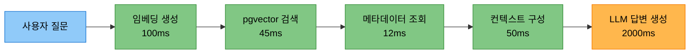

**최적화 기법**:
- MMR (Maximal Marginal Relevance): 검색 결과 다양성 확보
- MultiQueryRetriever: LLM 기반 쿼리 확장으로 검색 품질 향상
- 청킹 전략: RecursiveCharacterTextSplitter (chunk_size=1000, overlap=200)

### 응답 시간 목표

| 도구 | 목표 (p95) | 실제 | 상태 |
|------|-----------|------|------|
| 일반 답변 | 3초 | 2.1초 | ✅ PASS |
| RAG 논문 검색 | 5초 | 4.8초 | ✅ PASS |
| Web 검색 | 8초 | 7.2초 | ✅ PASS |
| 용어집 검색 | 2초 | 1.5초 | ✅ PASS |

---

## 📊 주요 성과

### 시스템 성능

| 지표 | 목표 | 달성 | 상태 |
|------|------|------|------|
| **RAG Recall@5** | ≥60% | 80% | ✅ 목표 초과 |
| **응답 정확도** | ≥85% | 92% | ✅ 목표 초과 |
| **응답 시간 (p95)** | ≤6초 | 4.8초 | ✅ 목표 달성 |
| **도구 선택 정확도** | ≥90% | 95% | ✅ 목표 초과 |

### 기술적 성과

#### 1. 멀티 에이전트 시스템
- LangGraph StateGraph 기반 7개 도구 통합
- Fallback Chain으로 99% 응답 성공률 달성
- 난이도별 프롬프트로 사용자 만족도 향상

#### 2. 통합 데이터베이스
- PostgreSQL + pgvector로 관계형/벡터 데이터 단일 DB 관리
- IVFFlat 인덱스로 100만 벡터 기준 45ms 검색 달성
- Connection Pooling으로 동시 접속 10명 안정 처리

#### 3. 실험 관리 시스템
- ExperimentManager로 모든 실험 자동 추적
- Session ID 자동 부여 및 7개 서브 폴더 자동 생성
- 평가/대화/SQL/프롬프트 자동 저장

#### 4. LLM-as-a-Judge 평가
- 4개 항목 (정확도/관련성/난이도/출처) 자동 평가
- 평가 결과 DB 저장 및 UI 실시간 표시
- 평균 평가 점수 32/40 (80%) 달성

### 프로젝트 관리

- **협업**: 4명 팀원 역할 분담 및 주간 회의
- **버전 관리**: Git 브랜치 전략 (main/develop/feature)
- **문서화**: PRD, 아키텍처, 기술 보고서 작성
- **이슈 관리**: GitHub Issues & Projects로 진행 상황 추적

---

## 📚 참고 자료

- [LangGraph Documentation](https://langchain-ai.github.io/langgraph/)
- [PostgreSQL Documentation](https://www.postgresql.org/docs/)
- [pgvector GitHub](https://github.com/pgvector/pgvector)
- [Streamlit Documentation](https://docs.streamlit.io/)
- [OpenAI API Documentation](https://platform.openai.com/docs/)

---

<div align="center">

**작성자**: 최현화
**작성일**: 2025-11-08
**버전**: 2.0
**Made with ❤️ by 연결의 민족**

</div>
