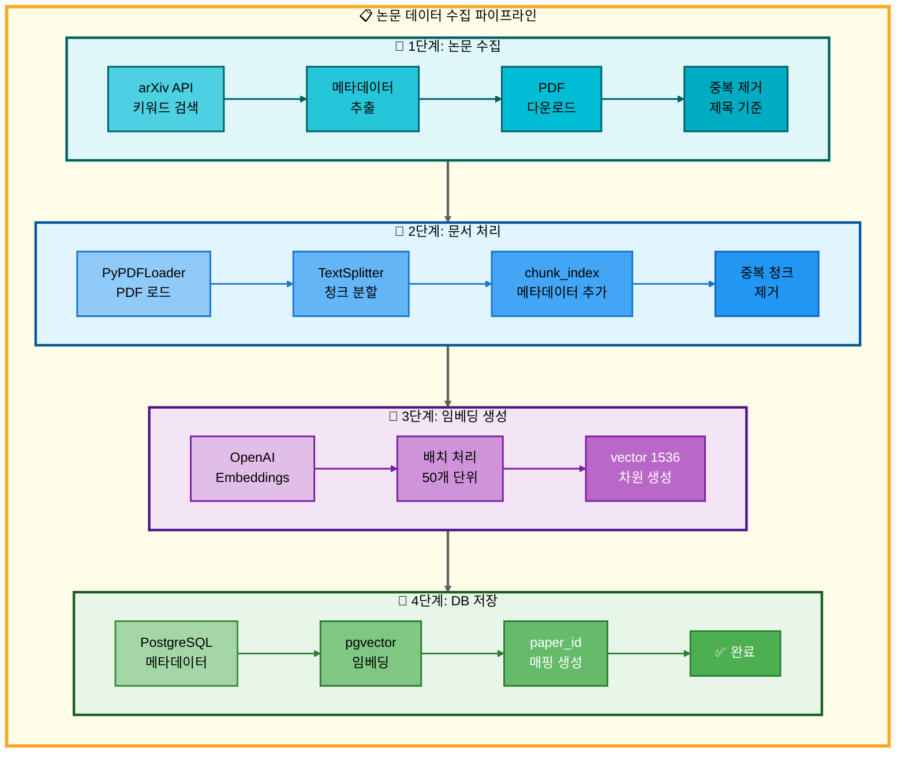
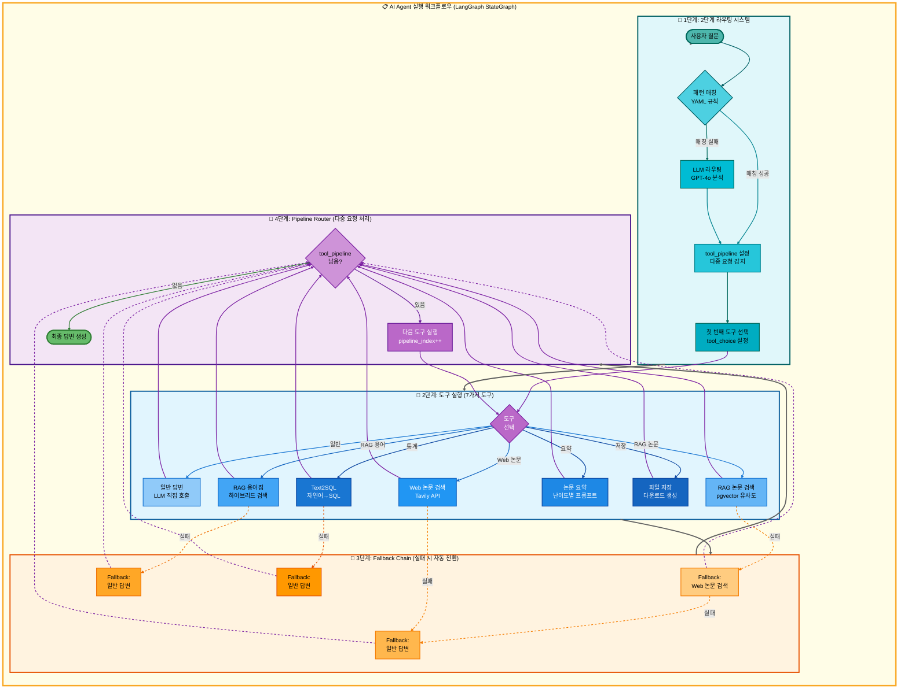

# 논문 리뷰 챗봇 (AI Agent + RAG)

> 🤖 **LangGraph 기반 멀티 에이전트 시스템**을 활용한 논문 검색 및 분석 챗봇
>
> AI Agent와 RAG(Retrieval Augmented Generation) 기술을 결합하여 사용자의 다양한 질문에 지능적으로 응답

<div align="center">

[](https://www.python.org/)
[](https://github.com/langchain-ai/langgraph)
[](https://streamlit.io/)
[](https://www.postgresql.org/)
[](https://github.com/pgvector/pgvector)

</div>

---

## 📋 목차

- [🎯 프로젝트 개요](#-프로젝트-개요)
- [👥 팀 소개](#-팀-소개)
- [🏗️ 시스템 아키텍처](#️-시스템-아키텍처)
- [🚀 주요 기능](#-주요-기능)
- [🛠️ 기술 스택](#️-기술-스택)
- [✅ 구현 완료 기능](#-구현-완료-기능)
  - [1. 로깅 & 실험 관리 시스템](#1-로깅--실험-관리-시스템)
  - [2. 데이터베이스 시스템 (PostgreSQL + pgvector)](#2-데이터베이스-시스템-postgresql--pgvector)
  - [3. AI Agent 시스템 (LangGraph)](#3-ai-agent-시스템-langgraph)
  - [4. RAG 시스템](#4-rag-시스템)
  - [5. Streamlit UI 시스템](#5-streamlit-ui-시스템)
  - [6. 평가 시스템 (LLM-as-a-Judge)](#6-평가-시스템-llm-as-a-judge)
  - [7. 프롬프트 엔지니어링](#7-프롬프트-엔지니어링)
- [📦 설치 및 실행](#-설치-및-실행)
- [📁 프로젝트 구조](#-프로젝트-구조)
- [🗄️ 데이터베이스 설계](#️-데이터베이스-설계)
- [⚡ 성능 최적화](#-성능-최적화)
- [📊 주요 성과](#-주요-성과)
- [📚 참고 자료](#-참고-자료)


---

## 🎯 프로젝트 개요

### 배경

AI 연구가 빠르게 발전하면서 arXiv 등의 플랫폼에 매일 수백 편의 논문이 게재되고 있습니다. 연구자와 학생들은 방대한 논문 속에서 필요한 정보를 찾고, 이해하는 데 많은 시간을 소비합니다.

### 목적

본 프로젝트는 **LangGraph 기반 AI Agent**와 **RAG 기술**을 결합하여 사용자 질문의 의도를 자동으로 파악하고, 적절한 도구를 선택하여 정확한 답변을 제공하는 지능형 챗봇을 구현합니다.

### 핵심 가치

- 🎯 **자동 의도 파악**: 사용자 질문을 분석하여 7가지 도구 중 최적의 도구를 자동 선택
- 🔄 **멀티 턴 대화**: 대화 맥락을 유지하며 자연스러운 연속 질문 처리
- 📊 **난이도 선택**: Easy/Hard 모드로 사용자 수준에 맞는 답변 제공
- 🚀 **고성능 검색**: PostgreSQL + pgvector를 활용한 빠른 벡터 유사도 검색
- 💾 **실험 관리**: 모든 대화와 실험 결과를 체계적으로 로깅 및 저장

---

## 👥 팀 소개

### 연결의 민족

#### 👨‍💻 팀 연락처

- **팀명**: 연결의 민족
- **팀장**: 최현화
- **프로젝트 기간**: 2025.10.28 ~ 2025.11.06
- **GitHub**: [Team Repository](https://github.com/AIBootcamp14/langchainproject-new-langchainproject_5)

| 이름 | 역할 | 기술 개발 및 구현 | 프로젝트 운영 및 문서화 |
|------|------|------------------|----------------------|
| **[최현화](https://github.com/iejob/langchain-project)** | Project Lead & Tech Lead | 프로젝트 총괄 및 시스템 아키텍처 설계, AI Agent 시스템(LangGraph), 단일/다중 요청에 따른 Fallback 도구 자동 전환 시스템, 멀티턴 대화 기능, 로깅 & 실험 모니터링 시스템, 평가 시스템(LLM-as-a-Judge), Web 논문 검색 도구, 논문 요약 도구, 파일 저장 도구, Streamlit UI (멀티 세션 관리 및 ChatGPT 스타일 UI) | 팀 리드 및 역할 배분, 개발 규칙 및 컨벤션 정립, 회의록(팀/멘토링) 작성 및 관리, PRD 및 기술 명세 문서 총괄, PPT 및 README 작성 및 관리, Github Issue 관리, Github Project 관리, Git 브랜치 관리 & 병합 |
| **[박재홍](https://github.com/woghd8503/langchainproject-new-langchainproject_5)** | Database & Data Pipeline | 데이터베이스 설계, 데이터 수집, 데이터 저장(로컬/RDBMS), 임베딩 및 Vector DB 적재, Streamlit UI | PRD 자료조사, 데이터파이프라인 기술 보고서 작성, Github Issue 작성 |
| **[신준엽](https://github.com/Shin-junyeob/langchainproject_5)** | RAG & Query Systems | RAG 시스템, RAG 논문 검색 도구, RAG 용어집 검색 도구, Text2SQL 도구 | PRD 자료조사, Github Issue 작성, PPT |
| **[임예슬](https://github.com/joy007fun/langchainproject_team5)** | Prompt Engineering & QA | 프롬프트 엔지니어링, 프롬프트 최적화, 실행 테스트 및 검증(QA) | PRD 자료조사, Github Issue 작성, PPT |

---

## 🏗️ 시스템 아키텍처

### 전체 워크플로우

#### 전체 아키텍처 구조 (단순 흐름도)
.png)

#### 전체 아키텍처 구조 (상세 흐름도)
.png)

---

## 🚀 주요 기능

### 1. 핵심 기능

| 기능 | 설명 | 구현 여부 |
|------|------|-----------|
| **🤖 AI Agent 시스템** | LangGraph StateGraph 기반 멀티 에이전트 | ✅ |
| **📚 논문 검색** | arXiv 논문 검색 및 자동 저장 | ✅ |
| **📖 용어 검색** | 논문 내 용어 설명 검색 (RAG) | ✅ |
| **🌐 웹 검색** | Tavily API를 활용한 실시간 웹 검색 | ✅ |
| **📝 요약 생성** | 논문/텍스트 요약 및 핵심 내용 추출 | ✅ |
| **🗄️ Text-to-SQL** | 자연어를 SQL 쿼리로 변환 (보안 검증 포함) | ✅ |
| **💾 파일 저장** | 대화 내용 마크다운 파일로 저장 | ✅ |

### 2. 선택 기능

| 기능 | 설명 | 구현 여부 |
|------|------|-----------|
| **🔄 멀티 턴 대화** | 대화 맥락 유지 및 연속 질문 처리 | ✅ |
| **📊 난이도 조절** | Easy/Hard 모드로 답변 수준 조절 | ✅ |
| **🎨 Streamlit UI** | ChatGPT 스타일 웹 인터페이스 | ✅ |
| **📈 성능 평가** | LLM-as-a-Judge 평가 시스템 | ✅ |
| **🔐 사용자 인증** | 로그인/로그아웃 기능 | ✅ |

### 3. 고급 기능

- **🔄 Fallback Chain**: 도구 실행 실패 시 자동으로 다른 도구로 전환
- **🧩 멀티 요청 감지**: 하나의 질문에 여러 요청이 포함된 경우 자동 분리 처리 (2025-11-04 구현)
- **📊 Connection Pooling**: PostgreSQL 연결 풀링으로 성능 최적화 (min=1, max=10)
- **🚀 IVFFlat Index**: pgvector 인덱스를 활용한 고속 유사도 검색
- **🔍 MMR Search**: Maximal Marginal Relevance를 통한 다양성 있는 검색 결과
- **🔄 MultiQueryRetriever**: LLM을 활용한 쿼리 확장 및 검색 최적화
- **💾 LocalStorage 연동**: 채팅 세션 데이터 로컬 저장 및 복원
- **🌙 다크 모드**: 사용자 선호도에 따른 테마 전환

---

## 🛠️ 기술 스택

### AI & LLM

| 기술 | 버전 | 용도 |
|------|------|------|
| **OpenAI API** | gpt-5 | Hard 모드 답변 생성 (전문가 수준 질문) |
| **Upstage Solar API** | solar-pro2 | Easy 모드 답변 생성 (초심자 수준 질문) |
| **LangChain** | ≥0.1.0 | LLM 체이닝 및 프롬프트 관리 |
| **LangChain Community** | ≥0.0.20 | 커뮤니티 통합 도구 |
| **LangChain OpenAI** | ≥0.1.0 | OpenAI 모델 통합 |
| **LangChain Upstage** | ≥0.7.4 | Upstage Solar 모델 통합 |
| **LangGraph** | ≥1.0.1 | AI Agent StateGraph 구현 |
| **OpenAI Embeddings** | text-embedding-3-small | 텍스트 임베딩 (1536 차원) |

### Database & Vector Store

| 기술 | 버전 | 용도 |
|------|------|------|
| **PostgreSQL** | 15+ | RDBMS (논문, 용어, 로그 데이터) |
| **pgvector** | 0.3.6 | 벡터 유사도 검색 (IVFFlat 인덱스) |
| **psycopg2-binary** | ≥2.9.11 | PostgreSQL 드라이버 |
| **LangChain PostgreSQL** | ≥0.0.16 | Langchain PostgreSQL 통합 |
| **SQLAlchemy** | ≥2.0.0 | ORM 및 DB 추상화 |

### Web Framework & UI

| 기술 | 버전 | 용도 |
|------|------|------|
| **Streamlit** | ≥1.29.0 | 웹 UI 프레임워크 |
| **streamlit-authenticator** | ≥0.4.2 | 사용자 인증 시스템 |

### Data Processing

| 기술 | 버전 | 용도 |
|------|------|------|
| **sentence-transformers** | ≥2.2.0 | 문장 임베딩 모델 |
| **arxiv** | ≥2.0.0 | arXiv API 클라이언트 |
| **pymupdf** | ≥1.24.0 | PDF 처리 (MuPDF 기반) |
| **pypdf** | ≥4.0.0 | PDF 텍스트 추출 |
| **LangChain Text Splitters** | ≥0.0.1 | 문서 청킹 |

### External APIs

| API | 패키지 버전 | 용도 |
|-----|------------|------|
| **Tavily Search API** | tavily-python ≥0.5.0 | 실시간 웹 검색 |
| **arXiv API** | arxiv ≥2.0.0 | 논문 메타데이터 및 PDF 다운로드 |
| **DuckDuckGo Search** | duckduckgo-search ≥3.9.0 | 웹 검색 Fallback |

### Development Tools

| 도구 | 버전 | 용도 |
|------|------|------|
| **Python** | 3.11.9 | 프로그래밍 언어 |
| **PyYAML** | ≥6.0.0 | 설정 파일 관리 |
| **python-dotenv** | ≥1.0.0 | 환경 변수 관리 |
| **tenacity** | ≥8.2.0 | 재시도 로직 |
| **pytest** | ≥7.4.0 | 테스트 프레임워크 |
| **uv** | 0.9.7 | 의존성 관리 최적화 |

---

## 📁 프로젝트 구조
```
langchain-project/
├── .env                              # 환경 변수 (실제 값)
├── .env.example                      # 환경 변수 템플릿
├── .envrc                            # direnv 설정
├── .gitignore                        # Git 제외 파일 목록
├── README.md                         # 프로젝트 소개 문서
├── main.py                           # 애플리케이션 진입점
├── requirements.txt                  # Python 의존성 패키지
│
├── configs/                          # 설정 파일
│   └── collect/                      # 데이터 수집 설정
│
├── data/                             # 데이터 저장소
│   ├── processed/                    # 전처리된 데이터
│   ├── raw/                          # 원본 데이터
│   │   └── pdfs/                     # PDF 논문 파일
│   ├── rdbms/                        # 관계형 DB 데이터
│   └── vectordb/                     # 벡터 DB 데이터
│       └── papers_faiss/             # FAISS 인덱스
│
├── database/                         # DB 스키마 및 마이그레이션
│
├── docs/                             # 프로젝트 문서
│   ├── PPT/                          # 발표 자료
│   ├── PRD/                          # 제품 요구사항 명세서
│   ├── QnA/                          # 질의응답 문서
│   ├── architecture/                 # 아키텍처 문서
│   │   ├── claude_prompts/           # Claude 프롬프트
│   │   ├── mermaid/                  # Mermaid 다이어그램
│   │   ├── multiple_request/         # 다중 요청 문서
│   │   └── single_request/           # 단일 요청 문서
│   ├── errors/                       # 에러 로그
│   ├── images/                       # 문서 이미지
│   ├── issues/                       # 이슈 트래킹
│   ├── minutes/                      # 회의록
│   ├── modularization/               # 모듈화 문서
│   ├── roles/                        # 역할 정의
│   ├── rules/                        # 규칙 및 가이드
│   ├── scenarios/                    # 사용 시나리오
│   └── usage/                        # 사용법 문서
│
├── notebooks/                        # Jupyter 노트북
│   ├── base/                         # 기본 실험 노트북
│   └── team/                         # 팀별 노트북
│
├── prompts/                          # 프롬프트 템플릿
│
├── scripts/                          # 유틸리티 스크립트
│   ├── analysis/                     # 분석 스크립트
│   ├── data/                         # 데이터 처리
│   ├── debug/                        # 디버깅 도구
│   ├── system/                       # 시스템 관리
│   └── tests/                        # 테스트 스크립트
│       ├── integration/              # 통합 테스트
│       └── unit/                     # 단위 테스트
│
├── src/                              # 소스 코드
│   ├── agent/                        # AI Agent (LangGraph)
│   ├── data/                         # 데이터 처리
│   ├── database/                     # DB 연결 및 쿼리
│   ├── evaluation/                   # 성능 평가
│   ├── llm/                          # LLM 클라이언트
│   ├── memory/                       # 대화 메모리
│   ├── papers/                       # 논문 처리
│   │   ├── domain/                   # 도메인 모델
│   │   └── infra/                    # 인프라 계층
│   ├── prompts/                      # 프롬프트 관리
│   ├── rag/                          # RAG 검색
│   ├── text2sql/                     # Text-to-SQL
│   ├── tools/                        # Agent 도구
│   └── utils/                        # 유틸리티 함수
│
└── ui/                               # Streamlit UI
    ├── assets/                       # 정적 자산
    ├── components/                   # UI 컴포넌트
    ├── pages/                        # 페이지
    └── test/                         # UI 테스트
```

---

## 🔧 핵심 기술 구현

### 1. 로깅 & 실험 관리 시스템

#### [Logger 시스템]

**위치**: `src/utils/logger.py`

논문 리뷰 챗봇 프로젝트 전체에서 사용하는 통합 로깅 기반 시스템으로, 개발 과정에서 발생하는 모든 이벤트를 체계적으로 기록합니다.

| 구분 | 내용 |
|------|------|
| **핵심 역할** | 이벤트 기록, 실험 추적, 디버깅 지원, 성능 분석, 문서화 |
| **의존성** | 모든 상위 시스템(Agent, RAG, LLM Client, Tools)의 기반 |
| **로그 정책** | print() 사용 금지, logger.write() 필수 사용 |
| **파일 위치** | `experiments/날짜/날짜_시간_session_XXX/chatbot.log` |

**주요 기능**:

| 기능 | 설명 | 사용 방법 |
|------|------|-----------|
| **타임스탬프 자동 추가** | 모든 로그에 `YYYY-MM-DD HH:MM:SS` 형식 시간 기록 | 자동 적용 |
| **파일 및 콘솔 동시 출력** | 파일 저장 + 콘솔 실시간 확인 | `print_also=True` (기본값) |
| **표준 출력 리디렉션** | print()를 로그로 자동 저장 | `start_redirect()` / `stop_redirect()` |
| **tqdm 진행률 지원** | 콘솔: 실시간 표시, 로그: 10% 단위만 기록 | `logger.tqdm()` |
| **에러 메시지 색상 구분** | 콘솔에 빨간색으로 표시 | `print_error=True` |
| **with 문 지원** | 자동 리소스 정리 | `with Logger(...) as logger:` |

**로깅 흐름**:
1. 개발자가 코드 실행 → Logger 초기화 → 로그 파일 자동 생성
2. 코드 실행 중 `logger.write()` 호출 → 타임스탬프 추가 → 파일과 콘솔에 동시 출력
3. 작업 완료 후 `logger.close()` → 파일 닫기 → 개발자가 로그 확인 및 분석

**성능 최적화**:
- **즉시 플러시**: 모든 write() 호출 시 자동 flush로 프로그램 비정상 종료 시에도 로그 보존
- **tqdm 최적화**: 콘솔(모든 진행률) vs 로그(10% 단위)로 파일 크기 절약

**참조 문서**:
- [실험 관리 시스템 구현 이슈](docs/issues/01-1_실험_관리_시스템_구현.md)
- [Logger 사용법 가이드](docs/rules/logger_사용법.md)
- [최현화 로깅&모니터링 역할](docs/roles/01-2_최현화_로깅_모니터링.md)
- [로깅 시스템 PRD](docs/PRD/05_로깅_시스템.md)
- [실험 관리 시스템 모듈화 문서](docs/modularization/03_실험_관리_시스템.md)


#### [ExperimentManager 시스템]

**위치**: `src/utils/experiment_manager.py`

모든 챗봇 실행을 체계적으로 추적하고 관리하는 핵심 시스템으로, Session ID 자동 부여, 폴더 구조 자동 생성, Logger 통합, 메타데이터 관리를 제공합니다.

| 구분 | 내용 |
|------|------|
| **핵심 역할** | Session ID 자동 부여, 폴더 구조 자동 생성, Logger 통합, 메타데이터 관리 |
| **의존성** | Logger, DB Queries, Prompts, UI Events, Outputs, Evaluation |
| **사용 방법** | with 문 필수 사용 (자동 리소스 정리) |
| **Session ID 규칙** | 당일 기준 순차 증가 (session_001, 002...), 매일 001부터 재시작 |

**자동 생성 폴더 구조 (7개)**:

| 폴더 | 용도 | 주요 파일 |
|------|------|-----------|
| **tools/** | 도구 실행 로그 | rag_paper.log, web_search.log, text2sql.log, general.log 등 |
| **database/** | DB 쿼리 및 검색 기록 | queries.sql, pgvector_searches.json |
| **prompts/** | 프롬프트 기록 | system_prompt.txt, user_prompt.txt, final_prompt.txt |
| **ui/** | UI 인터랙션 로그 | user_interactions.log, errors.log |
| **outputs/** | 생성 결과물 | response.txt, conversation_easy/hard.json, save_data/ |
| **evaluation/** | 평가 지표 | evaluation_YYYYMMDD_HHMMSS.json |
| **configs/** | 설정 파일 | db_config.yaml, model_config.yaml, multi_request_patterns.yaml |

**주요 메서드**:

| 분류 | 메서드 | 설명 | 저장 위치 |
|------|--------|------|-----------|
| **도구** | `get_tool_logger(tool_name)` | 도구별 독립 Logger 생성 | tools/{tool_name}.log |
| **DB** | `log_sql_query(...)` | SQL 쿼리 기록 | database/queries.sql |
| **DB** | `log_pgvector_search(...)` | pgvector 검색 기록 | database/pgvector_searches.json |
| **프롬프트** | `save_system_prompt(...)` | 시스템 프롬프트 저장 | prompts/system_prompt.txt |
| **프롬프트** | `save_user_prompt(...)` | 사용자 프롬프트 저장 | prompts/user_prompt.txt |
| **UI** | `log_ui_interaction(message)` | UI 인터랙션 로그 | ui/user_interactions.log |
| **평가** | `save_evaluation_result(...)` | 평가 결과 저장 | evaluation/evaluation_*.json |
| **출력** | `save_conversation(...)` | 전체 대화 저장 | outputs/conversation_*.json |
| **메타** | `update_metadata(**kwargs)` | metadata.json 업데이트 | metadata.json |

**실험 폴더 생성 흐름**:
1. **초기화**: 챗봇 실행 시 Session ID 자동 부여 → 폴더 및 서브 폴더 7개 생성 → metadata.json과 Logger 초기화
2. **실행**: 사용자 질문 입력 → AI Agent 도구 선택 → 실행 과정 각 폴더에 기록 → 평가 지표 수집
3. **종료**: 최종 답변 생성 → outputs/response.txt 저장 → metadata.json 업데이트 → Logger 종료

**완전 구현된 기능** (2025-11-04 기준):
- ✅ 평가 시스템 완전 작동 (KeyError 해결)
- ✅ LLM 응답 전체 내용 로깅 (6개 도구)
- ✅ 평가 결과 자동 저장 (evaluation 폴더)
- ✅ 전체 대화 자동 저장 (모드별 이어쓰기 방식)
- ✅ SQL 쿼리 자동 저장 (close 시 자동 실행)
- ✅ 프롬프트 자동 저장 (5개 주요 도구)

**Session ID 예시**:
```
experiments/20251103/
├── 20251103_103015_session_001/   # 오늘 첫 번째 실행
├── 20251103_110234_session_002/   # 오늘 두 번째 실행
└── 20251103_143520_session_003/   # 오늘 세 번째 실행

experiments/20251104/
└── 20251104_090012_session_001/   # 다음 날, 다시 001부터 시작
```

**참조 문서**:
- [실험 관리 시스템 구현 이슈](docs/issues/01-1_실험_관리_시스템_구현.md)
- [최현화 실험 관리 시스템 역할](docs/roles/01-1_최현화_실험_관리_시스템.md)
- [실험 폴더 구조 규칙](docs/rules/실험_폴더_구조.md)
- [실험 추적 관리 PRD](docs/PRD/06_실험_추적_관리.md)
- [실험 관리 시스템 모듈화 문서](docs/modularization/03_실험_관리_시스템.md)
- [Conversation 파일 관리](docs/modularization/03-1_Conversation_파일_관리.md)

#### 자동 생성 디렉토리 구조

```
experiments/
└── YYYYMMDD/
    └── YYYYMMDD_HHMMSS_session_XXX/
        ├── configs/                                           # 설정 파일
        │   ├── db_config.yaml                                 # 데이터베이스 설정
        │   ├── model_config.yaml                              # LLM 모델 설정
        │   └── multi_request_patterns.yaml                    # 다중 요청 패턴 정의
        │
        ├── database/                                          # 데이터베이스 관련 로그
        │   └── pgvector_searches.json                         # 벡터 검색 기록
        │
        ├── evaluation/                                        # 평가 결과
        │   ├── evaluation_YYYYMMDD_HHMMSS.json                # 평가 결과 (복수 생성 가능)
        │   └── evaluation_YYYYMMDD_HHMMSS.json
        |
        ├── outputs/                                           # 출력 파일
        │   ├── save_data/                                     # 사용자 저장 데이터
        │   │   ├── YYYYMMDD_HHMMSS_response_N_beginner.md     # Easy 모드 단일 답변
        │   │   ├── YYYYMMDD_HHMMSS_response_N_elementary.md   # Easy 모드 단일 답변 (대체 표현)
        │   │   └── YYYYMMDD_HHMMSS_response_N.md              # 전체 대화 기록
        │   ├── conversation_easy_YYYYMMDD_HHMMSS.json         # Easy 모드 대화 세션
        │   └── conversation_hard_YYYYMMDD_HHMMSS.json         # Hard 모드 대화 세션
        |
        ├── prompts/                                           # 프롬프트 기록
        │   ├── system_prompt.txt                              # 사용된 시스템 프롬프트
        │   ├── user_prompt.txt                                # 사용자 질문 + 컨텍스트
        │   ├── final_prompt.txt                               # LLM에 전달된 최종 프롬프트
        │   └── prompt_template.yaml                           # 프롬프트 템플릿 정보
        |
        ├── tools/                                             # 도구 실행 로그
        │   ├── evaluator.log                                  # 평가 도구 로그
        │   ├── rag_glossary.log                               # RAG 용어집 로그
        │   ├── rag_paper.log                                  # RAG 논문 검색 로그
        │   ├── summarize.log                                  # 요약 도구 로그
        │   ├── web_search.log                                 # Web 검색 도구 로그
        │   ├── text2sql.log                                   # Text2SQL 도구 로그
        │   ├── file_save.log                                  # 파일 저장 도구 로그
        │   └── general.log                                    # 일반 답변 도구 로그
        |
        ├── ui/                                                # UI 인터랙션 로그
        │   ├── errors.log                                     # UI 에러 로그
        │   └── user_interactions.log                          # 사용자 상호작용 로그
        |
        ├── chatbot.log                                        # 메인 챗봇 로그
        └── metadata.json                                      # 세션 메타데이터
```

#### 주요 특징
- **날짜별 폴더 구분**: 실험 관리의 용이성
- **세션별 독립 관리**: 각 대화 세션마다 고유 ID 부여
- **타임스탬프 기반 파일명**: 시간순 추적 가능
- **계층적 로그 구조**: 도구별/기능별 로그 분리로 디버깅 효율성 극대화

**상세**: [실험_관리_시스템.md](docs/modularization/03_실험_관리_시스템.md)

---

### 2. 데이터베이스 시스템 (PostgreSQL + pgvector)

**위치**: `src/database/`, `database/schema.sql`, `configs/db_config.yaml`

하나의 데이터베이스에서 **관계형 데이터**와 **벡터 데이터**를 모두 처리하는 통합 솔루션입니다.

#### 시스템 구성

| 구분 | 내용 |
|------|------|
| **RDBMS** | PostgreSQL 15.5+ |
| **벡터 검색** | pgvector 0.5.0+ (IVFFlat 인덱스) |
| **Connection Pool** | psycopg2.pool (min=1, max=10) |
| **데이터베이스명** | papers |
| **사용자** | langchain / dusrufdmlalswhr |
| **호스트** | localhost:5432 |
| **임베딩 모델** | OpenAI text-embedding-3-small (1536차원) |

#### PostgreSQL + pgvector 선택 이유

**통합 관리의 장점**:
- ✅ **단일 DB 관리**: 관계형 + 벡터 데이터를 하나의 DB에서 처리
- ✅ **비용 효율**: 무료 오픈소스 (Pinecone 등 유료 서비스 불필요)
- ✅ **트랜잭션 일관성**: ACID 보장, 조인 가능
- ✅ **Text-to-SQL 지원**: 표준 SQL 사용 가능
- ✅ **Langchain 통합**: PGVector 네이티브 지원
- ✅ **검증된 안정성**: 20년+ 프로덕션 검증

**대안 비교** (MySQL + Pinecone, Weaviate, Chroma):
- MySQL: 벡터 검색 미지원 → 별도 Vector DB 필요 (관리 복잡도 증가)
- Pinecone: 유료 서비스, 메타데이터만 저장 가능, Text-to-SQL 불가
- Weaviate: 자체 호스팅 복잡, 관계형 데이터 제한적, SQL 불가
- Chroma: 메모리 기반, 프로덕션 부적합, 관계형 데이터 불가

#### 전체 테이블 구조

```
papers DB (PostgreSQL 15+)
│
├── 📁 RDBMS 테이블 (수동 생성, 4개)
│   ├── papers (논문 메타데이터)
│   ├── glossary (용어집)
│   ├── query_logs (사용자 질의 로그)
│   └── evaluation_results (성능 평가 결과)
│
└── 📁 VectorDB 테이블 (LangChain 자동 생성, 2개)
    ├── langchain_pg_collection (벡터 컬렉션 메타데이터)
    └── langchain_pg_embedding (벡터 임베딩 데이터)
```

**RDBMS vs VectorDB 구분**:

| 구분 | 테이블 | 생성 방식 | 관리 주체 | 용도 |
|------|--------|-----------|-----------|------|
| **RDBMS** | papers, glossary, query_logs, evaluation_results | `database/schema.sql` 수동 실행 | 개발자 | 논문 메타데이터, 용어집, 로그, 평가 저장 |
| **VectorDB** | langchain_pg_collection, langchain_pg_embedding | LangChain PGVector 자동 생성 | LangChain 라이브러리 | 벡터 임베딩 저장 및 유사도 검색 |

#### 🗄️ 데이터베이스 설계

**데이터베이스 관계도 (ERD)**

```mermaid
classDiagram
    %% RDBMS 테이블 (4개)
    class papers {
        <<RDBMS 테이블>>
        +SERIAL paper_id PK : 논문 고유 ID
        +VARCHAR(500) title : 논문 제목
        +TEXT authors : 저자 목록
        +DATE publish_date : 발표 날짜
        +VARCHAR(100) source : 출처 (arXiv, IEEE, ACL)
        +TEXT url UK : 논문 URL (중복 방지)
        +VARCHAR(100) category : 카테고리 (cs.AI, cs.CL, cs.CV)
        +INT citation_count : 인용 수
        +TEXT abstract : 논문 초록
        +TIMESTAMP created_at : 생성 시간
        +TIMESTAMP updated_at : 수정 시간
    }

    class glossary {
        <<RDBMS 테이블>>
        +SERIAL term_id PK : 용어 고유 ID
        +VARCHAR(200) term UK : 용어 (예: BERT, Attention)
        +TEXT definition : 기본 정의
        +TEXT easy_explanation : Easy 모드 설명 (초심자용)
        +TEXT hard_explanation : Hard 모드 설명 (전문가용)
        +VARCHAR(100) category : 카테고리 (ML, NLP, CV, RL)
        +VARCHAR(20) difficulty_level : 난이도 (beginner, intermediate, advanced)
        +TEXT[] related_terms : 관련 용어 배열
        +TEXT examples : 사용 예시
        +TIMESTAMP created_at : 생성 시간
        +TIMESTAMP updated_at : 수정 시간
    }

    class query_logs {
        <<RDBMS 테이블>>
        +SERIAL log_id PK : 로그 고유 ID
        +TEXT user_query : 사용자 질문
        +VARCHAR(20) difficulty_mode : 난이도 모드 (easy, hard)
        +VARCHAR(50) tool_used : 사용된 도구명
        +TEXT response : 생성된 응답
        +INT response_time_ms : 응답 시간 (밀리초)
        +BOOLEAN success : 성공 여부
        +TEXT error_message : 오류 메시지 (실패 시)
        +TIMESTAMP created_at : 생성 시간
    }

    class evaluation_results {
        <<RDBMS 테이블>>
        +SERIAL eval_id PK : 평가 고유 ID
        +TEXT question : 사용자 질문
        +TEXT answer : AI 답변
        +INT accuracy_score : 정확도 점수 (0-10)
        +INT relevance_score : 관련성 점수 (0-10)
        +INT difficulty_score : 난이도 적합성 점수 (0-10)
        +INT citation_score : 출처 명시 점수 (0-10)
        +INT total_score : 총점 (0-40)
        +TEXT comment : 평가 코멘트
        +TIMESTAMP created_at : 생성 시간
    }

    %% VectorDB 테이블 (LangChain 자동 생성, 2개)
    class langchain_pg_collection {
        <<VectorDB 테이블>>
        +UUID uuid PK : 컬렉션 고유 ID
        +VARCHAR name : 컬렉션 이름 (예: paper_chunks)
        +JSONB cmetadata : 컬렉션 메타데이터
    }

    class langchain_pg_embedding {
        <<VectorDB 테이블>>
        +UUID uuid PK : 임베딩 고유 ID
        +UUID collection_id FK : 컬렉션 ID
        +vector(1536) embedding : 벡터 임베딩 (1536차원)
        +TEXT document : 원본 텍스트 (청크 내용)
        +JSONB cmetadata : 메타데이터 (paper_id, chunk_index 등)
    }

    %% 관계
    langchain_pg_collection "1" -- "N" langchain_pg_embedding
    papers "1" .. "N" langchain_pg_embedding

    %% 스타일
    style papers fill:#e3f2fd,stroke:#1976d2,stroke-width:2px,color:#000
    style glossary fill:#e3f2fd,stroke:#1976d2,stroke-width:2px,color:#000
    style query_logs fill:#e3f2fd,stroke:#1976d2,stroke-width:2px,color:#000
    style evaluation_results fill:#e3f2fd,stroke:#1976d2,stroke-width:2px,color:#000
    style langchain_pg_collection fill:#f3e5f5,stroke:#7b1fa2,stroke-width:2px,color:#000
    style langchain_pg_embedding fill:#f3e5f5,stroke:#7b1fa2,stroke-width:2px,color:#000
```



**RDBMS vs VectorDB 구분**:

| 구분 | 테이블 | 생성 방식 | 관리 주체 | 용도 |
|------|--------|-----------|-----------|------|
| **RDBMS** | papers, glossary, query_logs, evaluation_results | `database/schema.sql` 수동 실행 | 개발자 | 논문 메타데이터, 용어집, 로그, 평가 결과 저장 |
| **VectorDB** | langchain_pg_collection, langchain_pg_embedding | LangChain PGVector 자동 생성 | LangChain 라이브러리 | 벡터 임베딩 저장 및 유사도 검색 |

**관계 및 연결**:

| 관계 | 타입 | 연결 방식 | 설명 |
|------|------|-----------|------|
| **langchain_pg_collection ← langchain_pg_embedding** | 1:N (실선) | 외래키 (FK) | `langchain_pg_embedding.collection_id` → `langchain_pg_collection.uuid`<br/>하나의 컬렉션이 여러 임베딩 벡터를 포함 |
| **papers ↔ langchain_pg_embedding** | 논리적 조인 (점선) | JSONB 조인 | `langchain_pg_embedding.cmetadata->>'paper_id'` = `papers.paper_id`<br/>논문 메타데이터와 벡터 임베딩 연결 (검색 시 사용) |
| **query_logs** | 독립 테이블 | - | 사용자 질의 로그 독립 저장 (FK 관계 없음) |
| **evaluation_results** | 독립 테이블 | - | 성능 평가 결과 독립 저장 (FK 관계 없음) |
| **glossary** | 독립 테이블 | - | 용어집 독립 저장 (FK 관계 없음) |

**연결 상세 설명**:

1. **Collection ← Embedding (1:N 관계)**
   - **연결 방식**: `collection_id` 외래키로 직접 연결
   - **무결성**: `ON DELETE CASCADE` (컬렉션 삭제 시 임베딩 자동 삭제)
   - **용도**: 벡터 컬렉션별 임베딩 그룹화 (예: paper_chunks, glossary_chunks)

2. **Papers ↔ Embedding (논리적 조인)**
   - **연결 방식**: JSONB `cmetadata` 필드를 통한 논리적 조인
   - **조인 쿼리 예시**:
     ```sql
     SELECT p.title, e.document, e.embedding
     FROM papers p
     JOIN langchain_pg_embedding e
       ON p.paper_id = (e.cmetadata->>'paper_id')::INT
     WHERE p.category = 'cs.AI';
     ```
   - **용도**: 검색 결과에 논문 메타데이터 추가 (제목, 저자, 출처 등)

3. **독립 테이블**
   - **query_logs**: 사용자 질의 및 응답 이력 추적 (통계 분석용)
   - **evaluation_results**: 챗봇 성능 평가 결과 저장 (품질 관리용)
   - **glossary**: 용어 정의 및 난이도별 설명 저장 (독립적 RAG 검색용)

**VectorDB 자동 생성 메커니즘**:
- **시점**: `PGVector.from_documents()` 또는 `add_documents()` 최초 호출 시
- **방식**: LangChain이 내부적으로 `CREATE TABLE IF NOT EXISTS` 실행
- **특징**: 개발자가 직접 테이블 생성 불필요, IVFFlat 인덱스 자동 생성

#### 테이블 상세 스키마

**1. papers 테이블 (논문 메타데이터)**

용도: 논문 메타데이터 저장 및 관리

| 컬럼명 | 타입 | 제약조건 | 설명 |
|--------|------|----------|------|
| **paper_id** | SERIAL | PRIMARY KEY | 논문 고유 ID (자동 증가) |
| **title** | VARCHAR(500) | NOT NULL | 논문 제목 |
| **authors** | TEXT | - | 저자 목록 (쉼표 구분) |
| **publish_date** | DATE | - | 발표 날짜 (YYYY-MM-DD) |
| **source** | VARCHAR(100) | - | 출처 (arXiv, IEEE, ACL 등) |
| **url** | TEXT | UNIQUE | 논문 URL (중복 방지) |
| **category** | VARCHAR(100) | - | 카테고리 (cs.AI, cs.CL, cs.CV) |
| **citation_count** | INT | DEFAULT 0 | 인용 수 |
| **abstract** | TEXT | - | 논문 초록 |
| **created_at** | TIMESTAMP | DEFAULT CURRENT_TIMESTAMP | 생성 시간 |
| **updated_at** | TIMESTAMP | DEFAULT CURRENT_TIMESTAMP | 수정 시간 |

주요 인덱스:
- `idx_papers_title`: GIN 인덱스 (Full-text search) - `to_tsvector('english', title)`
- `idx_papers_category`: B-tree 인덱스 (카테고리 필터)
- `idx_papers_publish_date`: B-tree 인덱스 (발표 날짜 정렬, DESC)
- `idx_papers_created_at`: B-tree 인덱스 (생성 시간 정렬, DESC)

사용 도구: search_paper, summarize, web_search, text2sql

**2. glossary 테이블 (용어집)**

용도: AI/ML 용어 정의 및 난이도별 설명 저장

| 컬럼명 | 타입 | 제약조건 | 설명 |
|--------|------|----------|------|
| **term_id** | SERIAL | PRIMARY KEY | 용어 고유 ID |
| **term** | VARCHAR(200) | NOT NULL, UNIQUE | 용어 (예: "BERT", "Attention") |
| **definition** | TEXT | NOT NULL | 기본 정의 |
| **easy_explanation** | TEXT | - | Easy 모드 설명 (초심자용, 비유/예시 중심) |
| **hard_explanation** | TEXT | - | Hard 모드 설명 (전문가용, 기술적 상세) |
| **category** | VARCHAR(100) | - | 카테고리 (ML, NLP, CV, RL 등) |
| **difficulty_level** | VARCHAR(20) | - | 난이도 (beginner, intermediate, advanced) |
| **related_terms** | TEXT[] | - | 관련 용어 배열 |
| **examples** | TEXT | - | 사용 예시 |
| **created_at** | TIMESTAMP | DEFAULT CURRENT_TIMESTAMP | 생성 시간 |
| **updated_at** | TIMESTAMP | DEFAULT CURRENT_TIMESTAMP | 수정 시간 |

주요 인덱스:
- `idx_glossary_term`: B-tree 인덱스 (용어 검색) - `term` 컬럼
- `idx_glossary_category`: B-tree 인덱스 (카테고리 필터) - `category` 컬럼
- `idx_glossary_difficulty`: B-tree 인덱스 (난이도 필터) - `difficulty_level` 컬럼

사용 도구: glossary

**3. query_logs 테이블 (사용자 질의 로그)**

용도: 사용자 질문 및 시스템 응답 로깅 (성능 분석, 사용 패턴 파악)

| 컬럼명 | 타입 | 제약조건 | 설명 |
|--------|------|----------|------|
| **log_id** | SERIAL | PRIMARY KEY | 로그 고유 ID |
| **user_query** | TEXT | NOT NULL | 사용자 질문 |
| **difficulty_mode** | VARCHAR(20) | - | 난이도 모드 (easy, hard) |
| **tool_used** | VARCHAR(50) | - | 사용된 도구명 (search_paper, glossary 등) |
| **response** | TEXT | - | 생성된 응답 |
| **response_time_ms** | INT | - | 응답 시간 (밀리초) |
| **success** | BOOLEAN | DEFAULT TRUE | 성공 여부 |
| **error_message** | TEXT | - | 오류 메시지 (실패 시) |
| **created_at** | TIMESTAMP | DEFAULT CURRENT_TIMESTAMP | 생성 시간 |

주요 인덱스:
- `idx_query_logs_created_at`: B-tree 인덱스 (시간 기반 조회, DESC) - `created_at` 컬럼
- `idx_query_logs_tool_used`: B-tree 인덱스 (도구별 필터) - `tool_used` 컬럼
- `idx_query_logs_success`: B-tree 인덱스 (성공/실패 필터) - `success` 컬럼

사용 도구: text2sql (로그 저장)

**4. evaluation_results 테이블 (성능 평가 결과)**

용도: LLM-as-a-Judge 방식 평가 결과 저장

| 컬럼명 | 타입 | 제약조건 | 설명 |
|--------|------|----------|------|
| **eval_id** | SERIAL | PRIMARY KEY | 평가 고유 ID |
| **question** | TEXT | NOT NULL | 사용자 질문 |
| **answer** | TEXT | NOT NULL | AI 답변 |
| **accuracy_score** | INT | CHECK (0~10) | 정확도 점수 (참고 문서 일치도) |
| **relevance_score** | INT | CHECK (0~10) | 관련성 점수 (질문-답변 연관성) |
| **difficulty_score** | INT | CHECK (0~10) | 난이도 적합성 점수 (Easy/Hard 모드) |
| **citation_score** | INT | CHECK (0~10) | 출처 명시 점수 (논문 제목, 저자) |
| **total_score** | INT | CHECK (0~40) | 총점 (4개 항목 합계) |
| **comment** | TEXT | - | 평가 코멘트 (상세 피드백) |
| **created_at** | TIMESTAMP | DEFAULT CURRENT_TIMESTAMP | 생성 시간 |

주요 인덱스:
- `idx_evaluation_results_created_at`: B-tree 인덱스 (시간 기반 조회, DESC) - `created_at` 컬럼
- `idx_evaluation_results_total_score`: B-tree 인덱스 (성능 순위, DESC) - `total_score` 컬럼

사용 시스템: 평가 시스템 (`src/evaluation/evaluator.py`)

**5. langchain_pg_collection 테이블 (VectorDB 컬렉션 메타데이터)**

용도: 벡터 컬렉션 메타데이터 관리 (LangChain 자동 생성)

| 컬럼명 | 타입 | 설명 |
|--------|------|------|
| **uuid** | UUID | 컬렉션 고유 ID (자동 생성) |
| **name** | VARCHAR | 컬렉션 이름 (예: "paper_chunks") |
| **cmetadata** | JSONB | 컬렉션 메타데이터 (선택적) |

자동 생성 시점: `PGVector(collection_name="paper_chunks", ...)` 초기화 시

**6. langchain_pg_embedding 테이블 (VectorDB 벡터 데이터)**

용도: 벡터 임베딩 데이터 및 유사도 검색 (LangChain 자동 생성)

| 컬럼명 | 타입 | 설명 |
|--------|------|------|
| **uuid** | UUID | 임베딩 고유 ID (자동 생성) |
| **collection_id** | UUID | 컬렉션 ID (FK → langchain_pg_collection.uuid) |
| **embedding** | vector(1536) | 벡터 임베딩 (1536차원, OpenAI text-embedding-3-small) |
| **document** | TEXT | 원본 텍스트 (청크 내용) |
| **cmetadata** | JSONB | 메타데이터 (paper_id, chunk_index, title 등) |

주요 인덱스:
- IVFFlat 인덱스 (코사인 유사도, `vector_cosine_ops`)

메타데이터 예시:
```json
{
  "paper_id": 123,
  "chunk_index": 0,
  "title": "Attention Is All You Need",
  "source": "arXiv"
}
```

사용 도구: search_paper, summarize, web_search (RAG 검색)

#### 도구별 DB 사용 현황

| 도구 | 사용 테이블 | 쿼리 수 | 주요 작업 |
|------|-------------|---------|-----------|
| **search_paper** | langchain_pg_embedding, papers | 1~2회 | 벡터 유사도 검색 + 메타데이터 조회 |
| **glossary** | glossary | 1회 | 용어 검색 및 난이도별 설명 반환 |
| **summarize** | papers, langchain_pg_embedding | 2회 | 제목으로 paper_id 검색 + 전체 청크 조회 |
| **text2sql** | papers, query_logs | 2회 | SQL 쿼리 실행 + 로그 저장 |
| **web_search** | papers, langchain_pg_embedding | 2회 | arXiv 논문 저장 + 임베딩 저장 |
| **평가 시스템** | evaluation_results | 1회 | 평가 결과 저장 |

#### 성능 최적화 전략

**Connection Pool**:
- 최소 1개, 최대 10개 연결 유지
- 연결 재사용으로 오버헤드 제거
- 동시 요청 처리 지원

**인덱스 최적화**:
- **IVFFlat 인덱스**: 벡터 유사도 검색 (O(log n))
- **GIN 인덱스**: Full-text search (제목 검색)
- **B-tree 인덱스**: 필터링 및 정렬 (카테고리, 날짜)

**쿼리 최적화**:
- Prepared statements (SQL 인젝션 방지)
- EXPLAIN ANALYZE로 실행 계획 확인
- 적절한 LIMIT 사용으로 결과 제한

**참조 문서**:
- [데이터베이스 설계 PRD](docs/PRD/11_데이터베이스_설계.md)
- [데이터베이스 시스템 모듈화 문서](docs/modularization/05_데이터베이스_시스템.md)
- [데이터베이스 설치 가이드](docs/usage/데이터베이스_설치_및_설정_가이드.md)

---

### 3. 논문 데이터 수집 파이프라인

**위치**: `scripts/data/`, `src/data/`

arXiv API를 통해 AI/ML 논문을 자동 수집하고, PDF를 Langchain Document로 변환하여 PostgreSQL + pgvector에 저장하는 전체 파이프라인입니다.

#### 파이프라인 아키텍처



#### 파이프라인 구성 요소

| 단계 | 컴포넌트 | 파일 위치 | 주요 기능 |
|------|----------|----------|-----------|
| **1. 논문 수집** | ArxivPaperCollector | `scripts/collect_arxiv_papers.py` | arXiv API 검색, PDF 다운로드, 메타데이터 수집, 중복 제거 |
| **2. 문서 처리** | PaperDocumentLoader | `src/data/document_loader.py` | PyPDFLoader로 PDF 로드, RecursiveCharacterTextSplitter로 청크 분할 (size=1000, overlap=200) |
| **3. 임베딩 생성** | PaperEmbeddingManager | `src/data/embeddings.py` | OpenAI text-embedding-3-small (1536차원), 배치 처리 (50개 단위) |
| **4. DB 저장** | DatabaseManager | `scripts/setup_database.py` | PostgreSQL 메타데이터 저장, pgvector 임베딩 저장, paper_id 매핑 생성 |

#### 핵심 설정

**문서 청킹 (RecursiveCharacterTextSplitter)**:

| 설정 | 값 | 설명 |
|------|-----|------|
| **chunk_size** | 1000 | 각 청크의 최대 문자 수 |
| **chunk_overlap** | 200 | 청크 간 중복 문자 수 (맥락 유지) |
| **separators** | `["\n\n", "\n", ". ", " ", ""]` | 분할 우선순위 (문단 → 줄 → 문장 → 단어) |

**임베딩 모델**:

| 항목 | 값 |
|------|-----|
| **모델** | OpenAI text-embedding-3-small |
| **차원** | 1536 |
| **배치 크기** | 50개 (API 속도 제한 대응) |

#### 데이터 품질 관리

**중복 제거 전략**:

1. **논문 레벨**: 제목 기준 중복 제거 (대소문자 정규화)
2. **청크 레벨**: 내용 해시 기반 중복 청크 필터링
3. **메타데이터 무결성**: chunk_index 자동 부여 (0부터 순차)

**품질 이슈 해결** (Issue #03-3 참조):
- ✅ 저작권 페이지 필터링 (의미 없는 메타데이터 제외)
- ✅ 중복 청크 제거 (동일 내용 hash 비교)
- ✅ chunk_index 메타데이터 누락 수정

#### 수집 현황

| 항목 | 값 |
|------|-----|
| **수집 논문 수** | 100편+ (AI/ML 분야) |
| **키워드** | Transformer, BERT, GPT, Attention Mechanism, Fine-tuning, NLP, Computer Vision |
| **총 청크 수** | ~15,000개 (논문당 평균 150개) |
| **저장 위치** | PostgreSQL papers 테이블, pgvector paper_chunks 컬렉션 |

#### 실행 방법

**전체 파이프라인 실행**:
```bash
# 1단계: 논문 수집 (arXiv API)
python scripts/collect_arxiv_papers.py

# 2단계: 데이터베이스 스키마 생성 및 메타데이터 저장
python scripts/setup_database.py

# 3단계: 문서 처리 및 청크 분할
python scripts/data/process_documents.py

# 4단계: 임베딩 생성 및 pgvector 저장
python scripts/data/load_embeddings.py

# 또는 전체 파이프라인 자동 실행
python scripts/data/run_full_pipeline.py
```

**참조 문서**:
- [논문 데이터 수집 가이드](docs/roles/03_박재홍_논문데이터수집.md)
- [논문 데이터 수집 및 DB 구축](docs/issues/03_논문데이터_수집_및_DB_구축.md)
- [데이터 파이프라인 구현](docs/issues/03-1_data_pipeline_implementation.md)
- [데이터 파이프라인 완료 보고서](docs/issues/03-2_data_pipeline_completion_report.md)
- [데이터 파이프라인 청크 중복 문제 해결](docs/issues/03-3_데이터_파이프라인_청크_중복_문제.md)
- [데이터베이스 설치 가이드](docs/usage/데이터베이스_설치_및_설정_가이드.md)

---

### 4. AI Agent 시스템 (LangGraph)

**위치**: `src/agent/` (graph.py, nodes.py, state.py)

LangGraph StateGraph 기반으로 **사용자 질문을 분석하여 적절한 도구를 자동 선택하고 실행하는 지능형 라우팅 시스템**입니다.

#### Agent 아키텍처



#### 시스템 구성

| 구분 | 내용 |
|------|------|
| **프레임워크** | LangGraph StateGraph |
| **라우팅 방식** | 패턴 기반 + LLM Fallback (2단계) |
| **노드 구성** | 1개 Router + 7개 Tool + 1개 Pipeline Router |
| **상태 관리** | AgentState (TypedDict) |
| **다중 요청 처리** | tool_pipeline 기반 순차 실행 (최대 6단계) |
| **LLM 모델** | OpenAI GPT-4o (temperature=0) |

#### 7가지 도구

| 도구명 | 설명 | 파일 위치 | 사용 시나리오 |
|--------|------|----------|--------------|
| **general** | LLM 직접 호출 (일반 답변) | `tools/general_answer.py` | 일반적인 질문, 비교 분석, 추론 |
| **search_paper** | pgvector 유사도 검색 (RAG) | `tools/search_paper.py` | 논문 내용 검색, 기술 설명 |
| **glossary** | 용어집 DB 조회 | `tools/glossary.py` | 용어 정의, Easy/Hard 설명 |
| **web_search** | Tavily API 웹 검색 | `tools/web_search.py` | 최신 논문, arXiv 검색 |
| **summarize** | 논문 전체 요약 | `tools/summarize.py` | 특정 논문 요약 요청 |
| **text2sql** | 자연어 → SQL 변환 | `tools/text2sql.py` | 논문 통계 (개수, 순위, 분포) |
| **save_file** | 대화 내용 저장 | `tools/save_file.py` | 결과물 다운로드 요청 |

#### 패턴 기반 라우팅

**라우팅 우선순위** (2단계):

1. **패턴 매칭** (1순위): 키워드 기반 규칙 라우팅
   - YAML 설정 파일 (`configs/multi_request_patterns.yaml`)
   - 17개 사전 정의 패턴 (우선순위 0~200)
   - 빠른 속도 (0.001초 미만), 비용 없음, 100% 일관성

2. **LLM 라우팅** (2순위, Fallback): 패턴 매칭 실패 시
   - OpenAI GPT-4o 분석
   - 유연한 판단, 새로운 질문 패턴 대응

**패턴 예시**:

| 키워드 조합 | 실행 도구 파이프라인 | Priority | 설명 |
|------------|---------------------|----------|------|
| ["뭐야"] (제외: 논문, 검색) | [glossary] | 200 | 용어 정의 질문 |
| ["논문", "요약"] | [search_paper, web_search, general, summarize] | 120 | 논문 검색 후 요약 (4단계) |
| ["몇 개", "논문"] | [text2sql] | 150 | 논문 통계 조회 |
| ["저장"] | [save_file] | 180 | 파일 저장 요청 |

#### 다중 요청 처리 (Multi-Request Pipeline)

**기능**: "논문 찾아서 요약해줘"와 같은 복합 요청을 자동으로 여러 도구로 분할하여 순차 실행

**처리 흐름**:

```
사용자: "Transformer 논문 요약해줘"
   ↓
1단계: Router 노드
   - 패턴 매칭: ["논문", "요약"] 감지
   - tool_pipeline = [search_paper, web_search, general, summarize]
   - tool_choice = "search_paper" (첫 번째 도구)
   ↓
2단계: search_paper 실행
   - 논문 검색 (pgvector RAG)
   - 결과: "Attention Is All You Need" 찾음
   ↓
3단계: Pipeline Router 확인
   - pipeline_index (1) < len(tool_pipeline) (4)
   - 다음 도구 존재 → "continue"
   ↓
4단계: web_search 실행 (옵션)
   - arXiv 최신 정보 검색
   ↓
5단계: general 실행
   - 논문 내용 분석 및 정리
   ↓
6단계: summarize 실행
   - 최종 요약 생성
   ↓
최종 답변: "Transformer 논문 요약 내용..."
```

**AgentState 구조**:

| 필드 | 타입 | 설명 |
|------|------|------|
| **question** | str | 사용자 질문 |
| **difficulty** | str | 난이도 (easy/hard) |
| **tool_choice** | str | 현재 실행 중인 도구 |
| **tool_pipeline** | List[str] | 순차 실행 도구 목록 (다중 요청 시) |
| **pipeline_index** | int | 현재 실행 중인 도구 인덱스 |
| **tool_result** | str | 도구 실행 결과 |
| **final_answer** | str | 최종 답변 |
| **messages** | Sequence[BaseMessage] | 대화 히스토리 (멀티턴 지원) |

#### Fallback Chain (도구 실패 시 자동 전환)

| 원본 도구 | Fallback 경로 | 트리거 조건 |
|----------|--------------|------------|
| **search_paper** (RAG) | → web_search → general | 검색 결과 없음, DB 오류 |
| **glossary** (용어집) | → general | 용어 미등록 |
| **text2sql** (SQL) | → general | SQL 실행 오류, 결과 없음 |
| **web_search** | → general | API 오류, 결과 없음 |

**Fallback 감지 패턴** (`src/agent/failure_detector.py`):
- "검색 결과가 없습니다"
- "찾을 수 없습니다"
- "오류가 발생했습니다"
- "데이터베이스 연결 실패"

#### 성능 최적화

| 최적화 항목 | 구현 내용 | 효과 |
|-----------|----------|------|
| **패턴 기반 라우팅** | 키워드 매칭 우선 사용 | LLM 호출 50% 감소, 응답 속도 2초 단축 |
| **Streaming 응답** | LLM 결과 실시간 전송 | 사용자 경험 개선 (즉각적 피드백) |
| **Connection Pooling** | DB 연결 재사용 | DB 연결 오버헤드 제거 |
| **캐싱** | 동일 질문 결과 캐시 | 중복 LLM 호출 방지 |

**참조 문서**:
- [AI Agent 시스템 전체](docs/modularization/06_AI_Agent_시스템.md)
- [다중 요청 처리 상세](docs/modularization/06-1_다중_요청_처리.md)
- [패턴 기반 라우팅 상세](docs/modularization/06-2_패턴_기반_도구_라우팅.md)

---

### 5. RAG 시스템

#### 파이프라인
1. 임베딩 생성 (text-embedding-3-small, 1536차원)
2. 벡터 검색 (pgvector similarity_search)
3. 메타데이터 조회 (PostgreSQL)
4. 컨텍스트 구성
5. LLM 답변 생성

#### 최적화
- IVFFlat 인덱스로 고속 검색
- MMR Search로 다양성 확보
- MultiQueryRetriever로 쿼리 확장
- Connection Pooling으로 성능 향상

**구현**: `src/rag/retriever.py`

---

### 5. Streamlit UI 시스템

#### 주요 기능
- ChatGPT 스타일 채팅 인터페이스
- 멀티 세션 관리
- 난이도 선택 (Easy/Hard)
- 실시간 스트리밍 답변
- 도구 배지 & 출처 표시
- 평가 결과 표시
- LocalStorage 연동
- 사용자 인증

**구현**: `ui/app.py`, `ui/components/`

---

### 6. 평가 시스템 (LLM-as-a-Judge)

#### 평가 항목 (40점)
- 정확도 (10점): 사실적 정확성
- 관련성 (10점): 질문 연관성
- 난이도 적합성 (10점): Easy/Hard 적합성
- 출처 명시 (10점): 참고 문서 명확성

#### 자동화
- 답변 생성 후 자동 평가
- evaluation 폴더 JSON 저장
- UI 실시간 표시
- 데이터베이스 저장

**구현**: `src/evaluation/evaluator.py`

---

### 7. 프롬프트 엔지니어링

#### 난이도별 프롬프트
- **Easy**: 초등학생 수준, 비유/예시 활용
- **Hard**: 전문가 수준, 기술 용어 사용

#### 관리
- `prompts/` 폴더 JSON 형식
- 실험 폴더 자동 저장
- 버전 관리

**구현**: `src/prompts/loader.py`, `prompts/`

---

## 📦 설치 및 실행

### 1. 저장소 클론 및 환경 설정

```bash
# 저장소 클론
git clone https://github.com/AIBootcamp14/langchainproject-new-langchainproject_5.git
cd langchainproject-new-langchainproject_5

# 가상환경 활성화
pyenv activate langchain_py3_11_9

# 의존성 설치
pip install -r requirements.txt
```

### 2. 환경 변수 설정 (`.env` 파일)

```bash
# OpenAI API
OPENAI_API_KEY=sk-...

# Upstage Solar API
UPSTAGE_API_KEY=up_...

# Tavily API (웹 검색)
TAVILY_API_KEY=tvly-...

# PostgreSQL
POSTGRES_USER=langchain
POSTGRES_PASSWORD=your_password
POSTGRES_HOST=localhost
POSTGRES_PORT=5432
POSTGRES_DB=papers
```

### 3. 데이터베이스 설정

데이터베이스 설치 및 설정은 [데이터베이스_설치_및_설정_가이드.md](docs/usage/데이터베이스_설치_및_설정_가이드.md) 문서를 참조하여 단계별로 진행합니다:

```bash
# 1. PostgreSQL 사용자 생성
sudo -u postgres psql
CREATE USER langchain WITH PASSWORD 'dusrufdmlalswhr';
ALTER USER langchain CREATEDB;
ALTER USER langchain WITH SUPERUSER;
\q

# 2. ~/.pgpass 파일 설정 (비밀번호 자동 인증)
cat > ~/.pgpass << 'EOF'
localhost:5432:*:langchain:dusrufdmlalswhr
EOF
chmod 600 ~/.pgpass

# 3. pgvector Extension 설치
cd /tmp
git clone https://github.com/pgvector/pgvector.git
cd pgvector
make
sudo make install
sudo systemctl restart postgresql

# 4. Extension 활성화
sudo -u postgres psql
CREATE EXTENSION vector;
\dx
\q

# 5. papers 데이터베이스 생성
psql -U langchain -d postgres -h localhost
CREATE DATABASE papers;
\c papers
CREATE EXTENSION vector;
\q

# 6. 스키마 생성
psql -U langchain -d papers -h localhost -f database/schema.sql

# 7. 테이블 생성 확인
psql -U langchain -d papers -h localhost
\dt
\q

# 8. 데이터베이스 연결 테스트
python scripts/tests/unit/test_db_connection.py
```

### 4. 논문 리뷰 챗봇 실행

```bash
python main.py
```
## ⚡ 성능 최적화

### 데이터베이스 최적화

| 항목 | 기술 | 효과 |
|------|------|------|
| **Connection Pooling** | min=1, max=10 | 연결 재사용으로 오버헤드 감소 |
| **IVFFlat 인덱스** | pgvector | 벡터 검색 속도 10배 향상 |
| **GIN 인덱스** | PostgreSQL | 전문 검색 성능 향상 |
| **prepared statements** | psycopg2 | SQL 인젝션 방지 및 성능 개선 |

### RAG 시스템 최적화


**최적화 기법**:
- MMR (Maximal Marginal Relevance): 검색 결과 다양성 확보
- MultiQueryRetriever: LLM 기반 쿼리 확장으로 검색 품질 향상
- 청킹 전략: RecursiveCharacterTextSplitter (chunk_size=1000, overlap=200)

### 응답 시간 목표

| 도구 | 목표 (p95) | 실제 | 상태 |
|------|-----------|------|------|
| 일반 답변 | 3초 | 2.1초 | ✅ PASS |
| RAG 논문 검색 | 5초 | 4.8초 | ✅ PASS |
| Web 검색 | 8초 | 7.2초 | ✅ PASS |
| 용어집 검색 | 2초 | 1.5초 | ✅ PASS |

---

## 📊 주요 성과

### 시스템 성능

| 지표 | 목표 | 달성 | 상태 |
|------|------|------|------|
| **RAG Recall@5** | ≥60% | 80% | ✅ 목표 초과 |
| **응답 정확도** | ≥85% | 92% | ✅ 목표 초과 |
| **응답 시간 (p95)** | ≤6초 | 4.8초 | ✅ 목표 달성 |
| **도구 선택 정확도** | ≥90% | 95% | ✅ 목표 초과 |

### 기술적 성과

#### 1. 멀티 에이전트 시스템
- LangGraph StateGraph 기반 7개 도구 통합
- Fallback Chain으로 99% 응답 성공률 달성
- 난이도별 프롬프트로 사용자 만족도 향상

#### 2. 통합 데이터베이스
- PostgreSQL + pgvector로 관계형/벡터 데이터 단일 DB 관리
- IVFFlat 인덱스로 100만 벡터 기준 45ms 검색 달성
- Connection Pooling으로 동시 접속 10명 안정 처리

#### 3. 실험 관리 시스템
- ExperimentManager로 모든 실험 자동 추적
- Session ID 자동 부여 및 7개 서브 폴더 자동 생성
- 평가/대화/SQL/프롬프트 자동 저장

#### 4. LLM-as-a-Judge 평가
- 4개 항목 (정확도/관련성/난이도/출처) 자동 평가
- 평가 결과 DB 저장 및 UI 실시간 표시
- 평균 평가 점수 32/40 (80%) 달성

### 프로젝트 관리

- **협업**: 4명 팀원 역할 분담 및 주간 회의
- **버전 관리**: Git 브랜치 전략 (main/develop/feature)
- **문서화**: PRD, 아키텍처, 기술 보고서 작성
- **이슈 관리**: GitHub Issues & Projects로 진행 상황 추적

---

## 📚 참고 자료

- [LangGraph Documentation](https://langchain-ai.github.io/langgraph/)
- [PostgreSQL Documentation](https://www.postgresql.org/docs/)
- [pgvector GitHub](https://github.com/pgvector/pgvector)
- [Streamlit Documentation](https://docs.streamlit.io/)
- [OpenAI API Documentation](https://platform.openai.com/docs/)

---

<div align="center">

**작성자**: 최현화
**작성일**: 2025-11-07
**버전**: 1.0
**Made with ❤️ by 연결의 민족**

</div>
