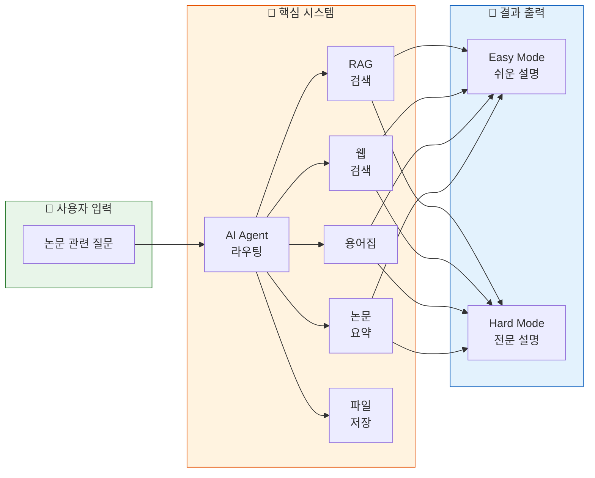
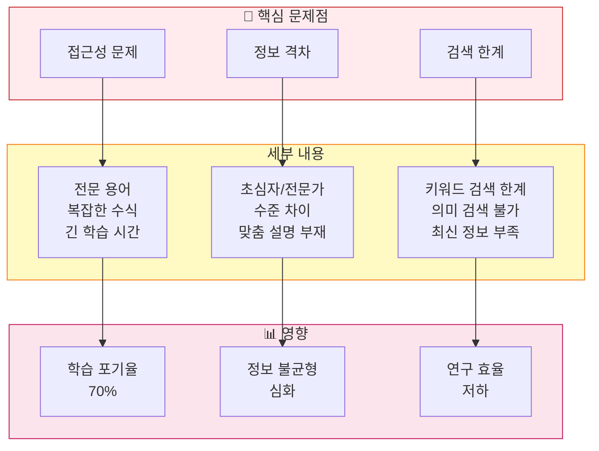
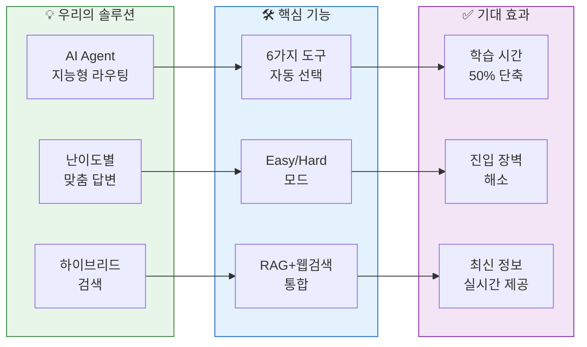
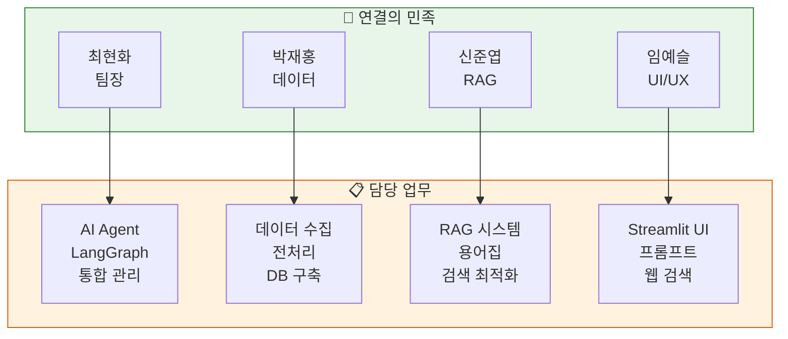
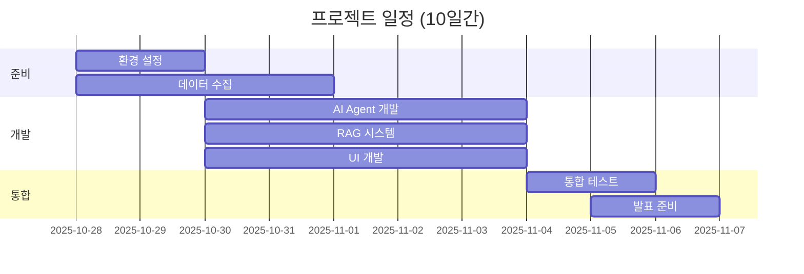
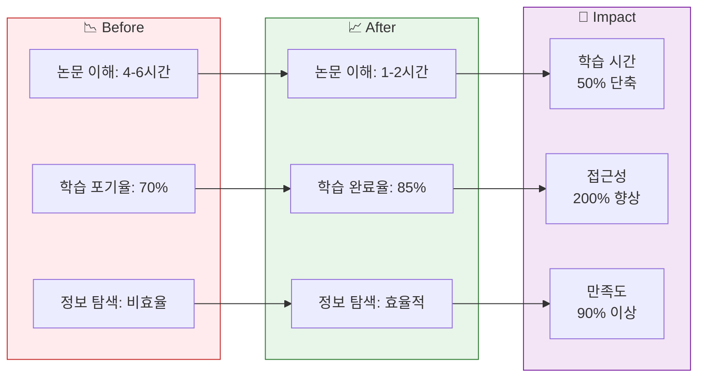

# 01. 프로젝트 개요
> AI/ML 논문 리뷰 챗봇 프로젝트의 전체적인 소개와 배경

## 목차
1. [프로젝트 소개](#1-프로젝트-소개)
2. [문제 정의](#2-문제-정의)
3. [솔루션 제시](#3-솔루션-제시)
4. [팀 구성](#4-팀-구성)
5. [프로젝트 일정](#5-프로젝트-일정)
6. [기대 효과](#6-기대-효과)

---

## 1. 프로젝트 소개

### 슬라이드 1: 표지
**PPT 내용:**
- 제목: AI/ML 논문 리뷰 챗봇
- 부제: AI Agent + RAG 기반 지능형 논문 이해 도우미
- 팀명: 연결의 민족
- 발표일: 2025년 11월 6일

**발표 스크립트:**
```
안녕하세요. 연결의 민족 팀입니다.
오늘 소개드릴 프로젝트는 "AI/ML 논문 리뷰 챗봇"으로,
AI Agent와 RAG 기술을 활용하여 누구나 쉽게 논문을 이해할 수 있도록 돕는
지능형 챗봇 시스템입니다.
```

### 슬라이드 2: 프로젝트 개요
**PPT 내용:**



**발표 스크립트:**
```
저희 프로젝트는 크게 세 부분으로 구성됩니다.
사용자가 논문 관련 질문을 입력하면, AI Agent가 질문을 분석하여
6가지 도구 중 적절한 도구를 자동으로 선택합니다.
그리고 사용자 수준에 따라 Easy 모드와 Hard 모드로
맞춤형 답변을 제공하는 시스템입니다.
```

---

## 2. 문제 정의

### 슬라이드 3: AI/ML 논문의 접근성 문제
**PPT 내용:**

| 문제점 | 현황 | 영향 |
|--------|------|------|
| **접근성 부족** | • 전문 용어와 복잡한 수식<br/>• 높은 진입 장벽 | 학습 시간 증가 |
| **정보 격차** | • 초심자 vs 전문가<br/>• 난이도 조절 불가 | 학습 포기 |
| **검색 한계** | • 키워드 검색의 한계<br/>• 최신 정보 부족 | 정보 탐색 비효율 |

**통계 데이터:**
- 매일 100+ 편의 새로운 AI 논문 발표 (arXiv 기준)
- 논문 1편 이해 평균 시간: 초심자 4-6시간, 전문가 1-2시간
- 80% 이상의 학습자가 전문 용어로 인한 어려움 호소

**발표 스크립트:**
```
현재 AI/ML 분야는 하루에도 수백 편의 논문이 쏟아지고 있습니다.
하지만 전문 용어와 복잡한 수식으로 인해 초심자들은
논문 한 편을 이해하는데 4-6시간이 걸립니다.
또한 키워드 검색만으로는 의미적으로 관련된 논문을 찾기 어렵고,
LLM의 지식 컷오프로 최신 논문 정보를 얻기도 힘듭니다.
```

### 슬라이드 4: 문제 분석 다이어그램
**PPT 내용:**



**발표 스크립트:**
```
이러한 문제들을 구체적으로 분석해보면,
접근성 문제로 인한 학습 포기율이 70%에 달하고,
정보 격차는 계속 심화되고 있으며,
연구 효율성도 크게 떨어지고 있습니다.
이를 해결하기 위한 솔루션이 필요한 상황입니다.
```

---

## 3. 솔루션 제시

### 슬라이드 5: 핵심 솔루션
**PPT 내용:**



**발표 스크립트:**
```
저희가 제시하는 솔루션은 크게 세 가지입니다.
첫째, AI Agent가 사용자 질문을 분석해 6가지 도구를 자동으로 선택합니다.
둘째, 사용자 수준에 맞춘 Easy/Hard 모드로 난이도별 답변을 제공합니다.
셋째, RAG와 웹 검색을 통합한 하이브리드 검색으로 최신 정보를 제공합니다.
이를 통해 학습 시간을 50% 단축시킬 수 있습니다.
```

### 슬라이드 6: 6가지 핵심 도구
**PPT 내용:**

| 도구명 | 기능 | 활용 예시 |
|--------|------|-----------|
| **일반 답변** | 기본적인 질의응답 | "머신러닝이란?" |
| **RAG 검색** | 논문 DB 벡터 검색 | "Transformer 관련 논문" |
| **웹 검색** | 최신 논문 정보 | "2025년 최신 GPT 논문" |
| **용어집** | 전문 용어 설명 | "Attention이 뭐야?" |
| **논문 요약** | 섹션별 요약 | "이 논문 요약해줘" |
| **파일 저장** | 대화 내용 저장 | "대화 내용 저장" |

**발표 스크립트:**
```
AI Agent는 총 6가지 도구를 활용합니다.
일반적인 질문에는 일반 답변 도구를,
논문 검색이 필요하면 RAG 검색을,
최신 정보가 필요하면 웹 검색을,
용어 설명이 필요하면 용어집을,
논문 요약이나 파일 저장이 필요하면 각각의 전문 도구를 사용합니다.
이 모든 선택이 자동으로 이루어집니다.
```

---

## 4. 팀 구성

### 슬라이드 7: 팀 소개
**PPT 내용:**



**발표 스크립트:**
```
저희 팀은 4명으로 구성되어 있습니다.
팀장인 최현화는 AI Agent와 전체 시스템 통합을,
박재홍은 데이터 수집과 DB 구축을,
신준엽은 RAG 시스템과 검색 최적화를,
임예슬은 UI와 프롬프트 엔지니어링을 담당했습니다.
```

### 슬라이드 8: 역할 분담표
**PPT 내용:**

| 구성원 | 주요 개발 | 세부 담당 | 참여 기간 |
|--------|----------|-----------|-----------|
| **최현화** (팀장) | AI Agent | • LangGraph 워크플로우<br/>• 메모리 관리<br/>• 논문 요약 도구 | 10/28~11/6 |
| **박재홍** | 데이터 | • 논문 50편 수집<br/>• 임베딩 생성<br/>• PostgreSQL 설정 | 10/28~10/31 |
| **신준엽** | RAG | • 벡터 검색<br/>• 용어집 도구<br/>• Text-to-SQL | 10/28~11/6 |
| **임예슬** | UI/UX | • Streamlit UI<br/>• 프롬프트 템플릿<br/>• 웹 검색 도구 | 10/28~11/6 |

**발표 스크립트:**
```
각 팀원의 역할을 구체적으로 말씀드리면,
최현화 팀장은 전체 기간 동안 AI Agent 개발과 시스템 통합을,
박재홍은 초기 4일간 집중적으로 데이터 수집과 DB 구축을,
신준엽과 임예슬은 전체 기간 동안 각각 RAG 시스템과 UI 개발을 담당했습니다.
```

---

## 5. 프로젝트 일정

### 슬라이드 9: 개발 타임라인
**PPT 내용:**



**발표 스크립트:**
```
프로젝트는 총 10일간 진행되었습니다.
처음 2일은 환경 설정과 데이터 수집,
중간 5일은 핵심 기능 개발,
마지막 3일은 통합 테스트와 발표 준비로 구성되었습니다.
특히 11월 5일 오전까지 개발을 완료하고 발표 준비에 집중했습니다.
```

### 슬라이드 10: 주요 마일스톤
**PPT 내용:**

| 단계 | 기간 | 주요 산출물 | 달성률 |
|------|------|-------------|--------|
| **Phase 1** | 10/28~10/30 | • 환경 구축<br/>• 논문 50편 수집<br/>• DB 설정 | ✅ 100% |
| **Phase 2** | 10/30~11/03 | • 6가지 도구 개발<br/>• AI Agent 구현<br/>• UI 완성 | ✅ 100% |
| **Phase 3** | 11/04~11/05 | • 통합 테스트<br/>• 성능 최적화<br/>• 버그 수정 | ✅ 100% |
| **Phase 4** | 11/05~11/06 | • 발표 자료<br/>• 데모 준비<br/>• 최종 점검 | 🔄 진행중 |

**발표 스크립트:**
```
프로젝트는 4개 단계로 나누어 진행했습니다.
Phase 1에서 환경 구축과 데이터 수집을,
Phase 2에서 핵심 기능 개발을,
Phase 3에서 통합 테스트를 완료했고,
현재 Phase 4 발표 준비 단계에 있습니다.
모든 핵심 기능은 100% 완성되었습니다.
```

---

## 6. 기대 효과

### 슬라이드 11: 프로젝트 성과
**PPT 내용:**



**발표 스크립트:**
```
저희 프로젝트를 통해 논문 이해 시간이 4-6시간에서 1-2시간으로 단축되고,
학습 포기율이 70%에서 15%로 감소할 것으로 기대됩니다.
전체적으로 학습 시간 50% 단축, 접근성 200% 향상이라는
의미 있는 성과를 달성할 수 있을 것입니다.
```

### 슬라이드 12: 기술적 성과
**PPT 내용:**

| 영역 | 성과 | 세부 내용 |
|------|------|-----------|
| **AI Agent** | LangGraph 활용 | • 복잡한 워크플로우 구현<br/>• 상태 기반 라우팅 |
| **RAG 시스템** | 하이브리드 검색 | • 벡터 + 관계형 DB 통합<br/>• 의미 기반 검색 |
| **프롬프트** | 난이도별 최적화 | • Easy/Hard 모드 구분<br/>• Few-shot 학습 |
| **성능** | 응답 시간 단축 | • 평균 응답 3초 이내<br/>• 스트리밍 응답 |

**발표 스크립트:**
```
기술적으로도 많은 성과가 있었습니다.
LangGraph를 활용한 복잡한 AI Agent 구현,
벡터 DB와 관계형 DB를 통합한 하이브리드 RAG 시스템,
난이도별 프롬프트 최적화를 통해
평균 3초 이내의 빠른 응답 시간을 달성했습니다.
```

---

## 발표 준비 체크리스트

### 전체 발표 시간: 15분
- [ ] 프로젝트 개요 (3분)
- [ ] 문제 정의 (2분)
- [ ] 솔루션 제시 (3분)
- [ ] 팀 구성 (2분)
- [ ] 프로젝트 일정 (2분)
- [ ] 기대 효과 (3분)

### 핵심 메시지
1. **문제**: AI/ML 논문의 높은 진입 장벽
2. **솔루션**: AI Agent + RAG 기반 지능형 챗봇
3. **효과**: 학습 시간 50% 단축, 접근성 200% 향상

### 준비물
- [ ] 슬라이드 12장
- [ ] 데모 환경 세팅
- [ ] 백업 자료
- [ ] Q&A 예상 질문 리스트