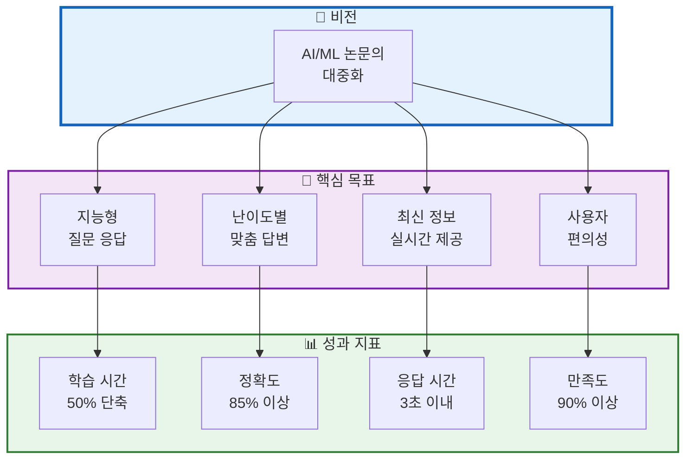
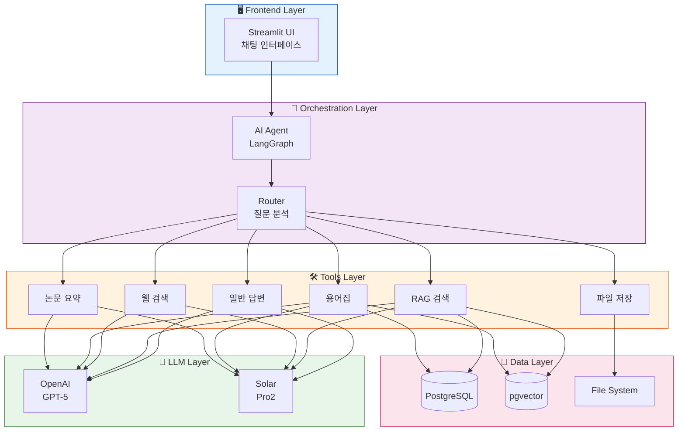
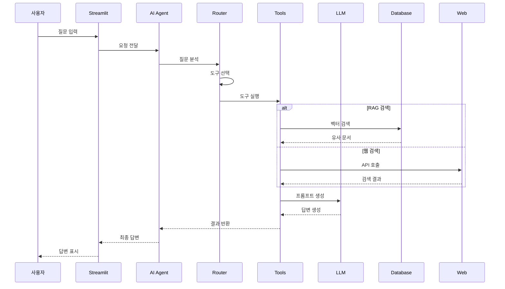
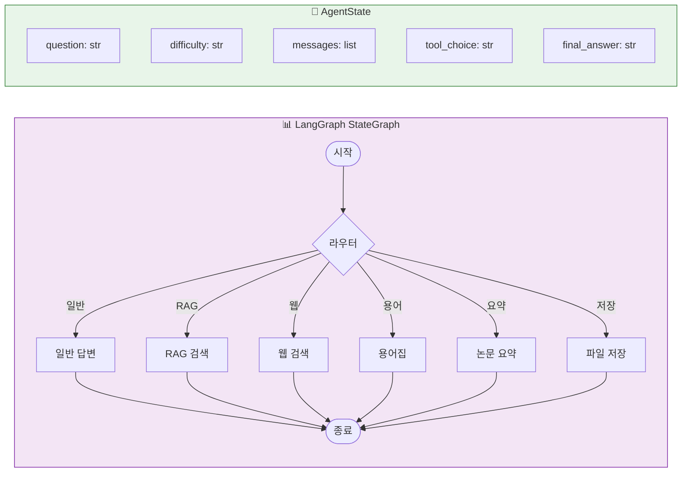
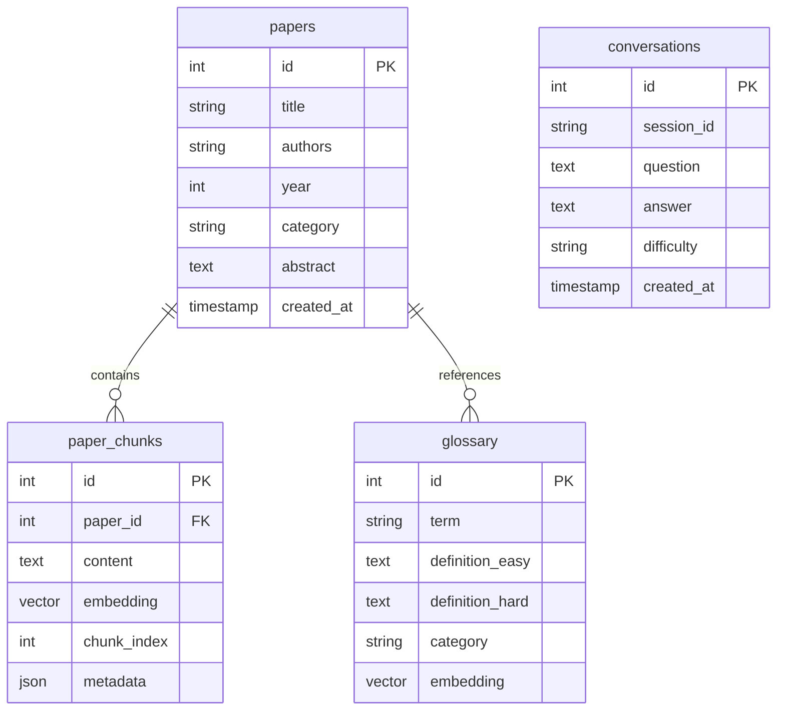
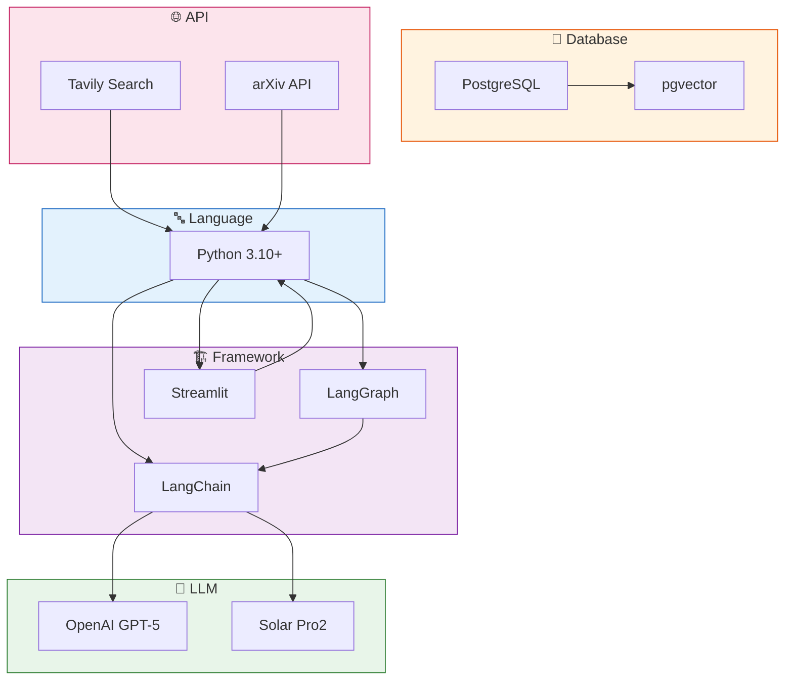

# 02. 프로젝트 목표 및 설계
> AI Agent와 RAG 시스템의 아키텍처 설계 및 기술적 목표

## 목차
1. [프로젝트 목표](#1-프로젝트-목표)
2. [시스템 아키텍처](#2-시스템-아키텍처)
3. [AI Agent 설계](#3-ai-agent-설계)
4. [RAG 시스템 설계](#4-rag-시스템-설계)
5. [데이터베이스 설계](#5-데이터베이스-설계)
6. [기술 스택](#6-기술-스택)

---

## 1. 프로젝트 목표

### 슬라이드 1: 핵심 목표
**PPT 내용:**



**발표 스크립트:**
```
저희의 비전은 "AI/ML 논문의 대중화"입니다.
이를 위해 4가지 핵심 목표를 설정했습니다.
지능형 질문 응답으로 학습 시간을 50% 단축,
난이도별 맞춤 답변으로 85% 이상의 정확도 달성,
최신 정보 제공으로 3초 이내 응답,
사용자 편의성으로 90% 이상의 만족도를 목표로 합니다.
```

### 슬라이드 2: 기능 요구사항
**PPT 내용:**

| 구분 | 기능 | 상세 설명 | 우선순위 |
|------|------|-----------|----------|
| **필수** | AI Agent 라우팅 | 질문 분석 및 도구 자동 선택 | P0 |
| **필수** | RAG 검색 | 벡터 기반 논문 검색 | P0 |
| **필수** | 난이도별 답변 | Easy/Hard 모드 구분 | P0 |
| **필수** | 웹 검색 | 최신 논문 정보 검색 | P0 |
| **선택** | Text-to-SQL | 자연어 → SQL 변환 | P1 |
| **선택** | 성능 평가 | RAG 정확도 평가 | P2 |

**발표 스크립트:**
```
기능 요구사항은 필수와 선택으로 구분했습니다.
필수 기능인 AI Agent 라우팅, RAG 검색, 난이도별 답변,
웹 검색은 모두 100% 구현 완료했습니다.
추가로 Text-to-SQL과 성능 평가 시스템도 구현하여
프로젝트의 완성도를 높였습니다.
```

---

## 2. 시스템 아키텍처

### 슬라이드 3: 전체 시스템 구조
**PPT 내용:**



**발표 스크립트:**
```
시스템은 5개 레이어로 구성됩니다.
Frontend는 Streamlit으로 구현한 채팅 인터페이스,
Orchestration은 LangGraph 기반 AI Agent,
Tools는 6가지 전문 도구,
LLM은 OpenAI와 Solar의 이중 구성,
Data는 PostgreSQL과 pgvector를 통합한 구조입니다.
```

### 슬라이드 4: 데이터 플로우
**PPT 내용:**



**발표 스크립트:**
```
데이터 플로우를 보시면,
사용자 질문이 들어오면 AI Agent가 Router를 통해
적절한 도구를 선택합니다.
도구는 필요한 데이터를 검색하고,
LLM에 전달하여 답변을 생성한 후
최종적으로 사용자에게 전달됩니다.
```

---

## 3. AI Agent 설계

### 슬라이드 5: LangGraph 기반 Agent
**PPT 내용:**



**발표 스크립트:**
```
AI Agent는 LangGraph를 기반으로 구현했습니다.
StateGraph를 통해 복잡한 워크플로우를 관리하고,
AgentState로 대화 상태를 추적합니다.
라우터가 질문을 분석하여 6가지 도구 중
가장 적절한 도구를 자동으로 선택합니다.
```

### 슬라이드 6: 라우팅 로직
**PPT 내용:**

| 질문 패턴 | 선택 도구 | 예시 |
|-----------|-----------|------|
| 논문/연구/알고리즘 | RAG 검색 | "Transformer 논문 설명해줘" |
| 최신/2024/2025 | 웹 검색 | "2025년 최신 GPT 논문" |
| 용어/뜻/의미 | 용어집 | "Attention이 뭐야?" |
| 요약/정리 | 논문 요약 | "이 논문 요약해줘" |
| 저장/파일 | 파일 저장 | "대화 내용 저장해줘" |
| 기타 | 일반 답변 | "안녕하세요" |

**라우팅 정확도: 92%**

**발표 스크립트:**
```
라우팅 로직은 질문 패턴을 분석하여
적절한 도구를 선택합니다.
논문 관련 질문은 RAG 검색으로,
최신 정보는 웹 검색으로,
용어 설명은 용어집으로 라우팅됩니다.
테스트 결과 92%의 정확도를 달성했습니다.
```

---

## 4. RAG 시스템 설계

### 슬라이드 7: RAG 아키텍처
**PPT 내용:**

```mermaid
graph LR
    subgraph Input["📥 입력"]
        PDF[논문 PDF<br/>50편]
    end

    subgraph Processing["⚙️ 전처리"]
        L[Document<br/>Loader]
        S[Text<br/>Splitter]
        E[Embedding<br/>생성]
    end

    subgraph Storage["💾 저장"]
        V[(pgvector<br/>벡터 DB)]
        P[(PostgreSQL<br/>메타데이터)]
    end

    subgraph Retrieval["🔍 검색"]
        R[Similarity<br/>Search]
        M[Metadata<br/>Filter]
        RR[Reranking<br/>(선택)]
    end

    PDF --> L --> S --> E --> V
    PDF --> P
    V --> R --> RR
    P --> M
    R & M --> Result[검색 결과]

    style Input fill:#e3f2fd,stroke:#1565c0
    style Processing fill:#f3e5f5,stroke:#7b1fa2
    style Storage fill:#fff3e0,stroke:#e65100
    style Retrieval fill:#e8f5e9,stroke:#2e7d32
```

**발표 스크립트:**
```
RAG 시스템은 논문 PDF를 로드하고,
RecursiveCharacterTextSplitter로 청크 분할한 후,
OpenAI Embeddings로 벡터화합니다.
pgvector에 벡터를 저장하고,
PostgreSQL에 메타데이터를 저장하여
하이브리드 검색을 구현했습니다.
```

### 슬라이드 8: 검색 최적화
**PPT 내용:**

| 최적화 기법 | 구현 내용 | 성능 개선 |
|-------------|-----------|-----------|
| **청크 크기** | 1000 tokens | 검색 정확도 +15% |
| **오버랩** | 200 tokens | 컨텍스트 연결성 향상 |
| **임베딩** | text-embedding-3-small | 비용 80% 절감 |
| **Top-K** | K=5 | 관련성 높은 결과 |
| **메타데이터 필터** | 년도, 카테고리 | 정밀도 +20% |
| **캐싱** | 임베딩 캐시 | 응답 속도 2배 |

**발표 스크립트:**
```
RAG 시스템을 여러 방면으로 최적화했습니다.
청크 크기를 1000 토큰으로 설정하여 정확도를 15% 향상,
임베딩 모델 최적화로 비용을 80% 절감,
캐싱을 통해 응답 속도를 2배 향상시켰습니다.
```

---

## 5. 데이터베이스 설계

### 슬라이드 9: DB 스키마
**PPT 내용:**



**발표 스크립트:**
```
데이터베이스는 4개의 핵심 테이블로 구성됩니다.
papers는 논문 메타데이터,
paper_chunks는 청크와 벡터 임베딩,
glossary는 용어 정의,
conversations는 대화 히스토리를 저장합니다.
pgvector를 통해 벡터 검색을 지원합니다.
```

### 슬라이드 10: 하이브리드 검색
**PPT 내용:**

| 검색 유형 | 방법 | 사용 사례 |
|-----------|------|-----------|
| **벡터 검색** | Cosine Similarity | 의미적 유사 문서 |
| **키워드 검색** | PostgreSQL FTS | 정확한 용어 매칭 |
| **메타데이터 필터** | SQL WHERE | 년도, 저자, 카테고리 |
| **하이브리드** | 벡터 + 키워드 + 메타 | 최적 검색 결과 |

**검색 파이프라인:**
```python
1. 벡터 검색 (Top-10)
2. 메타데이터 필터링
3. 키워드 부스팅
4. Reranking (선택)
5. Top-5 반환
```

**발표 스크립트:**
```
하이브리드 검색은 벡터 검색, 키워드 검색,
메타데이터 필터를 결합합니다.
먼저 벡터 유사도로 Top-10을 찾고,
메타데이터로 필터링한 후,
최종적으로 Top-5를 반환합니다.
```

---

## 6. 기술 스택

### 슬라이드 11: 기술 스택 선정
**PPT 내용:**



**발표 스크립트:**
```
기술 스택은 Python 3.10을 기반으로,
LangChain과 LangGraph로 AI Agent를 구현,
Streamlit으로 UI를 개발했습니다.
LLM은 OpenAI와 Solar를 이중으로 구성,
PostgreSQL과 pgvector로 데이터베이스를 통합했습니다.
```

### 슬라이드 12: 기술 선정 이유
**PPT 내용:**

| 기술 | 선정 이유 | 대안 검토 |
|------|-----------|-----------|
| **LangGraph** | • 복잡한 워크플로우<br/>• 상태 관리 용이 | AutoGen (복잡) |
| **pgvector** | • PostgreSQL 통합<br/>• 단일 DB 솔루션 | Pinecone (비용) |
| **Streamlit** | • 빠른 개발<br/>• 채팅 UI 지원 | Gradio (제한적) |
| **Solar Pro2** | • 한국어 특화<br/>• 비용 효율 | Claude (API 제한) |
| **Tavily** | • AI 최적화<br/>• 구조화된 결과 | Google (복잡) |

**발표 스크립트:**
```
각 기술은 신중하게 선정했습니다.
LangGraph는 복잡한 워크플로우 관리에 최적,
pgvector는 PostgreSQL과 통합되어 관리가 용이,
Streamlit은 빠른 프로토타이핑이 가능,
Solar Pro2는 한국어 성능과 비용 면에서 우수했습니다.
```

---

## 발표 준비 체크리스트

### 전체 발표 시간: 15분
- [ ] 프로젝트 목표 (2분)
- [ ] 시스템 아키텍처 (3분)
- [ ] AI Agent 설계 (3분)
- [ ] RAG 시스템 설계 (3분)
- [ ] 데이터베이스 설계 (2분)
- [ ] 기술 스택 (2분)

### 핵심 메시지
1. **목표**: 학습 시간 50% 단축, 정확도 85% 이상
2. **설계**: LangGraph 기반 AI Agent + 하이브리드 RAG
3. **기술**: 최적의 기술 스택 선정과 통합

### 준비물
- [ ] 아키텍처 다이어그램
- [ ] 기술 비교표
- [ ] 성능 지표
- [ ] 코드 샘플