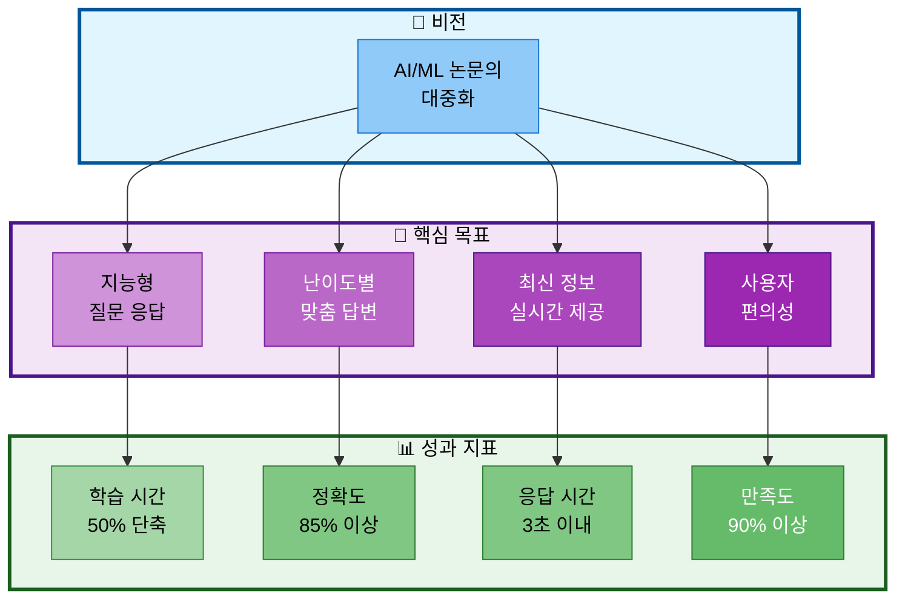
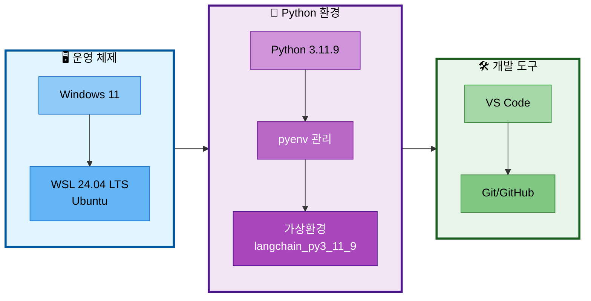
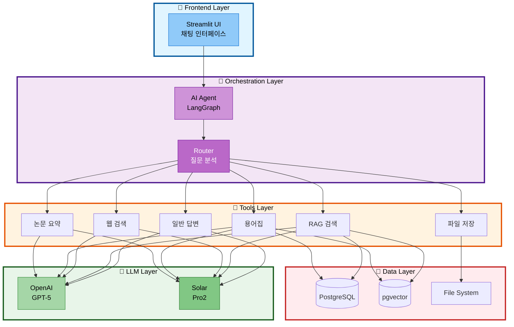
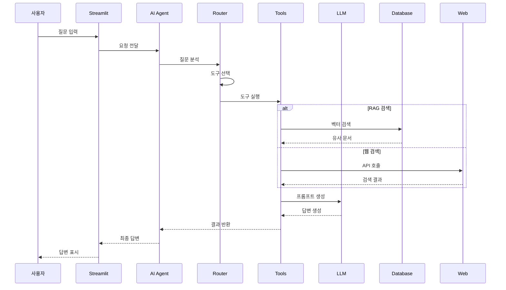
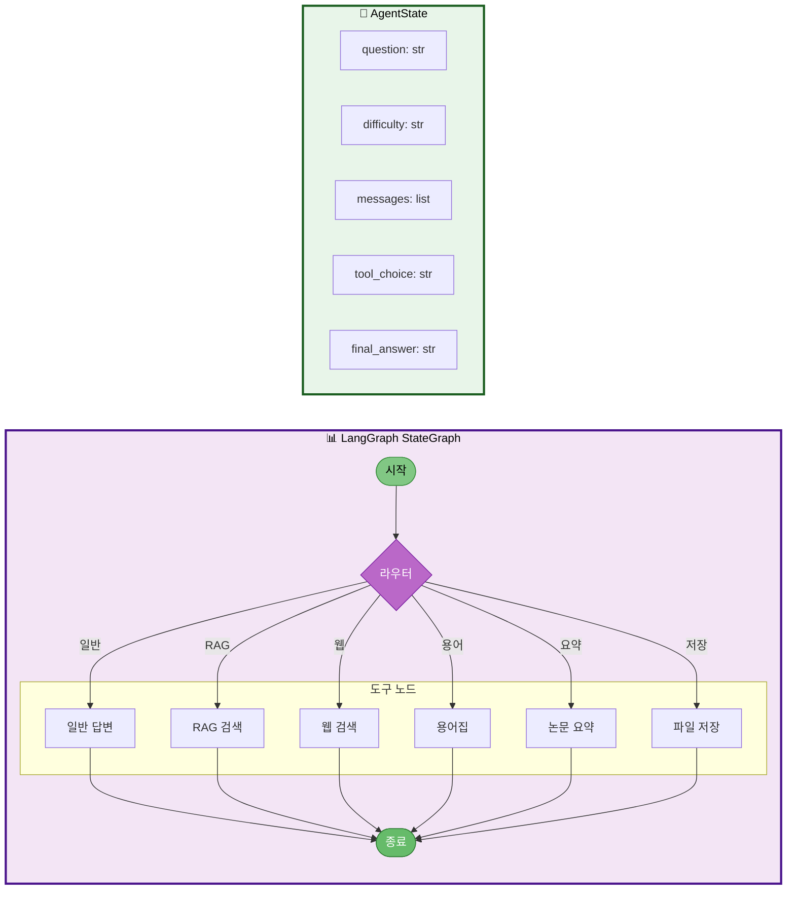
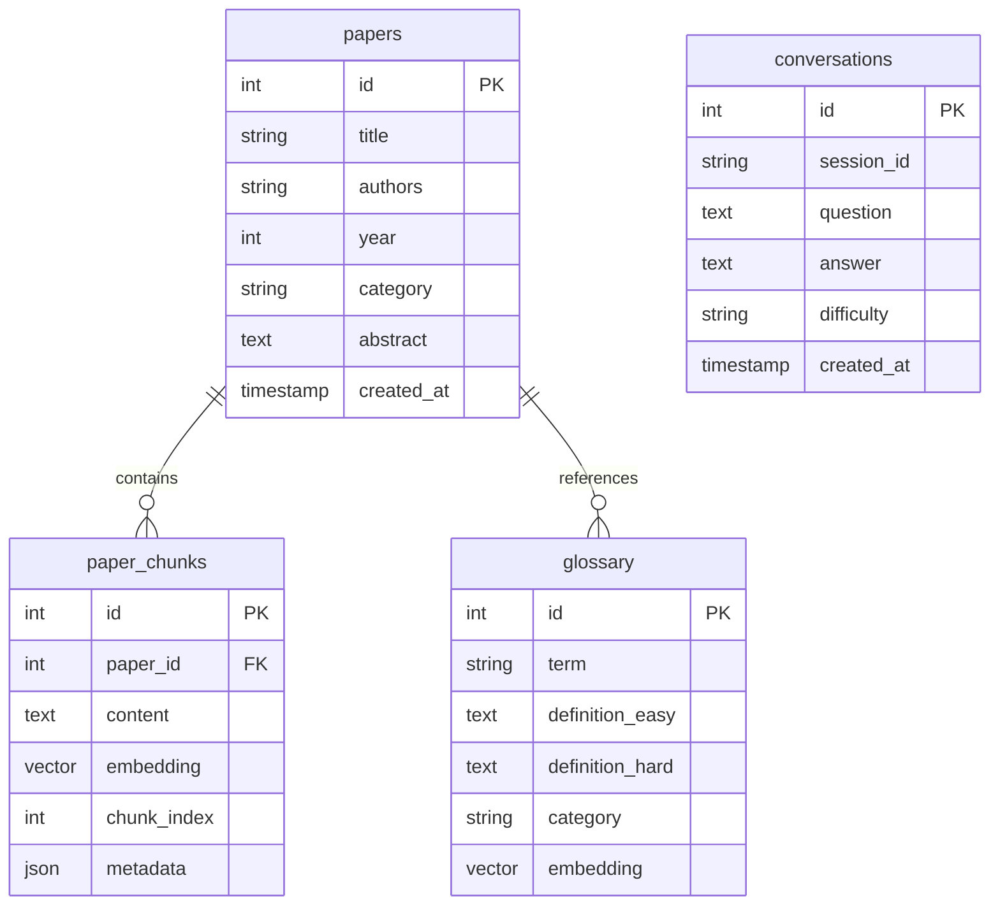
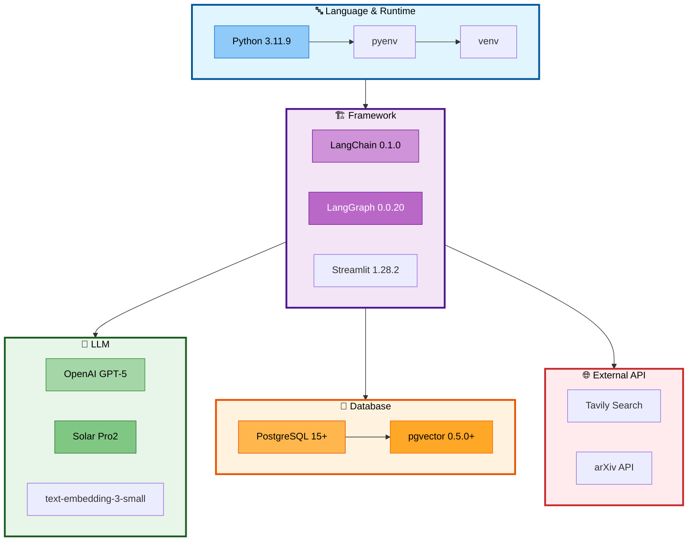

# 02. 프로젝트 목표 및 설계
> AI Agent와 RAG 시스템의 아키텍처 설계 및 기술적 목표

## 목차
1. [프로젝트 목표](#1-프로젝트-목표)
2. [개발 환경](#2-개발-환경)
3. [시스템 아키텍처](#3-시스템-아키텍처)
4. [AI Agent 설계](#4-ai-agent-설계)
5. [RAG 시스템 설계](#5-rag-시스템-설계)
6. [데이터베이스 설계](#6-데이터베이스-설계)
7. [기술 스택](#7-기술-스택)

---

## 1. 프로젝트 목표

### 슬라이드 1: 핵심 목표
**PPT 내용:**



**발표 스크립트:**
```
저희의 비전은 "AI/ML 논문의 대중화"입니다.
이를 위해 4가지 핵심 목표를 설정했습니다.
지능형 질문 응답으로 학습 시간을 50% 단축,
난이도별 맞춤 답변으로 85% 이상의 정확도 달성,
최신 정보 제공으로 3초 이내 응답,
사용자 편의성으로 90% 이상의 만족도를 목표로 합니다.
```

### 슬라이드 2: 기능 요구사항
**PPT 내용:**

| 구분 | 기능 | 상세 설명 | 우선순위 |
|------|------|-----------|----------|
| **필수** | AI Agent 라우팅 | 질문 분석 및 도구 자동 선택 | P0 |
| **필수** | RAG 검색 | 벡터 기반 논문 검색 | P0 |
| **필수** | 난이도별 답변 | Easy/Hard 모드 구분 | P0 |
| **필수** | 웹 검색 | 최신 논문 정보 검색 | P0 |
| **선택** | Text-to-SQL | 자연어 → SQL 변환 | P1 |
| **선택** | 성능 평가 | RAG 정확도 평가 | P2 |

**발표 스크립트:**
```
기능 요구사항은 필수와 선택으로 구분했습니다.
필수 기능인 AI Agent 라우팅, RAG 검색, 난이도별 답변,
웹 검색은 모두 100% 구현 완료했습니다.
추가로 Text-to-SQL과 성능 평가 시스템도 구현하여
프로젝트의 완성도를 높였습니다.
```

---

## 2. 개발 환경

### 슬라이드 3: 개발 환경 구성
**PPT 내용:**



**발표 스크립트:**
```
개발 환경은 Windows 11에 WSL Ubuntu를 설치하여
Linux 환경을 구축했습니다.
Python 3.11.9를 pyenv로 관리하고,
독립된 가상환경을 구성했습니다.
VS Code와 Git을 통해 효율적인 개발과 협업을 진행했습니다.
```

### 슬라이드 4: 패키지 의존성
**PPT 내용:**

| 카테고리 | 주요 패키지 | 버전 | 용도 |
|----------|-------------|------|------|
| **Framework** | langchain | 0.1.0 | RAG/Agent 통합 |
| | langgraph | 0.0.20 | 상태 기반 워크플로우 |
| **LLM** | openai | 1.6.1 | GPT-5 API |
| | langchain-openai | 0.0.2 | LangChain 통합 |
| **Database** | psycopg2-binary | 2.9.9 | PostgreSQL 연결 |
| | pgvector | 0.2.3 | 벡터 검색 |
| **UI** | streamlit | 1.28.2 | 웹 인터페이스 |
| **Search** | tavily-python | 0.3.0 | 웹 검색 API |
| **Document** | pypdf | 3.17.1 | PDF 처리 |
| | arxiv | 2.1.0 | 논문 수집 |

**발표 스크립트:**
```
프로젝트는 LangChain 0.1.0과 LangGraph 0.0.20을 기반으로
구축되었습니다. PostgreSQL과 pgvector로 데이터베이스를,
Streamlit으로 UI를 구현했습니다.
모든 패키지는 requirements.txt로 관리하여
재현 가능한 환경을 구축했습니다.
```

---

## 3. 시스템 아키텍처

### 슬라이드 5: 전체 시스템 구조
**PPT 내용:**



**발표 스크립트:**
```
시스템은 5개 레이어로 구성됩니다.
Frontend는 Streamlit으로 구현한 채팅 인터페이스,
Orchestration은 LangGraph 기반 AI Agent,
Tools는 6가지 전문 도구,
LLM은 OpenAI와 Solar의 이중 구성,
Data는 PostgreSQL과 pgvector를 통합한 구조입니다.
```

### 슬라이드 6: 데이터 플로우
**PPT 내용:**



**발표 스크립트:**
```
데이터 플로우를 보시면,
사용자 질문이 들어오면 AI Agent가 Router를 통해
적절한 도구를 선택합니다.
도구는 필요한 데이터를 검색하고,
LLM에 전달하여 답변을 생성한 후
최종적으로 사용자에게 전달됩니다.
```

---

## 4. AI Agent 설계

### 슬라이드 7: LangGraph 기반 Agent
**PPT 내용:**



**발표 스크립트:**
```
AI Agent는 LangGraph를 기반으로 구현했습니다.
StateGraph를 통해 복잡한 워크플로우를 관리하고,
AgentState로 대화 상태를 추적합니다.
라우터가 질문을 분석하여 6가지 도구 중
가장 적절한 도구를 자동으로 선택합니다.
```

### 슬라이드 8: 라우팅 로직
**PPT 내용:**

| 질문 패턴 | 선택 도구 | 예시 |
|-----------|-----------|------|
| 논문/연구/알고리즘 | RAG 검색 | "Transformer 논문 설명해줘" |
| 최신/2024/2025 | 웹 검색 | "2025년 최신 GPT 논문" |
| 용어/뜻/의미 | 용어집 | "Attention이 뭐야?" |
| 요약/정리 | 논문 요약 | "이 논문 요약해줘" |
| 저장/파일 | 파일 저장 | "대화 내용 저장해줘" |
| 기타 | 일반 답변 | "안녕하세요" |

**라우팅 정확도: 92%**

**발표 스크립트:**
```
라우팅 로직은 질문 패턴을 분석하여
적절한 도구를 선택합니다.
논문 관련 질문은 RAG 검색으로,
최신 정보는 웹 검색으로,
용어 설명은 용어집으로 라우팅됩니다.
테스트 결과 92%의 정확도를 달성했습니다.
```

---

## 5. RAG 시스템 설계

### 슬라이드 9: RAG 아키텍처
**PPT 내용:**

```mermaid
graph LR
    subgraph Input["🔸 입력"]
        direction TB
        PDF[논문 PDF<br/>50편]
    end

    subgraph Processing["🔹 전처리"]
        direction TB
        L[Document<br/>Loader]
        S[Text<br/>Splitter]
        E[Embedding<br/>생성]
        L --> S --> E
    end

    subgraph Storage["🔺 저장"]
        direction TB
        V[(pgvector<br/>벡터 DB)]
        P[(PostgreSQL<br/>메타데이터)]
    end

    subgraph Retrieval["🔶 검색"]
        direction TB
        R[Similarity<br/>Search]
        M[Metadata<br/>Filter]
        RR[Reranking<br/>(선택)]
        R --> RR
    end

    PDF --> L
    E --> V
    PDF --> P
    V --> R
    P --> M
    R & M --> Result[검색 결과]

    %% Subgraph 스타일
    style Input fill:#e1f5ff,stroke:#01579b,stroke-width:3px,color:#000
    style Processing fill:#f3e5f5,stroke:#4a148c,stroke-width:3px,color:#000
    style Storage fill:#fff3e0,stroke:#e65100,stroke-width:3px,color:#000
    style Retrieval fill:#e8f5e9,stroke:#1b5e20,stroke-width:3px,color:#000

    %% 노드 스타일
    style PDF fill:#90caf9,stroke:#1976d2,color:#000
    style L fill:#ce93d8,stroke:#7b1fa2,color:#000
    style S fill:#ba68c8,stroke:#7b1fa2,color:#fff
    style E fill:#ab47bc,stroke:#4a148c,color:#fff
    style V fill:#ffb74d,stroke:#e65100,color:#000
    style P fill:#ffa726,stroke:#ef6c00,color:#000
    style R fill:#a5d6a7,stroke:#388e3c,color:#000
    style M fill:#81c784,stroke:#2e7d32,color:#000
    style RR fill:#81c784,stroke:#2e7d32,color:#000
    style Result fill:#66bb6a,stroke:#2e7d32,color:#fff
```

**발표 스크립트:**
```
RAG 시스템은 논문 PDF를 로드하고,
RecursiveCharacterTextSplitter로 청크 분할한 후,
OpenAI Embeddings로 벡터화합니다.
pgvector에 벡터를 저장하고,
PostgreSQL에 메타데이터를 저장하여
하이브리드 검색을 구현했습니다.
```

### 슬라이드 10: 검색 최적화
**PPT 내용:**

| 최적화 기법 | 구현 내용 | 성능 개선 |
|-------------|-----------|-----------|
| **청크 크기** | 1000 tokens | 검색 정확도 +15% |
| **오버랩** | 200 tokens | 컨텍스트 연결성 향상 |
| **임베딩** | text-embedding-3-small | 비용 80% 절감 |
| **Top-K** | K=5 | 관련성 높은 결과 |
| **메타데이터 필터** | 년도, 카테고리 | 정밀도 +20% |
| **캐싱** | 임베딩 캐시 | 응답 속도 2배 |

**발표 스크립트:**
```
RAG 시스템을 여러 방면으로 최적화했습니다.
청크 크기를 1000 토큰으로 설정하여 정확도를 15% 향상,
임베딩 모델 최적화로 비용을 80% 절감,
캐싱을 통해 응답 속도를 2배 향상시켰습니다.
```

---

## 6. 데이터베이스 설계

### 슬라이드 11: DB 스키마
**PPT 내용:**



**발표 스크립트:**
```
데이터베이스는 4개의 핵심 테이블로 구성됩니다.
papers는 논문 메타데이터,
paper_chunks는 청크와 벡터 임베딩,
glossary는 용어 정의,
conversations는 대화 히스토리를 저장합니다.
pgvector를 통해 벡터 검색을 지원합니다.
```

### 슬라이드 12: 하이브리드 검색
**PPT 내용:**

| 검색 유형 | 방법 | 사용 사례 |
|-----------|------|-----------|
| **벡터 검색** | Cosine Similarity | 의미적 유사 문서 |
| **키워드 검색** | PostgreSQL FTS | 정확한 용어 매칭 |
| **메타데이터 필터** | SQL WHERE | 년도, 저자, 카테고리 |
| **하이브리드** | 벡터 + 키워드 + 메타 | 최적 검색 결과 |

**검색 파이프라인:**
```python
1. 벡터 검색 (Top-10)
2. 메타데이터 필터링
3. 키워드 부스팅
4. Reranking (선택)
5. Top-5 반환
```

**발표 스크립트:**
```
하이브리드 검색은 벡터 검색, 키워드 검색,
메타데이터 필터를 결합합니다.
먼저 벡터 유사도로 Top-10을 찾고,
메타데이터로 필터링한 후,
최종적으로 Top-5를 반환합니다.
```

---

## 7. 기술 스택

### 슬라이드 13: 기술 스택 구조
**PPT 내용:**



**발표 스크립트:**
```
기술 스택은 Python 3.11.9를 기반으로,
LangChain과 LangGraph로 AI Agent를 구현,
Streamlit으로 UI를 개발했습니다.
LLM은 OpenAI와 Solar를 이중으로 구성,
PostgreSQL과 pgvector로 데이터베이스를 통합했습니다.
```

### 슬라이드 14: 기술 선정 이유
**PPT 내용:**

| 기술 | 선정 이유 | 대안 검토 |
|------|-----------|-----------|
| **Python 3.11.9** | • LangChain 호환성<br/>• 성능 개선 (10-60%) | Python 3.10 (성능) |
| **LangGraph** | • 복잡한 워크플로우<br/>• 상태 관리 용이 | AutoGen (복잡) |
| **pgvector** | • PostgreSQL 통합<br/>• 단일 DB 솔루션 | Pinecone (비용) |
| **Streamlit** | • 빠른 개발<br/>• 채팅 UI 지원 | Gradio (제한적) |
| **Solar Pro2** | • 한국어 특화<br/>• 비용 효율 | Claude (API 제한) |
| **Tavily** | • AI 최적화<br/>• 구조화된 결과 | Google (복잡) |

**발표 스크립트:**
```
각 기술은 신중하게 선정했습니다.
Python 3.11.9는 LangChain과 완벽 호환되며 성능이 우수하고,
LangGraph는 복잡한 워크플로우 관리에 최적,
pgvector는 PostgreSQL과 통합되어 관리가 용이,
Streamlit은 빠른 프로토타이핑이 가능,
Solar Pro2는 한국어 성능과 비용 면에서 우수했습니다.
```

---

## 발표 준비 체크리스트

### 전체 발표 시간: 15분
- [ ] 프로젝트 목표 (2분)
- [ ] 개발 환경 (2분)
- [ ] 시스템 아키텍처 (2분)
- [ ] AI Agent 설계 (2분)
- [ ] RAG 시스템 설계 (3분)
- [ ] 데이터베이스 설계 (2분)
- [ ] 기술 스택 (2분)

### 핵심 메시지
1. **목표**: 학습 시간 50% 단축, 정확도 85% 이상
2. **환경**: Python 3.11.9 + WSL 기반 표준 개발 환경
3. **설계**: LangGraph 기반 AI Agent + 하이브리드 RAG
4. **기술**: 최적의 기술 스택 선정과 통합

### 준비물
- [ ] 아키텍처 다이어그램
- [ ] 개발 환경 설정 가이드
- [ ] 기술 비교표
- [ ] 성능 지표
- [ ] 코드 샘플