```mermaid
graph TB
    subgraph Sprint1["🏃 Sprint 1 (10/28-10/31)"]
        S1A[환경 구축]
        S1B[데이터 수집]
        S1C[DB 설정]
    end

    subgraph Sprint2["🏃 Sprint 2 (11/01-11/03)"]
        S2A[도구 개발]
        S2B[Agent 구현]
        S2C[UI 개발]
    end

    subgraph Sprint3["🏃 Sprint 3 (11/04-11/05)"]
        S3A[통합 테스트]
        S3B[버그 수정]
        S3C[최적화]
    end

    S1A --> S1B --> S1C
    S1C --> S2A & S2B & S2C
    S2A & S2B & S2C --> S3A
    S3A --> S3B --> S3C

    style Sprint1 fill:#e1f5ff,stroke:#0277bd,stroke-width:2px,color:#01579b
    style Sprint2 fill:#f3e5f5,stroke:#6a1b9a,stroke-width:2px,color:#4a148c
    style Sprint3 fill:#e8f5e9,stroke:#2e7d32,stroke-width:2px,color:#1b5e20

    style S1A fill:#e1f5ff,stroke:#0277bd,stroke-width:2px,color:#01579b
    style S1B fill:#e1f5ff,stroke:#0277bd,stroke-width:2px,color:#01579b
    style S1C fill:#e1f5ff,stroke:#0277bd,stroke-width:2px,color:#01579b

    style S2A fill:#f3e5f5,stroke:#6a1b9a,stroke-width:2px,color:#4a148c
    style S2B fill:#f3e5f5,stroke:#6a1b9a,stroke-width:2px,color:#4a148c
    style S2C fill:#f3e5f5,stroke:#6a1b9a,stroke-width:2px,color:#4a148c

    style S3A fill:#e8f5e9,stroke:#2e7d32,stroke-width:2px,color:#1b5e20
    style S3B fill:#e8f5e9,stroke:#2e7d32,stroke-width:2px,color:#1b5e20
    style S3C fill:#e8f5e9,stroke:#2e7d32,stroke-width:2px,color:#1b5e20
```

```mermaid
graph LR
    subgraph Essential["🔸 필수 도구"]
        T1[일반 답변]
        T2[RAG 검색]
        T3[웹 검색]
        T4[용어집]
        T5[논문 요약]
        T6[파일 저장]
    end

    subgraph Optional["🔹 선택 도구"]
        T7[Text-to-SQL]
    end

    subgraph Features["✨ 공통 기능"]
        F1[난이도별 처리]
        F2[에러 핸들링]
        F3[로깅]
    end

    T1 & T2 & T3 & T4 & T5 --> F1
    T1 & T2 & T3 & T4 & T5 & T6 & T7 --> F2 & F3

    style Essential fill:#e1f5ff,stroke:#0277bd,stroke-width:2px,color:#01579b
    style Optional fill:#f3e5f5,stroke:#6a1b9a,stroke-width:2px,color:#4a148c
    style Features fill:#e8f5e9,stroke:#2e7d32,stroke-width:2px,color:#1b5e20

    style T1 fill:#e1f5ff,stroke:#0277bd,stroke-width:2px,color:#01579b
    style T2 fill:#e1f5ff,stroke:#0277bd,stroke-width:2px,color:#01579b
    style T3 fill:#e1f5ff,stroke:#0277bd,stroke-width:2px,color:#01579b
    style T4 fill:#e1f5ff,stroke:#0277bd,stroke-width:2px,color:#01579b
    style T5 fill:#e1f5ff,stroke:#0277bd,stroke-width:2px,color:#01579b
    style T6 fill:#e1f5ff,stroke:#0277bd,stroke-width:2px,color:#01579b

    style T7 fill:#f3e5f5,stroke:#6a1b9a,stroke-width:2px,color:#4a148c

    style F1 fill:#e8f5e9,stroke:#2e7d32,stroke-width:2px,color:#1b5e20
    style F2 fill:#e8f5e9,stroke:#2e7d32,stroke-width:2px,color:#1b5e20
    style F3 fill:#e8f5e9,stroke:#2e7d32,stroke-width:2px,color:#1b5e20
```

```mermaid
graph TB
    subgraph Development["🔨 개발 단계"]
        D1[단위 테스트]
        D2[모듈 테스트]
    end

    subgraph Integration["🔗 통합 단계"]
        I1[API 통합]
        I2[DB 연동]
        I3[UI 통합]
    end

    subgraph Testing["✅ 테스트 단계"]
        T1[E2E 테스트]
        T2[시나리오 테스트]
        T3[부하 테스트]
    end

    D1 & D2 --> I1 & I2 & I3
    I1 & I2 & I3 --> T1
    T1 --> T2 --> T3

    style Development fill:#e1f5ff,stroke:#0277bd,stroke-width:2px,color:#01579b
    style Integration fill:#f3e5f5,stroke:#6a1b9a,stroke-width:2px,color:#4a148c
    style Testing fill:#e8f5e9,stroke:#2e7d32,stroke-width:2px,color:#1b5e20

    style D1 fill:#e1f5ff,stroke:#0277bd,stroke-width:2px,color:#01579b
    style D2 fill:#e1f5ff,stroke:#0277bd,stroke-width:2px,color:#01579b

    style I1 fill:#f3e5f5,stroke:#6a1b9a,stroke-width:2px,color:#4a148c
    style I2 fill:#f3e5f5,stroke:#6a1b9a,stroke-width:2px,color:#4a148c
    style I3 fill:#f3e5f5,stroke:#6a1b9a,stroke-width:2px,color:#4a148c

    style T1 fill:#e8f5e9,stroke:#2e7d32,stroke-width:2px,color:#1b5e20
    style T2 fill:#e8f5e9,stroke:#2e7d32,stroke-width:2px,color:#1b5e20
    style T3 fill:#e8f5e9,stroke:#2e7d32,stroke-width:2px,color:#1b5e20
```

```mermaid
graph LR
    subgraph Before["📉 최적화 전"]
        B1[응답: 5-7초]
        B2[메모리: 2GB]
        B3[비용: $0.05/쿼리]
    end

    subgraph Optimization["⚡ 최적화 기법"]
        O1[패턴 라우팅]
        O2[임베딩 캐싱]
        O3[모델 선택]
        O4[청크 최적화]
    end

    subgraph After["📈 최적화 후"]
        A1[응답: 2-3초]
        A2[메모리: 800MB]
        A3[비용: $0.01/쿼리]
    end

    B1 --> O1 --> A1
    B2 --> O2 --> A2
    B3 --> O3 & O4 --> A3

    style Before fill:#ffebee,stroke:#c62828,stroke-width:2px,color:#b71c1c
    style Optimization fill:#fff3e0,stroke:#e65100,stroke-width:2px,color:#bf360c
    style After fill:#e8f5e9,stroke:#2e7d32,stroke-width:2px,color:#1b5e20

    style B1 fill:#ffebee,stroke:#c62828,stroke-width:2px,color:#b71c1c
    style B2 fill:#ffebee,stroke:#c62828,stroke-width:2px,color:#b71c1c
    style B3 fill:#ffebee,stroke:#c62828,stroke-width:2px,color:#b71c1c

    style O1 fill:#fff3e0,stroke:#e65100,stroke-width:2px,color:#bf360c
    style O2 fill:#fff3e0,stroke:#e65100,stroke-width:2px,color:#bf360c
    style O3 fill:#fff3e0,stroke:#e65100,stroke-width:2px,color:#bf360c
    style O4 fill:#fff3e0,stroke:#e65100,stroke-width:2px,color:#bf360c

    style A1 fill:#e8f5e9,stroke:#2e7d32,stroke-width:2px,color:#1b5e20
    style A2 fill:#e8f5e9,stroke:#2e7d32,stroke-width:2px,color:#1b5e20
    style A3 fill:#e8f5e9,stroke:#2e7d32,stroke-width:2px,color:#1b5e20
```

```mermaid
graph TB
    subgraph Standards["📏 코딩 표준"]
        S1[PEP 8]
        S2[Type Hints]
        S3[Docstring]
    end

    subgraph Tools["🛠️ 도구"]
        T1[Black<br/>포맷터]
        T2[Pylint<br/>린터]
        T3[Pytest<br/>테스트]
    end

    subgraph Process["📋 프로세스"]
        P1[코드 리뷰]
        P2[PR 승인]
        P3[CI/CD]
    end

    S1 & S2 & S3 --> T1 & T2
    T1 & T2 --> T3
    T3 --> P1 --> P2 --> P3

    style Standards fill:#e1f5ff,stroke:#0277bd,stroke-width:2px,color:#01579b
    style Tools fill:#f3e5f5,stroke:#6a1b9a,stroke-width:2px,color:#4a148c
    style Process fill:#e8f5e9,stroke:#2e7d32,stroke-width:2px,color:#1b5e20

    style S1 fill:#e1f5ff,stroke:#0277bd,stroke-width:2px,color:#01579b
    style S2 fill:#e1f5ff,stroke:#0277bd,stroke-width:2px,color:#01579b
    style S3 fill:#e1f5ff,stroke:#0277bd,stroke-width:2px,color:#01579b

    style T1 fill:#f3e5f5,stroke:#6a1b9a,stroke-width:2px,color:#4a148c
    style T2 fill:#f3e5f5,stroke:#6a1b9a,stroke-width:2px,color:#4a148c
    style T3 fill:#f3e5f5,stroke:#6a1b9a,stroke-width:2px,color:#4a148c

    style P1 fill:#e8f5e9,stroke:#2e7d32,stroke-width:2px,color:#1b5e20
    style P2 fill:#e8f5e9,stroke:#2e7d32,stroke-width:2px,color:#1b5e20
    style P3 fill:#e8f5e9,stroke:#2e7d32,stroke-width:2px,color:#1b5e20
```

# 03. 개발 및 구현
> 프로젝트의 실제 개발 과정과 구현 세부사항

## 목차
1. [개발 프로세스](#1-개발-프로세스)
2. [핵심 기능 구현](#2-핵심-기능-구현)
3. [7가지 도구 구현](#3-7가지-도구-구현)
4. [통합 및 테스트](#4-통합-및-테스트)
5. [성능 최적화](#5-성능-최적화)
6. [코드 품질 관리](#6-코드-품질-관리)

---

## 1. 개발 프로세스

### 슬라이드 1: 개발 방법론
**PPT 내용:**



**발표 스크립트:**
```
개발은 3개의 스프린트로 진행했습니다.
첫 번째 스프린트에서는 환경 구축과 데이터 수집,
두 번째 스프린트에서는 핵심 기능 개발,
세 번째 스프린트에서는 통합 테스트와 최적화를 진행했습니다.
애자일 방법론을 적용하여 일일 스탠드업을 통해 진행 상황을 공유했습니다.
```

### 슬라이드 2: 모듈화 구조
**PPT 내용:**

| 모듈 | 파일 경로 | 담당자 | 주요 기능 |
|------|-----------|--------|-----------|
| **AI Agent** | `src/agent/` | 최현화 | LangGraph, 라우팅 |
| **도구** | `src/tools/` | 전원 | 7가지 도구 |
| **RAG** | `src/rag/` | 신준엽 | 벡터 검색 |
| **UI** | `ui/` | 임예슬 | Streamlit |
| **데이터** | `src/data/` | 박재홍 | 전처리 |
| **실험** | `src/utils/experiment_manager.py` | 최현화 | 로깅, 추적 |

**디렉토리 구조:**
```
src/
├── agent/      # AI Agent 핵심
├── tools/      # 7가지 도구
├── rag/        # RAG 시스템
├── llm/        # LLM 클라이언트
├── prompts/    # 프롬프트 템플릿
├── memory/     # 대화 메모리
└── utils/      # 유틸리티
```

**발표 스크립트:**
```
프로젝트는 명확한 모듈화 구조로 개발했습니다.
각 팀원이 독립적으로 개발할 수 있도록 모듈을 분리하고,
인터페이스를 명확히 정의하여 통합을 용이하게 했습니다.
특히 실험 관리 시스템을 통해 모든 실행을 추적했습니다.
```

---

## 2. 핵심 기능 구현

### 슬라이드 3: AI Agent 구현
**PPT 내용:**



```mermaid
sequenceDiagram
    participant User
    participant Router
    participant Tools
    participant LLM

    User->>Router: 질문 입력
    Router->>Router: 패턴 분석

    alt 패턴 매칭 성공
        Router->>Tools: 도구 직접 호출
    else 패턴 매칭 실패
        Router->>LLM: LLM 라우팅
        LLM->>Router: 도구 선택
        Router->>Tools: 도구 호출
    end

    Tools->>LLM: 컨텍스트 전달
    LLM->>User: 답변 생성
```

**구현 세부사항:**
- **패턴 기반 라우팅**: 정규식으로 빠른 도구 선택
- **LLM Fallback**: 패턴 실패 시 LLM 판단
- **상태 관리**: AgentState로 대화 추적
- **에러 처리**: 3단계 Fallback 메커니즘

**발표 스크립트:**
```
AI Agent는 하이브리드 라우팅을 구현했습니다.
먼저 패턴 매칭으로 빠르게 도구를 선택하고,
실패 시 LLM이 판단하는 2단계 시스템입니다.
이를 통해 응답 속도와 정확도를 모두 확보했습니다.
```

### 슬라이드 4: RAG 시스템 구현
**PPT 내용:**

| 구성 요소 | 구현 내용 | 성능 지표 |
|-----------|-----------|-----------|
| **Document Loader** | PyPDFLoader | 50편 논문 처리 |
| **Text Splitter** | RecursiveCharacter (1000/200) | 청크 2,500개 |
| **Embeddings** | text-embedding-3-small | 1536 차원 |
| **Vector Store** | pgvector | 코사인 유사도 |
| **Retriever** | Top-5 검색 | 정확도 85% |
| **Reranker** | Cross-encoder (선택) | +10% 개선 |

**최적화 기법:**
- 청크 크기 최적화 (1000 토큰)
- 오버랩 설정 (200 토큰)
- 메타데이터 필터링
- 임베딩 캐싱

**발표 스크립트:**
```
RAG 시스템은 50편의 논문을 2,500개 청크로 분할하여
pgvector에 저장했습니다.
text-embedding-3-small 모델로 비용을 80% 절감하면서도
85%의 검색 정확도를 달성했습니다.
```

---

## 3. 7가지 도구 구현

### 슬라이드 5: 도구 시스템 개요
**PPT 내용:**



**발표 스크립트:**
```
총 7가지 도구를 구현했습니다.
6개 필수 도구와 1개 선택 도구로 구성되며,
모든 도구가 난이도별 처리와 에러 핸들링을 지원합니다.
각 도구는 독립적으로 동작하면서도 통합된 로깅을 제공합니다.
```

### 슬라이드 6: 도구별 구현 현황
**PPT 내용:**

| 도구 | 기능 | 기술 | 성능 |
|------|------|------|------|
| **일반 답변** | LLM 직접 호출 | GPT-5/Solar | 응답 1초 |
| **RAG 검색** | 논문 DB 검색 | pgvector | 정확도 85% |
| **웹 검색** | 최신 정보 | Tavily API | 응답 2초 |
| **용어집** | 용어 설명 | PostgreSQL | 300+ 용어 |
| **논문 요약** | 섹션별 요약 | LangChain | 3단계 요약 |
| **파일 저장** | 결과 저장 | FileSystem | 자동 경로 |
| **Text-to-SQL** | 통계 조회 | SQL생성 | 정확도 75% |

**구현 통계:**
- 총 코드 라인: 2,500+
- 테스트 커버리지: 78%
- 평균 응답 시간: 2.5초

**발표 스크립트:**
```
각 도구는 특화된 기능을 수행합니다.
RAG 검색은 85%의 정확도를,
웹 검색은 2초 내 응답을,
용어집은 300개 이상의 용어를 지원합니다.
전체 시스템의 평균 응답 시간은 2.5초입니다.
```

---

## 4. 통합 및 테스트

### 슬라이드 7: 통합 프로세스
**PPT 내용:**



**발표 스크립트:**
```
통합은 3단계로 진행했습니다.
먼저 각 모듈의 단위 테스트를 완료하고,
API와 DB를 순차적으로 통합한 후,
10개의 시나리오로 E2E 테스트를 수행했습니다.
```

### 슬라이드 8: 테스트 결과
**PPT 내용:**

| 테스트 시나리오 | 결과 | 응답 시간 |
|-----------------|------|-----------|
| 간단한 인사 | ✅ 성공 | 0.8초 |
| 논문 검색 (RAG) | ✅ 성공 | 2.3초 |
| 최신 논문 검색 | ✅ 성공 | 2.1초 |
| 용어 설명 | ✅ 성공 | 1.5초 |
| 논문 요약 | ✅ 성공 | 3.2초 |
| 통계 조회 (SQL) | ✅ 성공 | 1.8초 |
| 파일 저장 | ✅ 성공 | 0.5초 |
| 멀티턴 대화 | ✅ 성공 | 2.0초 |
| 에러 처리 | ✅ 성공 | 1.2초 |
| 동시 요청 (5개) | ✅ 성공 | 4.5초 |

**전체 성공률: 100%**

**발표 스크립트:**
```
10개 시나리오 테스트를 모두 통과했습니다.
평균 응답 시간은 2초 이내로 목표를 달성했고,
동시 요청 처리도 안정적으로 동작합니다.
특히 에러 처리와 멀티턴 대화도 완벽히 구현했습니다.
```

---

## 5. 성능 최적화

### 슬라이드 9: 최적화 전략
**PPT 내용:**



**발표 스크립트:**
```
성능 최적화를 통해 큰 개선을 달성했습니다.
패턴 기반 라우팅으로 응답 시간을 60% 단축,
임베딩 캐싱으로 메모리 사용량을 60% 감소,
적절한 모델 선택으로 비용을 80% 절감했습니다.
```

### 슬라이드 10: 구체적 개선 사항
**PPT 내용:**

| 영역 | 개선 전 | 개선 후 | 개선율 |
|------|---------|---------|--------|
| **라우팅 속도** | LLM 호출 (2초) | 패턴 매칭 (0.1초) | 95% ↑ |
| **임베딩 생성** | 매번 생성 | 캐싱 활용 | 70% ↑ |
| **LLM 비용** | GPT-5 only | Solar 혼용 | 60% ↓ |
| **청크 검색** | 전체 검색 | Top-K 제한 | 50% ↑ |
| **DB 쿼리** | 개별 쿼리 | 배치 처리 | 40% ↑ |

**발표 스크립트:**
```
구체적인 개선 사항을 보시면,
라우팅 속도는 95% 향상,
임베딩 캐싱으로 70% 성능 개선,
LLM 비용은 60% 절감을 달성했습니다.
이러한 최적화로 실용적인 서비스 수준에 도달했습니다.
```

---

## 6. 코드 품질 관리

### 슬라이드 11: 품질 관리 체계
**PPT 내용:**



**발표 스크립트:**
```
코드 품질 관리를 체계적으로 수행했습니다.
PEP 8 표준과 Type Hints를 적용하고,
Black과 Pylint로 자동 검증했습니다.
모든 코드는 리뷰를 거쳐 병합되었습니다.
```

### 슬라이드 12: 실험 관리 시스템
**PPT 내용:**

| 기능 | 구현 내용 | 효과 |
|------|-----------|------|
| **실험 추적** | ExperimentManager | 모든 실행 기록 |
| **로깅** | 구조화된 로그 | 디버깅 용이 |
| **메트릭** | 성능 지표 자동 수집 | 개선 추적 |
| **버전 관리** | Git + 실험 ID | 재현 가능 |
| **결과 저장** | JSON + CSV | 분석 용이 |

**실험 폴더 구조:**
```
experiments/
└── 20251105/
    └── session_001/
        ├── config.yaml
        ├── experiment.log
        ├── results.json
        └── conversations/
```

**발표 스크립트:**
```
실험 관리 시스템을 통해 모든 개발 과정을 추적했습니다.
총 50회 이상의 실험을 수행하고,
각 실험의 설정과 결과를 체계적으로 관리했습니다.
이를 통해 최적의 파라미터를 찾을 수 있었습니다.
```

---

## 발표 준비 체크리스트

### 전체 발표 시간: 15분
- [ ] 개발 프로세스 (2분)
- [ ] 핵심 기능 구현 (3분)
- [ ] 7가지 도구 구현 (3분)
- [ ] 통합 및 테스트 (2분)
- [ ] 성능 최적화 (3분)
- [ ] 코드 품질 관리 (2분)

### 핵심 메시지
1. **체계적 개발**: 3개 스프린트, 명확한 모듈화
2. **완성도**: 7가지 도구 100% 구현, 테스트 통과
3. **최적화**: 응답 시간 60% 단축, 비용 80% 절감

### 준비물
- [ ] 코드 데모
- [ ] 성능 그래프
- [ ] 테스트 결과
- [ ] 실험 로그