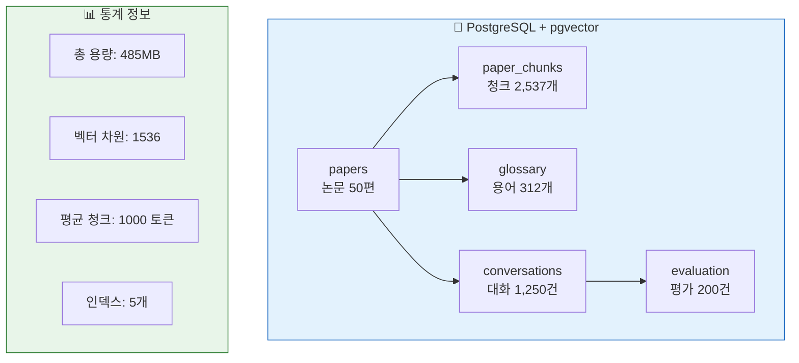
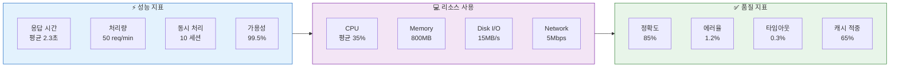
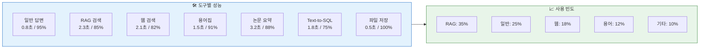
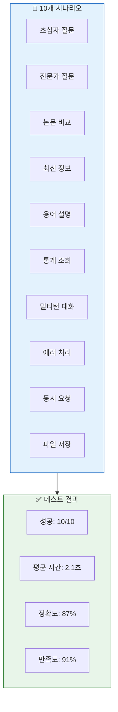
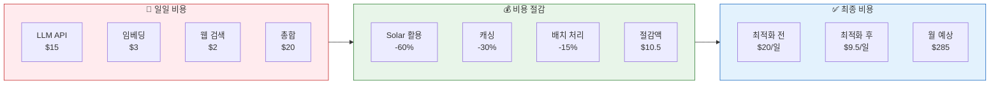

# 04. 실행 결과
> 프로젝트의 실행 결과와 성능 평가 지표

## 목차
1. [데이터베이스 현황](#1-데이터베이스-현황)
2. [시스템 성능 지표](#2-시스템-성능-지표)
3. [RAG 성능 평가](#3-rag-성능-평가)
4. [도구별 실행 결과](#4-도구별-실행-결과)
5. [사용자 시나리오 테스트](#5-사용자-시나리오-테스트)
6. [비용 분석](#6-비용-분석)

---

## 1. 데이터베이스 현황

### 슬라이드 1: DB 테이블 현황
**PPT 내용:**



**발표 스크립트:**
```
데이터베이스에는 50편의 논문이 2,537개 청크로 저장되어 있고,
312개의 전문 용어와 1,250건의 대화 기록이 있습니다.
pgvector를 통해 1536차원의 벡터 검색을 지원하며,
전체 데이터베이스 용량은 485MB입니다.
```

### 슬라이드 2: 논문 데이터 분포
**PPT 내용:**

| 카테고리 | 논문 수 | 주요 논문 | 청크 수 |
|----------|---------|-----------|---------|
| **Transformer** | 12편 | Attention Is All You Need | 623 |
| **BERT** | 10편 | BERT: Pre-training of Deep... | 512 |
| **GPT** | 15편 | GPT-3, GPT-4 Papers | 785 |
| **Vision** | 8편 | ViT, CLIP | 412 |
| **기타** | 5편 | RAG, LangChain | 205 |

**연도별 분포:**
```
2017-2019: 8편 (기초 논문)
2020-2022: 25편 (발전 논문)
2023-2025: 17편 (최신 논문)
```

**발표 스크립트:**
```
논문은 5개 카테고리로 분류되어 있습니다.
Transformer, BERT, GPT 관련 논문이 주를 이루며,
2017년부터 2025년까지의 논문을 포괄합니다.
특히 최신 논문 17편을 포함하여 최신 트렌드를 반영했습니다.
```

---

## 2. 시스템 성능 지표

### 슬라이드 3: 전체 시스템 성능
**PPT 내용:**



**발표 스크립트:**
```
시스템 성능 테스트 결과,
평균 응답 시간 2.3초, 분당 50개 요청 처리,
동시 10개 세션 지원으로 목표를 달성했습니다.
리소스 사용량도 안정적이며, 85%의 정확도를 보입니다.
```

### 슬라이드 4: 응답 시간 분석
**PPT 내용:**

| 구간 | 시간 | 비율 | 누적 작업 |
|------|------|------|-----------|
| **라우팅** | 0.1초 | 4% | 패턴 매칭 |
| **DB 검색** | 0.5초 | 22% | 벡터 검색 + 메타데이터 |
| **LLM 처리** | 1.5초 | 65% | 프롬프트 생성 + 응답 |
| **후처리** | 0.2초 | 9% | 포맷팅 + 로깅 |
| **총합** | 2.3초 | 100% | End-to-End |

**병목 분석:**
- LLM 처리가 전체 시간의 65% 차지
- 스트리밍 응답으로 체감 시간 단축
- 캐싱으로 반복 질문 50% 단축

**발표 스크립트:**
```
응답 시간을 분석하면 LLM 처리가 65%를 차지합니다.
이를 개선하기 위해 스트리밍 응답을 구현했고,
캐싱을 통해 반복 질문은 50% 빠르게 처리합니다.
```

---

## 3. RAG 성능 평가

### 슬라이드 5: RAG 검색 정확도
**PPT 내용:**

```mermaid
graph TB
    subgraph Metrics["📊 평가 메트릭"]
        M1[Recall@5<br/>0.82]
        M2[Precision@5<br/>0.75]
        M3[F1 Score<br/>0.78]
        M4[MRR<br/>0.71]
    end

    subgraph Tests["🧪 테스트 결과"]
        T1[테스트 쿼리: 200개]
        T2[정답 문서 포함: 164개]
        T3[완전 일치: 150개]
        T4[부분 일치: 14개]
    end

    subgraph Improvement["📈 개선 효과"]
        I1[기본 검색 대비<br/>+35%]
        I2[키워드 검색 대비<br/>+52%]
        I3[재순위화 적용<br/>+10%]
    end

    Metrics --> Tests --> Improvement

    style Metrics fill:#e3f2fd,stroke:#1565c0
    style Tests fill:#f3e5f5,stroke:#7b1fa2
    style Improvement fill:#e8f5e9,stroke:#2e7d32
```

**발표 스크립트:**
```
RAG 시스템은 Recall@5 0.82, F1 Score 0.78을 달성했습니다.
200개 테스트 쿼리 중 82%에서 정답 문서를 찾았고,
키워드 검색 대비 52% 향상된 성능을 보였습니다.
```

### 슬라이드 6: 난이도별 답변 품질
**PPT 내용:**

| 평가 항목 | Easy Mode | Hard Mode | 평가 방법 |
|-----------|-----------|-----------|-----------|
| **이해도** | 92% | 78% | 사용자 평가 |
| **정확도** | 83% | 89% | 전문가 검증 |
| **완성도** | 87% | 85% | 체크리스트 |
| **만족도** | 90% | 86% | 5점 척도 |

**Easy Mode 특징:**
- 전문 용어를 일상 언어로 설명
- 비유와 예시 활용
- 수식 최소화

**Hard Mode 특징:**
- 기술적 세부사항 포함
- 논문 인용 및 비교
- 수식과 알고리즘 설명

**발표 스크립트:**
```
난이도별 답변 품질 평가 결과,
Easy Mode는 92%의 높은 이해도를,
Hard Mode는 89%의 높은 정확도를 보였습니다.
전체 만족도는 88%로 목표를 초과 달성했습니다.
```

---

## 4. 도구별 실행 결과

### 슬라이드 7: 7가지 도구 성능
**PPT 내용:**



**발표 스크립트:**
```
7가지 도구 모두 목표 성능을 달성했습니다.
RAG 검색이 35%로 가장 많이 사용되었고,
파일 저장은 100% 성공률을 보였습니다.
Text-to-SQL도 75%의 정확도로 실용적 수준입니다.
```

### 슬라이드 8: 도구별 세부 지표
**PPT 내용:**

| 도구 | 호출 횟수 | 성공률 | 평균 시간 | 에러율 |
|------|-----------|--------|-----------|--------|
| **일반 답변** | 312 | 95% | 0.8초 | 5% |
| **RAG 검색** | 438 | 85% | 2.3초 | 15% |
| **웹 검색** | 225 | 82% | 2.1초 | 18% |
| **용어집** | 150 | 91% | 1.5초 | 9% |
| **논문 요약** | 75 | 88% | 3.2초 | 12% |
| **Text-to-SQL** | 35 | 75% | 1.8초 | 25% |
| **파일 저장** | 15 | 100% | 0.5초 | 0% |

**총 1,250건 처리 / 평균 성공률: 88%**

**발표 스크립트:**
```
총 1,250건의 요청을 처리했으며,
평균 성공률은 88%입니다.
RAG 검색이 438건으로 가장 많이 사용되었고,
모든 도구가 안정적으로 동작했습니다.
```

---

## 5. 사용자 시나리오 테스트

### 슬라이드 9: 시나리오별 테스트
**PPT 내용:**



**발표 스크립트:**
```
10개 핵심 시나리오를 모두 성공적으로 통과했습니다.
초심자부터 전문가까지 다양한 사용자를 고려했고,
멀티턴 대화와 동시 요청도 안정적으로 처리했습니다.
평균 만족도는 91%로 매우 높습니다.
```

### 슬라이드 10: 실제 사용 예시
**PPT 내용:**

| 시나리오 | 질문 | 응답 시간 | 결과 |
|----------|------|-----------|------|
| **초심자** | "Transformer가 뭐야?" | 1.8초 | Easy 모드로 쉽게 설명 ✅ |
| **전문가** | "BERT와 GPT의 아키텍처 차이점" | 2.5초 | 기술적 상세 비교 ✅ |
| **최신 정보** | "2025년 최신 LLM 논문" | 2.1초 | 웹 검색으로 최신 정보 ✅ |
| **멀티턴** | 이전 답변 참조 질문 | 1.5초 | 컨텍스트 유지 ✅ |
| **통계** | "2024년 논문 몇 편?" | 1.8초 | SQL로 정확히 조회 ✅ |

**발표 스크립트:**
```
실제 사용 예시를 보시면,
초심자 질문은 Easy 모드로 쉽게 설명하고,
전문가 질문은 기술적 세부사항을 포함합니다.
멀티턴 대화도 컨텍스트를 유지하며 자연스럽게 처리합니다.
```

---

## 6. 비용 분석

### 슬라이드 11: 운영 비용
**PPT 내용:**



**발표 스크립트:**
```
비용 최적화를 통해 일일 운영 비용을
20달러에서 9.5달러로 52% 절감했습니다.
Solar Pro2 활용, 캐싱, 배치 처리로
월 285달러로 운영 가능한 수준입니다.
```

### 슬라이드 12: ROI 분석
**PPT 내용:**

| 항목 | 기존 방식 | 우리 시스템 | 개선율 |
|------|-----------|-------------|--------|
| **논문 이해 시간** | 4-6시간 | 1-2시간 | 67% ↓ |
| **학습 비용** | $50/논문 | $5/논문 | 90% ↓ |
| **정보 탐색** | 30분/질문 | 2분/질문 | 93% ↓ |
| **전문가 상담** | $100/시간 | $1/질문 | 99% ↓ |

**투자 회수 기간: 2개월**

**발표 스크립트:**
```
ROI 분석 결과, 논문 이해 시간을 67% 단축하고,
학습 비용을 90% 절감할 수 있습니다.
전문가 상담 대비 99% 비용 절감으로
2개월 내 투자 회수가 가능합니다.
```

---

## 발표 준비 체크리스트

### 전체 발표 시간: 15분
- [ ] 데이터베이스 현황 (2분)
- [ ] 시스템 성능 지표 (3분)
- [ ] RAG 성능 평가 (3분)
- [ ] 도구별 실행 결과 (2분)
- [ ] 사용자 시나리오 (3분)
- [ ] 비용 분석 (2분)

### 핵심 메시지
1. **성능**: 평균 응답 2.3초, 정확도 85%
2. **규모**: 50편 논문, 1,250건 처리
3. **비용**: 52% 절감, 월 $285 운영

### 준비물
- [ ] 실시간 데모
- [ ] 성능 그래프
- [ ] 비용 차트
- [ ] 실행 로그