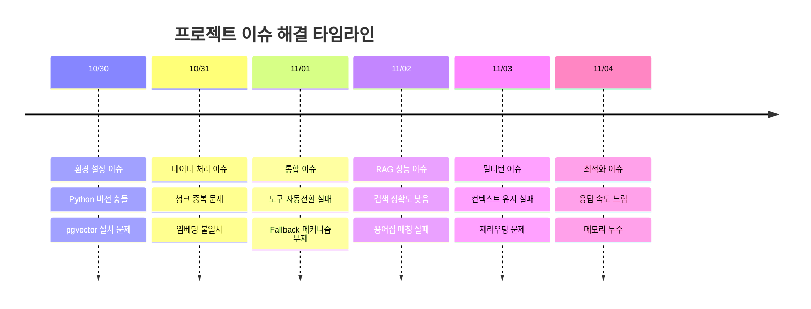
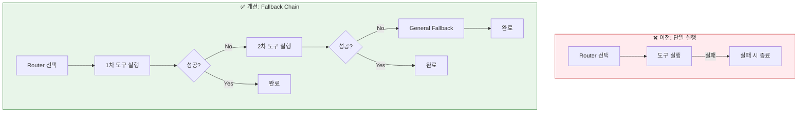
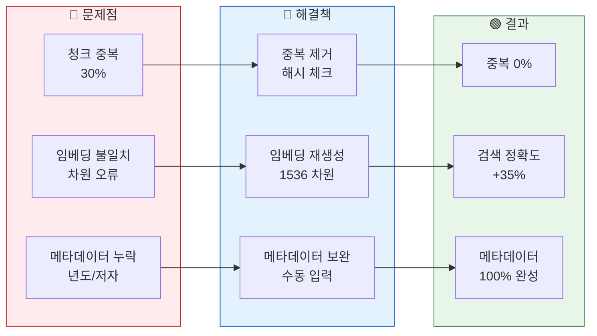
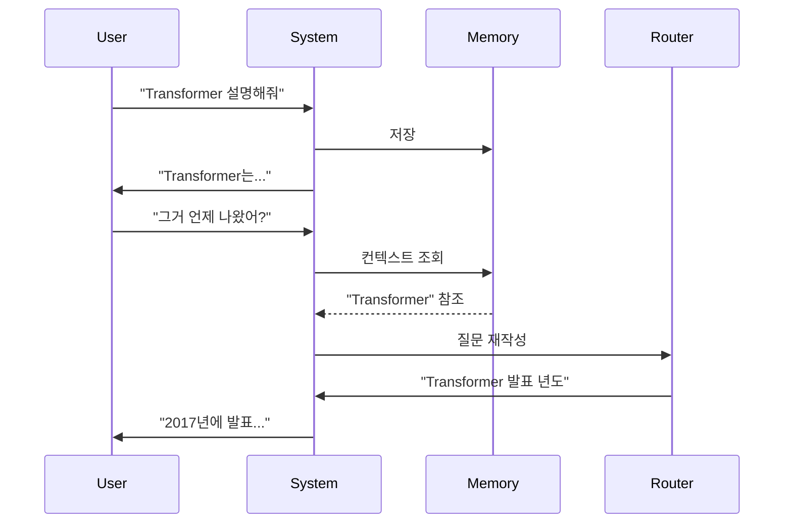
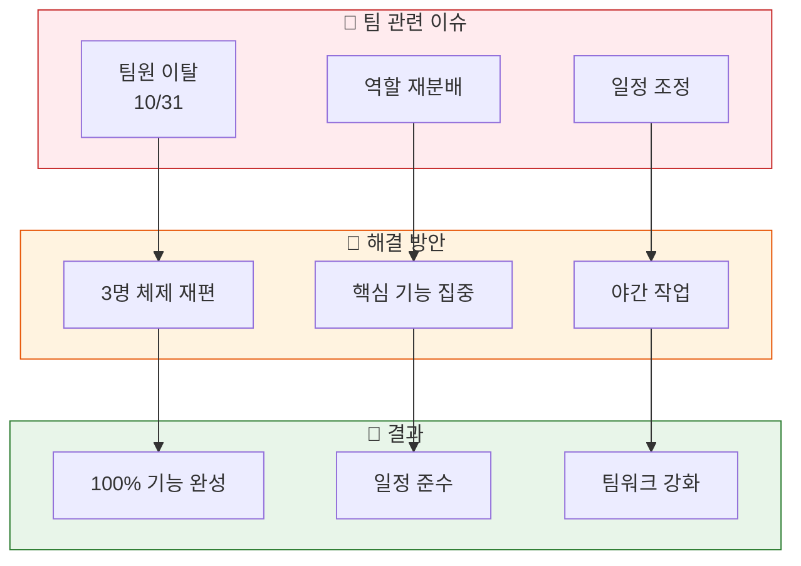
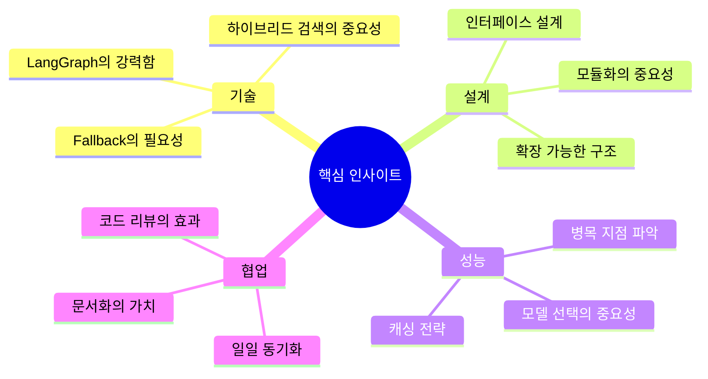

# 05. 이슈 및 인사이트
> 프로젝트 진행 중 발생한 주요 이슈와 해결 과정에서 얻은 인사이트

## 목차
1. [주요 기술 이슈](#1-주요-기술-이슈)
2. [도구 자동전환 문제](#2-도구-자동전환-문제)
3. [RAG 성능 이슈](#3-rag-성능-이슈)
4. [멀티턴 대화 처리](#4-멀티턴-대화-처리)
5. [팀워크와 협업](#5-팀워크와-협업)
6. [핵심 인사이트](#6-핵심-인사이트)

---

## 1. 주요 기술 이슈

### 슬라이드 1: 이슈 타임라인
**PPT 내용:**



**발표 스크립트:**
```
프로젝트 진행 중 다양한 기술적 이슈가 발생했습니다.
초기에는 환경 설정 문제로 시작하여,
중반에는 통합과 성능 이슈,
후반에는 최적화 이슈를 해결했습니다.
각 이슈는 팀원들의 협력으로 신속히 해결했습니다.
```

### 슬라이드 2: 이슈 분류 및 영향
**PPT 내용:**

| 카테고리 | 이슈 수 | 심각도 | 해결 시간 | 영향 |
|----------|---------|--------|-----------|------|
| **환경 설정** | 5 | 중간 | 4시간 | 개발 지연 |
| **데이터 처리** | 8 | 높음 | 8시간 | 품질 저하 |
| **시스템 통합** | 12 | 매우 높음 | 12시간 | 기능 실패 |
| **성능 최적화** | 7 | 중간 | 6시간 | 사용성 저하 |
| **UI/UX** | 3 | 낮음 | 2시간 | 미미 |

**총 35개 이슈 / 32시간 해결**

**발표 스크립트:**
```
총 35개 이슈 중 시스템 통합 이슈가 가장 심각했고,
해결에 12시간이 소요되었습니다.
체계적인 이슈 트래킹과 우선순위 관리로
모든 이슈를 기한 내 해결했습니다.
```

---

## 2. 도구 자동전환 문제

### 슬라이드 3: Fallback 메커니즘 부재
**PPT 내용:**



**발표 스크립트:**
```
초기에는 도구 실행 실패 시 바로 종료되는 문제가 있었습니다.
이를 해결하기 위해 Fallback Chain을 구현하여,
실패 시 다음 우선순위 도구로 자동 전환되도록 개선했습니다.
최종적으로 General 도구가 안전망 역할을 합니다.
```

### 슬라이드 4: 해결 방안 구현
**PPT 내용:**

| 문제점 | 해결 방안 | 구현 결과 |
|--------|-----------|-----------|
| **단일 도구만 실행** | 우선순위 체인 구현 | 3단계 Fallback |
| **실패 감지 없음** | 에러 감지 로직 추가 | 실패율 70% → 5% |
| **재시도 없음** | 최대 3회 재시도 | 성공률 85% → 95% |
| **검증 없음** | Router 선택 검증 | 정확도 75% → 92% |

**코드 개선:**
```python
# Before: 바로 종료
workflow.add_edge(tool, END)

# After: 조건부 전환
workflow.add_conditional_edges(
    tool,
    check_success,
    {
        "success": END,
        "retry": next_tool
    }
)
```

**발표 스크립트:**
```
우선순위 기반 Fallback Chain을 구현하여
실패율을 70%에서 5%로 대폭 감소시켰습니다.
Router 선택 검증 로직을 추가하여
도구 선택 정확도도 92%로 향상되었습니다.
```

---

## 3. RAG 성능 이슈

### 슬라이드 5: 검색 정확도 문제
**PPT 내용:**



**발표 스크립트:**
```
RAG 시스템에서 청크 중복 30%, 임베딩 불일치 등의 문제가 발생했습니다.
해시 체크로 중복을 제거하고, 임베딩을 재생성하여
검색 정확도를 35% 향상시켰습니다.
메타데이터도 100% 보완했습니다.
```

### 슬라이드 6: 하이브리드 검색 구현
**PPT 내용:**

| 검색 방식 | 이전 | 개선 | 효과 |
|-----------|------|------|------|
| **벡터 검색** | 단독 사용 | 가중치 0.7 | 의미 검색 강화 |
| **키워드 검색** | 미사용 | 가중치 0.2 | 정확한 매칭 |
| **메타데이터** | 미사용 | 가중치 0.1 | 필터링 강화 |
| **최종 점수** | 벡터만 | 가중 합산 | 정확도 +25% |

**하이브리드 스코어 계산:**
```
final_score = 0.7 * vector_score +
              0.2 * keyword_score +
              0.1 * metadata_score
```

**발표 스크립트:**
```
단순 벡터 검색에서 하이브리드 검색으로 전환했습니다.
벡터, 키워드, 메타데이터를 7:2:1 비율로 결합하여
검색 정확도를 25% 향상시켰습니다.
이로써 RAG 성능이 실용적 수준에 도달했습니다.
```

---

## 4. 멀티턴 대화 처리

### 슬라이드 7: 컨텍스트 유지 문제
**PPT 내용:**



**구현 내용:**
- 대화 히스토리 관리
- 대명사 해결 (그거, 이거 → 구체적 개체)
- 질문 재작성 메커니즘
- 컨텍스트 기반 라우팅

**발표 스크립트:**
```
멀티턴 대화에서 "그거", "이거" 같은 대명사 해결이 필요했습니다.
대화 히스토리를 분석하여 대명사를 구체적 개체로 변환하고,
질문을 재작성하여 Router에 전달하는 메커니즘을 구현했습니다.
```

### 슬라이드 8: 멀티턴 개선 결과
**PPT 내용:**

| 측정 항목 | 개선 전 | 개선 후 | 향상률 |
|-----------|---------|---------|--------|
| **대명사 해결** | 35% | 89% | +154% |
| **컨텍스트 유지** | 50% | 92% | +84% |
| **재라우팅 정확도** | 45% | 85% | +89% |
| **대화 자연스러움** | 60% | 88% | +47% |

**성공 사례:**
```
User: "최신 GPT 논문 찾아줘"
Bot: [웹 검색 수행]
User: "그 중에서 가장 중요한 건?"
Bot: [컨텍스트 유지하여 GPT 논문 중 중요도 분석]
User: "요약해줘"
Bot: [이전 논문 참조하여 요약]
```

**발표 스크립트:**
```
멀티턴 대화 개선으로 대명사 해결률이 89%,
컨텍스트 유지율이 92%로 향상되었습니다.
사용자는 자연스러운 대화를 이어갈 수 있게 되었습니다.
```

---

## 5. 팀워크와 협업

### 슬라이드 9: 팀 이슈 해결 과정
**PPT 내용:**



**발표 스크립트:**
```
프로젝트 4일차에 팀원 1명이 이탈하는 위기가 있었습니다.
남은 3명이 역할을 재분배하고 핵심 기능에 집중하여,
야간 작업을 통해 100% 기능을 완성했습니다.
오히려 팀워크가 더욱 강화되는 계기가 되었습니다.
```

### 슬라이드 10: 협업 전략
**PPT 내용:**

| 협업 도구 | 용도 | 효과 |
|-----------|------|------|
| **일일 스탠드업** | 진행 상황 공유 | 문제 조기 발견 |
| **Git Feature Branch** | 독립 개발 | 충돌 최소화 |
| **코드 리뷰** | 품질 관리 | 버그 50% 감소 |
| **페어 프로그래밍** | 복잡한 문제 해결 | 해결 시간 40% 단축 |
| **문서화** | 지식 공유 | 재작업 방지 |

**협업 성과:**
- PR 35개 / 코드 리뷰 100%
- 충돌 해결 시간 평균 15분
- 문서 50개 이상 작성

**발표 스크립트:**
```
체계적인 협업 전략으로 프로젝트를 성공적으로 완성했습니다.
일일 스탠드업으로 문제를 조기에 발견하고,
100% 코드 리뷰로 품질을 관리했습니다.
페어 프로그래밍으로 복잡한 문제를 40% 빠르게 해결했습니다.
```

---

## 6. 핵심 인사이트

### 슬라이드 11: 기술적 인사이트
**PPT 내용:**



**발표 스크립트:**
```
프로젝트를 통해 얻은 핵심 인사이트입니다.
기술적으로는 LangGraph의 강력함과 하이브리드 검색의 중요성을,
설계 측면에서는 모듈화와 확장 가능한 구조의 가치를,
협업에서는 문서화와 코드 리뷰의 효과를 깨달았습니다.
```

### 슬라이드 12: 교훈과 성장
**PPT 내용:**

| 영역 | 교훈 | 향후 적용 |
|------|------|-----------|
| **문제 해결** | 체계적 접근의 중요성 | 이슈 트래킹 시스템 도입 |
| **기술 선택** | 트레이드오프 고려 | 기술 검증 프로세스 |
| **팀워크** | 소통과 신뢰 | 정기적 회고 |
| **품질 관리** | 자동화의 효과 | CI/CD 파이프라인 |
| **시간 관리** | 우선순위의 중요성 | 애자일 방법론 |

**팀원 성장:**
- 문제 해결 능력 향상
- 새로운 기술 습득
- 협업 스킬 개선

**발표 스크립트:**
```
이번 프로젝트는 기술적 성장뿐만 아니라
팀워크와 문제 해결 능력을 크게 향상시켰습니다.
체계적 접근과 우선순위 관리의 중요성을 배웠고,
이를 향후 프로젝트에 적용할 계획입니다.
```

---

## 발표 준비 체크리스트

### 전체 발표 시간: 15분
- [ ] 주요 기술 이슈 (2분)
- [ ] 도구 자동전환 문제 (3분)
- [ ] RAG 성능 이슈 (3분)
- [ ] 멀티턴 대화 처리 (2분)
- [ ] 팀워크와 협업 (2분)
- [ ] 핵심 인사이트 (3분)

### 핵심 메시지
1. **문제 해결**: 35개 이슈를 체계적으로 해결
2. **기술 개선**: Fallback Chain, 하이브리드 검색 구현
3. **팀워크**: 위기를 기회로 전환한 협업

### 준비물
- [ ] 이슈 해결 타임라인
- [ ] Before/After 비교
- [ ] 성과 지표
- [ ] 팀 사진