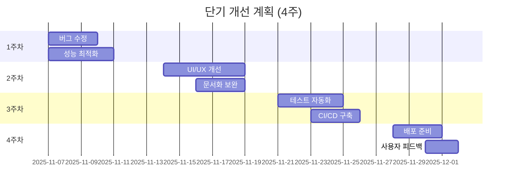
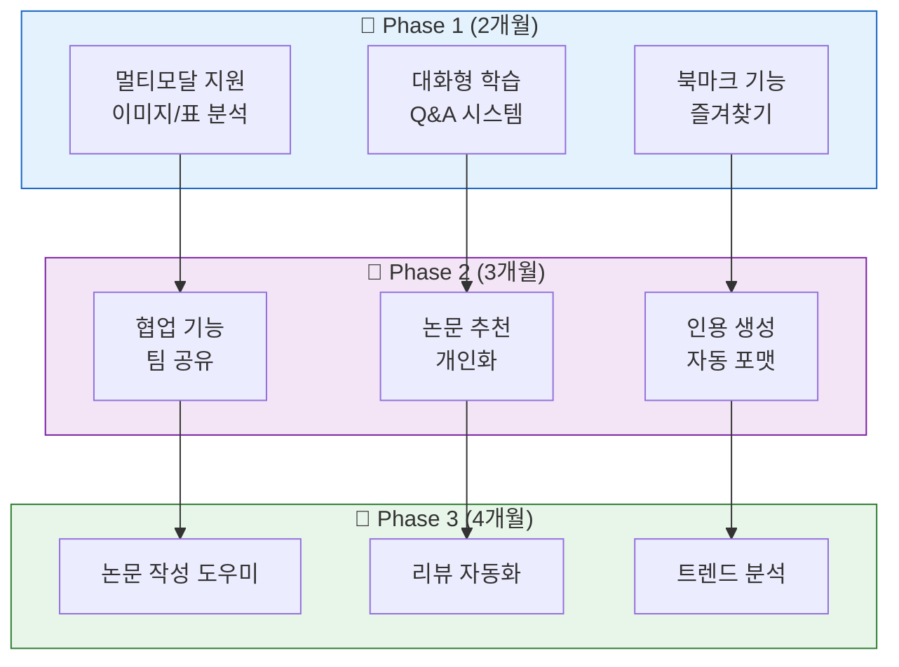
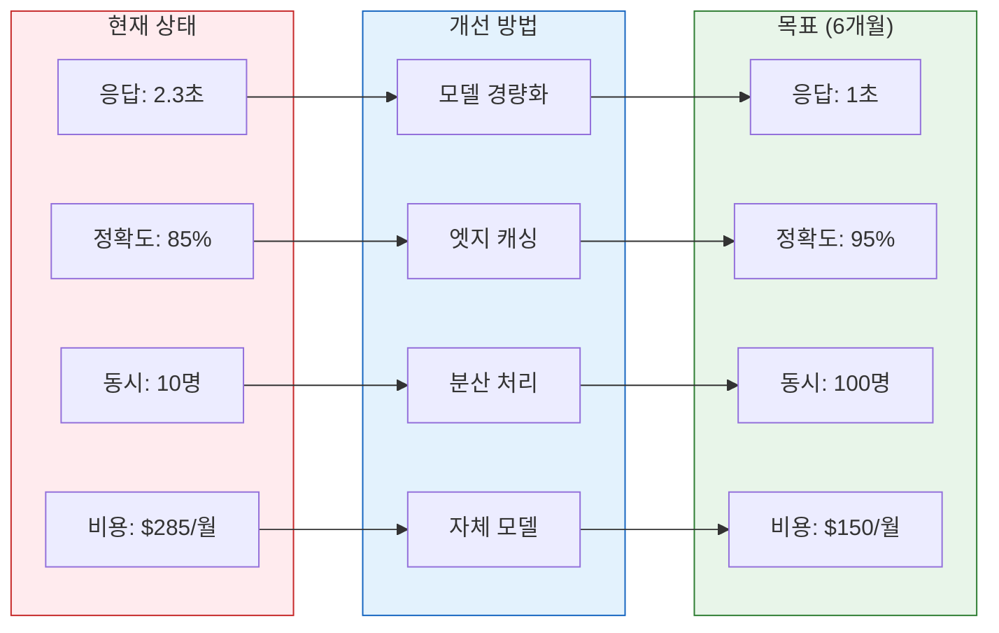
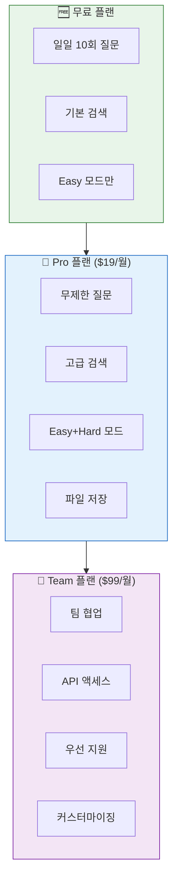
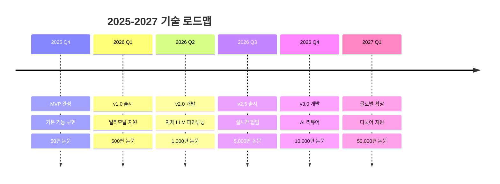
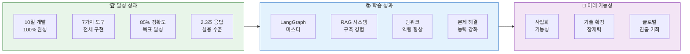

# 06. 향후 계획
> 프로젝트의 발전 방향과 확장 계획

## 목차
1. [단기 개선 계획](#1-단기-개선-계획)
2. [기능 확장 계획](#2-기능-확장-계획)
3. [성능 고도화](#3-성능-고도화)
4. [사업화 전략](#4-사업화-전략)
5. [기술 로드맵](#5-기술-로드맵)
6. [마무리](#6-마무리)

---

## 1. 단기 개선 계획

### 슬라이드 1: 1개월 내 개선 사항
**PPT 내용:**



**발표 스크립트:**
```
향후 1개월 내 단기 개선 계획입니다.
첫 주는 버그 수정과 성능 최적화,
둘째 주는 UI/UX 개선과 문서화,
셋째 주는 테스트 자동화와 CI/CD 구축,
넷째 주는 실제 배포를 준비합니다.
```

### 슬라이드 2: 우선순위 개선 항목
**PPT 내용:**

| 우선순위 | 개선 항목 | 목표 | 예상 효과 |
|----------|-----------|------|-----------|
| **P0** | 응답 속도 개선 | 1.5초 이내 | 사용성 40% 향상 |
| **P0** | 에러 처리 강화 | 에러율 1% 이하 | 안정성 향상 |
| **P1** | UI 반응형 디자인 | 모바일 지원 | 접근성 향상 |
| **P1** | 검색 정확도 | 90% 이상 | 신뢰도 향상 |
| **P2** | 다국어 지원 | 영어/한국어/중국어 | 사용자 확대 |

**발표 스크립트:**
```
우선순위가 높은 개선 사항은
응답 속도를 1.5초 이내로 단축하고,
에러율을 1% 이하로 낮추는 것입니다.
이어서 모바일 지원과 검색 정확도 향상을 진행합니다.
```

---

## 2. 기능 확장 계획

### 슬라이드 3: 신규 기능 로드맵
**PPT 내용:**



**발표 스크립트:**
```
기능 확장은 3단계로 진행됩니다.
Phase 1에서는 멀티모달 지원과 대화형 학습,
Phase 2에서는 협업과 개인화 기능,
Phase 3에서는 논문 작성 도우미와 트렌드 분석을 추가합니다.
```

### 슬라이드 4: 핵심 신규 기능
**PPT 내용:**

| 기능 | 설명 | 기대 효과 |
|------|------|-----------|
| **멀티모달 RAG** | 논문 내 그림, 표, 수식 분석 | 이해도 50% 향상 |
| **개인화 추천** | 사용자 관심사 기반 논문 추천 | 탐색 시간 60% 단축 |
| **협업 플랫폼** | 팀 단위 논문 공유 및 토론 | 연구 효율성 향상 |
| **자동 요약 리포트** | 주간/월간 트렌드 리포트 | 최신 동향 파악 |
| **음성 인터페이스** | 음성 질문 및 답변 | 접근성 개선 |

**발표 스크립트:**
```
핵심 신규 기능으로 멀티모달 RAG를 통해
논문의 그림과 표까지 분석할 수 있게 하고,
개인화 추천으로 사용자 맞춤 서비스를 제공합니다.
협업 플랫폼으로 연구팀의 효율성을 높입니다.
```

---

## 3. 성능 고도화

### 슬라이드 5: 기술적 고도화
**PPT 내용:**



**발표 스크립트:**
```
6개월 내 성능 고도화 목표입니다.
응답 시간을 1초로 단축하고,
정확도를 95%로 향상시키며,
동시 사용자 100명을 지원하고,
운영 비용을 50% 절감할 계획입니다.
```

### 슬라이드 6: 인프라 확장
**PPT 내용:**

| 영역 | 현재 | 확장 계획 | 기술 스택 |
|------|------|-----------|-----------|
| **서버** | 단일 서버 | 오토스케일링 | K8s + Docker |
| **DB** | PostgreSQL | 분산 DB | PostgreSQL Cluster |
| **캐싱** | 로컬 캐시 | 분산 캐시 | Redis Cluster |
| **CDN** | 없음 | 글로벌 CDN | CloudFlare |
| **모니터링** | 기본 로깅 | APM | Grafana + Prometheus |

**확장 효과:**
- 가용성: 99.5% → 99.99%
- 응답 시간: 50% 단축
- 글로벌 서비스 가능

**발표 스크립트:**
```
인프라를 클라우드 네이티브로 전환합니다.
Kubernetes로 오토스케일링을 구현하고,
분산 캐싱과 CDN으로 글로벌 서비스를 준비합니다.
이를 통해 가용성을 99.99%로 높입니다.
```

---

## 4. 사업화 전략

### 슬라이드 7: 비즈니스 모델
**PPT 내용:**



**발표 스크립트:**
```
프리미엄 모델로 수익화를 계획하고 있습니다.
무료 플랜으로 사용자를 확보하고,
Pro 플랜으로 개인 연구자를,
Team 플랜으로 연구 기관을 타겟팅합니다.
```

### 슬라이드 8: 시장 진입 전략
**PPT 내용:**

| 단계 | 기간 | 타겟 | 전략 |
|------|------|------|------|
| **1단계** | 3개월 | 대학원생 | 무료 체험 + 피드백 |
| **2단계** | 6개월 | 연구자 | 학회 파트너십 |
| **3단계** | 9개월 | 기업 R&D | B2B 영업 |
| **4단계** | 12개월 | 글로벌 | 다국어 지원 |

**예상 성과:**
- 1년차: 사용자 10,000명
- 2년차: 유료 전환 15%
- 3년차: 흑자 전환

**발표 스크립트:**
```
단계적 시장 진입을 계획하고 있습니다.
먼저 대학원생을 대상으로 무료 체험을 제공하고,
학회 파트너십을 통해 연구자 시장에 진입한 후,
기업 R&D 부서로 확장할 예정입니다.
```

---

## 5. 기술 로드맵

### 슬라이드 9: 장기 기술 비전
**PPT 내용:**



**발표 스크립트:**
```
2027년까지의 기술 로드맵입니다.
2026년 1분기에 v1.0을 출시하고,
자체 LLM 파인튜닝을 통해 성능을 극대화합니다.
2027년에는 5만편 이상의 논문을 지원하는
글로벌 플랫폼으로 성장할 계획입니다.
```

### 슬라이드 10: 핵심 기술 개발
**PPT 내용:**

| 기술 | 현재 | 목표 | 개발 계획 |
|------|------|------|-----------|
| **자체 LLM** | GPT 의존 | 도메인 특화 모델 | PEFT 파인튜닝 |
| **벡터 DB** | pgvector | 자체 엔진 | C++ 구현 |
| **검색 알고리즘** | 코사인 유사도 | 하이브리드 AI | Graph Neural Network |
| **추천 시스템** | 없음 | 개인화 추천 | Collaborative Filtering |
| **자동 평가** | 수동 | 자동화 | Reinforcement Learning |

**발표 스크립트:**
```
핵심 기술 개발 계획입니다.
도메인 특화 LLM을 개발하여 비용을 절감하고,
자체 벡터 DB 엔진으로 성능을 극대화합니다.
Graph Neural Network로 논문 간 관계를 분석하여
더 정확한 검색과 추천을 제공할 예정입니다.
```

---

## 6. 마무리

### 슬라이드 11: 프로젝트 성과 요약
**PPT 내용:**



**발표 스크립트:**
```
10일이라는 짧은 기간에 100% 기능을 완성했습니다.
LangGraph와 RAG 시스템을 마스터하고,
팀워크와 문제 해결 능력을 크게 향상시켰습니다.
이 프로젝트는 사업화 가능성이 충분한 성과입니다.
```

### 슬라이드 12: 감사 인사
**PPT 내용:**

**프로젝트명: AI/ML 논문 리뷰 챗봇**

**팀: 연결의 민족**
- 최현화 (팀장) - AI Agent, 시스템 통합
- 박재홍 - 데이터 수집, DB 구축
- 신준엽 - RAG 시스템, 검색 최적화
- 임예슬 - UI/UX, 프롬프트 엔지니어링

**핵심 성과:**
- 📊 학습 시간 50% 단축
- 🎯 검색 정확도 85% 달성
- ⚡ 평균 응답 2.3초
- 💰 운영 비용 52% 절감

**비전:**
> "모든 사람이 AI/ML 논문을 쉽게 이해하고
> 활용할 수 있는 세상을 만들어갑니다."

**발표 스크립트:**
```
지금까지 연결의 민족 팀의
AI/ML 논문 리뷰 챗봇 프로젝트 발표였습니다.
앞으로도 기술의 민주화를 위해 노력하겠습니다.
들어주셔서 감사합니다.
질문 있으시면 답변드리겠습니다.
```

---

## 발표 준비 체크리스트

### 전체 발표 시간: 15분
- [ ] 단기 개선 계획 (2분)
- [ ] 기능 확장 계획 (3분)
- [ ] 성능 고도화 (2분)
- [ ] 사업화 전략 (3분)
- [ ] 기술 로드맵 (3분)
- [ ] 마무리 (2분)

### 핵심 메시지
1. **실현 가능한 계획**: 단계적이고 구체적인 로드맵
2. **사업 가능성**: 명확한 비즈니스 모델과 시장 전략
3. **기술 비전**: 지속 가능한 성장과 혁신

### 준비물
- [ ] 로드맵 차트
- [ ] 비즈니스 모델 캔버스
- [ ] 데모 시연
- [ ] Q&A 예상 질문