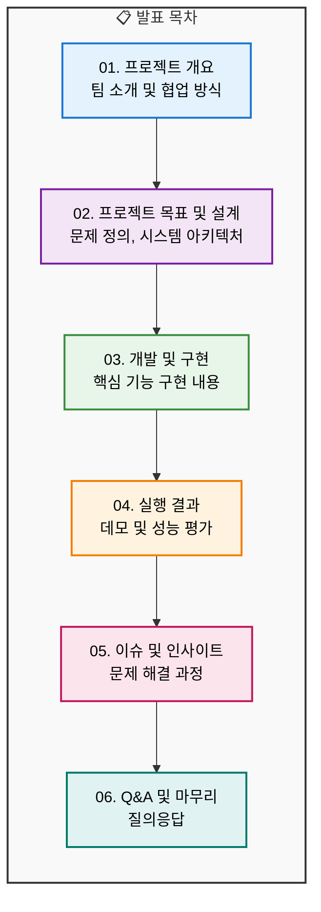
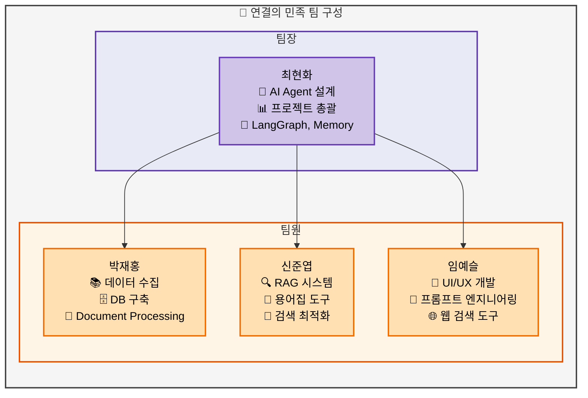
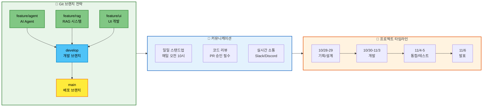

# 01. 프로젝트 개요
> AI/ML 논문 리뷰 챗봇 프로젝트 소개

## 📑 목차
1. [표지](#표지)
2. [목차](#목차)
3. [프로젝트 소개](#프로젝트-소개)
4. [팀 소개](#팀-소개)
5. [협업 방식](#협업-방식)

---

## 표지
### 슬라이드 1: 프로젝트 표지 (Page 1)

**PPT 내용:**
```
┌─────────────────────────────────────────┐
│                                         │
│     AI/ML 논문 리뷰 챗봇               │
│                                         │
│  AI Agent + RAG 기반 지능형           │
│     논문 이해 도우미                   │
│                                         │
│        연결의 민족                      │
│                                         │
│     2025년 11월 6일                    │
│                                         │
└─────────────────────────────────────────┘
```

**발표 스크립트:**
```
안녕하세요. 연결의 민족 팀입니다.

오늘 발표드릴 프로젝트는 'AI/ML 논문 리뷰 챗봇'입니다.

AI Agent와 RAG 기술을 활용하여
전문적인 AI 논문을 누구나 쉽게 이해할 수 있도록 돕는
지능형 챗봇 시스템을 개발하였습니다.

지금부터 프로젝트의 개발 과정과 결과를
차례대로 소개해드리겠습니다.
```

---

## 목차
### 슬라이드 2: 발표 목차 (Page 2)

**PPT 내용:**



**발표 스크립트:**
```
발표는 총 6개 섹션으로 구성되어 있습니다.

먼저 프로젝트 개요와 팀 소개를 드리고,
프로젝트의 목표와 전체적인 시스템 설계를 설명드리겠습니다.

이어서 실제 개발 및 구현 내용을 상세히 소개하고,
시스템 실행 결과와 성능 평가를 보여드리겠습니다.

마지막으로 개발 과정에서의 이슈와 인사이트를 공유하고,
질의응답 시간을 갖도록 하겠습니다.
```

---

## 프로젝트 소개
### 슬라이드 3: 프로젝트 개요 (Page 3)

**PPT 내용:**



```mermaid
graph LR
    subgraph Problem["🔴 문제 상황"]
        direction TB
        P1[매일 수백 편의<br/>AI 논문 발표]
        P2[전문 용어와<br/>복잡한 수식]
        P3[초심자 진입<br/>장벽 높음]
    end

    subgraph Solution["🔵 우리의 해결책"]
        direction TB
        S1[AI Agent<br/>지능형 라우팅]
        S2[RAG + Web<br/>하이브리드 검색]
        S3[난이도별<br/>맞춤 설명]
    end

    subgraph Goal["🟢 목표"]
        direction TB
        G1[학습 시간<br/>50% 단축]
        G2[누구나 이해<br/>가능한 설명]
        G3[최신 논문<br/>실시간 검색]
    end

    Problem --> Solution
    Solution --> Goal

    %% 스타일링
    style Problem fill:#ffebee,stroke:#c62828,stroke-width:3px
    style Solution fill:#e3f2fd,stroke:#1565c0,stroke-width:3px
    style Goal fill:#e8f5e9,stroke:#2e7d32,stroke-width:3px

    style P1 fill:#ffcdd2,stroke:#d32f2f,color:#000
    style P2 fill:#ffcdd2,stroke:#d32f2f,color:#000
    style P3 fill:#ffcdd2,stroke:#d32f2f,color:#000

    style S1 fill:#bbdefb,stroke:#1976d2,color:#000
    style S2 fill:#bbdefb,stroke:#1976d2,color:#000
    style S3 fill:#bbdefb,stroke:#1976d2,color:#000

    style G1 fill:#c8e6c9,stroke:#388e3c,color:#000
    style G2 fill:#c8e6c9,stroke:#388e3c,color:#000
    style G3 fill:#c8e6c9,stroke:#388e3c,color:#000
```

**테이블: 핵심 기능 요약**
| 기능 | 설명 | 기술 스택 |
|------|------|-----------|
| AI Agent 라우팅 | 사용자 질문 분석 및 도구 자동 선택 | LangGraph |
| RAG 검색 | 논문 DB에서 의미적 유사도 검색 | PostgreSQL + pgvector |
| 웹 검색 | 최신 논문 정보 실시간 검색 | Tavily API |
| 난이도별 답변 | Easy/Hard 모드 맞춤형 설명 | GPT-4 / Solar Pro2 |
| 용어집 | 전문 용어 자동 인식 및 설명 | Vector DB |
| 논문 요약 | 섹션별 자동 요약 생성 | Langchain |

**발표 스크립트:**
```
현재 AI/ML 분야는 하루에도 수백 편의 논문이 발표되고 있습니다.
하지만 전문 용어와 복잡한 수식으로 인해
초심자들이 논문을 이해하기는 매우 어려운 상황입니다.

저희는 이 문제를 해결하기 위해 세 가지 핵심 기술을 도입했습니다.

첫째, AI Agent를 통한 지능형 라우팅으로
사용자 질문을 분석해 최적의 도구를 자동 선택합니다.

둘째, RAG와 웹 검색을 결합한 하이브리드 검색으로
로컬 DB의 논문과 최신 온라인 논문을 모두 검색합니다.

셋째, 사용자 수준에 따른 난이도별 맞춤 설명으로
초심자도 쉽게 이해할 수 있도록 했습니다.

이를 통해 논문 학습 시간을 50% 단축하고,
누구나 최신 AI 논문을 이해할 수 있는 환경을 만들고자 했습니다.
```

---

## 팀 소개
### 슬라이드 4: 팀 구성 및 역할 (Page 4)

**PPT 내용:**



**테이블: 상세 역할 분담**
| 이름 | 주요 담당 | 세부 작업 | 참여 기간 |
|------|-----------|-----------|-----------|
| 최현화 | AI Agent & 총괄 | • Agent 그래프 설계<br/>• LLM 클라이언트<br/>• 메모리 시스템<br/>• 논문 요약 도구 | 10/28 ~ 11/6 |
| 박재홍 | 데이터 파이프라인 | • arXiv 논문 수집<br/>• Document Loader/Splitter<br/>• 임베딩 생성<br/>• PostgreSQL 설정 | 10/28 ~ 10/31 |
| 신준엽 | RAG 시스템 | • Vector 검색 구현<br/>• RAG 검색 도구<br/>• 용어집 도구<br/>• 검색 최적화 | 10/28 ~ 11/6 |
| 임예슬 | UI & 프롬프트 | • Streamlit UI<br/>• 프롬프트 템플릿<br/>• 웹 검색 도구<br/>• 파일 저장 도구 | 10/28 ~ 11/6 |

**발표 스크립트:**
```
저희 '연결의 민족' 팀은 4명으로 구성되어 있습니다.

팀장인 최현화는 전체 프로젝트를 총괄하며
AI Agent 설계와 LangGraph 구현을 담당했습니다.

박재홍 팀원은 프로젝트 초반 데이터 수집과
DB 구축을 집중적으로 진행했습니다.

신준엽 팀원은 RAG 시스템 전반을 담당하여
벡터 검색과 용어집 도구를 구현했습니다.

임예슬 팀원은 사용자 인터페이스와
프롬프트 엔지니어링을 담당했습니다.

각자의 전문성을 살려 효율적으로 역할을 분담하고,
긴밀한 협업을 통해 프로젝트를 완성할 수 있었습니다.
```

---

## 협업 방식
### 슬라이드 5: 프로젝트 협업 방식 (Page 5)

**PPT 내용:**



**테이블: 일정별 주요 마일스톤**
| 날짜 | 단계 | 주요 활동 | 산출물 |
|------|------|-----------|---------|
| 10/28-29 | 기획 | 주제 선정, PRD 작성, 환경 설정 | PRD 문서, 개발 환경 |
| 10/30-31 | 개발 1차 | 데이터 수집, DB 구축, 핵심 모듈 개발 시작 | 논문 DB, 기본 구조 |
| 11/1-3 | 개발 2차 | AI Agent, RAG, UI 개발 | 핵심 기능 완성 |
| 11/4 | 통합 | 모듈 통합, 테스트 | 통합 시스템 |
| 11/5 | 마무리 | 버그 수정, 발표 준비 | 최종 시스템 |
| 11/6 | 발표 | 시연 및 발표 | 발표 자료 |

**발표 스크립트:**
```
저희 팀은 체계적인 협업 방식을 통해 짧은 기간 내에
프로젝트를 성공적으로 완성할 수 있었습니다.

먼저 Git 브랜치 전략으로는 Feature Branch 워크플로우를 채택하여
각자 맡은 기능을 독립적으로 개발하고,
코드 리뷰를 거쳐 develop 브랜치에 병합하는 방식으로 진행했습니다.

커뮤니케이션은 매일 오전 10시 스탠드업 미팅을 통해
진행 상황을 공유하고, Slack과 Discord로 실시간 소통했습니다.

전체 10일의 프로젝트 기간을 4단계로 나누어
기획 2일, 개발 5일, 통합 및 테스트 2일, 발표 준비 1일로
체계적으로 일정을 관리했습니다.

특히 중간에 팀원 한 분이 개인 사정으로 빠지게 되었지만,
사전에 데이터 수집과 DB 구축을 완료해주셔서
나머지 팀원들이 원활하게 개발을 이어갈 수 있었습니다.
```