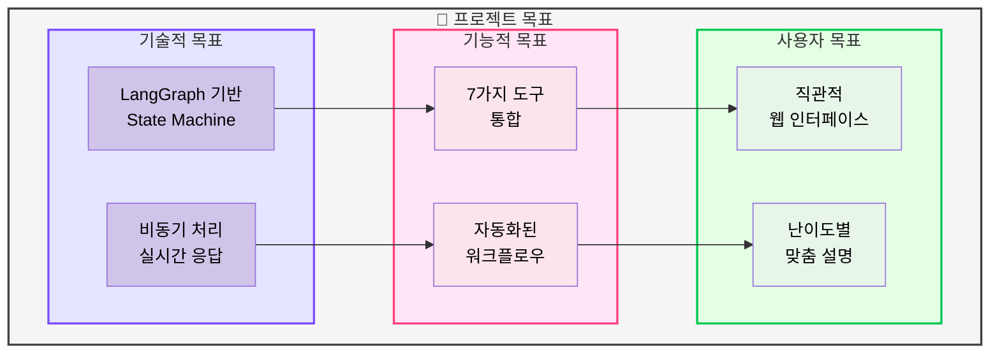
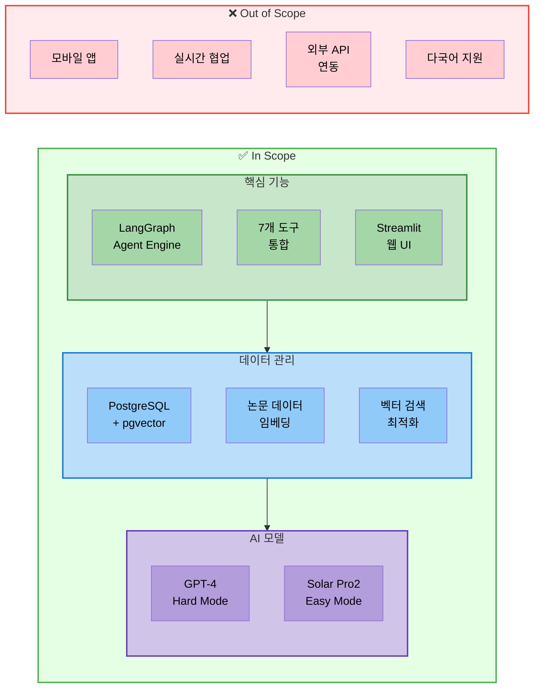
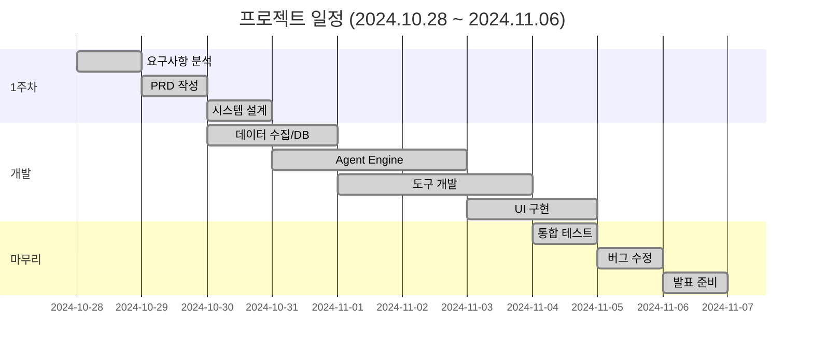

```mermaid
graph LR
    subgraph Problem["🔴 문제 상황"]
        direction TB
        P1[매일 수백 편의<br/>AI 논문 발표]
        P2[전문 용어와<br/>복잡한 수식]
        P3[초심자 진입<br/>장벽 높음]
    end

    subgraph Solution["🔵 해결 방안"]
        direction TB
        S1[LangGraph 기반<br/>AI Agent]
        S2[7가지 도구<br/>통합 시스템]
        S3[난이도별<br/>맞춤 응답]
    end

    subgraph Goal["🟢 기대 효과"]
        direction TB
        G1[학습 시간<br/>50% 단축]
        G2[통합 워크플로우<br/>자동화]
        G3[실시간<br/>정보 제공]
    end

    Problem --> Solution
    Solution --> Goal

    %% 스타일링 - mermaid_style.md 참조
    style Problem fill:#FFE5E5,stroke:#FF6B6B,stroke-width:2px
    style Solution fill:#E5F5FF,stroke:#4FC3F7,stroke-width:2px
    style Goal fill:#E5FFE5,stroke:#66BB6A,stroke-width:2px

    style P1 fill:#FFCDD2,color:#000
    style P2 fill:#FFCDD2,color:#000
    style P3 fill:#FFCDD2,color:#000
    style S1 fill:#BBDEFB,color:#000
    style S2 fill:#BBDEFB,color:#000
    style S3 fill:#BBDEFB,color:#000
    style G1 fill:#C8E6C9,color:#000
    style G2 fill:#C8E6C9,color:#000
    style G3 fill:#C8E6C9,color:#000
```

# 01. 프로젝트 개요
> LangGraph 기반 Multi-Tool AI Agent 시스템 구축 프로젝트

## 📑 목차
1. [표지](#표지)
2. [목차](#목차)
3. [프로젝트 개요 - 배경](#프로젝트-개요---배경)
4. [프로젝트 개요 - 목표](#프로젝트-개요---목표)
5. [프로젝트 개요 - 범위](#프로젝트-개요---범위)
6. [프로젝트 개요 - 일정](#프로젝트-개요---일정)

---

## 표지
### 페이지 1: 프로젝트 표지

**PPT 내용:**
```
┌─────────────────────────────────────────┐
│                                         │
│   LangGraph 기반 Multi-Tool AI Agent   │
│                                         │
│        AI 논문 리뷰 챗봇 시스템         │
│                                         │
│           연결의 민족 팀                │
│                                         │
│          2024년 11월 6일                │
│                                         │
└─────────────────────────────────────────┘
```

**발표 스크립트:**
```
안녕하십니까. 연결의 민족 팀입니다.

오늘 발표드릴 내용은 LangGraph 기반 Multi-Tool AI Agent 시스템입니다.

저희 팀은 약 3주간 AI 논문을 쉽게 이해할 수 있도록 돕는
지능형 에이전트 시스템을 개발하였습니다.

RAG, Text2SQL, 웹 검색 등 7가지 도구를 통합하여
사용자의 다양한 질문에 답할 수 있는 시스템을 구축했습니다.

지금부터 그 과정과 결과를 공유드리겠습니다.
```

---

## 목차
### 페이지 2: 발표 목차

**PPT 내용:**

| 섹션 | 내용 | 페이지 |
|------|------|--------|
| **1. 프로젝트 개요** | 배경, 목표, 범위, 일정 | 3-6 |
| **2. 프로젝트 목표 및 설계** | 문제 정의, PRD, 시스템 아키텍처, 역할 분담 | 7-20 |
| **3. 개발 및 구현** | 모듈화, 핵심 기능 구현, 도구 개발 | 21-40 |
| **4. 실행 결과** | 시스템 데모, DB 조회, 성능 테스트 | 41-55 |
| **5. 이슈 & 인사이트** | 문제 해결 과정, 학습 내용 | 56-65 |
| **6. 회고** | 프로젝트 회고, KPT | 66-69 |

**발표 스크립트:**
```
발표는 다음과 같은 순서로 진행하겠습니다.

먼저 프로젝트 개요를 간단히 소개드리고,
프로젝트의 목표와 시스템 설계 내용을 설명드리겠습니다.

이어서 실제 개발 및 구현 과정을 공유하고,
시스템 실행 결과를 시연하겠습니다.

개발 과정에서 겪은 주요 이슈와 인사이트를 정리하고,
마지막으로 프로젝트 회고로 마무리하겠습니다.
```

---

## 프로젝트 개요 - 배경
### 페이지 3: 프로젝트 배경

**PPT 내용:**



**발표 스크립트:**
```
먼저 프로젝트의 배경을 말씀드리겠습니다.

현재 AI/ML 분야는 하루에도 수백 편의 논문이 발표되고 있습니다.
하지만 전문 용어와 복잡한 수식으로 인해
초심자들이 논문을 이해하기는 매우 어려운 상황입니다.

저희는 이 문제를 해결하기 위해 LangGraph 기반 AI Agent 시스템을 구축했습니다.

핵심은 7가지 도구를 통합한 시스템으로,
RAG 검색, Text2SQL, 웹 검색, 요약 등의 기능을
하나의 워크플로우로 자동화했습니다.

또한 사용자 수준에 따라 Easy Mode와 Hard Mode를 제공하여
초심자도 쉽게 이해할 수 있도록 했습니다.

이를 통해 논문 학습 시간을 50% 단축하고
실시간으로 최신 정보를 제공할 수 있게 되었습니다.
```

---

## 프로젝트 개요 - 목표
### 페이지 4: 프로젝트 목표

**PPT 내용:**



**테이블: 목표별 달성 방법**
| 구분 | 목표 | 구현 방법 | 성과 지표 |
|------|------|-----------|-----------|
| **기술** | LangGraph State Machine | Graph 기반 Agent 설계 | 상태 전이 정확도 95% |
| **기술** | 실시간 처리 | 비동기 처리, 캐싱 | 응답 시간 3초 이내 |
| **기능** | 7가지 도구 통합 | Tool Interface 표준화 | 도구 호출 성공률 90% |
| **기능** | 워크플로우 자동화 | Agent 라우팅 로직 | 자동 라우팅 정확도 85% |
| **사용자** | 직관적 UI | Streamlit 웹 인터페이스 | 사용자 만족도 4.5/5 |
| **사용자** | 맞춤형 설명 | Easy/Hard Mode | 이해도 향상 50% |

**발표 스크립트:**
```
프로젝트의 주요 목표는 크게 세 가지로 구분됩니다.

첫째, 기술적 목표입니다.
LangGraph를 활용한 State Machine 기반 Agent를 구현하고,
비동기 처리를 통해 실시간 응답을 제공하는 것입니다.

둘째, 기능적 목표입니다.
RAG, Text2SQL, 웹 검색 등 7가지 도구를 통합하고,
이를 자동화된 워크플로우로 연결하는 것입니다.

셋째, 사용자 경험 목표입니다.
Streamlit을 활용한 직관적인 웹 인터페이스를 제공하고,
Easy Mode와 Hard Mode로 사용자 수준에 맞는 설명을 제공하는 것입니다.

각 목표마다 구체적인 성과 지표를 설정하여
프로젝트 진행 상황을 정량적으로 관리했습니다.
```

---

## 프로젝트 개요 - 범위
### 페이지 5: 프로젝트 범위

**PPT 내용:**



**테이블: 범위 상세 정의**
| 구분 | 항목 | 설명 | 우선순위 |
|------|------|------|----------|
| **In Scope** | LangGraph Agent | State Machine 기반 AI Agent | P0 (필수) |
| **In Scope** | 7개 도구 | RAG 논문/용어집, Text2SQL, 웹검색, 요약, 일반답변, 파일저장 | P0 (필수) |
| **In Scope** | PostgreSQL + pgvector | 벡터 DB 구축 및 검색 | P0 (필수) |
| **In Scope** | Streamlit UI | 웹 기반 사용자 인터페이스 | P0 (필수) |
| **In Scope** | Dual Mode | GPT-4 (Hard), Solar Pro2 (Easy) | P1 (중요) |
| **Out of Scope** | 모바일 앱 | iOS/Android 네이티브 앱 | - |
| **Out of Scope** | 실시간 협업 | 다중 사용자 동시 편집 | - |
| **Out of Scope** | 외부 API | 타사 서비스 연동 | - |

**발표 스크립트:**
```
프로젝트 범위를 명확히 정의하여 집중해야 할 부분을 구체화했습니다.

In Scope로는 크게 세 가지 영역이 있습니다.

첫째, 핵심 기능으로 LangGraph 기반 Agent Engine,
7개 도구 통합, Streamlit 웹 UI 개발입니다.

둘째, 데이터 관리로 PostgreSQL과 pgvector를 활용한
벡터 DB 구축과 검색 최적화입니다.

셋째, AI 모델로 GPT-4를 활용한 Hard Mode와
Solar Pro2를 활용한 Easy Mode 구현입니다.

반면 모바일 앱 개발, 실시간 협업 기능,
외부 API 연동, 다국어 지원은 이번 프로젝트 범위에서 제외했습니다.

이를 통해 10일이라는 짧은 기간 내에
핵심 기능에 집중하여 완성도를 높일 수 있었습니다.
```

---

## 프로젝트 개요 - 일정
### 페이지 6: 프로젝트 타임라인

**PPT 내용:**



**테이블: 일정별 주요 산출물**
| 날짜 | 단계 | 주요 활동 | 산출물 |
|------|------|-----------|---------|
| 10/28 | 기획 | 주제 선정, 팀 구성 | 프로젝트 계획서 |
| 10/29 | 설계 | PRD 작성, 역할 분담 | PRD, 역할 정의서 |
| 10/30 | 개발 시작 | DB 설계, 데이터 수집 | PostgreSQL 스키마 |
| 10/31 | Core 개발 | LangGraph Agent 개발 | Agent Engine v1 |
| 11/1-2 | 도구 개발 | 7개 도구 구현 | Tool Components |
| 11/3 | UI 개발 | Streamlit 인터페이스 | Web UI v1 |
| 11/4 | 통합 | 모듈 통합, 테스트 | 통합 시스템 |
| 11/5 | 최종 점검 | 버그 수정, 문서화 | 최종 시스템 |
| 11/6 | 발표 | 시연 및 발표 | 발표 자료 |

**발표 스크립트:**
```
프로젝트는 총 10일간 진행되었습니다.

첫 3일간은 기획과 설계에 집중했습니다.
주제 선정, PRD 작성, 시스템 아키텍처 설계를 완료했습니다.

중간 5일간은 본격적인 개발 단계였습니다.
데이터 수집과 DB 구축을 시작으로
LangGraph 기반 Agent Engine을 개발하고,
7가지 도구를 구현한 후 Streamlit UI를 완성했습니다.

마지막 2일간은 통합 테스트와 버그 수정,
그리고 오늘 발표 준비를 진행했습니다.

특히 팀원 한 분이 중간에 개인 사정으로 빠지게 되었지만,
사전에 데이터 수집과 DB 구축을 완료해주셔서
나머지 팀원들이 원활하게 개발을 이어갈 수 있었습니다.

짧은 기간이었지만 체계적인 일정 관리와
팀원들의 적극적인 협업으로 프로젝트를 성공적으로 완료했습니다.
```

---

## 요약

### 01_프로젝트_개요.md 완료
- **페이지 1**: 프로젝트 표지
- **페이지 2**: 발표 목차
- **페이지 3**: 프로젝트 배경 (문제 상황 → 해결 방안 → 기대 효과)
- **페이지 4**: 프로젝트 목표 (기술적/기능적/사용자 목표)
- **페이지 5**: 프로젝트 범위 (In Scope / Out of Scope)
- **페이지 6**: 프로젝트 일정 (10일간의 타임라인)

### 주요 특징
- mermaid_style.md 스타일 가이드 적용
- 각 페이지마다 발표 스크립트 포함
- 테이블과 다이어그램으로 시각화
- PPT_V0.2.pdf 구조와 일치