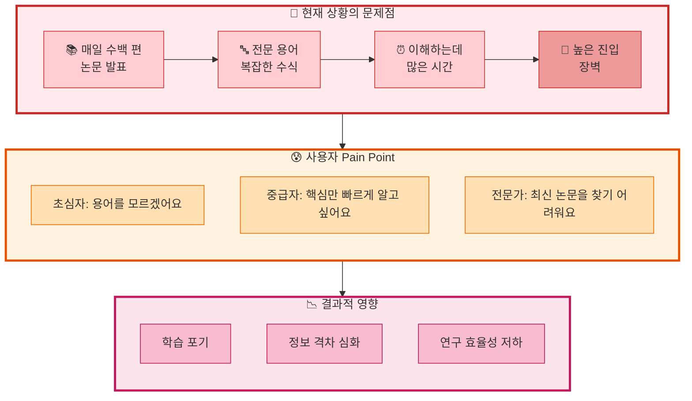
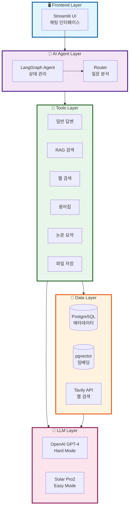
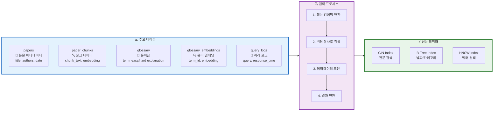
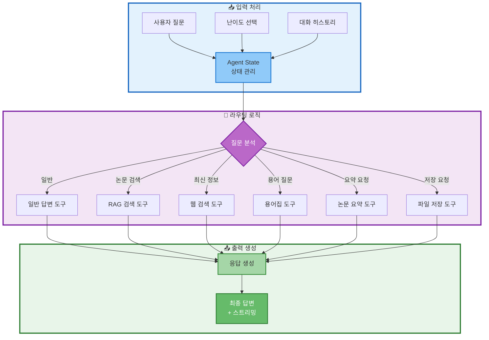
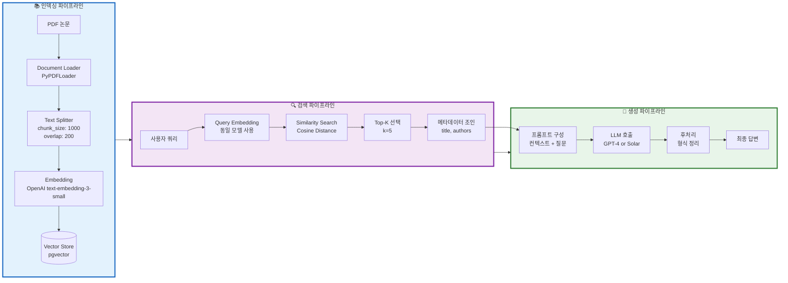

```mermaid
graph LR
    subgraph Goals["🎯 프로젝트 목표"]
        direction TB
        G1[📊 학습 시간<br/>50% 단축]
        G2[👥 모든 수준<br/>맞춤 설명]
        G3[🔍 의미 기반<br/>검색 제공]
        G4[⚡ 실시간<br/>최신 정보]
    end

    subgraph Solutions["💡 핵심 솔루션"]
        direction TB
        S1[AI Agent<br/>자동 라우팅]
        S2[RAG + Web<br/>하이브리드]
        S3[Easy/Hard<br/>난이도 분리]
        S4[6가지 도구<br/>통합 제공]
    end

    subgraph Metrics["📈 성공 지표"]
        direction TB
        M1[10개 시나리오<br/>100% 통과]
        M2[평균 응답속도<br/>5초 이내]
        M3[검색 정확도<br/>85% 이상]
        M4[사용자 만족도<br/>4.0/5.0]
    end

    Goals --> Solutions
    Solutions --> Metrics

    %% 스타일링
    style Goals fill:#e8f5e9,stroke:#2e7d32,stroke-width:3px
    style Solutions fill:#e3f2fd,stroke:#1565c0,stroke-width:3px
    style Metrics fill:#fff3e0,stroke:#e65100,stroke-width:3px

    style G1 fill:#a5d6a7,stroke:#388e3c
    style G2 fill:#a5d6a7,stroke:#388e3c
    style G3 fill:#a5d6a7,stroke:#388e3c
    style G4 fill:#a5d6a7,stroke:#388e3c

    style S1 fill:#90caf9,stroke:#1976d2
    style S2 fill:#90caf9,stroke:#1976d2
    style S3 fill:#90caf9,stroke:#1976d2
    style S4 fill:#90caf9,stroke:#1976d2

    style M1 fill:#ffcc80,stroke:#ef6c00
    style M2 fill:#ffcc80,stroke:#ef6c00
    style M3 fill:#ffcc80,stroke:#ef6c00
    style M4 fill:#ffcc80,stroke:#ef6c00
```

# 02. 프로젝트 목표 및 설계
> 시스템 아키텍처 및 핵심 설계 내용

## 📑 목차
1. [문제 정의](#문제-정의)
2. [프로젝트 목표](#프로젝트-목표)
3. [시스템 아키텍처](#시스템-아키텍처)
4. [데이터베이스 설계](#데이터베이스-설계)
5. [AI Agent 설계](#ai-agent-설계)
6. [RAG 시스템 설계](#rag-시스템-설계)

---

## 문제 정의
### 슬라이드 6: 해결하고자 하는 문제 (Page 6)

**PPT 내용:**



**테이블: 문제점 상세 분석**
| 구분 | 문제점 | 현재 상황 | 필요한 해결책 |
|------|--------|----------|--------------|
| 접근성 | 전문 용어 이해 | 용어 설명 없음 | 자동 용어집 제공 |
| 시간 | 논문 파악 시간 | 평균 2-3시간/편 | 요약 기능 제공 |
| 검색 | 최신 논문 검색 | 키워드 검색만 가능 | 의미 기반 검색 |
| 난이도 | 일률적 설명 | 모든 수준 동일 | 난이도별 설명 |

**발표 스크립트:**
```
현재 AI/ML 분야는 폭발적으로 성장하면서
매일 수백 편의 논문이 발표되고 있습니다.

하지만 전문 용어와 복잡한 수식으로 가득한 논문은
초심자에게는 너무 어렵고, 중급자에게는 시간이 오래 걸리며,
전문가조차도 최신 논문을 효율적으로 찾기 어려운 상황입니다.

이러한 문제는 결국 학습 포기, 정보 격차 심화,
연구 효율성 저하라는 부정적인 결과를 초래하고 있습니다.

저희는 이러한 문제를 해결하기 위해
AI Agent와 RAG 기술을 활용한 솔루션을 제시하고자 합니다.
```

---

## 프로젝트 목표
### 슬라이드 7: 목표 및 기대효과 (Page 7)

**PPT 내용:**



**발표 스크립트:**
```
저희 프로젝트의 목표는 명확합니다.

첫째, 논문 학습 시간을 50% 단축시키고,
둘째, 초심자부터 전문가까지 모든 수준에 맞춤 설명을 제공하며,
셋째, 키워드가 아닌 의미 기반 검색을 통해 관련 논문을 찾고,
넷째, 최신 논문 정보를 실시간으로 제공하는 것입니다.

이를 위해 AI Agent 자동 라우팅, RAG와 웹 검색의 하이브리드 방식,
난이도별 답변 분리, 그리고 6가지 도구의 통합을 구현했습니다.

성공 지표로는 10개 시나리오 100% 통과, 평균 응답속도 5초 이내,
검색 정확도 85% 이상을 목표로 개발을 진행했습니다.
```

---

## 시스템 아키텍처
### 슬라이드 8: 전체 시스템 구조 (Page 8)

**PPT 내용:**



**테이블: 레이어별 기술 스택**
| Layer | 구성 요소 | 기술 스택 | 역할 |
|-------|----------|-----------|------|
| Frontend | UI | Streamlit | 채팅 인터페이스, 파일 다운로드 |
| AI Agent | 상태 관리 | LangGraph | 워크플로우 제어, 도구 라우팅 |
| Tools | 6가지 도구 | Python Functions | 각 기능별 처리 로직 |
| Data | DB | PostgreSQL + pgvector | 논문 저장, 벡터 검색 |
| LLM | AI 모델 | GPT-4, Solar Pro2 | 답변 생성, 난이도별 처리 |

**발표 스크립트:**
```
전체 시스템은 5개의 레이어로 구성되어 있습니다.

최상단 Frontend Layer에서는 Streamlit을 통해
사용자 친화적인 채팅 인터페이스를 제공합니다.

AI Agent Layer는 LangGraph를 활용하여
사용자 질문을 분석하고 적절한 도구를 자동으로 선택합니다.

Tools Layer에는 일반 답변, RAG 검색, 웹 검색, 용어집,
논문 요약, 파일 저장의 6가지 도구가 구현되어 있습니다.

Data Layer에서는 PostgreSQL과 pgvector를 통합하여
관계형 데이터와 벡터 검색을 하나의 DB에서 처리합니다.

마지막으로 LLM Layer에서는 Hard 모드에 GPT-4를,
Easy 모드에 Solar Pro2를 사용하여 비용 효율성을 높였습니다.
```

---

## 데이터베이스 설계
### 슬라이드 9: 데이터베이스 구조 (Page 9)

**PPT 내용:**



**테이블: DB 스키마 상세**
| 테이블 | 주요 컬럼 | 용도 | 인덱스 |
|--------|----------|------|--------|
| papers | paper_id, title, authors, abstract | 논문 메타데이터 | title (GIN), date (B-Tree) |
| paper_chunks | chunk_id, paper_id, embedding | 벡터 검색용 청크 | embedding (HNSW) |
| glossary | term_id, term, easy/hard_explanation | 용어 정의 | term (B-Tree) |
| glossary_embeddings | term_id, embedding | 용어 유사도 검색 | embedding (HNSW) |
| query_logs | log_id, query, tool_used, response_time | 성능 모니터링 | created_at (B-Tree) |

**발표 스크립트:**
```
데이터베이스는 PostgreSQL과 pgvector를 통합하여 설계했습니다.

주요 테이블로는 논문 메타데이터를 저장하는 papers,
벡터 검색을 위한 paper_chunks,
용어 정의를 관리하는 glossary,
그리고 성능 모니터링을 위한 query_logs가 있습니다.

검색 프로세스는 질문을 임베딩으로 변환한 후
pgvector의 코사인 유사도 검색을 통해 관련 문서를 찾고,
메타데이터를 조인하여 완전한 정보를 반환합니다.

성능 최적화를 위해 전문 검색에는 GIN 인덱스를,
날짜와 카테고리 검색에는 B-Tree 인덱스를,
벡터 검색에는 HNSW 인덱스를 적용했습니다.
```

---

## AI Agent 설계
### 슬라이드 10: AI Agent 워크플로우 (Page 10)

**PPT 내용:**



**테이블: Agent State 필드**
| 필드 | 타입 | 설명 | 용도 |
|------|------|------|------|
| question | str | 사용자 질문 | 라우팅 판단 기준 |
| difficulty | str | easy/hard | LLM 선택 및 프롬프트 |
| messages | List[Message] | 대화 히스토리 | 컨텍스트 유지 |
| tool_choice | str | 선택된 도구 | 실행할 도구 결정 |
| tool_result | str | 도구 실행 결과 | 답변 생성 소스 |
| final_answer | str | 최종 답변 | 사용자에게 전달 |

**발표 스크립트:**
```
AI Agent는 LangGraph의 StateGraph를 기반으로 구현했습니다.

사용자 질문이 입력되면 Agent State에서
질문, 난이도, 대화 히스토리를 종합적으로 관리합니다.

라우터는 질문을 분석하여 6가지 도구 중
가장 적절한 도구를 자동으로 선택합니다.

예를 들어 "Transformer란 무엇인가요?"라는 질문이 들어오면
용어집 도구를 선택하고, "최신 LLM 논문을 찾아줘"라는 질문에는
웹 검색 도구를 선택하는 방식입니다.

선택된 도구가 실행되면 그 결과를 바탕으로
난이도에 맞는 최종 답변을 생성하여
스트리밍 방식으로 사용자에게 전달합니다.
```

---

## RAG 시스템 설계
### 슬라이드 11: RAG 파이프라인 (Page 11)

**PPT 내용:**



**테이블: RAG 파라미터 설정**
| 단계 | 파라미터 | 값 | 선정 이유 |
|------|----------|-----|-----------|
| Splitting | chunk_size | 1000 | 컨텍스트 충분 + 정확도 |
| Splitting | chunk_overlap | 200 | 문맥 연속성 보장 |
| Embedding | model | text-embedding-3-small | 비용 효율적 + 성능 |
| Retrieval | top_k | 5 | 충분한 컨텍스트 + 속도 |
| Retrieval | distance | cosine | 의미적 유사도 최적 |
| Generation | temperature | 0.3 | 일관성 있는 답변 |

**발표 스크립트:**
```
RAG 시스템은 크게 인덱싱, 검색, 생성의
세 가지 파이프라인으로 구성됩니다.

먼저 인덱싱 파이프라인에서는 PDF 논문을
1000자 단위로 분할하고, 200자씩 오버랩을 두어
문맥의 연속성을 보장했습니다.
각 청크는 OpenAI의 text-embedding-3-small 모델로
임베딩 벡터로 변환되어 pgvector에 저장됩니다.

검색 파이프라인에서는 사용자 쿼리를 동일한 모델로 임베딩하고,
코사인 유사도를 기반으로 상위 5개 문서를 검색합니다.
그 후 PostgreSQL에서 논문 제목, 저자 등의 메타데이터를 조인합니다.

생성 파이프라인에서는 검색된 컨텍스트와 사용자 질문을 결합하여
프롬프트를 구성하고, 난이도에 따라 GPT-4 또는 Solar Pro2를 호출하여
최종 답변을 생성합니다.

이러한 구조를 통해 정확하고 맥락이 있는 답변을
효율적으로 생성할 수 있었습니다.
```