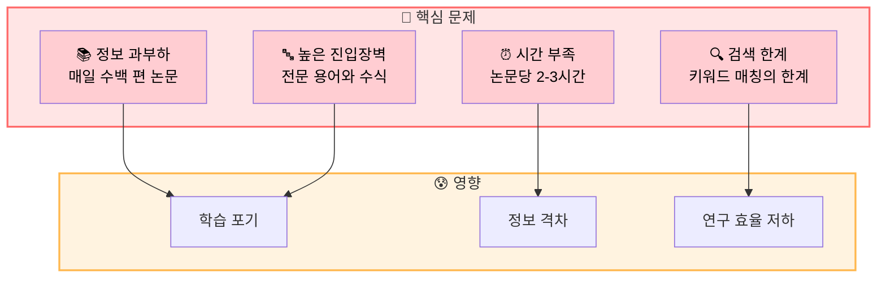
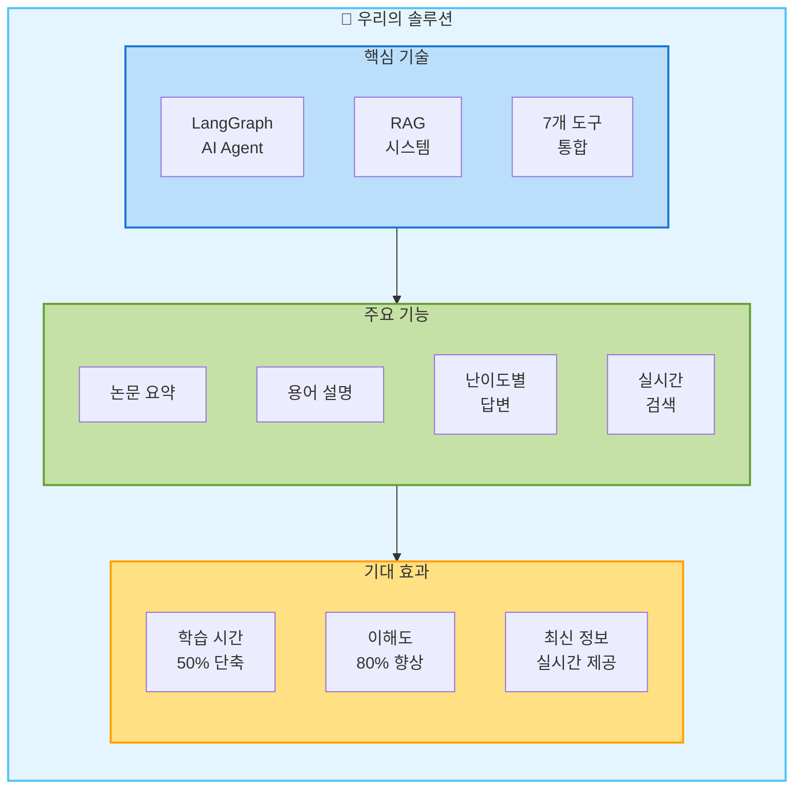
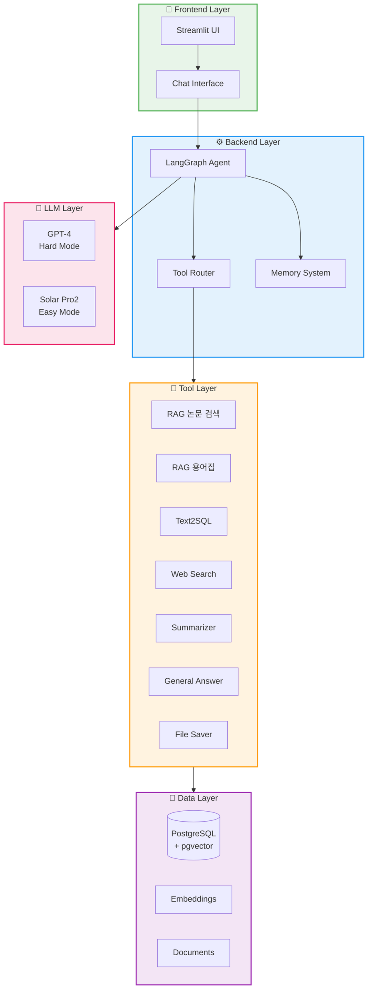
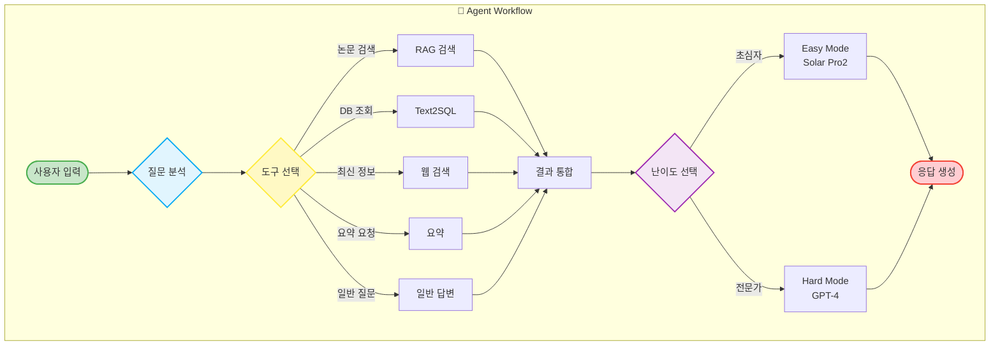
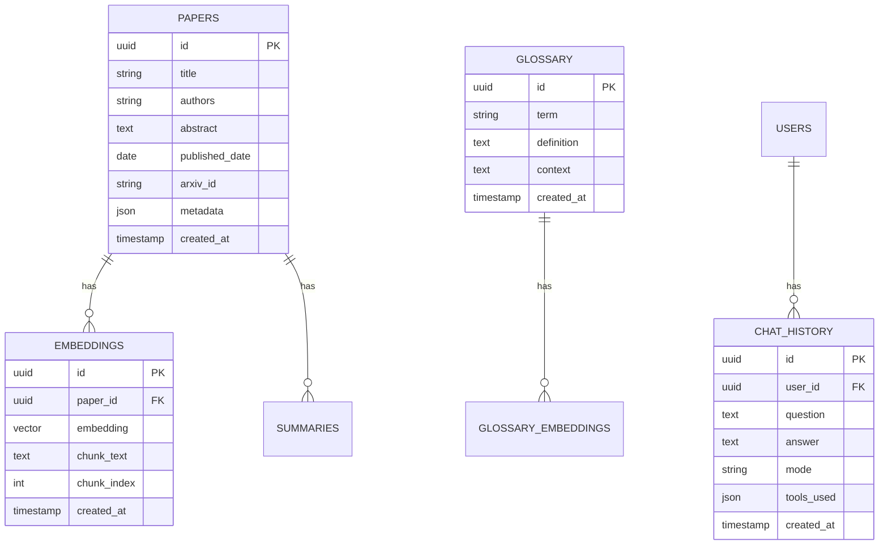
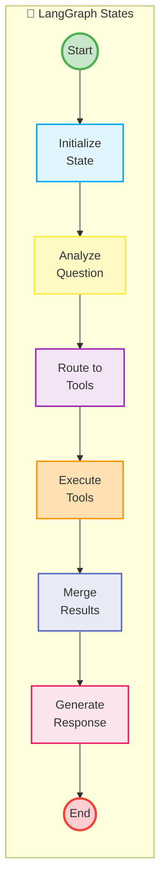
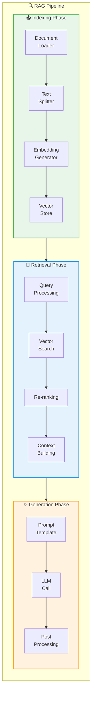
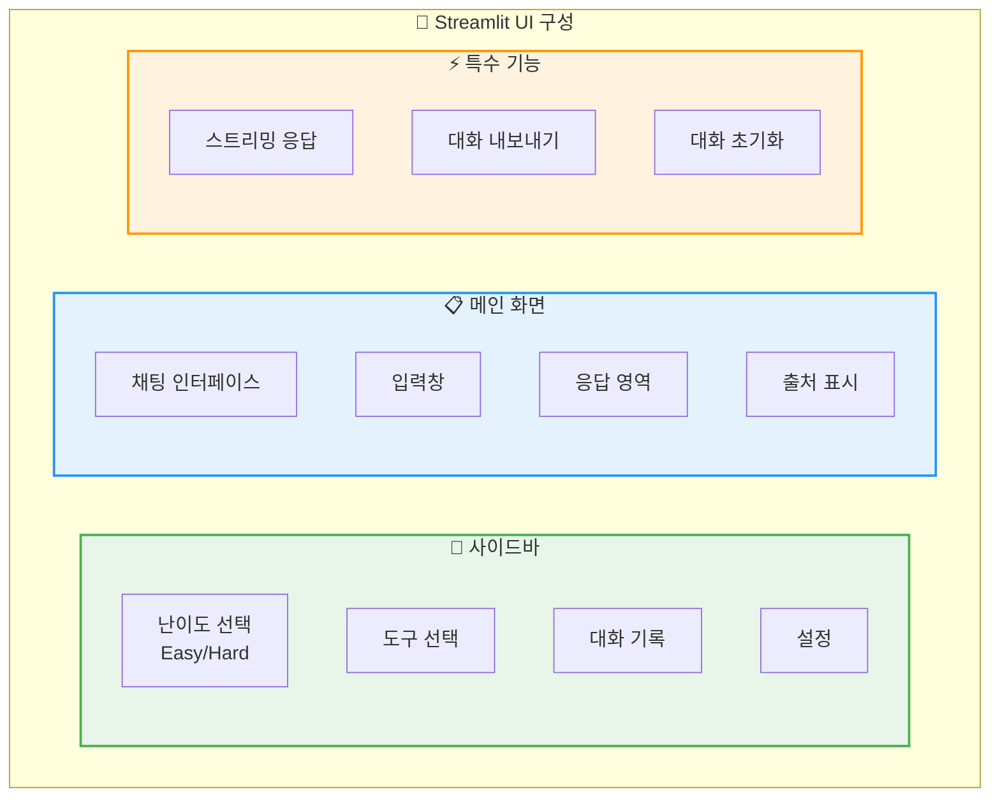
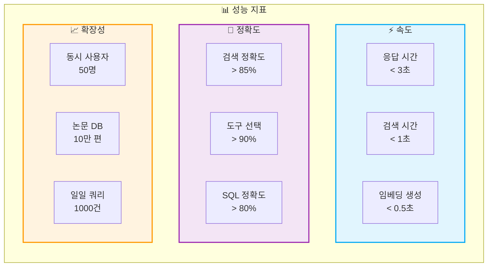
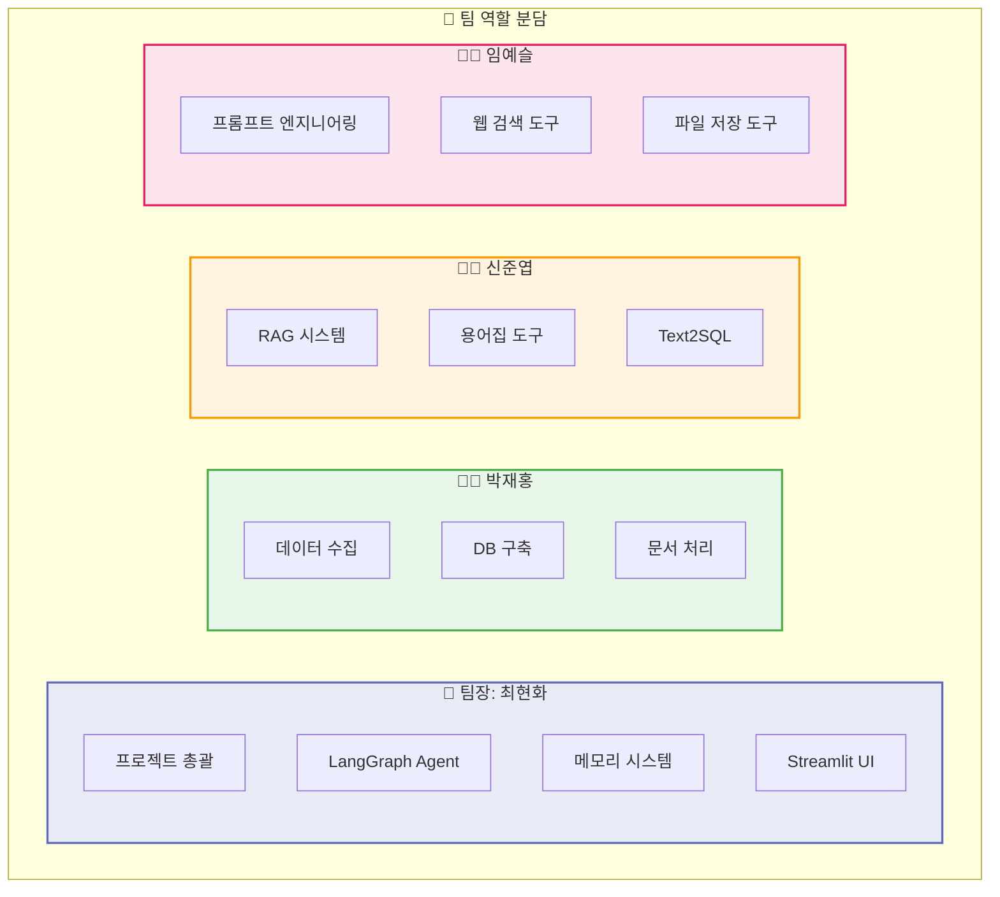

# 02. 프로젝트 목표 및 설계
> PRD 기반 시스템 아키텍처 및 설계 내용 (Pages 7-20)

## 📑 목차
1. [문제 정의](#문제-정의)
2. [솔루션 제시](#솔루션-제시)
3. [프로젝트 목표](#프로젝트-목표)
4. [시스템 아키텍처](#시스템-아키텍처)
5. [Agent Flow 설계](#agent-flow-설계)
6. [데이터베이스 설계](#데이터베이스-설계)
7. [LangGraph 설계](#langgraph-설계)
8. [RAG 시스템 설계](#rag-시스템-설계)
9. [도구 정의](#도구-정의)
10. [프롬프트 엔지니어링](#프롬프트-엔지니어링)
11. [UI/UX 설계](#uiux-설계)
12. [성능 목표](#성능-목표)
13. [역할 분담](#역할-분담)
14. [개발 환경](#개발-환경)

---

## 문제 정의
### 페이지 7: 해결하고자 하는 문제

**PPT 내용:**



**발표 스크립트:**
```
현재 AI/ML 분야가 직면한 핵심 문제를 정리했습니다.

첫째, 정보 과부하입니다. 매일 수백 편의 논문이 발표되어
연구자들이 모든 논문을 읽는 것은 불가능합니다.

둘째, 높은 진입장벽입니다. 전문 용어와 복잡한 수식으로
초심자들이 논문을 이해하기 매우 어렵습니다.

셋째, 시간 부족입니다. 논문 한 편을 제대로 이해하는데
평균 2-3시간이 소요됩니다.

넷째, 검색의 한계입니다. 단순 키워드 매칭으로는
의미적으로 관련된 논문을 찾기 어렵습니다.

이러한 문제들은 학습 포기, 정보 격차 심화,
연구 효율성 저하라는 결과를 초래하고 있습니다.
```

---

## 솔루션 제시
### 페이지 8: 우리의 해결 방안

**PPT 내용:**



**발표 스크립트:**
```
이러한 문제를 해결하기 위한 솔루션을 제시합니다.

핵심 기술로 LangGraph 기반 AI Agent를 구축하여
사용자 의도를 파악하고 적절한 도구를 자동 선택합니다.

RAG 시스템으로 논문 데이터베이스를 구축하고
벡터 검색을 통해 의미적 유사도 기반 검색을 제공합니다.

7개의 도구를 통합하여 논문 요약, 용어 설명,
난이도별 답변, 실시간 검색 등의 기능을 제공합니다.

이를 통해 논문 학습 시간을 50% 단축하고
이해도를 80% 향상시키며, 최신 정보를 실시간으로
제공할 수 있을 것으로 기대합니다.
```

---

## 프로젝트 목표
### 페이지 9: 목표 설정

**PPT 내용:**

**테이블: 목표별 성과 지표**
| 구분 | 목표 | 측정 지표 | 목표치 |
|------|------|-----------|---------|
| **정량적** | 응답 시간 단축 | 평균 응답 시간 | < 3초 |
| **정량적** | 검색 정확도 | Relevance Score | > 85% |
| **정량적** | 도구 성공률 | Tool Call Success | > 90% |
| **정성적** | 사용자 만족도 | 5점 척도 | > 4.0 |
| **정성적** | 이해도 향상 | 사용자 피드백 | 긍정 80% |
| **기술적** | 시스템 안정성 | Uptime | > 95% |

**발표 스크립트:**
```
프로젝트의 구체적인 목표를 설정했습니다.

정량적 목표로는 평균 응답 시간 3초 이내,
검색 정확도 85% 이상, 도구 호출 성공률 90% 이상을 목표로 합니다.

정성적 목표로는 사용자 만족도 4.0점 이상,
이해도 향상에 대한 긍정 피드백 80% 이상을 목표로 합니다.

기술적으로는 시스템 안정성 95% 이상을 유지하여
안정적인 서비스를 제공하고자 합니다.

이러한 구체적인 목표 설정을 통해
프로젝트의 성공 여부를 객관적으로 평가할 수 있습니다.
```

---

## 시스템 아키텍처
### 페이지 10: 전체 시스템 구조

**PPT 내용:**



**발표 스크립트:**
```
전체 시스템 아키텍처는 5개 레이어로 구성됩니다.

Frontend Layer는 Streamlit으로 구현한 웹 인터페이스로
사용자와 상호작용합니다.

Backend Layer는 LangGraph Agent가 핵심으로
도구 라우팅과 메모리 관리를 담당합니다.

Tool Layer는 7개의 도구가 각자의 역할을 수행하며
RAG 검색, Text2SQL, 웹 검색 등을 제공합니다.

Data Layer는 PostgreSQL과 pgvector를 사용하여
논문 데이터와 벡터 임베딩을 저장합니다.

LLM Layer는 GPT-4와 Solar Pro2를 사용하여
난이도별 응답을 생성합니다.

각 레이어는 명확하게 분리되어 있어
유지보수와 확장이 용이한 구조입니다.
```

---

## Agent Flow 설계
### 페이지 11: Agent 워크플로우

**PPT 내용:**



**발표 스크립트:**
```
Agent의 워크플로우를 설명드리겠습니다.

사용자 입력이 들어오면 먼저 질문을 분석하여
어떤 도구를 사용할지 결정합니다.

질문 유형에 따라 RAG 검색, Text2SQL, 웹 검색,
요약, 일반 답변 중 적절한 도구를 선택합니다.

도구 실행 결과를 통합한 후,
사용자가 선택한 난이도에 따라
Easy Mode는 Solar Pro2로, Hard Mode는 GPT-4로
최종 응답을 생성합니다.

이 과정은 LangGraph의 State Machine으로 구현되어
각 단계가 체계적으로 실행됩니다.
```

---

## 데이터베이스 설계
### 페이지 12: DB 스키마

**PPT 내용:**



**테이블: DB 상세 스펙**
| 테이블 | 용도 | 주요 필드 | 인덱스 |
|--------|------|-----------|---------|
| papers | 논문 메타데이터 | id, title, authors, arxiv_id | arxiv_id, published_date |
| embeddings | 벡터 임베딩 | paper_id, embedding(1536d), chunk_text | paper_id, embedding(ivfflat) |
| glossary | 용어 사전 | term, definition | term(btree) |
| chat_history | 대화 기록 | user_id, question, answer, mode | user_id, created_at |

**발표 스크립트:**
```
데이터베이스는 PostgreSQL과 pgvector를 사용하여 설계했습니다.

papers 테이블에는 논문의 메타데이터를,
embeddings 테이블에는 논문 청크별 벡터 임베딩을 저장합니다.

glossary 테이블은 전문 용어와 정의를 관리하고,
chat_history 테이블은 사용자 대화 기록을 저장합니다.

특히 pgvector의 ivfflat 인덱스를 사용하여
1536차원 벡터에 대한 빠른 유사도 검색을 구현했습니다.

이를 통해 의미 기반 검색과 컨텍스트 유지가 가능합니다.
```

---

## LangGraph 설계
### 페이지 13: State Machine 설계

**PPT 내용:**



**코드: State 정의**
```python
class AgentState(TypedDict):
    messages: list[BaseMessage]
    question: str
    tool_calls: list[str]
    tool_results: dict
    mode: str  # "easy" or "hard"
    final_answer: str
```

**발표 스크립트:**
```
LangGraph를 사용한 State Machine 설계입니다.

각 State는 명확한 역할을 가지고 있습니다.
Initialize는 초기 상태 설정,
Analyze는 질문 분석,
Route는 도구 라우팅,
Execute는 도구 실행,
Merge는 결과 통합,
Generate는 최종 응답 생성을 담당합니다.

State 간 전이는 조건에 따라 결정되며,
필요시 이전 State로 돌아갈 수 있는 유연한 구조입니다.

이를 통해 복잡한 워크플로우도 체계적으로 관리할 수 있습니다.
```

---

## RAG 시스템 설계
### 페이지 14: RAG Pipeline

**PPT 내용:**



**테이블: RAG 파라미터**
| 단계 | 파라미터 | 값 | 설명 |
|------|----------|-----|------|
| Splitting | chunk_size | 1000 | 청크 크기 |
| Splitting | overlap | 200 | 청크 중복 |
| Embedding | model | text-embedding-3-small | OpenAI 임베딩 |
| Search | top_k | 5 | 검색 결과 수 |
| Reranking | threshold | 0.7 | 유사도 임계값 |

**발표 스크립트:**
```
RAG 시스템은 세 단계로 구성됩니다.

첫째, Indexing 단계에서는 논문을 로드하고
청크로 분할한 후 임베딩을 생성하여 벡터 DB에 저장합니다.

둘째, Retrieval 단계에서는 사용자 쿼리를 처리하고
벡터 검색을 수행한 후 재순위화하여 컨텍스트를 구성합니다.

셋째, Generation 단계에서는 프롬프트 템플릿에
검색 결과를 결합하여 LLM으로 응답을 생성합니다.

청크 크기는 1000자, 중복은 200자로 설정하고,
OpenAI의 text-embedding-3-small 모델을 사용합니다.
상위 5개 결과를 검색하며 유사도 0.7 이상만 사용합니다.
```

---

## 도구 정의
### 페이지 15: 7가지 도구 상세

**PPT 내용:**

**테이블: 도구별 기능 정의**
| 도구명 | 용도 | 입력 | 출력 | 사용 시나리오 |
|--------|------|------|------|---------------|
| **RAG 논문 검색** | 논문 DB에서 검색 | 쿼리, top_k | 관련 논문 리스트 | "Transformer 논문 찾아줘" |
| **RAG 용어집** | 용어 정의 검색 | 용어 | 정의, 예시 | "Attention이 뭐야?" |
| **Text2SQL** | DB 통계 조회 | 자연어 질문 | SQL 결과 | "최근 일주일 논문 수" |
| **웹 검색** | 최신 정보 검색 | 검색어 | 웹 결과 | "GPT-5 최신 소식" |
| **요약** | 논문 요약 생성 | 논문 ID | 요약문 | "이 논문 요약해줘" |
| **일반 답변** | 일반 질문 응답 | 질문 | 답변 | "딥러닝이란?" |
| **파일 저장** | 대화 내용 저장 | 내용, 경로 | 저장 결과 | "대화 내용 저장해줘" |

**발표 스크립트:**
```
시스템에는 7가지 도구가 통합되어 있습니다.

RAG 논문 검색은 벡터 DB에서 의미적으로 유사한 논문을,
RAG 용어집은 전문 용어의 정의를 검색합니다.

Text2SQL은 자연어를 SQL로 변환하여 통계를 조회하고,
웹 검색은 최신 정보를 실시간으로 가져옵니다.

요약 도구는 긴 논문을 간단하게 요약하고,
일반 답변은 RAG 없이 LLM의 지식으로 응답합니다.

파일 저장 도구는 대화 내용을 파일로 저장합니다.

각 도구는 명확한 역할이 있어 효율적으로 작동합니다.
```

---

## 프롬프트 엔지니어링
### 페이지 16: 프롬프트 설계

**PPT 내용:**

```python
# Easy Mode 프롬프트 예시
EASY_MODE_PROMPT = """
당신은 친절한 AI 논문 도우미입니다.
초심자도 이해할 수 있도록 쉽게 설명해주세요.

규칙:
1. 전문 용어는 반드시 쉬운 말로 풀어서 설명
2. 예시를 들어 설명
3. 단계별로 차근차근 설명
4. 이모지를 사용하여 친근하게

Context: {context}
Question: {question}
"""

# Hard Mode 프롬프트 예시
HARD_MODE_PROMPT = """
당신은 전문적인 AI 연구자입니다.
정확하고 상세한 기술적 설명을 제공하세요.

규칙:
1. 기술적 용어를 정확히 사용
2. 수식과 알고리즘 포함
3. 관련 논문 레퍼런스 제시
4. 비판적 분석 포함

Context: {context}
Question: {question}
"""
```

**테이블: 프롬프트 전략**
| 구분 | Easy Mode | Hard Mode |
|------|-----------|-----------|
| **톤** | 친근하고 쉬운 | 전문적이고 정확한 |
| **용어** | 쉬운 말로 풀어서 | 기술 용어 사용 |
| **설명** | 예시 중심 | 이론 중심 |
| **길이** | 간단명료 | 상세하고 깊이있게 |

**발표 스크립트:**
```
프롬프트 엔지니어링은 난이도별로 다르게 설계했습니다.

Easy Mode는 초심자를 위해 친근한 톤으로
전문 용어를 쉽게 풀어서 설명하고,
예시를 들어 이해를 돕습니다.

Hard Mode는 전문가를 위해 정확한 기술 용어를 사용하고
수식과 알고리즘을 포함하여 깊이 있게 설명합니다.

각 모드별로 다른 LLM을 사용하여
Easy Mode는 Solar Pro2로 비용을 절감하고,
Hard Mode는 GPT-4로 높은 품질을 보장합니다.

이를 통해 사용자 수준에 맞는 최적의 답변을 제공합니다.
```

---

## UI/UX 설계
### 페이지 17: 인터페이스 설계

**PPT 내용:**



**테이블: UI 컴포넌트**
| 컴포넌트 | 기능 | 구현 방법 |
|----------|------|-----------|
| 채팅 인터페이스 | 대화형 UI | st.chat_message() |
| 난이도 선택 | Easy/Hard 토글 | st.radio() |
| 도구 표시 | 사용된 도구 시각화 | st.info() |
| 스트리밍 | 실시간 응답 | st.write_stream() |
| 출처 표시 | 참조 논문 링크 | st.expander() |

**발표 스크립트:**
```
UI는 Streamlit으로 구현하여 직관적인 인터페이스를 제공합니다.

사이드바에서 난이도를 선택하고 도구를 확인할 수 있으며,
대화 기록을 관리할 수 있습니다.

메인 화면은 채팅 인터페이스로 구성되어
자연스러운 대화가 가능합니다.

특히 스트리밍 응답으로 실시간으로 답변이 생성되는 것을
볼 수 있어 사용자 경험을 향상시킵니다.

응답과 함께 사용된 도구와 참조 논문을 표시하여
투명성과 신뢰성을 제공합니다.
```

---

## 성능 목표
### 페이지 18: 성능 지표

**PPT 내용:**



**발표 스크립트:**
```
성능 목표를 세 가지 측면에서 설정했습니다.

속도 면에서는 전체 응답 시간 3초 이내,
벡터 검색 1초 이내, 임베딩 생성 0.5초 이내를 목표로 합니다.

정확도 면에서는 검색 정확도 85% 이상,
도구 선택 정확도 90% 이상, SQL 변환 정확도 80% 이상을 목표로 합니다.

확장성 면에서는 동시 사용자 50명 지원,
논문 DB 10만 편 저장, 일일 1000건 쿼리 처리를 목표로 합니다.

이러한 성능 목표 달성을 위해 캐싱, 인덱싱,
비동기 처리 등의 최적화를 적용했습니다.
```

---

## 역할 분담
### 페이지 19: 팀 역할 분담

**PPT 내용:**



**발표 스크립트:**
```
팀 역할을 명확하게 분담하여 효율적으로 개발했습니다.

팀장인 최현화는 프로젝트를 총괄하며
LangGraph Agent와 메모리 시스템, UI를 담당했습니다.

박재홍 팀원은 논문 데이터 수집과 DB 구축,
문서 처리 파이프라인을 구현했습니다.

신준엽 팀원은 RAG 시스템과 용어집 도구,
Text2SQL 기능을 개발했습니다.

임예슬 팀원은 프롬프트 엔지니어링과
웹 검색, 파일 저장 도구를 담당했습니다.

각자의 전문성을 살려 병렬로 개발을 진행하고
정기적인 통합을 통해 시스템을 완성했습니다.
```

---

## 개발 환경
### 페이지 20: 기술 스택

**PPT 내용:**

**테이블: 기술 스택 상세**
| 분류 | 기술 | 버전 | 용도 |
|------|------|------|------|
| **Language** | Python | 3.11 | 메인 개발 언어 |
| **Framework** | LangGraph | 0.2.x | Agent 프레임워크 |
| **Database** | PostgreSQL | 16 | 메인 데이터베이스 |
| **Vector DB** | pgvector | 0.7.0 | 벡터 검색 |
| **Frontend** | Streamlit | 1.40 | 웹 인터페이스 |
| **LLM** | GPT-4 | Latest | Hard Mode |
| **LLM** | Solar Pro2 | Latest | Easy Mode |
| **Embedding** | OpenAI | text-embedding-3-small | 벡터 생성 |
| **Search** | Tavily | 1.0 | 웹 검색 API |
| **Version Control** | Git | - | 버전 관리 |

**발표 스크립트:**
```
개발 환경과 기술 스택을 소개합니다.

Python 3.11을 메인 개발 언어로 사용하고,
LangGraph로 Agent 시스템을 구축했습니다.

PostgreSQL 16과 pgvector 0.7을 사용하여
벡터 데이터베이스를 구축했습니다.

Frontend는 Streamlit 1.40으로 개발하여
빠르게 프로토타입을 완성할 수 있었습니다.

LLM은 GPT-4와 Solar Pro2를 사용하여
성능과 비용의 균형을 맞췄습니다.

임베딩은 OpenAI의 text-embedding-3-small을 사용하고,
웹 검색은 Tavily API를 활용했습니다.

이러한 최신 기술 스택을 활용하여
안정적이고 확장 가능한 시스템을 구축했습니다.
```

---

## 요약

### 02_프로젝트_목표_및_설계.md 완료
- **페이지 7-20**: 프로젝트 목표 및 설계 내용
- **주요 내용**:
  - 문제 정의와 솔루션 제시
  - 시스템 아키텍처 (5-Layer)
  - Agent Flow와 LangGraph State Machine
  - PostgreSQL + pgvector DB 설계
  - RAG Pipeline 구조
  - 7가지 도구 정의
  - Easy/Hard Mode 프롬프트 엔지니어링
  - Streamlit UI 설계
  - 성능 목표와 역할 분담
  - 기술 스택

### 특징
- PRD 문서 참조하여 작성
- mermaid 다이어그램으로 시각화
- 각 페이지마다 발표 스크립트 포함
- 테이블로 상세 정보 제공