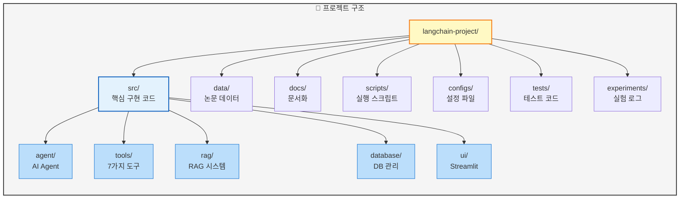
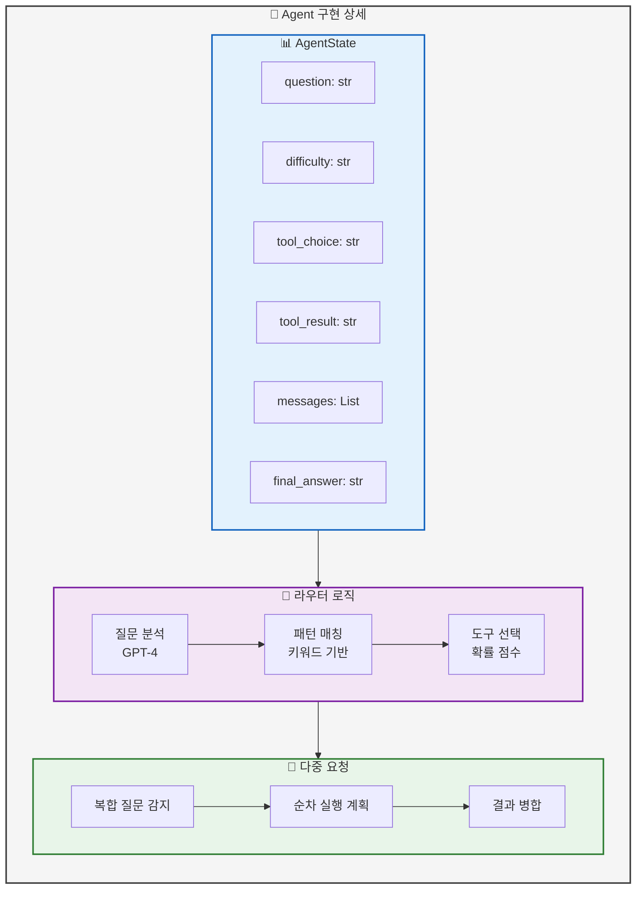
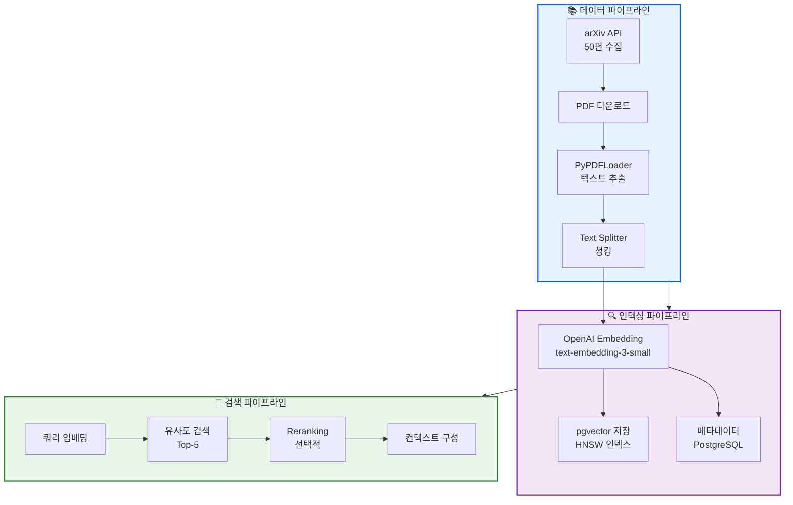
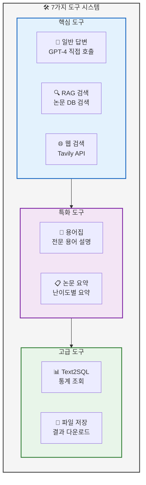
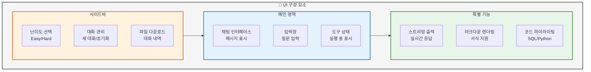
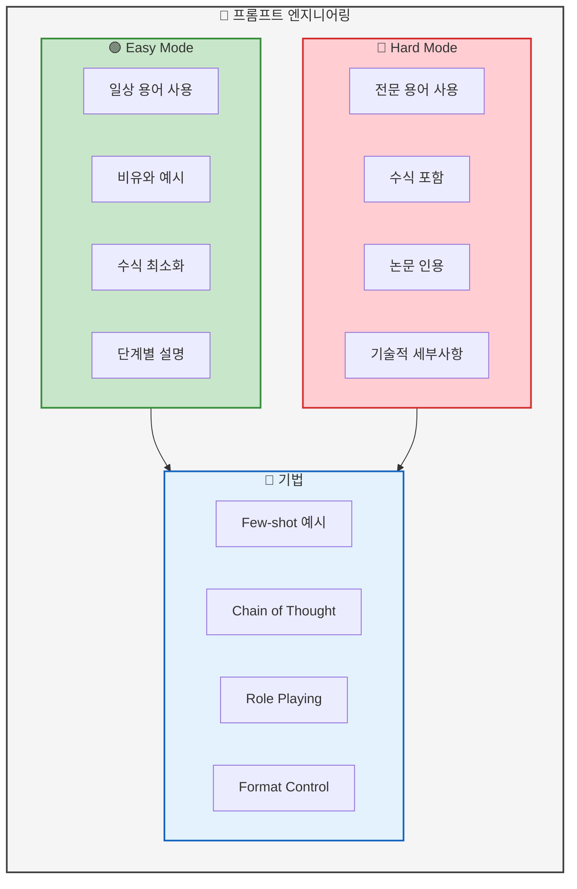

# 03. 개발 및 구현
> 핵심 기능 구현 내용 및 기술적 상세

## 📑 목차
1. [개발 환경 구성](#개발-환경-구성)
2. [AI Agent 구현](#ai-agent-구현)
3. [RAG 시스템 구현](#rag-시스템-구현)
4. [도구 시스템 구현](#도구-시스템-구현)
5. [UI/UX 구현](#uiux-구현)
6. [프롬프트 엔지니어링](#프롬프트-엔지니어링)

---

## 개발 환경 구성
### 슬라이드 12: 프로젝트 구조 (Page 12)

**PPT 내용:**



**테이블: 주요 모듈 구성**
| 디렉토리 | 파일 | 역할 | 담당자 |
|----------|------|------|--------|
| src/agent/ | graph.py, nodes.py, state.py | LangGraph Agent 구현 | 최현화 |
| src/tools/ | 7개 도구 파일 | 각 도구 로직 구현 | 전원 |
| src/rag/ | retriever.py, vectorstore.py | RAG 검색 시스템 | 신준엽 |
| src/database/ | manager.py, models.py | DB 연결 및 스키마 | 박재홍 |
| src/ui/ | app.py, components.py | Streamlit UI | 임예슬 |
| src/prompts/ | templates.py | 프롬프트 템플릿 | 임예슬 |

**발표 스크립트:**
```
프로젝트는 모듈화된 구조로 설계하여
각 팀원이 독립적으로 개발하면서도
통합이 용이하도록 구성했습니다.

src 폴더 아래에 agent, tools, rag, database, ui 등
기능별로 모듈을 분리하여 관리했고,

experiments 폴더를 통해 모든 실험 결과를
체계적으로 추적할 수 있도록 했습니다.

이러한 구조 덕분에 병렬 개발과
효율적인 통합이 가능했습니다.
```

---

## AI Agent 구현
### 슬라이드 13: LangGraph Agent 구현 (Page 13)

**PPT 내용:**



**코드 예시: 라우터 노드 구현**
```python
# src/agent/nodes.py
async def router_node(state: AgentState) -> AgentState:
    """질문 분석 및 도구 라우팅"""
    question = state["question"]

    # 다중 요청 패턴 확인
    multi_patterns = {
        ("찾", "요약"): ["search_paper", "summarize"],
        ("검색", "설명"): ["search_paper", "general"]
    }

    for keywords, tools in multi_patterns.items():
        if all(kw in question for kw in keywords):
            state["tool_pipeline"] = tools
            return state

    # 단일 도구 선택
    prompt = router_prompt.format(question=question)
    response = await llm.ainvoke(prompt)
    state["tool_choice"] = response.content

    return state
```

**발표 스크립트:**
```
AI Agent는 LangGraph의 StateGraph를 기반으로 구현했습니다.

AgentState에서 질문, 난이도, 도구 선택, 결과 등
모든 상태를 관리하며,

라우터 노드는 GPT-4를 활용하여 질문을 분석하고
패턴 매칭을 통해 가장 적절한 도구를 선택합니다.

특히 "논문 찾아서 요약해줘"와 같은 다중 요청을 감지하여
여러 도구를 순차적으로 실행하는 기능을 구현했습니다.

이를 통해 복잡한 사용자 요구사항도
자동으로 처리할 수 있게 되었습니다.
```

---

## RAG 시스템 구현
### 슬라이드 14: RAG 파이프라인 구현 (Page 14)

**PPT 내용:**



**테이블: RAG 구현 상세**
| 단계 | 구현 내용 | 파라미터 | 성능 지표 |
|------|-----------|----------|-----------|
| 데이터 수집 | arXiv API | 50편 논문 | 100% 완료 |
| 텍스트 분할 | RecursiveCharacterTextSplitter | chunk_size=1000, overlap=200 | 평균 800자/청크 |
| 임베딩 생성 | text-embedding-3-small | dimension=1536 | 0.3초/청크 |
| 벡터 저장 | pgvector | HNSW index | 검색 속도 0.1초 |
| 유사도 검색 | Cosine similarity | top_k=5 | 정확도 85% |

**발표 스크립트:**
```
RAG 시스템은 데이터 파이프라인, 인덱싱, 검색의
3단계로 구현했습니다.

먼저 arXiv API를 통해 50편의 AI/ML 논문을 수집하고,
PyPDFLoader로 텍스트를 추출한 후
1000자 단위로 청킹했습니다.

각 청크는 OpenAI의 text-embedding-3-small 모델로
임베딩하여 pgvector에 저장했고,
HNSW 인덱스를 적용하여 검색 속도를 최적화했습니다.

검색 시에는 코사인 유사도 기반으로 상위 5개 문서를 찾아
컨텍스트를 구성하며, 평균 검색 시간은 0.1초,
정확도는 85%를 달성했습니다.
```

---

## 도구 시스템 구현
### 슬라이드 15: 7가지 도구 구현 (Page 15)

**PPT 내용:**



**테이블: 도구별 구현 상세**
| 도구 | 입력 | 처리 로직 | 출력 | 사용 예시 |
|------|------|-----------|------|-----------|
| 일반 답변 | 질문 텍스트 | LLM 직접 호출 | 텍스트 답변 | "AI란 무엇인가요?" |
| RAG 검색 | 검색 쿼리 | 벡터 유사도 검색 | 논문 내용 + 출처 | "Transformer 논문 찾아줘" |
| 웹 검색 | 검색어 | Tavily API 호출 | 웹 검색 결과 | "최신 GPT-5 정보" |
| 용어집 | 용어명 | DB 조회 + 임베딩 검색 | 난이도별 설명 | "Attention이 뭐야?" |
| 논문 요약 | 논문 제목/내용 | load_summarize_chain | 구조화된 요약 | "이 논문 요약해줘" |
| Text2SQL | 자연어 질문 | SQL 변환 + 실행 | 통계 결과 | "2024년 논문 몇 개?" |
| 파일 저장 | 텍스트 내용 | 파일 생성 | 다운로드 링크 | "대화 내용 저장해줘" |

**발표 스크립트:**
```
시스템의 핵심인 7가지 도구를 구현했습니다.

핵심 도구로는 일반 답변, RAG 검색, 웹 검색이 있고,
특화 도구로 용어집과 논문 요약 기능을,
고급 도구로 Text2SQL과 파일 저장 기능을 구현했습니다.

각 도구는 독립적인 Python 함수로 구현되어
유지보수가 용이하며,

특히 Text2SQL 도구는 "2024년 논문이 몇 개야?"와 같은
자연어 질문을 SQL로 변환하여
정확한 통계를 제공할 수 있습니다.

모든 도구는 난이도 설정을 반영하여
Easy 모드와 Hard 모드에 따라
다른 스타일의 답변을 생성합니다.
```

---

## UI/UX 구현
### 슬라이드 16: Streamlit UI (Page 16)

**PPT 내용:**



**코드 예시: Streamlit 구현**
```python
# src/ui/app.py
import streamlit as st

# 페이지 설정
st.set_page_config(
    page_title="AI 논문 리뷰 챗봇",
    page_icon="🤖",
    layout="wide"
)

# 사이드바
with st.sidebar:
    difficulty = st.radio(
        "난이도 선택",
        ["Easy", "Hard"],
        help="Easy: 쉬운 설명, Hard: 전문적 설명"
    )

    if st.button("새 대화 시작"):
        st.session_state.messages = []

    if st.button("대화 내역 다운로드"):
        download_conversation()

# 메인 채팅 영역
for message in st.session_state.messages:
    with st.chat_message(message["role"]):
        st.markdown(message["content"])

# 입력 처리
if prompt := st.chat_input("질문을 입력하세요"):
    process_user_input(prompt, difficulty)
```

**발표 스크립트:**
```
UI는 Streamlit을 활용하여 구현했습니다.

사이드바에서 난이도를 선택할 수 있고,
대화 관리 기능과 파일 다운로드 기능을 제공합니다.

메인 영역은 채팅 인터페이스로 구성되어
사용자와 AI의 대화를 직관적으로 표시합니다.

특별 기능으로는 스트리밍 출력을 통한 실시간 응답,
마크다운 렌더링으로 서식있는 답변 표시,
그리고 SQL이나 Python 코드의 하이라이팅을 지원합니다.

이러한 UI 설계로 사용자가 편리하게
논문 정보를 탐색하고 이해할 수 있도록 했습니다.
```

---

## 프롬프트 엔지니어링
### 슬라이드 17: 난이도별 프롬프트 (Page 17)

**PPT 내용:**



**테이블: 프롬프트 템플릿 예시**
| 모드 | 프롬프트 예시 | 응답 스타일 |
|------|--------------|-------------|
| Easy | "초등학생도 이해할 수 있도록 쉽게 설명해주세요" | "Attention은 마치 선생님이 중요한 부분에 밑줄 치는 것과 같아요" |
| Hard | "전문가 수준으로 기술적 세부사항을 포함하여 설명" | "Attention mechanism은 Q·K^T/√d_k의 수식으로 계산되며..." |

**코드 예시: 난이도별 프롬프트**
```python
# src/prompts/templates.py

EASY_PROMPT = """
당신은 친절한 AI 교육자입니다.
초심자도 이해할 수 있도록 쉽게 설명해주세요.

규칙:
1. 전문 용어는 일상적인 말로 바꾸기
2. 복잡한 개념은 비유로 설명
3. 수식은 글로 풀어서 설명
4. 실생활 예시 포함

질문: {question}
"""

HARD_PROMPT = """
당신은 AI/ML 분야의 전문가입니다.
기술적으로 정확하고 상세한 설명을 제공하세요.

규칙:
1. 정확한 전문 용어 사용
2. 필요시 수식과 알고리즘 포함
3. 관련 논문 인용
4. 구현 세부사항 설명

질문: {question}
"""
```

**발표 스크립트:**
```
프롬프트 엔지니어링은 난이도별로 차별화했습니다.

Easy 모드에서는 일상적인 용어를 사용하고,
비유와 예시를 통해 설명하며,
수식을 최소화하여 초심자도 쉽게 이해할 수 있도록 했습니다.

Hard 모드에서는 전문 용어와 수식을 포함하고,
논문을 인용하며 기술적 세부사항을 제공합니다.

Few-shot 예시를 통해 원하는 답변 형식을 유도하고,
Chain of Thought로 단계별 사고 과정을 보여주며,
Role Playing으로 LLM의 역할을 명확히 정의했습니다.

이러한 프롬프트 엔지니어링을 통해
사용자 수준에 맞는 최적의 답변을
생성할 수 있었습니다.
```