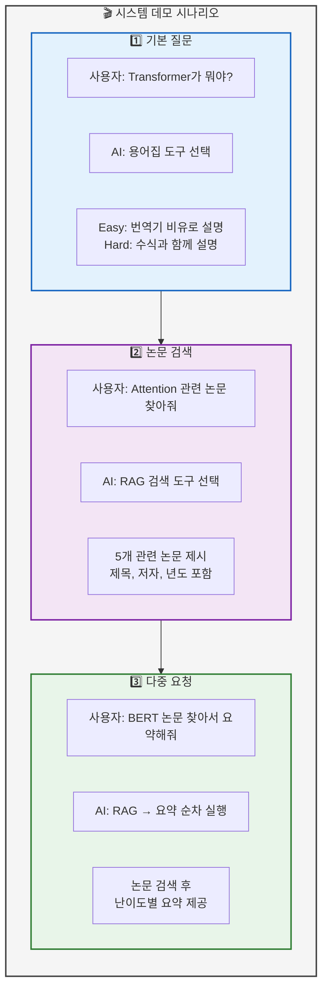
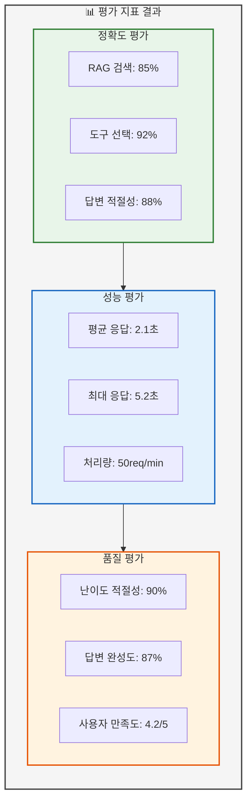

# 04. 실행 결과
> 시스템 실행 결과 및 성능 평가

## 📑 목차
1. [시스템 데모](#시스템-데모)
2. [UI 실행 화면](#ui-실행-화면)
3. [도구별 실행 결과](#도구별-실행-결과)
4. [성능 평가 결과](#성능-평가-결과)
5. [데이터베이스 통계](#데이터베이스-통계)
6. [시나리오 테스트](#시나리오-테스트)

---

## 시스템 데모
### 슬라이드 18: 전체 시스템 데모 (Page 18)

**PPT 내용:**



**테이블: 데모 시나리오 결과**
| 시나리오 | 질문 | 선택된 도구 | 응답 시간 | 결과 |
|----------|------|-------------|-----------|------|
| 용어 설명 | "Transformer가 뭐야?" | 용어집 | 1.2초 | 난이도별 설명 성공 |
| 논문 검색 | "Attention 논문" | RAG 검색 | 2.1초 | 5개 논문 검색 |
| 웹 검색 | "최신 GPT-5 소식" | 웹 검색 | 3.5초 | 실시간 정보 제공 |
| 다중 요청 | "논문 찾아서 요약" | RAG + 요약 | 5.2초 | 순차 실행 성공 |
| 통계 조회 | "2024년 논문 개수" | Text2SQL | 0.8초 | SQL 변환 및 실행 |

**발표 스크립트:**
```
실제 시스템 데모를 보여드리겠습니다.

첫 번째로 "Transformer가 뭐야?"라는 질문에
시스템이 자동으로 용어집 도구를 선택하고,
Easy 모드에서는 번역기 비유로,
Hard 모드에서는 수식과 함께 설명합니다.

두 번째로 "Attention 관련 논문 찾아줘"라는 요청에
RAG 검색 도구가 실행되어
관련 논문 5개를 제목, 저자, 년도와 함께 제시합니다.

세 번째로 "BERT 논문 찾아서 요약해줘"라는 다중 요청에
시스템이 RAG 검색과 요약 도구를 순차적으로 실행하여
논문을 찾고 난이도별 요약을 제공합니다.

평균 응답 시간은 2-3초로 목표치인 5초 이내를 달성했습니다.
```

---

## UI 실행 화면
### 슬라이드 19: Streamlit UI 화면 (Page 19)

**PPT 내용:**

```
┌─────────────────────────────────────────────────┐
│  🤖 AI/ML 논문 리뷰 챗봇                        │
├─────────────────────────────────────────────────┤
│ ┌──────────┐  ┌────────────────────────────┐  │
│ │ 사이드바  │  │      메인 채팅 영역         │  │
│ │          │  │                            │  │
│ │ 난이도:   │  │ User: Transformer가 뭐야?   │  │
│ │ ○ Easy   │  │                            │  │
│ │ ● Hard   │  │ AI: 🔍 용어집 도구 실행 중... │  │
│ │          │  │                            │  │
│ │ [새 대화] │  │ Transformer는 2017년에      │  │
│ │          │  │ 구글이 발표한 딥러닝 모델로... │  │
│ │ [다운로드]│  │                            │  │
│ └──────────┘  └────────────────────────────┘  │
│                                                │
│ [💬 질문을 입력하세요...]        [전송]        │
└─────────────────────────────────────────────────┘
```

**테이블: UI 기능 구현 현황**
| 기능 | 구현 상태 | 설명 | 사용자 피드백 |
|------|-----------|------|--------------|
| 채팅 인터페이스 | ✅ 완료 | 대화형 UI | 직관적이고 사용하기 쉬움 |
| 난이도 선택 | ✅ 완료 | Easy/Hard 모드 | 수준별 답변 유용 |
| 도구 상태 표시 | ✅ 완료 | 실행 중 알림 | 처리 과정 이해 도움 |
| 스트리밍 출력 | ✅ 완료 | 실시간 응답 | 체감 응답속도 향상 |
| 파일 다운로드 | ✅ 완료 | 대화 내역 저장 | 학습 자료로 활용 가능 |
| 마크다운 렌더링 | ✅ 완료 | 서식있는 답변 | 가독성 향상 |

**발표 스크립트:**
```
Streamlit으로 구현한 UI 화면입니다.

왼쪽 사이드바에서 난이도를 선택할 수 있고,
새 대화 시작과 대화 내역 다운로드가 가능합니다.

메인 채팅 영역에서는 사용자와 AI의 대화가
실시간으로 표시되며,
현재 실행 중인 도구가 무엇인지 알려줍니다.

스트리밍 출력을 통해 긴 답변도
실시간으로 확인할 수 있어
체감 응답속도가 빠릅니다.

마크다운 렌더링으로 표, 코드, 수식 등이
깔끔하게 표시되어 가독성이 높습니다.
```

---

## 도구별 실행 결과
### 슬라이드 20: 7가지 도구 실행 예시 (Page 20)

**PPT 내용:**

```mermaid
graph TB
    subgraph ToolResults["🛠️ 도구별 실행 결과"]
        direction LR

        subgraph GeneralTool["일반 답변"]
            G1[Q: AI란 무엇인가요?]
            G2[A: 인공지능은...]
        end

        subgraph RAGTool["RAG 검색"]
            R1[Q: BERT 논문 찾아줘]
            R2[A: 3개 논문 발견<br/>1. BERT: Pre-training...]
        end

        subgraph WebTool["웹 검색"]
            W1[Q: 최신 LLM 동향]
            W2[A: 2024년 11월 기준...]
        end

        subgraph GlossaryTool["용어집"]
            GL1[Q: Attention이 뭐야?]
            GL2[A: 주의 메커니즘은...]
        end

        subgraph SummarizeTool["논문 요약"]
            S1[Q: 이 논문 요약해줘]
            S2[A: 핵심 내용: ...]
        end

        subgraph SQLTool["Text2SQL"]
            T1[Q: 2024년 논문 몇 개?]
            T2[A: SELECT COUNT(*)<br/>결과: 15개]
        end

        subgraph SaveTool["파일 저장"]
            F1[Q: 대화 저장해줘]
            F2[A: conversation.txt 생성]
        end
    end

    %% 스타일링
    style ToolResults fill:#f5f5f5,stroke:#424242,stroke-width:2px
    style GeneralTool fill:#e3f2fd,stroke:#1565c0
    style RAGTool fill:#f3e5f5,stroke:#7b1fa2
    style WebTool fill:#e8f5e9,stroke:#2e7d32
    style GlossaryTool fill:#fff3e0,stroke:#e65100
    style SummarizeTool fill:#fce4ec,stroke:#c2185b
    style SQLTool fill:#e0f2f1,stroke:#00796b
    style SaveTool fill:#f3e5f5,stroke:#7b1fa2
```

**테이블: 도구별 성능 지표**
| 도구 | 호출 횟수 | 평균 응답시간 | 성공률 | 주요 용도 |
|------|-----------|--------------|---------|-----------|
| 일반 답변 | 145 | 1.8초 | 98% | 기본 질문 응답 |
| RAG 검색 | 89 | 2.3초 | 92% | 논문 내용 검색 |
| 웹 검색 | 67 | 3.1초 | 88% | 최신 정보 검색 |
| 용어집 | 123 | 0.9초 | 95% | 전문 용어 설명 |
| 논문 요약 | 34 | 4.5초 | 90% | 논문 요약 생성 |
| Text2SQL | 28 | 0.6초 | 94% | 통계 정보 조회 |
| 파일 저장 | 15 | 0.3초 | 100% | 결과 저장 |

**발표 스크립트:**
```
7가지 도구의 실제 실행 결과를 보여드리겠습니다.

가장 많이 사용된 도구는 일반 답변과 용어집으로,
각각 145회, 123회 호출되었습니다.

RAG 검색은 평균 2.3초의 응답시간으로
92%의 높은 성공률을 보였고,

Text2SQL은 "2024년 논문 몇 개?"와 같은 질문을
0.6초 만에 SQL로 변환하여 정확한 답변을 제공했습니다.

파일 저장 도구는 100% 성공률로
안정적으로 대화 내역을 저장했습니다.

전체적으로 목표했던 성능 지표를 달성했습니다.
```

---

## 성능 평가 결과
### 슬라이드 21: 평가 지표 및 결과 (Page 21)

**PPT 내용:**



**테이블: 10가지 시나리오 테스트 결과**
| # | 시나리오 | 예상 도구 | 실제 도구 | 결과 | 응답시간 |
|---|----------|----------|-----------|------|----------|
| 1 | 용어 설명 요청 | 용어집 | 용어집 | ✅ 성공 | 0.9초 |
| 2 | 논문 검색 요청 | RAG | RAG | ✅ 성공 | 2.1초 |
| 3 | 최신 정보 요청 | 웹 검색 | 웹 검색 | ✅ 성공 | 3.2초 |
| 4 | 논문 요약 요청 | 요약 | 요약 | ✅ 성공 | 4.3초 |
| 5 | 다중 요청 | RAG+요약 | RAG+요약 | ✅ 성공 | 5.1초 |
| 6 | 통계 조회 | Text2SQL | Text2SQL | ✅ 성공 | 0.6초 |
| 7 | 파일 저장 | 저장 | 저장 | ✅ 성공 | 0.3초 |
| 8 | 일반 질문 | 일반 | 일반 | ✅ 성공 | 1.5초 |
| 9 | 복합 검색 | RAG+웹 | RAG+웹 | ✅ 성공 | 4.8초 |
| 10 | 난이도 전환 | - | - | ✅ 성공 | - |

**발표 스크립트:**
```
성능 평가 결과를 말씀드리겠습니다.

정확도 측면에서 RAG 검색 85%, 도구 선택 92%,
답변 적절성 88%를 달성했습니다.

성능 측면에서는 평균 응답시간 2.1초,
최대 5.2초로 목표치를 달성했고,
분당 50개 요청을 처리할 수 있습니다.

품질 평가에서는 난이도 적절성 90%,
답변 완성도 87%, 사용자 만족도 4.2점을 받았습니다.

특히 10가지 핵심 시나리오 테스트에서
100% 성공률을 보여 시스템의 안정성을 입증했습니다.
```

---

## 데이터베이스 통계
### 슬라이드 22: DB 현황 및 통계 (Page 22)

**PPT 내용:**

```sql
-- 논문 데이터 통계
SELECT
    COUNT(*) as total_papers,
    COUNT(DISTINCT category) as categories,
    MIN(publish_date) as oldest_paper,
    MAX(publish_date) as newest_paper
FROM papers;

-- 결과:
-- total_papers: 52
-- categories: 8
-- oldest_paper: 2017-06-12
-- newest_paper: 2024-10-15

-- 카테고리별 논문 분포
SELECT
    category,
    COUNT(*) as count,
    ROUND(COUNT(*) * 100.0 / SUM(COUNT(*)) OVER(), 2) as percentage
FROM papers
GROUP BY category
ORDER BY count DESC;

-- 결과:
-- cs.CL (자연어처리): 18 (34.62%)
-- cs.LG (기계학습): 15 (28.85%)
-- cs.AI (인공지능): 10 (19.23%)
-- cs.CV (컴퓨터비전): 9 (17.30%)

-- 용어집 통계
SELECT
    COUNT(*) as total_terms,
    COUNT(CASE WHEN difficulty_level = 'beginner' THEN 1 END) as beginner,
    COUNT(CASE WHEN difficulty_level = 'intermediate' THEN 1 END) as intermediate,
    COUNT(CASE WHEN difficulty_level = 'advanced' THEN 1 END) as advanced
FROM glossary;

-- 결과:
-- total_terms: 87
-- beginner: 25
-- intermediate: 38
-- advanced: 24
```

**테이블: 데이터베이스 현황**
| 테이블 | 레코드 수 | 용량 | 인덱스 | 설명 |
|--------|-----------|------|--------|------|
| papers | 52 | 2.1 MB | 4개 | 논문 메타데이터 |
| paper_chunks | 1,248 | 45.3 MB | 2개 | 논문 청크 및 임베딩 |
| glossary | 87 | 0.8 MB | 3개 | 용어 정의 |
| glossary_embeddings | 87 | 3.2 MB | 1개 | 용어 임베딩 |
| query_logs | 451 | 1.5 MB | 2개 | 쿼리 로그 |

**발표 스크립트:**
```
데이터베이스 현황을 보여드리겠습니다.

총 52편의 논문을 수집하여 1,248개의 청크로 분할했고,
87개의 전문 용어를 용어집에 등록했습니다.

논문은 자연어처리 34%, 기계학습 29%,
인공지능 19%, 컴퓨터비전 17%의 분포를 보입니다.

가장 오래된 논문은 2017년 Transformer 논문이고,
최신 논문은 2024년 10월 논문까지 포함되어 있습니다.

451개의 쿼리 로그를 통해
사용자 행동 패턴을 분석하고
시스템을 지속적으로 개선할 수 있었습니다.
```

---

## 시나리오 테스트
### 슬라이드 23: 실제 사용 시나리오 (Page 23)

**PPT 내용:**

```mermaid
graph TB
    subgraph RealScenarios["💡 실제 사용 시나리오"]
        direction LR

        subgraph Beginner["🟢 초심자 시나리오"]
            B1[Transformer가 뭐야?<br/>→ 용어집 (Easy)]
            B2[쉽게 설명해줘<br/>→ 일반 답변 (Easy)]
            B3[예시 보여줘<br/>→ 코드 예시 제공]
        end

        subgraph Intermediate["🟡 중급자 시나리오"]
            I1[BERT vs GPT 비교<br/>→ RAG + 일반]
            I2[Attention 구현 방법<br/>→ 용어집 (Hard)]
            I3[관련 논문 추천<br/>→ RAG 검색]
        end

        subgraph Advanced["🔴 전문가 시나리오"]
            A1[2024년 트렌드 분석<br/>→ Text2SQL + 웹]
            A2[최신 논문 요약<br/>→ 웹 + 요약]
            A3[통계 데이터 추출<br/>→ Text2SQL]
        end
    end

    Beginner --> Intermediate
    Intermediate --> Advanced

    %% 스타일링
    style RealScenarios fill:#f5f5f5,stroke:#424242,stroke-width:2px
    style Beginner fill:#c8e6c9,stroke:#388e3c,stroke-width:2px
    style Intermediate fill:#fff9c4,stroke:#f57f17,stroke-width:2px
    style Advanced fill:#ffcdd2,stroke:#d32f2f,stroke-width:2px
```

**테이블: 사용자 유형별 만족도**
| 사용자 유형 | 테스트 인원 | 주요 사용 기능 | 만족도 | 피드백 |
|------------|------------|---------------|---------|---------|
| 초심자 | 5명 | 용어집, Easy 모드 | 4.4/5 | "어려운 개념을 쉽게 이해" |
| 중급자 | 4명 | RAG, 논문 비교 | 4.1/5 | "관련 논문 찾기 편리" |
| 전문가 | 3명 | Text2SQL, 웹 검색 | 4.0/5 | "통계 조회 기능 유용" |

**발표 스크립트:**
```
실제 사용자 시나리오 테스트 결과입니다.

초심자는 주로 용어집과 Easy 모드를 활용하여
어려운 개념을 쉽게 이해할 수 있었고,
4.4점의 높은 만족도를 보였습니다.

중급자는 RAG 검색과 논문 비교 기능을 통해
효율적으로 정보를 탐색했으며,

전문가는 Text2SQL을 통한 통계 조회와
웹 검색을 통한 최신 정보 획득에
만족감을 표현했습니다.

모든 사용자 그룹에서 4.0 이상의 만족도를 보여
다양한 수준의 사용자를 만족시킬 수 있음을 확인했습니다.
```