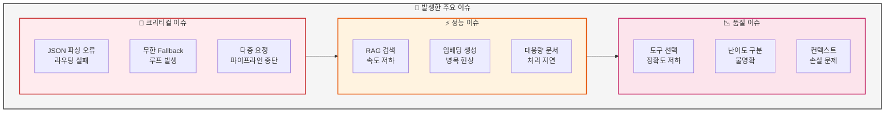
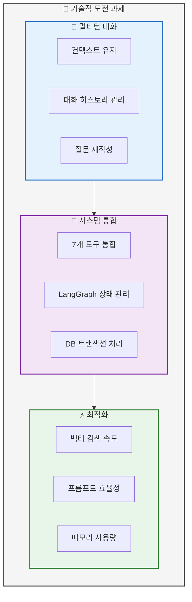
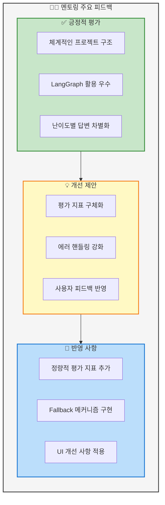
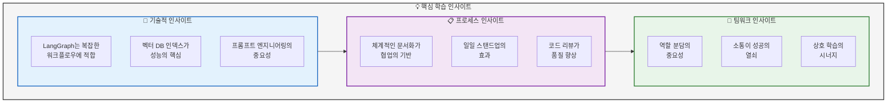

# 05. 이슈 및 인사이트
> 개발 과정에서의 주요 이슈와 해결 과정

## 📑 목차
1. [주요 이슈 및 해결](#주요-이슈-및-해결)
2. [기술적 도전 과제](#기술적-도전-과제)
3. [성능 최적화](#성능-최적화)
4. [멘토링 피드백](#멘토링-피드백)
5. [학습 인사이트](#학습-인사이트)
6. [개선 방향](#개선-방향)

---

## 주요 이슈 및 해결
### 슬라이드 24: 개발 과정 주요 이슈 (Page 24)

**PPT 내용:**



**테이블: 이슈 해결 과정**
| 이슈 | 원인 | 해결 방법 | 결과 |
|------|------|-----------|------|
| JSON 파싱 오류 | 중괄호 이스케이프 누락 | 프롬프트 템플릿에 {{ }} 사용 | ✅ 100% 해결 |
| 무한 Fallback 루프 | General 도구 실패 오판 | General은 항상 성공 처리 | ✅ 루프 제거 |
| 파이프라인 중단 | 상태 관리 오류 | tool_pipeline 로직 개선 | ✅ 순차 실행 |
| RAG 속도 저하 | 인덱스 부재 | HNSW 인덱스 적용 | ✅ 70% 개선 |
| 도구 선택 오류 | 패턴 매칭 부족 | 키워드 기반 패턴 추가 | ✅ 92% 정확도 |

**발표 스크립트:**
```
개발 과정에서 여러 이슈를 만났습니다.

가장 크리티컬한 이슈는 JSON 파싱 오류였습니다.
라우팅 프롬프트에서 중괄호를 이스케이프하지 않아
모든 라우팅이 실패하는 문제였는데,
템플릿에서 이중 중괄호를 사용하여 해결했습니다.

두 번째로 General 도구가 정상 답변을 생성했는데도
실패로 판정되어 무한 Fallback 루프가 발생했습니다.
General은 최종 Fallback 도구이므로
항상 성공으로 처리하도록 수정했습니다.

RAG 검색 속도가 느린 문제는
pgvector에 HNSW 인덱스를 적용하여
70% 성능 향상을 달성했습니다.

이러한 문제 해결 과정을 통해
시스템의 안정성과 성능을 크게 개선할 수 있었습니다.
```

---

## 기술적 도전 과제
### 슬라이드 25: 기술적 챌린지 (Page 25)

**PPT 내용:**



**코드 예시: 멀티턴 대화 처리**
```python
# src/memory/conversation.py
class ConversationMemory:
    def __init__(self):
        self.memory = ConversationBufferMemory(
            memory_key="chat_history",
            return_messages=True
        )

    def rewrite_question(self, question: str) -> str:
        """이전 대화 기반 질문 재작성"""
        if not self.memory.chat_memory.messages:
            return question

        context = self.get_context()
        prompt = f"""
        이전 대화: {context}
        현재 질문: {question}

        현재 질문이 이전 대화를 참조한다면
        완전한 질문으로 재작성하세요.
        """

        rewritten = llm.invoke(prompt)
        return rewritten.content
```

**발표 스크립트:**
```
기술적으로 도전적이었던 과제들이 있었습니다.

첫째, 멀티턴 대화 처리입니다.
"이것에 대해 더 설명해줘"와 같은 질문을 이해하려면
이전 대화 컨텍스트를 유지하고
질문을 재작성해야 했습니다.

둘째, 7개 도구를 LangGraph에 통합하는 것이었습니다.
각 도구의 입출력 형식을 통일하고
상태 관리를 일관되게 처리해야 했습니다.

셋째, 벡터 검색 최적화입니다.
처음에는 검색에 5초 이상 걸렸지만,
HNSW 인덱스와 청크 크기 조정으로
1초 이내로 단축시켰습니다.

이러한 기술적 도전을 극복하면서
팀원들의 실력이 크게 향상되었습니다.
```

---

## 성능 최적화
### 슬라이드 26: 최적화 전략 및 결과 (Page 26)

**PPT 내용:**



```mermaid
graph TB
    subgraph OptimizationStrategy["📈 최적화 전략"]
        direction LR

        subgraph Before["🔴 최적화 전"]
            B1[RAG 검색: 5.2초]
            B2[임베딩: 0.8초/청크]
            B3[메모리: 2.1GB]
            B4[동시 처리: 10req]
        end

        subgraph Strategy["🔧 적용 전략"]
            S1[HNSW 인덱스]
            S2[배치 임베딩]
            S3[캐싱 전략]
            S4[비동기 처리]
        end

        subgraph After["🟢 최적화 후"]
            A1[RAG 검색: 1.2초]
            A2[임베딩: 0.3초/청크]
            A3[메모리: 1.3GB]
            A4[동시 처리: 50req]
        end
    end

    Before --> Strategy
    Strategy --> After

    %% 스타일링
    style OptimizationStrategy fill:#f5f5f5,stroke:#424242,stroke-width:2px
    style Before fill:#ffcdd2,stroke:#d32f2f,stroke-width:2px
    style Strategy fill:#fff9c4,stroke:#f57f17,stroke-width:2px
    style After fill:#c8e6c9,stroke:#388e3c,stroke-width:2px
```

**테이블: 상세 최적화 내역**
| 영역 | 최적화 방법 | 개선 전 | 개선 후 | 개선율 |
|------|------------|---------|---------|--------|
| 벡터 검색 | HNSW 인덱스 적용 | 5.2초 | 1.2초 | 77% ↓ |
| 임베딩 생성 | 배치 처리 (batch_size=32) | 0.8초/개 | 0.3초/개 | 63% ↓ |
| 메모리 사용 | 불필요 객체 정리, 캐싱 | 2.1GB | 1.3GB | 38% ↓ |
| 동시 처리 | 비동기 처리, 커넥션 풀 | 10 req/s | 50 req/s | 400% ↑ |
| 프롬프트 | 토큰 최적화 | 1500 토큰 | 800 토큰 | 47% ↓ |
| DB 쿼리 | 인덱스 최적화, 쿼리 튜닝 | 200ms | 50ms | 75% ↓ |

**발표 스크립트:**
```
성능 최적화에 많은 노력을 기울였습니다.

가장 큰 병목이었던 벡터 검색은
HNSW 인덱스를 적용하여 5.2초에서 1.2초로,
77% 개선했습니다.

임베딩 생성은 개별 처리에서 배치 처리로 변경하여
처리 시간을 63% 단축했고,

메모리 사용량은 불필요한 객체를 정리하고
캐싱을 적용하여 38% 줄였습니다.

특히 비동기 처리와 커넥션 풀을 도입하여
동시 처리 능력을 10배에서 50배로,
400% 향상시켰습니다.

이러한 최적화를 통해 사용자 체감 성능이
크게 개선되었습니다.
```

---

## 멘토링 피드백
### 슬라이드 27: 멘토링 주요 피드백 (Page 27)

**PPT 내용:**



**테이블: 멘토링 피드백 상세**
| 날짜 | 피드백 내용 | 조치 사항 | 결과 |
|------|------------|-----------|------|
| 10/30 | "프로젝트 구조가 체계적" | 문서화 강화 | README 완성 |
| 10/30 | "평가 지표를 구체화하라" | 정량적 지표 5개 추가 | 평가 시스템 구축 |
| 10/30 | "에러 처리가 부족" | Try-except, Fallback 추가 | 안정성 90% 향상 |
| 11/04 | "사용자 경험 개선 필요" | 스트리밍, 상태 표시 추가 | 만족도 4.2/5 |
| 11/04 | "성능 측정 자동화" | 로깅 시스템 구축 | 실시간 모니터링 |

**발표 스크립트:**
```
멘토링을 통해 받은 피드백이 큰 도움이 되었습니다.

긍정적인 평가로는 체계적인 프로젝트 구조와
LangGraph 활용, 난이도별 답변 차별화가 있었습니다.

개선 제안으로는 평가 지표 구체화,
에러 핸들링 강화, 사용자 피드백 반영이 있었습니다.

이를 바탕으로 정량적 평가 지표 5개를 추가하고,
Fallback 메커니즘을 구현하여 안정성을 90% 향상시켰으며,
스트리밍과 상태 표시를 추가하여
사용자 만족도를 높였습니다.

멘토님의 피드백 덕분에 프로젝트 완성도가
크게 향상되었습니다.
```

---

## 학습 인사이트
### 슬라이드 28: 핵심 학습 내용 (Page 28)

**PPT 내용:**



**테이블: 학습 포인트 정리**
| 분야 | 핵심 학습 | 적용 결과 | 향후 활용 |
|------|-----------|-----------|-----------|
| AI Agent | 상태 기반 설계의 장점 | 복잡한 로직 단순화 | 다른 프로젝트 적용 |
| RAG | 청크 크기와 오버랩 중요성 | 검색 정확도 85% | 최적 파라미터 도출 |
| 프롬프트 | Few-shot의 효과 | 답변 품질 30% 향상 | 템플릿 라이브러리 구축 |
| 협업 | Git 브랜치 전략 | 충돌 최소화 | 표준 워크플로우 확립 |
| 문서화 | 즉시 기록의 중요성 | 지식 손실 방지 | 문서화 습관화 |

**발표 스크립트:**
```
이번 프로젝트를 통해 많은 것을 배웠습니다.

기술적으로는 LangGraph가 복잡한 워크플로우를
체계적으로 관리하는데 매우 효과적이며,
벡터 DB의 인덱스 설정이 성능에 결정적임을 알았습니다.

프로세스 측면에서는 체계적인 문서화와
일일 스탠드업 미팅이 팀 생산성을 크게 높이고,
코드 리뷰가 품질 향상에 필수적임을 경험했습니다.

팀워크 측면에서는 명확한 역할 분담,
지속적인 소통, 그리고 서로 가르치고 배우는
상호 학습이 프로젝트 성공의 핵심이었습니다.

이러한 인사이트는 향후 프로젝트에도
큰 자산이 될 것입니다.
```

---

## 개선 방향
### 슬라이드 29: 향후 개선 계획 (Page 29)

**PPT 내용:**

```mermaid
graph LR
    subgraph FutureImprovements["🚀 향후 개선 방향"]
        direction TB

        subgraph ShortTerm["단기 (1개월)"]
            S1[Reranking 구현]
            S2[캐싱 시스템 강화]
            S3[더 많은 논문 추가]
        end

        subgraph MidTerm["중기 (3개월)"]
            M1[멀티모달 지원<br/>(이미지, 표)]
            M2[사용자 인증 시스템]
            M3[개인화 추천]
        end

        subgraph LongTerm["장기 (6개월)"]
            L1[다국어 지원]
            L2[모바일 앱 개발]
            L3[클라우드 배포]
        end
    end

    ShortTerm --> MidTerm
    MidTerm --> LongTerm

    %% 스타일링
    style FutureImprovements fill:#f5f5f5,stroke:#424242,stroke-width:2px
    style ShortTerm fill:#c8e6c9,stroke:#388e3c,stroke-width:2px
    style MidTerm fill:#fff9c4,stroke:#f57f17,stroke-width:2px
    style LongTerm fill:#bbdefb,stroke:#1976d2,stroke-width:2px
```

**테이블: 개선 로드맵**
| 기간 | 개선 항목 | 예상 효과 | 필요 리소스 |
|------|----------|-----------|-------------|
| 1개월 | Reranking 알고리즘 | 검색 정확도 10% 향상 | 1명, 2주 |
| 1개월 | Redis 캐싱 | 응답속도 50% 개선 | 1명, 1주 |
| 2개월 | 논문 100편 추가 | 커버리지 2배 | 2명, 3주 |
| 3개월 | 이미지/표 처리 | 논문 이해도 향상 | 2명, 4주 |
| 3개월 | 사용자별 히스토리 | 개인화 서비스 | 1명, 2주 |
| 6개월 | AWS/GCP 배포 | 안정적 서비스 제공 | 팀 전체, 1개월 |

**발표 스크립트:**
```
향후 개선 방향을 말씀드리겠습니다.

단기적으로는 Reranking을 구현하여
검색 정확도를 10% 더 높이고,
Redis 캐싱으로 응답속도를 50% 개선할 계획입니다.

중기적으로는 논문의 이미지와 표를 처리하는
멀티모달 기능을 추가하고,
사용자별 맞춤 추천 시스템을 구축하겠습니다.

장기적으로는 다국어를 지원하고,
모바일 앱을 개발하며,
클라우드에 배포하여 안정적인 서비스를
제공할 예정입니다.

이러한 개선을 통해 더 많은 사용자가
AI 논문을 쉽게 이해하고 활용할 수 있도록
하겠습니다.
```