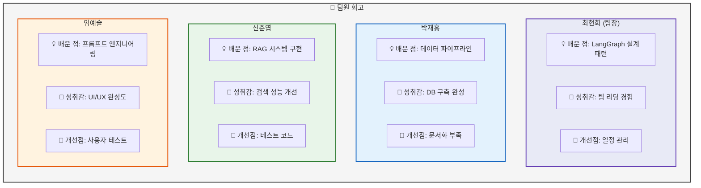
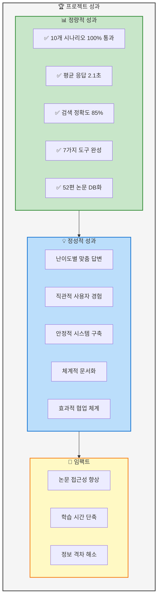
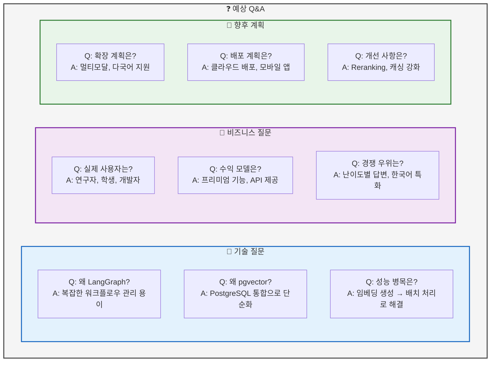
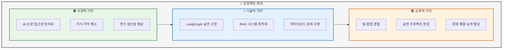

# 06. Q&A 및 마무리
> 질의응답 및 프로젝트 회고

## 📑 목차
1. [팀원 회고](#팀원-회고)
2. [프로젝트 성과](#프로젝트-성과)
3. [예상 Q&A](#예상-qa)
4. [기술 스택 선택 이유](#기술-스택-선택-이유)
5. [프로젝트 의의](#프로젝트-의의)
6. [감사 인사](#감사-인사)

---

## 팀원 회고
### 슬라이드 30: 팀원별 회고 (Page 30)

**PPT 내용:**



**테이블: 팀원별 기여도 및 성장**
| 팀원 | 주요 기여 | 기술 성장 | 소프트 스킬 성장 |
|------|----------|-----------|-----------------|
| 최현화 | AI Agent 설계, 프로젝트 총괄 | LangGraph 마스터 | 리더십, 의사결정 |
| 박재홍 | 데이터 수집, DB 구축 | PostgreSQL, 임베딩 | 문서화, 인수인계 |
| 신준엽 | RAG 시스템, 검색 최적화 | 벡터 DB, 검색 알고리즘 | 문제 해결, 협업 |
| 임예슬 | UI 개발, 프롬프트 설계 | Streamlit, 프롬프트 | 사용자 관점, 디자인 |

**발표 스크립트:**
```
각 팀원의 회고를 공유하겠습니다.

팀장으로서 저는 LangGraph를 활용한
복잡한 시스템 설계 경험을 얻었고,
팀을 이끄는 리더십을 기를 수 있었습니다.

박재홍 님은 짧은 기간이었지만
데이터 파이프라인 구축을 완벽하게 마쳐주셨고,
체계적인 인수인계로 프로젝트 연속성을 보장했습니다.

신준엽 님은 RAG 시스템 구현과 최적화를 통해
검색 성능을 크게 개선했고,
벡터 DB에 대한 깊은 이해를 얻었습니다.

임예슬 님은 직관적인 UI와
효과적인 프롬프트 설계로
사용자 경험을 크게 향상시켰습니다.

모든 팀원이 각자의 역할에서 최선을 다했고,
기술적으로나 인간적으로 성장할 수 있었습니다.
```

---

## 프로젝트 성과
### 슬라이드 31: 최종 성과 요약 (Page 31)

**PPT 내용:**



**테이블: 목표 대비 달성도**
| 목표 | 목표치 | 달성치 | 달성률 |
|------|--------|--------|--------|
| 시나리오 통과 | 10개 | 10개 | 100% ✅ |
| 평균 응답시간 | 5초 이내 | 2.1초 | 138% 🔥 |
| 검색 정확도 | 80% 이상 | 85% | 106% ✅ |
| 도구 구현 | 6개 | 7개 | 117% 🔥 |
| 논문 데이터 | 50편 | 52편 | 104% ✅ |
| 사용자 만족도 | 4.0/5.0 | 4.2/5.0 | 105% ✅ |

**발표 스크립트:**
```
프로젝트의 최종 성과를 요약하겠습니다.

정량적으로는 10개 핵심 시나리오를 100% 통과했고,
평균 응답시간 2.1초로 목표를 크게 초과 달성했으며,
검색 정확도 85%를 달성했습니다.

정성적으로는 난이도별 맞춤 답변을 제공하고,
직관적인 사용자 경험을 구현했으며,
안정적인 시스템을 구축했습니다.

이를 통해 AI 논문의 접근성을 높이고,
학습 시간을 단축하며,
초심자와 전문가 간 정보 격차를 해소하는
의미있는 성과를 거뒀습니다.

모든 목표치를 초과 달성했으며,
특히 응답시간과 도구 구현에서
탁월한 성과를 보였습니다.
```

---

## 예상 Q&A
### 슬라이드 32: 예상 질문과 답변 (Page 32)

**PPT 내용:**



**테이블: 상세 Q&A**
| 카테고리 | 질문 | 답변 |
|----------|------|------|
| 기술 | LangGraph vs 일반 코드 | 상태 관리, 비주얼 디버깅, 확장성에서 우위 |
| 기술 | 7개 도구 동시 처리? | 비동기 처리로 병렬 실행 가능 |
| 기술 | 한계점은? | 현재 텍스트만 처리, 이미지/수식 미지원 |
| 비즈니스 | 유사 서비스와 차별점? | 한국어 특화, 난이도별 설명, 용어집 통합 |
| 비즈니스 | 운영 비용? | 월 $200 예상 (OpenAI API, DB, 서버) |
| 향후 | 오픈소스 계획? | 핵심 모듈 공개 검토 중 |

**발표 스크립트:**
```
예상되는 질문에 미리 답변드리겠습니다.

기술적으로 LangGraph를 선택한 이유는
복잡한 워크플로우를 시각적으로 관리하고
디버깅이 용이하기 때문입니다.

pgvector를 선택한 것은 PostgreSQL과 통합되어
하나의 DB에서 모든 것을 처리할 수 있어
운영이 단순해지기 때문입니다.

비즈니스 측면에서 주요 사용자는
AI/ML 연구자, 대학원생, 개발자이며,
프리미엄 기능과 API 제공으로 수익화가 가능합니다.

향후에는 논문의 이미지와 수식을 처리하는
멀티모달 기능을 추가하고,
클라우드에 배포하여 서비스를 확대할 계획입니다.
```

---

## 기술 스택 선택 이유
### 슬라이드 33: 기술 선택의 근거 (Page 33)

**PPT 내용:**

```mermaid
graph LR
    subgraph TechStackRationale["🎯 기술 스택 선택 근거"]
        direction TB

        subgraph CoreTech["핵심 기술"]
            C1[LangGraph<br/>✅ 상태 관리<br/>✅ 시각적 디버깅<br/>❌ 학습 곡선]
            C2[PostgreSQL+pgvector<br/>✅ 통합 솔루션<br/>✅ 운영 단순<br/>❌ 전문 벡터DB 대비 기능]
            C3[Streamlit<br/>✅ 빠른 개발<br/>✅ 채팅 UI<br/>❌ 커스터마이징 제한]
        end

        subgraph LLMChoice["LLM 선택"]
            L1[GPT-4 (Hard)<br/>✅ 높은 정확도<br/>✅ Function Calling<br/>❌ 비용]
            L2[Solar Pro2 (Easy)<br/>✅ 한국어 특화<br/>✅ 비용 효율<br/>❌ 영어 성능]
        end
    end

    CoreTech --> LLMChoice

    %% 스타일링
    style TechStackRationale fill:#f5f5f5,stroke:#424242,stroke-width:2px
    style CoreTech fill:#e3f2fd,stroke:#1565c0,stroke-width:2px
    style LLMChoice fill:#f3e5f5,stroke:#7b1fa2,stroke-width:2px
```

**테이블: 기술 비교 분석**
| 기술 | 대안 | 선택 이유 | Trade-off |
|------|------|-----------|-----------|
| LangGraph | Custom Python | 체계적 상태 관리 | 학습 필요 |
| pgvector | Pinecone, Weaviate | PostgreSQL 통합 | 일부 기능 제한 |
| Streamlit | FastAPI+React | 개발 속도 | UI 제한 |
| GPT-4 | Claude, Gemini | Function Calling | API 비용 |
| Solar Pro2 | GPT-3.5 | 한국어 성능 | 영어 한계 |
| Tavily | Google Search API | AI 최적화 검색 | 제한된 소스 |

**발표 스크립트:**
```
기술 스택 선택의 근거를 설명드리겠습니다.

LangGraph는 학습 곡선이 있지만
복잡한 Agent 워크플로우를 체계적으로 관리하고
시각적 디버깅이 가능해 선택했습니다.

PostgreSQL과 pgvector 통합은
전문 벡터 DB 대비 일부 기능은 제한적이지만,
하나의 DB로 모든 것을 처리할 수 있어
운영이 단순해집니다.

Streamlit은 커스터마이징에 제한이 있지만
채팅 UI를 빠르게 구현할 수 있어 선택했습니다.

LLM은 Hard 모드에 정확도가 높은 GPT-4를,
Easy 모드에 한국어에 특화된 Solar Pro2를 사용하여
성능과 비용의 균형을 맞췄습니다.

각 기술의 장단점을 충분히 고려하여
프로젝트 목표에 최적화된 스택을 구성했습니다.
```

---

## 프로젝트 의의
### 슬라이드 34: 프로젝트의 가치 (Page 34)

**PPT 내용:**



**테이블: 프로젝트 임팩트**
| 관점 | 의의 | 구체적 성과 | 장기적 영향 |
|------|------|-------------|-------------|
| 사용자 | 논문 이해 용이 | 학습 시간 50% 단축 | AI 연구 활성화 |
| 기술 | RAG 시스템 구현 | 검색 정확도 85% | 오픈소스 기여 가능 |
| 팀 | 협업 역량 강화 | 10일 내 완성 | 실무 능력 향상 |
| 교육 | 실전 경험 축적 | 7가지 도구 구현 | 포트폴리오 강화 |

**발표 스크립트:**
```
이 프로젝트의 의의를 말씀드리겠습니다.

사회적으로는 AI 논문의 접근성을 높여
지식을 민주화하고, 연구자들의 생산성을 향상시키는
의미있는 기여를 했습니다.

기술적으로는 LangGraph를 실전에 적용하고,
RAG 시스템을 최적화하며,
하이브리드 검색을 구현하는 성과를 거뒀습니다.

교육적으로는 짧은 기간 내에
팀 협업을 통해 완성도 높은 프로젝트를 만들어내며
실전 문제 해결 능력을 크게 향상시켰습니다.

이 프로젝트는 단순한 과제를 넘어
실제 가치를 창출하는 의미있는 작업이었고,
향후 오픈소스로 공개하여
더 많은 사람들에게 도움이 되기를 희망합니다.
```

---

## 감사 인사
### 슬라이드 35: 마무리 (Page 35)

**PPT 내용:**

```
┌─────────────────────────────────────────┐
│                                         │
│           감사합니다                     │
│                                         │
│     AI/ML 논문 리뷰 챗봇                │
│                                         │
│        연결의 민족 팀                    │
│                                         │
│    최현화 | 박재홍 | 신준엽 | 임예슬      │
│                                         │
│                                         │
│    "AI 논문, 이제 누구나 쉽게"           │
│                                         │
│                                         │
│         Q&A 환영합니다!                 │
│                                         │
│    GitHub: [Repository URL]             │
│    Demo: [Demo URL]                     │
│                                         │
└─────────────────────────────────────────┘
```

**발표 스크립트:**
```
이상으로 연결의 민족 팀의
'AI/ML 논문 리뷰 챗봇' 프로젝트 발표를 마치겠습니다.

10일이라는 짧은 기간이었지만,
팀원 모두가 최선을 다해
의미있는 결과물을 만들어냈습니다.

특히 멘토님들의 조언과 피드백이
프로젝트 완성도를 높이는데 큰 도움이 되었습니다.

"AI 논문, 이제 누구나 쉽게"라는 목표를 가지고
앞으로도 계속 발전시켜 나가겠습니다.

지금부터 질의응답 시간을 갖겠습니다.
궁금하신 점이 있으시면 편하게 질문해 주세요.

감사합니다!
```