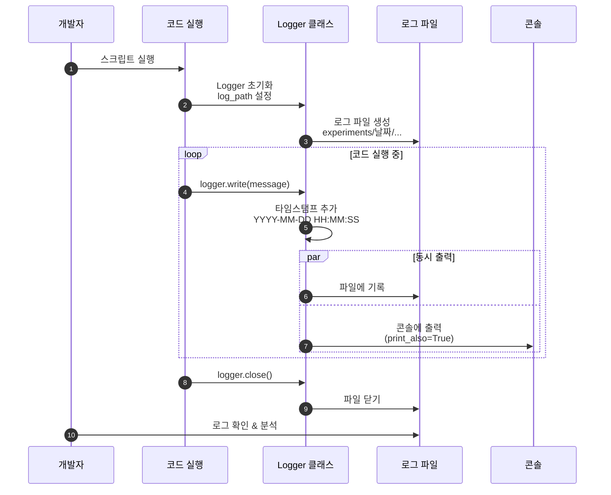

# 05. 로깅 시스템

## 문서 정보
- **작성일**: 2025-10-30
- **프로젝트명**: 논문 리뷰 챗봇 (AI Agent + RAG)
- **팀명**: 연결의 민족
- **작성자**: 최현화[팀장]

---

## 1. 로깅 시스템 개요

### 1.1 목적

- 개발 과정에서 발생하는 모든 이벤트 기록
- 실험 추적 및 디버깅 지원
- 성능 분석 및 오류 진단
- 프로젝트 진행 상황 문서화

### 1.2 로깅 흐름



**로깅 흐름 설명:**
- 개발자가 코드를 실행하면 Logger 클래스가 초기화되고 로그 파일이 생성되는 전체 프로세스를 표현
- Logger 초기화 시 experiments/날짜/ 경로에 로그 파일이 자동으로 생성
- 코드 실행 중 logger.write() 호출 시 타임스탬프가 자동으로 추가되며 파일과 콘솔에 동시 출력
- 작업 완료 후 logger.close()로 파일을 닫고, 개발자는 로그 파일을 통해 실행 과정을 분석 및 디버깅 가능

### 1.3 로깅 정책

1. **모든 챗봇 실행은 로그로 기록**
   - 실행 시작/종료 시간
   - 사용자 질문 및 난이도
   - AI Agent 도구 선택 및 실행 과정
   - 실행 결과 및 오류 메시지

2. **표준 출력 대신 Logger 사용**
   - `print()` 사용 금지
   - `logger.write()` 사용 필수

3. **로그 파일은 실험 폴더에 저장**
   - **메인 로그**: `experiments/{날짜}/{날짜}_{시간}_session_XXX/chatbot.log`
   - **도구별 로그**: `experiments/{날짜}/{날짜}_{시간}_session_XXX/tools/*.log`

---

## 2. Logger 클래스

### 2.1 위치
- **파일**: `src/utils/logger.py`
- **클래스**: `Logger`

### 2.2 주요 기능

| 기능 | 설명 |
|------|------|
| 타임스탬프 자동 추가 | 모든 로그 메시지에 `YYYY-MM-DD HH:MM:SS` 형식으로 시간 기록 |
| 파일 및 콘솔 동시 출력 | `print_also` 파라미터로 콘솔 출력 제어 |
| 표준 출력 리디렉션 | start_redirect()/stop_redirect()로 모든 print() 자동 로그 저장 |
| tqdm 지원 | tqdm_redirect()로 진행률 표시를 로그로 리디렉션 |
| 에러 색상 구분 | print_error=True로 콘솔에 빨간색 표시 |

---

## 3. 기본 사용법

### 3.1 ExperimentManager 사용 (권장)

**ExperimentManager 기능:**

| 자동 수행 작업 | 설명 |
|---------------|------|
| 폴더 생성 | experiments/YYYYMMDD/YYYYMMDD_HHMMSS_session_XXX/ 자동 생성 |
| Session ID 부여 | session_001, session_002... 자동 할당 |
| Logger 초기화 | chatbot.log 파일 자동 생성 및 Logger 초기화 |
| 서브 폴더 생성 | tools/, database/, prompts/, ui/, outputs/, evaluation/ 자동 생성 |

**사용 방식:**

| 단계 | 메서드 | 설명 |
|------|--------|------|
| 1. 초기화 | with ExperimentManager() as exp | 컨텍스트 매니저로 자동 초기화 |
| 2. 메인 로그 | exp.logger.write(message) | 메인 로그 파일에 기록 |
| 3. 도구 로그 | exp.get_tool_logger(tool_name) | 도구별 로그 파일 생성 및 기록 |
| 4. 자동 종료 | with 블록 종료 | Logger 자동으로 close() |

**구현 파일:** `src/utils/experiment_manager.py`

### 3.2 Logger 직접 사용

**Logger 초기화 파라미터:**

| 파라미터 | 타입 | 설명 |
|---------|------|------|
| log_path | str | 로그 파일 저장 경로 |
| print_also | bool | True면 콘솔에도 출력 (기본값: True) |

**로그 폴더 생성 방식:**
1. 현재 날짜: `datetime.now().strftime("%Y%m%d")` → "20251031"
2. 현재 시간: `datetime.now().strftime("%H%M%S")` → "103015"
3. 폴더 경로: `f"experiments/{today}/{today}_{time_now}_session_001"`
4. `os.makedirs(log_dir, exist_ok=True)`로 폴더 생성

**구현 파일:** `src/utils/logger.py`

### 3.3 로그 기록 메서드

**write() 메서드 파라미터:**

| 파라미터 | 타입 | 기본값 | 설명 |
|---------|------|--------|------|
| message | str | 필수 | 로그 메시지 내용 |
| print_also | bool | True | 콘솔 출력 여부 |
| print_error | bool | False | 에러 메시지 여부 (빨간색 표시) |

**사용 예시:**

| 용도 | 호출 방법 |
|------|----------|
| 일반 로그 | logger.write("VectorDB 구축 시작") |
| 파일만 저장 | logger.write("내부 디버그 정보", print_also=False) |
| 에러 메시지 | logger.write("오류: 파일 없음", print_error=True) |

### 3.4 표준 출력 리디렉션

**리디렉션 메서드:**

| 메서드 | 설명 |
|--------|------|
| start_redirect() | stdout/stderr를 로그로 리디렉션 시작 |
| stop_redirect() | 리디렉션 중지 |

**동작 방식:**
- start_redirect() 후 모든 print()와 sys.stderr 출력이 로그 파일에 자동 저장
- stop_redirect() 호출 시 일반 출력으로 복귀

---

## 4. 실전 사용 시나리오

### 4.1 챗봇 실행 로그

**로그 기록 흐름:**

| 단계 | 동작 | 기록 내용 |
|------|------|----------|
| 1. 초기화 | ExperimentManager 생성 | 폴더 및 Logger 자동 생성 |
| 2. 실행 시작 | logger.write("챗봇 실행 시작") | 시작 시간 기록 |
| 3. 질문 기록 | logger.write(f"사용자 질문: {query}") | 질문 및 난이도 기록 |
| 4. 도구 선택 | logger.write(f"선택된 도구: {tool}") | Agent 도구 선택 기록 |
| 5. 도구 실행 | tool_logger.write("도구 실행 중") | 도구별 로그 파일에 기록 |
| 6. 결과 저장 | exp.save_output('response.txt', answer) | 답변 파일로 저장 |
| 7. 완료 | logger.write("챗봇 실행 완료") | 종료 시간 기록 |

**로그 출력 형식:**
```
2025-10-31 10:30:15 | ==================================================
2025-10-31 10:30:15 | 챗봇 실행 시작
2025-10-31 10:30:15 | ==================================================
2025-10-31 10:30:15 | 사용자 질문: RAG에 대해 알려줘
2025-10-31 10:30:15 | 난이도: easy
2025-10-31 10:30:16 | AI Agent 도구 선택 중...
2025-10-31 10:30:16 | 선택된 도구: rag_paper
2025-10-31 10:30:20 | 챗봇 실행 완료
```

### 4.2 DB 쿼리 및 프롬프트 저장

**ExperimentManager 저장 메서드:**

| 메서드 | 설명 | 저장 위치 |
|--------|------|----------|
| log_sql_query() | SQL 쿼리 기록 | database/queries.sql |
| log_pgvector_search() | pgvector 검색 기록 | database/pgvector_searches.json |
| save_system_prompt() | System Prompt 저장 | prompts/system_prompt.txt |
| save_user_prompt() | User Prompt 저장 | prompts/user_prompt.txt |

### 4.3 평가 지표 저장

**평가 저장 메서드:**

| 메서드 | 저장 내용 | 파일 |
|--------|----------|------|
| save_rag_metrics() | RAG 평가 지표 (recall, precision, faithfulness) | evaluation/rag_metrics.json |
| save_agent_accuracy() | Agent 라우팅 정확도 | evaluation/agent_accuracy.json |
| save_latency_report() | 응답 시간 분석 | evaluation/latency_report.json |
| save_cost_analysis() | 비용 분석 (토큰 사용량, 비용) | evaluation/cost_analysis.json |

### 4.4 tqdm 진행률 표시

**tqdm 리디렉션 방식:**

| 단계 | 메서드 | 설명 |
|------|--------|------|
| 1. Logger 생성 | Logger(log_path) | Logger 인스턴스 생성 |
| 2. 리디렉션 설정 | logger.tqdm_redirect() | tqdm 출력을 로그로 리디렉션 |
| 3. tqdm 사용 | tqdm(iterable, desc="...") | 진행률이 로그에 기록됨 |
| 4. 종료 | logger.close() | Logger 종료 |

---

## 5. 로그 파일 위치 규칙

### 5.1 필수 디렉토리 구조

모든 로그 파일은 **experiments/날짜/날짜_시간_session_XXX/** 구조로 저장:

```
experiments/
└── 20251031/                                # 날짜 (YYYYMMDD)
    ├── 20251031_103015_session_001/         # 시간_session_ID
    │   ├── chatbot.log                      # 메인 실행 로그
    │   ├── metadata.json                    # 실험 메타데이터
    │   ├── config.yaml                      # 전체 설정
    │   │
    │   ├── tools/                           # 도구 실행 로그
    │   │   ├── rag_paper.log
    │   │   ├── rag_glossary.log
    │   │   └── web_search.log
    │   │
    │   ├── database/                        # DB 관련 기록
    │   │   ├── queries.sql
    │   │   └── pgvector_searches.json
    │   │
    │   ├── prompts/                         # 프롬프트 기록
    │   │   ├── system_prompt.txt
    │   │   └── user_prompt.txt
    │   │
    │   ├── ui/                              # UI 관련 기록
    │   │   └── streamlit_session.json
    │   │
    │   ├── outputs/                         # 생성된 결과물
    │   │   └── response.txt
    │   │
    │   └── evaluation/                      # 평가 지표
    │       ├── rag_metrics.json
    │       ├── agent_accuracy.json
    │       └── latency_report.json
    │
    └── 20251031_110234_session_002/         # 다음 실행
        └── ...
```

### 5.2 ExperimentManager 자동 생성

**자동 생성되는 항목:**

| 항목 | 설명 |
|------|------|
| 당일 폴더 | experiments/YYYYMMDD/ 폴더 확인/생성 |
| Session ID | 기존 session 확인 후 다음 번호 부여 (001, 002...) |
| 실험 폴더 | YYYYMMDD_HHMMSS_session_XXX/ 생성 |
| 서브 폴더 | tools, database, prompts, ui, outputs, evaluation 생성 |
| 메타데이터 | metadata.json 초기화 |
| 메인 로그 | chatbot.log 생성 |

### 5.3 Session ID 자동 부여

**Session ID 규칙:**

| 항목 | 설명 |
|------|------|
| 형식 | session_001, session_002, session_003... |
| 부여 방식 | 당일 폴더의 기존 session 확인 후 다음 번호 |
| 시작 번호 | 매일 001부터 시작 |
| 예시 | 20251031_103015_session_001, 20251031_110234_session_002 |

---

## 6. Logger 클래스 API

### 6.1 주요 메서드

| 메서드 | 파라미터 | 설명 |
|--------|---------|------|
| write(message, print_also, print_error) | message: str<br/>print_also: bool=True<br/>print_error: bool=False | 로그 메시지 기록 |
| start_redirect() | 없음 | stdout/stderr를 로그로 리디렉션 |
| stop_redirect() | 없음 | 리디렉션 중지 |
| tqdm_redirect() | 없음 | tqdm 출력을 로그로 리디렉션 |
| flush() | 없음 | 버퍼 플러시 |
| close() | 없음 | 로그 파일 닫기 (필수) |

### 6.2 생성자 파라미터

**Logger(log_path, print_also=True)**

| 파라미터 | 타입 | 설명 |
|---------|------|------|
| log_path | str | 로그 파일 저장 경로 |
| print_also | bool | True면 파일과 콘솔에 동시 출력 (기본값: True) |

---

## 7. 주의사항

### 7.1 필수 규칙

| 규칙 | 설명 |
|------|------|
| Logger 종료 필수 | 작업 완료 후 반드시 logger.close() 호출 |
| print 사용 금지 | print() 대신 logger.write() 사용 |
| 폴더 경로 확인 | 로그 파일 저장 전 os.makedirs(log_dir, exist_ok=True) |
| 빈 메시지 자동 무시 | 빈 문자열이나 공백만 있는 메시지는 기록 안됨 |

### 7.2 사용 예시 비교

**❌ 잘못된 예:**
- `print("VectorDB 구축 시작")`
- Logger 종료 없이 프로그램 종료
- 폴더 생성 없이 로그 파일 작성

**✅ 올바른 예:**
- `logger.write("VectorDB 구축 시작")`
- `logger.close()` 호출 또는 `with ExperimentManager()` 사용
- `os.makedirs(log_dir, exist_ok=True)` 후 로그 파일 생성

---

## 8. 로그 분석

### 8.1 로그 파일 찾기 (Bash 명령어)

**유지 가능 (명령어만):**

| 명령어 | 설명 |
|--------|------|
| ls experiments/20251031/ | 특정 날짜의 모든 세션 보기 |
| ls -lt experiments/20251031/ \| head -5 | 최신 세션 찾기 |
| ls experiments/20251031/ \| grep "session_001" | Session ID로 검색 |

### 8.2 로그 내용 확인 (Bash 명령어)

| 명령어 | 설명 |
|--------|------|
| cat experiments/.../chatbot.log | 메인 로그 전체 보기 |
| tail -20 experiments/.../chatbot.log | 마지막 20줄만 보기 |
| tail -f experiments/.../chatbot.log | 실시간 모니터링 |
| cat experiments/.../tools/rag_paper.log | 도구별 로그 확인 |
| grep "오류" experiments/\*/chatbot.log | 특정 키워드 검색 |

---

## 9. 로그 활용

### 9.1 디버깅 (Bash 명령어)

| 명령어 | 설명 |
|--------|------|
| grep -i "error\|오류" experiments/\*/chatbot.log | 오류 메시지만 필터링 |
| grep -i "error" experiments/.../chatbot.log | 특정 세션의 오류 찾기 |
| grep -i "오류" experiments/\*/tools/\*.log | 모든 도구 로그에서 오류 찾기 |

### 9.2 성능 분석

**로그 파일 분석 방법:**

| 분석 항목 | 방법 |
|----------|------|
| 실행 시간 계산 | 로그에서 첫 타임스탬프와 마지막 타임스탬프 추출 후 차이 계산 |
| 타임스탬프 추출 | 정규표현식: `r'(\d{4}-\d{2}-\d{2} \d{2}:\d{2}:\d{2})'` |
| 날짜 파싱 | datetime.strptime(timestamp, '%Y-%m-%d %H:%M:%S') |

---

## 10. 참고 문서

- [실험_폴더_구조_최종안.md](../references/실험_폴더_구조_최종안.md) - 전체 폴더 구조 상세 가이드
- [06_실험_추적_관리.md](06_실험_추적_관리.md) - ExperimentManager 사용법
- [담당역할_06_로깅_모니터링.md](../roles/담당역할_06_로깅_모니터링.md) - Logger 및 ExperimentManager 구현
- Python logging 모듈: https://docs.python.org/3/library/logging.html
