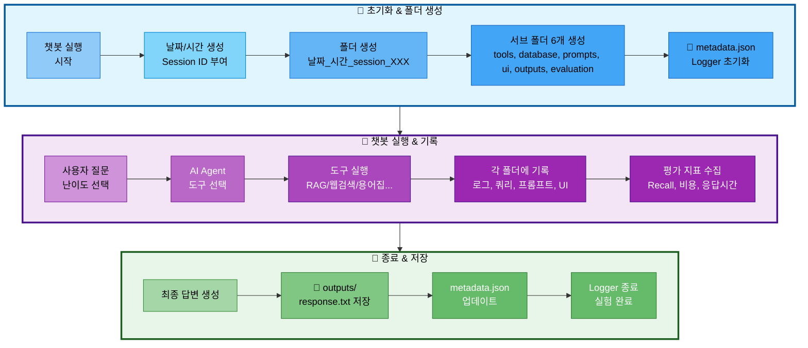

# 06. 실험 추적 관리

## 문서 정보
- **작성일**: 2025-10-30
- **프로젝트명**: 논문 리뷰 챗봇 (AI Agent + RAG)
- **팀명**: 연결의 민족
- **작성자**: 최현화[팀장]

---

## 1. 실험 폴더 구조

### 1.1 실험 폴더 생성 흐름



**실험 폴더 생성 흐름 설명:**
- **초기화 단계**: 챗봇 실행 시 자동으로 Session ID 부여 (session_001, 002...) → 폴더 및 서브 폴더 6개 생성 → metadata.json과 Logger 초기화
- **실행 단계**: 사용자 질문 입력 및 난이도 선택 → AI Agent가 적절한 도구 선택 (RAG, 웹검색, 용어집 등) → 실행 과정을 각 폴더에 기록 (도구 로그, DB 쿼리, 프롬프트, UI 인터랙션) → 평가 지표 수집 (Recall@K, 비용, 응답시간)
- **종료 단계**: 최종 답변 생성 → outputs/response.txt 저장 → metadata.json 업데이트 → Logger 종료 및 실험 완료

### 1.2 필수 폴더 구조

모든 챗봇 실행 결과는 `experiments/날짜/날짜_시간_session_XXX/` 구조로 저장:

```
experiments/
└── 20251031/                                # 날짜 (YYYYMMDD)
    └── 20251031_103015_session_001/         # 시간_session_ID
        │
        ├── metadata.json                    # ⭐ 전체 실험 메타데이터
        ├── chatbot.log                      # 메인 실행 로그
        ├── config.yaml                      # 전체 설정
        │
        ├── tools/                           # 🔧 도구 실행 로그
        │   ├── rag_paper.log                # 논문 검색 로그
        │   ├── rag_glossary.log             # 용어집 검색 로그
        │   ├── web_search.log               # 웹 검색 로그
        │   ├── summary_paper.log            # 논문 요약 로그
        │   ├── file_save.log                # 파일 저장 로그
        │   └── general.log                  # 일반 답변 로그
        │
        ├── database/                        # 🗄️ DB 관련 기록
        │   ├── queries.sql                  # 실행된 SQL 쿼리 모음
        │   ├── pgvector_searches.json       # pgvector 검색 기록
        │   ├── search_results.json          # DB 검색 결과
        │   └── db_performance.json          # 쿼리 실행 시간 등
        │
        ├── prompts/                         # 💬 프롬프트 기록
        │   ├── system_prompt.txt            # 사용된 시스템 프롬프트
        │   ├── user_prompt.txt              # 사용자 질문 + 컨텍스트
        │   ├── final_prompt.txt             # LLM에 전달된 최종 프롬프트
        │   └── prompt_template.yaml         # 프롬프트 템플릿 정보
        │
        ├── ui/                              # 🖥️ UI 관련 기록
        │   ├── streamlit_session.json       # Streamlit 세션 상태
        │   ├── user_interactions.log        # 사용자 인터랙션 로그
        │   └── ui_events.json               # UI 이벤트 기록
        │
        ├── outputs/                         # 📄 생성된 결과물
        │   ├── response.txt                 # 최종 답변
        │   ├── summary.md                   # 요약본 (있을 경우)
        │   └── saved_file.txt               # 사용자가 저장 요청한 파일
        │
        ├── evaluation/                      # 📊 평가 지표
        │   ├── rag_metrics.json             # RAG 평가 지표
        │   ├── agent_accuracy.json          # Agent 정확도
        │   ├── latency_report.json          # 응답 시간 분석
        │   ├── cost_analysis.json           # 비용 분석
        │   └── test_results.json            # 테스트 결과
        │
        └── debug/                           # 🐛 디버그 정보 (선택)
            ├── agent_trace.json             # Agent 실행 추적
            ├── llm_tokens.json              # 토큰 사용량
            └── error_trace.log              # 에러 발생 시 스택 트레이스
```

### 1.3 metadata.json (핵심 메타데이터)

각 실험의 핵심 정보를 한 곳에 요약:

```json
{
  "session_id": "001",
  "start_time": "2025-10-31T10:30:15",
  "end_time": "2025-10-31T10:32:45",
  "difficulty": "easy",
  "tool_used": "rag_paper",
  "user_query": "RAG에 대해 알려줘",
  "success": true,
  "response_time_ms": 2500,
  "response_length": 450,
  "model": "gpt-5",
  "temperature": 0.7,
  "tokens_used": {
    "prompt": 1200,
    "completion": 800,
    "total": 2000
  },
  "db_queries_count": 4,
  "db_total_time_ms": 120
}
```

---

## 2. Session ID 자동 부여 규칙

### 2.1 자동 생성 방식

챗봇 실행 시마다 **Session ID가 자동으로 부여**됩니다:

- **형식**: `session_001`, `session_002`, `session_003` ...
- **부여 방식**: 당일 날짜 기준으로 순차적으로 증가
- **시작 번호**: 매일 `001`부터 시작

### 2.2 예시

```
experiments/20251031/
├── 20251031_103015_session_001/   # 오늘 첫 번째 실행
├── 20251031_110234_session_002/   # 오늘 두 번째 실행
└── 20251031_143520_session_003/   # 오늘 세 번째 실행

experiments/20251101/
└── 20251101_090012_session_001/   # 다음 날, 다시 001부터 시작
```

### 2.3 중복 방지

ExperimentManager 클래스가 자동으로:
1. 당일 폴더(`experiments/20251031/`) 스캔
2. 기존 session 폴더 확인
3. 가장 큰 번호 + 1로 새 session ID 부여

---

## 3. ExperimentManager 사용법

### 3.1 기본 사용 (자동 폴더 생성)

**사용 방법**: with 문으로 ExperimentManager를 초기화하여 자동으로 실험 폴더 생성 및 종료 처리

| 단계 | 동작 | 설명 |
|------|------|------|
| 1. 초기화 | with ExperimentManager() as exp | Context manager로 자동 초기화 |
| 2. 폴더 생성 | 자동 | experiments/날짜/날짜_시간_session_XXX/ 생성 |
| 3. 서브 폴더 생성 | 자동 | tools, database, prompts, ui, outputs, evaluation 생성 |
| 4. 메타데이터 초기화 | 자동 | metadata.json 파일 생성 |
| 5. Logger 초기화 | 자동 | 메인 Logger 생성 |
| 6. 로그 기록 | exp.logger.write("메시지") | 메인 로그에 기록 |
| 7. 메타데이터 업데이트 | exp.update_metadata(user_query, difficulty) | 실험 정보 업데이트 |
| 8. 종료 | 자동 (with 블록 종료 시) | Logger 종료 및 리소스 정리 |

**주요 메서드:**

| 메서드 | 파라미터 | 설명 |
|--------|----------|------|
| `ExperimentManager()` | 없음 | ExperimentManager 인스턴스 생성 |
| `logger.write(message)` | message: str | 메인 로그에 메시지 기록 |
| `update_metadata(**kwargs)` | user_query, difficulty 등 | metadata.json 업데이트 |

### 3.2 도구별 Logger 사용

**사용 방법**: 각 도구별로 독립적인 Logger를 생성하여 tools/ 폴더에 개별 로그 파일 생성

| 메서드 | 파라미터 | 설명 |
|--------|----------|------|
| `get_tool_logger(tool_name)` | tool_name: str | 도구별 독립 Logger 생성 |
| `tool_logger.write(message)` | message: str | 해당 도구 로그 파일에 기록 |
| `tool_logger.close()` | 없음 | Logger 종료 및 파일 닫기 |

**지원되는 도구 이름:**

| 도구 이름 | 로그 파일 | 설명 |
|-----------|----------|------|
| `rag_paper` | tools/rag_paper.log | 논문 검색 로그 |
| `rag_glossary` | tools/rag_glossary.log | 용어집 검색 로그 |
| `web_search` | tools/web_search.log | 웹 검색 로그 |
| `summary_paper` | tools/summary_paper.log | 논문 요약 로그 |
| `file_save` | tools/file_save.log | 파일 저장 로그 |
| `general` | tools/general.log | 일반 답변 로그 |

### 3.3 DB 쿼리 기록

**사용 방법**: DB 관련 작업을 database/ 폴더에 기록

| 메서드 | 파라미터 | 설명 |
|--------|----------|------|
| `log_sql_query()` | query, description, tool, execution_time_ms | SQL 쿼리 실행 기록 (database/queries.sql에 추가) |
| `log_pgvector_search()` | search_info (dict) | pgvector 검색 기록 (database/pgvector_searches.json에 추가) |
| `save_search_results()` | tool_name, results (dict) | DB 검색 결과 저장 (database/search_results.json에 저장) |

**log_sql_query 파라미터:**

| 파라미터 | 타입 | 설명 |
|---------|------|------|
| query | str | 실행된 SQL 쿼리문 |
| description | str | 쿼리 설명 (예: "논문 메타데이터 조회") |
| tool | str | 실행한 도구 이름 |
| execution_time_ms | int | 쿼리 실행 시간 (밀리초) |

**log_pgvector_search 파라미터 (dict):**

| 키 | 타입 | 설명 |
|----|------|------|
| tool | str | 도구 이름 |
| collection | str | 컬렉션 이름 (예: "paper_chunks") |
| query_text | str | 검색 질문 |
| top_k | int | 반환 문서 수 |
| execution_time_ms | int | 검색 실행 시간 |

### 3.4 프롬프트 저장

**사용 방법**: 프롬프트 관련 정보를 prompts/ 폴더에 저장

| 메서드 | 파라미터 | 저장 파일 | 설명 |
|--------|----------|-----------|------|
| `save_system_prompt()` | system_prompt, metadata | prompts/system_prompt.txt | 시스템 프롬프트 저장 |
| `save_user_prompt()` | user_prompt, metadata | prompts/user_prompt.txt | 사용자 프롬프트 저장 (질문 + 컨텍스트) |
| `save_final_prompt()` | final_prompt | prompts/final_prompt.txt | LLM에 전달된 최종 프롬프트 저장 |
| `save_prompt_template()` | template_info (dict) | prompts/prompt_template.yaml | 프롬프트 템플릿 정보 저장 |

**메타데이터 예시:**

| 메서드 | 메타데이터 예시 |
|--------|----------------|
| save_system_prompt | {"난이도": "easy", "템플릿": "EASY_SYSTEM_PROMPT"} |
| save_user_prompt | {"검색 결과 수": 5} |
| save_prompt_template | {"difficulty": "easy", "llm_config": {"model": "solar-pro2", "temperature": 0.7}} |

### 3.5 UI 인터랙션 기록

**사용 방법**: Streamlit UI 인터랙션을 ui/ 폴더에 기록

| 메서드 | 파라미터 | 저장 파일 | 설명 |
|--------|----------|-----------|------|
| `log_ui_interaction()` | message: str | ui/user_interactions.log | 사용자 인터랙션 로그 기록 |
| `log_ui_event()` | event_info (dict) | ui/ui_events.json | UI 이벤트 기록 |
| `save_streamlit_session()` | session_info (dict) | ui/streamlit_session.json | Streamlit 세션 상태 저장 |

**인터랙션 로그 예시:**

| 로그 메시지 | 의미 |
|------------|------|
| "페이지 접속" | 사용자가 챗봇 페이지 접속 |
| "난이도 선택: easy" | 난이도 선택 위젯 변경 |
| "질문 입력: RAG에 대해 알려줘" | 질문 입력 완료 |

**UI 이벤트 정보 (dict):**

| 키 | 타입 | 설명 |
|----|------|------|
| event_type | str | 이벤트 타입 (예: "difficulty_changed") |
| old_value | any | 변경 전 값 |
| new_value | any | 변경 후 값 |

**Streamlit 세션 정보 (dict):**

| 키 | 타입 | 설명 |
|----|------|------|
| session_id | str | Streamlit 세션 ID |
| messages | list | 대화 메시지 히스토리 |

### 3.6 평가 지표 저장

**사용 방법**: 평가 지표를 evaluation/ 폴더에 JSON 형식으로 저장

| 메서드 | 파라미터 | 저장 파일 | 설명 |
|--------|----------|-----------|------|
| `save_rag_metrics()` | metrics (dict) | evaluation/rag_metrics.json | RAG 평가 지표 저장 |
| `save_agent_accuracy()` | accuracy (dict) | evaluation/agent_accuracy.json | Agent 정확도 저장 |
| `save_latency_report()` | latency (dict) | evaluation/latency_report.json | 응답 시간 분석 저장 |
| `save_cost_analysis()` | cost (dict) | evaluation/cost_analysis.json | 비용 분석 저장 |

**RAG 평가 지표 (dict) 예시:**

| 키 | 설명 |
|----|------|
| retrieval_metrics | 검색 지표 (Recall@K 등) |
| generation_metrics | 생성 지표 (Faithfulness 등) |

**Agent 정확도 (dict) 예시:**

| 키 | 설명 |
|----|------|
| routing_decision | 라우팅 결정 정확도 (predicted_tool, correct) |

**응답 시간 분석 (dict) 예시:**

| 키 | 설명 |
|----|------|
| total_latency | 전체 응답 시간 (total_time_ms, status) |

**비용 분석 (dict) 예시:**

| 키 | 설명 |
|----|------|
| llm_usage | LLM 사용량 (total_tokens) |
| cost_breakdown_krw | 비용 상세 (total_cost) |

### 3.7 결과물 저장

**사용 방법**: 최종 답변 및 생성 결과물을 outputs/ 폴더에 저장

| 메서드 | 파라미터 | 설명 |
|--------|----------|------|
| `save_output()` | filename, content | outputs/ 폴더에 파일 저장 |

**주요 결과물:**

| 파일명 | 내용 | 생성 시점 |
|--------|------|----------|
| response.txt | 최종 답변 | 항상 생성 |
| summary.md | 논문 요약본 | 요약 도구 사용 시 |
| saved_file.txt | 사용자 저장 요청 파일 | 파일 저장 도구 사용 시 |

---

## 4. 저장되는 파일 및 폴더

### 4.1 최상위 필수 파일

| 파일명 | 설명 | 생성 방법 |
|--------|------|----------|
| **metadata.json** | 실험 핵심 정보 요약 | `exp.update_metadata()` |
| **chatbot.log** | 메인 실행 로그 | `exp.logger.write()` |
| **config.yaml** | 전체 설정 정보 | `exp.save_config()` |

### 4.2 tools/ 폴더 (도구별 로그)

| 파일명 | 설명 | 생성 시점 |
|--------|------|----------|
| `rag_paper.log` | 논문 검색 로그 | rag_paper 도구 실행 시 |
| `rag_glossary.log` | 용어집 검색 로그 | rag_glossary 도구 실행 시 |
| `web_search.log` | 웹 검색 로그 | web_search 도구 실행 시 |
| `summary_paper.log` | 논문 요약 로그 | summary_paper 도구 실행 시 |
| `file_save.log` | 파일 저장 로그 | file_save 도구 실행 시 |
| `general.log` | 일반 답변 로그 | general 도구 실행 시 |

**특징**: 실행된 도구만 로그 파일 생성 (빈 파일 없음)

### 4.3 database/ 폴더 (DB 관련)

| 파일명 | 설명 | 내용 |
|--------|------|------|
| `queries.sql` | 실행된 SQL 쿼리 모음 | 시간순 SQL 쿼리 + 설명 |
| `pgvector_searches.json` | pgvector 검색 기록 | 임베딩, 검색 타입, 결과 수 등 |
| `search_results.json` | DB 검색 결과 | 논문/용어 상세 정보 |
| `db_performance.json` | 쿼리 실행 시간 등 | 쿼리별 성능 분석 |

### 4.4 prompts/ 폴더 (프롬프트)

| 파일명 | 설명 | 내용 |
|--------|------|------|
| `system_prompt.txt` | 시스템 프롬프트 | Easy/Hard 난이도별 프롬프트 |
| `user_prompt.txt` | 사용자 프롬프트 | 질문 + 검색된 컨텍스트 |
| `final_prompt.txt` | 최종 프롬프트 | LLM에 전달된 전체 프롬프트 |
| `prompt_template.yaml` | 템플릿 정보 | LLM 설정, 토큰 수 등 |

### 4.5 ui/ 폴더 (Streamlit UI)

| 파일명 | 설명 | 내용 |
|--------|------|------|
| `streamlit_session.json` | 세션 상태 | 메시지 히스토리, 위젯 상태 |
| `user_interactions.log` | 인터랙션 로그 | 클릭, 입력 등 사용자 행동 |
| `ui_events.json` | UI 이벤트 | 이벤트 타임라인 |

### 4.6 outputs/ 폴더 (결과물)

| 파일명 | 설명 | 생성 시점 |
|--------|------|----------|
| `response.txt` | 최종 답변 | 항상 생성 |
| `summary.md` | 논문 요약본 | 요약 도구 사용 시 |
| `saved_file.txt` | 저장 요청 파일 | 파일 저장 도구 사용 시 |

### 4.7 evaluation/ 폴더 (평가 지표)

| 파일명 | 설명 | 주요 지표 |
|--------|------|----------|
| `rag_metrics.json` | RAG 평가 | Recall@K, Precision, Faithfulness |
| `agent_accuracy.json` | Agent 정확도 | 도구 선택 정확도, 실행 흐름 |
| `latency_report.json` | 응답 시간 | p50/p95/p99, 병목 분석 |
| `cost_analysis.json` | 비용 분석 | 토큰 사용량, USD/KRW 비용 |
| `test_results.json` | 테스트 결과 | 시나리오별 성공/실패 |

### 4.8 debug/ 폴더 (선택 사항)

| 파일명 | 설명 | 생성 시점 |
|--------|------|----------|
| `agent_trace.json` | Agent 실행 추적 | 디버깅 필요 시 |
| `llm_tokens.json` | 토큰 사용량 | 비용 상세 분석 시 |
| `error_trace.log` | 에러 스택 트레이스 | 에러 발생 시 |

---

## 5. 실험 검색 및 분석

### 5.1 메타데이터 기반 검색

**검색 기능**: `scripts/find_experiments.py` 스크립트를 사용하여 metadata.json 기반으로 실험 검색

**검색 함수**: `find_experiments(**kwargs)`

| 파라미터 | 타입 | 설명 | 예시 |
|---------|------|------|------|
| difficulty | str | 난이도 기준 검색 | "easy", "hard" |
| tool | str | 사용된 도구 기준 검색 | "rag_paper", "web_search" |
| date | str | 날짜 기준 검색 | "20251031" |
| min_response_time | int | 최소 응답 시간 (밀리초) | 5000 |
| max_response_time | int | 최대 응답 시간 (밀리초) | 3000 |

**검색 예시:**

| 검색 조건 | 설명 |
|----------|------|
| difficulty="easy" | 난이도 easy로 설정된 실험 검색 |
| tool="rag_paper" | rag_paper 도구를 사용한 실험 검색 |
| date="20251031" | 2025년 10월 31일 실험 검색 |
| max_response_time=3000 | 응답 시간 3초 이하 실험 검색 |
| min_response_time=5000 | 응답 시간 5초 이상 실험 검색 |

**복합 조건 검색**: 여러 파라미터를 조합하여 필터링 가능

| 조건 조합 | 설명 |
|----------|------|
| difficulty="easy", tool="rag_paper" | easy 난이도 + rag_paper 도구 |
| difficulty="easy", min_response_time=2000, max_response_time=5000 | easy 난이도 + 응답 시간 2~5초 |

### 5.2 평가 지표 집계

**집계 함수**: `aggregate_metrics(date: str)`

**동작 방식:**

| 단계 | 동작 | 설명 |
|------|------|------|
| 1 | 폴더 스캔 | experiments/{date}/ 내 모든 session 폴더 탐색 |
| 2 | 지표 파일 읽기 | 각 session의 evaluation/rag_metrics.json 읽기 |
| 3 | 데이터 수집 | 모든 지표를 리스트에 수집 |
| 4 | 평균 계산 | Recall@5, Faithfulness 등 평균 계산 |
| 5 | 결과 반환 | 총 세션 수, 평균 지표 반환 |

**반환 정보:**

| 키 | 설명 |
|----|------|
| total_sessions | 총 실험 세션 개수 |
| avg_recall_at_5 | Recall@5 평균 (검색 성능) |
| avg_faithfulness | Faithfulness 평균 (답변 충실도) |

**사용 시나리오:**
- 특정 날짜의 전체 실험 성능 분석
- 여러 날짜 간 성능 비교
- 평가 지표 트렌드 분석

---

## 6. 참고 문서

- [실험_폴더_구조_최종안.md](../references/실험_폴더_구조_최종안.md) - 전체 폴더 구조 상세 가이드
- [05_로깅_시스템.md](05_로깅_시스템.md) - Logger 클래스 사용법
- [09_평가_기준.md](09_평가_기준.md) - RAG, Agent, DB 평가 지표
- [담당역할_06_로깅_모니터링.md](../roles/담당역할_06_로깅_모니터링.md) - ExperimentManager 구현 담당
