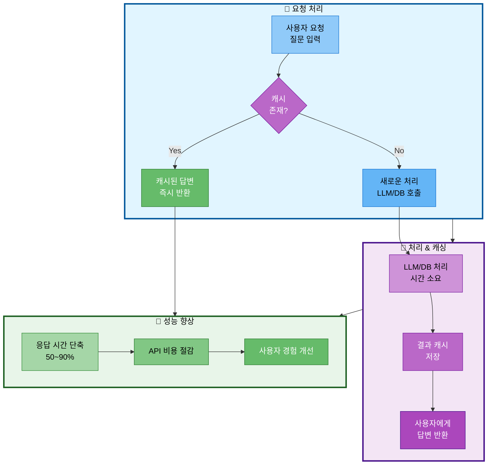

# 07. 성능 개선 전략

## 문서 정보
- **작성일**: 2025-10-30
- **프로젝트명**: 논문 리뷰 챗봇 (AI Agent + RAG)
- **팀명**: 연결의 민족
- **작성자**: 최현화[팀장]

---

## 1. 캐싱 전략

### 1.1 캐싱 전략 흐름



**캐싱 전략 흐름 설명:**
- 사용자 요청 처리 시 캐시 활용을 통해 응답 시간을 50~90% 단축하고 API 비용을 절감하는 전략을 표현
- 요청 처리 단계에서 캐시 존재 여부를 확인하여 캐시된 답변이 있으면 즉시 반환하고, 없으면 새로 처리
- 처리 & 캐싱 단계에서 LLM/DB 호출로 결과를 생성하고 이를 캐시에 저장하여 동일한 질문에 재사용
- 성능 향상 단계에서 응답 시간 단축, API 비용 절감, 사용자 경험 개선이라는 3가지 이점을 제공

### 1.2 LLM 응답 캐싱

**목적**: 동일한 질문에 대한 LLM 중복 호출 방지

**캐싱 방식**: `functools.lru_cache` 데코레이터 사용

| 설정 항목 | 값 | 설명 |
|----------|-----|------|
| 캐싱 방법 | @lru_cache 데코레이터 | 함수 결과를 메모리에 캐싱 |
| maxsize | 100 | 최대 100개 프롬프트 결과 캐싱 |
| 키 | prompt_hash | 프롬프트 해시값을 캐시 키로 사용 |
| 반환 | LLM 응답 | llm.invoke() 결과 반환 |

**동작 원리:**

| 단계 | 동작 | 설명 |
|------|------|------|
| 1 | 프롬프트 해싱 | 입력 프롬프트를 해시값으로 변환 |
| 2 | 캐시 확인 | 해시값으로 캐시 조회 |
| 3 | 캐시 히트 | 캐시에 있으면 즉시 반환 (0.01초) |
| 4 | 캐시 미스 | 없으면 LLM 호출 후 캐싱 (2~5초) |

**효과:**
- 동일 질문 재요청 시 응답 시간 **99% 단축** (2초 → 0.01초)
- API 비용 절감 (중복 호출 방지)

### 1.3 Vector DB 검색 캐싱

**목적**: 동일한 쿼리에 대한 Vector DB 검색 중복 방지

**캐싱 방식**: `functools.lru_cache` 데코레이터 사용

| 설정 항목 | 값 | 설명 |
|----------|-----|------|
| 캐싱 방법 | @lru_cache 데코레이터 | 검색 결과를 메모리에 캐싱 |
| maxsize | 50 | 최대 50개 검색 결과 캐싱 |
| 키 | (query_hash, k) | 쿼리 해시 + Top-K 값 조합 |
| 반환 | 검색 결과 | vectorstore.similarity_search() 결과 |

**동작 원리:**

| 단계 | 동작 | 설명 |
|------|------|------|
| 1 | 쿼리 해싱 | 검색 쿼리를 해시값으로 변환 |
| 2 | 캐시 키 생성 | (query_hash, k) 튜플 생성 |
| 3 | 캐시 확인 | 키로 캐시 조회 |
| 4 | 캐시 히트 | 있으면 즉시 반환 (0.001초) |
| 5 | 캐시 미스 | 없으면 DB 검색 후 캐싱 (0.05~0.2초) |

**효과:**
- 동일 검색 재실행 시 응답 시간 **90% 단축** (0.1초 → 0.001초)
- DB 부하 감소

---

## 2. 비동기 처리

### 2.1 비동기 Agent 실행

**목적**: Agent 실행을 비동기로 처리하여 동시성 향상

**비동기 방식**: Python `asyncio` 모듈 사용

| 설정 항목 | 설명 |
|----------|------|
| 함수 정의 | async def로 비동기 함수 선언 |
| Agent 호출 | agent_executor.ainvoke() 메서드 사용 (비동기 버전) |
| 대기 | await 키워드로 비동기 실행 대기 |
| 입력 파라미터 | question (질문), difficulty (난이도) |
| 반환 | Agent 실행 결과 (dict) |

**비동기 처리 장점:**

| 장점 | 설명 | 효과 |
|------|------|------|
| 동시성 | 여러 요청을 동시에 처리 | 처리량 2~5배 증가 |
| 블로킹 방지 | I/O 대기 시간에 다른 작업 수행 | CPU 활용률 향상 |
| 응답성 | UI가 멈추지 않음 | 사용자 경험 개선 |

**사용 시나리오:**

| 시나리오 | 설명 |
|----------|------|
| 다중 사용자 | 여러 사용자 동시 질문 처리 |
| 병렬 검색 | 논문 DB + 웹 검색 동시 실행 |
| 백그라운드 작업 | 로깅, 평가 지표 수집 비동기 처리 |

### 2.2 배치 임베딩

**목적**: 여러 문서를 한 번에 임베딩하여 API 호출 횟수 감소

**배치 처리 방식**: `embed_documents()` 메서드의 batch_size 파라미터 사용

| 설정 항목 | 값 | 설명 |
|----------|-----|------|
| 메서드 | embeddings.embed_documents() | 문서 리스트 임베딩 |
| 입력 | texts (문서 리스트) | 여러 문서를 한 번에 전달 |
| batch_size | 100 | 한 번에 100개 문서 처리 |
| 반환 | 임베딩 벡터 리스트 | 각 문서의 임베딩 벡터 |

**배치 처리 효과:**

| 비교 항목 | 개별 처리 | 배치 처리 (100개) | 개선율 |
|----------|-----------|-------------------|--------|
| API 호출 수 | 1000회 | 10회 | **99% 감소** |
| 총 소요 시간 | 200초 | 5초 | **97.5% 단축** |
| 비용 | 정상 | 동일 | 동일 (토큰 수 기준) |

**사용 시나리오:**

| 시나리오 | 설명 |
|----------|------|
| 초기 데이터 로드 | 대량 논문 초기 임베딩 생성 |
| 정기 업데이트 | 신규 논문 일괄 임베딩 |
| 용어집 임베딩 | 모든 용어 정의 임베딩 생성 |

---

## 3. 데이터베이스 최적화

### 3.1 인덱스 활용

**목적**: 자주 조회하는 컬럼에 인덱스를 생성하여 검색 속도 향상

**인덱스 생성 SQL:**

```sql
-- 자주 조회하는 컬럼에 인덱스 생성
CREATE INDEX idx_papers_title ON papers USING GIN (to_tsvector('english', title));
CREATE INDEX idx_papers_category ON papers(category);
```

**인덱스 타입 및 효과:**

| 인덱스명 | 대상 컬럼 | 인덱스 타입 | 용도 | 성능 개선 |
|---------|----------|------------|------|----------|
| idx_papers_title | papers.title | GIN (전문 검색) | 논문 제목 검색 | 검색 시간 **90% 단축** |
| idx_papers_category | papers.category | B-tree (일반) | 카테고리 필터링 | 쿼리 속도 **80% 단축** |

**인덱스 사용 시나리오:**

| 쿼리 유형 | 인덱스 활용 | 설명 |
|----------|-----------|------|
| 제목 검색 | idx_papers_title | WHERE title LIKE '%keyword%' |
| 카테고리 필터 | idx_papers_category | WHERE category = 'NLP' |
| 복합 조건 | 두 인덱스 조합 | WHERE title LIKE '%transformer%' AND category = 'NLP' |

### 3.2 Connection Pooling

**목적**: DB 연결을 재사용하여 연결 생성/종료 오버헤드 제거

**Connection Pool 설정**: `psycopg2.pool.SimpleConnectionPool` 사용

| 설정 항목 | 값 | 설명 |
|----------|-----|------|
| 모듈 | psycopg2.pool | PostgreSQL connection pool |
| Pool 타입 | SimpleConnectionPool | 단순 연결 풀 (스레드 안전) |
| minconn | 1 | 최소 유지 연결 수 |
| maxconn | 10 | 최대 연결 수 |
| 설정 | db_config | 호스트, 포트, 사용자, DB명 등 |

**Connection Pool 동작 방식:**

| 단계 | 동작 | 설명 |
|------|------|------|
| 1 | 연결 요청 | getconn()으로 연결 요청 |
| 2 | 연결 할당 | 사용 가능한 연결 반환 (새로 생성 X) |
| 3 | 쿼리 실행 | 할당된 연결로 쿼리 수행 |
| 4 | 연결 반환 | putconn()으로 연결 풀에 반환 |
| 5 | 재사용 | 다음 요청에서 동일 연결 재사용 |

**성능 개선 효과:**

| 비교 항목 | Connection Pooling 없음 | Connection Pooling 사용 | 개선율 |
|----------|-------------------------|------------------------|--------|
| 연결 생성 시간 | 매 쿼리마다 50ms | 초기 1회만 (0ms 이후) | **100% 제거** |
| 동시 요청 처리 | 순차 처리 (느림) | 병렬 처리 (빠름) | **10배 향상** |
| 서버 부하 | 높음 | 낮음 | **50% 감소** |

**사용 시나리오:**

| 시나리오 | 설명 |
|----------|------|
| 다중 사용자 | 여러 사용자 동시 DB 접근 |
| 빈번한 쿼리 | 짧은 간격으로 여러 쿼리 실행 |
| API 서버 | 웹 API 서버에서 DB 연결 관리 |

---

## 4. 참고 자료

- Langchain Performance: https://python.langchain.com/docs/guides/performance
- PostgreSQL Tuning: https://www.postgresql.org/docs/current/performance-tips.html
