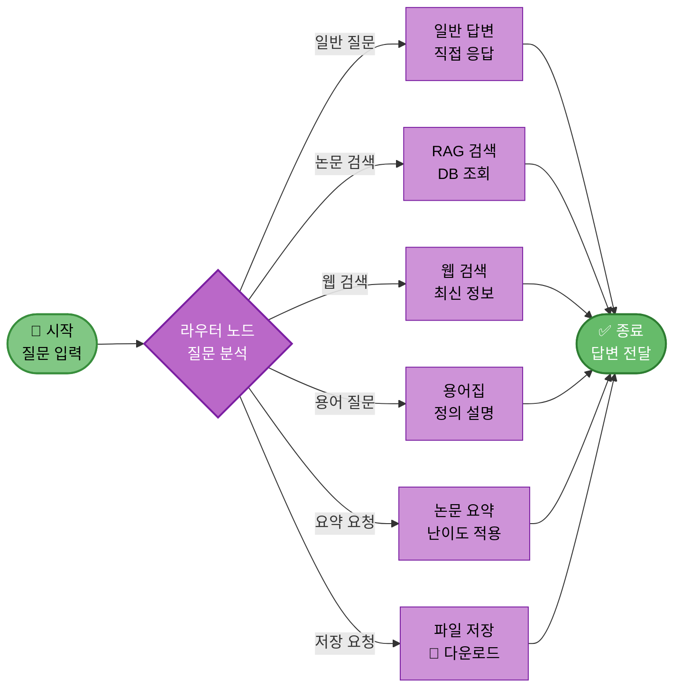
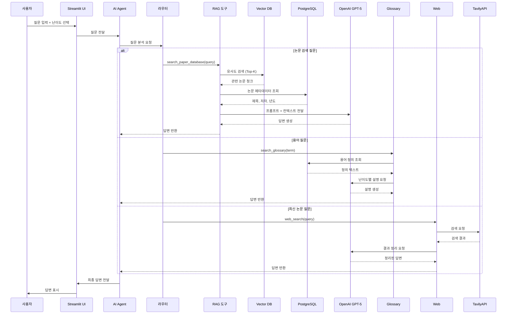
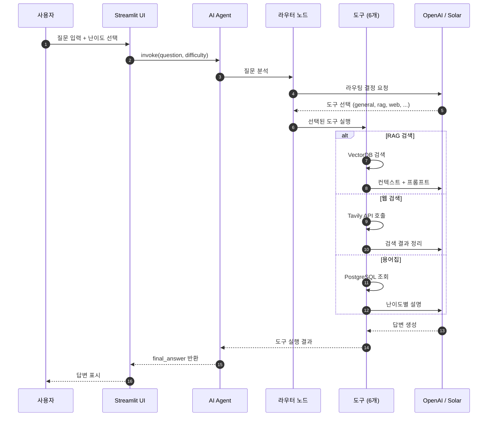

# 12. AI Agent 설계

## 문서 정보
- **작성일**: 2025-10-30
- **프로젝트명**: 논문 리뷰 챗봇 (AI Agent + RAG)
- **팀명**: 연결의 민족
- **작성자**: 최현화[팀장]

---

## 1. AI Agent 아키텍처

### 1.1 LangGraph 기반 Agent

**프레임워크**: LangGraph StateGraph

**이유:**
- 복잡한 워크플로우를 그래프로 표현
- 조건부 분기 및 상태 관리 용이
- Langchain과 완벽한 통합

---

## 2. Agent 그래프 구조

**Agent 그래프 구조 설명:**
- LangGraph 기반 AI Agent의 전체 구조를 시각화하여 시작부터 종료까지의 라우팅 프로세스를 표현
- 사용자 질문이 입력되면 라우터 노드에서 질문을 분석하여 6가지 도구 중 하나를 자동으로 선택
- 6가지 도구는 일반 답변(직접 응답), RAG 검색(DB 조회), 웹 검색(최신 정보), 용어집(정의 설명), 논문 요약(난이도 적용), 파일 저장(다운로드)으로 구성
- 각 도구가 실행을 완료하면 결과가 답변으로 전달되고 종료 노드로 이동하여 최종 답변이 사용자에게 반환

---

## 3. AgentState 정의

**필요 라이브러리:**
- `typing` - TypedDict, Annotated
- `operator` - add 연산자

**AgentState 필드 정의:**

| 필드 | 타입 | 설명 |
|------|------|------|
| question | str | 사용자 질문 |
| difficulty | str | 'easy' 또는 'hard' 난이도 |
| messages | Annotated[list, operator.add] | 대화 히스토리 (누적 방식) |
| tool_choice | str | 선택된 도구 이름 |
| tool_result | str | 도구 실행 결과 |
| final_answer | str | 최종 답변 |

**Annotated[list, operator.add] 설명:**
- operator.add를 사용하여 리스트 요소를 누적
- 각 노드에서 messages를 추가하면 이전 메시지가 유지되면서 새 메시지가 추가됨

**구현 파일:** `src/agent/state.py`

---

## 4. 도구 정의

### 4.1 도구 목록

| 번호 | 도구 이름 | 파일 | 직접 구현 | 설명 |
|------|-----------|------|-----------|------|
| 1 | general_answer | general.py | ✅ | 일반 질문 답변 |
| 2 | search_paper_database | rag_search.py | ✅ | 논문 DB 검색 |
| 3 | web_search | web_search.py | ❌ Tavily | 웹 검색 |
| 4 | search_glossary | glossary.py | ✅ | 용어집 검색 |
| 5 | summarize_paper | summarize.py | ✅ | 논문 요약 |
| 6 | save_to_file | file_save.py | ✅ | 파일 저장 |

### 4.2 도구 구현 방식

**도구 데코레이터:** `@tool` - Langchain 도구 데코레이터

**도구 함수 구조:**

| 요소 | 설명 |
|------|------|
| 함수명 | 도구 이름 (예: search_paper_database) |
| 입력 | 쿼리 문자열 (query: str) |
| 반환 | 검색 결과 문자열 (str) |
| 독스트링 | 도구 설명 (LLM이 도구 선택 시 참고) |

**search_paper_database 도구 동작:**
1. vectorstore에서 similarity_search(query, k=5) 호출
2. 유사도 높은 상위 5개 문서 추출
3. format_search_results() 함수로 결과 포맷팅
4. 포맷된 결과 문자열 반환

**구현 파일:** `src/tools/`

---

## 4.1 상세 데이터 흐름

**상세 데이터 흐름 설명:**
- 사용자 질문이 Streamlit UI를 통해 입력되고 AI Agent가 처리하여 최종 답변을 반환하는 전체 데이터 흐름을 상세히 표현
- UI에서 질문과 난이도가 Agent로 전달되면 라우터가 질문을 분석하여 적절한 도구를 선택
- 논문 검색 시에는 RAG 도구가 Vector DB에서 유사도 검색을 수행하고 PostgreSQL에서 메타데이터를 조회한 후 LLM에 전달
- 용어 질문 시에는 Glossary 도구가 PostgreSQL에서 정의를 조회하고, 최신 논문 질문 시에는 Web 도구가 Tavily API를 호출
- 모든 경우 LLM이 난이도에 맞는 답변을 생성하여 UI를 통해 사용자에게 전달

---

## 5. Agent 실행 시퀀스

**Agent 실행 시퀀스 설명:**
- 사용자 질문부터 최종 답변까지 AI Agent의 실행 과정을 순차적으로 상세히 표현
- 사용자가 질문과 난이도를 입력하면 Agent가 라우터 노드를 통해 LLM에 라우팅 결정을 요청
- LLM이 적절한 도구(general, rag, web 등)를 선택하면 해당 도구가 실행되어 필요한 데이터 검색이나 처리를 수행
- RAG 검색 시에는 VectorDB를 검색하고, 웹 검색 시에는 Tavily API를 호출하며, 용어집 시에는 PostgreSQL을 조회
- 각 도구의 결과가 LLM에 컨텍스트와 함께 전달되어 난이도에 맞는 답변을 생성하고 UI를 통해 사용자에게 표시

---

## 6. LangGraph 구현

### 6.1 그래프 구성 요소

**필요 라이브러리:**
- `langgraph.graph` - StateGraph, END

**그래프 생성:**

| 단계 | 동작 | 설명 |
|------|------|------|
| 1. 그래프 생성 | StateGraph(AgentState) | AgentState를 상태로 하는 그래프 생성 |
| 2. 노드 추가 | add_node(name, function) | 7개 노드 추가 (router + 6개 도구) |
| 3. 시작점 설정 | set_entry_point("router") | 라우터 노드를 시작점으로 설정 |
| 4. 조건부 엣지 | add_conditional_edges() | 라우터에서 도구로 분기 |
| 5. 종료 엣지 | add_edge(node, END) | 각 도구 노드에서 END로 연결 |
| 6. 컴파일 | compile() | 실행 가능한 agent_executor 생성 |

### 6.2 노드 목록

| 노드명 | 함수 | 설명 |
|--------|------|------|
| router | router_node | 질문 분석 및 도구 선택 |
| search_paper | search_paper_node | 논문 DB 검색 |
| web_search | web_search_node | 웹 검색 |
| glossary | glossary_node | 용어집 검색 |
| summarize | summarize_node | 논문 요약 |
| save_file | save_file_node | 파일 저장 |
| general | general_node | 일반 답변 |

### 6.3 조건부 엣지 설정

**add_conditional_edges() 파라미터:**

| 파라미터 | 값 | 설명 |
|---------|-----|------|
| source | "router" | 조건부 분기가 시작되는 노드 |
| condition | route_to_tool | 다음 노드를 결정하는 함수 |
| mapping | 딕셔너리 | 도구 선택 결과 → 노드 이름 매핑 |

**매핑 딕셔너리:**

| 키 (도구 선택) | 값 (노드명) |
|---------------|-------------|
| "search_paper" | "search_paper" |
| "web_search" | "web_search" |
| "glossary" | "glossary" |
| "summarize" | "summarize" |
| "save_file" | "save_file" |
| "general" | "general" |

**종료 엣지:**
- 모든 도구 노드에서 END로 연결
- for 루프로 6개 노드 일괄 처리

**구현 파일:** `src/agent/graph.py`

---

## 7. 라우팅 로직

### 7.1 라우팅 함수 구조

**함수명:** `route_to_tool(state: AgentState) -> str`

**입력:**
- state: AgentState - 현재 Agent 상태

**반환:**
- str - 선택된 도구 이름

**라우팅 프로세스:**

| 단계 | 동작 | 설명 |
|------|------|------|
| 1 | state에서 question 추출 | 사용자 질문 가져오기 |
| 2 | 라우팅 프롬프트 구성 | 질문 + 도구 목록 포함 |
| 3 | LLM 호출 | llm.invoke(routing_prompt) |
| 4 | 도구 이름 추출 | 응답에서 공백 제거 (strip()) |
| 5 | 도구 이름 반환 | 선택된 도구 이름 문자열 반환 |

### 7.2 라우팅 프롬프트 구조

**프롬프트 구성:**

| 섹션 | 내용 |
|------|------|
| 질문 | 사용자 질문: {question} |
| 도구 목록 | 6가지 도구와 설명 나열 |
| 요청 | 가장 적절한 도구를 선택하세요 |

**도구 선택지:**

| 도구명 | 설명 |
|--------|------|
| search_paper | 논문 DB 검색 |
| web_search | 웹 검색 |
| glossary | 용어 정의 |
| summarize | 논문 요약 |
| save_file | 파일 저장 |
| general | 일반 답변 |

**LLM 응답 형식:**
- 도구 이름만 반환 (예: "search_paper")
- strip()으로 공백 제거하여 정확한 매칭 보장

**구현 파일:** `src/agent/router.py`

---

## 8. 참고 자료

- LangGraph 공식 문서: https://langchain-ai.github.io/langgraph/
- Langchain Agent: https://python.langchain.com/docs/tutorials/agents/
