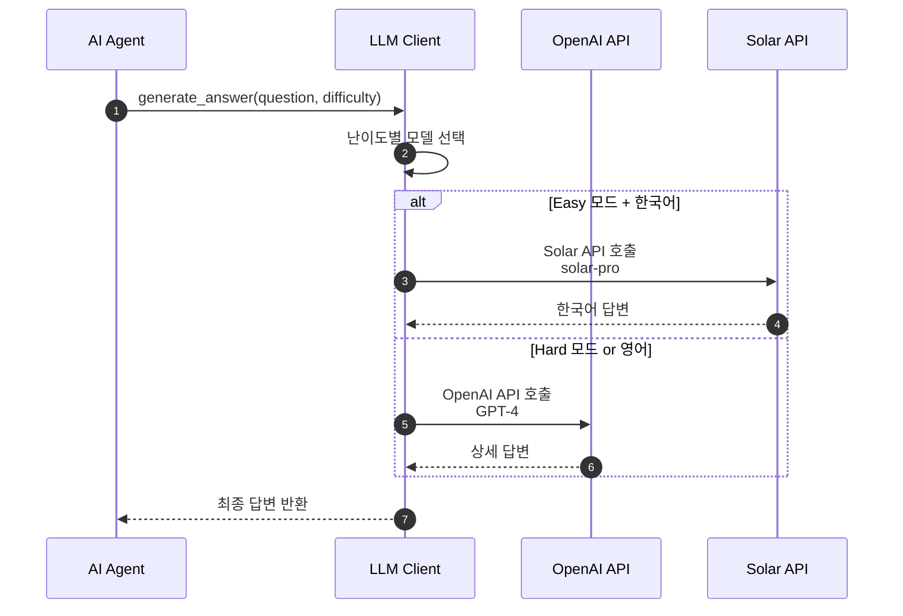
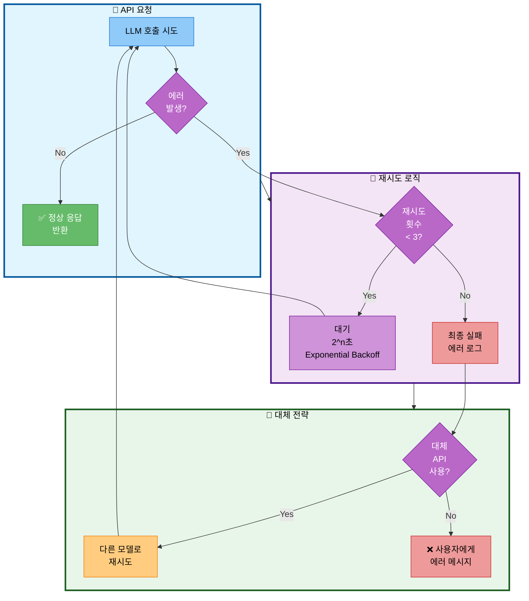

# 14. LLM 설정

## 문서 정보
- **작성일**: 2025-10-30
- **프로젝트명**: 논문 리뷰 챗봇 (AI Agent + RAG)
- **팀명**: 연결의 민족
- **작성자**: 최현화[팀장]

---

## 1. LLM 모델 선택

### 1.1 개발 환경 LLM 설정

**필요 라이브러리:**
- `langchain_openai` - OpenAI LLM 연동
- `langchain_upstage` - Upstage Solar LLM 연동

**Option 1: GPT-3.5-turbo (비용 절감)**

| 항목 | 값 | 설명 |
|------|-----|------|
| 모델명 | gpt-3.5-turbo | 빠르고 저렴한 모델 |
| Temperature | 0.0 | 일관된 답변 생성 |
| Max Tokens | 2000 | 최대 출력 토큰 수 |
| Streaming | True | 실시간 응답 출력 |

**Option 2: Solar-pro (한국어 특화)**

| 항목 | 값 | 설명 |
|------|-----|------|
| 모델명 | solar-pro | 한국어에 최적화된 모델 |
| Temperature | 0.0 | 일관된 답변 생성 |
| Max Tokens | 2000 | 최대 출력 토큰 수 |
| Streaming | True | 실시간 응답 출력 |

### 1.2 프로덕션 환경 LLM 설정

**Option 1: GPT-4 (높은 품질)**

| 항목 | 값 | 설명 |
|------|-----|------|
| 모델명 | gpt-4 | 높은 성능과 정확도 |
| Temperature | 0.7 | 자연스러운 답변 |
| Max Tokens | 3000 | 긴 답변 지원 |
| Streaming | True | 실시간 응답 출력 |

**Option 2: Solar-pro (비용 효율)**

| 항목 | 값 | 설명 |
|------|-----|------|
| 모델명 | solar-pro | 한국어 답변, 비용 효율 |
| Temperature | 0.7 | 자연스러운 답변 |
| Max Tokens | 3000 | 긴 답변 지원 |
| Streaming | True | 실시간 응답 출력 |

### 1.3 하이브리드 전략 (권장)

**난이도별 모델 선택 규칙:**

| 조건 | 선택 모델 | 이유 |
|------|----------|------|
| Easy 모드 + 한국어 | Solar-pro | 한국어 특화, 저비용 |
| Hard 모드 | GPT-4 | 기술적 정확도 |
| 기타 | GPT-3.5-turbo | 범용적 사용 |

**구현 방식:**
- `get_llm(difficulty, language)` 함수로 난이도와 언어에 따라 적절한 LLM 선택
- 구현 파일: `src/llm/client.py`

---

## 2. API 키 관리

### 2.1 환경 변수 설정

`.env` 파일에 다음 API 키를 설정해야 합니다:

| 환경 변수 | 설명 | 형식 |
|----------|------|------|
| OPENAI_API_KEY | OpenAI API 키 | sk-... |
| SOLAR_API_KEY | Upstage Solar API 키 | up-... |
| TAVILY_API_KEY | Tavily 검색 API 키 | tvly-... |
| DATABASE_URL | PostgreSQL 연결 문자열 | postgresql://... |

### 2.2 환경 변수 로드 방식

**사용 라이브러리:** `python-dotenv`

**로드 순서:**
1. `.env` 파일에서 환경 변수 읽기
2. `os.getenv()`로 각 API 키 가져오기
3. 필수 키 누락 시 ValueError 발생

**검증 필수 키:**
- OPENAI_API_KEY
- SOLAR_API_KEY

---

## 3. 에러 핸들링

### 3.1 LLM API 호출 흐름

**LLM API 호출 흐름 설명:**
- AI Agent가 질문에 대한 답변을 생성할 때 LLM Client가 난이도에 따라 적절한 모델을 선택하는 과정을 표현
- Agent가 질문과 난이도를 LLM Client에 전달하면 Client는 난이도별로 최적의 모델을 선택
- Easy 모드와 한국어 답변이 필요한 경우 Solar API의 solar-pro 모델을 호출하여 한국어에 특화된 답변을 생성
- Hard 모드이거나 영어 답변이 필요한 경우 OpenAI API의 GPT-4 모델을 호출하여 상세하고 전문적인 답변을 생성
- 선택된 API에서 답변을 받아 Agent에 최종 답변을 반환

### 3.2 에러 처리 흐름

**에러 처리 흐름 설명:**
- LLM API 호출 시 발생할 수 있는 에러를 체계적으로 처리하는 전체 프로세스를 3단계로 표현
- API 요청 단계에서 LLM을 호출하여 에러 없이 성공하면 정상 응답을 반환
- 재시도 로직 단계에서 에러 발생 시 재시도 횟수를 확인하여 3회 미만이면 Exponential Backoff(2^n초)로 대기 후 재시도하고, 3회 이상이면 최종 실패로 에러 로그를 기록
- 대체 전략 단계에서 최종 실패 시 대체 API 사용 여부를 확인하여 가능하면 다른 모델로 재시도하고, 불가능하면 사용자에게 에러 메시지를 전달

### 3.3 재시도 로직 구현 방식

**사용 라이브러리:** `tenacity`

**재시도 설정:**

| 파라미터 | 값 | 설명 |
|---------|-----|------|
| stop | stop_after_attempt(3) | 최대 3회 재시도 |
| wait | wait_exponential | 지수 백오프 대기 |
| multiplier | 1 | 대기 시간 배수 |
| min | 2초 | 최소 대기 시간 |
| max | 10초 | 최대 대기 시간 |

**구현 방식:**
- `@retry` 데코레이터를 사용하여 LLM 호출 함수에 자동 재시도 적용
- 에러 발생 시 로거에 기록 후 재시도
- 구현 파일: `src/llm/client.py`

### 3.4 타임아웃 설정

**LLM 초기화 시 타임아웃 파라미터:**

| 파라미터 | 값 | 설명 |
|---------|-----|------|
| request_timeout | 30 | API 호출 타임아웃 (초) |
| max_retries | 2 | 자동 재시도 횟수 |

---

## 4. 토큰 사용량 추적

### 4.1 토큰 카운팅 방식

**사용 라이브러리:** `langchain.callbacks.get_openai_callback`

**추적 항목:**

| 항목 | 설명 |
|------|------|
| total_tokens | 전체 사용 토큰 수 |
| prompt_tokens | 입력 프롬프트 토큰 수 |
| completion_tokens | 생성된 답변 토큰 수 |
| total_cost | 총 비용 (USD) |

**구현 방식:**
- `get_openai_callback()` 컨텍스트 매니저로 LLM 호출을 감싸서 토큰 사용량 자동 추적
- 호출 후 로거에 토큰 사용량 기록

### 4.2 비용 모니터링 방식

**구현 방법:**
- 데코레이터 패턴을 사용한 비용 모니터링 함수 구현
- 모든 LLM 호출 함수에 `@monitor_cost` 데코레이터 적용
- 함수 실행 후 비용을 로거에 자동 기록

**기록 형식:** `[비용] 함수명: $비용`

---

## 5. 스트리밍 응답

### 5.1 기본 스트리밍 설정

**LLM 초기화 시 스트리밍 활성화:**

| 파라미터 | 값 | 설명 |
|---------|-----|------|
| streaming | True | 스트리밍 응답 활성화 |
| callbacks | StreamingStdOutCallbackHandler() | 표준 출력 핸들러 |

**스트리밍 응답 방식:**
- `llm.stream()` 메서드로 실시간 청크 단위 응답 수신
- 각 청크를 즉시 출력하여 사용자 경험 향상

### 5.2 Streamlit 통합 방식

**사용 라이브러리:** `langchain.callbacks.StreamlitCallbackHandler`

**통합 방법:**
- Streamlit 컨테이너를 생성하여 StreamlitCallbackHandler에 전달
- LLM 초기화 시 callbacks에 StreamlitCallbackHandler 지정
- Streamlit UI에서 실시간으로 LLM 응답 표시

---

## 6. 모델 파라미터

### 6.1 Temperature 설정

| 값 | 용도 | 설명 |
|----|------|------|
| 0.0 | 검색, 라우팅 | 결정론적, 일관된 출력 |
| 0.3-0.5 | 요약, 분류 | 약간의 창의성 |
| 0.7-0.9 | 답변 생성 | 자연스러운 답변 |

**용도별 설정:**
- **라우팅용 LLM**: temperature=0.0 (일관된 라우팅 결정)
- **답변 생성용 LLM**: temperature=0.7 (자연스러운 답변)

### 6.2 Max Tokens 설정

**파라미터:**

| 항목 | 값 | 설명 |
|------|-----|------|
| max_tokens | 3000 | 최대 생성 토큰 수 |
| stop | ["\n\n---\n\n"] | 중단 시퀀스 (선택적) |

**설정 이유:**
- 답변 길이 제한으로 비용 관리
- 중단 시퀀스로 불필요한 생성 방지

---

## 7. 참고 자료

- OpenAI API: https://platform.openai.com/docs/api-reference
- Langchain ChatOpenAI: https://python.langchain.com/docs/integrations/chat/openai/
