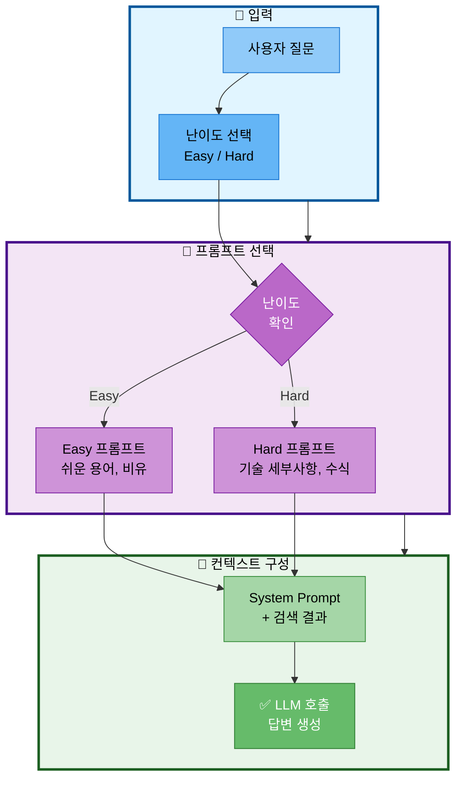

# 15. 프롬프트 엔지니어링

## 문서 정보
- **작성일**: 2025-10-30
- **프로젝트명**: 논문 리뷰 챗봇 (AI Agent + RAG)
- **팀명**: 연결의 민족
- **작성자**: 최현화[팀장]

---

## 1. 난이도별 프롬프트

### 1.1 프롬프트 선택 흐름

**프롬프트 선택 흐름 설명:**
- 사용자 질문에 대한 답변을 생성할 때 난이도에 따라 적절한 프롬프트를 선택하고 컨텍스트를 구성하는 전체 프로세스를 표현
- 입력 단계에서 사용자가 질문과 함께 Easy 또는 Hard 난이도를 선택
- 프롬프트 선택 단계에서 난이도를 확인하여 Easy 모드면 쉬운 용어와 비유를 사용하는 프롬프트를 선택하고, Hard 모드면 기술 세부사항과 수식을 포함하는 프롬프트를 선택
- 컨텍스트 구성 단계에서 선택된 프롬프트에 검색 결과를 결합한 System Prompt를 만들고 LLM을 호출하여 최종 답변을 생성

### 1.2 Easy 모드 (초급)

**System Prompt 역할:**
- 논문을 쉽게 설명하는 전문가 역할 정의
- 초보자 중심의 설명 방식 명시

**Easy 모드 답변 규칙:**

| 규칙 | 설명 |
|------|------|
| 설명 수준 | 초등학생도 이해할 수 있는 수준으로 설명 |
| 용어 사용 | 전문 용어는 풀어서 설명, 쉬운 한글 용어 사용 |
| 설명 기법 | 비유와 예시를 많이 활용, "즉", "예를 들어" 연결어 사용 |
| 문장 길이 | 한 문장을 짧게 (20자 이내) |
| 친절성 | 한글로 친절하게 답변 |

**User Prompt 구조:**

| 요소 | 설명 |
|------|------|
| 참고 논문 | {context} - 검색된 논문 내용 |
| 질문 | {question} - 사용자 질문 |
| 요청 사항 | "초보자가 이해하기 쉽게 답변해주세요" |

**구현 파일:** `prompts/difficulty_prompts.py`

### 1.3 Hard 모드 (전문가)

**System Prompt 역할:**
- 논문 리뷰 전문가 역할 정의
- 학술적이고 전문적인 답변 방식 명시

**Hard 모드 답변 규칙:**

| 규칙 | 설명 |
|------|------|
| 용어 사용 | 전문 용어를 그대로 사용 (영문 병기) |
| 기술 내용 | 논문의 핵심 알고리즘과 수식 포함 설명 |
| 분석 수준 | 실험 결과와 평가 지표 포함, 비판적 분석 제공 |
| 방법론 | 연구 방법론과 한계점 언급 |
| 비교 분석 | 관련 연구와 비교 분석 |

**User Prompt 구조:**

| 요소 | 설명 |
|------|------|
| 참고 논문 | {context} - 검색된 논문 내용 |
| 질문 | {question} - 사용자 질문 |
| 요청 사항 | "전문가 수준으로 상세히 답변해주세요" |

**구현 파일:** `prompts/difficulty_prompts.py`

---

## 2. Langchain 프롬프트 구현

### 2.1 ChatPromptTemplate 구조

**필요 라이브러리:**
- `langchain.prompts` - ChatPromptTemplate

**프롬프트 생성 함수 구조:**

| 요소 | 설명 |
|------|------|
| 함수명 | create_prompt(difficulty="easy") |
| 입력 | difficulty - "easy" 또는 "hard" |
| 반환 | ChatPromptTemplate 인스턴스 |

**프롬프트 메시지 구성:**

| 순서 | 역할 | 내용 |
|------|------|------|
| 1 | system | 난이도별 System Prompt (EASY_SYSTEM_PROMPT 또는 HARD_SYSTEM_PROMPT) |
| 2 | user | 난이도별 User Template (EASY_USER_TEMPLATE 또는 HARD_USER_TEMPLATE) |

**구현 방식:**
- `ChatPromptTemplate.from_messages()` 사용
- system과 user 메시지를 튜플 리스트로 전달
- 난이도에 따라 적절한 프롬프트 선택

**구현 파일:** `prompts/difficulty_prompts.py`

### 2.2 프롬프트 사용 방식

**프롬프트 생성 및 포맷팅:**

| 단계 | 설명 |
|------|------|
| 1. 프롬프트 생성 | create_prompt(difficulty) 호출 |
| 2. 변수 바인딩 | prompt.format(context, question) 호출 |
| 3. LLM 전달 | 포맷된 프롬프트를 LLM에 전달 |

**변수 바인딩:**

| 변수 | 설명 | 예시 |
|------|------|------|
| context | 검색된 논문 내용 | "논문 제목: ..., 저자: ..., 내용: ..." |
| question | 사용자 질문 | "이 논문이 뭔가요?" 또는 "알고리즘을 설명해주세요" |

**구현 파일:** `src/agent/nodes.py`

---

## 3. RAG 프롬프트

### 3.1 기본 RAG 프롬프트

**프롬프트 역할:**
- 논문 리뷰 전문가로서 검색 결과 기반 답변 생성

**프롬프트 구조:**

| 섹션 | 내용 |
|------|------|
| 역할 정의 | "당신은 논문 리뷰 전문가입니다" |
| 참고 논문 | {context} - 검색된 논문 내용 |
| 질문 | {question} - 사용자 질문 |
| 난이도 | {difficulty} - easy 또는 hard |

**답변 규칙:**

| 규칙 | 설명 |
|------|------|
| 근거 기반 | 참고 논문의 내용을 기반으로 답변 |
| 출처 명시 | 논문 제목, 저자, 연도 명시 |
| 정확성 | 논문에 없는 내용은 추측하지 말 것 |
| 난이도 준수 | 선택된 난이도에 맞는 설명 제공 |

**구현 파일:** `prompts/rag_prompts.py`

### 3.2 용어집 통합 프롬프트

**프롬프트 역할:**
- 용어집과 논문 내용을 결합한 답변 생성

**프롬프트 구조:**

| 섹션 | 내용 |
|------|------|
| 역할 정의 | "당신은 논문 리뷰 전문가입니다" |
| 용어 설명 | {glossary_context} - 용어집 검색 결과 |
| 참고 논문 | {paper_context} - 논문 검색 결과 |
| 질문 | {question} - 사용자 질문 |
| 난이도 | {difficulty} - easy 또는 hard |

**답변 순서:**

| 순서 | 단계 | 설명 |
|------|------|------|
| 1 | 용어 정의 | 용어 설명을 참고하여 용어 먼저 정의 |
| 2 | 논문 기반 답변 | 그 다음 논문 내용을 기반으로 상세 답변 |
| 3 | 난이도 준수 | 선택된 난이도에 맞는 설명 제공 |

**구현 파일:** `prompts/rag_prompts.py`

---

## 4. Agent 라우팅 프롬프트

### 4.1 라우터 프롬프트 구조

**프롬프트 역할:**
- 사용자 질문을 분석하여 가장 적절한 도구 선택

**프롬프트 구성:**

| 섹션 | 내용 |
|------|------|
| 질문 | {question} - 사용자 질문 |
| 도구 목록 | 6가지 도구와 사용 예시 |
| 선택 규칙 | 도구 이름만 반환, 6개 중 하나만 선택 |

**도구 목록:**

| 도구명 | 설명 | 사용 예시 |
|--------|------|----------|
| search_paper | 논문 DB 검색 | "RAG에 대해 알려줘", "transformer 논문 찾아줘" |
| web_search | 웹 검색 | "최신 AI 뉴스", "2024년 논문 트렌드" |
| glossary | 용어 정의 | "BERT가 뭐야?", "attention 설명해줘" |
| summarize | 논문 요약 | "이 논문 요약해줘", "핵심 내용만 알려줘" |
| save_file | 파일 저장 | "파일로 저장해줘", "다운로드" |
| general | 일반 답변 | "안녕", "고마워" |

**선택 규칙:**
- 도구 이름만 반환 (예: search_paper)
- 반드시 위 6개 중 하나만 선택

**구현 파일:** `prompts/routing_prompts.py`

---

## 5. Few-Shot 예시

### 5.1 FewShotPromptTemplate 구조

**필요 라이브러리:**
- `langchain.prompts` - FewShotPromptTemplate, PromptTemplate

**Few-Shot 구성요소:**

| 요소 | 설명 |
|------|------|
| examples | 질문-도구 쌍의 예시 리스트 |
| example_prompt | 각 예시의 포맷 템플릿 |
| prefix | 예시 목록 앞에 표시할 텍스트 |
| suffix | 예시 목록 뒤에 표시할 텍스트 |
| input_variables | 입력 변수 목록 |

**예시 데이터 구조:**

| 질문 | 도구 |
|------|------|
| "BERT가 뭐야?" | glossary |
| "RAG 논문 찾아줘" | search_paper |
| "최신 AI 뉴스" | web_search |

**예시 템플릿 형식:**
- 질문: {question}
- 도구: {tool}

**Few-Shot 프롬프트 설정:**

| 파라미터 | 값 | 설명 |
|---------|-----|------|
| prefix | "다음 예시를 참고하여 도구를 선택하세요:" | 예시 목록 앞 안내 텍스트 |
| suffix | "질문: {question}\n도구:" | 실제 질문을 받을 템플릿 |

**구현 파일:** `prompts/routing_prompts.py`

---

## 6. 요약 프롬프트

### 6.1 난이도별 요약 프롬프트

**Easy 모드 요약:**

| 항목 | 설명 |
|------|------|
| 입력 | {paper_content} - 논문 전체 내용 |
| 설명 수준 | 초보자도 이해할 수 있는 쉬운 말로 요약 |
| 길이 | 3-5문장으로 핵심만 요약 |
| 형식 | "이 논문은 ~를 연구했습니다" 형식 |
| 기법 | 비유와 예시 활용 |

**Hard 모드 요약:**

| 항목 | 설명 |
|------|------|
| 입력 | {paper_content} - 논문 전체 내용 |
| 포함 내용 | 연구 배경, 방법론, 결과, 한계점 포함 |
| 기술 내용 | 핵심 알고리즘과 수식 언급 |
| 용어 | 전문 용어 그대로 사용 |
| 길이 | 5-10문장으로 상세히 요약 |

**구현 파일:** `prompts/summarize_prompts.py`

---

## 7. 출처 명시 프롬프트

### 7.1 출처 포함 답변 프롬프트

**프롬프트 구조:**

| 섹션 | 내용 |
|------|------|
| 참고 논문 | {context} - 검색된 논문 내용 |
| 질문 | {question} - 사용자 질문 |

**답변 규칙:**

| 규칙 | 설명 |
|------|------|
| 출처 필수 명시 | 반드시 [논문 제목, 저자, 연도] 형식으로 출처 명시 |
| 문장별 출처 | 각 문장마다 출처 표시 |
| 형식 예시 | "Transformer는 attention 메커니즘을 사용합니다 [Attention Is All You Need, Vaswani et al., 2017]" |

**출처 표기 형식:**
- [논문 제목, 저자, 연도]
- 각 주장마다 관련 논문 출처를 문장 끝에 표기

**구현 파일:** `prompts/rag_prompts.py`

---

## 8. 참고 자료

- Langchain Prompt Templates: https://python.langchain.com/docs/modules/model_io/prompts/
- Prompt Engineering Guide: https://www.promptingguide.ai/
