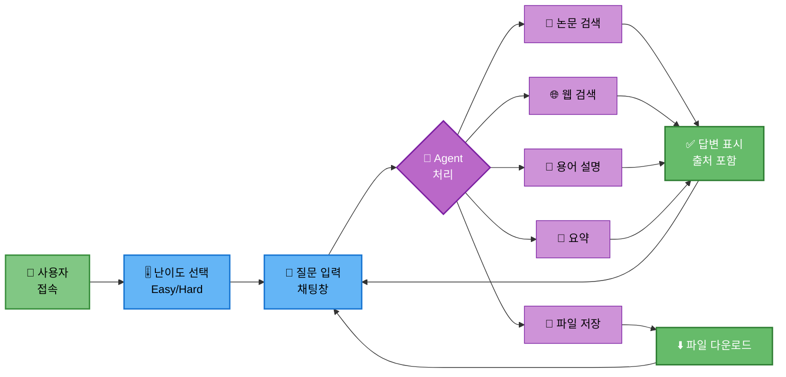
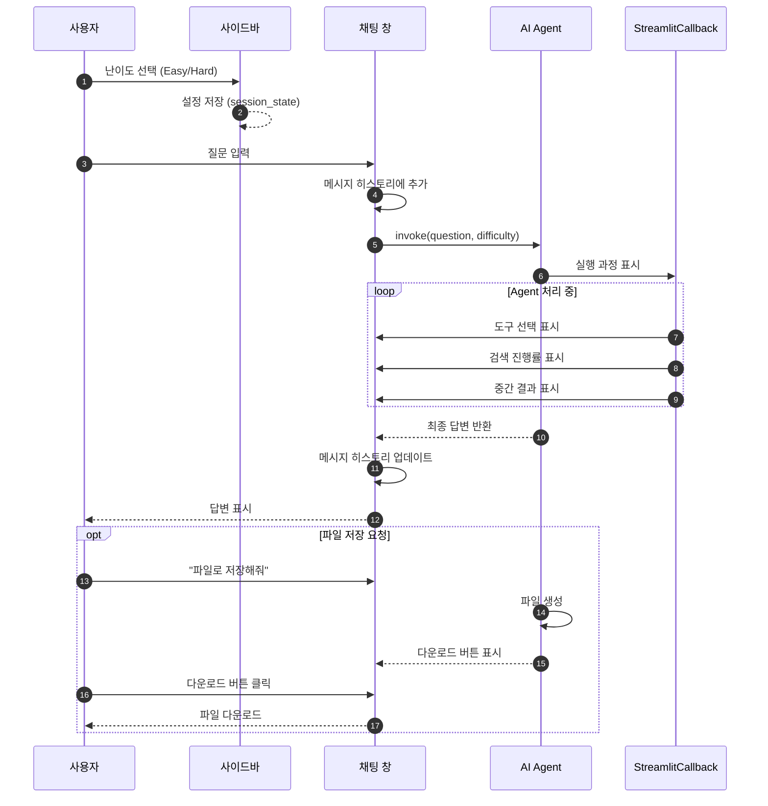
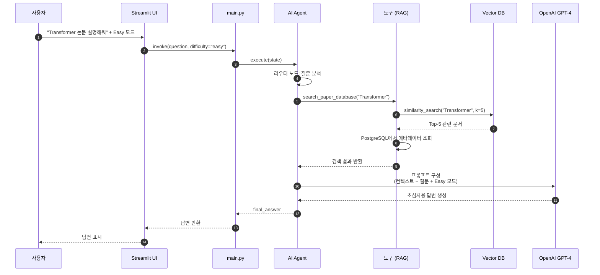

# 16. UI 설계

## 문서 정보
- **작성일**: 2025-10-30
- **프로젝트명**: 논문 리뷰 챗봇 (AI Agent + RAG)
- **팀명**: 연결의 민족
- **작성자**: 최현화[팀장]

---

## 1. Streamlit 기본 구조

### 1.1 페이지 설정

**필요 라이브러리:**
- `streamlit` - Streamlit UI 프레임워크

**페이지 설정 파라미터:**

| 항목 | 값 | 설명 |
|------|-----|------|
| page_title | 논문 리뷰 챗봇 | 브라우저 탭 제목 |
| page_icon | 📚 | 탭 아이콘 (이모지) |
| layout | wide | 화면 레이아웃 (wide/centered) |

**페이지 제목 및 캡션:**
- 제목: "📚 논문 리뷰 챗봇 (AI Agent + RAG)"
- 캡션: "🤖 LangGraph + RAG 기반 논문 검색 및 질문 답변"

**구현 파일:** `src/ui/app.py`

---

## 2. UI 워크플로우

### 2.1 전체 워크플로우

**UI 워크플로우 설명:**
- 사용자가 Streamlit 기반 웹 UI를 통해 논문 리뷰 챗봇과 상호작용하는 전체 워크플로우를 시각화
- 사용자 접속 후 사이드바에서 Easy/Hard 난이도를 선택하고 채팅창에 질문을 입력
- AI Agent가 질문을 분석하여 논문 검색, 웹 검색, 용어 설명, 요약, 파일 저장 중 적절한 작업을 수행
- 논문 검색, 웹 검색, 용어 설명, 요약 결과는 출처를 포함한 답변으로 표시되고, 파일 저장은 다운로드 버튼을 제공
- 답변 확인 후 사용자는 계속해서 새로운 질문을 입력할 수 있는 대화형 인터페이스 제공

### 2.2 UI 상호작용 시퀀스

**UI 상호작용 시퀀스 설명:**
- 사용자가 UI를 통해 질문을 입력하고 답변을 받는 전체 상호작용 과정을 순차적으로 표현
- 사용자가 사이드바에서 난이도를 선택하면 session_state에 저장되고, 채팅창에 질문을 입력하면 메시지 히스토리에 추가
- 질문이 Agent로 전달되면 StreamlitCallback을 통해 실행 과정(도구 선택, 검색 진행률, 중간 결과)이 실시간으로 화면에 표시
- Agent 처리가 완료되면 최종 답변이 채팅창에 표시되고 메시지 히스토리가 업데이트
- 파일 저장 요청 시 Agent가 파일을 생성하고 다운로드 버튼을 표시하며, 사용자가 클릭하면 파일이 다운로드

---

## 3. 난이도 선택 UI

### 3.1 사이드바 구성

**사이드바 레이아웃:** `st.sidebar` 컨테이너 사용

**구성 요소:**

| 요소 | 타입 | 설명 |
|------|------|------|
| 헤더 | st.header | "⚙️ 설정" 제목 표시 |
| 난이도 선택 | st.radio | easy/hard 라디오 버튼 |
| 구분선 | st.divider | 섹션 구분선 |
| 정보 박스 | st.info | 각 모드 설명 표시 |
| 리셋 버튼 | st.button | 대화 초기화 버튼 |

**난이도 선택 옵션:**

| 옵션값 | 표시 텍스트 | 설명 |
|--------|------------|------|
| easy | 초급 (쉬운 설명) | 쉬운 용어, 비유와 예시 활용 |
| hard | 전문가 (상세 설명) | 전문 용어, 수식 및 상세 분석 |

**리셋 버튼 동작:**
- 버튼 클릭 시 `st.session_state.messages` 초기화
- `st.rerun()` 호출하여 UI 재시작

**구현 파일:** `src/ui/app.py`

---

## 4. 채팅 인터페이스

### 4.1 채팅 히스토리 관리

**세션 상태 초기화:**

| 상태 변수 | 타입 | 초기값 | 설명 |
|----------|------|--------|------|
| messages | list | [] | 채팅 메시지 히스토리 |

**초기화 방식:**
- `st.session_state`에 messages 키가 없으면 빈 리스트로 초기화
- 페이지 새로고침 시에도 대화 히스토리 유지

### 4.2 메시지 표시

**기존 메시지 표시 방식:**
- `st.session_state.messages` 리스트를 순회
- 각 메시지를 `st.chat_message(role)` 컨테이너로 표시
- 메시지 내용을 `st.markdown()`으로 렌더링

**메시지 구조:**

| 필드 | 타입 | 설명 |
|------|------|------|
| role | str | "user" 또는 "assistant" |
| content | str | 메시지 내용 (Markdown 형식) |

### 4.3 사용자 입력 처리 흐름

**입력 처리 단계:**

| 단계 | 동작 | 설명 |
|------|------|------|
| 1. 입력 받기 | st.chat_input() | 사용자 질문 입력 |
| 2. 메시지 추가 | append() | session_state.messages에 추가 |
| 3. 화면 표시 | st.chat_message("user") | 사용자 메시지 표시 |
| 4. Agent 호출 | agent_executor.invoke() | 난이도와 질문 전달 |
| 5. 답변 표시 | st.markdown() | AI 답변 표시 |
| 6. 답변 저장 | append() | 답변을 히스토리에 추가 |

**Agent 호출 파라미터:**

| 파라미터 | 값 | 설명 |
|---------|-----|------|
| question | 사용자 입력 텍스트 | 질문 내용 |
| difficulty | easy/hard | 사이드바에서 선택한 난이도 |
| callbacks | [st_callback] | StreamlitCallbackHandler 인스턴스 |

**구현 파일:** `src/ui/app.py`

---

## 4.1 일반적인 질문 처리 흐름 (상세)

**일반적인 질문 처리 흐름 설명:**
- Streamlit UI에서 사용자 질문이 입력되고 Agent를 거쳐 최종 답변이 반환되는 상세한 데이터 흐름을 표현
- 사용자가 "Transformer 논문 설명해줘"와 Easy 모드를 선택하면 main.py를 통해 Agent가 실행
- Agent의 라우터 노드가 질문을 분석하여 search_paper_database 도구를 선택하고, 도구가 Vector DB에서 "Transformer"로 유사도 검색을 수행하여 Top-5 관련 문서를 추출
- 검색된 문서의 메타데이터를 PostgreSQL에서 조회하고, 검색 결과를 Agent에 반환
- Agent가 컨텍스트와 질문, Easy 모드를 포함한 프롬프트를 구성하여 LLM(OpenAI GPT-4)에 전달하고, LLM이 초심자용 답변을 생성하여 UI를 통해 사용자에게 표시

---

## 5. StreamlitCallbackHandler 통합

### 5.1 Callback Handler 설정

**필요 라이브러리:**
- `langchain.callbacks` - StreamlitCallbackHandler

**Callback Handler 파라미터:**

| 파라미터 | 값 | 설명 |
|---------|-----|------|
| parent_container | st.container() | 콜백 표시할 컨테이너 |
| expand_new_thoughts | True | 새 사고 과정 자동 확장 |
| collapse_completed_thoughts | True | 완료된 단계 자동 축소 |

**Agent 실행 시 전달 방식:**
- `agent_executor.invoke()` 호출 시 config 파라미터로 전달
- config 딕셔너리에 `callbacks` 키로 리스트 형태로 전달

**구현 파일:** `src/ui/app.py`

### 5.2 실행 과정 표시

StreamlitCallbackHandler는 다음을 자동으로 표시합니다:
- 🔧 선택된 도구
- 🔍 검색 과정
- 💭 Agent의 사고 과정
- ✅ 완료된 단계

---

## 6. 파일 다운로드 기능

### 6.1 다운로드 버튼 구현

**다운로드 버튼 파라미터:**

| 파라미터 | 설명 |
|---------|------|
| label | "⬇️ 파일 다운로드" 버튼 텍스트 |
| data | 다운로드할 파일 내용 (문자열) |
| file_name | 저장할 파일명 (타임스탬프 포함) |
| mime | "text/plain" MIME 타입 |

**파일명 형식:**
- `paper_summary_YYYYMMDD_HHMMSS.txt`
- 타임스탬프로 중복 방지

**구현 방식:**
- `create_download_button()` 함수로 캡슐화
- Agent 응답에 "save" 도구 선택이 있을 경우 자동 표시
- `st.success()` 메시지와 함께 다운로드 버튼 제공

**구현 파일:** `src/ui/app.py`

### 6.2 사용 시나리오

**파일 저장 요청 감지:**
- Agent 응답에서 `tool_choice`가 "save"인 경우
- 최종 답변 내용을 파일로 저장

**다운로드 버튼 표시:**
- 성공 메시지: "✅ 파일이 준비되었습니다!"
- 다운로드 버튼: 클릭 시 파일 다운로드

---

## 7. 로딩 상태 표시

### 7.1 Spinner 사용

**Spinner 설정:**

| 파라미터 | 값 | 설명 |
|---------|-----|------|
| 메시지 | "🤖 답변 생성 중..." | 로딩 중 표시 텍스트 |

**사용 방식:**
- `st.spinner()` 컨텍스트 매니저로 Agent 호출 감싸기
- Agent 실행 중 자동으로 스피너 표시
- 실행 완료 시 자동으로 사라짐

### 7.2 Progress Bar 사용

**Progress Bar 구성요소:**

| 요소 | 타입 | 설명 |
|------|------|------|
| progress_bar | st.progress(0) | 진행률 바 (0~100%) |
| status_text | st.empty() | 진행 상태 텍스트 |

**업데이트 방식:**
- 반복문으로 진행률 업데이트
- `progress_bar.progress(i)` 호출
- 상태 텍스트: "처리 중... X%"
- 완료 후 `empty()` 호출하여 제거

**구현 파일:** `src/ui/app.py`

---

## 8. 에러 처리 UI

### 8.1 에러 메시지 표시

**에러 처리 방식:**
- `try-except` 블록으로 Agent 호출 감싸기
- 예외 발생 시 `st.error()` 사용

**에러 메시지 형식:**

| 요소 | 내용 |
|------|------|
| 아이콘 | ❌ |
| 메시지 | "오류 발생: {에러 내용}" |
| 로깅 | logger.write()로 에러 기록 |

**처리 예외 타입:**
- `Exception` - 모든 예외 포괄적 처리
- 에러 메시지 사용자 친화적 표시
- 내부 로깅 시스템에 상세 에러 기록

### 8.2 경고 메시지

**API 키 검증:**

| 검증 항목 | 표시 메시지 | 동작 |
|----------|------------|------|
| OPENAI_API_KEY | "⚠️ OPENAI_API_KEY가 설정되지 않았습니다. .env 파일을 확인해주세요." | st.stop() 호출 |

**경고 표시 방식:**
- `st.warning()` 사용
- 필수 환경 변수 미설정 시 실행 중단
- 사용자에게 설정 방법 안내

**구현 파일:** `src/ui/app.py`

---

## 9. 출처 표시

### 9.1 Expander로 출처 표시

**출처 표시 구조:**

| 구성 요소 | 설명 |
|----------|------|
| Expander 제목 | "📚 참고 논문" |
| 문서 메타데이터 | 제목, 저자, 연도, URL |
| 구분선 | 각 문서 사이 구분선 표시 |

**표시 항목:**

| 항목 | 메타데이터 키 | 기본값 |
|------|-------------|--------|
| 제목 | title | N/A |
| 저자 | authors | N/A |
| 연도 | year | N/A |
| URL | url | N/A |

**표시 방식:**
- Agent 응답에 `source_documents`가 있을 경우에만 표시
- Expander로 접었다 펼 수 있는 형태
- 각 문서마다 메타데이터를 Markdown 형식으로 표시
- 문서 간 `st.divider()`로 구분

**구현 파일:** `src/ui/app.py`

---

## 10. 전체 UI 구조

### 10.1 UI 컴포넌트 구성

**필요 라이브러리:**
- `streamlit` - UI 프레임워크
- `datetime` - 타임스탬프 생성
- `src.agent.graph` - Agent 생성 함수
- `langchain.callbacks` - StreamlitCallbackHandler

**UI 레이아웃 구조:**

| 영역 | 컴포넌트 | 설명 |
|------|---------|------|
| 헤더 | st.title, st.caption | 페이지 제목 및 설명 |
| 사이드바 | st.sidebar | 난이도 선택, 리셋 버튼 |
| 채팅 영역 | st.chat_message | 대화 히스토리 표시 |
| 입력창 | st.chat_input | 사용자 질문 입력 |
| 출처 영역 | st.expander | 참고 논문 표시 |

### 10.2 실행 흐름

**초기화 단계:**
1. 페이지 설정 (제목, 아이콘, 레이아웃)
2. 사이드바 구성 (난이도 선택, 리셋 버튼)
3. 세션 상태 초기화 (messages 리스트)
4. Agent 초기화 (create_agent() 호출)

**대화 처리 단계:**
1. 기존 메시지 히스토리 표시
2. 사용자 입력 대기
3. 입력 수신 시 메시지 히스토리에 추가
4. Agent 호출 (StreamlitCallback 포함)
5. 답변 표시 및 히스토리 업데이트
6. 출처 정보 표시 (있을 경우)

**에러 처리:**
- try-except 블록으로 Agent 호출 감싸기
- 에러 발생 시 st.error() 표시
- 에러 내용 로깅

**구현 파일:** `src/ui/app.py`

---

## 11. 참고 자료

- Streamlit Chat Elements: https://docs.streamlit.io/develop/api-reference/chat
- Langchain Streamlit: https://python.langchain.com/docs/integrations/callbacks/streamlit/
