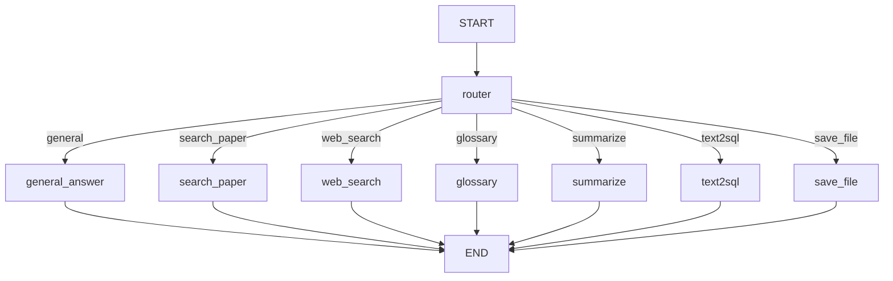

# AI Agent 시스템 Q&A

## 문서 정보
- **작성일**: 2025-11-04
- **작성자**: 최현화[팀장]
- **목적**: AI Agent 시스템 관련 자주 묻는 질문 및 답변

---

## 목차
1. [기본 개념](#1-기본-개념)
2. [라우팅 시스템](#2-라우팅-시스템)
3. [도구 실행](#3-도구-실행)
4. [상태 관리](#4-상태-관리)
5. [난이도 모드](#5-난이도-모드)
6. [트러블슈팅](#6-트러블슈팅)

---

## 1. 기본 개념

### Q1-1. AI Agent란 무엇인가요?

**A:** AI Agent는 **사용자 질문을 분석하여 적절한 도구를 자동으로 선택하고 실행하는 시스템**입니다.

**핵심 구성 요소:**
1. **Router**: 질문 분석 후 도구 선택
2. **7가지 도구**: 일반 답변, RAG 검색, 웹 검색, 용어집, 요약, Text-to-SQL, 파일 저장
3. **LangGraph**: 상태 기반 워크플로우 관리
4. **StateGraph**: 노드 간 데이터 전달

**예시 흐름:**
```
사용자: "Transformer 논문 설명해줘"
    ↓
Router: "search_paper 도구 선택"
    ↓
search_paper 도구: RAG 검색 → LLM 답변 생성
    ↓
최종 답변: "Transformer는..."
```

---

### Q1-2. LangGraph와 LangChain의 차이는?

**A:**

| 구분 | LangChain | LangGraph |
|------|-----------|-----------|
| **목적** | LLM 체인 구성 | 상태 기반 워크플로우 |
| **구조** | 선형 체인 | 그래프 (노드 + 엣지) |
| **조건부 분기** | 제한적 | 자유로운 분기 |
| **상태 관리** | 없음 | AgentState로 관리 |
| **사용 예** | 프롬프트 → LLM | Agent 라우팅, 도구 선택 |

**본 프로젝트에서:**
- **LangGraph**: Router 및 도구 라우팅
- **LangChain**: 개별 도구 내 LLM 호출, 프롬프트 관리

---

### Q1-3. Agent 그래프 구조는?

**A:** **Router → 7개 도구 노드 → END** 구조입니다.

```
START
  ↓
[Router 노드] (질문 분석, 도구 선택)
  ├→ [general_answer]
  ├→ [search_paper]
  ├→ [web_search]
  ├→ [glossary]
  ├→ [summarize]
  ├→ [text2sql]
  └→ [save_file]
      ↓
    END
```

**특징:**
- 모든 도구는 Router를 거침 (필수)
- 다중 도구 순차 실행 지원 (Pipeline 기능)
- Fallback Chain 지원 (도구 실패 시 자동 재시도)
- 조건부 엣지로 도구 선택

---

## 2. 라우팅 시스템

### Q2-1. Router는 어떻게 도구를 선택하나요?

**A:** **LLM (Solar Pro2)**이 질문을 분석하여 선택합니다.

**프롬프트 예시:**
```
다음 질문에 가장 적합한 도구를 선택하세요:

[질문] Transformer 논문 설명해줘

[도구 목록]
- general_answer: 일반 상식, 인사
- search_paper: 논문 검색 및 설명
- web_search: 최신 정보 검색
- glossary: 용어 정의
- summarize: 논문 요약
- text2sql: 논문 통계
- save_file: 파일 저장

답변: search_paper
```

**LLM 설정:**
- 모델: Solar Pro2 (빠르고 저렴)
- Temperature: 0.0 (결정론적)

---

### Q2-2. Router의 라우팅 정확도는?

**A:** 프롬프트 품질에 따라 다르지만, **대부분 정확**합니다.

**정확도 향상 방법:**
1. **Few-shot 예시 추가**
   ```
   [예시 1] "안녕하세요" → general_answer
   [예시 2] "Transformer 논문 설명해줘" → search_paper
   [예시 3] "2025년 최신 논문" → web_search
   ```
2. **도구 설명 명확화**
   - "search_paper: **로컬 DB**에서 논문 검색"
   - "web_search: **웹에서 최신** 정보 검색"

3. **키워드 힌트 제공**
   - "논문 검색": title, abstract, authors 포함 시 search_paper
   - "최신", "2025년": web_search

---

### Q2-3. 잘못된 도구가 선택되면?

**A:** **Fallback 또는 사용자 피드백**으로 개선 가능합니다.

**현재 구현:**
- 잘못 선택되어도 에러 없이 실행
- 예: "Transformer 논문 설명해줘" → general_answer 선택 시
  - LLM 자체 지식으로 답변 (논문 DB 미사용)
  - 정확도는 떨어지지만 답변 가능

**향후 개선:**
1. **재라우팅**: 도구 실행 결과가 이상하면 다른 도구로 재시도
2. **사용자 피드백**: "도구 선택이 틀렸나요?" 버튼
3. **로깅**: 라우팅 실패 패턴 분석 → 프롬프트 개선

---

### Q2-4. 여러 도구를 순차 실행할 수 있나요?

**A:** **네, 가능합니다!** Router가 자동으로 다중 요청을 감지하여 여러 도구를 순차 실행합니다.

**현재 구현 상태:**
```
질문: "Transformer 논문 찾아서 요약해줘"
    ↓
Router: 다중 요청 감지 ("찾" + "요약")
    ↓
tool_pipeline = [search_paper, summarize] 설정
    ↓
search_paper 실행 → 논문 검색
    ↓
summarize 실행 → 검색 결과 요약
    ↓
END
```

**지원되는 다중 요청 패턴:**

| 키워드 조합 | 실행 도구 순서 | 예시 질문 |
|-----------|--------------|----------|
| ("찾", "요약") | [search_paper, summarize] | "Transformer 논문 찾아서 요약해줘" |
| ("검색", "요약") | [search_paper, summarize] | "BERT 논문 검색하고 요약해줘" |
| ("찾", "정리") | [search_paper, summarize, general] | "GAN 논문 찾아서 정리해줘" |
| ("논문", "요약") | [search_paper, summarize] | "최신 논문 요약해줘" |
| ("검색", "설명") | [search_paper, general] | "Attention 검색해서 설명해줘" |

**구현 방식:**
- `tool_pipeline`: 순차 실행할 도구 목록
- `pipeline_index`: 현재 실행 중인 도구 인덱스
- `pipeline_router` 노드가 다음 도구로 이동
- 모든 도구 완료 시 END

**코드 위치:** `src/agent/nodes.py:48-69` (router_node 함수)

---

## 3. 도구 실행

### Q3-1. 도구는 어떻게 실행되나요?

**A:** **5단계 프로세스로 자동 실행**됩니다.

**전체 흐름 (초보자 설명):**

사용자가 질문을 하면, AI가 다음 순서로 답변을 만듭니다:

```
사용자 질문: "Transformer 논문 검색해줘"
    ↓
[1단계] Router가 질문 분석
    → "논문 검색" + "Transformer" 키워드 발견
    → 결정: search_paper 도구 사용
    ↓
[2단계] Router 검증 (선택 사항)
    → 다른 LLM이 "search_paper 선택이 적절한가?" 확인
    → 적절함 → 통과
    → 부적절함 → 다시 [1단계]로 (최대 2번 재검증)
    ↓
[3단계] 도구 실행
    → search_paper 도구가 논문 DB 검색
    → 검색 결과를 LLM에게 전달
    → LLM이 검색 결과로 답변 생성
    ↓
[4단계] 성공 확인
    → 성공: [5단계]로 이동
    → 실패: Fallback Chain 작동 (다음 도구 시도)
    ↓
[5단계] 답변 반환
    → 사용자에게 최종 답변 표시
```

**각 단계 상세 설명:**

**[1단계] Router가 질문 분석**

Router는 **LLM (GPT-5 또는 Solar Pro2)에게 질문을 주고 어떤 도구를 사용할지 물어봅니다**.

**사용 모델:**
- 기본값: `configs/model_config.yaml`의 `llm.production.model` 설정을 최우선시
- 난이도에 따른 모델 선택:
  - Easy 모드: Solar Pro2 (`solar-pro2`)
  - Hard 모드: GPT-5 (`gpt-5`)

```
Router 프롬프트:
"다음 질문에 가장 적합한 도구를 선택하세요:
- general: 일반 질문
- search_paper: 논문 DB 검색
- web_search: 웹 검색
- glossary: 용어 정의
- summarize: 논문 요약
- text2sql: 논문 통계
- save_file: 파일 저장

질문: Transformer 논문 검색해줘"

LLM 응답: "search_paper"
```

**[2단계] Router 검증 (Fallback 활성화 시)**

다른 LLM이 **Router의 선택이 적절한지 2차 검증**합니다.

```
검증 LLM 프롬프트:
"질문: Transformer 논문 검색해줘
선택된 도구: search_paper
도구 설명: 논문 DB에서 RAG 검색

이 도구 선택이 적절한가요? (yes/no)"

검증 LLM 응답: "yes"
```

**만약 "no"라면?**
- 다시 [1단계] Router로 돌아가서 다른 도구 선택
- 최대 2번까지 재검증 (설정 변경 가능)
- 2번 실패 시 강제로 "general" 도구 사용

**[3단계] 도구 실행**

선택된 도구가 실제로 작업을 수행합니다.

**search_paper 도구 실행 과정:**
```
1. 질문 추출: state["question"] 읽기
2. DB 검색: PostgreSQL + pgvector에서 관련 논문 검색
3. 검색 결과: 상위 5개 논문 청크 가져오기
4. 프롬프트 구성:
   [시스템] "당신은 논문 검색 전문가입니다. 검색 결과를 바탕으로 답변하세요."
   [검색 결과] "논문 5개..."
   [질문] "Transformer 논문 검색해줘"
5. LLM 호출: 답변 생성
6. 상태 저장: state["final_answer"] = "Transformer는..."
```

**[4단계] 성공 확인 (Fallback Chain 활성화 시)**

도구 실행이 성공했는지 확인합니다.

**성공 조건:**
- `state["tool_status"] = "success"` (도구가 명시적으로 설정)
- 에러 발생 안 함
- `final_answer`에 유효한 답변 저장됨

**실패 시 Fallback Chain 작동:**

```
질문 유형별 우선순위 체인:

[학술 논문 질문]
1순위: search_paper → 실패
2순위: web_search   → 실패
3순위: general      → 최종 답변 (항상 성공)

[용어 정의 질문]
1순위: glossary     → 실패
2순위: search_paper → 실패
3순위: general      → 최종 답변

[통계 질문]
1순위: text2sql     → 실패
2순위: search_paper → 실패
3순위: general      → 최종 답변
```

**재시도 규칙:**
- **최대 재시도**: `configs/model_config.yaml`의 `fallback_chain.max_retries` 설정값 사용 (기본값: 3번)
- **Router 검증 재시도**: `configs/model_config.yaml`의 `fallback_chain.validation_retries` 설정값 사용 (기본값: 2번)
- **실패한 도구 기록**: 같은 도구는 다시 시도 안 함
- **최종 보장**: `max_retries` 초과 시 무조건 "general" 도구 실행

**예시: 2번 Fallback**
```
질문: "Transformer 논문 검색해줘"
    ↓
Router: search_paper 선택
    ↓
search_paper 실행 → 실패 (DB 연결 오류)
    ↓
Fallback Router: "search_paper 실패, 다음 도구는?"
    → 질문 유형: "학술 논문"
    → 우선순위: [search_paper(실패), web_search, general]
    → 선택: web_search
    ↓
web_search 실행 → 실패 (API 키 없음)
    ↓
Fallback Router: "web_search 실패, 다음 도구는?"
    → 우선순위: [search_paper(실패), web_search(실패), general]
    → 선택: general
    ↓
general 실행 → 성공 (LLM 지식으로 답변)
    ↓
답변 반환
```

**[5단계] 답변 반환**

최종 답변을 사용자에게 표시합니다.

```
state["final_answer"] = "Transformer는 2017년 구글이 발표한..."
    ↓
Streamlit UI에 표시
    ↓
답변 평가 (LLM-as-a-Judge) 자동 실행
    ↓
평가 결과 표시 (정확도 9/10, 관련성 10/10...)
```

---

### Q3-2. 도구 선택 우선순위는 어떻게 결정되나요?

**A:** **질문 유형을 분류한 후, 미리 정의된 우선순위 체인을 사용**합니다.

**질문 유형 분류 (`src/agent/question_classifier.py`):**

```python
def classify_question(question, difficulty, logger):
    """
    질문을 8가지 유형으로 분류

    1. greeting: 인사 ("안녕하세요")
    2. glossary: 용어 정의 ("Attention이 뭐야?")
    3. paper_search: 논문 검색 ("Transformer 논문 찾아줘")
    4. paper_summary: 논문 요약 ("BERT 논문 요약해줘")
    5. statistics: 통계 조회 ("2024년 논문 개수는?")
    6. latest_info: 최신 정보 ("2025년 최신 연구는?")
    7. save_request: 저장 요청 ("파일로 저장해줘")
    8. general: 기타 일반 질문
    """
```

**우선순위 체인 (`configs/model_config.yaml`의 `fallback_chain.priorities`):**

```yaml
# configs/model_config.yaml
fallback_chain:
  priorities:
    greeting:
      - general

    glossary:
      - glossary        # 1순위: 용어집 DB 검색
      - search_paper    # 2순위: 논문에서 검색
      - general         # 3순위: LLM 지식

    paper_search:
      - search_paper    # 1순위: 논문 DB
      - web_search      # 2순위: 웹 검색
      - general         # 3순위: LLM 지식

    paper_summary:
      - summarize       # 1순위: 요약 도구
      - search_paper    # 2순위: 논문 검색
      - general         # 3순위: LLM 지식

    statistics:
      - text2sql        # 1순위: SQL 쿼리
      - search_paper    # 2순위: 논문 검색
      - general         # 3순위: LLM 지식

    latest_info:
      - web_search      # 1순위: 웹 검색
      - search_paper    # 2순위: 논문 DB
      - general         # 3순위: LLM 지식

    save_request:
      - save_file       # 1순위: 파일 저장
      - general         # 2순위: LLM 답변

    general:
      - general         # 일반 질문은 바로 general
```

**동작 원리:**

```
질문: "2024년 논문 개수는?"
    ↓
질문 분류: "statistics" (통계 질문)
    ↓
우선순위 체인 로드:
  1순위: text2sql
  2순위: search_paper
  3순위: general
    ↓
Router: text2sql 선택
    ↓
text2sql 실행 → 성공
    ↓
답변 반환
```

**만약 text2sql 실패한다면:**

```
text2sql 실패 (예: DB 연결 오류)
    ↓
Fallback Router 작동
    ↓
우선순위 체인 확인:
  1순위: text2sql (실패, 제외)
  2순위: search_paper (다음 시도)
  3순위: general (최후 보루)
    ↓
search_paper 실행 → 성공
    ↓
답변 반환
```

---

### Q3-3. Fallback은 몇 번까지 실행되나요?

**A:** **사용자가 `configs/model_config.yaml`에서 설정한 재시도 횟수만큼 실행**됩니다.

**재시도 카운트 규칙:**

```yaml
# configs/model_config.yaml
fallback_chain:
  max_retries: 3          # 도구 실행 실패 시 최대 재시도 횟수 (기본값: 3)
  validation_retries: 2   # Router 검증 실패 시 최대 재시도 횟수 (기본값: 2)
```

**설명:**
- `max_retries`: 도구 실행이 실패했을 때 다른 도구로 재시도하는 최대 횟수
- `validation_retries`: Router가 선택한 도구를 검증 LLM이 부적절하다고 판단했을 때 재선택하는 최대 횟수

**예시: 3번 Fallback 후 최종 보장**

```
질문: "Quantum Computing 논문 찾아줘"
질문 유형: paper_search
우선순위: [search_paper, web_search, general]

━━━━━━━━━━━━━━━━━━━━━━━━━━━━━━━━━
[시도 1] search_paper 실행
━━━━━━━━━━━━━━━━━━━━━━━━━━━━━━━━━
결과: 실패 (PostgreSQL 연결 오류)
retry_count: 0 → 1
failed_tools: [search_paper]

━━━━━━━━━━━━━━━━━━━━━━━━━━━━━━━━━
[Fallback 1] Fallback Router 작동
━━━━━━━━━━━━━━━━━━━━━━━━━━━━━━━━━
다음 도구: web_search (search_paper 제외)

━━━━━━━━━━━━━━━━━━━━━━━━━━━━━━━━━
[시도 2] web_search 실행
━━━━━━━━━━━━━━━━━━━━━━━━━━━━━━━━━
결과: 실패 (Tavily API 키 없음)
retry_count: 1 → 2
failed_tools: [search_paper, web_search]

━━━━━━━━━━━━━━━━━━━━━━━━━━━━━━━━━
[Fallback 2] Fallback Router 작동
━━━━━━━━━━━━━━━━━━━━━━━━━━━━━━━━━
다음 도구: general (나머지 모두 실패)

━━━━━━━━━━━━━━━━━━━━━━━━━━━━━━━━━
[시도 3] general 실행
━━━━━━━━━━━━━━━━━━━━━━━━━━━━━━━━━
결과: 성공 (LLM 지식으로 답변)
retry_count: 2 → 3

답변: "Quantum Computing은..."
```

**만약 3번 모두 실패한다면?**

```
retry_count > max_retries (3)
    ↓
강제로 "final_fallback" 노드로 이동
    ↓
general 도구 강제 실행
    ↓
general은 항상 성공 (LLM 지식 기반)
```

**재시도 타임라인 기록:**

```python
# state["tool_timeline"] 예시
[
  {
    "timestamp": "2025-11-04T19:00:00",
    "event": "tool_start",
    "tool": "search_paper",
    "retry_count": 0
  },
  {
    "timestamp": "2025-11-04T19:00:01",
    "event": "tool_failed",
    "tool": "search_paper",
    "error": "PostgreSQL connection error"
  },
  {
    "timestamp": "2025-11-04T19:00:01",
    "event": "fallback",
    "from_tool": "search_paper",
    "to_tool": "web_search",
    "retry_count": 1
  },
  {
    "timestamp": "2025-11-04T19:00:02",
    "event": "tool_failed",
    "tool": "web_search",
    "error": "API key not found"
  },
  {
    "timestamp": "2025-11-04T19:00:02",
    "event": "fallback",
    "from_tool": "web_search",
    "to_tool": "general",
    "retry_count": 2
  },
  {
    "timestamp": "2025-11-04T19:00:05",
    "event": "tool_success",
    "tool": "general"
  }
]
```

---

### Q3-4. 도구 실행 중 에러가 발생하면?

**A:** **Fallback 활성화 여부에 따라 다르게 동작**합니다.

**[케이스 1] Fallback Chain 비활성화 (기본 동작)**

에러 메시지를 사용자에게 바로 표시하고 종료합니다.

```python
try:
    # 도구 로직
    ...
    state["final_answer"] = response.content
except Exception as e:
    state["final_answer"] = f"오류 발생: {str(e)}"
    exp_manager.logger.write(f"도구 실행 실패: {e}", print_error=True)
return state
```

**사용자에게 표시:**
```
❌ 오류 발생: PostgreSQL 연결 실패
```

**[케이스 2] Fallback Chain 활성화 (`configs/model_config.yaml`의 `fallback_chain.enabled: true`)**

에러 발생 시 자동으로 다음 우선순위 도구로 전환합니다.

```
질문: "Transformer 논문 검색해줘"
    ↓
search_paper 실행 → 에러 발생 (DB 연결 실패)
    ↓
state["tool_status"] = "failed" 설정
    ↓
Fallback Router 자동 작동
    ↓
web_search 도구로 재시도
    ↓
성공 → 답변 반환 (사용자는 에러를 모름)
```

**도구별 에러 처리 (Fallback 활성화 시):**

```python
# src/agent/tool_wrapper.py
def wrap_tool_node(tool_func, tool_name):
    """
    도구를 래핑하여 자동 에러 처리 및 Fallback 지원
    """
    def wrapper(state, exp_manager=None):
        try:
            # 도구 실행
            state = tool_func(state, exp_manager)

            # 성공 표시
            state["tool_status"] = "success"

        except Exception as e:
            # 실패 표시
            state["tool_status"] = "failed"
            state["error_message"] = str(e)

            if exp_manager:
                exp_manager.logger.write(
                    f"{tool_name} 실행 실패: {e}",
                    print_error=True
                )

        return state

    return wrapper
```

**Fallback 동작 흐름:**

```
[도구 실행]
    ↓
tool_status = "success" → END (답변 반환)
    ↓
tool_status = "failed" → Fallback Router
    ↓
다음 우선순위 도구 선택
    ↓
재시도 (최대 3번)
    ↓
모두 실패 → general 도구 강제 실행 (최종 보장)
```

**로그 기록 (experiments 폴더):**

```
# chatbot.log
[2025-11-04 19:00:00] search_paper 실행 실패: PostgreSQL connection error
[2025-11-04 19:00:01] Fallback Router: search_paper → web_search
[2025-11-04 19:00:03] web_search 실행 성공
```

---

## 4. 상태 관리

### Q4-1. AgentState란?

**A:** **Agent 그래프에서 노드 간 데이터를 전달하는 딕셔너리**입니다.

**스키마:**
```python
class AgentState(TypedDict):
    # 기본 필드
    question: str                    # 사용자 질문
    difficulty: str                  # 난이도 (easy/hard)
    tool_choice: str                 # 선택된 도구
    final_answer: str                # 최종 답변 (하위 호환성)
    final_answers: Dict[str, str]    # 두 수준의 답변 {"elementary": "...", "beginner": "..."} 등
    messages: list                   # 대화 히스토리
    source_documents: list           # 참고 논문 문서

    # Fallback Chain 관련 필드
    retry_count: int                 # 현재 재시도 횟수
    failed_tools: List[str]          # 실패한 도구 리스트
    question_type: str               # 질문 유형
    fallback_chain: List[str]        # 도구 우선순위 리스트
    tool_status: str                 # 도구 실행 상태
    failure_reason: str              # 도구 실패 사유
    tool_timeline: List[Dict]        # 도구 실행 타임라인

    # Pipeline 관련 필드
    tool_pipeline: List[str]         # 순차 실행 도구 리스트
    pipeline_index: int              # 현재 Pipeline 실행 인덱스
```

---

### Q4-2. 상태는 어떻게 업데이트되나요?

**A:** 각 노드 함수가 `state`를 받아 수정 후 반환합니다.

**예시:**
```python
def router_node(state: AgentState, exp_manager=None):
    question = state["question"]
    tool_choice = llm.invoke(...).content.strip()

    state["tool_choice"] = tool_choice  # 상태 업데이트
    return state
```

---

### Q4-3. 대화 메모리는 어떻게 관리되나요?

**A:** **현재는 미구현** (단일 Turn 대화만 지원).

**현재 구조:**
- 각 질문은 독립적
- 이전 대화 맥락 없음

**향후 개선:**
```python
state["messages"].append(HumanMessage(content=question))
state["messages"].append(AIMessage(content=final_answer))
```

---

## 5. 난이도 모드

### Q5-1. Easy와 Hard 모드의 차이는?

**A:** 각 모드는 **두 가지 수준의 답변**을 동시에 생성합니다.

| 모드 | 생성되는 수준 | LLM | 대상 |
|------|-------------|-----|------|
| **Easy 모드** | Elementary (초등학생용 8-13세) + Beginner (초급자용 14-22세) | Solar Pro2 | 학생 및 초심자 |
| **Hard 모드** | Intermediate (중급자용 23-30세) + Advanced (고급자용 30세 이상) | GPT-5 | 전문가 및 연구자 |

**각 수준별 특징:**

| 수준 | 대상 연령 | 용어 | 수식 | 설명 방식 |
|------|----------|------|------|----------|
| **Elementary** | 8-13세 | 초등학생도 이해 가능 | 거의 없음 | 일상 비유 중심 |
| **Beginner** | 14-22세 | 쉬운 말 풀어쓰기 | 최소화 | 비유/예시 중심 |
| **Intermediate** | 23-30세 | 전문 용어 일부 사용 | 기본 수식 | 기술적 설명 |
| **Advanced** | 30세 이상 | 전문 용어 자유롭게 | 수식 포함 | 구현 세부사항 |

**답변 표시:**
- UI에서 두 수준의 답변을 **탭**으로 분리하여 표시
- 사용자가 원하는 수준을 선택하여 확인 가능

---

### Q5-2. 난이도는 언제 결정되나요?

**A:** **Streamlit UI에서 사용자가 선택**합니다.

**코드:**
```python
# ui/components/sidebar.py
difficulty_mode = st.selectbox(
    "답변 난이도 선택",
    ["Easy 모드 (초심자용)", "Hard 모드 (전문가용)"]
)

# AgentState에 전달
state = {
    "question": user_query,
    "difficulty": "easy" if "Easy" in difficulty_mode else "hard"
}
```

---

### Q5-3. 난이도를 중간에 바꿀 수 있나요?

**A:** 네, **다음 질문부터 적용**됩니다.

**동작:**
- Easy 모드로 질문 → Hard 모드로 변경 → 다음 질문은 Hard로 처리
- 이전 답변은 변경 안 됨

---

## 6. 트러블슈팅

### Q6-1. Agent가 실행되지 않아요

**체크리스트:**
1. **환경변수 확인**
   - `OPENAI_API_KEY` 또는 `SOLAR_API_KEY`
   - `DATABASE_URL` (RAG 도구 사용 시)
2. **PostgreSQL 연결**
   ```bash
   psql $DATABASE_URL -c "SELECT 1;"
   ```
3. **LangGraph 설치**
   ```bash
   pip install langgraph
   ```

---

### Q6-2. Router가 항상 general_answer만 선택해요

**원인:** 라우팅 프롬프트가 불명확하거나, LLM이 도구를 이해 못 함

**해결 방법:**
1. **프롬프트 개선** (`src/prompts/routing_prompt.json`)
   - 도구 설명 명확화
   - Few-shot 예시 추가
2. **LLM 변경**
   - Solar Pro2 → GPT-5
3. **로그 확인**
   - Router의 LLM 응답 확인
   ```
   라우팅 결정 (원본): general_answer. Transformer 논문은 검색이 필요합니다.
   ```
   → LLM이 설명까지 포함 → 파싱 필요

---

### Q6-3. 도구 실행 후 답변이 없어요

**확인 사항:**
1. **`final_answer` 설정 확인**
   ```python
   state["final_answer"] = response.content  # 필수
   ```
2. **에러 로그 확인**
   ```
   experiments/{날짜}/{세션}/logs/main.log
   ```
3. **LLM 응답 확인**
   - LLM이 빈 문자열 반환했는지

---

### Q6-4. Streamlit에서 Agent가 느려요

**원인:**
1. **LLM 호출 2번** (Router + 도구)
2. **DB 검색** (RAG, 용어집)
3. **웹 검색 API** (Tavily)

**최적화:**
1. **Router에 Solar Pro2 사용** (빠르고 저렴) ✅ 구현됨
2. **캐싱**
   ```python
   @st.cache_resource
   def initialize_agent(): ...
   ```
3. **비동기 처리** (향후)
   - Router와 도구 병렬 실행

---

### Q6-5. Agent 그래프를 시각화하려면?

**A:** Mermaid 다이어그램으로 가능합니다.

**자동 생성 (향후):**
```python
from langgraph.graph import StateGraph

workflow = StateGraph(AgentState)
# ... 노드 추가
graph_str = workflow.get_graph().draw_mermaid()
print(graph_str)
```

**수동 작성:**


---

## 참고 자료

### 관련 문서
- [06_AI_Agent_시스템.md](../modularization/06_AI_Agent_시스템.md)
- [09_도구_시스템.md](../modularization/09_도구_시스템.md)

### 구현 파일
- `src/agent/graph.py` - Agent 그래프 구성
- `src/agent/nodes.py` - 노드 함수
- `src/agent/state.py` - AgentState 정의

---

## 작성자
- **최현화[팀장]** (AI Agent 시스템 구현 및 문서화)
