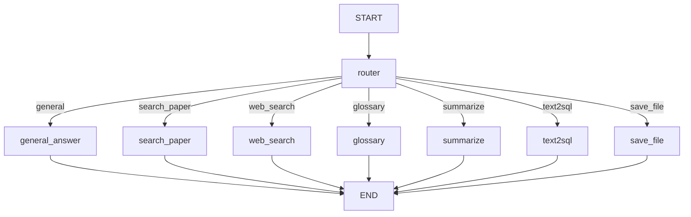

# AI Agent 시스템 Q&A

## 문서 정보
- **작성일**: 2025-11-04
- **작성자**: 최현화[팀장]
- **목적**: AI Agent 시스템 관련 자주 묻는 질문 및 답변

---

## 목차
1. [기본 개념](#1-기본-개념)
2. [라우팅 시스템](#2-라우팅-시스템)
3. [도구 실행](#3-도구-실행)
4. [상태 관리](#4-상태-관리)
5. [난이도 모드](#5-난이도-모드)
6. [트러블슈팅](#6-트러블슈팅)

---

## 1. 기본 개념

### Q1-1. AI Agent란 무엇인가요?

**A:** AI Agent는 **사용자 질문을 분석하여 적절한 도구를 자동으로 선택하고 실행하는 시스템**입니다.

**핵심 구성 요소:**
1. **Router**: 질문 분석 후 도구 선택
2. **7가지 도구**: 일반 답변, RAG 검색, 웹 검색, 용어집, 요약, Text-to-SQL, 파일 저장
3. **LangGraph**: 상태 기반 워크플로우 관리
4. **StateGraph**: 노드 간 데이터 전달

**예시 흐름:**
```
사용자: "Transformer 논문 설명해줘"
    ↓
Router: "search_paper 도구 선택"
    ↓
search_paper 도구: RAG 검색 → LLM 답변 생성
    ↓
최종 답변: "Transformer는..."
```

---

### Q1-2. LangGraph와 LangChain의 차이는?

**A:**

| 구분 | LangChain | LangGraph |
|------|-----------|-----------|
| **목적** | LLM 체인 구성 | 상태 기반 워크플로우 |
| **구조** | 선형 체인 | 그래프 (노드 + 엣지) |
| **조건부 분기** | 제한적 | 자유로운 분기 |
| **상태 관리** | 없음 | AgentState로 관리 |
| **사용 예** | 프롬프트 → LLM | Agent 라우팅, 도구 선택 |

**본 프로젝트에서:**
- **LangGraph**: Router 및 도구 라우팅
- **LangChain**: 개별 도구 내 LLM 호출, 프롬프트 관리

---

### Q1-3. Agent 그래프 구조는?

**A:** **Router → 7개 도구 노드 → END** 구조입니다.

```
START
  ↓
[Router 노드] (질문 분석, 도구 선택)
  ├→ [general_answer]
  ├→ [search_paper]
  ├→ [web_search]
  ├→ [glossary]
  ├→ [summarize]
  ├→ [text2sql]
  └→ [save_file]
      ↓
    END
```

**특징:**
- 모든 도구는 Router를 거침 (필수)
- 도구 실행 후 바로 END (체이닝 없음)
- 조건부 엣지로 도구 선택

---

## 2. 라우팅 시스템

### Q2-1. Router는 어떻게 도구를 선택하나요?

**A:** **LLM (Solar Pro2)**이 질문을 분석하여 선택합니다.

**프롬프트 예시:**
```
다음 질문에 가장 적합한 도구를 선택하세요:

[질문] Transformer 논문 설명해줘

[도구 목록]
- general_answer: 일반 상식, 인사
- search_paper: 논문 검색 및 설명
- web_search: 최신 정보 검색
- glossary: 용어 정의
- summarize: 논문 요약
- text2sql: 논문 통계
- save_file: 파일 저장

답변: search_paper
```

**LLM 설정:**
- 모델: Solar Pro2 (빠르고 저렴)
- Temperature: 0.0 (결정론적)

---

### Q2-2. Router의 라우팅 정확도는?

**A:** 프롬프트 품질에 따라 다르지만, **대부분 정확**합니다.

**정확도 향상 방법:**
1. **Few-shot 예시 추가**
   ```
   [예시 1] "안녕하세요" → general_answer
   [예시 2] "Transformer 논문 설명해줘" → search_paper
   [예시 3] "2025년 최신 논문" → web_search
   ```
2. **도구 설명 명확화**
   - "search_paper: **로컬 DB**에서 논문 검색"
   - "web_search: **웹에서 최신** 정보 검색"

3. **키워드 힌트 제공**
   - "논문 검색": title, abstract, authors 포함 시 search_paper
   - "최신", "2025년": web_search

---

### Q2-3. 잘못된 도구가 선택되면?

**A:** **Fallback 또는 사용자 피드백**으로 개선 가능합니다.

**현재 구현:**
- 잘못 선택되어도 에러 없이 실행
- 예: "Transformer 논문 설명해줘" → general_answer 선택 시
  - LLM 자체 지식으로 답변 (논문 DB 미사용)
  - 정확도는 떨어지지만 답변 가능

**향후 개선:**
1. **재라우팅**: 도구 실행 결과가 이상하면 다른 도구로 재시도
2. **사용자 피드백**: "도구 선택이 틀렸나요?" 버튼
3. **로깅**: 라우팅 실패 패턴 분석 → 프롬프트 개선

---

### Q2-4. 여러 도구를 순차 실행할 수 있나요?

**A:** **현재는 불가능**하지만, 향후 개선 예정입니다.

**현재 구조:**
- Router → 도구 1개 선택 → 실행 → END
- 도구 체이닝 미지원

**향후 개선 (도구 체이닝):**
```
질문: "Transformer 논문 요약하고 파일로 저장해줘"
    ↓
Router: [summarize, save_file] 선택
    ↓
summarize → save_file → END
```

**구현 방법:**
- AgentState에 `tool_sequence` 추가
- 각 도구 실행 후 다음 도구로 이동
- 모든 도구 완료 시 END

---

## 3. 도구 실행

### Q3-1. 도구는 어떻게 실행되나요?

**A:** **LangGraph 노드 함수**로 실행됩니다.

**코드 구조:**
```python
# src/agent/graph.py
workflow.add_node("search_paper", search_paper_with_exp)

# src/agent/nodes.py
from src.tools.search_paper import search_paper_node

# src/tools/search_paper.py
def search_paper_node(state: AgentState, exp_manager=None):
    question = state["question"]
    difficulty = state.get("difficulty", "easy")

    # RAG 검색 수행
    raw_results = search_paper_database.invoke({"query": question})

    # LLM 답변 생성
    response = llm_client.llm.invoke(messages)

    # 상태 업데이트
    state["final_answer"] = response.content
    return state
```

---

### Q3-2. 도구 실행 순서는?

**A:**
1. **Router** 실행 (질문 분석)
2. **도구 선택** (`state["tool_choice"]` 저장)
3. **선택된 도구** 실행
4. **최종 답변** 저장 (`state["final_answer"]`)
5. **END**

---

### Q3-3. 도구 실행 중 에러가 발생하면?

**A:** **에러 메시지를 `final_answer`에 저장**하고 종료합니다.

**코드 예시:**
```python
try:
    # 도구 로직
    ...
    state["final_answer"] = response.content
except Exception as e:
    state["final_answer"] = f"오류 발생: {str(e)}"
    exp_manager.logger.write(f"도구 실행 실패: {e}", print_error=True)
return state
```

**사용자에게 표시:**
```
❌ 오류 발생: PostgreSQL 연결 실패
```

---

## 4. 상태 관리

### Q4-1. AgentState란?

**A:** **Agent 그래프에서 노드 간 데이터를 전달하는 딕셔너리**입니다.

**스키마:**
```python
class AgentState(TypedDict):
    question: str           # 사용자 질문
    difficulty: str         # 난이도 (easy/hard)
    tool_choice: str        # 선택된 도구
    final_answer: str       # 최종 답변
    messages: Sequence[BaseMessage]  # 대화 메모리
```

---

### Q4-2. 상태는 어떻게 업데이트되나요?

**A:** 각 노드 함수가 `state`를 받아 수정 후 반환합니다.

**예시:**
```python
def router_node(state: AgentState, exp_manager=None):
    question = state["question"]
    tool_choice = llm.invoke(...).content.strip()

    state["tool_choice"] = tool_choice  # 상태 업데이트
    return state
```

---

### Q4-3. 대화 메모리는 어떻게 관리되나요?

**A:** **현재는 미구현** (단일 Turn 대화만 지원).

**현재 구조:**
- 각 질문은 독립적
- 이전 대화 맥락 없음

**향후 개선:**
```python
state["messages"].append(HumanMessage(content=question))
state["messages"].append(AIMessage(content=final_answer))
```

---

## 5. 난이도 모드

### Q5-1. Easy와 Hard 모드의 차이는?

**A:**

| 항목 | Easy 모드 | Hard 모드 |
|------|-----------|-----------|
| **대상** | 초심자 | 전문가 |
| **LLM** | Solar Pro2 | GPT-5 |
| **용어** | 쉬운 말 풀어쓰기 | 전문 용어 사용 |
| **수식** | 최소화 | 수식 포함 |
| **설명** | 비유/예시 중심 | 기술적 세부사항 |
| **길이** | 간결 (핵심 3가지) | 상세 (구현 포함) |

---

### Q5-2. 난이도는 언제 결정되나요?

**A:** **Streamlit UI에서 사용자가 선택**합니다.

**코드:**
```python
# ui/components/sidebar.py
difficulty_mode = st.selectbox(
    "답변 난이도 선택",
    ["Easy 모드 (초심자용)", "Hard 모드 (전문가용)"]
)

# AgentState에 전달
state = {
    "question": user_query,
    "difficulty": "easy" if "Easy" in difficulty_mode else "hard"
}
```

---

### Q5-3. 난이도를 중간에 바꿀 수 있나요?

**A:** 네, **다음 질문부터 적용**됩니다.

**동작:**
- Easy 모드로 질문 → Hard 모드로 변경 → 다음 질문은 Hard로 처리
- 이전 답변은 변경 안 됨

---

## 6. 트러블슈팅

### Q6-1. Agent가 실행되지 않아요

**체크리스트:**
1. **환경변수 확인**
   - `OPENAI_API_KEY` 또는 `SOLAR_API_KEY`
   - `DATABASE_URL` (RAG 도구 사용 시)
2. **PostgreSQL 연결**
   ```bash
   psql $DATABASE_URL -c "SELECT 1;"
   ```
3. **LangGraph 설치**
   ```bash
   pip install langgraph
   ```

---

### Q6-2. Router가 항상 general_answer만 선택해요

**원인:** 라우팅 프롬프트가 불명확하거나, LLM이 도구를 이해 못 함

**해결 방법:**
1. **프롬프트 개선** (`src/prompts/routing_prompt.json`)
   - 도구 설명 명확화
   - Few-shot 예시 추가
2. **LLM 변경**
   - Solar Pro2 → GPT-5
3. **로그 확인**
   - Router의 LLM 응답 확인
   ```
   라우팅 결정 (원본): general_answer. Transformer 논문은 검색이 필요합니다.
   ```
   → LLM이 설명까지 포함 → 파싱 필요

---

### Q6-3. 도구 실행 후 답변이 없어요

**확인 사항:**
1. **`final_answer` 설정 확인**
   ```python
   state["final_answer"] = response.content  # 필수
   ```
2. **에러 로그 확인**
   ```
   experiments/{날짜}/{세션}/logs/main.log
   ```
3. **LLM 응답 확인**
   - LLM이 빈 문자열 반환했는지

---

### Q6-4. Streamlit에서 Agent가 느려요

**원인:**
1. **LLM 호출 2번** (Router + 도구)
2. **DB 검색** (RAG, 용어집)
3. **웹 검색 API** (Tavily)

**최적화:**
1. **Router에 Solar Pro2 사용** (빠르고 저렴) ✅ 구현됨
2. **캐싱**
   ```python
   @st.cache_resource
   def initialize_agent(): ...
   ```
3. **비동기 처리** (향후)
   - Router와 도구 병렬 실행

---

### Q6-5. Agent 그래프를 시각화하려면?

**A:** Mermaid 다이어그램으로 가능합니다.

**자동 생성 (향후):**
```python
from langgraph.graph import StateGraph

workflow = StateGraph(AgentState)
# ... 노드 추가
graph_str = workflow.get_graph().draw_mermaid()
print(graph_str)
```

**수동 작성:**


---

## 참고 자료

### 관련 문서
- [06_AI_Agent_시스템.md](../modularization/06_AI_Agent_시스템.md)
- [09_도구_시스템.md](../modularization/09_도구_시스템.md)

### 구현 파일
- `src/agent/graph.py` - Agent 그래프 구성
- `src/agent/nodes.py` - 노드 함수
- `src/agent/state.py` - AgentState 정의

---

## 작성자
- **최현화[팀장]** (AI Agent 시스템 구현 및 문서화)
