# 01. 전체 아키텍처 구조

## 문서 정보
- **작성일**: 2025-11-08
- **작성자**: 최현화[팀장]
- **최종 수정일**: 2025-11-04

---

## 전체 아키텍처 (단순 흐름도)

```mermaid
graph TB
    subgraph MainFlow["📋 main.py 실행 워크플로우"]
        direction TB

        subgraph Init["🔸 초기화"]
            direction LR
            Start([▶️ python main.py]) --> LoadEnv[.env 파일<br/>환경변수 로드]
            LoadEnv --> CheckPath[ui/app.py<br/>경로 확인]
        end

        subgraph Streamlit["🔹 Streamlit 서버 시작"]
            direction LR
            RunStreamlit[Streamlit 실행<br/>ui/app.py] --> SetConfig[서버 설정<br/>port: 8501]
            SetConfig --> OpenBrowser[브라우저<br/>자동 열기]
        end

        subgraph UIInit["🔺 UI 초기화 (ui/app.py)"]
            direction LR
            PageConfig[페이지 설정<br/>제목/아이콘] --> ValidateEnv{환경변수<br/>검증}
            ValidateEnv -->|API 키 없음| ErrorStop[❌ 앱 중지]
            ValidateEnv -->|정상| InitAgent[Agent 초기화<br/>캐싱]
        end

        subgraph AgentSetup["🔶 Agent & 실험관리자 생성"]
            direction LR
            CreateExpMgr[실험관리자<br/>생성] --> CreateGraph[Agent 그래프<br/>구성]
            CreateGraph --> AddNodes[노드 추가<br/>라우터 + 7개 도구]
            AddNodes --> AddEdges[엣지 추가<br/>조건부 라우팅]
            AddEdges --> Compile[그래프<br/>컴파일]
        end

        subgraph UIRender["💡 UI 렌더링"]
            direction LR
            RenderSidebar[사이드바 렌더링<br/>난이도 선택] --> InitChat[채팅 세션<br/>초기화]
            InitChat --> ShowHistory[채팅 히스토리<br/>표시]
            ShowHistory --> WaitInput[사용자 입력<br/>대기]
        end

        subgraph UserInput["🔷 사용자 입력 처리"]
            direction LR
            InputReceived[질문 입력<br/>수신] --> SelectDiff[난이도 선택<br/>초심자/전문가]
            SelectDiff --> AddUserMsg[사용자 메시지<br/>추가]
            AddUserMsg --> ExtractKeyword[키워드 추출<br/>패턴 매칭]
            ExtractKeyword --> SelectToolInit[도구 선택<br/>우선순위]
            SelectToolInit --> ValidateTool{도구<br/>검증}
            ValidateTool -->|적합| InvokeAgent[Agent 그래프<br/>실행]
            ValidateTool -->|재선택| SelectToolInit
        end

        subgraph AgentExec["✨ Agent 실행 (LangGraph)"]
            direction LR
            RouterNode[라우터<br/>최종 도구 확정] --> SelectTool{도구<br/>선택}
            SelectTool -->|일반| GeneralNode[일반 답변]
            SelectTool -->|RAG 논문| SearchNode[RAG 논문 검색]
            SelectTool -->|Web 논문| WebNode[Web 논문 검색]
            SelectTool -->|RAG 용어| GlossaryNode[RAG 용어집 검색]
            SelectTool -->|요약| SummarizeNode[논문 요약]
            SelectTool -->|통계| Text2SQLNode[Text2SQL 통계]
            SelectTool -->|저장| SaveNode[파일 저장]
        end

        subgraph DataQuery["💾 데이터 조회"]
            direction LR
            GeneralNode --> LLMDirect[🤖 LLM<br/>직접 호출]
            SearchNode --> VectorDB[(💾 PGVector<br/>논문 임베딩)]
            GlossaryNode --> GlossaryDB[(💾 PostgreSQL<br/>glossary 테이블)]
            Text2SQLNode --> PapersDB[(💾 PostgreSQL<br/>papers 테이블)]
            WebNode --> TavilyAPI[🔍 Tavily API<br/>웹 검색]
            SummarizeNode --> SummarizeDB[(💾 PGVector<br/>논문 청크)]
        end

        subgraph FallbackChain["🔄 도구 자동 전환 (Fallback)"]
            direction LR
            GlossaryFail[RAG 용어집 검색<br/>실패] -.-> GlossaryToGeneral[일반 답변<br/>전환]
            SearchFail[RAG 논문 검색<br/>실패] -.-> SearchToWeb[Web 논문 검색<br/>전환]
            SearchToWeb -.-> WebToGeneral[일반 답변<br/>전환]
            Text2SQLFail[Text2SQL 통계<br/>실패] -.-> Text2SQLToGeneral[일반 답변<br/>전환]
        end

        subgraph FinalAnswer["✍️ 최종 답변 생성"]
            direction LR
            CheckDiff{난이도<br/>확인} -->|초보자| EasyPrompt[초보자용<br/>프롬프트]
            CheckDiff -->|전문가| HardPrompt[전문가용<br/>프롬프트]
            EasyPrompt --> GenerateLLM[LLM으로<br/>답변 생성]
            HardPrompt --> GenerateLLM
        end

        subgraph AnswerDisplay["📱 답변 표시"]
            direction LR
            DisplayAnswer[답변<br/>UI 렌더링] --> ShowBadge[도구 배지<br/>표시]
            ShowBadge --> ShowReason[선택 이유<br/>펼침 메뉴]
            ShowReason --> ExtractTerms[용어 추출<br/>DB 저장]
        end

        subgraph Evaluation["📊 답변 품질 평가"]
            direction LR
            LLMJudge[LLM-as-a-Judge<br/>품질 평가] --> EvalScore[평가 점수<br/>생성]
            EvalScore --> SaveEval[평가 결과<br/>DB 저장]
            SaveEval --> ShowEval[평가 결과<br/>UI 표시]
        end

        subgraph Continue["🔹 계속 질문"]
            direction LR
            WaitNext{계속<br/>질문?} -->|Yes| BackToInput[입력창<br/>복귀]
            WaitNext -->|No| SessionEnd[세션<br/>유지]
        end

        %% 시작/종료 노드
        Start([▶️ 시작<br/>사용자 실행]) --> Init
        SessionEnd --> End([✅ 종료<br/>브라우저 탭 닫기])

        %% 단계 간 연결
        Init --> Streamlit
        Streamlit --> UIInit
        UIInit --> AgentSetup
        AgentSetup --> UIRender
        UIRender --> UserInput
        UserInput --> AgentExec
        AgentExec --> DataQuery
        DataQuery --> FinalAnswer
        FinalAnswer --> AnswerDisplay
        AnswerDisplay --> Evaluation
        Evaluation --> Continue
        BackToInput --> UserInput
    end

    %% 메인 워크플로우 배경
    style MainFlow fill:#fffde7,stroke:#f9a825,stroke-width:4px,color:#000

    %% Subgraph 스타일
    style Init fill:#e0f7fa,stroke:#006064,stroke-width:3px,color:#000
    style Streamlit fill:#e3f2fd,stroke:#0d47a1,stroke-width:3px,color:#000
    style UIInit fill:#f3e5f5,stroke:#4a148c,stroke-width:3px,color:#000
    style AgentSetup fill:#fff3e0,stroke:#e65100,stroke-width:3px,color:#000
    style UIRender fill:#ffebee,stroke:#c62828,stroke-width:3px,color:#000
    style UserInput fill:#fce4ec,stroke:#880e4f,stroke-width:3px,color:#000
    style AgentExec fill:#e8f5e9,stroke:#1b5e20,stroke-width:3px,color:#000
    style DataQuery fill:#ede7f6,stroke:#512da8,stroke-width:3px,color:#000
    style FinalAnswer fill:#e0f2f1,stroke:#00695c,stroke-width:3px,color:#000
    style AnswerDisplay fill:#e1f5fe,stroke:#01579b,stroke-width:3px,color:#000
    style Evaluation fill:#fff9c4,stroke:#f57f17,stroke-width:3px,color:#000
    style Continue fill:#f1f8e9,stroke:#33691e,stroke-width:3px,color:#000

    %% 노드 스타일 (시작/종료)
    style Start fill:#4db6ac,stroke:#00695c,stroke-width:3px,color:#000
    style End fill:#66bb6a,stroke:#2e7d32,stroke-width:3px,color:#000

    %% 노드 스타일 (초기화 - 청록)
    style LoadEnv fill:#4dd0e1,stroke:#006064,stroke-width:2px,color:#000
    style CheckPath fill:#4dd0e1,stroke:#006064,stroke-width:2px,color:#000

    %% 노드 스타일 (Streamlit - 파랑)
    style RunStreamlit fill:#90caf9,stroke:#1976d2,stroke-width:2px,color:#000
    style SetConfig fill:#64b5f6,stroke:#1976d2,stroke-width:2px,color:#000
    style OpenBrowser fill:#42a5f5,stroke:#1565c0,stroke-width:2px,color:#000

    %% 노드 스타일 (UI 초기화 - 보라)
    style PageConfig fill:#e1bee7,stroke:#7b1fa2,stroke-width:2px,color:#000
    style ValidateEnv fill:#ce93d8,stroke:#7b1fa2,stroke-width:2px,color:#000
    style ErrorStop fill:#ef5350,stroke:#c62828,stroke-width:2px,color:#000
    style InitAgent fill:#e1bee7,stroke:#7b1fa2,stroke-width:2px,color:#000

    %% 노드 스타일 (Agent 생성 - 주황)
    style CreateExpMgr fill:#ffcc80,stroke:#f57c00,stroke-width:2px,color:#000
    style CreateGraph fill:#ffb74d,stroke:#f57c00,stroke-width:2px,color:#000
    style AddNodes fill:#ffa726,stroke:#ef6c00,stroke-width:2px,color:#000
    style AddEdges fill:#ff9800,stroke:#e65100,stroke-width:2px,color:#000
    style Compile fill:#fb8c00,stroke:#e65100,stroke-width:2px,color:#000

    %% 노드 스타일 (UI 렌더링 - 빨강)
    style RenderSidebar fill:#ef9a9a,stroke:#c62828,stroke-width:2px,color:#000
    style InitChat fill:#e57373,stroke:#c62828,stroke-width:2px,color:#000
    style ShowHistory fill:#ef5350,stroke:#b71c1c,stroke-width:2px,color:#000
    style WaitInput fill:#f44336,stroke:#b71c1c,stroke-width:2px,color:#000

    %% 노드 스타일 (사용자 입력 - 핑크)
    style InputReceived fill:#f48fb1,stroke:#ad1457,stroke-width:2px,color:#000
    style SelectDiff fill:#f48fb1,stroke:#ad1457,stroke-width:2px,color:#000
    style AddUserMsg fill:#f06292,stroke:#ad1457,stroke-width:2px,color:#000
    style ExtractKeyword fill:#f06292,stroke:#ad1457,stroke-width:2px,color:#000
    style SelectToolInit fill:#ec407a,stroke:#880e4f,stroke-width:2px,color:#000
    style ValidateTool fill:#e91e63,stroke:#880e4f,stroke-width:2px,color:#000
    style InvokeAgent fill:#ec407a,stroke:#880e4f,stroke-width:2px,color:#000

    %% 노드 스타일 (Agent 실행 - 녹색)
    style RouterNode fill:#81c784,stroke:#2e7d32,stroke-width:2px,color:#000
    style SelectTool fill:#66bb6a,stroke:#2e7d32,stroke-width:2px,color:#000
    style GeneralNode fill:#a5d6a7,stroke:#388e3c,stroke-width:2px,color:#000
    style SearchNode fill:#a5d6a7,stroke:#388e3c,stroke-width:2px,color:#000
    style WebNode fill:#a5d6a7,stroke:#388e3c,stroke-width:2px,color:#000
    style GlossaryNode fill:#a5d6a7,stroke:#388e3c,stroke-width:2px,color:#000
    style SummarizeNode fill:#a5d6a7,stroke:#388e3c,stroke-width:2px,color:#000
    style Text2SQLNode fill:#a5d6a7,stroke:#388e3c,stroke-width:2px,color:#000
    style SaveNode fill:#a5d6a7,stroke:#388e3c,stroke-width:2px,color:#000

    %% 노드 스타일 (데이터 조회 - 보라)
    style LLMDirect fill:#ce93d8,stroke:#7b1fa2,stroke-width:2px,color:#000
    style VectorDB fill:#b39ddb,stroke:#512da8,stroke-width:2px,color:#000
    style GlossaryDB fill:#b39ddb,stroke:#512da8,stroke-width:2px,color:#000
    style PapersDB fill:#b39ddb,stroke:#512da8,stroke-width:2px,color:#000
    style TavilyAPI fill:#ba68c8,stroke:#7b1fa2,stroke-width:2px,color:#000
    style SummarizeDB fill:#b39ddb,stroke:#512da8,stroke-width:2px,color:#000

    %% Subgraph 스타일 (Fallback - 주황)
    style FallbackChain fill:#fff3e0,stroke:#e65100,stroke-width:3px,color:#000

    %% 노드 스타일 (Fallback - 주황)
    style GlossaryFail fill:#ffcc80,stroke:#f57c00,stroke-width:2px,color:#000
    style GlossaryToGeneral fill:#ffb74d,stroke:#f57c00,stroke-width:2px,color:#000
    style SearchFail fill:#ffcc80,stroke:#f57c00,stroke-width:2px,color:#000
    style SearchToWeb fill:#ffa726,stroke:#ef6c00,stroke-width:2px,color:#000
    style WebToGeneral fill:#ffb74d,stroke:#f57c00,stroke-width:2px,color:#000
    style Text2SQLFail fill:#ffcc80,stroke:#f57c00,stroke-width:2px,color:#000
    style Text2SQLToGeneral fill:#ffb74d,stroke:#f57c00,stroke-width:2px,color:#000

    %% 노드 스타일 (최종 답변 생성 - 청록)
    style CheckDiff fill:#4dd0e1,stroke:#00838f,stroke-width:2px,color:#000
    style EasyPrompt fill:#26c6da,stroke:#00838f,stroke-width:2px,color:#000
    style HardPrompt fill:#26c6da,stroke:#00838f,stroke-width:2px,color:#000
    style GenerateLLM fill:#00bcd4,stroke:#00695c,stroke-width:2px,color:#000

    %% 노드 스타일 (답변 표시 - 하늘색)
    style DisplayAnswer fill:#81d4fa,stroke:#0288d1,stroke-width:2px,color:#000
    style ShowBadge fill:#4fc3f7,stroke:#0277bd,stroke-width:2px,color:#000
    style ShowReason fill:#29b6f6,stroke:#01579b,stroke-width:2px,color:#000
    style ExtractTerms fill:#03a9f4,stroke:#01579b,stroke-width:2px,color:#000

    %% 노드 스타일 (답변 품질 평가 - 노랑)
    style LLMJudge fill:#fff59d,stroke:#f9a825,stroke-width:2px,color:#000
    style EvalScore fill:#ffee58,stroke:#f57f17,stroke-width:2px,color:#000
    style SaveEval fill:#fdd835,stroke:#f57f17,stroke-width:2px,color:#000
    style ShowEval fill:#fbc02d,stroke:#ef6c00,stroke-width:2px,color:#000

    %% 노드 스타일 (계속 - 연두)
    style WaitNext fill:#9ccc65,stroke:#558b2f,stroke-width:2px,color:#000
    style BackToInput fill:#8bc34a,stroke:#33691e,stroke-width:2px,color:#000
    style SessionEnd fill:#aed581,stroke:#558b2f,stroke-width:2px,color:#000

    %% 연결선 스타일 (Continue 내부 0~1)
    linkStyle 0 stroke:#558b2f,stroke-width:2px
    linkStyle 1 stroke:#558b2f,stroke-width:2px

    %% 연결선 스타일 (시작/종료 2~3)
    linkStyle 2 stroke:#00695c,stroke-width:3px
    linkStyle 3 stroke:#2e7d32,stroke-width:3px

    %% 연결선 스타일 (초기화 4~5)
    linkStyle 4 stroke:#006064,stroke-width:2px
    linkStyle 5 stroke:#006064,stroke-width:2px

    %% 연결선 스타일 (Streamlit 6~7)
    linkStyle 6 stroke:#1976d2,stroke-width:2px
    linkStyle 7 stroke:#1976d2,stroke-width:2px

    %% 연결선 스타일 (UI 초기화 8~10)
    linkStyle 8 stroke:#7b1fa2,stroke-width:2px
    linkStyle 9 stroke:#c62828,stroke-width:2px
    linkStyle 10 stroke:#7b1fa2,stroke-width:2px

    %% 연결선 스타일 (Agent 생성 11~14)
    linkStyle 11 stroke:#f57c00,stroke-width:2px
    linkStyle 12 stroke:#f57c00,stroke-width:2px
    linkStyle 13 stroke:#f57c00,stroke-width:2px
    linkStyle 14 stroke:#f57c00,stroke-width:2px

    %% 연결선 스타일 (UI 렌더링 15~17)
    linkStyle 15 stroke:#c62828,stroke-width:2px
    linkStyle 16 stroke:#c62828,stroke-width:2px
    linkStyle 17 stroke:#c62828,stroke-width:2px

    %% 연결선 스타일 (사용자 입력 18~24)
    linkStyle 18 stroke:#ad1457,stroke-width:2px
    linkStyle 19 stroke:#ad1457,stroke-width:2px
    linkStyle 20 stroke:#ad1457,stroke-width:2px
    linkStyle 21 stroke:#ad1457,stroke-width:2px
    linkStyle 22 stroke:#ad1457,stroke-width:2px
    linkStyle 23 stroke:#880e4f,stroke-width:2px
    linkStyle 24 stroke:#ad1457,stroke-width:2px

    %% 연결선 스타일 (Agent 실행 25~32)
    linkStyle 25 stroke:#2e7d32,stroke-width:2px
    linkStyle 26 stroke:#2e7d32,stroke-width:2px
    linkStyle 27 stroke:#2e7d32,stroke-width:2px
    linkStyle 28 stroke:#2e7d32,stroke-width:2px
    linkStyle 29 stroke:#2e7d32,stroke-width:2px
    linkStyle 30 stroke:#2e7d32,stroke-width:2px
    linkStyle 31 stroke:#2e7d32,stroke-width:2px
    linkStyle 32 stroke:#2e7d32,stroke-width:2px

    %% 연결선 스타일 (데이터 조회 33~38)
    linkStyle 33 stroke:#7b1fa2,stroke-width:2px
    linkStyle 34 stroke:#512da8,stroke-width:2px
    linkStyle 35 stroke:#512da8,stroke-width:2px
    linkStyle 36 stroke:#512da8,stroke-width:2px
    linkStyle 37 stroke:#7b1fa2,stroke-width:2px
    linkStyle 38 stroke:#512da8,stroke-width:2px

    %% 연결선 스타일 (최종 답변 생성 39~42)
    linkStyle 39 stroke:#00838f,stroke-width:2px
    linkStyle 40 stroke:#00838f,stroke-width:2px
    linkStyle 41 stroke:#00838f,stroke-width:2px
    linkStyle 42 stroke:#00838f,stroke-width:2px

    %% 연결선 스타일 (답변 표시 43~45)
    linkStyle 43 stroke:#0288d1,stroke-width:2px
    linkStyle 44 stroke:#0277bd,stroke-width:2px
    linkStyle 45 stroke:#01579b,stroke-width:2px

    %% 연결선 스타일 (답변 품질 평가 46~48)
    linkStyle 46 stroke:#f9a825,stroke-width:2px
    linkStyle 47 stroke:#f57f17,stroke-width:2px
    linkStyle 48 stroke:#f57f17,stroke-width:2px

    %% 단계 간 연결 (회색 49~57)
    linkStyle 49 stroke:#616161,stroke-width:3px
    linkStyle 50 stroke:#616161,stroke-width:3px
    linkStyle 51 stroke:#616161,stroke-width:3px
    linkStyle 52 stroke:#616161,stroke-width:3px
    linkStyle 53 stroke:#616161,stroke-width:3px
    linkStyle 54 stroke:#616161,stroke-width:3px
    linkStyle 55 stroke:#616161,stroke-width:3px
    linkStyle 56 stroke:#616161,stroke-width:3px
    linkStyle 57 stroke:#616161,stroke-width:3px
```



---

## 전체 아키텍처 (상세 흐름도)

```mermaid
graph TB
    subgraph MainFlow["📋 전체 시스템 상세 실행 흐름 (main.py → UI → Agent → Tools → DB)"]
        direction TB

        subgraph Init["🔸 1단계: 프로그램 시작"]
            direction LR
            A([▶️ python main.py]) --> B[main 함수<br/>실행]
            B --> C[load_dotenv 함수<br/>.env 로드]
            C --> D[경로 확인<br/>ui/app.py]
        end

        subgraph StreamlitStart["🔹 2단계: Streamlit 서버 시작"]
            direction LR
            E[subprocess.run<br/>streamlit run ui/app.py] --> F[서버 설정<br/>port: 8501]
            F --> G[브라우저 열기<br/>localhost:8501]
        end

        subgraph UISetup["🔺 3단계: UI 초기화 (ui/app.py)"]
            direction LR
            H[st.set_page_config<br/>페이지 설정] --> I{환경변수 검증<br/>OPENAI_API_KEY}
            I -->|없음| J[st.stop<br/>앱 중지]
            I -->|있음| K[initialize_agent<br/>캐시된 초기화]
        end

        subgraph ExpMgrSetup["🔶 4단계: ExperimentManager 생성"]
            direction LR
            L[ExperimentManager<br/>생성자 호출] --> M[실험 폴더 생성<br/>experiments/YYYYMMDD/ID]
            M --> N[Logger 초기화<br/>로그 파일 생성]
            N --> O[메타데이터 저장<br/>config.json]
        end

        subgraph GraphSetup["✨ 5단계: Agent 그래프 생성 (src/agent/graph.py)"]
            direction LR
            P[create_agent_graph<br/>그래프 구성] --> Q[StateGraph<br/>AgentState 기반]
            Q --> R[노드 추가<br/>router + 7개 도구]
            R --> S[엣지 추가<br/>조건부 라우팅]
            S --> T[workflow.compile<br/>그래프 컴파일]
        end

        subgraph UIRender["💡 6단계: UI 렌더링"]
            direction LR
            U[initialize_storage<br/>Storage 초기화] --> V[initialize_chat_sessions<br/>세션 상태 초기화]
            V --> W[create_new_chat<br/>첫 채팅 자동 생성]
            W --> X[render_sidebar<br/>사이드바 렌더링]
            X --> Y[display_chat_history<br/>히스토리 표시]
        end

        subgraph UserInput["🔷 7단계: 사용자 입력 처리 (ui/components/chat_interface.py)"]
            direction LR
            Z[st.chat_input<br/>입력 대기] --> AA[입력 수신<br/>prompt]
            AA --> AB[현재 채팅 ID<br/>가져오기]
            AB --> AC[이전 메시지<br/>로드]
            AC --> AD[사용자 메시지<br/>추가]
        end

        subgraph AgentInvoke["🔸 8단계: Agent 실행 (agent_executor.invoke)"]
            direction LR
            AE[agent_executor.invoke<br/>그래프 실행] --> AF[입력 데이터<br/>question, difficulty]
            AF --> AG[메시지 히스토리<br/>messages 전달]
            AG --> AH[Streamlit Callback<br/>실시간 로깅]
        end

        subgraph RouterNode["🔹 9단계: 라우터 노드 (src/agent/nodes.py:router_node)"]
            direction LR
            AI[router_node<br/>도구 선택] --> AJ[키워드 추출<br/>패턴 매칭]
            AJ --> AK[multi_request_patterns.yaml<br/>다중 요청 패턴 확인]
            AK --> AL{다중 요청?}
            AL -->|Yes| AM[tool_pipeline 설정<br/>5단계 파이프라인]
            AL -->|No| AN[LLM 라우팅<br/>단일 도구 선택]
            AM --> AO[tool_choice 설정<br/>첫 번째 도구]
            AN --> AO
        end

        subgraph ToolWrapper["🔺 10단계: 도구 래퍼 (src/agent/tool_wrapper.py:wrap_tool_node)"]
            direction LR
            AP[wrap_tool_node<br/>도구 실행 래퍼] --> AQ[도구 함수 호출<br/>예: glossary_node]
            AQ --> AR[결과 검증<br/>성공/실패 판단]
            AR --> AS[tool_status 설정<br/>success/failed]
            AS --> AT[tool_result 저장<br/>AgentState에 저장]
        end

        subgraph ToolExecution["🔶 11단계: 도구 실행 예시 (RAG 용어집 검색)"]
            direction LR
            AU[glossary_node<br/>src/tools/glossary.py] --> AV[extract_term_from_question<br/>용어 추출]
            AV --> AW[SQL 검색<br/>glossary 테이블 ILIKE]
            AW --> AX[벡터 검색<br/>glossary_embeddings<br/>pgvector]
            AX --> AY[하이브리드 병합<br/>50% SQL + 50% Vector]
            AY --> AZ{결과 있음?}
            AZ -->|Yes| BA[tool_result 반환<br/>용어 정의]
            AZ -->|No| BB[tool_status: failed<br/>찾을 수 없습니다]
        end

        subgraph DBQuery["💾 12단계: DB 조회 (PostgreSQL + pgvector)"]
            direction LR
            BC[(PostgreSQL<br/>glossary 테이블)] --> BD[SQL 쿼리<br/>ILIKE 패턴 검색]
            BE[(PGVector<br/>glossary_embeddings)] --> BF[벡터 유사도 검색<br/>cosine_similarity]
            BD --> BG[SQL 결과<br/>정확한 매칭]
            BF --> BH[벡터 결과<br/>유사 용어]
        end

        subgraph FallbackCheck["🔷 13단계: Fallback 체크 (src/agent/graph.py:check_pipeline_or_fallback)"]
            direction LR
            BI[check_pipeline_or_fallback<br/>상태 확인] --> BJ{tool_status?}
            BJ -->|success| BK[pipeline_router<br/>다음 도구로]
            BJ -->|failed| BL[fallback_router_node<br/>Fallback 실행]
        end

        subgraph FallbackRouter["✨ 14단계: Fallback Router (src/agent/nodes.py:fallback_router_node)"]
            direction LR
            BM[fallback_router_node<br/>도구 교체] --> BN[TOOL_FALLBACKS 조회<br/>glossary → general]
            BN --> BO[tool_pipeline 수정<br/>실패 도구 교체]
            BO --> BP[tool_choice 업데이트<br/>Fallback 도구 설정]
            BP --> BQ[retry_count 증가<br/>재시도 횟수 관리]
        end

        subgraph PipelineRouter["💡 15단계: Pipeline Router (src/agent/graph.py:pipeline_router)"]
            direction LR
            BR[pipeline_router<br/>다음 도구 결정] --> BS{검색 도구<br/>성공?}
            BS -->|search_paper 성공| BT[스킵 로직<br/>web_search, general 건너뛰기]
            BS -->|web_search 성공| BU[스킵 로직<br/>general 건너뛰기]
            BS -->|일반| BV[순차 진행<br/>pipeline_index 증가]
            BT --> BW[pipeline_index 조정<br/>summarize로 직행]
            BU --> BW
            BV --> BW
        end

        subgraph ToolExecution2["🔸 16단계: 다음 도구 실행 (search_paper_node)"]
            direction LR
            BX[search_paper_node<br/>src/tools/search_paper.py] --> BY[RAGRetriever<br/>초기화]
            BY --> BZ[벡터 검색<br/>papers_embeddings]
            BZ --> CA[키워드 검색<br/>papers 테이블 FTS]
            CA --> CB[하이브리드 병합<br/>70% Vector + 30% FTS]
            CB --> CC{유사도<br/>0.5 미만?}
            CC -->|Yes| CD[tool_result 반환<br/>논문 본문]
            CC -->|No| CE[tool_status: failed<br/>찾을 수 없습니다]
        end

        subgraph DBQuery2["💾 17단계: DB 조회 (papers 테이블)"]
            direction LR
            CF[(PGVector<br/>papers_embeddings)] --> CG[벡터 검색<br/>임베딩 유사도]
            CH[(PostgreSQL<br/>papers 테이블)] --> CI[FTS 검색<br/>Full-Text Search]
            CG --> CJ[벡터 결과 70%<br/>의미적 유사도]
            CI --> CK[FTS 결과 30%<br/>키워드 매칭]
        end

        subgraph ToolExecution3["🔹 18단계: 요약 도구 실행 (summarize_node)"]
            direction LR
            CL[summarize_node<br/>src/tools/summarize.py] --> CM{파이프라인<br/>모드?}
            CM -->|Yes| CN[이전 tool_result 사용<br/>검색 결과 활용]
            CM -->|No| CO[제목 추출 후<br/>DB 검색]
            CN --> CP[난이도 매핑<br/>easy → elementary/beginner]
            CO --> CP
            CP --> CQ[프롬프트 로드<br/>get_summarize_template]
            CQ --> CR[LLM 호출<br/>LLMClient.generate]
        end

        subgraph LLMCall["🔺 19단계: LLM 호출 (src/llm/client.py)"]
            direction LR
            CS[LLMClient.generate<br/>LLM 클라이언트] --> CT[모델 선택<br/>Solar-pro2 또는 GPT-5]
            CT --> CU[프롬프트 조합<br/>시스템 + 사용자]
            CU --> CV[OpenAI API 호출<br/>chat.completions.create]
            CV --> CW[응답 수신<br/>generated_text]
            CW --> CX[토큰 사용량 계산<br/>prompt + completion]
        end

        subgraph StateUpdate["🔶 20단계: AgentState 업데이트"]
            direction LR
            CY[tool_result 저장<br/>도구 출력] --> CZ[final_answers 저장<br/>난이도별 답변]
            CZ --> DA[tool_status 저장<br/>success/failed]
            DA --> DB[messages 업데이트<br/>대화 히스토리]
            DB --> DC[metadata 저장<br/>도구명, 이유, 시간]
        end

        subgraph EndCheck["✨ 21단계: 종료 조건 확인 (src/agent/graph.py:should_end)"]
            direction LR
            DD[should_end<br/>종료 판단] --> DE{조건 확인}
            DE -->|pipeline_index 완료| DF[파이프라인 완료<br/>END]
            DE -->|final_answers 존재| DF
            DE -->|retry_count 초과| DF
            DE -->|계속| DG[다음 도구<br/>CONTINUE]
        end

        subgraph UIDisplay["💡 22단계: UI 답변 표시 (ui/components/chat_interface.py)"]
            direction LR
            DH[response 수신<br/>agent_executor 결과] --> DI[final_answers 추출<br/>난이도별 답변]
            DI --> DJ[도구 배지 표시<br/>tool_choice]
            DJ --> DK[선택 이유 표시<br/>routing_reason]
            DK --> DL[답변 텍스트<br/>st.markdown]
            DL --> DM[용어 추출<br/>extract_and_save_terms]
        end

        subgraph TermExtraction["🔷 23단계: 용어 추출 및 저장"]
            direction LR
            DN[extract_and_save_terms<br/>용어 추출] --> DO[정규식 매칭<br/>기술 용어 패턴]
            DO --> DP[LLM 용어 추출<br/>GPT로 용어 감지]
            DP --> DQ[DB 저장<br/>extracted_terms 테이블]
            DQ --> DR[UI 표시<br/>추출된 용어 목록]
        end

        subgraph Evaluation["🔸 24단계: 답변 평가 (LLM-as-a-Judge)"]
            direction LR
            DS[평가 시작<br/>사용자 클릭] --> DT[LLMClient.generate<br/>평가 프롬프트]
            DT --> DU[평가 기준<br/>정확성/완전성/명확성]
            DU --> DV[점수 계산<br/>0~100점]
            DV --> DW[DB 저장<br/>evaluations 테이블]
            DW --> DX[UI 표시<br/>평가 결과]
        end

        subgraph Continue["🔹 25단계: 계속 대화"]
            direction LR
            DY[입력창 대기<br/>st.chat_input] --> DZ{새 질문?}
            DZ -->|Yes| EA[7단계로 복귀<br/>새 질문 처리]
            DZ -->|No| EB[세션 유지<br/>대화 히스토리 보존]
        end

        subgraph End["💾 26단계: 세션 종료"]
            direction LR
            EC[브라우저 탭 닫기] --> ED[cleanup_on_exit<br/>정리 함수 호출]
            ED --> EE[빈 폴더 삭제<br/>experiments 정리]
            EE --> EF([✅ 종료])
        end

        %% 단계 간 연결
        Init --> StreamlitStart
        StreamlitStart --> UISetup
        UISetup --> ExpMgrSetup
        ExpMgrSetup --> GraphSetup
        GraphSetup --> UIRender
        UIRender --> UserInput
        UserInput --> AgentInvoke
        AgentInvoke --> RouterNode
        RouterNode --> ToolWrapper
        ToolWrapper --> ToolExecution
        ToolExecution --> DBQuery
        DBQuery --> FallbackCheck
        FallbackCheck --> FallbackRouter
        FallbackCheck --> PipelineRouter
        FallbackRouter --> PipelineRouter
        PipelineRouter --> ToolExecution2
        ToolExecution2 --> DBQuery2
        DBQuery2 --> ToolExecution3
        ToolExecution3 --> LLMCall
        LLMCall --> StateUpdate
        StateUpdate --> EndCheck
        EndCheck --> UIDisplay
        UIDisplay --> TermExtraction
        TermExtraction --> Evaluation
        Evaluation --> Continue
        Continue --> End
        EA --> UserInput
    end

    %% 메인 워크플로우 배경
    style MainFlow fill:#fffde7,stroke:#f9a825,stroke-width:4px,color:#000

    %% Subgraph 스타일
    style Init fill:#e0f7fa,stroke:#006064,stroke-width:3px,color:#000
    style StreamlitStart fill:#e1f5ff,stroke:#01579b,stroke-width:3px,color:#000
    style UISetup fill:#f3e5f5,stroke:#4a148c,stroke-width:3px,color:#000
    style ExpMgrSetup fill:#fff3e0,stroke:#e65100,stroke-width:3px,color:#000
    style GraphSetup fill:#ffebee,stroke:#c62828,stroke-width:3px,color:#000
    style UIRender fill:#fce4ec,stroke:#880e4f,stroke-width:3px,color:#000
    style UserInput fill:#e8f5e9,stroke:#1b5e20,stroke-width:3px,color:#000
    style AgentInvoke fill:#e0f2f1,stroke:#00695c,stroke-width:3px,color:#000
    style RouterNode fill:#e1f5ff,stroke:#01579b,stroke-width:3px,color:#000
    style ToolWrapper fill:#f3e5f5,stroke:#4a148c,stroke-width:3px,color:#000
    style ToolExecution fill:#e3f2fd,stroke:#0d47a1,stroke-width:3px,color:#000
    style DBQuery fill:#ede7f6,stroke:#512da8,stroke-width:3px,color:#000
    style FallbackCheck fill:#fce4ec,stroke:#880e4f,stroke-width:3px,color:#000
    style FallbackRouter fill:#ffebee,stroke:#c62828,stroke-width:3px,color:#000
    style PipelineRouter fill:#fff3e0,stroke:#e65100,stroke-width:3px,color:#000
    style ToolExecution2 fill:#e3f2fd,stroke:#0d47a1,stroke-width:3px,color:#000
    style DBQuery2 fill:#ede7f6,stroke:#512da8,stroke-width:3px,color:#000
    style ToolExecution3 fill:#e8f5e9,stroke:#1b5e20,stroke-width:3px,color:#000
    style LLMCall fill:#e0f7fa,stroke:#006064,stroke-width:3px,color:#000
    style StateUpdate fill:#fff9c4,stroke:#f57f17,stroke-width:3px,color:#000
    style EndCheck fill:#f1f8e9,stroke:#33691e,stroke-width:3px,color:#000
    style UIDisplay fill:#e1f5fe,stroke:#0277bd,stroke-width:3px,color:#000
    style TermExtraction fill:#e0f2f1,stroke:#00695c,stroke-width:3px,color:#000
    style Evaluation fill:#fff3e0,stroke:#e65100,stroke-width:3px,color:#000
    style Continue fill:#f1f8e9,stroke:#558b2f,stroke-width:3px,color:#000
    style End fill:#e8f5e9,stroke:#2e7d32,stroke-width:3px,color:#000

    %% 노드 스타일 (1단계 - 청록)
    style A fill:#4db6ac,stroke:#00695c,stroke-width:3px,color:#000
    style B fill:#4dd0e1,stroke:#006064,stroke-width:2px,color:#000
    style C fill:#4dd0e1,stroke:#006064,stroke-width:2px,color:#000
    style D fill:#4dd0e1,stroke:#006064,stroke-width:2px,color:#000

    %% 노드 스타일 (2단계 - 파랑)
    style E fill:#90caf9,stroke:#1976d2,stroke-width:2px,color:#000
    style F fill:#64b5f6,stroke:#1976d2,stroke-width:2px,color:#000
    style G fill:#42a5f5,stroke:#1565c0,stroke-width:2px,color:#000

    %% 노드 스타일 (3단계 - 보라)
    style H fill:#e1bee7,stroke:#7b1fa2,stroke-width:2px,color:#000
    style I fill:#ce93d8,stroke:#7b1fa2,stroke-width:2px,color:#000
    style J fill:#ef5350,stroke:#c62828,stroke-width:2px,color:#000
    style K fill:#e1bee7,stroke:#7b1fa2,stroke-width:2px,color:#000

    %% 노드 스타일 (4단계 - 주황)
    style L fill:#ffcc80,stroke:#f57c00,stroke-width:2px,color:#000
    style M fill:#ffb74d,stroke:#f57c00,stroke-width:2px,color:#000
    style N fill:#ffa726,stroke:#ef6c00,stroke-width:2px,color:#000
    style O fill:#ff9800,stroke:#e65100,stroke-width:2px,color:#000

    %% 노드 스타일 (5단계 - 빨강)
    style P fill:#ef9a9a,stroke:#c62828,stroke-width:2px,color:#000
    style Q fill:#e57373,stroke:#c62828,stroke-width:2px,color:#000
    style R fill:#ef5350,stroke:#b71c1c,stroke-width:2px,color:#000
    style S fill:#f44336,stroke:#b71c1c,stroke-width:2px,color:#000
    style T fill:#e53935,stroke:#b71c1c,stroke-width:2px,color:#000

    %% 노드 스타일 (6단계 - 핑크)
    style U fill:#f48fb1,stroke:#ad1457,stroke-width:2px,color:#000
    style V fill:#f06292,stroke:#ad1457,stroke-width:2px,color:#000
    style W fill:#ec407a,stroke:#880e4f,stroke-width:2px,color:#000
    style X fill:#e91e63,stroke:#880e4f,stroke-width:2px,color:#000
    style Y fill:#d81b60,stroke:#880e4f,stroke-width:2px,color:#000

    %% 노드 스타일 (7단계 - 녹색)
    style Z fill:#a5d6a7,stroke:#388e3c,stroke-width:2px,color:#000
    style AA fill:#81c784,stroke:#2e7d32,stroke-width:2px,color:#000
    style AB fill:#66bb6a,stroke:#2e7d32,stroke-width:2px,color:#000
    style AC fill:#4caf50,stroke:#1b5e20,stroke-width:2px,color:#000
    style AD fill:#43a047,stroke:#1b5e20,stroke-width:2px,color:#000

    %% 노드 스타일 (8단계 - 청록)
    style AE fill:#4dd0e1,stroke:#00838f,stroke-width:2px,color:#000
    style AF fill:#26c6da,stroke:#00838f,stroke-width:2px,color:#000
    style AG fill:#00bcd4,stroke:#00695c,stroke-width:2px,color:#000
    style AH fill:#00acc1,stroke:#00695c,stroke-width:2px,color:#000

    %% 노드 스타일 (9단계 - 파랑)
    style AI fill:#90caf9,stroke:#1976d2,stroke-width:2px,color:#000
    style AJ fill:#64b5f6,stroke:#1976d2,stroke-width:2px,color:#000
    style AK fill:#42a5f5,stroke:#1565c0,stroke-width:2px,color:#000
    style AL fill:#ce93d8,stroke:#7b1fa2,stroke-width:2px,color:#000
    style AM fill:#64b5f6,stroke:#1976d2,stroke-width:2px,color:#000
    style AN fill:#90caf9,stroke:#1976d2,stroke-width:2px,color:#000
    style AO fill:#2196f3,stroke:#1565c0,stroke-width:2px,color:#000

    %% 노드 스타일 (10단계 - 보라)
    style AP fill:#e1bee7,stroke:#7b1fa2,stroke-width:2px,color:#000
    style AQ fill:#ce93d8,stroke:#6a1b9a,stroke-width:2px,color:#000
    style AR fill:#ba68c8,stroke:#6a1b9a,stroke-width:2px,color:#000
    style AS fill:#ab47bc,stroke:#4a148c,stroke-width:2px,color:#000
    style AT fill:#9c27b0,stroke:#4a148c,stroke-width:2px,color:#000

    %% 노드 스타일 (11단계 - 파랑)
    style AU fill:#90caf9,stroke:#1976d2,stroke-width:2px,color:#000
    style AV fill:#64b5f6,stroke:#1976d2,stroke-width:2px,color:#000
    style AW fill:#42a5f5,stroke:#1565c0,stroke-width:2px,color:#000
    style AX fill:#2196f3,stroke:#1565c0,stroke-width:2px,color:#000
    style AY fill:#ce93d8,stroke:#7b1fa2,stroke-width:2px,color:#000
    style AZ fill:#ce93d8,stroke:#7b1fa2,stroke-width:2px,color:#000
    style BA fill:#64b5f6,stroke:#1976d2,stroke-width:2px,color:#000
    style BB fill:#90caf9,stroke:#1976d2,stroke-width:2px,color:#000

    %% 노드 스타일 (12단계 - 보라)
    style BC fill:#b39ddb,stroke:#512da8,stroke-width:2px,color:#000
    style BD fill:#9575cd,stroke:#512da8,stroke-width:2px,color:#000
    style BE fill:#b39ddb,stroke:#512da8,stroke-width:2px,color:#000
    style BF fill:#9575cd,stroke:#512da8,stroke-width:2px,color:#000
    style BG fill:#7e57c2,stroke:#4a148c,stroke-width:2px,color:#000
    style BH fill:#7e57c2,stroke:#4a148c,stroke-width:2px,color:#000

    %% 노드 스타일 (13단계 - 핑크)
    style BI fill:#f48fb1,stroke:#ad1457,stroke-width:2px,color:#000
    style BJ fill:#ce93d8,stroke:#7b1fa2,stroke-width:2px,color:#000
    style BK fill:#f06292,stroke:#ad1457,stroke-width:2px,color:#000
    style BL fill:#ec407a,stroke:#880e4f,stroke-width:2px,color:#000

    %% 노드 스타일 (14단계 - 빨강)
    style BM fill:#ef9a9a,stroke:#c62828,stroke-width:2px,color:#000
    style BN fill:#e57373,stroke:#c62828,stroke-width:2px,color:#000
    style BO fill:#ef5350,stroke:#b71c1c,stroke-width:2px,color:#000
    style BP fill:#f44336,stroke:#b71c1c,stroke-width:2px,color:#000
    style BQ fill:#e53935,stroke:#b71c1c,stroke-width:2px,color:#000

    %% 노드 스타일 (15단계 - 주황)
    style BR fill:#ffcc80,stroke:#f57c00,stroke-width:2px,color:#000
    style BS fill:#ce93d8,stroke:#7b1fa2,stroke-width:2px,color:#000
    style BT fill:#ffb74d,stroke:#f57c00,stroke-width:2px,color:#000
    style BU fill:#ffa726,stroke:#ef6c00,stroke-width:2px,color:#000
    style BV fill:#ff9800,stroke:#e65100,stroke-width:2px,color:#000
    style BW fill:#fb8c00,stroke:#e65100,stroke-width:2px,color:#000

    %% 노드 스타일 (16단계 - 파랑)
    style BX fill:#90caf9,stroke:#1976d2,stroke-width:2px,color:#000
    style BY fill:#64b5f6,stroke:#1976d2,stroke-width:2px,color:#000
    style BZ fill:#42a5f5,stroke:#1565c0,stroke-width:2px,color:#000
    style CA fill:#2196f3,stroke:#1565c0,stroke-width:2px,color:#000
    style CB fill:#1e88e5,stroke:#0d47a1,stroke-width:2px,color:#000
    style CC fill:#ce93d8,stroke:#7b1fa2,stroke-width:2px,color:#000
    style CD fill:#64b5f6,stroke:#1976d2,stroke-width:2px,color:#000
    style CE fill:#90caf9,stroke:#1976d2,stroke-width:2px,color:#000

    %% 노드 스타일 (17단계 - 보라)
    style CF fill:#b39ddb,stroke:#512da8,stroke-width:2px,color:#000
    style CG fill:#9575cd,stroke:#512da8,stroke-width:2px,color:#000
    style CH fill:#b39ddb,stroke:#512da8,stroke-width:2px,color:#000
    style CI fill:#9575cd,stroke:#512da8,stroke-width:2px,color:#000
    style CJ fill:#7e57c2,stroke:#4a148c,stroke-width:2px,color:#000
    style CK fill:#7e57c2,stroke:#4a148c,stroke-width:2px,color:#000

    %% 노드 스타일 (18단계 - 녹색)
    style CL fill:#81c784,stroke:#2e7d32,stroke-width:2px,color:#000
    style CM fill:#ce93d8,stroke:#7b1fa2,stroke-width:2px,color:#000
    style CN fill:#66bb6a,stroke:#2e7d32,stroke-width:2px,color:#000
    style CO fill:#4caf50,stroke:#1b5e20,stroke-width:2px,color:#000
    style CP fill:#43a047,stroke:#1b5e20,stroke-width:2px,color:#000
    style CQ fill:#388e3c,stroke:#1b5e20,stroke-width:2px,color:#000
    style CR fill:#2e7d32,stroke:#1b5e20,stroke-width:2px,color:#000

    %% 노드 스타일 (19단계 - 청록)
    style CS fill:#4dd0e1,stroke:#00838f,stroke-width:2px,color:#000
    style CT fill:#26c6da,stroke:#00838f,stroke-width:2px,color:#000
    style CU fill:#00bcd4,stroke:#00695c,stroke-width:2px,color:#000
    style CV fill:#00acc1,stroke:#00695c,stroke-width:2px,color:#000
    style CW fill:#0097a7,stroke:#006064,stroke-width:2px,color:#000
    style CX fill:#00838f,stroke:#006064,stroke-width:2px,color:#000

    %% 노드 스타일 (20단계 - 노랑)
    style CY fill:#fff59d,stroke:#f9a825,stroke-width:2px,color:#000
    style CZ fill:#ffee58,stroke:#f57f17,stroke-width:2px,color:#000
    style DA fill:#fdd835,stroke:#f57f17,stroke-width:2px,color:#000
    style DB fill:#fbc02d,stroke:#ef6c00,stroke-width:2px,color:#000
    style DC fill:#f9a825,stroke:#ef6c00,stroke-width:2px,color:#000

    %% 노드 스타일 (21단계 - 연두)
    style DD fill:#aed581,stroke:#558b2f,stroke-width:2px,color:#000
    style DE fill:#ce93d8,stroke:#7b1fa2,stroke-width:2px,color:#000
    style DF fill:#9ccc65,stroke:#558b2f,stroke-width:2px,color:#000
    style DG fill:#8bc34a,stroke:#33691e,stroke-width:2px,color:#000

    %% 노드 스타일 (22단계 - 하늘색)
    style DH fill:#81d4fa,stroke:#0288d1,stroke-width:2px,color:#000
    style DI fill:#4fc3f7,stroke:#0277bd,stroke-width:2px,color:#000
    style DJ fill:#29b6f6,stroke:#01579b,stroke-width:2px,color:#000
    style DK fill:#03a9f4,stroke:#01579b,stroke-width:2px,color:#000
    style DL fill:#039be5,stroke:#0277bd,stroke-width:2px,color:#000
    style DM fill:#0288d1,stroke:#01579b,stroke-width:2px,color:#000

    %% 노드 스타일 (23단계 - 청록)
    style DN fill:#4dd0e1,stroke:#00838f,stroke-width:2px,color:#000
    style DO fill:#26c6da,stroke:#00838f,stroke-width:2px,color:#000
    style DP fill:#00bcd4,stroke:#00695c,stroke-width:2px,color:#000
    style DQ fill:#00acc1,stroke:#00695c,stroke-width:2px,color:#000
    style DR fill:#0097a7,stroke:#006064,stroke-width:2px,color:#000

    %% 노드 스타일 (24단계 - 주황)
    style DS fill:#ffcc80,stroke:#f57c00,stroke-width:2px,color:#000
    style DT fill:#ffb74d,stroke:#f57c00,stroke-width:2px,color:#000
    style DU fill:#ffa726,stroke:#ef6c00,stroke-width:2px,color:#000
    style DV fill:#ff9800,stroke:#e65100,stroke-width:2px,color:#000
    style DW fill:#fb8c00,stroke:#e65100,stroke-width:2px,color:#000
    style DX fill:#f57c00,stroke:#ef6c00,stroke-width:2px,color:#000

    %% 노드 스타일 (25단계 - 연두)
    style DY fill:#aed581,stroke:#558b2f,stroke-width:2px,color:#000
    style DZ fill:#ce93d8,stroke:#7b1fa2,stroke-width:2px,color:#000
    style EA fill:#9ccc65,stroke:#558b2f,stroke-width:2px,color:#000
    style EB fill:#8bc34a,stroke:#33691e,stroke-width:2px,color:#000

    %% 노드 스타일 (26단계 - 녹색)
    style EC fill:#81c784,stroke:#2e7d32,stroke-width:2px,color:#000
    style ED fill:#66bb6a,stroke:#2e7d32,stroke-width:2px,color:#000
    style EE fill:#4caf50,stroke:#1b5e20,stroke-width:2px,color:#000
    style EF fill:#43a047,stroke:#1b5e20,stroke-width:3px,color:#000

    %% 연결선 스타일 (1단계 0~2)
    linkStyle 0 stroke:#006064,stroke-width:2px
    linkStyle 1 stroke:#006064,stroke-width:2px
    linkStyle 2 stroke:#006064,stroke-width:2px

    %% 연결선 스타일 (2단계 3~4)
    linkStyle 3 stroke:#1976d2,stroke-width:2px
    linkStyle 4 stroke:#1976d2,stroke-width:2px

    %% 연결선 스타일 (3단계 5~7)
    linkStyle 5 stroke:#7b1fa2,stroke-width:2px
    linkStyle 6 stroke:#c62828,stroke-width:2px
    linkStyle 7 stroke:#7b1fa2,stroke-width:2px

    %% 연결선 스타일 (4단계 8~10)
    linkStyle 8 stroke:#f57c00,stroke-width:2px
    linkStyle 9 stroke:#f57c00,stroke-width:2px
    linkStyle 10 stroke:#f57c00,stroke-width:2px

    %% 연결선 스타일 (5단계 11~14)
    linkStyle 11 stroke:#c62828,stroke-width:2px
    linkStyle 12 stroke:#c62828,stroke-width:2px
    linkStyle 13 stroke:#c62828,stroke-width:2px
    linkStyle 14 stroke:#c62828,stroke-width:2px

    %% 연결선 스타일 (6단계 15~18)
    linkStyle 15 stroke:#ad1457,stroke-width:2px
    linkStyle 16 stroke:#ad1457,stroke-width:2px
    linkStyle 17 stroke:#ad1457,stroke-width:2px
    linkStyle 18 stroke:#ad1457,stroke-width:2px

    %% 연결선 스타일 (7단계 19~22)
    linkStyle 19 stroke:#2e7d32,stroke-width:2px
    linkStyle 20 stroke:#2e7d32,stroke-width:2px
    linkStyle 21 stroke:#2e7d32,stroke-width:2px
    linkStyle 22 stroke:#2e7d32,stroke-width:2px

    %% 연결선 스타일 (8단계 23~25)
    linkStyle 23 stroke:#00838f,stroke-width:2px
    linkStyle 24 stroke:#00838f,stroke-width:2px
    linkStyle 25 stroke:#00838f,stroke-width:2px

    %% 연결선 스타일 (9단계 26~32)
    linkStyle 26 stroke:#1976d2,stroke-width:2px
    linkStyle 27 stroke:#1976d2,stroke-width:2px
    linkStyle 28 stroke:#1976d2,stroke-width:2px
    linkStyle 29 stroke:#1976d2,stroke-width:2px
    linkStyle 30 stroke:#1976d2,stroke-width:2px
    linkStyle 31 stroke:#1976d2,stroke-width:2px
    linkStyle 32 stroke:#1976d2,stroke-width:2px

    %% 연결선 스타일 (10단계 33~36)
    linkStyle 33 stroke:#7b1fa2,stroke-width:2px
    linkStyle 34 stroke:#7b1fa2,stroke-width:2px
    linkStyle 35 stroke:#7b1fa2,stroke-width:2px
    linkStyle 36 stroke:#7b1fa2,stroke-width:2px

    %% 연결선 스타일 (11단계 37~43)
    linkStyle 37 stroke:#1976d2,stroke-width:2px
    linkStyle 38 stroke:#1976d2,stroke-width:2px
    linkStyle 39 stroke:#1976d2,stroke-width:2px
    linkStyle 40 stroke:#1976d2,stroke-width:2px
    linkStyle 41 stroke:#1976d2,stroke-width:2px
    linkStyle 42 stroke:#1976d2,stroke-width:2px
    linkStyle 43 stroke:#1976d2,stroke-width:2px

    %% 연결선 스타일 (12단계 44~49)
    linkStyle 44 stroke:#512da8,stroke-width:2px
    linkStyle 45 stroke:#512da8,stroke-width:2px
    linkStyle 46 stroke:#512da8,stroke-width:2px
    linkStyle 47 stroke:#512da8,stroke-width:2px
    linkStyle 48 stroke:#512da8,stroke-width:2px
    linkStyle 49 stroke:#512da8,stroke-width:2px

    %% 연결선 스타일 (13단계 50~52)
    linkStyle 50 stroke:#ad1457,stroke-width:2px
    linkStyle 51 stroke:#ad1457,stroke-width:2px
    linkStyle 52 stroke:#880e4f,stroke-width:2px

    %% 연결선 스타일 (14단계 53~56)
    linkStyle 53 stroke:#c62828,stroke-width:2px
    linkStyle 54 stroke:#c62828,stroke-width:2px
    linkStyle 55 stroke:#c62828,stroke-width:2px
    linkStyle 56 stroke:#c62828,stroke-width:2px

    %% 연결선 스타일 (15단계 57~62)
    linkStyle 57 stroke:#f57c00,stroke-width:2px
    linkStyle 58 stroke:#f57c00,stroke-width:2px
    linkStyle 59 stroke:#f57c00,stroke-width:2px
    linkStyle 60 stroke:#f57c00,stroke-width:2px
    linkStyle 61 stroke:#f57c00,stroke-width:2px
    linkStyle 62 stroke:#f57c00,stroke-width:2px

    %% 연결선 스타일 (16단계 63~69)
    linkStyle 63 stroke:#1976d2,stroke-width:2px
    linkStyle 64 stroke:#1976d2,stroke-width:2px
    linkStyle 65 stroke:#1976d2,stroke-width:2px
    linkStyle 66 stroke:#1976d2,stroke-width:2px
    linkStyle 67 stroke:#1976d2,stroke-width:2px
    linkStyle 68 stroke:#1976d2,stroke-width:2px
    linkStyle 69 stroke:#1976d2,stroke-width:2px

    %% 연결선 스타일 (17단계 70~75)
    linkStyle 70 stroke:#512da8,stroke-width:2px
    linkStyle 71 stroke:#512da8,stroke-width:2px
    linkStyle 72 stroke:#512da8,stroke-width:2px
    linkStyle 73 stroke:#512da8,stroke-width:2px
    linkStyle 74 stroke:#512da8,stroke-width:2px
    linkStyle 75 stroke:#512da8,stroke-width:2px

    %% 연결선 스타일 (18단계 76~82)
    linkStyle 76 stroke:#2e7d32,stroke-width:2px
    linkStyle 77 stroke:#2e7d32,stroke-width:2px
    linkStyle 78 stroke:#2e7d32,stroke-width:2px
    linkStyle 79 stroke:#2e7d32,stroke-width:2px
    linkStyle 80 stroke:#2e7d32,stroke-width:2px
    linkStyle 81 stroke:#2e7d32,stroke-width:2px
    linkStyle 82 stroke:#2e7d32,stroke-width:2px

    %% 연결선 스타일 (19단계 83~86)
    linkStyle 83 stroke:#00838f,stroke-width:2px
    linkStyle 84 stroke:#00838f,stroke-width:2px
    linkStyle 85 stroke:#00838f,stroke-width:2px
    linkStyle 86 stroke:#00838f,stroke-width:2px
```