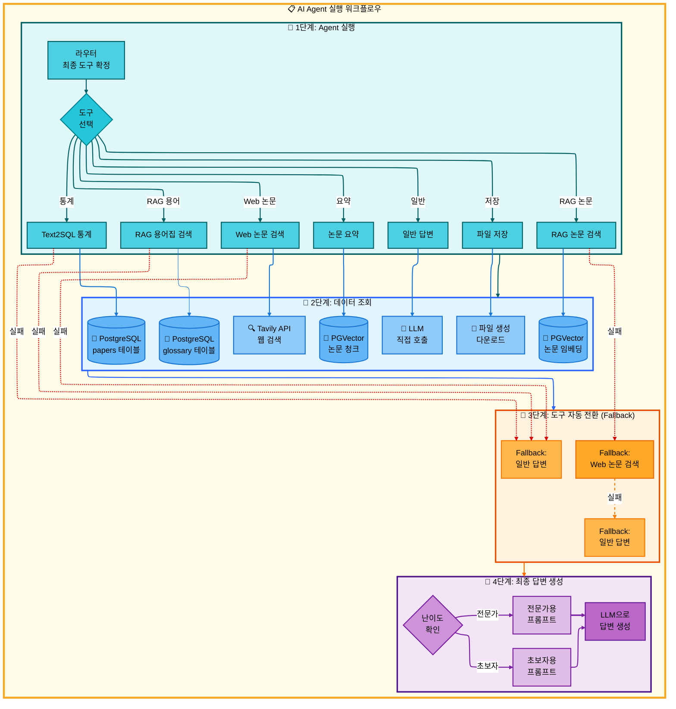

```mermaid
---
config:
  theme: neutral
  layout: elk
---
flowchart TB
 subgraph Stage1["🔸 1단계: Agent 실행"]
    direction LR
        B{"도구<br>선택"}
        A["라우터<br>최종 도구 확정"]
        C["일반 답변"]
        D["RAG 논문 검색"]
        E["Web 논문 검색"]
        F["RAG 용어집 검색"]
        G["논문 요약"]
        H["Text2SQL 통계"]
        I["파일 저장"]
  end
 subgraph Stage2["🔹 2단계: 데이터 조회"]
    direction LR
        J["🤖 LLM<br>직접 호출"]
        K[("💾 PGVector<br>논문 임베딩")]
        N["🔍 Tavily API<br>웹 검색"]
        L[("💾 PostgreSQL<br>glossary 테이블")]
        O[("💾 PGVector<br>논문 청크")]
        M[("💾 PostgreSQL<br>papers 테이블")]
        P["💾 파일 생성<br>다운로드"]
  end
 subgraph Stage3["🔺 3단계: 도구 자동 전환 (Fallback)"]
    direction LR
        Q["Fallback:<br>일반 답변"]
        R["Fallback:<br>Web 논문 검색"]
        S["Fallback:<br>일반 답변"]
  end
 subgraph Stage4["🔶 4단계: 최종 답변 생성"]
    direction LR
        X["초보자용<br>프롬프트"]
        W{"난이도<br>확인"}
        Y["전문가용<br>프롬프트"]
        Z["LLM으로<br>답변 생성"]
  end
 subgraph MainFlow["📋 AI Agent 실행 워크플로우"]
    direction TB
        Stage1
        Stage2
        Stage3
        Stage4
  end
    A --> B
    B -- 일반 --> C
    B -- RAG 논문 --> D
    B -- Web 논문 --> E
    B -- RAG 용어 --> F
    B -- 요약 --> G
    B -- 통계 --> H
    B -- 저장 --> I
    C --> J
    D --> K
    E --> N
    F --> L
    G --> O
    H --> M
    I --> P
    F -. 실패 .-> Q
    D -. 실패 .-> R
    E -. 실패 .-> Q
    H -. 실패 .-> Q
    R -. 실패 .-> S
    W -- 초보자 --> X
    W -- 전문가 --> Y
    X --> Z
    Y --> Z
    Stage1 ==> Stage2
    Stage2 ==> Stage3
    Stage3 --> Stage4
    style B fill:#26c6da,stroke:#00838f,stroke-width:2px,color:#000
    style A fill:#4dd0e1,stroke:#006064,stroke-width:2px,color:#000
    style C fill:#4dd0e1,stroke:#006064,stroke-width:2px,color:#000
    style D fill:#4dd0e1,stroke:#006064,stroke-width:2px,color:#000
    style E fill:#4dd0e1,stroke:#006064,stroke-width:2px,color:#000
    style F fill:#4dd0e1,stroke:#006064,stroke-width:2px,color:#000
    style G fill:#4dd0e1,stroke:#006064,stroke-width:2px,color:#000
    style H fill:#4dd0e1,stroke:#006064,stroke-width:2px,color:#000
    style I fill:#4dd0e1,stroke:#006064,stroke-width:2px,color:#000
    style J fill:#90caf9,stroke:#1976d2,stroke-width:2px,color:#000
    style K fill:#64b5f6,stroke:#1976d2,stroke-width:2px,color:#000
    style N fill:#90caf9,stroke:#1976d2,stroke-width:2px,color:#000
    style L fill:#64b5f6,stroke:#1976d2,stroke-width:2px,color:#000
    style O fill:#64b5f6,stroke:#1976d2,stroke-width:2px,color:#000
    style M fill:#64b5f6,stroke:#1976d2,stroke-width:2px,color:#000
    style P fill:#90caf9,stroke:#1976d2,stroke-width:2px,color:#000
    style Q fill:#ffb74d,stroke:#f57c00,stroke-width:2px,color:#000
    style R fill:#ffa726,stroke:#ef6c00,stroke-width:2px,color:#000
    style S fill:#ffb74d,stroke:#f57c00,stroke-width:2px,color:#000
    style X fill:#e1bee7,stroke:#7b1fa2,stroke-width:2px,color:#000
    style W fill:#ce93d8,stroke:#7b1fa2,stroke-width:2px,color:#000
    style Y fill:#e1bee7,stroke:#7b1fa2,stroke-width:2px,color:#000
    style Z fill:#ba68c8,stroke:#6a1b9a,stroke-width:2px,color:#000
    style Stage1 fill:#e0f7fa,stroke:#006064,stroke-width:3px,color:#000
    style Stage2 fill:#e1f5fe,stroke:#2962FF,stroke-width:3px,color:#000
    style Stage3 fill:#fff3e0,stroke:#e65100,stroke-width:3px,color:#000
    style Stage4 fill:#f3e5f5,stroke:#4a148c,stroke-width:3px,color:#000
    style MainFlow fill:#fffde7,stroke:#f9a825,stroke-width:4px,color:#000
    linkStyle 0 stroke:#006064,stroke-width:2px,fill:none
    linkStyle 1 stroke:#006064,stroke-width:2px,fill:none
    linkStyle 2 stroke:#006064,stroke-width:2px,fill:none
    linkStyle 3 stroke:#006064,stroke-width:2px,fill:none
    linkStyle 4 stroke:#006064,stroke-width:2px,fill:none
    linkStyle 5 stroke:#006064,stroke-width:2px,fill:none
    linkStyle 6 stroke:#006064,stroke-width:2px,fill:none
    linkStyle 7 stroke:#006064,stroke-width:2px,fill:none
    linkStyle 8 stroke:#1976d2,stroke-width:2px,fill:none
    linkStyle 9 stroke:#1976d2,stroke-width:2px,fill:none
    linkStyle 10 stroke:#1976d2,stroke-width:2px,fill:none
    linkStyle 11 stroke:#1976d2,fill:none
    linkStyle 12 stroke:#1976d2,stroke-width:2px,fill:none
    linkStyle 13 stroke:#1976d2,stroke-width:2px,fill:none
    linkStyle 14 stroke:#1976d2,stroke-width:2px,fill:none
    linkStyle 15 stroke:#D50000,fill:none,stroke-width:2px,fill:none
    linkStyle 16 stroke:#D50000,fill:none,stroke-width:2px,fill:none
    linkStyle 17 stroke:#D50000,fill:none,stroke-width:2px,fill:none
    linkStyle 18 stroke:#D50000,stroke-width:2px,fill:none
    linkStyle 19 stroke:#f57c00,stroke-width:2px,stroke-dasharray:5,fill:none
    linkStyle 20 stroke:#7b1fa2,stroke-width:2px,fill:none
    linkStyle 21 stroke:#7b1fa2,stroke-width:2px,fill:none
    linkStyle 22 stroke:#7b1fa2,stroke-width:2px,fill:none
    linkStyle 23 stroke:#7b1fa2,stroke-width:3px,fill:none
    linkStyle 24 stroke:#006064,fill:none,stroke-width:2px,fill:none
    linkStyle 25 stroke:#2962FF,fill:none,stroke-width:2px,fill:none
    linkStyle 26 stroke:#FF6D00,fill:none,stroke-width:2px,fill:none
```