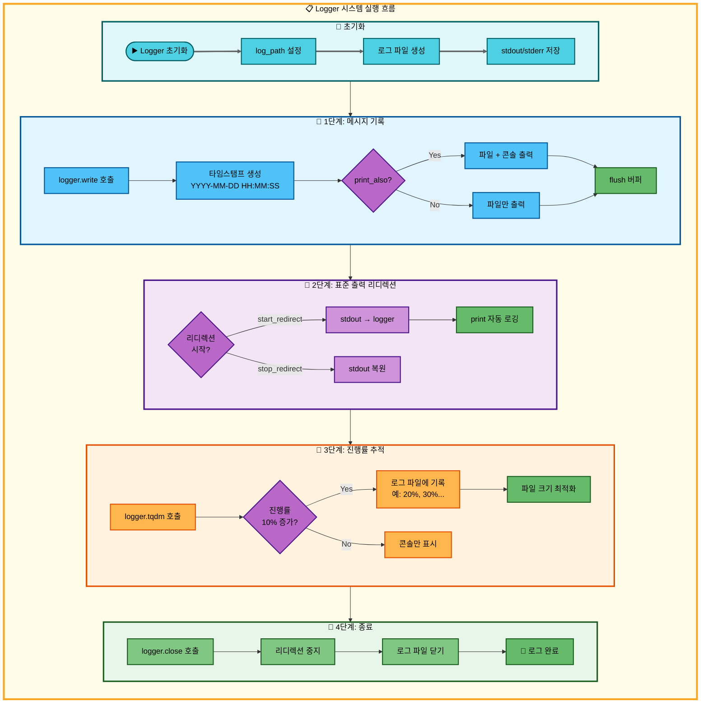
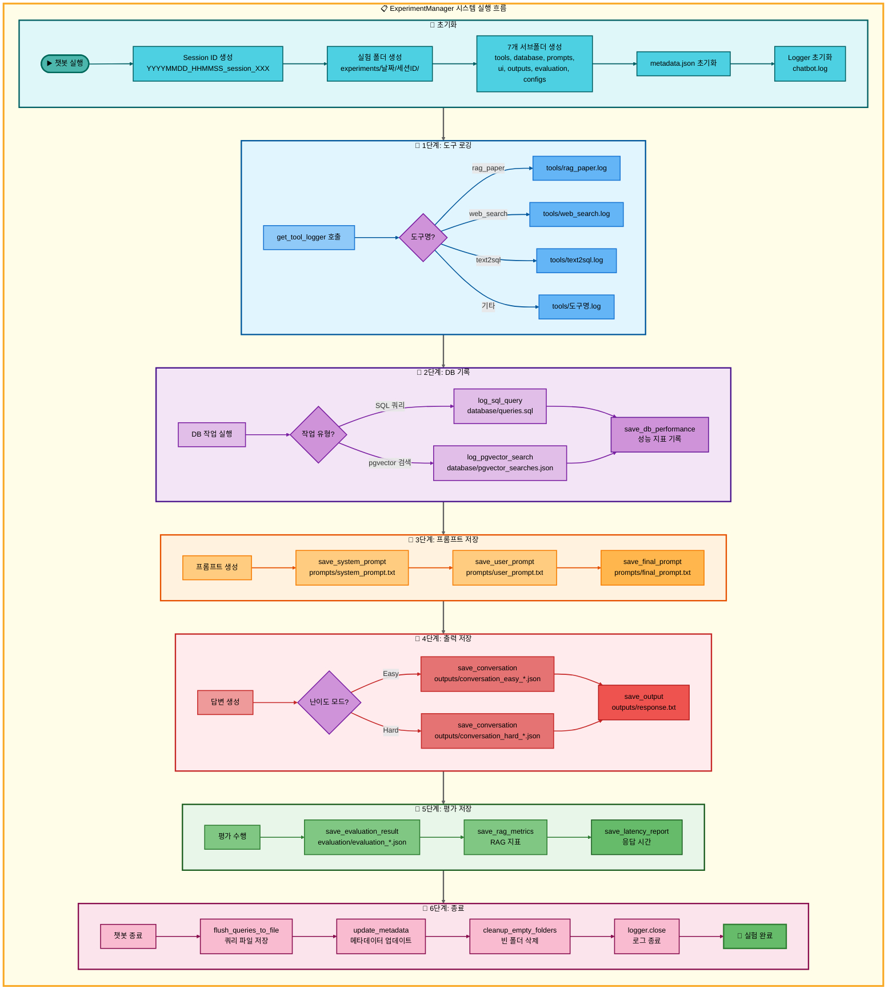

**Logger 시스템 아키텍처**:

```mermaid
graph TB
    subgraph MainFlow["📋 Logger 시스템 실행 흐름"]
        direction TB

        subgraph Init["🔸 초기화"]
            direction LR
            A([▶️ Logger 초기화]) --> B[log_path 설정]
            B --> C[로그 파일 생성]
            C --> D[stdout/stderr 저장]
        end

        subgraph Write["🔹 1단계: 메시지 기록"]
            direction LR
            E[logger.write 호출] --> F[타임스탬프 생성<br/>YYYY-MM-DD HH:MM:SS]
            F --> G{print_also?}
            G -->|Yes| H[파일 + 콘솔 출력]
            G -->|No| I[파일만 출력]
            H --> J[flush 버퍼]
            I --> J
        end

        subgraph Redirect["🔺 2단계: 표준 출력 리디렉션"]
            direction LR
            K{리디렉션<br/>시작?} -->|start_redirect| L[stdout → logger]
            K -->|stop_redirect| M[stdout 복원]
            L --> N[print 자동 로깅]
        end

        subgraph Progress["🔶 3단계: 진행률 추적"]
            direction LR
            O[logger.tqdm 호출] --> P{진행률<br/>10% 증가?}
            P -->|Yes| Q[로그 파일에 기록<br/>예: 20%, 30%...]
            P -->|No| R[콘솔만 표시]
            Q --> S[파일 크기 최적화]
        end

        subgraph Close["🔷 4단계: 종료"]
            direction LR
            T[logger.close 호출] --> U[리디렉션 중지]
            U --> V[로그 파일 닫기]
            V --> W[💾 로그 완료]
        end

        Init --> Write
        Write --> Redirect
        Redirect --> Progress
        Progress --> Close
    end

    %% 메인 워크플로우 배경
    style MainFlow fill:#fffde7,stroke:#f9a825,stroke-width:4px,color:#000

    %% Subgraph 스타일
    style Init fill:#e0f7fa,stroke:#006064,stroke-width:3px,color:#000
    style Write fill:#e1f5ff,stroke:#01579b,stroke-width:3px,color:#000
    style Redirect fill:#f3e5f5,stroke:#4a148c,stroke-width:3px,color:#000
    style Progress fill:#fff3e0,stroke:#e65100,stroke-width:3px,color:#000
    style Close fill:#e8f5e9,stroke:#1b5e20,stroke-width:3px,color:#000

    %% 노드 스타일 - 초기화
    style A fill:#4dd0e1,stroke:#006064,stroke-width:2px,color:#000
    style B fill:#4dd0e1,stroke:#006064,stroke-width:2px,color:#000
    style C fill:#4dd0e1,stroke:#006064,stroke-width:2px,color:#000
    style D fill:#4dd0e1,stroke:#006064,stroke-width:2px,color:#000

    %% 노드 스타일 - 1단계
    style E fill:#4fc3f7,stroke:#01579b,stroke-width:2px,color:#000
    style F fill:#4fc3f7,stroke:#01579b,stroke-width:2px,color:#000
    style G fill:#ba68c8,stroke:#4a148c,stroke-width:2px,color:#000
    style H fill:#4fc3f7,stroke:#01579b,stroke-width:2px,color:#000
    style I fill:#4fc3f7,stroke:#01579b,stroke-width:2px,color:#000
    style J fill:#66bb6a,stroke:#1b5e20,stroke-width:2px,color:#000

    %% 노드 스타일 - 2단계
    style K fill:#ba68c8,stroke:#4a148c,stroke-width:2px,color:#000
    style L fill:#ce93d8,stroke:#4a148c,stroke-width:2px,color:#000
    style M fill:#ce93d8,stroke:#4a148c,stroke-width:2px,color:#000
    style N fill:#66bb6a,stroke:#1b5e20,stroke-width:2px,color:#000

    %% 노드 스타일 - 3단계
    style O fill:#ffb74d,stroke:#e65100,stroke-width:2px,color:#000
    style P fill:#ba68c8,stroke:#4a148c,stroke-width:2px,color:#000
    style Q fill:#ffb74d,stroke:#e65100,stroke-width:2px,color:#000
    style R fill:#ffb74d,stroke:#e65100,stroke-width:2px,color:#000
    style S fill:#66bb6a,stroke:#1b5e20,stroke-width:2px,color:#000

    %% 노드 스타일 - 4단계
    style T fill:#81c784,stroke:#1b5e20,stroke-width:2px,color:#000
    style U fill:#81c784,stroke:#1b5e20,stroke-width:2px,color:#000
    style V fill:#81c784,stroke:#1b5e20,stroke-width:2px,color:#000
    style W fill:#66bb6a,stroke:#1b5e20,stroke-width:2px,color:#000

    %% 단계 간 연결
    linkStyle 0 stroke:#616161,stroke-width:3px
    linkStyle 1 stroke:#616161,stroke-width:3px
    linkStyle 2 stroke:#616161,stroke-width:3px
```

---

**ExperimentManager 시스템 아키텍처**:

```mermaid
graph TB
    subgraph MainFlow["📋 실험 폴더 자동 관리 시스템"]
        direction TB

        subgraph Init["🔸 초기화"]
            direction LR
            A([▶️ 챗봇 시작]) --> B[세션 ID<br/>자동 부여]
            B --> C[실험 폴더<br/>생성]
            C --> D[7개 서브폴더<br/>자동 생성]
            D --> E[메타데이터<br/>초기화]
            E --> F[로그 시스템<br/>준비 완료]
        end

        subgraph Tools["🔹 1단계: 도구 실행 기록"]
            direction LR
            G[도구 선택] --> H{도구 종류}
            H -->|RAG 용어집| I[용어집 검색<br/>로그 기록]
            H -->|RAG 논문| J[논문 검색<br/>로그 기록]
            H -->|웹 검색| K[웹 검색<br/>로그 기록]
            H -->|논문 요약| L[논문 요약<br/>로그 기록]
            H -->|통계 조회| M[Text2SQL<br/>로그 기록]
            H -->|일반 답변| N[일반 답변<br/>로그 기록]
            H -->|파일 저장| O[파일 저장<br/>로그 기록]
        end

        subgraph Database["🔺 2단계: 데이터베이스 작업 기록"]
            direction LR
            P[DB 작업 실행] --> Q{작업 유형}
            Q -->|SQL 쿼리| R[쿼리 내용<br/>자동 저장]
            Q -->|벡터 검색| S[검색 결과<br/>자동 저장]
            R --> T[성능 지표<br/>수집]
            S --> T
        end

        subgraph Prompts["🔶 3단계: 프롬프트 보관"]
            direction LR
            U[프롬프트 생성] --> V[시스템<br/>프롬프트 저장]
            V --> W[사용자<br/>질문 저장]
            W --> X[최종<br/>프롬프트 저장]
        end

        subgraph Outputs["🔷 4단계: 답변 저장"]
            direction LR
            Y[답변 완성] --> Z{난이도 모드}
            Z -->|초보자| AA[초보자용<br/>대화 저장]
            Z -->|전문가| AB[전문가용<br/>대화 저장]
            AA --> AC[최종 답변<br/>텍스트 저장]
            AB --> AC
        end

        subgraph Evaluation["🔻 5단계: 평가 결과 저장"]
            direction LR
            AD[품질 평가<br/>수행] --> AE[평가 점수<br/>저장]
            AE --> AF[RAG 성능<br/>지표 저장]
            AF --> AG[응답 시간<br/>기록]
        end

        subgraph Close["🔷 6단계: 종료 및 정리"]
            direction LR
            AH[대화 종료] --> AI[DB 쿼리<br/>파일 저장]
            AI --> AJ[메타데이터<br/>최종 업데이트]
            AJ --> AK[빈 폴더<br/>자동 삭제]
            AK --> AL[로그 시스템<br/>종료]
            AL --> AM[💾 실험 완료]
        end

        Init --> Tools
        Tools --> Database
        Database --> Prompts
        Prompts --> Outputs
        Outputs --> Evaluation
        Evaluation --> Close
    end

    %% 메인 워크플로우 배경
    style MainFlow fill:#fffde7,stroke:#f9a825,stroke-width:4px,color:#000

    %% Subgraph 스타일
    style Init fill:#e0f7fa,stroke:#006064,stroke-width:3px,color:#000
    style Tools fill:#e1f5ff,stroke:#01579b,stroke-width:3px,color:#000
    style Database fill:#f3e5f5,stroke:#4a148c,stroke-width:3px,color:#000
    style Prompts fill:#fff3e0,stroke:#e65100,stroke-width:3px,color:#000
    style Outputs fill:#ffebee,stroke:#c62828,stroke-width:3px,color:#000
    style Evaluation fill:#e8f5e9,stroke:#1b5e20,stroke-width:3px,color:#000
    style Close fill:#fce4ec,stroke:#880e4f,stroke-width:3px,color:#000

    %% 노드 스타일 - 초기화
    style A fill:#4db6ac,stroke:#00695c,stroke-width:3px,color:#000
    style B fill:#4dd0e1,stroke:#006064,stroke-width:2px,color:#000
    style C fill:#4dd0e1,stroke:#006064,stroke-width:2px,color:#000
    style D fill:#4dd0e1,stroke:#006064,stroke-width:2px,color:#000
    style E fill:#4dd0e1,stroke:#006064,stroke-width:2px,color:#000
    style F fill:#4dd0e1,stroke:#006064,stroke-width:2px,color:#000

    %% 노드 스타일 - 1단계 (7개 도구)
    style G fill:#90caf9,stroke:#1976d2,stroke-width:2px,color:#000
    style H fill:#ce93d8,stroke:#7b1fa2,stroke-width:2px,color:#000
    style I fill:#64b5f6,stroke:#1976d2,stroke-width:2px,color:#000
    style J fill:#64b5f6,stroke:#1976d2,stroke-width:2px,color:#000
    style K fill:#64b5f6,stroke:#1976d2,stroke-width:2px,color:#000
    style L fill:#64b5f6,stroke:#1976d2,stroke-width:2px,color:#000
    style M fill:#64b5f6,stroke:#1976d2,stroke-width:2px,color:#000
    style N fill:#64b5f6,stroke:#1976d2,stroke-width:2px,color:#000
    style O fill:#64b5f6,stroke:#1976d2,stroke-width:2px,color:#000

    %% 노드 스타일 - 2단계
    style P fill:#e1bee7,stroke:#7b1fa2,stroke-width:2px,color:#000
    style Q fill:#ce93d8,stroke:#7b1fa2,stroke-width:2px,color:#000
    style R fill:#e1bee7,stroke:#7b1fa2,stroke-width:2px,color:#000
    style S fill:#e1bee7,stroke:#7b1fa2,stroke-width:2px,color:#000
    style T fill:#ce93d8,stroke:#6a1b9a,stroke-width:2px,color:#000

    %% 노드 스타일 - 3단계
    style U fill:#ffcc80,stroke:#f57c00,stroke-width:2px,color:#000
    style V fill:#ffcc80,stroke:#f57c00,stroke-width:2px,color:#000
    style W fill:#ffcc80,stroke:#f57c00,stroke-width:2px,color:#000
    style X fill:#ffb74d,stroke:#f57c00,stroke-width:2px,color:#000

    %% 노드 스타일 - 4단계
    style Y fill:#ef9a9a,stroke:#c62828,stroke-width:2px,color:#000
    style Z fill:#ce93d8,stroke:#7b1fa2,stroke-width:2px,color:#000
    style AA fill:#e57373,stroke:#c62828,stroke-width:2px,color:#000
    style AB fill:#e57373,stroke:#c62828,stroke-width:2px,color:#000
    style AC fill:#ef5350,stroke:#b71c1c,stroke-width:2px,color:#000

    %% 노드 스타일 - 5단계
    style AD fill:#81c784,stroke:#2e7d32,stroke-width:2px,color:#000
    style AE fill:#81c784,stroke:#2e7d32,stroke-width:2px,color:#000
    style AF fill:#81c784,stroke:#2e7d32,stroke-width:2px,color:#000
    style AG fill:#66bb6a,stroke:#1b5e20,stroke-width:2px,color:#000

    %% 노드 스타일 - 6단계
    style AH fill:#f8bbd0,stroke:#880e4f,stroke-width:2px,color:#000
    style AI fill:#f8bbd0,stroke:#880e4f,stroke-width:2px,color:#000
    style AJ fill:#f8bbd0,stroke:#880e4f,stroke-width:2px,color:#000
    style AK fill:#f8bbd0,stroke:#880e4f,stroke-width:2px,color:#000
    style AL fill:#f8bbd0,stroke:#880e4f,stroke-width:2px,color:#000
    style AM fill:#66bb6a,stroke:#2e7d32,stroke-width:3px,color:#000

    %% 연결선 스타일 - 초기화 (0~4)
    linkStyle 0 stroke:#006064,stroke-width:2px
    linkStyle 1 stroke:#006064,stroke-width:2px
    linkStyle 2 stroke:#006064,stroke-width:2px
    linkStyle 3 stroke:#006064,stroke-width:2px
    linkStyle 4 stroke:#006064,stroke-width:2px

    %% 연결선 스타일 - 1단계 7개 도구 (5~11)
    linkStyle 5 stroke:#01579b,stroke-width:2px
    linkStyle 6 stroke:#01579b,stroke-width:2px
    linkStyle 7 stroke:#01579b,stroke-width:2px
    linkStyle 8 stroke:#01579b,stroke-width:2px
    linkStyle 9 stroke:#01579b,stroke-width:2px
    linkStyle 10 stroke:#01579b,stroke-width:2px
    linkStyle 11 stroke:#01579b,stroke-width:2px
    linkStyle 12 stroke:#01579b,stroke-width:2px

    %% 연결선 스타일 - 2단계 (13~17)
    linkStyle 13 stroke:#7b1fa2,stroke-width:2px
    linkStyle 14 stroke:#7b1fa2,stroke-width:2px
    linkStyle 15 stroke:#7b1fa2,stroke-width:2px
    linkStyle 16 stroke:#7b1fa2,stroke-width:2px
    linkStyle 17 stroke:#7b1fa2,stroke-width:2px

    %% 연결선 스타일 - 3단계 (18~20)
    linkStyle 18 stroke:#e65100,stroke-width:2px
    linkStyle 19 stroke:#e65100,stroke-width:2px
    linkStyle 20 stroke:#e65100,stroke-width:2px

    %% 연결선 스타일 - 4단계 (21~25)
    linkStyle 21 stroke:#c62828,stroke-width:2px
    linkStyle 22 stroke:#c62828,stroke-width:2px
    linkStyle 23 stroke:#c62828,stroke-width:2px
    linkStyle 24 stroke:#c62828,stroke-width:2px
    linkStyle 25 stroke:#c62828,stroke-width:2px

    %% 연결선 스타일 - 5단계 (26~28)
    linkStyle 26 stroke:#2e7d32,stroke-width:2px
    linkStyle 27 stroke:#2e7d32,stroke-width:2px
    linkStyle 28 stroke:#2e7d32,stroke-width:2px

    %% 연결선 스타일 - 6단계 (29~33)
    linkStyle 29 stroke:#880e4f,stroke-width:2px
    linkStyle 30 stroke:#880e4f,stroke-width:2px
    linkStyle 31 stroke:#880e4f,stroke-width:2px
    linkStyle 32 stroke:#880e4f,stroke-width:2px
    linkStyle 33 stroke:#880e4f,stroke-width:2px

    %% 단계 간 연결 (34~39)
    linkStyle 34 stroke:#616161,stroke-width:3px
    linkStyle 35 stroke:#616161,stroke-width:3px
    linkStyle 36 stroke:#616161,stroke-width:3px
    linkStyle 37 stroke:#616161,stroke-width:3px
    linkStyle 38 stroke:#616161,stroke-width:3px
    linkStyle 39 stroke:#616161,stroke-width:3px
```

---

**ExperimentManager 시스템 아키텍처(상세 흐름도)**:

```mermaid
graph TB
    subgraph MainFlow["📋 ExperimentManager 시스템 실행 흐름"]
        direction TB

        subgraph Init["🔸 초기화"]
            direction LR
            A([▶️ 챗봇 실행]) --> B[Session ID 생성<br/>YYYYMMDD_HHMMSS_session_XXX]
            B --> C[실험 폴더 생성<br/>experiments/날짜/세션ID/]
            C --> D[7개 서브폴더 생성<br/>tools, database, prompts,<br/>ui, outputs, evaluation, configs]
            D --> E[metadata.json 초기화]
            E --> F[Logger 초기화<br/>chatbot.log]
        end

        subgraph Tools["🔹 1단계: 도구 로깅"]
            direction LR
            G[get_tool_logger 호출] --> H{도구명?}
            H -->|rag_paper| I[tools/rag_paper.log]
            H -->|web_search| J[tools/web_search.log]
            H -->|text2sql| K[tools/text2sql.log]
            H -->|기타| L[tools/도구명.log]
        end

        subgraph Database["🔺 2단계: DB 기록"]
            direction LR
            M[DB 작업 실행] --> N{작업 유형?}
            N -->|SQL 쿼리| O[log_sql_query<br/>database/queries.sql]
            N -->|pgvector 검색| P[log_pgvector_search<br/>database/pgvector_searches.json]
            O --> Q[save_db_performance<br/>성능 지표 기록]
            P --> Q
        end

        subgraph Prompts["🔶 3단계: 프롬프트 저장"]
            direction LR
            R[프롬프트 생성] --> S[save_system_prompt<br/>prompts/system_prompt.txt]
            S --> T[save_user_prompt<br/>prompts/user_prompt.txt]
            T --> U[save_final_prompt<br/>prompts/final_prompt.txt]
        end

        subgraph Outputs["🔷 4단계: 출력 저장"]
            direction LR
            V[답변 생성] --> W{난이도 모드?}
            W -->|Easy| X[save_conversation<br/>outputs/conversation_easy_*.json]
            W -->|Hard| Y[save_conversation<br/>outputs/conversation_hard_*.json]
            X --> Z[save_output<br/>outputs/response.txt]
            Y --> Z
        end

        subgraph Evaluation["🔻 5단계: 평가 저장"]
            direction LR
            AA[평가 수행] --> AB[save_evaluation_result<br/>evaluation/evaluation_*.json]
            AB --> AC[save_rag_metrics<br/>RAG 지표]
            AC --> AD[save_latency_report<br/>응답 시간]
        end

        subgraph Close["🔷 6단계: 종료"]
            direction LR
            AE[챗봇 종료] --> AF[flush_queries_to_file<br/>쿼리 파일 저장]
            AF --> AG[update_metadata<br/>메타데이터 업데이트]
            AG --> AH[cleanup_empty_folders<br/>빈 폴더 삭제]
            AH --> AI[logger.close<br/>로그 종료]
            AI --> AJ[💾 실험 완료]
        end

        Init --> Tools
        Tools --> Database
        Database --> Prompts
        Prompts --> Outputs
        Outputs --> Evaluation
        Evaluation --> Close
    end

    %% 메인 워크플로우 배경
    style MainFlow fill:#fffde7,stroke:#f9a825,stroke-width:4px,color:#000

    %% Subgraph 스타일
    style Init fill:#e0f7fa,stroke:#006064,stroke-width:3px,color:#000
    style Tools fill:#e1f5ff,stroke:#01579b,stroke-width:3px,color:#000
    style Database fill:#f3e5f5,stroke:#4a148c,stroke-width:3px,color:#000
    style Prompts fill:#fff3e0,stroke:#e65100,stroke-width:3px,color:#000
    style Outputs fill:#ffebee,stroke:#c62828,stroke-width:3px,color:#000
    style Evaluation fill:#e8f5e9,stroke:#1b5e20,stroke-width:3px,color:#000
    style Close fill:#fce4ec,stroke:#880e4f,stroke-width:3px,color:#000

    %% 노드 스타일 - 초기화
    style A fill:#4db6ac,stroke:#00695c,stroke-width:3px,color:#000
    style B fill:#4dd0e1,stroke:#006064,stroke-width:2px,color:#000
    style C fill:#4dd0e1,stroke:#006064,stroke-width:2px,color:#000
    style D fill:#4dd0e1,stroke:#006064,stroke-width:2px,color:#000
    style E fill:#4dd0e1,stroke:#006064,stroke-width:2px,color:#000
    style F fill:#4dd0e1,stroke:#006064,stroke-width:2px,color:#000

    %% 노드 스타일 - 1단계
    style G fill:#90caf9,stroke:#1976d2,stroke-width:2px,color:#000
    style H fill:#ce93d8,stroke:#7b1fa2,stroke-width:2px,color:#000
    style I fill:#64b5f6,stroke:#1976d2,stroke-width:2px,color:#000
    style J fill:#64b5f6,stroke:#1976d2,stroke-width:2px,color:#000
    style K fill:#64b5f6,stroke:#1976d2,stroke-width:2px,color:#000
    style L fill:#64b5f6,stroke:#1976d2,stroke-width:2px,color:#000

    %% 노드 스타일 - 2단계
    style M fill:#e1bee7,stroke:#7b1fa2,stroke-width:2px,color:#000
    style N fill:#ce93d8,stroke:#7b1fa2,stroke-width:2px,color:#000
    style O fill:#e1bee7,stroke:#7b1fa2,stroke-width:2px,color:#000
    style P fill:#e1bee7,stroke:#7b1fa2,stroke-width:2px,color:#000
    style Q fill:#ce93d8,stroke:#6a1b9a,stroke-width:2px,color:#000

    %% 노드 스타일 - 3단계
    style R fill:#ffcc80,stroke:#f57c00,stroke-width:2px,color:#000
    style S fill:#ffcc80,stroke:#f57c00,stroke-width:2px,color:#000
    style T fill:#ffcc80,stroke:#f57c00,stroke-width:2px,color:#000
    style U fill:#ffb74d,stroke:#f57c00,stroke-width:2px,color:#000

    %% 노드 스타일 - 4단계
    style V fill:#ef9a9a,stroke:#c62828,stroke-width:2px,color:#000
    style W fill:#ce93d8,stroke:#7b1fa2,stroke-width:2px,color:#000
    style X fill:#e57373,stroke:#c62828,stroke-width:2px,color:#000
    style Y fill:#e57373,stroke:#c62828,stroke-width:2px,color:#000
    style Z fill:#ef5350,stroke:#b71c1c,stroke-width:2px,color:#000

    %% 노드 스타일 - 5단계
    style AA fill:#81c784,stroke:#2e7d32,stroke-width:2px,color:#000
    style AB fill:#81c784,stroke:#2e7d32,stroke-width:2px,color:#000
    style AC fill:#81c784,stroke:#2e7d32,stroke-width:2px,color:#000
    style AD fill:#66bb6a,stroke:#1b5e20,stroke-width:2px,color:#000

    %% 노드 스타일 - 6단계
    style AE fill:#f8bbd0,stroke:#880e4f,stroke-width:2px,color:#000
    style AF fill:#f8bbd0,stroke:#880e4f,stroke-width:2px,color:#000
    style AG fill:#f8bbd0,stroke:#880e4f,stroke-width:2px,color:#000
    style AH fill:#f8bbd0,stroke:#880e4f,stroke-width:2px,color:#000
    style AI fill:#f8bbd0,stroke:#880e4f,stroke-width:2px,color:#000
    style AJ fill:#66bb6a,stroke:#2e7d32,stroke-width:3px,color:#000

    %% 연결선 스타일 - 초기화 (0~4)
    linkStyle 0 stroke:#006064,stroke-width:2px
    linkStyle 1 stroke:#006064,stroke-width:2px
    linkStyle 2 stroke:#006064,stroke-width:2px
    linkStyle 3 stroke:#006064,stroke-width:2px
    linkStyle 4 stroke:#006064,stroke-width:2px

    %% 연결선 스타일 - 1단계 (5~8)
    linkStyle 5 stroke:#01579b,stroke-width:2px
    linkStyle 6 stroke:#01579b,stroke-width:2px
    linkStyle 7 stroke:#01579b,stroke-width:2px
    linkStyle 8 stroke:#01579b,stroke-width:2px
    linkStyle 9 stroke:#01579b,stroke-width:2px

    %% 연결선 스타일 - 2단계 (10~14)
    linkStyle 10 stroke:#7b1fa2,stroke-width:2px
    linkStyle 11 stroke:#7b1fa2,stroke-width:2px
    linkStyle 12 stroke:#7b1fa2,stroke-width:2px
    linkStyle 13 stroke:#7b1fa2,stroke-width:2px
    linkStyle 14 stroke:#7b1fa2,stroke-width:2px

    %% 연결선 스타일 - 3단계 (15~17)
    linkStyle 15 stroke:#e65100,stroke-width:2px
    linkStyle 16 stroke:#e65100,stroke-width:2px
    linkStyle 17 stroke:#e65100,stroke-width:2px

    %% 연결선 스타일 - 4단계 (18~22)
    linkStyle 18 stroke:#c62828,stroke-width:2px
    linkStyle 19 stroke:#c62828,stroke-width:2px
    linkStyle 20 stroke:#c62828,stroke-width:2px
    linkStyle 21 stroke:#c62828,stroke-width:2px
    linkStyle 22 stroke:#c62828,stroke-width:2px

    %% 연결선 스타일 - 5단계 (23~25)
    linkStyle 23 stroke:#2e7d32,stroke-width:2px
    linkStyle 24 stroke:#2e7d32,stroke-width:2px
    linkStyle 25 stroke:#2e7d32,stroke-width:2px

    %% 연결선 스타일 - 6단계 (26~30)
    linkStyle 26 stroke:#880e4f,stroke-width:2px
    linkStyle 27 stroke:#880e4f,stroke-width:2px
    linkStyle 28 stroke:#880e4f,stroke-width:2px
    linkStyle 29 stroke:#880e4f,stroke-width:2px
    linkStyle 30 stroke:#880e4f,stroke-width:2px

    %% 단계 간 연결 (31~36)
    linkStyle 31 stroke:#616161,stroke-width:3px
    linkStyle 32 stroke:#616161,stroke-width:3px
    linkStyle 33 stroke:#616161,stroke-width:3px
    linkStyle 34 stroke:#616161,stroke-width:3px
    linkStyle 35 stroke:#616161,stroke-width:3px
    linkStyle 36 stroke:#616161,stroke-width:3px
```
