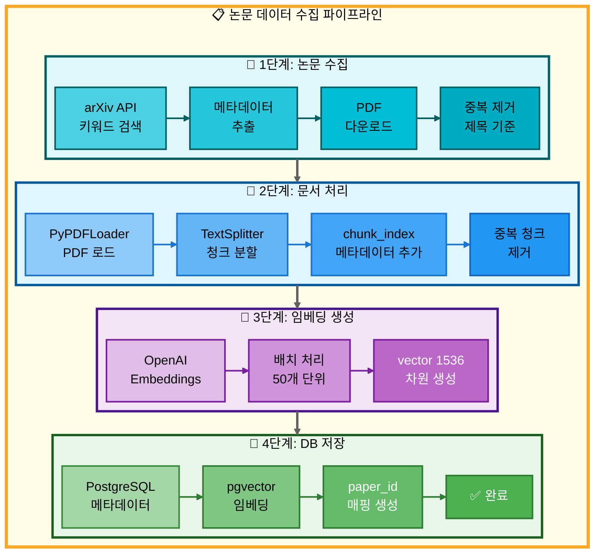

```mermaid
---
config:
  theme: neutral
  layout: elk
---
flowchart TB
 subgraph Stage1["🔸 1단계: 논문 수집"]
    direction LR
        A2["메타데이터<br>추출"]
        A1["arXiv API<br>키워드 검색"]
        A3["PDF<br>다운로드"]
        A4["중복 제거<br>제목 기준"]
  end
 subgraph Stage2["🔹 2단계: 문서 처리"]
    direction LR
        B2["TextSplitter<br>청크 분할"]
        B1["PyPDFLoader<br>PDF 로드"]
        B3["chunk_index<br>메타데이터 추가"]
        B4["중복 청크<br>제거"]
  end
 subgraph Stage3["🔺 3단계: 임베딩 생성"]
    direction LR
        C2["배치 처리<br>50개 단위"]
        C1["OpenAI<br>Embeddings"]
        C3["vector 1536<br>차원 생성"]
  end
 subgraph Stage4["🔻 4단계: DB 저장"]
    direction LR
        D2["pgvector<br>임베딩"]
        D1["PostgreSQL<br>메타데이터"]
        D3["paper_id<br>매핑 생성"]
        D4["✅ 완료"]
  end
 subgraph MainFlow["📋 논문 데이터 수집 파이프라인"]
    direction TB
        Stage1
        Stage2
        Stage3
        Stage4
  end
    A1 --> A2
    A2 --> A3
    A3 --> A4
    B1 --> B2
    B2 --> B3
    B3 --> B4
    C1 --> C2
    C2 --> C3
    D1 --> D2
    D2 --> D3
    D3 --> D4
    Stage1 --> Stage2
    Stage2 --> Stage3
    Stage3 --> Stage4
    style A2 fill:#26c6da,stroke:#006064,stroke-width:2px,color:#000
    style A1 fill:#4dd0e1,stroke:#006064,stroke-width:2px,color:#000
    style A3 fill:#00bcd4,stroke:#006064,stroke-width:2px,color:#000
    style A4 fill:#00acc1,stroke:#006064,stroke-width:2px,color:#000
    style B2 fill:#64b5f6,stroke:#1976d2,stroke-width:2px,color:#000
    style B1 fill:#90caf9,stroke:#1976d2,stroke-width:2px,color:#000
    style B3 fill:#42a5f5,stroke:#1976d2,stroke-width:2px,color:#000
    style B4 fill:#2196f3,stroke:#1565c0,stroke-width:2px,color:#000
    style C2 fill:#ce93d8,stroke:#7b1fa2,stroke-width:2px,color:#000
    style C1 fill:#e1bee7,stroke:#7b1fa2,stroke-width:2px,color:#000
    style C3 fill:#ba68c8,stroke:#7b1fa2,stroke-width:2px,color:#fff
    style D2 fill:#81c784,stroke:#2e7d32,stroke-width:2px,color:#000
    style D1 fill:#a5d6a7,stroke:#388e3c,stroke-width:2px,color:#000
    style D3 fill:#66bb6a,stroke:#2e7d32,stroke-width:2px,color:#fff
    style D4 fill:#4caf50,stroke:#2e7d32,stroke-width:2px,color:#fff
    style Stage1 fill:#e0f7fa,stroke:#006064,stroke-width:3px,color:#000
    style Stage2 fill:#e1f5fe,stroke:#01579b,stroke-width:3px,color:#000
    style Stage3 fill:#f3e5f5,stroke:#4a148c,stroke-width:3px,color:#000
    style Stage4 fill:#e8f5e9,stroke:#1b5e20,stroke-width:3px,color:#000
    style MainFlow fill:#fffde7,stroke:#f9a825,stroke-width:4px,color:#000
    linkStyle 0 stroke:#006064,stroke-width:2px,fill:none
    linkStyle 1 stroke:#006064,stroke-width:2px,fill:none
    linkStyle 2 stroke:#006064,stroke-width:2px,fill:none
    linkStyle 3 stroke:#1976d2,stroke-width:2px,fill:none
    linkStyle 4 stroke:#1976d2,stroke-width:2px,fill:none
    linkStyle 5 stroke:#1976d2,stroke-width:2px,fill:none
    linkStyle 6 stroke:#7b1fa2,stroke-width:2px,fill:none
    linkStyle 7 stroke:#7b1fa2,stroke-width:2px,fill:none
    linkStyle 8 stroke:#2e7d32,stroke-width:2px,fill:none
    linkStyle 9 stroke:#2e7d32,stroke-width:2px,fill:none
    linkStyle 10 stroke:#2e7d32,stroke-width:2px,fill:none
    linkStyle 11 stroke:#616161,stroke-width:3px,fill:none
    linkStyle 12 stroke:#616161,stroke-width:3px,fill:none
    linkStyle 13 stroke:#616161,stroke-width:3px,fill:none
```