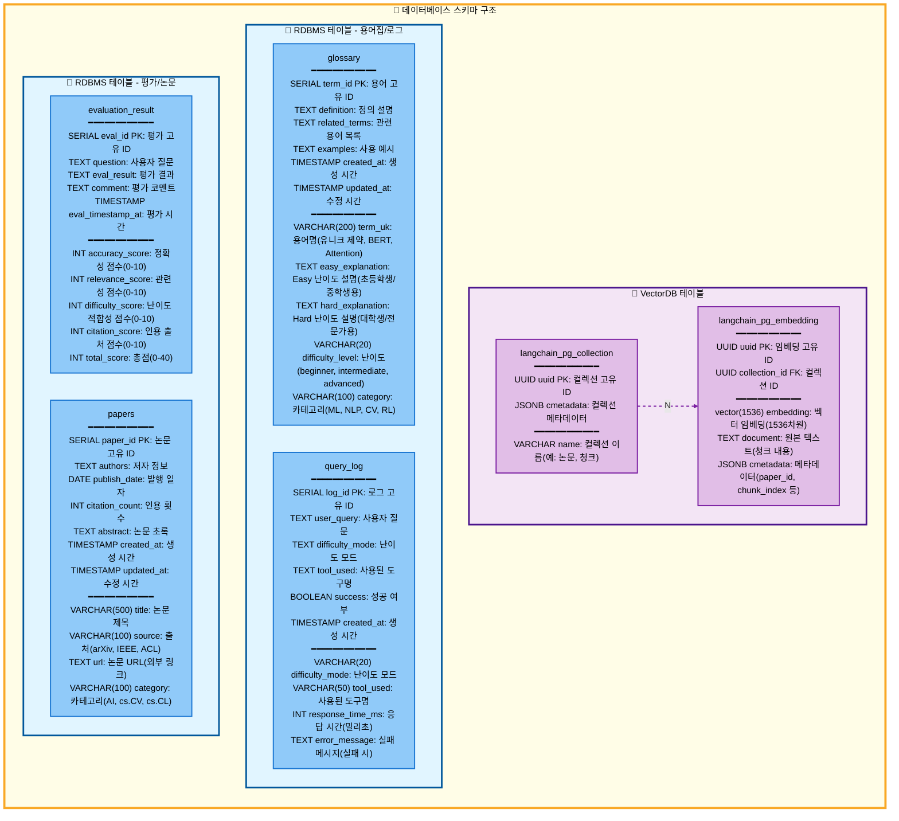

# 데이터베이스 스키마

## 테이블 설명

### VectorDB 테이블

#### 1. langchain_pg_collection
벡터 임베딩 컬렉션을 관리하는 테이블

| 필드명 | 타입 | 설명 |
|--------|------|------|
| uuid | UUID (PK) | 컬렉션 고유 ID |
| name | VARCHAR | 컬렉션 이름 (예: 논문, 청크) |
| cmetadata | JSONB | 컬렉션 메타데이터 |

#### 2. langchain_pg_embedding
벡터 임베딩 데이터를 저장하는 테이블 (N:1 관계로 collection 참조)

| 필드명 | 타입 | 설명 |
|--------|------|------|
| uuid | UUID (PK) | 임베딩 고유 ID |
| collection_id | UUID (FK) | 컬렉션 ID |
| embedding | vector(1536) | 벡터 임베딩 (1536차원) |
| document | TEXT | 원본 텍스트 (청크 내용) |
| cmetadata | JSONB | 메타데이터 (paper_id, chunk_index 등) |

### RDBMS 테이블

#### 3. glossary
용어집 데이터를 저장하는 테이블

| 필드명 | 타입 | 설명 |
|--------|------|------|
| term_id | SERIAL (PK) | 용어 고유 ID |
| term_uk | VARCHAR(200) | 용어명 (Unique, BERT, Attention) |
| definition | TEXT | 정의 설명 |
| easy_explanation | TEXT | Easy 난이도 설명 (초등학생/중학생용) |
| hard_explanation | TEXT | Hard 난이도 설명 (대학생/전문가용) |
| related_terms | TEXT | 관련 용어 목록 |
| examples | TEXT | 사용 예시 |
| difficulty_level | VARCHAR(20) | 난이도 (beginner, intermediate, advanced) |
| category | VARCHAR(100) | 카테고리 (ML, NLP, CV, RL) |
| created_at | TIMESTAMP | 생성 시간 |
| updated_at | TIMESTAMP | 수정 시간 |

#### 4. query_log
사용자 쿼리 로그를 기록하는 테이블

| 필드명 | 타입 | 설명 |
|--------|------|------|
| log_id | SERIAL (PK) | 로그 고유 ID |
| user_query | TEXT | 사용자 질문 |
| difficulty_mode | VARCHAR(20) | 난이도 모드 |
| tool_used | VARCHAR(50) | 사용된 도구명 |
| response_time_ms | INT | 응답 시간 (밀리초) |
| success | BOOLEAN | 성공 여부 |
| error_message | TEXT | 실패 메시지 (실패 시) |
| created_at | TIMESTAMP | 생성 시간 |

#### 5. evaluation_result
평가 결과를 저장하는 테이블

| 필드명 | 타입 | 설명 |
|--------|------|------|
| eval_id | SERIAL (PK) | 평가 고유 ID |
| question | TEXT | 사용자 질문 |
| eval_result | TEXT | 평가 결과 |
| comment | TEXT | 평가 코멘트 |
| accuracy_score | INT | 정확성 점수 (0-10) |
| relevance_score | INT | 관련성 점수 (0-10) |
| difficulty_score | INT | 난이도 적합성 점수 (0-10) |
| citation_score | INT | 인용 출처 점수 (0-10) |
| total_score | INT | 총점 (0-40) |
| eval_timestamp_at | TIMESTAMP | 평가 시간 |

#### 6. papers
논문 메타데이터를 저장하는 테이블

| 필드명 | 타입 | 설명 |
|--------|------|------|
| paper_id | SERIAL (PK) | 논문 고유 ID |
| title | VARCHAR(500) | 논문 제목 |
| authors | TEXT | 저자 정보 |
| publish_date | DATE | 발행 일자 |
| source | VARCHAR(100) | 출처 (arXiv, IEEE, ACL) |
| url | TEXT | 논문 URL (외부 링크) |
| category | VARCHAR(100) | 카테고리 (AI, cs.CV, cs.CL) |
| citation_count | INT | 인용 횟수 |
| abstract | TEXT | 논문 초록 |
| created_at | TIMESTAMP | 생성 시간 |
| updated_at | TIMESTAMP | 수정 시간 |

## 관계 설명

- **langchain_pg_collection** 과 **langchain_pg_embedding**: 1:N 관계
  - 하나의 컬렉션은 여러 임베딩을 포함
  - collection_id로 외부 참조

## 색상 의미

- **VectorDB 테이블**: 보라색 계열 (`#f3e5f5` / `#e1bee7`)
- **RDBMS 테이블**: 파란색 계열 (`#e1f5ff` / `#90caf9`)
