# 데이터베이스 스키마

```mermaid
erDiagram
    langchain_pg_collection ||--o{ langchain_pg_embedding : "contains(FK)"
    papers ||..o{ langchain_pg_embedding : "references(cmetadata.paper_id)"

    langchain_pg_collection {
        UUID uuid PK "컬렉션 고유 ID"
        VARCHAR name "컬렉션 이름(예: paper_chunks)"
        JSON cmetadata "컬렉션 메타데이터"
    }

    langchain_pg_embedding {
        VARCHAR id PK "임베딩 고유 ID"
        UUID collection_id FK "컬렉션 ID"
        vector embedding "벡터 임베딩(pgvector 타입)"
        VARCHAR document "원문 텍스트(청크 내용)"
        JSONB cmetadata "메타데이터(paper_id, chunk_index 등)"
    }

    papers {
        SERIAL paper_id PK "논문 고유 ID"
        VARCHAR_500 title "논문 제목(NOT NULL)"
        TEXT authors "저자 목록"
        DATE publish_date "발표 날짜"
        VARCHAR_100 source "출처(arXiv, IEEE, ACL)"
        TEXT url_UK "논문 URL(UNIQUE)"
        VARCHAR_100 category "카테고리(cs.AI, cs.CL, cs.CV)"
        INT citation_count "인용 수(DEFAULT 0)"
        TEXT abstract "논문 초록"
        VARCHAR_64 arxiv_id "arXiv ID"
        TIMESTAMP created_at "생성 시각(DEFAULT CURRENT_TIMESTAMP)"
        TIMESTAMP updated_at "수정 시각(DEFAULT CURRENT_TIMESTAMP)"
    }

    glossary {
        SERIAL term_id PK "용어 고유 ID"
        VARCHAR_200 term_UK "용어명(NOT NULL, UNIQUE)"
        TEXT definition "기본 정의(NOT NULL)"
        TEXT easy_explanation "Easy 모드 설명"
        TEXT hard_explanation "Hard 모드 설명"
        VARCHAR_100 category "카테고리(ML, NLP, CV, RL)"
        VARCHAR_20 difficulty_level "난이도(beginner, intermediate, advanced)"
        TEXT_ARRAY related_terms "관련 용어 배열(PostgreSQL ARRAY)"
        TEXT examples "사용 예시"
        TIMESTAMP created_at "생성 시각(DEFAULT CURRENT_TIMESTAMP)"
        TIMESTAMP updated_at "수정 시각(DEFAULT CURRENT_TIMESTAMP)"
    }

    query_logs {
        SERIAL log_id PK "로그 고유 ID"
        TEXT user_query "사용자 질문(NOT NULL)"
        VARCHAR_20 difficulty_mode "난이도 모드(easy, hard)"
        VARCHAR_50 tool_used "사용된 도구명"
        TEXT response "생성된 응답"
        INT response_time_ms "응답 시간(밀리초)"
        BOOLEAN success "성공 여부(DEFAULT TRUE)"
        TEXT error_message "오류 메시지(실패 시)"
        TIMESTAMP created_at "생성 시각(DEFAULT CURRENT_TIMESTAMP)"
    }

    evaluation_results {
        SERIAL eval_id PK "평가 고유 ID"
        TEXT question "사용자 질문(NOT NULL)"
        TEXT answer "AI 답변(NOT NULL)"
        INT accuracy_score "정확도 점수(0-10, CHECK 제약)"
        INT relevance_score "관련성 점수(0-10, CHECK 제약)"
        INT difficulty_score "난이도 적합성 점수(0-10, CHECK 제약)"
        INT citation_score "출처 명시 점수(0-10, CHECK 제약)"
        INT total_score "총점(0-40, CHECK 제약)"
        TEXT comment "평가 코멘트"
        TIMESTAMP created_at "생성 시각(DEFAULT CURRENT_TIMESTAMP)"
    }
```

## 테이블 설명

### VectorDB 테이블 (LangChain PGVector)

#### 1. langchain_pg_collection
벡터 임베딩 컬렉션을 관리하는 테이블 (LangChain 자동 생성)

| 필드명 | 타입 | 제약조건 | 설명 |
|--------|------|----------|------|
| uuid | UUID | PK, NOT NULL | 컬렉션 고유 ID |
| name | VARCHAR | NOT NULL | 컬렉션 이름 (예: paper_chunks) |
| cmetadata | JSON | NULL | 컬렉션 메타데이터 |

#### 2. langchain_pg_embedding
벡터 임베딩 데이터를 저장하는 테이블 (N:1 관계로 collection 참조, LangChain 자동 생성)

| 필드명 | 타입 | 제약조건 | 설명 |
|--------|------|----------|------|
| id | VARCHAR | PK, NOT NULL | 임베딩 고유 ID (UUID 문자열) |
| collection_id | UUID | FK, NULL | 컬렉션 ID (→ langchain_pg_collection.uuid) |
| embedding | vector | NULL | 벡터 임베딩 (pgvector 타입, 차원은 모델에 따라 결정) |
| document | VARCHAR | NULL | 원본 텍스트 (청크 내용) |
| cmetadata | JSONB | NULL | 메타데이터 (paper_id, chunk_index 등) |

### RDBMS 테이블

#### 3. papers
논문 메타데이터를 저장하는 테이블

| 필드명 | 타입 | 제약조건 | 설명 |
|--------|------|----------|------|
| paper_id | SERIAL | PK | 논문 고유 ID |
| title | VARCHAR(500) | NOT NULL | 논문 제목 |
| authors | TEXT | NULL | 저자 목록 (콤마 구분 또는 JSON) |
| publish_date | DATE | NULL | 발표 날짜 |
| source | VARCHAR(100) | NULL | 출처 (arXiv, IEEE, ACL 등) |
| url | TEXT | UNIQUE, NULL | 논문 URL (중복 방지) |
| category | VARCHAR(100) | NULL | 카테고리 (cs.AI, cs.CL, cs.CV 등) |
| citation_count | INT | DEFAULT 0 | 인용 수 |
| abstract | TEXT | NULL | 논문 초록 |
| arxiv_id | VARCHAR(64) | NULL | arXiv ID |
| created_at | TIMESTAMP | DEFAULT CURRENT_TIMESTAMP | 생성 시간 |
| updated_at | TIMESTAMP | DEFAULT CURRENT_TIMESTAMP | 수정 시간 |

**인덱스:**
- `idx_papers_title`: GIN 인덱스 (전문 검색)
- `idx_papers_category`: B-tree 인덱스
- `idx_papers_publish_date`: B-tree 인덱스 (DESC)
- `idx_papers_created_at`: B-tree 인덱스 (DESC)

#### 4. glossary
AI/ML 용어집 데이터를 저장하는 테이블

| 필드명 | 타입 | 제약조건 | 설명 |
|--------|------|----------|------|
| term_id | SERIAL | PK | 용어 고유 ID |
| term | VARCHAR(200) | NOT NULL, UNIQUE | 용어명 (예: BERT, Attention) |
| definition | TEXT | NOT NULL | 기본 정의 |
| easy_explanation | TEXT | NULL | Easy 모드 설명 (초보자용) |
| hard_explanation | TEXT | NULL | Hard 모드 설명 (전문가용) |
| category | VARCHAR(100) | NULL | 카테고리 (ML, NLP, CV, RL 등) |
| difficulty_level | VARCHAR(20) | NULL | 난이도 (beginner, intermediate, advanced) |
| related_terms | TEXT[] | NULL | 관련 용어 배열 (PostgreSQL ARRAY 타입) |
| examples | TEXT | NULL | 사용 예시 |
| created_at | TIMESTAMP | DEFAULT CURRENT_TIMESTAMP | 생성 시간 |
| updated_at | TIMESTAMP | DEFAULT CURRENT_TIMESTAMP | 수정 시간 |

**인덱스:**
- `idx_glossary_term`: B-tree 인덱스
- `idx_glossary_category`: B-tree 인덱스
- `idx_glossary_difficulty`: B-tree 인덱스

#### 5. query_logs
사용자 질의 로그를 기록하는 테이블

| 필드명 | 타입 | 제약조건 | 설명 |
|--------|------|----------|------|
| log_id | SERIAL | PK | 로그 고유 ID |
| user_query | TEXT | NOT NULL | 사용자 질문 |
| difficulty_mode | VARCHAR(20) | NULL | 난이도 모드 (easy, hard) |
| tool_used | VARCHAR(50) | NULL | 사용된 도구명 |
| response | TEXT | NULL | 생성된 응답 |
| response_time_ms | INT | NULL | 응답 시간 (밀리초) |
| success | BOOLEAN | DEFAULT TRUE | 성공 여부 |
| error_message | TEXT | NULL | 오류 메시지 (실패 시) |
| created_at | TIMESTAMP | DEFAULT CURRENT_TIMESTAMP | 생성 시간 |

**인덱스:**
- `idx_query_logs_created_at`: B-tree 인덱스 (DESC)
- `idx_query_logs_tool_used`: B-tree 인덱스
- `idx_query_logs_success`: B-tree 인덱스

#### 6. evaluation_results
AI 답변 품질 평가 결과를 저장하는 테이블

| 필드명 | 타입 | 제약조건 | 설명 |
|--------|------|----------|------|
| eval_id | SERIAL | PK | 평가 고유 ID |
| question | TEXT | NOT NULL | 사용자 질문 |
| answer | TEXT | NOT NULL | AI 답변 |
| accuracy_score | INT | CHECK (0-10) | 정확도 점수 (0-10) |
| relevance_score | INT | CHECK (0-10) | 관련성 점수 (0-10) |
| difficulty_score | INT | CHECK (0-10) | 난이도 적합성 점수 (0-10) |
| citation_score | INT | CHECK (0-10) | 출처 명시 점수 (0-10) |
| total_score | INT | CHECK (0-40) | 총점 (0-40) |
| comment | TEXT | NULL | 평가 코멘트 |
| created_at | TIMESTAMP | DEFAULT CURRENT_TIMESTAMP | 생성 시간 |

**인덱스:**
- `idx_evaluation_results_created_at`: B-tree 인덱스 (DESC)
- `idx_evaluation_results_total_score`: B-tree 인덱스 (DESC)

## 테이블 관계

### 1. 외래 키 (Foreign Key) - DB 레벨 제약조건
- **langchain_pg_embedding.collection_id** → **langchain_pg_collection.uuid**
  - N:1 관계 (실선)
  - 하나의 컬렉션은 여러 임베딩을 포함
  - LangChain PGVector에서 자동 관리하는 공식 FK

### 2. 논리적 관계 (Application Level) - 제약조건 없음
- **papers** → **langchain_pg_embedding** (1:N, 점선)
  - papers.paper_id는 langchain_pg_embedding.cmetadata 내부의 `paper_id` 필드로 참조됨
  - DB 레벨 외래 키 제약조건은 **없음**
  - 애플리케이션 코드에서 관계 유지
  - 예시: `cmetadata = {'paper_id': 9, 'chunk_index': 0, ...}`
  - 하나의 논문(papers)은 여러 임베딩 청크를 가질 수 있음

### 3. 독립 테이블 (관계 없음)
- `glossary`: 용어집 독립 저장
- `query_logs`: 사용자 쿼리 로그 독립 저장
- `evaluation_results`: 평가 결과 독립 저장

## 특이 사항

### pgvector Extension
- PostgreSQL의 vector 타입을 사용하기 위해 `pgvector` 확장이 필요
- `CREATE EXTENSION IF NOT EXISTS vector;`로 활성화

### LangChain 자동 생성 테이블
- `langchain_pg_collection`과 `langchain_pg_embedding`은 LangChain의 PGVector 클래스가 자동으로 생성
- 스키마는 LangChain 라이브러리 버전에 따라 약간씩 다를 수 있음

### PostgreSQL 배열 타입
- `glossary.related_terms`는 `TEXT[]` (배열 타입)
- 예: `{'Machine Learning', 'Neural Network', 'Deep Learning'}`

### CHECK 제약조건
- `evaluation_results` 테이블의 점수 컬럼들은 CHECK 제약조건으로 범위 검증
  - `accuracy_score`, `relevance_score`, `difficulty_score`, `citation_score`: 0-10
  - `total_score`: 0-40

### 논리적 관계 vs 외래 키 제약조건
- **papers → langchain_pg_embedding** 관계는 DB 레벨 FK가 **아님**
- `langchain_pg_embedding.cmetadata` (JSONB 타입) 안에 `paper_id` 필드로 논문을 참조
- 이유: LangChain PGVector는 JSONB 필드에 메타데이터를 저장하며, DB 제약조건을 걸지 않음
- 장점: 유연성 (다양한 메타데이터 저장 가능)
- 단점: 데이터 무결성을 애플리케이션에서 보장해야 함
