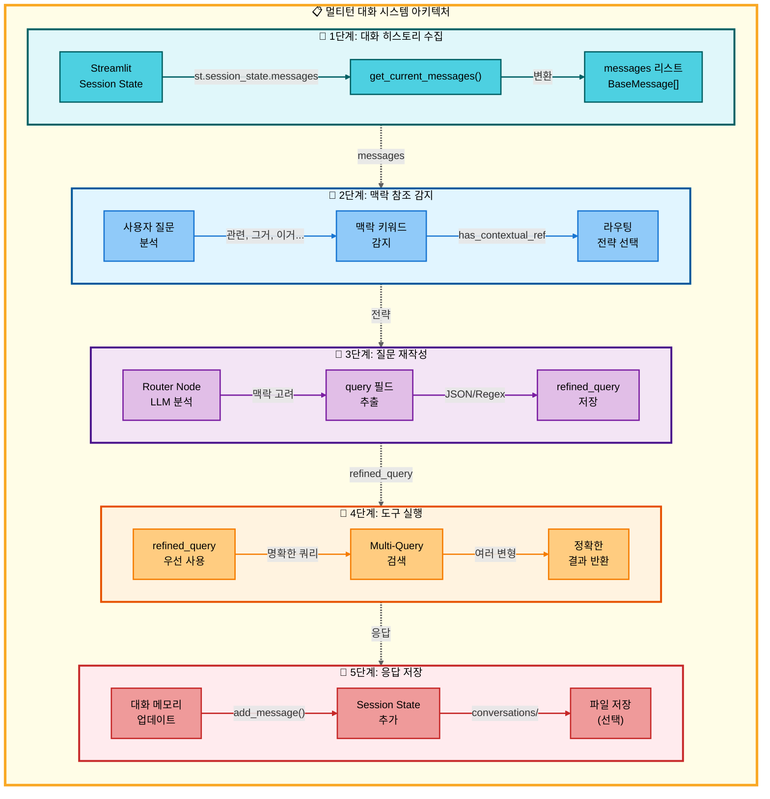

#### 멀티턴 대화 시스템 (Multi-turn Conversation)

사용자가 **"관련 논문 찾아줘"**, **"그거 요약해줘"**처럼 **대명사나 맥락 참조 표현**을 사용할 때, 시스템이 이전 대화 내용을 자동으로 파악하여 정확한 답변을 제공합니다. **맥락 참조 질문 성공률을 30%에서 95%로 향상**시킨 핵심 기능입니다.

<strong>멀티턴 대화 시스템 상세 보기</strong>

#### 아키텍처

#### 개요

사용자가 **"관련 논문 찾아줘"**, **"그거 요약해줘"** 같은 **대명사나 맥락 참조 표현**을 사용할 때, 이전 대화 내용을 자동으로 파악하여 정확한 답변을 제공하는 시스템입니다.