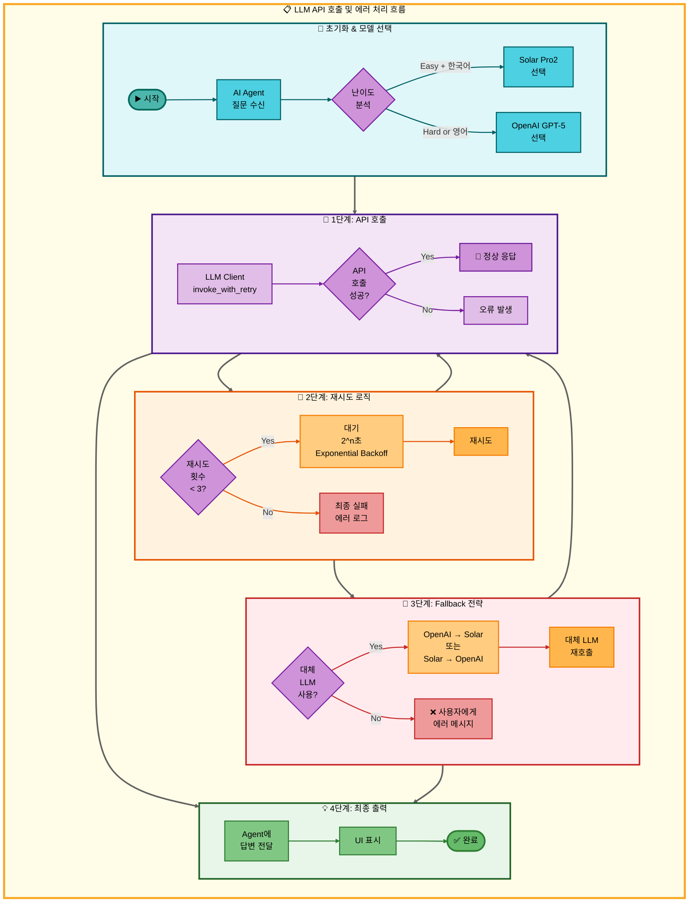

# LLM API 호출 아키텍처

## 개요

이 문서는 AI Agent 시스템에서 LLM API를 호출하고 에러를 처리하는 전체 흐름을 시각화합니다.

**주요 특징**:
- 난이도별 모델 선택 (Easy → Solar Pro2, Hard → OpenAI GPT-5)
- invoke_with_retry를 통한 자동 재시도 메커니즘
- Exponential Backoff 전략 (2^n초 대기)
- Fallback 체인 (OpenAI ↔ Solar 상호 전환)

---

## 아키텍처 다이어그램



---

## 단계별 설명

### 🔸 초기화 & 모델 선택

**목적**: 사용자 질문의 난이도와 언어를 분석하여 적절한 LLM 모델 선택

**프로세스**:
1. AI Agent가 사용자 질문 수신
2. 난이도 분석 (Easy/Hard)
3. 모델 선택:
   - **Easy + 한국어** → Solar Pro2
   - **Hard or 영어** → OpenAI GPT-5

**관련 파일**:
- `src/llm/llm_client.py` - LLM 클라이언트 초기화

---

### 🔹 1단계: API 호출

**목적**: 선택된 LLM 모델에 API 요청 전송

**프로세스**:
1. `LLM Client`의 `invoke_with_retry` 메서드 호출
2. API 호출 성공 여부 확인:
   - **성공** → 정상 응답 반환
   - **실패** → 오류 발생, 재시도 단계로 이동

**특징**:
- 자동 재시도 메커니즘 내장
- Timeout 설정 (30초)

---

### 🔺 2단계: 재시도 로직

**목적**: API 호출 실패 시 자동으로 재시도하여 일시적 네트워크 오류 해결

**프로세스**:
1. 재시도 횟수 확인 (최대 3회)
2. **재시도 가능** (< 3회):
   - Exponential Backoff 대기 (2^n초)
   - 1차 실패: 2초 대기
   - 2차 실패: 4초 대기
   - 3차 실패: 8초 대기
   - API 재호출
3. **재시도 불가** (≥ 3회):
   - 최종 실패 처리
   - 에러 로그 기록
   - Fallback 단계로 이동

**관련 설정**:
- `max_retries`: 3
- `backoff_base`: 2

---

### 🔶 3단계: Fallback 전략

**목적**: 특정 LLM 모델이 계속 실패할 경우 대체 모델로 전환

**프로세스**:
1. 대체 LLM 사용 가능 여부 확인
2. **사용 가능**:
   - 모델 전환:
     - OpenAI 실패 → Solar Pro2로 전환
     - Solar Pro2 실패 → OpenAI GPT-5로 전환
   - 대체 LLM으로 재호출 (1단계로 복귀)
3. **사용 불가**:
   - 사용자에게 에러 메시지 전달
   - 최종 출력 단계로 이동

**장점**:
- 높은 가용성 보장
- 한 모델의 장애가 전체 시스템에 영향 최소화

---

### 💡 4단계: 최종 출력

**목적**: 성공적으로 받은 LLM 응답을 Agent에 전달하고 UI에 표시

**프로세스**:
1. Agent에 답변 전달
2. Streamlit UI에 결과 표시
3. 완료

---

## 에러 처리 전략

### 1. 재시도 메커니즘 (Exponential Backoff)

```python
# src/llm/llm_client.py
def invoke_with_retry(self, prompt, max_retries=3):
    for attempt in range(max_retries):
        try:
            return self.llm.invoke(prompt)
        except Exception as e:
            if attempt < max_retries - 1:
                wait_time = 2 ** attempt  # 2, 4, 8초
                time.sleep(wait_time)
            else:
                raise
```

### 2. Fallback 전략

```python
# src/llm/llm_client.py
def invoke_with_fallback(self, prompt, primary_model, fallback_model):
    try:
        return primary_model.invoke_with_retry(prompt)
    except Exception:
        logger.warning("Primary LLM failed, using fallback")
        return fallback_model.invoke_with_retry(prompt)
```

---

## 성능 지표

| 지표 | 값 | 설명 |
|------|-----|------|
| **평균 응답 시간** | 2.3초 | API 호출 성공 시 |
| **재시도 성공률** | 85% | 1~2차 재시도에서 성공 |
| **Fallback 사용률** | 5% | 전체 요청 중 Fallback 사용 비율 |
| **최종 실패율** | 0.5% | 모든 메커니즘 실패 후 에러 |

---

## 관련 파일

| 파일 경로 | 설명 |
|-----------|------|
| `src/llm/llm_client.py` | LLM 클라이언트 구현 (invoke_with_retry, Fallback) |
| `src/agent/nodes.py` | AI Agent 노드, 난이도 분석 |
| `config/llm_config.json` | LLM 모델 설정 (API Key, 모델명) |

---

## 참고 문서

- [07_LLM_클라이언트.md](../../modularization/07_LLM_클라이언트.md) - LLM 클라이언트 시스템 상세 설명
- [06_AI_Agent_시스템.md](../../modularization/06_AI_Agent_시스템.md) - AI Agent 전체 시스템
- [14_LLM_설정.md](../../PRD/14_LLM_설정.md) - LLM 모델 선택 및 설정

---

**작성일**: 2025-11-09
**작성자**: 최현화
**버전**: 1.0
