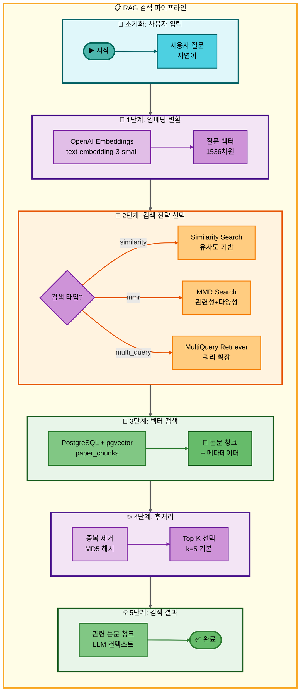

```mermaid
graph TB
    subgraph MainFlow["📋 RAG 검색 파이프라인"]
        direction TB

        subgraph Init["🔸 초기화: 사용자 입력"]
            direction LR
            Start([▶️ 시작]) --> A[사용자 질문<br/>자연어]
        end

        subgraph Step1["🔹 1단계: 임베딩 변환"]
            direction LR
            B[OpenAI Embeddings<br/>text-embedding-3-small] --> C[질문 벡터<br/>1536차원]
        end

        subgraph Step2["🔺 2단계: 검색 전략 선택"]
            direction LR
            D{검색 타입?}
            D -->|similarity| E[Similarity Search<br/>유사도 기반]
            D -->|mmr| F[MMR Search<br/>관련성+다양성]
            D -->|multi_query| G[MultiQuery Retriever<br/>쿼리 확장]
        end

        subgraph Step3["🔶 3단계: 벡터 검색"]
            direction LR
            H[PostgreSQL + pgvector<br/>paper_chunks] --> I[💾 논문 청크<br/>+ 메타데이터]
        end

        subgraph Step4["✨ 4단계: 후처리"]
            direction LR
            J[중복 제거<br/>MD5 해시] --> K[Top-K 선택<br/>k=5 기본]
        end

        subgraph Output["💡 5단계: 검색 결과"]
            direction LR
            L[관련 논문 청크<br/>LLM 컨텍스트] --> End([✅ 완료])
        end

        Init --> Step1
        Step1 --> Step2
        Step2 --> Step3
        Step3 --> Step4
        Step4 --> Output
    end

    %% MainFlow 래퍼 스타일
    style MainFlow fill:#fffde7,stroke:#f9a825,stroke-width:4px,color:#000

    %% Subgraph 스타일
    style Init fill:#e0f7fa,stroke:#006064,stroke-width:3px,color:#000
    style Step1 fill:#f3e5f5,stroke:#4a148c,stroke-width:3px,color:#000
    style Step2 fill:#fff3e0,stroke:#e65100,stroke-width:3px,color:#000
    style Step3 fill:#e8f5e9,stroke:#1b5e20,stroke-width:3px,color:#000
    style Step4 fill:#f3e5f5,stroke:#4a148c,stroke-width:3px,color:#000
    style Output fill:#e8f5e9,stroke:#1b5e20,stroke-width:3px,color:#000

    %% 노드 스타일 (초기화 - 청록 계열)
    style Start fill:#4db6ac,stroke:#00695c,stroke-width:3px,color:#000
    style A fill:#4dd0e1,stroke:#006064,stroke-width:2px,color:#000

    %% 노드 스타일 (1단계 - 보라 계열)
    style B fill:#e1bee7,stroke:#7b1fa2,stroke-width:2px,color:#000
    style C fill:#ce93d8,stroke:#6a1b9a,stroke-width:2px,color:#000

    %% 노드 스타일 (2단계 - 주황 계열)
    style D fill:#ce93d8,stroke:#7b1fa2,stroke-width:2px,color:#000
    style E fill:#ffcc80,stroke:#f57c00,stroke-width:2px,color:#000
    style F fill:#ffcc80,stroke:#f57c00,stroke-width:2px,color:#000
    style G fill:#ffcc80,stroke:#f57c00,stroke-width:2px,color:#000

    %% 노드 스타일 (3단계 - 녹색 계열)
    style H fill:#81c784,stroke:#2e7d32,stroke-width:2px,color:#000
    style I fill:#66bb6a,stroke:#1b5e20,stroke-width:2px,color:#000

    %% 노드 스타일 (4단계 - 보라 계열)
    style J fill:#e1bee7,stroke:#7b1fa2,stroke-width:2px,color:#000
    style K fill:#ce93d8,stroke:#6a1b9a,stroke-width:2px,color:#000

    %% 노드 스타일 (출력 - 녹색 계열)
    style L fill:#81c784,stroke:#2e7d32,stroke-width:2px,color:#000
    style End fill:#66bb6a,stroke:#2e7d32,stroke-width:3px,color:#000

    %% 연결선 스타일 (초기화 0)
    linkStyle 0 stroke:#006064,stroke-width:2px

    %% 연결선 스타일 (1단계 1)
    linkStyle 1 stroke:#7b1fa2,stroke-width:2px

    %% 연결선 스타일 (2단계 2~4)
    linkStyle 2 stroke:#e65100,stroke-width:2px
    linkStyle 3 stroke:#e65100,stroke-width:2px
    linkStyle 4 stroke:#e65100,stroke-width:2px

    %% 연결선 스타일 (3단계 5)
    linkStyle 5 stroke:#2e7d32,stroke-width:2px

    %% 연결선 스타일 (4단계 6)
    linkStyle 6 stroke:#7b1fa2,stroke-width:2px

    %% 연결선 스타일 (출력 7)
    linkStyle 7 stroke:#2e7d32,stroke-width:2px

    %% 단계 간 연결 (회색 8~12)
    linkStyle 8 stroke:#616161,stroke-width:3px
    linkStyle 9 stroke:#616161,stroke-width:3px
    linkStyle 10 stroke:#616161,stroke-width:3px
    linkStyle 11 stroke:#616161,stroke-width:3px
    linkStyle 12 stroke:#616161,stroke-width:3px
```

### RAG 시스템 최적화

```mermaid
graph LR
    subgraph MainFlow["📋 RAG 시스템 최적화 흐름"]
        direction LR

        subgraph Init["🔸 초기화"]
            direction LR
            A[사용자 질문]
        end

        subgraph Step1["🔹 1단계: 임베딩"]
            direction LR
            B[임베딩 생성<br/>100ms]
        end

        subgraph Step2["🔺 2단계: 벡터 검색"]
            direction LR
            C[pgvector 검색<br/>45ms]
        end

        subgraph Step3["🔶 3단계: 메타데이터"]
            direction LR
            D[메타데이터 조회<br/>12ms]
        end

        subgraph Step4["✨ 4단계: 컨텍스트"]
            direction LR
            E[컨텍스트 구성<br/>50ms]
        end

        subgraph Output["💡 5단계: 답변 생성"]
            direction LR
            F[LLM 답변 생성<br/>2000ms]
        end

        Init --> Step1
        Step1 --> Step2
        Step2 --> Step3
        Step3 --> Step4
        Step4 --> Output
    end

    %% 메인 워크플로우 배경
    style MainFlow fill:#fffde7,stroke:#f9a825,stroke-width:4px,color:#000

    %% Subgraph 스타일
    style Init fill:#e0f7fa,stroke:#006064,stroke-width:3px,color:#000
    style Step1 fill:#e1f5ff,stroke:#01579b,stroke-width:3px,color:#000
    style Step2 fill:#f3e5f5,stroke:#4a148c,stroke-width:3px,color:#000
    style Step3 fill:#fff3e0,stroke:#e65100,stroke-width:3px,color:#000
    style Step4 fill:#ffebee,stroke:#c62828,stroke-width:3px,color:#000
    style Output fill:#e8f5e9,stroke:#1b5e20,stroke-width:3px,color:#000

    %% 노드 스타일
    style A fill:#4dd0e1,stroke:#006064,stroke-width:2px,color:#000
    style B fill:#90caf9,stroke:#1976d2,stroke-width:2px,color:#000
    style C fill:#e1bee7,stroke:#7b1fa2,stroke-width:2px,color:#000
    style D fill:#ffcc80,stroke:#f57c00,stroke-width:2px,color:#000
    style E fill:#ef9a9a,stroke:#c62828,stroke-width:2px,color:#000
    style F fill:#81c784,stroke:#2e7d32,stroke-width:2px,color:#000

    %% 단계 간 연결
    linkStyle 0 stroke:#616161,stroke-width:3px
    linkStyle 1 stroke:#616161,stroke-width:3px
    linkStyle 2 stroke:#616161,stroke-width:3px
    linkStyle 3 stroke:#616161,stroke-width:3px
    linkStyle 4 stroke:#616161,stroke-width:3px
```