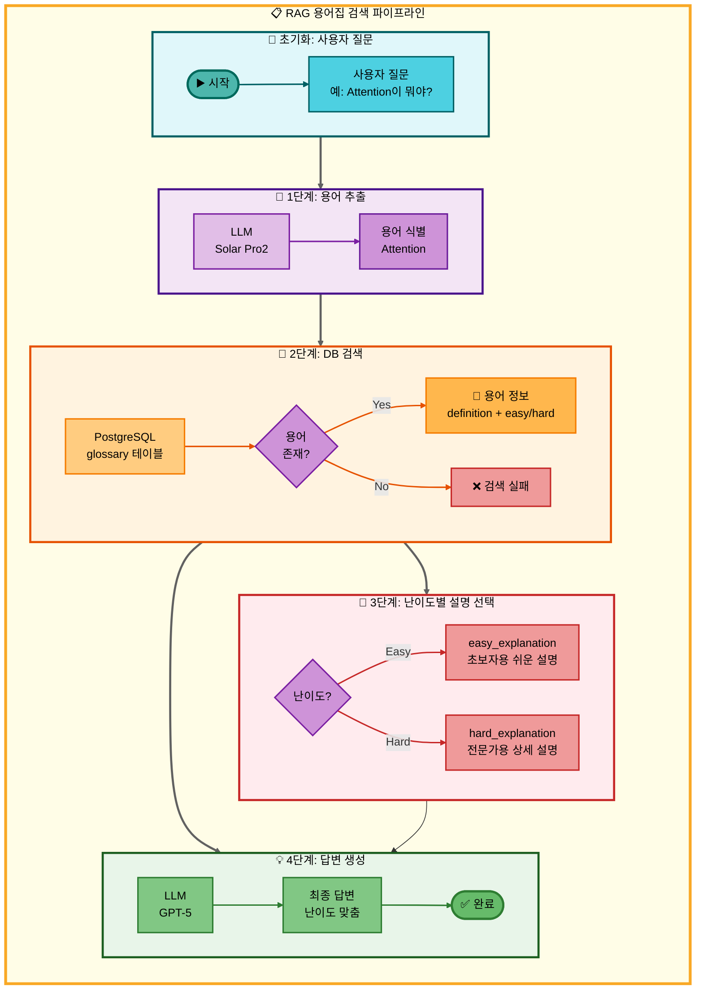

##### 용어집 검색 아키텍처

```mermaid
graph TB
    subgraph MainFlow["📋 RAG 용어집 검색 파이프라인"]
        direction TB

        subgraph Init["🔸 초기화: 사용자 질문"]
            direction LR
            Start([▶️ 시작]) --> A[사용자 질문<br/>예: Attention이 뭐야?]
        end

        subgraph Step1["🔹 1단계: 용어 추출"]
            direction LR
            B[LLM<br/>Solar Pro2] --> C[용어 식별<br/>Attention]
        end

        subgraph Step2["🔺 2단계: DB 검색"]
            direction LR
            D[PostgreSQL<br/>glossary 테이블] --> E{용어<br/>존재?}
            E -->|Yes| F[💾 용어 정보<br/>definition + easy/hard]
            E -->|No| G[❌ 검색 실패]
        end

        subgraph Step3["🔶 3단계: 난이도별 설명 선택"]
            direction LR
            H{난이도?}
            H -->|Easy| I[easy_explanation<br/>초보자용 쉬운 설명]
            H -->|Hard| J[hard_explanation<br/>전문가용 상세 설명]
        end

        subgraph Output["💡 4단계: 답변 생성"]
            direction LR
            K[LLM<br/>GPT-5] --> L[최종 답변<br/>난이도 맞춤]
            L --> End([✅ 완료])
        end

        Init --> Step1
        Step1 --> Step2
        Step2 --> Step3
        Step2 --> Output
        Step3 --> Output
    end

    %% MainFlow 래퍼 스타일
    style MainFlow fill:#fffde7,stroke:#f9a825,stroke-width:4px,color:#000

    %% Subgraph 스타일
    style Init fill:#e0f7fa,stroke:#006064,stroke-width:3px,color:#000
    style Step1 fill:#f3e5f5,stroke:#4a148c,stroke-width:3px,color:#000
    style Step2 fill:#fff3e0,stroke:#e65100,stroke-width:3px,color:#000
    style Step3 fill:#ffebee,stroke:#c62828,stroke-width:3px,color:#000
    style Output fill:#e8f5e9,stroke:#1b5e20,stroke-width:3px,color:#000

    %% 노드 스타일 (초기화 - 청록 계열)
    style Start fill:#4db6ac,stroke:#00695c,stroke-width:3px,color:#000
    style A fill:#4dd0e1,stroke:#006064,stroke-width:2px,color:#000

    %% 노드 스타일 (1단계 - 보라 계열)
    style B fill:#e1bee7,stroke:#7b1fa2,stroke-width:2px,color:#000
    style C fill:#ce93d8,stroke:#6a1b9a,stroke-width:2px,color:#000

    %% 노드 스타일 (2단계 - 주황 계열)
    style D fill:#ffcc80,stroke:#f57c00,stroke-width:2px,color:#000
    style E fill:#ce93d8,stroke:#7b1fa2,stroke-width:2px,color:#000
    style F fill:#ffb74d,stroke:#f57c00,stroke-width:2px,color:#000
    style G fill:#ef9a9a,stroke:#c62828,stroke-width:2px,color:#000

    %% 노드 스타일 (3단계 - 빨강 계열)
    style H fill:#ce93d8,stroke:#7b1fa2,stroke-width:2px,color:#000
    style I fill:#ef9a9a,stroke:#c62828,stroke-width:2px,color:#000
    style J fill:#ef9a9a,stroke:#c62828,stroke-width:2px,color:#000

    %% 노드 스타일 (출력 - 녹색 계열)
    style K fill:#81c784,stroke:#2e7d32,stroke-width:2px,color:#000
    style L fill:#81c784,stroke:#2e7d32,stroke-width:2px,color:#000
    style End fill:#66bb6a,stroke:#2e7d32,stroke-width:3px,color:#000

    %% 연결선 스타일
    linkStyle 0 stroke:#006064,stroke-width:2px
    linkStyle 1 stroke:#7b1fa2,stroke-width:2px
    linkStyle 2 stroke:#e65100,stroke-width:2px
    linkStyle 3 stroke:#e65100,stroke-width:2px
    linkStyle 4 stroke:#e65100,stroke-width:2px
    linkStyle 5 stroke:#c62828,stroke-width:2px
    linkStyle 6 stroke:#c62828,stroke-width:2px
    linkStyle 7 stroke:#2e7d32,stroke-width:2px
    linkStyle 8 stroke:#2e7d32,stroke-width:2px

    %% 단계 간 연결 (회색)
    linkStyle 9 stroke:#616161,stroke-width:3px
    linkStyle 10 stroke:#616161,stroke-width:3px
    linkStyle 11 stroke:#616161,stroke-width:3px
    linkStyle 12 stroke:#616161,stroke-width:3px
```