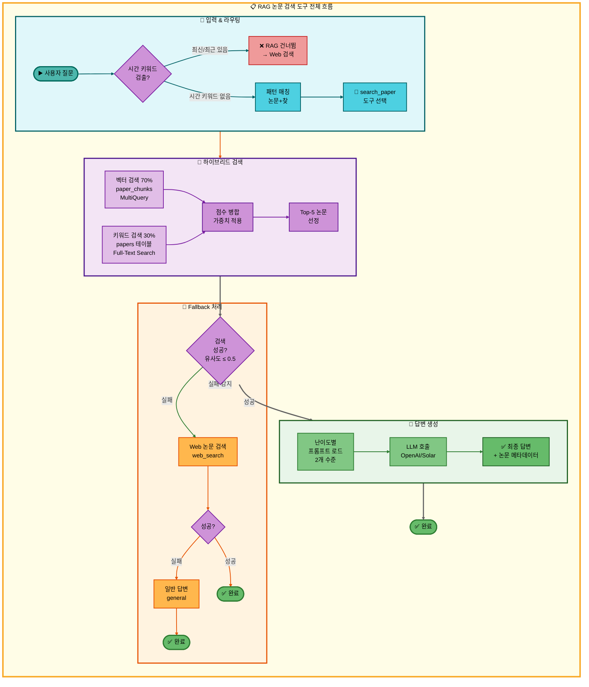

##### 논문 검색 아키텍처

```mermaid
graph TB
    subgraph MainFlow["📋 RAG 논문 검색 도구 전체 흐름"]
        direction TB

        subgraph Input["🔸 입력 & 라우팅"]
            direction LR
            Start([▶️ 사용자 질문]) --> KeywordCheck{시간 키워드<br/>검출?}
            KeywordCheck -->|최신/최근 있음| SkipRAG[❌ RAG 건너뜀<br/>→ Web 검색]
            KeywordCheck -->|시간 키워드 없음| PatternMatch[패턴 매칭<br/>논문+찾]
            PatternMatch --> ToolSelect[🔧 search_paper<br/>도구 선택]
        end

        subgraph Search["🔹 하이브리드 검색"]
            direction LR
            VectorSearch[벡터 검색 70%<br/>paper_chunks<br/>MultiQuery] --> Merge[점수 병합<br/>가중치 적용]
            KeywordSearch[키워드 검색 30%<br/>papers 테이블<br/>Full-Text Search] --> Merge
            Merge --> TopK[Top-5 논문<br/>선정]
        end

        subgraph Generation["🔺 답변 생성"]
            direction LR
            PromptLoad[난이도별<br/>프롬프트 로드<br/>2개 수준] --> LLMCall[LLM 호출<br/>OpenAI/Solar]
            LLMCall --> FinalAnswer[✅ 최종 답변<br/>+ 논문 메타데이터]
        end

        subgraph Fallback["🔶 Fallback 처리"]
            direction LR
            CheckResult{검색<br/>성공?<br/>유사도 ≤ 0.5}
            CheckResult -->|실패| WebSearch[Web 논문 검색<br/>web_search]
            WebSearch --> CheckWeb{성공?}
            CheckWeb -->|실패| GeneralAnswer[일반 답변<br/>general]
            CheckWeb -->|성공| End2([✅ 완료])
            GeneralAnswer --> End3([✅ 완료])
        end

        %% 단계 간 연결
        Input --> Search
        Search --> CheckResult
        CheckResult -->|성공| Generation
        Generation --> End1([✅ 완료])
        CheckResult -->|실패 감지| Fallback
    end

    %% 메인 워크플로우 배경
    style MainFlow fill:#fffde7,stroke:#f9a825,stroke-width:4px,color:#000

    %% Subgraph 스타일
    style Input fill:#e0f7fa,stroke:#006064,stroke-width:3px,color:#000
    style Search fill:#f3e5f5,stroke:#4a148c,stroke-width:3px,color:#000
    style Generation fill:#e8f5e9,stroke:#1b5e20,stroke-width:3px,color:#000
    style Fallback fill:#fff3e0,stroke:#e65100,stroke-width:3px,color:#000

    %% 노드 스타일 (입력 - 청록 계열)
    style Start fill:#4db6ac,stroke:#00695c,stroke-width:3px,color:#000
    style KeywordCheck fill:#ce93d8,stroke:#7b1fa2,stroke-width:2px,color:#000
    style SkipRAG fill:#ef9a9a,stroke:#c62828,stroke-width:2px,color:#000
    style PatternMatch fill:#4dd0e1,stroke:#006064,stroke-width:2px,color:#000
    style ToolSelect fill:#4dd0e1,stroke:#006064,stroke-width:2px,color:#000

    %% 노드 스타일 (검색 - 보라 계열)
    style VectorSearch fill:#e1bee7,stroke:#7b1fa2,stroke-width:2px,color:#000
    style KeywordSearch fill:#e1bee7,stroke:#7b1fa2,stroke-width:2px,color:#000
    style Merge fill:#ce93d8,stroke:#6a1b9a,stroke-width:2px,color:#000
    style TopK fill:#ce93d8,stroke:#6a1b9a,stroke-width:2px,color:#000

    %% 노드 스타일 (생성 - 녹색 계열)
    style PromptLoad fill:#81c784,stroke:#2e7d32,stroke-width:2px,color:#000
    style LLMCall fill:#81c784,stroke:#2e7d32,stroke-width:2px,color:#000
    style FinalAnswer fill:#66bb6a,stroke:#1b5e20,stroke-width:2px,color:#000

    %% 노드 스타일 (Fallback - 주황 계열)
    style CheckResult fill:#ce93d8,stroke:#7b1fa2,stroke-width:2px,color:#000
    style WebSearch fill:#ffb74d,stroke:#e65100,stroke-width:2px,color:#000
    style CheckWeb fill:#ce93d8,stroke:#7b1fa2,stroke-width:2px,color:#000
    style GeneralAnswer fill:#ffb74d,stroke:#e65100,stroke-width:2px,color:#000

    %% 종료 노드
    style End1 fill:#66bb6a,stroke:#2e7d32,stroke-width:3px,color:#000
    style End2 fill:#66bb6a,stroke:#2e7d32,stroke-width:3px,color:#000
    style End3 fill:#66bb6a,stroke:#2e7d32,stroke-width:3px,color:#000

    %% 연결선 스타일 (단계 간 - 회색)
    linkStyle 0,1,2,3 stroke:#006064,stroke-width:2px
    linkStyle 4,5,6 stroke:#7b1fa2,stroke-width:2px
    linkStyle 7,8,9 stroke:#2e7d32,stroke-width:2px
    linkStyle 10,11,12,13,14 stroke:#e65100,stroke-width:2px
    linkStyle 15,16,17,18 stroke:#616161,stroke-width:3px
```