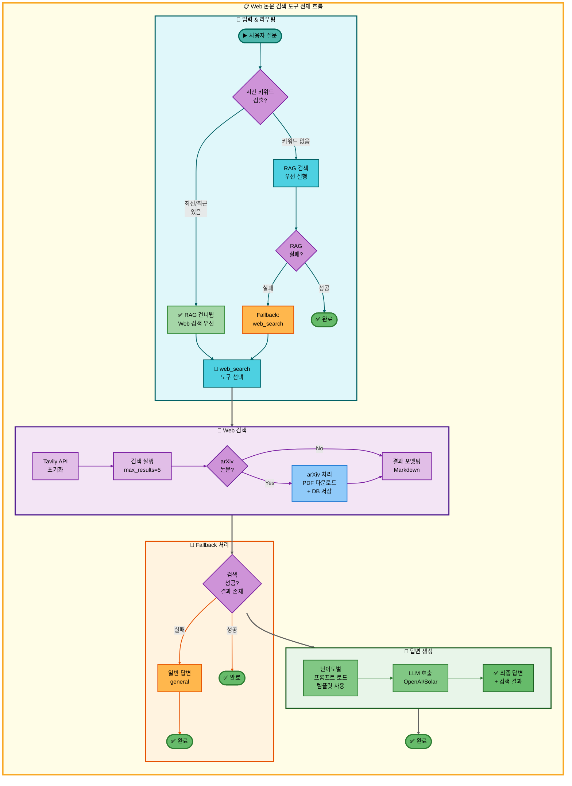

##### Web 검색 아키텍처

```mermaid
graph TB
    subgraph MainFlow["📋 Web 논문 검색 도구 전체 흐름"]
        direction TB

        subgraph Input["🔸 입력 & 라우팅"]
            direction LR
            Start([▶️ 사용자 질문]) --> TimeKeyword{시간 키워드<br/>검출?}
            TimeKeyword -->|최신/최근<br/>있음| SkipRAG[✅ RAG 건너뜀<br/>Web 검색 우선]
            TimeKeyword -->|키워드 없음| RAGFirst[RAG 검색<br/>우선 실행]
            SkipRAG --> WebTool[🔧 web_search<br/>도구 선택]
            RAGFirst --> RAGFail{RAG<br/>실패?}
            RAGFail -->|실패| FallbackWeb[Fallback:<br/>web_search]
            RAGFail -->|성공| End1([✅ 완료])
            FallbackWeb --> WebTool
        end

        subgraph Search["🔹 Web 검색"]
            direction LR
            TavilyInit[Tavily API<br/>초기화] --> TavilySearch[검색 실행<br/>max_results=5]
            TavilySearch --> CheckArxiv{arXiv<br/>논문?}
            CheckArxiv -->|Yes| SaveArxiv[arXiv 처리<br/>PDF 다운로드<br/>+ DB 저장]
            CheckArxiv -->|No| Format[결과 포맷팅<br/>Markdown]
            SaveArxiv --> Format
        end

        subgraph Generation["🔺 답변 생성"]
            direction LR
            PromptLoad[난이도별<br/>프롬프트 로드<br/>템플릿 사용] --> LLMCall[LLM 호출<br/>OpenAI/Solar]
            LLMCall --> FinalAnswer[✅ 최종 답변<br/>+ 검색 결과]
        end

        subgraph Fallback["🔶 Fallback 처리"]
            direction LR
            CheckResult{검색<br/>성공?<br/>결과 존재}
            CheckResult -->|실패| GeneralAnswer[일반 답변<br/>general]
            CheckResult -->|성공| End2([✅ 완료])
            GeneralAnswer --> End3([✅ 완료])
        end

        %% 단계 간 연결
        WebTool --> Search
        Search --> CheckResult
        CheckResult --> Generation
        Generation --> End4([✅ 완료])
    end

    %% 메인 워크플로우 배경
    style MainFlow fill:#fffde7,stroke:#f9a825,stroke-width:4px,color:#000

    %% Subgraph 스타일
    style Input fill:#e0f7fa,stroke:#006064,stroke-width:3px,color:#000
    style Search fill:#f3e5f5,stroke:#4a148c,stroke-width:3px,color:#000
    style Generation fill:#e8f5e9,stroke:#1b5e20,stroke-width:3px,color:#000
    style Fallback fill:#fff3e0,stroke:#e65100,stroke-width:3px,color:#000

    %% 노드 스타일 (입력 - 청록 계열)
    style Start fill:#4db6ac,stroke:#00695c,stroke-width:3px,color:#000
    style TimeKeyword fill:#ce93d8,stroke:#7b1fa2,stroke-width:2px,color:#000
    style SkipRAG fill:#a5d6a7,stroke:#388e3c,stroke-width:2px,color:#000
    style RAGFirst fill:#4dd0e1,stroke:#006064,stroke-width:2px,color:#000
    style WebTool fill:#4dd0e1,stroke:#006064,stroke-width:2px,color:#000
    style RAGFail fill:#ce93d8,stroke:#7b1fa2,stroke-width:2px,color:#000
    style FallbackWeb fill:#ffb74d,stroke:#e65100,stroke-width:2px,color:#000

    %% 노드 스타일 (검색 - 보라 계열)
    style TavilyInit fill:#e1bee7,stroke:#7b1fa2,stroke-width:2px,color:#000
    style TavilySearch fill:#e1bee7,stroke:#7b1fa2,stroke-width:2px,color:#000
    style CheckArxiv fill:#ce93d8,stroke:#6a1b9a,stroke-width:2px,color:#000
    style SaveArxiv fill:#90caf9,stroke:#1976d2,stroke-width:2px,color:#000
    style Format fill:#e1bee7,stroke:#7b1fa2,stroke-width:2px,color:#000

    %% 노드 스타일 (생성 - 녹색 계열)
    style PromptLoad fill:#81c784,stroke:#2e7d32,stroke-width:2px,color:#000
    style LLMCall fill:#81c784,stroke:#2e7d32,stroke-width:2px,color:#000
    style FinalAnswer fill:#66bb6a,stroke:#1b5e20,stroke-width:2px,color:#000

    %% 노드 스타일 (Fallback - 주황 계열)
    style CheckResult fill:#ce93d8,stroke:#7b1fa2,stroke-width:2px,color:#000
    style GeneralAnswer fill:#ffb74d,stroke:#e65100,stroke-width:2px,color:#000

    %% 종료 노드
    style End1 fill:#66bb6a,stroke:#2e7d32,stroke-width:3px,color:#000
    style End2 fill:#66bb6a,stroke:#2e7d32,stroke-width:3px,color:#000
    style End3 fill:#66bb6a,stroke:#2e7d32,stroke-width:3px,color:#000
    style End4 fill:#66bb6a,stroke:#2e7d32,stroke-width:3px,color:#000

    %% 연결선 스타일 (Input 단계: 0-7)
    linkStyle 0,1,2,3,4,5,6,7 stroke:#006064,stroke-width:2px

    %% 연결선 스타일 (Search 단계: 8-12)
    linkStyle 8,9,10,11,12 stroke:#7b1fa2,stroke-width:2px

    %% 연결선 스타일 (Generation 단계: 13-14)
    linkStyle 13,14 stroke:#2e7d32,stroke-width:2px

    %% 연결선 스타일 (Fallback 단계: 15-17)
    linkStyle 15,16,17 stroke:#e65100,stroke-width:2px

    %% 연결선 스타일 (단계 간 연결: 18-21)
    linkStyle 18,19,20,21 stroke:#616161,stroke-width:3px
```