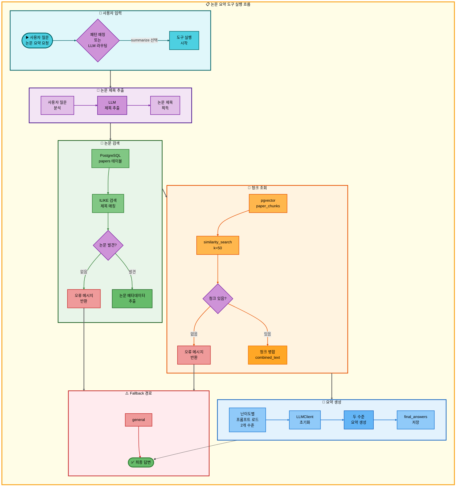

##### 논문 요약 아키텍처

```mermaid
graph TB
    subgraph MainFlow["📋 논문 요약 도구 실행 흐름"]
        direction TB

        subgraph UserInput["🔸 사용자 입력"]
            direction LR
            A([▶️ 사용자 질문<br/>논문 요약 요청]) --> B{패턴 매칭<br/>또는<br/>LLM 라우팅}
            B -->|summarize 선택| C[도구 실행<br/>시작]
        end

        subgraph TitleExtraction["🔹 논문 제목 추출"]
            direction LR
            D[사용자 질문<br/>분석] --> E[LLM<br/>제목 추출]
            E --> F[논문 제목<br/>획득]
        end

        subgraph PaperSearch["🔺 논문 검색"]
            direction LR
            G[PostgreSQL<br/>papers 테이블] --> H[ILIKE 검색<br/>제목 매칭]
            H --> I{논문 발견?}
            I -->|없음| J[오류 메시지<br/>반환]
            I -->|발견| K[논문 메타데이터<br/>추출]
        end

        subgraph ChunkRetrieval["🔶 청크 조회"]
            direction LR
            L[pgvector<br/>paper_chunks] --> M[similarity_search<br/>k=50]
            M --> N{청크 있음?}
            N -->|없음| O[오류 메시지<br/>반환]
            N -->|있음| P[청크 병합<br/>combined_text]
        end

        subgraph Summarization["💾 요약 생성"]
            direction LR
            Q[난이도별<br/>프롬프트 로드<br/>2개 수준] --> R[LLMClient<br/>초기화]
            R --> S[두 수준<br/>요약 생성]
            S --> T[final_answers<br/>저장]
        end

        subgraph FallbackChain["⚠️ Fallback 경로"]
            direction LR
            U[general] --> V([✅ 최종 답변])
        end

        %% 단계 간 연결
        UserInput --> TitleExtraction
        TitleExtraction --> PaperSearch
        PaperSearch --> ChunkRetrieval
        ChunkRetrieval --> Summarization
        J --> FallbackChain
        O --> FallbackChain
        Summarization --> V
    end

    %% 메인 워크플로우 배경
    style MainFlow fill:#fffde7,stroke:#f9a825,stroke-width:4px,color:#000

    %% Subgraph 스타일
    style UserInput fill:#e0f7fa,stroke:#006064,stroke-width:3px,color:#000
    style TitleExtraction fill:#f3e5f5,stroke:#4a148c,stroke-width:3px,color:#000
    style PaperSearch fill:#e8f5e9,stroke:#1b5e20,stroke-width:3px,color:#000
    style ChunkRetrieval fill:#fff3e0,stroke:#e65100,stroke-width:3px,color:#000
    style Summarization fill:#e3f2fd,stroke:#1565c0,stroke-width:3px,color:#000
    style FallbackChain fill:#ffebee,stroke:#c62828,stroke-width:3px,color:#000

    %% 노드 스타일 (사용자 입력 - 청록 계열)
    style A fill:#4dd0e1,stroke:#006064,stroke-width:3px,color:#000
    style B fill:#ce93d8,stroke:#7b1fa2,stroke-width:2px,color:#000
    style C fill:#4dd0e1,stroke:#006064,stroke-width:2px,color:#000

    %% 노드 스타일 (제목 추출 - 보라 계열)
    style D fill:#e1bee7,stroke:#7b1fa2,stroke-width:2px,color:#000
    style E fill:#ce93d8,stroke:#6a1b9a,stroke-width:2px,color:#000
    style F fill:#e1bee7,stroke:#7b1fa2,stroke-width:2px,color:#000

    %% 노드 스타일 (논문 검색 - 녹색 계열)
    style G fill:#81c784,stroke:#2e7d32,stroke-width:2px,color:#000
    style H fill:#81c784,stroke:#2e7d32,stroke-width:2px,color:#000
    style I fill:#ce93d8,stroke:#7b1fa2,stroke-width:2px,color:#000
    style J fill:#ef9a9a,stroke:#c62828,stroke-width:2px,color:#000
    style K fill:#66bb6a,stroke:#1b5e20,stroke-width:2px,color:#000

    %% 노드 스타일 (청크 조회 - 주황 계열)
    style L fill:#ffb74d,stroke:#e65100,stroke-width:2px,color:#000
    style M fill:#ffb74d,stroke:#e65100,stroke-width:2px,color:#000
    style N fill:#ce93d8,stroke:#7b1fa2,stroke-width:2px,color:#000
    style O fill:#ef9a9a,stroke:#c62828,stroke-width:2px,color:#000
    style P fill:#ffa726,stroke:#ef6c00,stroke-width:2px,color:#000

    %% 노드 스타일 (요약 생성 - 파랑 계열)
    style Q fill:#90caf9,stroke:#1976d2,stroke-width:2px,color:#000
    style R fill:#90caf9,stroke:#1976d2,stroke-width:2px,color:#000
    style S fill:#64b5f6,stroke:#1565c0,stroke-width:2px,color:#000
    style T fill:#90caf9,stroke:#1976d2,stroke-width:2px,color:#000

    %% 노드 스타일 (Fallback - 빨강 계열)
    style U fill:#ef9a9a,stroke:#c62828,stroke-width:2px,color:#000
    style V fill:#66bb6a,stroke:#2e7d32,stroke-width:3px,color:#000

    %% 연결선 스타일 (UserInput: 0-1)
    linkStyle 0,1 stroke:#006064,stroke-width:2px

    %% 연결선 스타일 (TitleExtraction: 2-3)
    linkStyle 2,3 stroke:#7b1fa2,stroke-width:2px

    %% 연결선 스타일 (PaperSearch: 4-7)
    linkStyle 4,5,6,7 stroke:#2e7d32,stroke-width:2px

    %% 연결선 스타일 (ChunkRetrieval: 8-11)
    linkStyle 8,9,10,11 stroke:#e65100,stroke-width:2px

    %% 연결선 스타일 (Summarization: 12-14)
    linkStyle 12,13,14 stroke:#1976d2,stroke-width:2px

    %% 연결선 스타일 (Fallback: 15)
    linkStyle 15 stroke:#c62828,stroke-width:2px

    %% 단계 간 연결 (회색: 16-21)
    linkStyle 16,17,18,19,20,21 stroke:#616161,stroke-width:3px
```