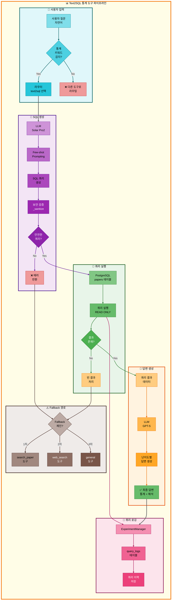

##### Text2SQL 통계 아키텍처

```mermaid
graph TB
    subgraph MainFlow["📊 Text2SQL 통계 도구 파이프라인"]
        direction TB

        subgraph UserInput["🔸 사용자 입력"]
            direction LR
            A[사용자 질문<br/>자연어] --> B{통계<br/>키워드<br/>감지?}
            B -->|Yes| C[라우터<br/>text2sql 선택]
            B -->|No| D[❌ 다른 도구로<br/>라우팅]
        end

        subgraph SQLGeneration["🔹 SQL 생성"]
            direction LR
            E[LLM<br/>Solar Pro2] --> F[Few-shot<br/>Prompting]
            F --> G[SQL 쿼리<br/>생성]
            G --> H[보안 검증<br/>_sanitize]
            H --> I{안전한<br/>쿼리?}
            I -->|No| J[❌ 에러<br/>반환]
        end

        subgraph Execution["🔺 쿼리 실행"]
            direction LR
            I -->|Yes| K[PostgreSQL<br/>papers 테이블]
            K --> L[쿼리 실행<br/>READ ONLY]
            L --> M{결과<br/>존재?}
            M -->|No| N[빈 결과<br/>처리]
        end

        subgraph AnswerGen["🔶 답변 생성"]
            direction LR
            M -->|Yes| O[쿼리 결과<br/>데이터]
            O --> P[LLM<br/>GPT-5]
            P --> Q[난이도별<br/>답변 생성]
            Q --> R[✅ 최종 답변<br/>통계 + 해석]
        end

        subgraph Logging["💾 쿼리 로깅"]
            direction LR
            L --> S[ExperimentManager]
            S --> T[query_logs<br/>테이블]
            T --> U[쿼리 이력<br/>저장]
        end

        subgraph FallbackChain["⚠️ Fallback 경로"]
            direction LR
            J --> V{Fallback<br/>체인?}
            N --> V
            V -->|1차| W[search_paper<br/>도구]
            V -->|2차| X[web_search<br/>도구]
            V -->|3차| Y[general<br/>도구]
        end

        C --> E
        R --> S
    end

    %% Subgraph 스타일
    style MainFlow fill:#fffde7,stroke:#f57f17,stroke-width:4px,color:#000

    style UserInput fill:#e0f7fa,stroke:#006064,stroke-width:3px,color:#000
    style SQLGeneration fill:#f3e5f5,stroke:#4a148c,stroke-width:3px,color:#000
    style Execution fill:#e8f5e9,stroke:#1b5e20,stroke-width:3px,color:#000
    style AnswerGen fill:#fff3e0,stroke:#e65100,stroke-width:3px,color:#000
    style Logging fill:#fce4ec,stroke:#880e4f,stroke-width:3px,color:#000
    style FallbackChain fill:#efebe9,stroke:#3e2723,stroke-width:3px,color:#000

    %% 노드 스타일 (Input 단계)
    style A fill:#80deea,stroke:#00838f,color:#000
    style B fill:#4dd0e1,stroke:#00838f,color:#000
    style C fill:#26c6da,stroke:#00838f,color:#000
    style D fill:#ef9a9a,stroke:#c62828,color:#000

    %% 노드 스타일 (SQL Generation 단계)
    style E fill:#ce93d8,stroke:#6a1b9a,color:#000
    style F fill:#ba68c8,stroke:#6a1b9a,color:#000
    style G fill:#ab47bc,stroke:#6a1b9a,color:#000
    style H fill:#9c27b0,stroke:#6a1b9a,color:#fff
    style I fill:#8e24aa,stroke:#6a1b9a,color:#fff
    style J fill:#ef9a9a,stroke:#c62828,color:#000

    %% 노드 스타일 (Execution 단계)
    style K fill:#81c784,stroke:#2e7d32,color:#000
    style L fill:#66bb6a,stroke:#2e7d32,color:#000
    style M fill:#4caf50,stroke:#2e7d32,color:#fff
    style N fill:#ffcc80,stroke:#f57c00,color:#000

    %% 노드 스타일 (Answer Gen 단계)
    style O fill:#ffcc80,stroke:#ef6c00,color:#000
    style P fill:#ffb74d,stroke:#ef6c00,color:#000
    style Q fill:#ffa726,stroke:#ef6c00,color:#000
    style R fill:#66bb6a,stroke:#2e7d32,color:#000

    %% 노드 스타일 (Logging 단계)
    style S fill:#f48fb1,stroke:#ad1457,color:#000
    style T fill:#f06292,stroke:#ad1457,color:#000
    style U fill:#ec407a,stroke:#ad1457,color:#fff

    %% 노드 스타일 (Fallback 단계)
    style V fill:#bcaaa4,stroke:#4e342e,color:#000
    style W fill:#a1887f,stroke:#4e342e,color:#000
    style X fill:#8d6e63,stroke:#4e342e,color:#fff
    style Y fill:#795548,stroke:#4e342e,color:#fff

    %% 연결선 스타일 (Input 단계: 0-2)
    linkStyle 0,1,2 stroke:#006064,stroke-width:2px

    %% 연결선 스타일 (SQL Generation 단계: 3-8)
    linkStyle 3,4,5,6,7,8 stroke:#6a1b9a,stroke-width:2px

    %% 연결선 스타일 (Execution 단계: 9-12)
    linkStyle 9,10,11,12 stroke:#2e7d32,stroke-width:2px

    %% 연결선 스타일 (Answer Gen 단계: 13-15)
    linkStyle 13,14,15 stroke:#ef6c00,stroke-width:2px

    %% 연결선 스타일 (Logging 단계: 16-18)
    linkStyle 16,17,18 stroke:#ad1457,stroke-width:2px

    %% 연결선 스타일 (Fallback 단계: 19-23)
    linkStyle 19,20,21,22,23 stroke:#4e342e,stroke-width:2px

    %% 연결선 스타일 (단계 간 연결: 24-25)
    linkStyle 24,25 stroke:#616161,stroke-width:3px
```