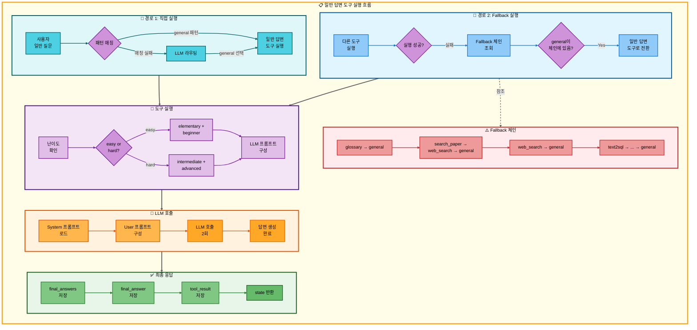

##### 일반 답변 도구 아키텍처

```mermaid
graph TB
    subgraph MainFlow["📋 일반 답변 도구 실행 흐름"]
        direction TB

        subgraph Path1["🔸 경로 1: 직접 실행"]
            direction LR
            A[사용자<br/>일반 질문] --> B{패턴 매칭}
            B -->|매칭 실패| C[LLM 라우팅]
            B -->|general 패턴| D[일반 답변<br/>도구 실행]
            C -->|general 선택| D
        end

        subgraph Path2["🔹 경로 2: Fallback 실행"]
            direction LR
            E[다른 도구<br/>실행] --> F{실행 성공?}
            F -->|실패| G[Fallback 체인<br/>조회]
            G --> H{general이<br/>체인에 있음?}
            H -->|Yes| I[일반 답변<br/>도구로 전환]
        end

        subgraph Execution["🔺 도구 실행"]
            direction LR
            J[난이도<br/>확인] --> K{easy or<br/>hard?}
            K -->|easy| L[elementary +<br/>beginner]
            K -->|hard| M[intermediate +<br/>advanced]
            L --> N[LLM 프롬프트<br/>구성]
            M --> N
        end

        subgraph LLMCall["🔶 LLM 호출"]
            direction LR
            O[System 프롬프트<br/>로드] --> P[User 프롬프트<br/>구성]
            P --> Q[LLM 호출<br/>2회]
            Q --> R[답변 생성<br/>완료]
        end

        subgraph Output["✅ 최종 응답"]
            direction LR
            S[final_answers<br/>저장] --> T[final_answer<br/>저장]
            T --> U[tool_result<br/>저장]
            U --> V[state 반환]
        end

        subgraph Fallback["⚠️ Fallback 체인"]
            direction LR
            W[glossary → general] --> X[search_paper →<br/>web_search → general]
            X --> Y[web_search → general]
            Y --> Z[text2sql → ... → general]
        end

        %% 경로 연결
        Path1 --> Execution
        Path2 --> Execution
        Execution --> LLMCall
        LLMCall --> Output
        Path2 -.참조.-> Fallback
    end

    %% 메인 워크플로우 배경
    style MainFlow fill:#fffde7,stroke:#f9a825,stroke-width:4px,color:#000

    %% Subgraph 스타일
    style Path1 fill:#e0f7fa,stroke:#006064,stroke-width:3px,color:#000
    style Path2 fill:#e1f5ff,stroke:#01579b,stroke-width:3px,color:#000
    style Execution fill:#f3e5f5,stroke:#4a148c,stroke-width:3px,color:#000
    style LLMCall fill:#fff3e0,stroke:#e65100,stroke-width:3px,color:#000
    style Output fill:#e8f5e9,stroke:#1b5e20,stroke-width:3px,color:#000
    style Fallback fill:#ffebee,stroke:#c62828,stroke-width:3px,color:#000

    %% 노드 스타일 (경로 1 - 청록 계열)
    style A fill:#4dd0e1,stroke:#006064,stroke-width:2px,color:#000
    style B fill:#ce93d8,stroke:#7b1fa2,stroke-width:2px,color:#000
    style C fill:#4dd0e1,stroke:#006064,stroke-width:2px,color:#000
    style D fill:#4dd0e1,stroke:#006064,stroke-width:2px,color:#000

    %% 노드 스타일 (경로 2 - 파랑 계열)
    style E fill:#90caf9,stroke:#1976d2,stroke-width:2px,color:#000
    style F fill:#ce93d8,stroke:#7b1fa2,stroke-width:2px,color:#000
    style G fill:#90caf9,stroke:#1976d2,stroke-width:2px,color:#000
    style H fill:#ce93d8,stroke:#7b1fa2,stroke-width:2px,color:#000
    style I fill:#90caf9,stroke:#1976d2,stroke-width:2px,color:#000

    %% 노드 스타일 (실행 - 보라 계열)
    style J fill:#e1bee7,stroke:#7b1fa2,stroke-width:2px,color:#000
    style K fill:#ce93d8,stroke:#6a1b9a,stroke-width:2px,color:#000
    style L fill:#e1bee7,stroke:#7b1fa2,stroke-width:2px,color:#000
    style M fill:#e1bee7,stroke:#7b1fa2,stroke-width:2px,color:#000
    style N fill:#e1bee7,stroke:#7b1fa2,stroke-width:2px,color:#000

    %% 노드 스타일 (LLM 호출 - 주황 계열)
    style O fill:#ffb74d,stroke:#e65100,stroke-width:2px,color:#000
    style P fill:#ffb74d,stroke:#e65100,stroke-width:2px,color:#000
    style Q fill:#ffa726,stroke:#ef6c00,stroke-width:2px,color:#000
    style R fill:#ffa726,stroke:#ef6c00,stroke-width:2px,color:#000

    %% 노드 스타일 (최종 응답 - 녹색 계열)
    style S fill:#81c784,stroke:#2e7d32,stroke-width:2px,color:#000
    style T fill:#81c784,stroke:#2e7d32,stroke-width:2px,color:#000
    style U fill:#81c784,stroke:#2e7d32,stroke-width:2px,color:#000
    style V fill:#66bb6a,stroke:#1b5e20,stroke-width:2px,color:#000

    %% 노드 스타일 (Fallback - 빨강 계열)
    style W fill:#ef9a9a,stroke:#c62828,stroke-width:2px,color:#000
    style X fill:#ef9a9a,stroke:#c62828,stroke-width:2px,color:#000
    style Y fill:#ef9a9a,stroke:#c62828,stroke-width:2px,color:#000
    style Z fill:#ef9a9a,stroke:#c62828,stroke-width:2px,color:#000

    %% 연결선 스타일 (경로 1 - 청록 0~4)
    linkStyle 0 stroke:#006064,stroke-width:2px
    linkStyle 1 stroke:#006064,stroke-width:2px
    linkStyle 2 stroke:#006064,stroke-width:2px
    linkStyle 3 stroke:#006064,stroke-width:2px

    %% 연결선 스타일 (경로 2 - 파랑 5~9)
    linkStyle 4 stroke:#1976d2,stroke-width:2px
    linkStyle 5 stroke:#1976d2,stroke-width:2px
    linkStyle 6 stroke:#1976d2,stroke-width:2px
    linkStyle 7 stroke:#1976d2,stroke-width:2px

    %% 연결선 스타일 (실행 - 보라 10~15)
    linkStyle 8 stroke:#7b1fa2,stroke-width:2px
    linkStyle 9 stroke:#7b1fa2,stroke-width:2px
    linkStyle 10 stroke:#7b1fa2,stroke-width:2px
    linkStyle 11 stroke:#7b1fa2,stroke-width:2px
    linkStyle 12 stroke:#7b1fa2,stroke-width:2px

    %% 연결선 스타일 (LLM 호출 - 주황 16~19)
    linkStyle 13 stroke:#e65100,stroke-width:2px
    linkStyle 14 stroke:#e65100,stroke-width:2px
    linkStyle 15 stroke:#e65100,stroke-width:2px

    %% 연결선 스타일 (최종 응답 - 녹색 20~23)
    linkStyle 16 stroke:#2e7d32,stroke-width:2px
    linkStyle 17 stroke:#2e7d32,stroke-width:2px
    linkStyle 18 stroke:#2e7d32,stroke-width:2px

    %% 연결선 스타일 (Fallback - 빨강 24~26)
    linkStyle 19 stroke:#c62828,stroke-width:2px
    linkStyle 20 stroke:#c62828,stroke-width:2px
    linkStyle 21 stroke:#c62828,stroke-width:2px

    %% 단계 간 연결 (회색 27~31)
    linkStyle 22 stroke:#616161,stroke-width:3px
    linkStyle 23 stroke:#616161,stroke-width:3px
    linkStyle 24 stroke:#616161,stroke-width:3px
    linkStyle 25 stroke:#616161,stroke-width:3px
    linkStyle 26 stroke:#616161,stroke-width:2px,stroke-dasharray:5
```