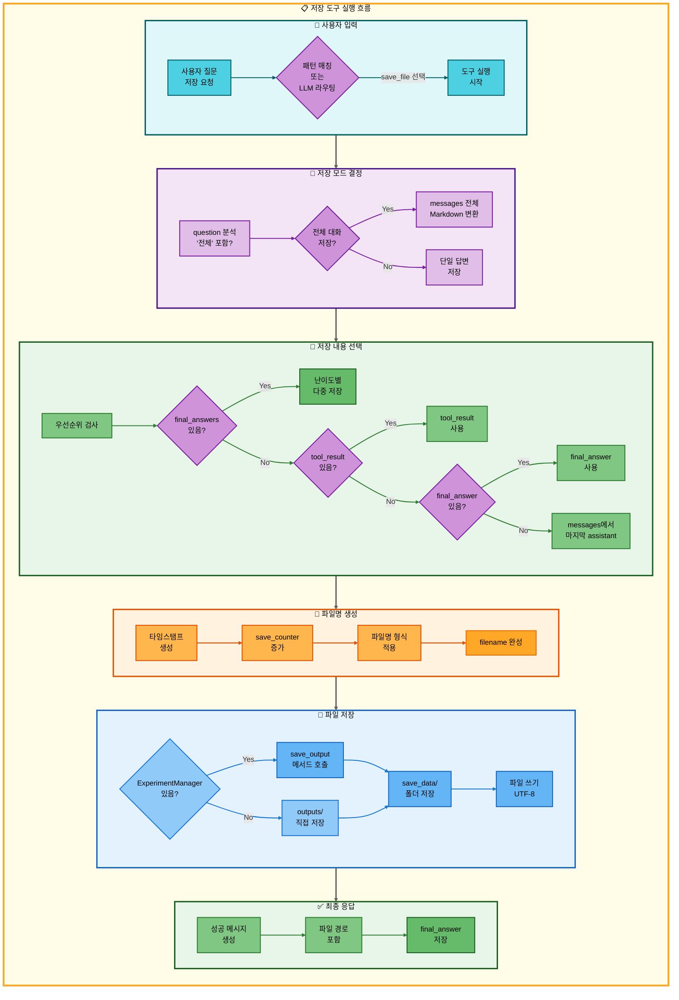

##### 파일 저장 도구 아키텍처

```mermaid
graph TB
    subgraph MainFlow["📋 저장 도구 실행 흐름"]
        direction TB

        subgraph UserInput["🔸 사용자 입력"]
            direction LR
            A[사용자 질문<br/>저장 요청] --> B{패턴 매칭<br/>또는<br/>LLM 라우팅}
            B -->|save_file 선택| C[도구 실행<br/>시작]
        end

        subgraph ModeDecision["🔹 저장 모드 결정"]
            direction LR
            D[question 분석<br/>'전체' 포함?] --> E{전체 대화<br/>저장?}
            E -->|Yes| F[messages 전체<br/>Markdown 변환]
            E -->|No| G[단일 답변<br/>저장]
        end

        subgraph ContentSelection["🔺 저장 내용 선택"]
            direction LR
            H[우선순위 검사] --> I{final_answers<br/>있음?}
            I -->|Yes| J[난이도별<br/>다중 저장]
            I -->|No| K{tool_result<br/>있음?}
            K -->|Yes| L[tool_result<br/>사용]
            K -->|No| M{final_answer<br/>있음?}
            M -->|Yes| N[final_answer<br/>사용]
            M -->|No| O[messages에서<br/>마지막 assistant]
        end

        subgraph FileNaming["🔶 파일명 생성"]
            direction LR
            P[타임스탬프<br/>생성] --> Q[save_counter<br/>증가]
            Q --> R[파일명 형식<br/>적용]
            R --> S[filename 완성]
        end

        subgraph FileSave["💾 파일 저장"]
            direction LR
            T{ExperimentManager<br/>있음?} -->|Yes| U[save_output<br/>메서드 호출]
            T -->|No| V[outputs/<br/>직접 저장]
            U --> W[save_data/<br/>폴더 저장]
            V --> W
            W --> X[파일 쓰기<br/>UTF-8]
        end

        subgraph FinalAnswer["✅ 최종 응답"]
            direction LR
            Y[성공 메시지<br/>생성] --> Z[파일 경로<br/>포함]
            Z --> AA[final_answer<br/>저장]
        end

        %% 단계 간 연결
        UserInput --> ModeDecision
        ModeDecision --> ContentSelection
        ContentSelection --> FileNaming
        FileNaming --> FileSave
        FileSave --> FinalAnswer
    end

    %% 메인 워크플로우 배경
    style MainFlow fill:#fffde7,stroke:#f9a825,stroke-width:4px,color:#000

    %% Subgraph 스타일
    style UserInput fill:#e0f7fa,stroke:#006064,stroke-width:3px,color:#000
    style ModeDecision fill:#f3e5f5,stroke:#4a148c,stroke-width:3px,color:#000
    style ContentSelection fill:#e8f5e9,stroke:#1b5e20,stroke-width:3px,color:#000
    style FileNaming fill:#fff3e0,stroke:#e65100,stroke-width:3px,color:#000
    style FileSave fill:#e3f2fd,stroke:#1565c0,stroke-width:3px,color:#000
    style FinalAnswer fill:#e8f5e9,stroke:#1b5e20,stroke-width:3px,color:#000

    %% 노드 스타일 (사용자 입력 - 청록 계열)
    style A fill:#4dd0e1,stroke:#006064,stroke-width:2px,color:#000
    style B fill:#ce93d8,stroke:#7b1fa2,stroke-width:2px,color:#000
    style C fill:#4dd0e1,stroke:#006064,stroke-width:2px,color:#000

    %% 노드 스타일 (모드 결정 - 보라 계열)
    style D fill:#e1bee7,stroke:#7b1fa2,stroke-width:2px,color:#000
    style E fill:#ce93d8,stroke:#6a1b9a,stroke-width:2px,color:#000
    style F fill:#e1bee7,stroke:#7b1fa2,stroke-width:2px,color:#000
    style G fill:#e1bee7,stroke:#7b1fa2,stroke-width:2px,color:#000

    %% 노드 스타일 (내용 선택 - 녹색 계열)
    style H fill:#81c784,stroke:#2e7d32,stroke-width:2px,color:#000
    style I fill:#ce93d8,stroke:#7b1fa2,stroke-width:2px,color:#000
    style J fill:#66bb6a,stroke:#1b5e20,stroke-width:2px,color:#000
    style K fill:#ce93d8,stroke:#7b1fa2,stroke-width:2px,color:#000
    style L fill:#81c784,stroke:#2e7d32,stroke-width:2px,color:#000
    style M fill:#ce93d8,stroke:#7b1fa2,stroke-width:2px,color:#000
    style N fill:#81c784,stroke:#2e7d32,stroke-width:2px,color:#000
    style O fill:#81c784,stroke:#2e7d32,stroke-width:2px,color:#000

    %% 노드 스타일 (파일명 생성 - 주황 계열)
    style P fill:#ffb74d,stroke:#e65100,stroke-width:2px,color:#000
    style Q fill:#ffb74d,stroke:#e65100,stroke-width:2px,color:#000
    style R fill:#ffb74d,stroke:#e65100,stroke-width:2px,color:#000
    style S fill:#ffa726,stroke:#ef6c00,stroke-width:2px,color:#000

    %% 노드 스타일 (파일 저장 - 파랑 계열)
    style T fill:#90caf9,stroke:#1976d2,stroke-width:2px,color:#000
    style U fill:#64b5f6,stroke:#1565c0,stroke-width:2px,color:#000
    style V fill:#90caf9,stroke:#1976d2,stroke-width:2px,color:#000
    style W fill:#64b5f6,stroke:#1565c0,stroke-width:2px,color:#000
    style X fill:#64b5f6,stroke:#1565c0,stroke-width:2px,color:#000

    %% 노드 스타일 (최종 응답 - 녹색 계열)
    style Y fill:#81c784,stroke:#2e7d32,stroke-width:2px,color:#000
    style Z fill:#81c784,stroke:#2e7d32,stroke-width:2px,color:#000
    style AA fill:#66bb6a,stroke:#1b5e20,stroke-width:2px,color:#000

    %% 연결선 스타일 (사용자 입력 - 청록 0~1)
    linkStyle 0 stroke:#006064,stroke-width:2px
    linkStyle 1 stroke:#006064,stroke-width:2px

    %% 연결선 스타일 (모드 결정 - 보라 2~4)
    linkStyle 2 stroke:#7b1fa2,stroke-width:2px
    linkStyle 3 stroke:#7b1fa2,stroke-width:2px
    linkStyle 4 stroke:#7b1fa2,stroke-width:2px

    %% 연결선 스타일 (내용 선택 - 녹색 5~11)
    linkStyle 5 stroke:#2e7d32,stroke-width:2px
    linkStyle 6 stroke:#2e7d32,stroke-width:2px
    linkStyle 7 stroke:#2e7d32,stroke-width:2px
    linkStyle 8 stroke:#2e7d32,stroke-width:2px
    linkStyle 9 stroke:#2e7d32,stroke-width:2px
    linkStyle 10 stroke:#2e7d32,stroke-width:2px
    linkStyle 11 stroke:#2e7d32,stroke-width:2px

    %% 연결선 스타일 (파일명 생성 - 주황 12~14)
    linkStyle 12 stroke:#e65100,stroke-width:2px
    linkStyle 13 stroke:#e65100,stroke-width:2px
    linkStyle 14 stroke:#e65100,stroke-width:2px

    %% 연결선 스타일 (파일 저장 - 파랑 15~19)
    linkStyle 15 stroke:#1976d2,stroke-width:2px
    linkStyle 16 stroke:#1976d2,stroke-width:2px
    linkStyle 17 stroke:#1976d2,stroke-width:2px
    linkStyle 18 stroke:#1976d2,stroke-width:2px
    linkStyle 19 stroke:#1976d2,stroke-width:2px

    %% 연결선 스타일 (최종 응답 - 녹색 20~21)
    linkStyle 20 stroke:#2e7d32,stroke-width:2px
    linkStyle 21 stroke:#2e7d32,stroke-width:2px

    %% 단계 간 연결 (회색 22~26)
    linkStyle 22 stroke:#616161,stroke-width:3px
    linkStyle 23 stroke:#616161,stroke-width:3px
    linkStyle 24 stroke:#616161,stroke-width:3px
    linkStyle 25 stroke:#616161,stroke-width:3px
    linkStyle 26 stroke:#616161,stroke-width:3px
```