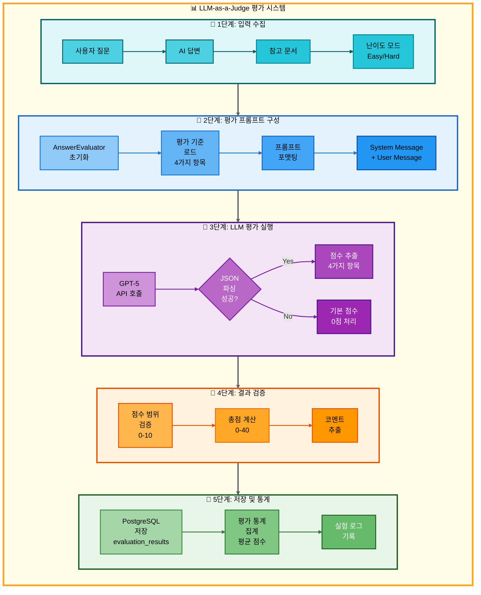

#### 평가 시스템 아키텍처

```mermaid
graph TB
    subgraph MainFlow["📊 LLM-as-a-Judge 평가 시스템"]
        direction TB

        subgraph Stage1["🔸 1단계: 입력 수집"]
            direction LR
            A[사용자 질문] --> B[AI 답변]
            B --> C[참고 문서]
            C --> D[난이도 모드<br/>Easy/Hard]
        end

        subgraph Stage2["🔹 2단계: 평가 프롬프트 구성"]
            direction LR
            E[AnswerEvaluator<br/>초기화] --> F[평가 기준<br/>로드<br/>4가지 항목]
            F --> G[프롬프트<br/>포맷팅]
            G --> H[System Message<br/>+ User Message]
        end

        subgraph Stage3["🔺 3단계: LLM 평가 실행"]
            direction LR
            I[GPT-5<br/>API 호출] --> J{JSON<br/>파싱<br/>성공?}
            J -->|Yes| K[점수 추출<br/>4가지 항목]
            J -->|No| L[기본 점수<br/>0점 처리]
        end

        subgraph Stage4["🔶 4단계: 결과 검증"]
            direction LR
            M[점수 범위<br/>검증<br/>0-10] --> N[총점 계산<br/>0-40]
            N --> O[코멘트<br/>추출]
        end

        subgraph Stage5["🔷 5단계: 저장 및 통계"]
            direction LR
            P[PostgreSQL<br/>저장<br/>evaluation_results] --> Q[평가 통계<br/>집계<br/>평균 점수]
            Q --> R[실험 로그<br/>기록]
        end

        %% 단계 간 연결
        Stage1 --> Stage2
        Stage2 --> Stage3
        Stage3 --> Stage4
        Stage4 --> Stage5
    end

    %% MainFlow 스타일
    style MainFlow fill:#fffde7,stroke:#f9a825,stroke-width:4px,color:#000

    %% Subgraph 스타일 (5단계 색상)
    style Stage1 fill:#e0f7fa,stroke:#006064,stroke-width:3px,color:#000
    style Stage2 fill:#e3f2fd,stroke:#1565c0,stroke-width:3px,color:#000
    style Stage3 fill:#f3e5f5,stroke:#4a148c,stroke-width:3px,color:#000
    style Stage4 fill:#fff3e0,stroke:#e65100,stroke-width:3px,color:#000
    style Stage5 fill:#e8f5e9,stroke:#1b5e20,stroke-width:3px,color:#000

    %% 노드 스타일 (1단계 - 청록)
    style A fill:#4dd0e1,stroke:#006064,stroke-width:2px,color:#000
    style B fill:#4dd0e1,stroke:#006064,stroke-width:2px,color:#000
    style C fill:#26c6da,stroke:#00838f,stroke-width:2px,color:#000
    style D fill:#26c6da,stroke:#00838f,stroke-width:2px,color:#000

    %% 노드 스타일 (2단계 - 파랑)
    style E fill:#90caf9,stroke:#1976d2,stroke-width:2px,color:#000
    style F fill:#64b5f6,stroke:#1976d2,stroke-width:2px,color:#000
    style G fill:#42a5f5,stroke:#1565c0,stroke-width:2px,color:#000
    style H fill:#2196f3,stroke:#0d47a1,stroke-width:2px,color:#000

    %% 노드 스타일 (3단계 - 보라)
    style I fill:#ce93d8,stroke:#7b1fa2,stroke-width:2px,color:#000
    style J fill:#ba68c8,stroke:#7b1fa2,stroke-width:2px,color:#fff
    style K fill:#ab47bc,stroke:#4a148c,stroke-width:2px,color:#fff
    style L fill:#9c27b0,stroke:#4a148c,stroke-width:2px,color:#fff

    %% 노드 스타일 (4단계 - 주황)
    style M fill:#ffb74d,stroke:#e65100,stroke-width:2px,color:#000
    style N fill:#ffa726,stroke:#ef6c00,stroke-width:2px,color:#000
    style O fill:#ff9800,stroke:#e65100,stroke-width:2px,color:#000

    %% 노드 스타일 (5단계 - 녹색)
    style P fill:#a5d6a7,stroke:#388e3c,stroke-width:2px,color:#000
    style Q fill:#81c784,stroke:#2e7d32,stroke-width:2px,color:#000
    style R fill:#66bb6a,stroke:#1b5e20,stroke-width:2px,color:#fff

    %% 연결선 스타일 (1단계 - 청록 0~2)
    linkStyle 0 stroke:#006064,stroke-width:2px
    linkStyle 1 stroke:#006064,stroke-width:2px
    linkStyle 2 stroke:#006064,stroke-width:2px

    %% 연결선 스타일 (2단계 - 파랑 3~5)
    linkStyle 3 stroke:#1976d2,stroke-width:2px
    linkStyle 4 stroke:#1976d2,stroke-width:2px
    linkStyle 5 stroke:#1976d2,stroke-width:2px

    %% 연결선 스타일 (3단계 - 보라 6~8)
    linkStyle 6 stroke:#7b1fa2,stroke-width:2px
    linkStyle 7 stroke:#7b1fa2,stroke-width:2px
    linkStyle 8 stroke:#7b1fa2,stroke-width:2px

    %% 연결선 스타일 (4단계 - 주황 9~10)
    linkStyle 9 stroke:#e65100,stroke-width:2px
    linkStyle 10 stroke:#e65100,stroke-width:2px

    %% 연결선 스타일 (5단계 - 녹색 11~12)
    linkStyle 11 stroke:#2e7d32,stroke-width:2px
    linkStyle 12 stroke:#2e7d32,stroke-width:2px

    %% 단계 간 연결 (회색 13~16)
    linkStyle 13 stroke:#616161,stroke-width:3px
    linkStyle 14 stroke:#616161,stroke-width:3px
    linkStyle 15 stroke:#616161,stroke-width:3px
    linkStyle 16 stroke:#616161,stroke-width:3px
```