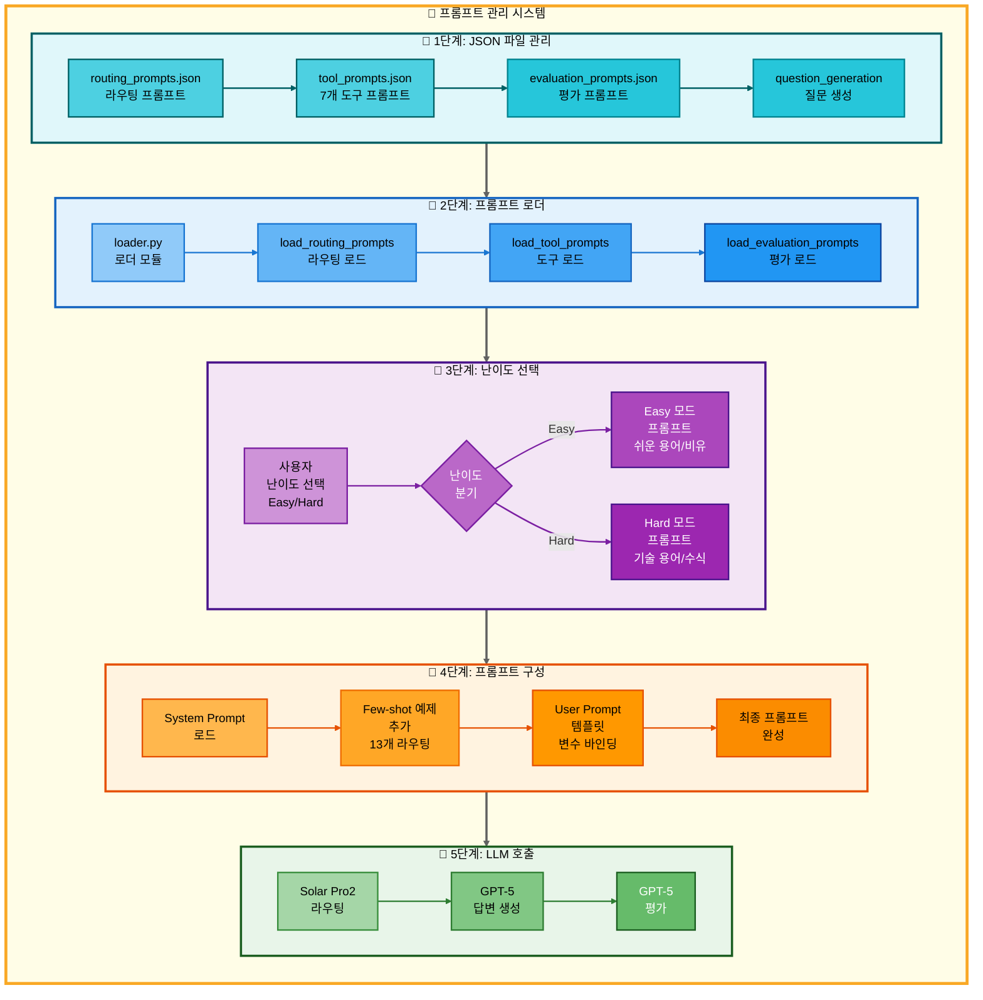

#### 프롬프트 시스템 아키텍처

```mermaid
graph TB
    subgraph MainFlow["📝 프롬프트 관리 시스템"]
        direction TB

        subgraph Stage1["🔸 1단계: JSON 파일 관리"]
            direction LR
            A[routing_prompts.json<br/>라우팅 프롬프트] --> B[tool_prompts.json<br/>7개 도구 프롬프트]
            B --> C[evaluation_prompts.json<br/>평가 프롬프트]
            C --> D[question_generation<br/>질문 생성]
        end

        subgraph Stage2["🔹 2단계: 프롬프트 로더"]
            direction LR
            E[loader.py<br/>로더 모듈] --> F[load_routing_prompts<br/>라우팅 로드]
            F --> G[load_tool_prompts<br/>도구 로드]
            G --> H[load_evaluation_prompts<br/>평가 로드]
        end

        subgraph Stage3["🔺 3단계: 난이도 선택"]
            direction LR
            I[사용자<br/>난이도 선택<br/>Easy/Hard] --> J{난이도<br/>분기}
            J -->|Easy| K[Easy 모드<br/>프롬프트<br/>쉬운 용어/비유]
            J -->|Hard| L[Hard 모드<br/>프롬프트<br/>기술 용어/수식]
        end

        subgraph Stage4["🔶 4단계: 프롬프트 구성"]
            direction LR
            M[System Prompt<br/>로드] --> N[Few-shot 예제<br/>추가<br/>13개 라우팅]
            N --> O[User Prompt<br/>템플릿<br/>변수 바인딩]
            O --> P[최종 프롬프트<br/>완성]
        end

        subgraph Stage5["🔷 5단계: LLM 호출"]
            direction LR
            Q[Solar Pro2<br/>라우팅] --> R[GPT-5<br/>답변 생성]
            R --> S[GPT-5<br/>평가]
        end

        %% 단계 간 연결
        Stage1 --> Stage2
        Stage2 --> Stage3
        Stage3 --> Stage4
        Stage4 --> Stage5
    end

    %% MainFlow 스타일
    style MainFlow fill:#fffde7,stroke:#f9a825,stroke-width:4px,color:#000

    %% Subgraph 스타일 (5단계 색상)
    style Stage1 fill:#e0f7fa,stroke:#006064,stroke-width:3px,color:#000
    style Stage2 fill:#e3f2fd,stroke:#1565c0,stroke-width:3px,color:#000
    style Stage3 fill:#f3e5f5,stroke:#4a148c,stroke-width:3px,color:#000
    style Stage4 fill:#fff3e0,stroke:#e65100,stroke-width:3px,color:#000
    style Stage5 fill:#e8f5e9,stroke:#1b5e20,stroke-width:3px,color:#000

    %% 노드 스타일 (1단계 - 청록)
    style A fill:#4dd0e1,stroke:#006064,stroke-width:2px,color:#000
    style B fill:#4dd0e1,stroke:#006064,stroke-width:2px,color:#000
    style C fill:#26c6da,stroke:#00838f,stroke-width:2px,color:#000
    style D fill:#26c6da,stroke:#00838f,stroke-width:2px,color:#000

    %% 노드 스타일 (2단계 - 파랑)
    style E fill:#90caf9,stroke:#1976d2,stroke-width:2px,color:#000
    style F fill:#64b5f6,stroke:#1976d2,stroke-width:2px,color:#000
    style G fill:#42a5f5,stroke:#1565c0,stroke-width:2px,color:#000
    style H fill:#2196f3,stroke:#0d47a1,stroke-width:2px,color:#000

    %% 노드 스타일 (3단계 - 보라)
    style I fill:#ce93d8,stroke:#7b1fa2,stroke-width:2px,color:#000
    style J fill:#ba68c8,stroke:#7b1fa2,stroke-width:2px,color:#fff
    style K fill:#ab47bc,stroke:#4a148c,stroke-width:2px,color:#fff
    style L fill:#9c27b0,stroke:#4a148c,stroke-width:2px,color:#fff

    %% 노드 스타일 (4단계 - 주황)
    style M fill:#ffb74d,stroke:#e65100,stroke-width:2px,color:#000
    style N fill:#ffa726,stroke:#ef6c00,stroke-width:2px,color:#000
    style O fill:#ff9800,stroke:#e65100,stroke-width:2px,color:#000
    style P fill:#fb8c00,stroke:#e65100,stroke-width:2px,color:#000

    %% 노드 스타일 (5단계 - 녹색)
    style Q fill:#a5d6a7,stroke:#388e3c,stroke-width:2px,color:#000
    style R fill:#81c784,stroke:#2e7d32,stroke-width:2px,color:#000
    style S fill:#66bb6a,stroke:#1b5e20,stroke-width:2px,color:#fff

    %% 연결선 스타일 (1단계 - 청록 0~2)
    linkStyle 0 stroke:#006064,stroke-width:2px
    linkStyle 1 stroke:#006064,stroke-width:2px
    linkStyle 2 stroke:#006064,stroke-width:2px

    %% 연결선 스타일 (2단계 - 파랑 3~5)
    linkStyle 3 stroke:#1976d2,stroke-width:2px
    linkStyle 4 stroke:#1976d2,stroke-width:2px
    linkStyle 5 stroke:#1976d2,stroke-width:2px

    %% 연결선 스타일 (3단계 - 보라 6~8)
    linkStyle 6 stroke:#7b1fa2,stroke-width:2px
    linkStyle 7 stroke:#7b1fa2,stroke-width:2px
    linkStyle 8 stroke:#7b1fa2,stroke-width:2px

    %% 연결선 스타일 (4단계 - 주황 9~11)
    linkStyle 9 stroke:#e65100,stroke-width:2px
    linkStyle 10 stroke:#e65100,stroke-width:2px
    linkStyle 11 stroke:#e65100,stroke-width:2px

    %% 연결선 스타일 (5단계 - 녹색 12~13)
    linkStyle 12 stroke:#2e7d32,stroke-width:2px
    linkStyle 13 stroke:#2e7d32,stroke-width:2px

    %% 단계 간 연결 (회색 14~17)
    linkStyle 14 stroke:#616161,stroke-width:3px
    linkStyle 15 stroke:#616161,stroke-width:3px
    linkStyle 16 stroke:#616161,stroke-width:3px
    linkStyle 17 stroke:#616161,stroke-width:3px
```