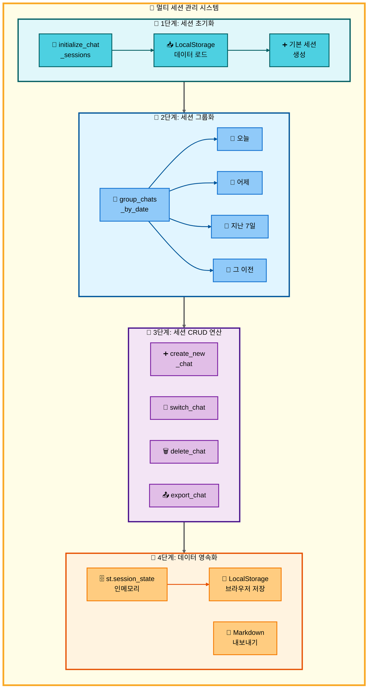
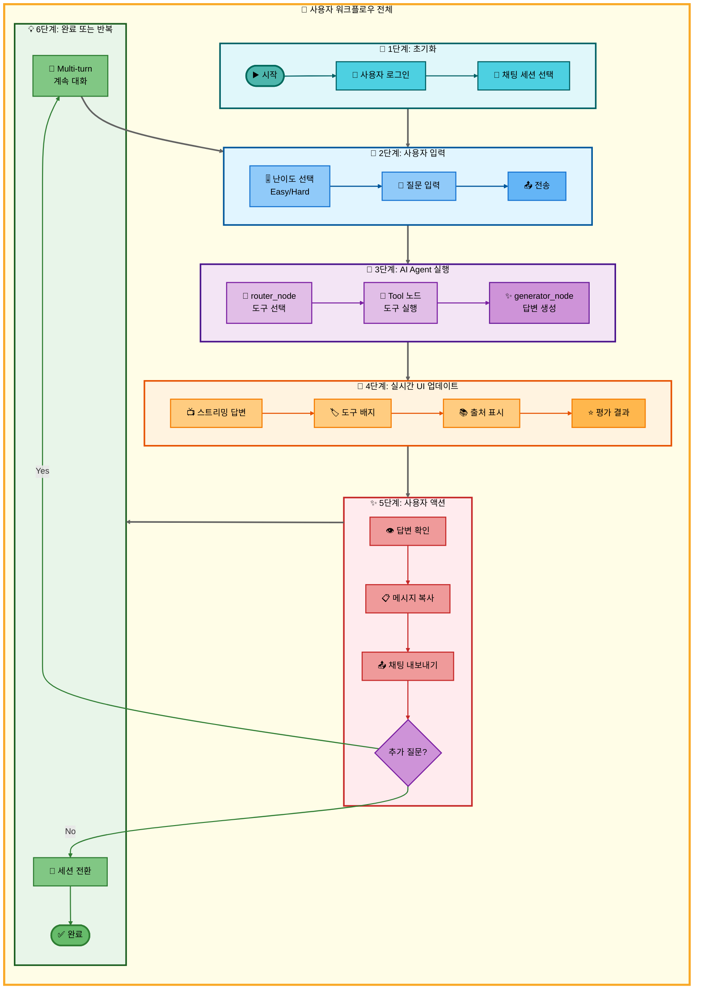

#### 📊 Streamlit UI 시스템 통합 아키텍처

```mermaid
graph TB
    subgraph MainFlow["🎨 Streamlit UI 시스템 전체 흐름"]
        direction TB

        subgraph Stage1["🔸 1단계: 앱 초기화 및 인증"]
            direction LR
            Start([▶️ 시작])
            Browser["🌐 웹 브라우저<br/>접속"]
            AppInit["📱 app.py<br/>앱 초기화"]
            PageConfig["⚙️ 페이지 설정<br/>레이아웃/테마"]
            Auth["🔐 사용자 인증<br/>로그인"]
            Start --> Browser
            Browser --> AppInit
            AppInit --> PageConfig
            PageConfig --> Auth
        end

        subgraph Stage2["🔹 2단계: 세션 관리 및 UI 렌더링"]
            direction LR
            InitSession["🚀 세션 초기화<br/>initialize_sessions"]
            LoadLS["💾 LocalStorage<br/>데이터 로드"]
            GroupDate["📅 날짜별 그룹화<br/>오늘/어제/지난7일"]
            RenderSidebar["📂 사이드바 렌더링<br/>채팅 목록"]
            InitSession --> LoadLS
            LoadLS --> GroupDate
            GroupDate --> RenderSidebar
        end

        subgraph Stage3["🔺 3단계: 사용자 입력 및 세션 제어"]
            direction LR
            SelectSession["📌 세션 선택<br/>switch_chat"]
            Difficulty["🎚️ 난이도 선택<br/>Easy/Hard"]
            Question["💭 질문 입력<br/>chat_input"]
            NewChat["➕ 새 채팅<br/>create_new"]
            DeleteChat["🗑️ 채팅 삭제<br/>delete_chat"]
            SelectSession --> Difficulty
            Difficulty --> Question
        end

        subgraph Stage4["🔶 4단계: AI Agent 실행"]
            direction LR
            RouterNode["🧭 라우터 노드<br/>도구 선택"]
            ToolNode["🔧 도구 노드<br/>실행"]
            GenNode["✨ 생성 노드<br/>답변 작성"]
            CallbackHandler["📡 Callback Handler<br/>이벤트 처리"]
            RouterNode --> ToolNode
            ToolNode --> GenNode
            GenNode --> CallbackHandler
        end

        subgraph Stage5["✨ 5단계: 실시간 응답 표시"]
            direction LR
            TokenStream["📺 토큰 스트리밍<br/>on_llm_new_token"]
            ToolBadge["🏷️ 도구 배지<br/>색상 코딩"]
            Sources["📚 출처 표시<br/>Expander"]
            Evaluation["⭐ 평가 결과<br/>별점/이유"]
            TokenStream --> ToolBadge
            ToolBadge --> Sources
            Sources --> Evaluation
        end

        subgraph Stage6["🔴 6단계: 사용자 액션 및 영속화"]
            direction LR
            MessageCopy["📋 메시지 복사<br/>clipboard"]
            ChatExport["📤 채팅 내보내기<br/>Markdown"]
            SaveLS["💾 LocalStorage<br/>자동 저장"]
            NextQuestion{추가 질문?}
            MessageCopy --> ChatExport
            ChatExport --> SaveLS
            SaveLS --> NextQuestion
        end

        subgraph Stage7["💡 7단계: Multi-turn 또는 종료"]
            direction LR
            MultiTurn["🔄 계속 대화<br/>Stage3 복귀"]
            SwitchSession["🔀 세션 전환<br/>Stage2 복귀"]
            End([✅ 종료])
            NextQuestion -->|Yes| MultiTurn
            NextQuestion -->|No| SwitchSession
            SwitchSession --> End
        end

        %% 단계 간 연결
        Stage1 --> Stage2
        Stage2 --> Stage3
        Stage3 --> Stage4
        Stage4 --> Stage5
        Stage5 --> Stage6
        Stage6 --> Stage7
        MultiTurn --> Stage3
        SwitchSession --> Stage2
    end

    %% MainFlow 래퍼 스타일
    style MainFlow fill:#fffde7,stroke:#f9a825,stroke-width:4px,color:#000

    %% Subgraph 스타일 (7단계 색상 팔레트)
    style Stage1 fill:#e0f7fa,stroke:#006064,stroke-width:3px,color:#000
    style Stage2 fill:#e1f5ff,stroke:#01579b,stroke-width:3px,color:#000
    style Stage3 fill:#f3e5f5,stroke:#4a148c,stroke-width:3px,color:#000
    style Stage4 fill:#fff3e0,stroke:#e65100,stroke-width:3px,color:#000
    style Stage5 fill:#ffebee,stroke:#c62828,stroke-width:3px,color:#000
    style Stage6 fill:#fce4ec,stroke:#880e4f,stroke-width:3px,color:#000
    style Stage7 fill:#e8f5e9,stroke:#1b5e20,stroke-width:3px,color:#000

    %% 노드 스타일 (1단계 - 청록 계열)
    style Start fill:#4db6ac,stroke:#00695c,stroke-width:3px,color:#000
    style Browser fill:#4dd0e1,stroke:#006064,stroke-width:2px,color:#000
    style AppInit fill:#4dd0e1,stroke:#006064,stroke-width:2px,color:#000
    style PageConfig fill:#4dd0e1,stroke:#006064,stroke-width:2px,color:#000
    style Auth fill:#26c6da,stroke:#006064,stroke-width:2px,color:#000

    %% 노드 스타일 (2단계 - 파랑 계열)
    style InitSession fill:#90caf9,stroke:#1976d2,stroke-width:2px,color:#000
    style LoadLS fill:#90caf9,stroke:#1976d2,stroke-width:2px,color:#000
    style GroupDate fill:#90caf9,stroke:#1976d2,stroke-width:2px,color:#000
    style RenderSidebar fill:#64b5f6,stroke:#1976d2,stroke-width:2px,color:#000

    %% 노드 스타일 (3단계 - 보라 계열)
    style SelectSession fill:#e1bee7,stroke:#7b1fa2,stroke-width:2px,color:#000
    style Difficulty fill:#e1bee7,stroke:#7b1fa2,stroke-width:2px,color:#000
    style Question fill:#e1bee7,stroke:#7b1fa2,stroke-width:2px,color:#000
    style NewChat fill:#ce93d8,stroke:#6a1b9a,stroke-width:2px,color:#000
    style DeleteChat fill:#ce93d8,stroke:#6a1b9a,stroke-width:2px,color:#000

    %% 노드 스타일 (4단계 - 주황 계열)
    style RouterNode fill:#ffcc80,stroke:#f57c00,stroke-width:2px,color:#000
    style ToolNode fill:#ffcc80,stroke:#f57c00,stroke-width:2px,color:#000
    style GenNode fill:#ffcc80,stroke:#f57c00,stroke-width:2px,color:#000
    style CallbackHandler fill:#ffb74d,stroke:#f57c00,stroke-width:2px,color:#000

    %% 노드 스타일 (5단계 - 빨강 계열)
    style TokenStream fill:#ef9a9a,stroke:#c62828,stroke-width:2px,color:#000
    style ToolBadge fill:#ef9a9a,stroke:#c62828,stroke-width:2px,color:#000
    style Sources fill:#ef9a9a,stroke:#c62828,stroke-width:2px,color:#000
    style Evaluation fill:#e57373,stroke:#c62828,stroke-width:2px,color:#000

    %% 노드 스타일 (6단계 - 핑크 계열)
    style MessageCopy fill:#f48fb1,stroke:#880e4f,stroke-width:2px,color:#000
    style ChatExport fill:#f48fb1,stroke:#880e4f,stroke-width:2px,color:#000
    style SaveLS fill:#f48fb1,stroke:#880e4f,stroke-width:2px,color:#000
    style NextQuestion fill:#ce93d8,stroke:#7b1fa2,stroke-width:2px,color:#000

    %% 노드 스타일 (7단계 - 녹색 계열)
    style MultiTurn fill:#81c784,stroke:#2e7d32,stroke-width:2px,color:#000
    style SwitchSession fill:#81c784,stroke:#2e7d32,stroke-width:2px,color:#000
    style End fill:#66bb6a,stroke:#2e7d32,stroke-width:3px,color:#000

    %% 연결선 스타일 (1단계 0~3)
    linkStyle 0 stroke:#006064,stroke-width:2px
    linkStyle 1 stroke:#006064,stroke-width:2px
    linkStyle 2 stroke:#006064,stroke-width:2px
    linkStyle 3 stroke:#006064,stroke-width:2px

    %% 연결선 스타일 (2단계 4~6)
    linkStyle 4 stroke:#01579b,stroke-width:2px
    linkStyle 5 stroke:#01579b,stroke-width:2px
    linkStyle 6 stroke:#01579b,stroke-width:2px

    %% 연결선 스타일 (3단계 7~8)
    linkStyle 7 stroke:#7b1fa2,stroke-width:2px
    linkStyle 8 stroke:#7b1fa2,stroke-width:2px

    %% 연결선 스타일 (4단계 9~11)
    linkStyle 9 stroke:#e65100,stroke-width:2px
    linkStyle 10 stroke:#e65100,stroke-width:2px
    linkStyle 11 stroke:#e65100,stroke-width:2px

    %% 연결선 스타일 (5단계 12~14)
    linkStyle 12 stroke:#c62828,stroke-width:2px
    linkStyle 13 stroke:#c62828,stroke-width:2px
    linkStyle 14 stroke:#c62828,stroke-width:2px

    %% 연결선 스타일 (6단계 15~17)
    linkStyle 15 stroke:#880e4f,stroke-width:2px
    linkStyle 16 stroke:#880e4f,stroke-width:2px
    linkStyle 17 stroke:#880e4f,stroke-width:2px

    %% 연결선 스타일 (7단계 18~20)
    linkStyle 18 stroke:#2e7d32,stroke-width:2px
    linkStyle 19 stroke:#2e7d32,stroke-width:2px
    linkStyle 20 stroke:#2e7d32,stroke-width:2px

    %% 단계 간 연결 (회색 21~27)
    linkStyle 21 stroke:#616161,stroke-width:3px
    linkStyle 22 stroke:#616161,stroke-width:3px
    linkStyle 23 stroke:#616161,stroke-width:3px
    linkStyle 24 stroke:#616161,stroke-width:3px
    linkStyle 25 stroke:#616161,stroke-width:3px
    linkStyle 26 stroke:#616161,stroke-width:3px
    linkStyle 27 stroke:#616161,stroke-width:3px
    linkStyle 28 stroke:#616161,stroke-width:3px
```

#### 📊 UI 시스템 아키텍처

```mermaid
graph TB
    subgraph MainFlow["🎨 Streamlit UI 시스템 전체 흐름"]
        direction TB

        subgraph Stage1["🔸 1단계: 사용자 인터페이스"]
            direction LR
            Browser["🌐 웹 브라우저<br/>Chrome/Safari/Edge"]
            LocalStorage["💾 LocalStorage<br/>세션 영속화"]
            JavaScript["⚡ JavaScript<br/>다크모드/복사"]
        end

        subgraph Stage2["🔹 2단계: Streamlit 애플리케이션"]
            direction LR
            AppPy["📱 app.py<br/>메인 진입점"]
            PageConfig["⚙️ Page Config<br/>레이아웃/테마"]
            Auth["🔐 사용자 인증<br/>로그인/로그아웃"]
        end

        subgraph Stage3["🔺 3단계: UI 컴포넌트"]
            direction LR
            Sidebar["📂 sidebar.py<br/>채팅 세션 관리"]
            ChatInterface["💬 chat_interface.py<br/>채팅 화면"]
            ChatManager["🗂️ chat_manager.py<br/>세션 데이터"]
        end

        subgraph Stage4["🔶 4단계: AI Agent 통합"]
            direction LR
            StreamlitCallback["📡 StreamlitCallback<br/>Handler"]
            DifficultySelector["🎚️ 난이도 선택<br/>Easy/Hard"]
            AgentExecutor["🤖 run_agent<br/>LangGraph 실행"]
        end

        subgraph Stage5["✨ 5단계: 실시간 응답 표시"]
            direction LR
            Streaming["📺 스트리밍 답변<br/>실시간 출력"]
            ToolBadge["🏷️ 도구 배지<br/>search_paper 등"]
            SourceDisplay["📚 출처 표시<br/>논문/웹/DB"]
            EvalDisplay["⭐ 평가 결과<br/>정확도/관련성"]
        end

        %% 단계 간 연결
        Stage1 --> Stage2
        Stage2 --> Stage3
        Stage3 --> Stage4
        Stage4 --> Stage5
        Stage5 --> Stage3
    end

    %% MainFlow 래퍼 스타일
    style MainFlow fill:#fffde7,stroke:#f9a825,stroke-width:4px,color:#000

    %% Subgraph 스타일
    style Stage1 fill:#e0f7fa,stroke:#006064,stroke-width:3px,color:#000
    style Stage2 fill:#e1f5ff,stroke:#01579b,stroke-width:3px,color:#000
    style Stage3 fill:#f3e5f5,stroke:#4a148c,stroke-width:3px,color:#000
    style Stage4 fill:#fff3e0,stroke:#e65100,stroke-width:3px,color:#000
    style Stage5 fill:#e8f5e9,stroke:#1b5e20,stroke-width:3px,color:#000

    %% 노드 스타일 (1단계 - 청록 계열)
    style Browser fill:#4dd0e1,stroke:#006064,stroke-width:2px,color:#000
    style LocalStorage fill:#4dd0e1,stroke:#006064,stroke-width:2px,color:#000
    style JavaScript fill:#4dd0e1,stroke:#006064,stroke-width:2px,color:#000

    %% 노드 스타일 (2단계 - 파랑 계열)
    style AppPy fill:#90caf9,stroke:#1976d2,stroke-width:2px,color:#000
    style PageConfig fill:#90caf9,stroke:#1976d2,stroke-width:2px,color:#000
    style Auth fill:#90caf9,stroke:#1976d2,stroke-width:2px,color:#000

    %% 노드 스타일 (3단계 - 보라 계열)
    style Sidebar fill:#e1bee7,stroke:#7b1fa2,stroke-width:2px,color:#000
    style ChatInterface fill:#e1bee7,stroke:#7b1fa2,stroke-width:2px,color:#000
    style ChatManager fill:#e1bee7,stroke:#7b1fa2,stroke-width:2px,color:#000

    %% 노드 스타일 (4단계 - 주황 계열)
    style StreamlitCallback fill:#ffcc80,stroke:#f57c00,stroke-width:2px,color:#000
    style DifficultySelector fill:#ffcc80,stroke:#f57c00,stroke-width:2px,color:#000
    style AgentExecutor fill:#ffcc80,stroke:#f57c00,stroke-width:2px,color:#000

    %% 노드 스타일 (5단계 - 녹색 계열)
    style Streaming fill:#81c784,stroke:#2e7d32,stroke-width:2px,color:#000
    style ToolBadge fill:#81c784,stroke:#2e7d32,stroke-width:2px,color:#000
    style SourceDisplay fill:#81c784,stroke:#2e7d32,stroke-width:2px,color:#000
    style EvalDisplay fill:#81c784,stroke:#2e7d32,stroke-width:2px,color:#000

    %% 단계 간 연결선 스타일 (회색)
    linkStyle 0 stroke:#616161,stroke-width:3px
    linkStyle 1 stroke:#616161,stroke-width:3px
    linkStyle 2 stroke:#616161,stroke-width:3px
    linkStyle 3 stroke:#616161,stroke-width:3px
    linkStyle 4 stroke:#616161,stroke-width:3px
```

#### 🏗️ 멀티 세션 관리 아키텍처

```mermaid
graph TB
    subgraph MainFlow["💬 멀티 세션 관리 시스템"]
        direction TB

        subgraph Stage1["🔸 1단계: 세션 초기화"]
            direction LR
            Init["🚀 initialize_chat<br/>_sessions"]
            LoadLS["📥 LocalStorage<br/>데이터 로드"]
            CreateDefault["➕ 기본 세션<br/>생성"]
            Init --> LoadLS
            LoadLS --> CreateDefault
        end

        subgraph Stage2["🔹 2단계: 세션 그룹화"]
            direction LR
            GroupChats["📅 group_chats<br/>_by_date"]
            Today["📆 오늘"]
            Yesterday["📆 어제"]
            Last7Days["📆 지난 7일"]
            Older["📆 그 이전"]
            GroupChats --> Today
            GroupChats --> Yesterday
            GroupChats --> Last7Days
            GroupChats --> Older
        end

        subgraph Stage3["🔺 3단계: 세션 CRUD 연산"]
            direction LR
            Create["➕ create_new<br/>_chat"]
            Switch["🔄 switch_chat"]
            Delete["🗑️ delete_chat"]
            Export["📤 export_chat"]
        end

        subgraph Stage4["🔶 4단계: 데이터 영속화"]
            direction LR
            SessionState["🗄️ st.session_state<br/>인메모리"]
            LocalStorageWrite["💾 LocalStorage<br/>브라우저 저장"]
            MarkdownFile["📝 Markdown<br/>내보내기"]
            SessionState --> LocalStorageWrite
        end

        %% 단계 간 연결
        Stage1 --> Stage2
        Stage2 --> Stage3
        Stage3 --> Stage4
    end

    %% MainFlow 래퍼 스타일
    style MainFlow fill:#fffde7,stroke:#f9a825,stroke-width:4px,color:#000

    %% Subgraph 스타일
    style Stage1 fill:#e0f7fa,stroke:#006064,stroke-width:3px,color:#000
    style Stage2 fill:#e1f5ff,stroke:#01579b,stroke-width:3px,color:#000
    style Stage3 fill:#f3e5f5,stroke:#4a148c,stroke-width:3px,color:#000
    style Stage4 fill:#fff3e0,stroke:#e65100,stroke-width:3px,color:#000

    %% 노드 스타일 (1단계 - 청록 계열)
    style Init fill:#4dd0e1,stroke:#006064,stroke-width:2px,color:#000
    style LoadLS fill:#4dd0e1,stroke:#006064,stroke-width:2px,color:#000
    style CreateDefault fill:#4dd0e1,stroke:#006064,stroke-width:2px,color:#000

    %% 노드 스타일 (2단계 - 파랑 계열)
    style GroupChats fill:#90caf9,stroke:#1976d2,stroke-width:2px,color:#000
    style Today fill:#90caf9,stroke:#1976d2,stroke-width:2px,color:#000
    style Yesterday fill:#90caf9,stroke:#1976d2,stroke-width:2px,color:#000
    style Last7Days fill:#90caf9,stroke:#1976d2,stroke-width:2px,color:#000
    style Older fill:#90caf9,stroke:#1976d2,stroke-width:2px,color:#000

    %% 노드 스타일 (3단계 - 보라 계열)
    style Create fill:#e1bee7,stroke:#7b1fa2,stroke-width:2px,color:#000
    style Switch fill:#e1bee7,stroke:#7b1fa2,stroke-width:2px,color:#000
    style Delete fill:#e1bee7,stroke:#7b1fa2,stroke-width:2px,color:#000
    style Export fill:#e1bee7,stroke:#7b1fa2,stroke-width:2px,color:#000

    %% 노드 스타일 (4단계 - 주황 계열)
    style SessionState fill:#ffcc80,stroke:#f57c00,stroke-width:2px,color:#000
    style LocalStorageWrite fill:#ffcc80,stroke:#f57c00,stroke-width:2px,color:#000
    style MarkdownFile fill:#ffcc80,stroke:#f57c00,stroke-width:2px,color:#000

    %% 연결선 스타일 (1단계 0~1)
    linkStyle 0 stroke:#006064,stroke-width:2px
    linkStyle 1 stroke:#006064,stroke-width:2px

    %% 연결선 스타일 (2단계 2~5)
    linkStyle 2 stroke:#01579b,stroke-width:2px
    linkStyle 3 stroke:#01579b,stroke-width:2px
    linkStyle 4 stroke:#01579b,stroke-width:2px
    linkStyle 5 stroke:#01579b,stroke-width:2px

    %% 연결선 스타일 (4단계 6)
    linkStyle 6 stroke:#e65100,stroke-width:2px

    %% 단계 간 연결 (회색 7~9)
    linkStyle 7 stroke:#616161,stroke-width:3px
    linkStyle 8 stroke:#616161,stroke-width:3px
    linkStyle 9 stroke:#616161,stroke-width:3px
```

#### 🔄 사용자 워크플로우 & AI Agent 통합

```mermaid
graph TB
    subgraph MainFlow["🎨 사용자 워크플로우 전체"]
        direction TB

        subgraph Stage1["🔸 1단계: 초기화"]
            direction LR
            Start([▶️ 시작])
            Login["🔐 사용자 로그인"]
            SelectSession["📂 채팅 세션 선택"]
            Start --> Login
            Login --> SelectSession
        end

        subgraph Stage2["🔹 2단계: 사용자 입력"]
            direction LR
            Difficulty["🎚️ 난이도 선택<br/>Easy/Hard"]
            Question["💭 질문 입력"]
            Submit["📤 전송"]
            Difficulty --> Question
            Question --> Submit
        end

        subgraph Stage3["🔺 3단계: AI Agent 실행"]
            direction LR
            Router["🧭 router_node<br/>도구 선택"]
            Tool["🔧 Tool 노드<br/>도구 실행"]
            Generator["✨ generator_node<br/>답변 생성"]
            Router --> Tool
            Tool --> Generator
        end

        subgraph Stage4["🔶 4단계: 실시간 UI 업데이트"]
            direction LR
            Streaming["📺 스트리밍 답변"]
            ToolBadge["🏷️ 도구 배지"]
            Sources["📚 출처 표시"]
            Eval["⭐ 평가 결과"]
            Streaming --> ToolBadge
            ToolBadge --> Sources
            Sources --> Eval
        end

        subgraph Stage5["✨ 5단계: 사용자 액션"]
            direction LR
            View["👁️ 답변 확인"]
            Copy["📋 메시지 복사"]
            Export["📤 채팅 내보내기"]
            Next{추가 질문?}
            View --> Copy
            Copy --> Export
            Export --> Next
        end

        subgraph Output["💡 6단계: 완료 또는 반복"]
            direction LR
            MultiTurn["🔄 Multi-turn<br/>계속 대화"]
            Switch["🔀 세션 전환"]
            End([✅ 완료])
            Next -->|Yes| MultiTurn
            Next -->|No| Switch
            Switch --> End
        end

        %% 단계 간 연결
        Stage1 --> Stage2
        Stage2 --> Stage3
        Stage3 --> Stage4
        Stage4 --> Stage5
        Stage5 --> Output
        MultiTurn --> Stage2
    end

    %% MainFlow 래퍼 스타일
    style MainFlow fill:#fffde7,stroke:#f9a825,stroke-width:4px,color:#000

    %% Subgraph 스타일
    style Stage1 fill:#e0f7fa,stroke:#006064,stroke-width:3px,color:#000
    style Stage2 fill:#e1f5ff,stroke:#01579b,stroke-width:3px,color:#000
    style Stage3 fill:#f3e5f5,stroke:#4a148c,stroke-width:3px,color:#000
    style Stage4 fill:#fff3e0,stroke:#e65100,stroke-width:3px,color:#000
    style Stage5 fill:#ffebee,stroke:#c62828,stroke-width:3px,color:#000
    style Output fill:#e8f5e9,stroke:#1b5e20,stroke-width:3px,color:#000

    %% 노드 스타일 (1단계 - 청록 계열)
    style Start fill:#4db6ac,stroke:#00695c,stroke-width:3px,color:#000
    style Login fill:#4dd0e1,stroke:#006064,stroke-width:2px,color:#000
    style SelectSession fill:#4dd0e1,stroke:#006064,stroke-width:2px,color:#000

    %% 노드 스타일 (2단계 - 파랑 계열)
    style Difficulty fill:#90caf9,stroke:#1976d2,stroke-width:2px,color:#000
    style Question fill:#90caf9,stroke:#1976d2,stroke-width:2px,color:#000
    style Submit fill:#64b5f6,stroke:#1976d2,stroke-width:2px,color:#000

    %% 노드 스타일 (3단계 - 보라 계열)
    style Router fill:#e1bee7,stroke:#7b1fa2,stroke-width:2px,color:#000
    style Tool fill:#e1bee7,stroke:#7b1fa2,stroke-width:2px,color:#000
    style Generator fill:#ce93d8,stroke:#6a1b9a,stroke-width:2px,color:#000

    %% 노드 스타일 (4단계 - 주황 계열)
    style Streaming fill:#ffcc80,stroke:#f57c00,stroke-width:2px,color:#000
    style ToolBadge fill:#ffcc80,stroke:#f57c00,stroke-width:2px,color:#000
    style Sources fill:#ffcc80,stroke:#f57c00,stroke-width:2px,color:#000
    style Eval fill:#ffb74d,stroke:#f57c00,stroke-width:2px,color:#000

    %% 노드 스타일 (5단계 - 빨강 계열)
    style View fill:#ef9a9a,stroke:#c62828,stroke-width:2px,color:#000
    style Copy fill:#ef9a9a,stroke:#c62828,stroke-width:2px,color:#000
    style Export fill:#ef9a9a,stroke:#c62828,stroke-width:2px,color:#000
    style Next fill:#ce93d8,stroke:#7b1fa2,stroke-width:2px,color:#000

    %% 노드 스타일 (6단계 - 녹색 계열)
    style MultiTurn fill:#81c784,stroke:#2e7d32,stroke-width:2px,color:#000
    style Switch fill:#81c784,stroke:#2e7d32,stroke-width:2px,color:#000
    style End fill:#66bb6a,stroke:#2e7d32,stroke-width:3px,color:#000

    %% 연결선 스타일 (1단계 0~1)
    linkStyle 0 stroke:#006064,stroke-width:2px
    linkStyle 1 stroke:#006064,stroke-width:2px

    %% 연결선 스타일 (2단계 2~3)
    linkStyle 2 stroke:#01579b,stroke-width:2px
    linkStyle 3 stroke:#01579b,stroke-width:2px

    %% 연결선 스타일 (3단계 4~5)
    linkStyle 4 stroke:#7b1fa2,stroke-width:2px
    linkStyle 5 stroke:#7b1fa2,stroke-width:2px

    %% 연결선 스타일 (4단계 6~8)
    linkStyle 6 stroke:#e65100,stroke-width:2px
    linkStyle 7 stroke:#e65100,stroke-width:2px
    linkStyle 8 stroke:#e65100,stroke-width:2px

    %% 연결선 스타일 (5단계 9~11)
    linkStyle 9 stroke:#c62828,stroke-width:2px
    linkStyle 10 stroke:#c62828,stroke-width:2px
    linkStyle 11 stroke:#c62828,stroke-width:2px

    %% 연결선 스타일 (6단계 12~14)
    linkStyle 12 stroke:#2e7d32,stroke-width:2px
    linkStyle 13 stroke:#2e7d32,stroke-width:2px
    linkStyle 14 stroke:#2e7d32,stroke-width:2px

    %% 단계 간 연결 (회색 15~20)
    linkStyle 15 stroke:#616161,stroke-width:3px
    linkStyle 16 stroke:#616161,stroke-width:3px
    linkStyle 17 stroke:#616161,stroke-width:3px
    linkStyle 18 stroke:#616161,stroke-width:3px
    linkStyle 19 stroke:#616161,stroke-width:3px
    linkStyle 20 stroke:#616161,stroke-width:3px
```