# 이중 요청: RAG 논문 검색 → 저장 아키텍처

## 📋 문서 정보
- **작성일**: 2025-11-07
- **작성자**: 최현화[팀장]
- **프로젝트명**: 논문 리뷰 챗봇 (AI Agent + RAG)
- **팀명**: 연결의 민족
- **문서 버전**: 1.0

---

## 📑 목차
1. [시나리오 개요](#시나리오-개요)
2. [사용자 요청 분석](#사용자-요청-분석)
3. [도구 자동 전환 및 Fallback](#도구-자동-전환-및-fallback)
4. [단순 흐름 아키텍처](#단순-흐름-아키텍처)
5. [상세 기능 동작 흐름도](#상세-기능-동작-흐름도)
6. [전체 흐름 요약 표](#전체-흐름-요약-표)
7. [동작 설명 (초보 개발자용)](#동작-설명-초보-개발자용)
8. [실행 예시](#실행-예시)
9. [핵심 포인트](#핵심-포인트)

---

## 📌 시나리오 개요

### 다중 요청의 목적

사용자가 논문을 검색한 후 결과를 파일로 저장하고 싶을 때, 두 가지 도구를 순차적으로 실행하여 검색과 저장을 한 번에 처리합니다.

**실행되는 도구 순서:**
```
1단계: search_paper (RAG 논문 검색)
  ↓ 성공 시
2단계: save_file (파일 저장)
```

**사용자 요청 예시:**
- "Transformer 논문 찾아서 저장해줘"
- "GPT 논문 검색해서 저장해줘"
- "관련 논문 찾아줘 저장해줘"

---

## 📋 사용자 요청 분석

### 정확한 사용자 질문 예시

**예시 1: "Transformer 논문 찾아서 저장해줘"**
- **키워드 분석**:
  - `논문`: 논문 검색 필요
  - `찾`: 검색 동작
  - `저장`: 파일 저장 필요
  - 시간 키워드 없음: RAG 검색 우선

**예시 2: "GPT 논문 검색해서 저장해줘"**
- **키워드 분석**:
  - `논문`: 논문 검색 필요
  - `검색`: 검색 동작
  - `저장`: 파일 저장 필요

### 도구 선택 근거

**패턴 매칭 방식 (src/agent/nodes.py:75-130)**

`configs/multi_request_patterns.yaml` 파일의 패턴을 기반으로 자동 감지:

```yaml
- keywords:
  - 논문
  - 찾
  - 저장
  exclude_keywords:
  - 요약
  tools:
  - search_paper
  - save_file
  description: 논문 검색 후 저장
  priority: 110
```

**매칭 로직:**
1. 질문에 `논문` AND `찾` AND `저장` 키워드 모두 포함
2. 제외 키워드 (`요약`) 없음
3. 자동으로 2단계 파이프라인 설정: `[search_paper, save_file]`

**AgentState 설정 (src/agent/nodes.py:117-129):**
```python
state["tool_pipeline"] = ["search_paper", "save_file"]
state["tool_choice"] = "search_paper"  # 첫 번째 도구
state["pipeline_index"] = 1            # 실행 후 인덱스
state["routing_method"] = "pattern_based"
state["routing_reason"] = "패턴 매칭: 논문 검색 후 저장"
state["pipeline_description"] = "순차 실행: search_paper → save_file"
```

---

## 🔄 도구 자동 전환 및 Fallback

### 전체 Fallback 체인

```
사용자: "Transformer 논문 찾아서 저장해줘"
↓
[1단계] RAG 논문 검색 (search_paper)
├─ ✅ 성공 (유사도 점수 < 0.5)
│   └─ 논문 본문 획득 → tool_result에 저장 → [2단계] 저장으로 진행
│
└─ ❌ 실패 (유사도 낮음 또는 결과 없음)
    └─ 실패 메시지: "관련 논문을 찾을 수 없습니다."
    └─ [2단계] 저장으로 진행 (실패 메시지를 저장)
↓
[2단계] 파일 저장 (save_file)
├─ ✅ 성공 (항상 성공)
│   ├─ final_answers 있음 → 난이도별 파일 4개 저장
│   │   - elementary: 날짜_시간_response_번호_elementary.md
│   │   - beginner: 날짜_시간_response_번호_beginner.md
│   │   - intermediate: 날짜_시간_response_번호_intermediate.md
│   │   - advanced: 날짜_시간_response_번호_advanced.md
│   │
│   └─ final_answers 없음 → tool_result 저장
│       - 날짜_시간_response_번호.md
│
└─ ❌ 실패 (불가능: save_file은 항상 성공)
    └─ 최악의 경우 "저장할 내용이 없습니다." 저장
```

### 성공 시나리오별 흐름

**시나리오 A: RAG 검색 성공 → 저장**
```
search_paper (성공) → save_file (저장)
     ↓                      ↓
tool_result:           파일 저장:
논문 본문 (1500자)     실험 폴더/outputs/
                       20251107_143022_response_1.md
```

**시나리오 B: RAG 검색 실패 → 실패 메시지 저장**
```
search_paper (실패) → save_file (저장)
     ↓                      ↓
tool_result:           파일 저장:
"관련 논문을          실험 폴더/outputs/
찾을 수 없습니다."    20251107_143022_response_1.md
                      (실패 메시지 포함)
```

### save_file 도구의 특징

**save_file은 Fallback이 없습니다:**
- 항상 성공 (파일 시스템 오류 제외)
- 저장할 내용이 없어도 "저장할 내용이 없습니다." 메시지를 저장
- 파일명은 타임스탬프 기반으로 자동 생성

**저장 우선순위 (src/tools/save_file.py:69-150):**
```python
# 우선순위 0: final_answers (난이도별 다중 답변)
if final_answers and isinstance(final_answers, dict) and len(final_answers) > 0:
    # 난이도별 파일 4개 저장 (elementary, beginner, intermediate, advanced)
    for level, content in final_answers.items():
        filename = f"{timestamp}_response_{save_counter}_{level}.md"
        save_file(filename, content)

# 우선순위 1: tool_result (파이프라인 실행 결과)
elif tool_result and tool_result.strip():
    content_to_save = tool_result

# 우선순위 2: final_answer
elif final_answer and final_answer.strip():
    content_to_save = final_answer

# 우선순위 3: messages에서 마지막 assistant 답변
elif messages:
    for msg in reversed(messages):
        if msg.get("role") == "assistant":
            content_to_save = msg.get("content", "")
            break

# 우선순위 4: 저장할 내용 없음
else:
    content_to_save = "저장할 내용이 없습니다."
```

### 파일 저장 위치

**ExperimentManager 사용 시 (운영 환경):**
```
experiments/
└── 20251107/
    └── 20251107_143022_session_003/
        ├── logs/
        ├── configs/
        └── outputs/              # 저장 위치
            ├── 20251107_143022_response_1.md
            ├── 20251107_143022_response_2_elementary.md
            ├── 20251107_143022_response_2_beginner.md
            ├── 20251107_143022_response_2_intermediate.md
            └── 20251107_143022_response_2_advanced.md
```

**ExperimentManager 없을 때 (테스트 환경):**
```
outputs/                          # 저장 위치
├── 20251107_143022_response_1.md
└── 20251107_143022_response_2.md
```

---

## 📊 단순 흐름 아키텍처


---

## 🔧 상세 기능 동작 흐름도

```mermaid
graph TB
    subgraph MainFlow["📋 상세 기능 동작 흐름 (RAG 논문 검색 → 저장)"]
        direction TB

        subgraph Init["🔸 초기화 & 패턴 매칭"]
            direction LR
            Start["실행 시작<br/>chat_interface.py"] --> InitState["AgentState 초기화<br/>question, difficulty,<br/>messages"]
            InitState --> LoadPatterns["패턴 로드<br/>multi_request_<br/>patterns.yaml"]
            LoadPatterns --> PatternMatch["패턴 매칭<br/>keywords:<br/>[논문, 찾, 저장]"]
            PatternMatch --> SetPipeline["Pipeline 설정<br/>tool_pipeline:<br/>[search_paper,<br/>save_file]"]
        end

        subgraph Routing["🔹 라우팅 & 도구 선택"]
            direction LR
            RouteToTool["route_to_tool()<br/>tool_choice 반환"] --> CheckPipeline["check_pipeline_<br/>or_fallback()<br/>tool_status 확인"]
            CheckPipeline --> PipelineRouter["pipeline_router()<br/>다음 도구 선택"]
        end

        subgraph SearchPaper["🔺 RAG 논문 검색 실행"]
            direction LR
            InitRetriever["RAGRetriever<br/>초기화<br/>OpenAI<br/>Embeddings"] --> VectorSearch["벡터 검색<br/>similarity/MMR"]
            VectorSearch --> KeywordSearch["키워드 검색<br/>PostgreSQL FTS"]
            KeywordSearch --> HybridMerge["하이브리드 병합<br/>70% 벡터 +<br/>30% 키워드"]
            HybridMerge --> FetchMeta["메타데이터 조회<br/>papers 테이블"]
            FetchMeta --> CheckSimilarity{"유사도 검증<br/>score < 0.5?"}
            CheckSimilarity --> FormatResult["결과 포매팅<br/>Markdown 형식"]
        end

        subgraph SaveFile["🔶 파일 저장 실행"]
            direction LR
            CheckSaveMode{"저장 모드?<br/>전체 대화 vs<br/>단일 답변"} --> CheckFinalAnswers{"final_answers<br/>존재?"}
            CheckFinalAnswers -->|"Yes"| SaveMultiple["난이도별 저장<br/>4개 파일"]
            CheckFinalAnswers -->|"No"| CheckToolResult{"tool_result<br/>존재?"}
            CheckToolResult -->|"Yes"| GenerateFilename["파일명 생성<br/>timestamp +<br/>save_counter"]
            CheckToolResult -->|"No"| CheckFinalAnswer{"final_answer<br/>존재?"}
            CheckFinalAnswer -->|"Yes"| GenerateFilename
            CheckFinalAnswer -->|"No"| CheckMessages{"messages<br/>존재?"}
            CheckMessages -->|"Yes"| GenerateFilename
            CheckMessages -->|"No"| SaveEmpty["빈 내용 저장"]
            SaveMultiple --> GenerateFilename
            SaveEmpty --> GenerateFilename
            GenerateFilename --> WriteFile["파일 쓰기<br/>experiments/<br/>outputs/"]
        end

        subgraph State["💡 상태 관리 & 출력"]
            direction LR
            StateFields["AgentState<br/>tool_pipeline,<br/>pipeline_index,<br/>tool_result,<br/>save_counter"] --> OutputDir["outputs<br/>디렉토리<br/>실험 세션별<br/>분리"]
            OutputDir --> SavedFile["저장된 파일<br/>날짜_시간_<br/>response_번호.md"]
            SavedFile --> DisplayResult["UI 표시<br/>chat_interface.py<br/>파일 경로 표시"]
        end

        subgraph Database["🔷 PostgreSQL + pgvector"]
            direction LR
            PapersTable["papers 테이블<br/>paper_id, title,<br/>authors,<br/>publish_date"] --> ChunksTable["paper_chunks<br/>chunk_id,<br/>content,<br/>embedding<br/>(vector 1536)"]
        end

        %% 단계 간 연결
        Init --> Routing
        Routing --> SearchPaper
        SearchPaper --> SaveFile
        SaveFile --> State
    end

    %% 세부 연결
    SetPipeline --> RouteToTool
    RouteToTool --> InitRetriever
    FormatResult --> StateFields
    StateFields --> CheckPipeline
    PipelineRouter --> CheckSaveMode
    WriteFile --> OutputDir
    FetchMeta -.->|"SQL SELECT"| PapersTable
    VectorSearch -.->|"pgvector<br/>cosine"| ChunksTable

    %% 메인 워크플로우 배경
    style MainFlow fill:#fffde7,stroke:#f9a825,stroke-width:4px,color:#000

    %% Subgraph 스타일
    style Init fill:#e0f7fa,stroke:#006064,stroke-width:3px,color:#000
    style Routing fill:#f3e5f5,stroke:#4a148c,stroke-width:3px,color:#000
    style SearchPaper fill:#e8f5e9,stroke:#1b5e20,stroke-width:3px,color:#000
    style SaveFile fill:#fff3e0,stroke:#e65100,stroke-width:3px,color:#000
    style State fill:#ffebee,stroke:#c62828,stroke-width:3px,color:#000
    style Database fill:#e3f2fd,stroke:#1565c0,stroke-width:3px,color:#000

    %% 노드 스타일 (초기화 & 패턴 매칭 - 청록 계열)
    style Start fill:#4dd0e1,stroke:#006064,stroke-width:2px,color:#000
    style InitState fill:#4dd0e1,stroke:#006064,stroke-width:2px,color:#000
    style LoadPatterns fill:#4dd0e1,stroke:#006064,stroke-width:2px,color:#000
    style PatternMatch fill:#4dd0e1,stroke:#006064,stroke-width:2px,color:#000
    style SetPipeline fill:#4dd0e1,stroke:#006064,stroke-width:2px,color:#000

    %% 노드 스타일 (라우팅 & 도구 선택 - 보라 계열)
    style RouteToTool fill:#e1bee7,stroke:#7b1fa2,stroke-width:2px,color:#000
    style CheckPipeline fill:#e1bee7,stroke:#7b1fa2,stroke-width:2px,color:#000
    style PipelineRouter fill:#e1bee7,stroke:#7b1fa2,stroke-width:2px,color:#000

    %% 노드 스타일 (RAG 논문 검색 실행 - 녹색 계열)
    style InitRetriever fill:#81c784,stroke:#2e7d32,stroke-width:2px,color:#000
    style VectorSearch fill:#81c784,stroke:#2e7d32,stroke-width:2px,color:#000
    style KeywordSearch fill:#81c784,stroke:#2e7d32,stroke-width:2px,color:#000
    style HybridMerge fill:#81c784,stroke:#2e7d32,stroke-width:2px,color:#000
    style FetchMeta fill:#81c784,stroke:#2e7d32,stroke-width:2px,color:#000
    style CheckSimilarity fill:#ce93d8,stroke:#6a1b9a,stroke-width:2px,color:#000
    style FormatResult fill:#66bb6a,stroke:#1b5e20,stroke-width:2px,color:#000

    %% 노드 스타일 (파일 저장 실행 - 주황 계열)
    style CheckSaveMode fill:#ce93d8,stroke:#6a1b9a,stroke-width:2px,color:#000
    style CheckFinalAnswers fill:#ce93d8,stroke:#6a1b9a,stroke-width:2px,color:#000
    style CheckToolResult fill:#ce93d8,stroke:#6a1b9a,stroke-width:2px,color:#000
    style CheckFinalAnswer fill:#ce93d8,stroke:#6a1b9a,stroke-width:2px,color:#000
    style CheckMessages fill:#ce93d8,stroke:#6a1b9a,stroke-width:2px,color:#000
    style SaveMultiple fill:#ffb74d,stroke:#e65100,stroke-width:2px,color:#000
    style SaveEmpty fill:#ffb74d,stroke:#e65100,stroke-width:2px,color:#000
    style GenerateFilename fill:#ffb74d,stroke:#e65100,stroke-width:2px,color:#000
    style WriteFile fill:#ffa726,stroke:#ef6c00,stroke-width:2px,color:#000

    %% 노드 스타일 (상태 관리 & 출력 - 빨강 계열)
    style StateFields fill:#ef9a9a,stroke:#c62828,stroke-width:2px,color:#000
    style OutputDir fill:#ef9a9a,stroke:#c62828,stroke-width:2px,color:#000
    style SavedFile fill:#ef9a9a,stroke:#c62828,stroke-width:2px,color:#000
    style DisplayResult fill:#e57373,stroke:#c62828,stroke-width:2px,color:#000

    %% 노드 스타일 (PostgreSQL + pgvector - 파랑 계열)
    style PapersTable fill:#90caf9,stroke:#0d47a1,stroke-width:2px,color:#000
    style ChunksTable fill:#64b5f6,stroke:#1565c0,stroke-width:2px,color:#000

    %% 연결선 스타일 (초기화 - 청록 0~3)
    linkStyle 0 stroke:#006064,stroke-width:2px
    linkStyle 1 stroke:#006064,stroke-width:2px
    linkStyle 2 stroke:#006064,stroke-width:2px
    linkStyle 3 stroke:#006064,stroke-width:2px

    %% 연결선 스타일 (라우팅 - 보라 4~5)
    linkStyle 4 stroke:#7b1fa2,stroke-width:2px
    linkStyle 5 stroke:#7b1fa2,stroke-width:2px

    %% 연결선 스타일 (RAG 검색 - 녹색 6~10)
    linkStyle 6 stroke:#2e7d32,stroke-width:2px
    linkStyle 7 stroke:#2e7d32,stroke-width:2px
    linkStyle 8 stroke:#2e7d32,stroke-width:2px
    linkStyle 9 stroke:#2e7d32,stroke-width:2px
    linkStyle 10 stroke:#2e7d32,stroke-width:2px
    linkStyle 11 stroke:#2e7d32,stroke-width:2px

    %% 연결선 스타일 (파일 저장 - 주황 12~22)
    linkStyle 12 stroke:#e65100,stroke-width:2px
    linkStyle 13 stroke:#e65100,stroke-width:2px
    linkStyle 14 stroke:#e65100,stroke-width:2px
    linkStyle 15 stroke:#e65100,stroke-width:2px
    linkStyle 16 stroke:#e65100,stroke-width:2px
    linkStyle 17 stroke:#e65100,stroke-width:2px
    linkStyle 18 stroke:#e65100,stroke-width:2px
    linkStyle 19 stroke:#e65100,stroke-width:2px
    linkStyle 20 stroke:#e65100,stroke-width:2px
    linkStyle 21 stroke:#e65100,stroke-width:2px
    linkStyle 22 stroke:#e65100,stroke-width:2px

    %% 연결선 스타일 (상태 관리 - 빨강 23~25)
    linkStyle 23 stroke:#c62828,stroke-width:2px
    linkStyle 24 stroke:#c62828,stroke-width:2px
    linkStyle 25 stroke:#c62828,stroke-width:2px

    %% 연결선 스타일 (Database - 파랑 26)
    linkStyle 26 stroke:#1565c0,stroke-width:2px

    %% 단계 간 연결 (회색 27~30)
    linkStyle 27 stroke:#616161,stroke-width:3px
    linkStyle 28 stroke:#616161,stroke-width:3px
    linkStyle 29 stroke:#616161,stroke-width:3px
    linkStyle 30 stroke:#616161,stroke-width:3px

    %% 세부 연결 (31~37)
    linkStyle 31 stroke:#006064,stroke-width:2px
    linkStyle 32 stroke:#7b1fa2,stroke-width:2px
    linkStyle 33 stroke:#2e7d32,stroke-width:2px
    linkStyle 34 stroke:#c62828,stroke-width:2px
    linkStyle 35 stroke:#e65100,stroke-width:2px
    linkStyle 36 stroke:#e65100,stroke-width:2px
    linkStyle 37 stroke:#2e7d32,stroke-width:2px
    linkStyle 38 stroke:#1565c0,stroke-width:2px
```



---

## 📋 전체 흐름 요약 표

| 단계 | 도구명 | 파일명 | 메서드명 | 동작 설명 | 입력 | 출력 | Fallback | 세션 저장 |
|------|--------|--------|----------|-----------|------|------|----------|----------|
| 0 | 라우팅 | src/agent/nodes.py | router_node() | 패턴 매칭으로 다중 요청 감지 | question: "Transformer 논문 찾아서 저장해줘" | tool_pipeline: [search_paper, save_file], tool_choice: search_paper | 없음 | tool_pipeline, pipeline_index=1 |
| 1 | RAG 논문 검색 | src/tools/search_paper.py | search_paper_node() | PostgreSQL + pgvector 하이브리드 검색 | question, difficulty | tool_result: 논문 본문 (성공) 또는 "찾을 수 없습니다" (실패) | 없음 | tool_result, tool_status |
| 2 | 파일 저장 | src/tools/save_file.py | save_file_node() | tool_result를 파일로 저장 | tool_result, tool_pipeline, pipeline_index | final_answer: "파일이 성공적으로 저장되었습니다.\n파일 경로: ..." | 없음 | save_counter, final_answer |

**Pipeline Index 변화:**
- 초기: `pipeline_index = 1` (첫 도구 실행 후)
- search_paper 실행 → `pipeline_index = 2` (다음 도구 준비)
- save_file 실행 → `pipeline_index = 2` (종료)

**Save Counter 변화:**
- 초기: `save_counter = 0`
- save_file 실행 → `save_counter += 1` (세션별 누적)
- 다음 저장 → `save_counter += 1` (계속 증가)

---

## 🔍 동작 설명 (초보 개발자용)

### 1단계: 사용자 요청 접수 및 패턴 매칭

**파일:** `ui/components/chat_interface.py` → `main.py:run_agent()` → `src/agent/nodes.py:router_node()`

사용자가 "Transformer 논문 찾아서 저장해줘"를 입력하면:

1. **AgentState 초기화:**
   ```python
   state = {
       "question": "Transformer 논문 찾아서 저장해줘",
       "difficulty": "easy",  # 또는 "hard"
       "messages": [HumanMessage(content="Transformer 논문 찾아서 저장해줘")],
       "save_counter": 0  # 저장 카운터 초기화
   }
   ```

2. **패턴 파일 로드 (src/agent/nodes.py:77):**
   ```python
   multi_request_patterns = get_multi_request_patterns()
   # configs/multi_request_patterns.yaml 로드
   ```

3. **패턴 매칭 (src/agent/nodes.py:84-100):**
   ```python
   for pattern in multi_request_patterns:
       keywords = ["논문", "찾", "저장"]
       exclude_keywords = ["요약"]
       tools = ["search_paper", "save_file"]

       # AND 로직: 모든 키워드 포함?
       keywords_match = all(kw in question for kw in keywords)  # True

       # 제외 키워드 있음?
       exclude_match = any(ex_kw in question for ex_kw in exclude_keywords)  # False

       if keywords_match and not exclude_match:
           # 매칭 성공!
           state["tool_pipeline"] = tools
           state["tool_choice"] = tools[0]  # "search_paper"
           state["pipeline_index"] = 1
           break
   ```

### 2단계: RAG 논문 검색 실행

**파일:** `src/tools/search_paper.py:search_paper_node()`

**동작은 이전 문서와 동일하므로 요약:**

1. **벡터 검색**: OpenAI Embeddings + pgvector similarity/MMR 검색
2. **키워드 검색**: PostgreSQL Full-Text Search (title, abstract)
3. **하이브리드 병합**: 70% 벡터 + 30% 키워드 점수
4. **유사도 검증**: score < 0.5 임계값 확인
5. **결과 포매팅**: Markdown 형식으로 변환

**성공 시:**
```python
state["tool_result"] = formatted_result  # 논문 본문 (Markdown)
state["tool_status"] = "success"
```

**실패 시:**
```python
state["tool_result"] = "관련 논문을 찾을 수 없습니다."
state["tool_status"] = "failed"
```

### 3단계: Pipeline Router - save_file로 전환

**파일:** `src/agent/graph.py:291-362`

**3-1. 도구 실행 결과 확인 (graph.py:291-309):**
```python
def check_pipeline_or_fallback(state: AgentState) -> str:
    tool_status = state.get("tool_status", "success")
    tool_pipeline = state.get("tool_pipeline", [])
    pipeline_index = state.get("pipeline_index", 0)  # 1

    # search_paper는 실패해도 Fallback 없이 다음 도구로 진행
    # (search_paper와 save_file 사이에는 의존성이 약함)

    # Pipeline 계속 여부 확인
    if tool_pipeline and pipeline_index < len(tool_pipeline):
        return should_continue_pipeline(state)  # "continue" 반환

    return "end"
```

**3-2. Pipeline Router 실행 (graph.py:325-362):**
```python
def pipeline_router(state: AgentState, exp_manager=None):
    tool_pipeline = state.get("tool_pipeline", [])  # ["search_paper", "save_file"]
    pipeline_index = state.get("pipeline_index", 0)  # 1

    # 다음 도구 선택
    next_tool = tool_pipeline[pipeline_index]  # "save_file"
    state["tool_choice"] = next_tool
    state["pipeline_index"] += 1  # 1 → 2

    if exp_manager:
        exp_manager.logger.write(f"다음 도구 실행: {next_tool}")

    return state
```

### 4단계: 파일 저장 실행

**파일:** `src/tools/save_file.py:save_file_node()`

**4-1. 저장 모드 결정 (save_file.py:34-40):**
```python
question = state["question"]  # "Transformer 논문 찾아서 저장해줘"

# "전체"와 "저장" 키워드가 동시에 있으면 전체 대화 저장
is_full_save = "전체" in question and "저장" in question  # False

# 단일 답변 저장 모드
```

**4-2. 저장 내용 우선순위 확인 (save_file.py:69-150):**
```python
# 우선순위 0: final_answers (난이도별 다중 답변)
final_answers = state.get("final_answers", {})
if final_answers and isinstance(final_answers, dict) and len(final_answers) > 0:
    # 난이도별 파일 4개 저장
    # search_paper는 final_answers를 생성하지 않으므로 이 경로는 실행되지 않음
    pass

# 우선순위 1: tool_result (파이프라인 실행 결과)
tool_result = state.get("tool_result", "")
if tool_result and tool_result.strip():
    content_to_save = tool_result  # "## Transformer 논문\n\n**제목:** ..."
    # 또는 "관련 논문을 찾을 수 없습니다."
```

**4-3. 파일명 생성 (save_file.py:154-162):**
```python
# 타임스탬프 생성
timestamp = datetime.now().strftime("%Y%m%d_%H%M%S")  # "20251107_143022"

# 저장 카운터 증가
save_counter = state.get("save_counter", 0) + 1  # 0 → 1
state["save_counter"] = save_counter

# 파일명 형식: 날짜_시간_response_번호.md
filename = f"{timestamp}_response_{save_counter}.md"
# "20251107_143022_response_1.md"
```

**4-4. 파일 저장 (save_file.py:167-188):**
```python
if exp_manager:
    # ExperimentManager의 save_output 메서드 사용
    file_path = exp_manager.save_output(filename, content_to_save)
    # 저장 위치: experiments/20251107/20251107_143022_session_003/outputs/20251107_143022_response_1.md
else:
    # ExperimentManager 없을 때 (테스트 환경)
    output_dir = "outputs"
    os.makedirs(output_dir, exist_ok=True)
    file_path = os.path.join(output_dir, filename)
    # 저장 위치: outputs/20251107_143022_response_1.md

    with open(file_path, 'w', encoding='utf-8') as f:
        f.write(content_to_save)

# 성공 메시지 구성
answer = f"파일이 성공적으로 저장되었습니다.\n파일 경로: {file_path}"
state["final_answer"] = answer
```

### 5단계: 최종 결과 반환

**파일:** `ui/components/chat_interface.py`

```python
# AgentState에서 최종 답변 추출
final_answer = result.get("final_answer", "")

# UI에 표시
st.success(final_answer)
# "파일이 성공적으로 저장되었습니다.
#  파일 경로: experiments/20251107/20251107_143022_session_003/outputs/20251107_143022_response_1.md"
```

---

## 💡 실행 예시

### 예시 1: RAG 검색 성공 → 저장

**사용자 질문:**
```
Transformer 논문 찾아서 저장해줘
```

**1단계: RAG 논문 검색 실행**
```
[search_paper] PostgreSQL + pgvector 검색 실행
↓
검색 결과: "Attention Is All You Need" 논문 발견
유사도 점수: 0.28 (< 0.5 임계값)
↓
tool_result: "## Attention Is All You Need\n\n**저자:** Ashish Vaswani, Noam Shazeer...\n\n**초록:** The dominant sequence transduction models..."
tool_status: "success"
```

**2단계: 파일 저장 실행**
```
[save_file] 저장 내용 확인
↓
final_answers: {} (없음)
tool_result: "## Attention Is All You Need..." (있음)
↓
content_to_save = tool_result
↓
파일명 생성: "20251107_143022_response_1.md"
save_counter: 0 → 1
↓
파일 저장:
experiments/20251107/20251107_143022_session_003/outputs/20251107_143022_response_1.md
```

**저장된 파일 내용:**
```markdown
## Attention Is All You Need

**저자:** Ashish Vaswani, Noam Shazeer, Niki Parmar, Jakob Uszkoreit, Llion Jones, Aidan N. Gomez, Lukasz Kaiser, Illia Polosukhin

**출판일:** 2017-06-12

**URL:** https://arxiv.org/abs/1706.03762

**카테고리:** cs.CL, cs.LG

**인용 수:** 80,000+

**초록:** The dominant sequence transduction models are based on complex recurrent or convolutional neural networks that include an encoder and a decoder. The best performing models also connect the encoder and decoder through an attention mechanism. We propose a new simple network architecture, the Transformer, based solely on attention mechanisms, dispensing with recurrence and convolutions entirely...

**본문 요약:**
Transformer는 Attention 메커니즘만을 사용하는 새로운 신경망 아키텍처입니다.
기존 RNN/CNN과 달리 순차 처리 없이 병렬 처리가 가능하며,
Self-Attention으로 문장의 모든 단어 관계를 동시에 계산합니다.

주요 구성 요소:
1. Multi-Head Attention (8개 헤드)
2. Position-wise Feed-Forward Networks
3. Positional Encoding

번역 품질에서 SOTA 달성 (BLEU 점수 최고 기록)
```

**최종 출력:**
```
✅ 파일이 성공적으로 저장되었습니다.
파일 경로: experiments/20251107/20251107_143022_session_003/outputs/20251107_143022_response_1.md
```

---

### 예시 2: RAG 검색 실패 → 실패 메시지 저장

**사용자 질문:**
```
QuantumAI 논문 찾아서 저장해줘
```

**1단계: RAG 논문 검색 실행**
```
[search_paper] PostgreSQL + pgvector 검색 실행
↓
검색 결과: 유사도 점수 모두 > 0.5 (관련 논문 없음)
↓
tool_result: "관련 논문을 찾을 수 없습니다."
tool_status: "failed"
```

**2단계: 파일 저장 실행 (실패 메시지 저장)**
```
[save_file] 저장 내용 확인
↓
tool_result: "관련 논문을 찾을 수 없습니다." (있음)
↓
content_to_save = tool_result
↓
파일명 생성: "20251107_143022_response_2.md"
save_counter: 1 → 2
↓
파일 저장:
experiments/20251107/20251107_143022_session_003/outputs/20251107_143022_response_2.md
```

**저장된 파일 내용:**
```
관련 논문을 찾을 수 없습니다.
```

**최종 출력:**
```
✅ 파일이 성공적으로 저장되었습니다.
파일 경로: experiments/20251107/20251107_143022_session_003/outputs/20251107_143022_response_2.md
```

---

### 예시 3: 난이도별 답변 저장 (다른 도구와 조합)

**사용자 질문:**
```
GPT가 뭐야? 저장해줘
```

**패턴 매칭:**
```
keywords: ["뭐야", "저장"]
tools: ["glossary", "save_file"]
```

**1단계: 용어집 검색 (glossary)**
```
[glossary] 용어 검색 실행
↓
final_answers 생성 (난이도별 4개):
{
  "elementary": "GPT는 사람처럼 글을 쓸 수 있는 인공지능입니다...",
  "beginner": "GPT는 Generative Pre-trained Transformer의 약자로...",
  "intermediate": "GPT는 Transformer 아키텍처 기반의 자기회귀 언어 모델로...",
  "advanced": "GPT는 unsupervised pre-training과 supervised fine-tuning을 결합한..."
}
```

**2단계: 파일 저장 (난이도별 4개 파일)**
```
[save_file] 저장 내용 확인
↓
final_answers: {...} (있음, 4개 수준)
↓
난이도별 파일 4개 생성:
- 20251107_143022_response_3_elementary.md
- 20251107_143022_response_3_beginner.md
- 20251107_143022_response_3_intermediate.md
- 20251107_143022_response_3_advanced.md
```

**저장된 파일 내용 (elementary.md):**
```markdown
GPT는 사람처럼 글을 쓸 수 있는 인공지능입니다.
인터넷에 있는 많은 글을 읽고 학습해서,
질문에 답하거나 이야기를 만들 수 있어요.

주요 특징:
1. 다양한 주제에 대해 대답할 수 있음
2. 문맥을 이해하고 자연스러운 대화 가능
3. 글쓰기, 번역, 요약 등 여러 작업 수행
```

**최종 출력:**
```
✅ 난이도별 답변이 각각 저장되었습니다.
저장된 파일:
- 초등학생용(8-13세): experiments/.../20251107_143022_response_3_elementary.md
- 초급자용(14-22세): experiments/.../20251107_143022_response_3_beginner.md
- 중급자용(23-30세): experiments/.../20251107_143022_response_3_intermediate.md
- 고급자용(30세 이상): experiments/.../20251107_143022_response_3_advanced.md
```

---

## 🎯 핵심 포인트

### 1. 단순 2단계 파이프라인

검색 → 요약과 달리, 검색 → 저장은 **매우 단순한 2단계 파이프라인**:
```
search_paper → save_file
```

- 중간 Fallback 없음 (search_paper 실패해도 바로 save_file 실행)
- save_file은 어떤 내용이든 저장 가능

### 2. save_file의 무조건 성공 정책

save_file 도구는 **항상 성공**합니다:
- 검색 성공 → 논문 본문 저장
- 검색 실패 → 실패 메시지 저장
- 내용 없음 → "저장할 내용이 없습니다." 저장

이를 통해 사용자는 항상 파일을 받을 수 있습니다.

### 3. 저장 내용 우선순위

save_file은 **4가지 우선순위**로 저장 내용을 결정:
1. `final_answers` (난이도별 다중 답변) → 4개 파일 저장
2. `tool_result` (파이프라인 결과) → 1개 파일 저장
3. `final_answer` (단일 답변) → 1개 파일 저장
4. `messages` (대화 히스토리) → 마지막 assistant 답변 저장

### 4. 타임스탬프 기반 파일명

파일명은 **자동 생성**되며 중복 없음:
```
형식: 날짜_시간_response_번호.md
예시: 20251107_143022_response_1.md

난이도별:
- 20251107_143022_response_1_elementary.md
- 20251107_143022_response_1_beginner.md
- 20251107_143022_response_1_intermediate.md
- 20251107_143022_response_1_advanced.md
```

### 5. 세션별 저장 카운터

`save_counter`는 **세션별로 누적**:
- 첫 저장: save_counter = 1
- 두 번째 저장: save_counter = 2
- 세 번째 저장: save_counter = 3

이를 통해 같은 세션 내에서 파일명 중복을 방지합니다.

### 6. ExperimentManager 통합

운영 환경에서는 **ExperimentManager**를 통해 저장:
```
experiments/
└── 날짜/
    └── 세션_ID/
        └── outputs/       # 저장 위치
            └── 파일들
```

테스트 환경에서는 **outputs/ 디렉토리**에 직접 저장.

### 7. 전체 대화 저장 vs 단일 답변 저장

save_file은 **두 가지 모드**로 동작:

**A. 전체 대화 저장 ("전체" + "저장" 키워드):**
```
사용자: "전체 저장해줘"
↓
messages 전체를 Markdown으로 변환
## [1] 🙋 사용자
...
## [2] 🤖 AI
...
```

**B. 단일 답변 저장 (기본):**
```
사용자: "Transformer 논문 찾아서 저장해줘"
↓
현재 질문의 답변만 저장 (tool_result 또는 final_answers)
```

### 8. Markdown 형식 보장

모든 저장 파일은 **Markdown 형식 (.md)**:
- 가독성 높음
- 버전 관리 용이
- 다른 도구와 호환 가능

### 9. 실패 메시지도 가치 있는 정보

검색 실패 시 "관련 논문을 찾을 수 없습니다."를 저장:
- 사용자는 검색 시도가 있었음을 확인
- 다른 키워드로 재검색 가능
- 실험 로그로 활용 가능

### 10. 파이프라인 독립성

search_paper와 save_file은 **약한 의존성**:
- search_paper 성공 → save_file 실행 (논문 저장)
- search_paper 실패 → save_file 실행 (실패 메시지 저장)

이는 "논문 검색 + 요약"과 달리, 저장은 어떤 내용이든 받을 수 있기 때문입니다.

---

**작성일**: 2025-11-07
**버전**: 1.0
