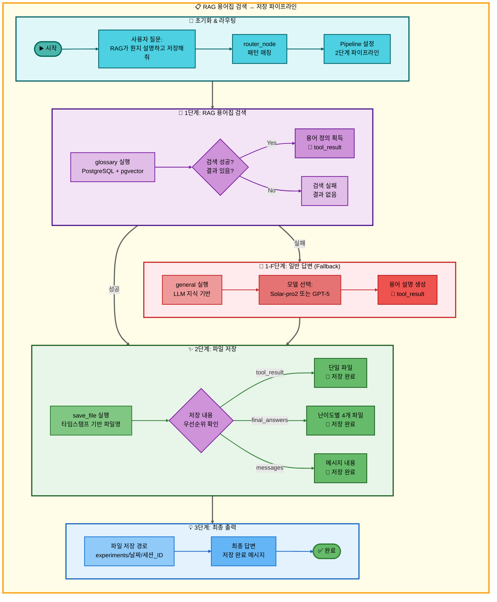
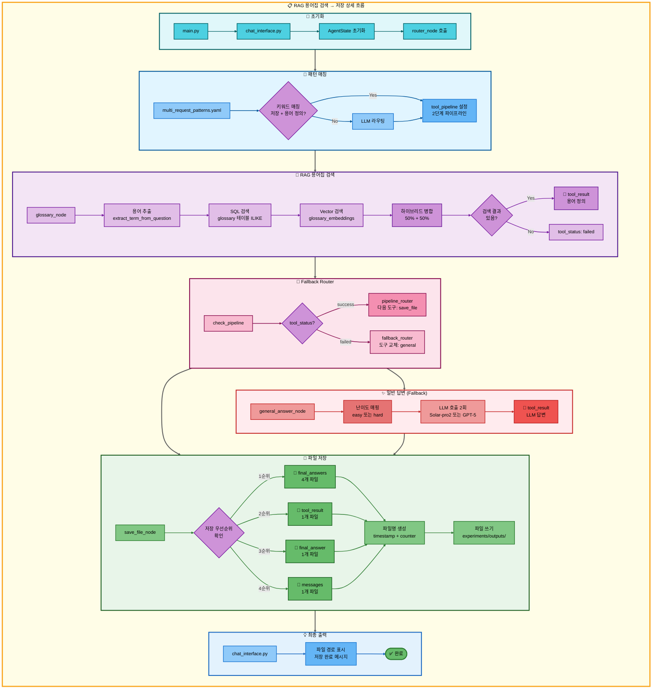

# 이중 요청: RAG 용어집 검색 → 저장 아키텍처

## 📋 문서 정보
- **작성일**: 2025-11-07
- **작성자**: 최현화[팀장]
- **프로젝트명**: 논문 리뷰 챗봇 (AI Agent + RAG)
- **팀명**: 연결의 민족
- **문서 버전**: 1.0

---

## 📑 목차
1. [시나리오 개요](#시나리오-개요)
2. [사용자 요청 분석](#사용자-요청-분석)
3. [도구 자동 전환 및 Fallback](#도구-자동-전환-및-fallback)
4. [단순 흐름 아키텍처](#단순-흐름-아키텍처)
5. [상세 기능 동작 흐름도](#상세-기능-동작-흐름도)
6. [전체 흐름 요약 표](#전체-흐름-요약-표)
7. [동작 설명 (초보 개발자용)](#동작-설명-초보-개발자용)
8. [실행 예시](#실행-예시)
9. [핵심 포인트](#핵심-포인트)

---

## 📌 시나리오 개요

### 다중 요청의 목적

사용자가 AI 용어의 정의를 검색한 후 바로 저장까지 원하는 경우, 두 가지 도구를 순차적으로 실행하여 한 번에 결과를 제공합니다.

**실행되는 도구 순서:**
```
1단계: glossary (RAG 용어집 검색)
  ↓ 실패 시
1-F: general (일반 답변 - LLM 지식 기반)
  ↓ 성공 시
2단계: save_file (파일 저장)
```

**사용자 요청 예시:**
- "RAG가 뭔지 설명하고 저장해줘"
- "Transformer 뭐야? 저장해줘"
- "LLM이 무엇인지 알려주고 저장해줘"
- "BERT가 어떤건지 찾아서 저장해줘"

---

## 📋 사용자 요청 분석

### 정확한 사용자 질문 예시
```
"RAG가 뭔지 설명하고 저장해줘"
```

### 도구 선택 근거

**패턴 매칭 기반 자동 감지:**

1. **키워드 분석:**
   - `keywords: ["저장"]` → 저장 의도 감지
   - `any_of_keywords: ["뭐야", "뭔데", "뭔지", "무엇인지", "어떤건지", "어떤거야"]` → 용어 정의 질문 감지
   - `exclude_keywords: ["전체", "논문"]` → 단순 용어 정의 확인

2. **우선순위:**
   - Priority: 140 (2-도구 패턴)

3. **선택된 도구:**
   - `tools: [glossary, save_file]`

**결정 로직:**
```python
# src/agent/nodes.py - router_node()
if "저장" in question and any(keyword in question for keyword in ["뭐야", "뭔지", "무엇인지"]):
    if "전체" not in question and "논문" not in question:
        # glossary → save_file 파이프라인 설정
        tool_pipeline = ["glossary", "save_file"]
```

---

## 🔄 도구 자동 전환 및 Fallback

### 전체 흐름

```
사용자: "RAG가 뭔지 설명하고 저장해줘"
↓
[0단계] 라우팅
├─ multi_request_patterns.yaml 패턴 매칭
├─ tool_pipeline: [glossary, save_file]
└─ pipeline_index: 1 (첫 도구 실행 준비)
↓
[1단계] RAG 용어집 검색 (glossary)
├─ glossary 테이블에서 하이브리드 검색 (SQL + Vector)
├─ 성공 → 용어 정의 발견, tool_result에 저장
└─ 실패 → tool_status: failed
    ↓
    [1-F] 일반 답변 (general) ← Fallback
    ├─ LLM이 자체 지식으로 용어 설명
    └─ 성공 → tool_result에 저장
↓
[2단계] 파일 저장 (save_file)
├─ tool_result를 파일로 저장 (우선순위 2)
├─ 파일명: {timestamp}_response_{counter}.md
└─ 성공 → 저장 완료 메시지
```

### Fallback 체인

```python
# configs/model_config.yaml - fallback_chain
TOOL_FALLBACKS = {
    "glossary": "general",  # 용어집 실패 → 일반 답변
    # save_file은 항상 성공 (우선순위 폴백)
}
```

**Fallback 트리거 조건:**
- `tool_status == "failed"` (도구 실행 실패)
- 용어집 검색 결과 없음
- DB 연결 오류

**Fallback 동작:**
1. `fallback_router_node()`에서 실패 감지
2. `TOOL_FALLBACKS`에서 대체 도구 조회
3. `tool_pipeline[current_index]`를 `general`로 교체
4. `general_answer_node()` 실행

---

## 📊 단순 흐름 아키텍처



---

## 🔧 상세 기능 동작 흐름도



---

## 📋 전체 흐름 요약 표

| 단계 | 도구명 | 파일명 | 메서드명 | 동작 설명 | 입력 | 출력 | Fallback | 세션 저장 |
|------|--------|--------|----------|-----------|------|------|----------|----------|
| 0 | 라우팅 | src/agent/nodes.py | router_node() | 패턴 매칭으로 다중 요청 감지 | question: "RAG가 뭔지 설명하고 저장해줘" | tool_pipeline: [glossary, save_file], tool_choice: glossary | 없음 | tool_pipeline, pipeline_index=1 |
| 1 | RAG 용어집 검색 | src/tools/glossary.py | glossary_node() | PostgreSQL + pgvector 하이브리드 검색 (50% + 50%) | question, difficulty | tool_result: 용어 정의 (성공) 또는 "관련 용어를 찾을 수 없습니다" (실패) | general | tool_result, tool_status, final_answers |
| 1-F | 일반 답변 | src/tools/general_answer.py | general_answer_node() | LLM 자체 지식으로 용어 설명 | question, difficulty | tool_result: LLM 생성 설명, final_answers: {elementary, beginner} 또는 {intermediate, advanced} | 없음 | tool_result, final_answers |
| 2 | 파일 저장 | src/tools/save_file.py | save_file_node() | tool_result를 파일로 저장 (우선순위 2) | tool_result, tool_pipeline, pipeline_index | final_answer: "파일이 성공적으로 저장되었습니다.\n파일 경로: ..." | 없음 | save_counter, final_answer |

**Pipeline Index 변화:**
- 초기: `pipeline_index = 1` (첫 도구 실행 후)
- glossary 실행 → `pipeline_index = 2` (다음 도구 준비)
- save_file 실행 → `pipeline_index = 2` (종료)

**Fallback 발생 조건:**
- glossary 검색 결과 없음 (`"관련 용어를 찾을 수 없습니다"`)
- DB 연결 오류
- Vector 인덱스 미생성

**Save Counter 변화:**
- 초기: `save_counter = 0`
- save_file 실행 → `save_counter += 1` (세션별 누적)
- 다음 저장 → `save_counter += 1` (계속 증가)

---

## 🔍 동작 설명 (초보 개발자용)

### 1단계: RAG 용어집 검색

**파일:** `src/tools/glossary.py`

**동작 과정:**

1. **용어 추출:**
   ```python
   # _extract_term_from_question()
   question = "RAG가 뭔지 설명하고 저장해줘"
   term = "RAG"  # 조사 및 질문 패턴 제거
   ```

2. **SQL 검색 (PostgreSQL ILIKE):**
   ```sql
   SELECT term_id, term, definition, easy_explanation, hard_explanation,
          category, difficulty_level, related_terms, examples
   FROM glossary
   WHERE (term ILIKE '%RAG%'
       OR definition ILIKE '%RAG%'
       OR easy_explanation ILIKE '%RAG%'
       OR hard_explanation ILIKE '%RAG%')
   ORDER BY term_id ASC
   LIMIT 3;
   ```

3. **Vector 검색 (pgvector 유사도):**
   ```python
   # _vector_search_glossary()
   vectorstore = PGVector(
       collection_name="glossary_embeddings",
       embeddings=OpenAIEmbeddings(model="text-embedding-3-small")
   )
   results = vectorstore.similarity_search_with_score(query="RAG", k=3)
   # → [(Document, score), ...]
   ```

4. **하이브리드 병합:**
   ```python
   # configs/model_config.yaml - rag.hybrid_search.tool_specific_weights.glossary
   vector_weight = 0.5   # 50%
   keyword_weight = 0.5  # 50%

   # SQL 결과 + Vector 결과 병합 후 중복 제거
   # (term, definition) 조합으로 unique 체크
   ```

5. **난이도별 설명 선택:**
   ```python
   # _pick_explanation()
   if difficulty == "easy":
       explanation = row["easy_explanation"] or row["definition"]
   elif difficulty == "hard":
       explanation = row["hard_explanation"] or row["definition"]
   ```

6. **Markdown 포맷팅:**
   ```markdown
   ## 용어집 검색 결과

   ### 1. RAG
   - **카테고리**: Retrieval-Augmented Generation
   - **난이도**: beginner
   - **유사도 점수(낮을수록 유사)**: 0.2341
   - **연관 용어**: LLM, Vector Database, Embedding
   - **정의**: 외부 지식을 검색하여 LLM 답변 품질을 향상시키는 기법

   RAG는 Retrieval-Augmented Generation의 약자로...
   ```

**Fallback 조건:**
- 검색 결과 없음 → `"관련 용어를 찾을 수 없습니다"` 반환
- `tool_status = "failed"` 설정
- `fallback_router_node()`가 `general_answer_node()` 호출

### 1-F단계: 일반 답변 (Fallback)

**파일:** `src/tools/general_answer.py`

**동작 과정:**

1. **난이도별 모델 선택:**
   ```python
   # configs/model_config.yaml - hybrid_strategy
   if difficulty == "easy":
       provider = "solar"
       model = "solar-pro2"      # 한국어 특화
   elif difficulty == "hard":
       provider = "openai"
       model = "gpt-5"           # 기술적 정확도
   ```

2. **두 수준 답변 생성:**
   ```python
   level_mapping = {
       "easy": ["elementary", "beginner"],
       "hard": ["intermediate", "advanced"]
   }

   for level in ["elementary", "beginner"]:  # easy 모드 예시
       system_prompt = get_tool_prompt("general_answer", level)
       messages = [
           SystemMessage(content=system_prompt),
           HumanMessage(content="RAG가 뭔지 설명하고 저장해줘")
       ]
       response = llm.invoke(messages)
       final_answers[level] = response.content
   ```

3. **tool_result 저장:**
   ```python
   # 두 번째 수준 답변을 tool_result에 저장 (save_file에서 사용)
   state["tool_result"] = final_answers["beginner"]
   state["final_answers"] = final_answers
   ```

### 2단계: 파일 저장

**파일:** `src/tools/save_file.py`

**동작 과정:**

1. **저장 내용 우선순위 결정:**
   ```python
   # 우선순위 0: final_answers (난이도별 다중 답변)
   if final_answers and len(final_answers) > 0:
       for level, content in final_answers.items():
           filename = f"{timestamp}_response_{save_counter}_{level}.md"
           # 4개 파일 저장 (easy 모드: elementary, beginner)

   # 우선순위 1: tool_result (파이프라인 실행 결과) ← 이번 케이스
   elif tool_result and tool_result.strip():
       content_to_save = tool_result
       filename = f"{timestamp}_response_{save_counter}.md"

   # 우선순위 2: final_answer
   elif final_answer and final_answer.strip():
       content_to_save = final_answer

   # 우선순위 3: messages
   elif messages:
       for msg in reversed(messages):
           if msg.get("role") == "assistant":
               content_to_save = msg.get("content", "")
   ```

2. **파일명 생성:**
   ```python
   import datetime

   timestamp = datetime.datetime.now().strftime("%Y%m%d_%H%M%S")
   save_counter = state.get("save_counter", 0) + 1

   filename = f"{timestamp}_response_{save_counter}.md"
   # 예: "20250107_143052_response_1.md"
   ```

3. **저장 경로 결정:**
   ```python
   output_dir = Path("experiments") / date_str / session_id / "outputs"
   output_dir.mkdir(parents=True, exist_ok=True)

   file_path = output_dir / filename
   # 예: experiments/2025-01-07/session_abc123/outputs/20250107_143052_response_1.md
   ```

4. **파일 쓰기:**
   ```python
   with open(file_path, "w", encoding="utf-8") as f:
       f.write(content_to_save)
   ```

5. **최종 답변 생성:**
   ```python
   state["final_answer"] = f"""파일이 성공적으로 저장되었습니다.

파일 경로: {file_path}

저장된 내용:
{content_to_save[:200]}...
"""
   ```

---

## 💡 실행 예시

### 예시 1: 용어집 검색 성공 → 저장

**입력:**
```
사용자: "RAG가 뭔지 설명하고 저장해줘"
난이도: easy
```

**1단계 실행 (glossary):**
```markdown
## 용어집 검색 결과

### 1. RAG
- **카테고리**: Retrieval-Augmented Generation
- **난이도**: beginner
- **유사도 점수(낮을수록 유사)**: 0.2341
- **연관 용어**: LLM, Vector Database, Embedding
- **정의**: 외부 지식을 검색하여 LLM 답변 품질을 향상시키는 기법

RAG(Retrieval-Augmented Generation)는 대규모 언어 모델(LLM)이
외부 지식 베이스를 검색하여 더 정확하고 최신의 정보를 제공하는 기술입니다.
```

**Pipeline Index 변화:**
- `pipeline_index = 1` → `2` (다음 도구 준비)

**2단계 실행 (save_file):**
```python
# 우선순위 1: tool_result 사용
content_to_save = tool_result  # 위 용어집 검색 결과
filename = "20250107_143052_response_1.md"
file_path = "experiments/2025-01-07/session_abc123/outputs/20250107_143052_response_1.md"
```

**최종 출력:**
```
파일이 성공적으로 저장되었습니다.

파일 경로: experiments/2025-01-07/session_abc123/outputs/20250107_143052_response_1.md

저장된 내용:
## 용어집 검색 결과

### 1. RAG
- **카테고리**: Retrieval-Augmented Generation
- **난이도**: beginner
...
```

### 예시 2: 용어집 검색 실패 → Fallback (general) → 저장

**입력:**
```
사용자: "XYZ알고리즘이 뭔지 설명하고 저장해줘"
난이도: easy
```

**1단계 실행 (glossary):**
```
검색 결과: "관련 용어를 찾을 수 없습니다"
tool_status: "failed"
```

**Fallback 트리거:**
```python
# fallback_router_node()
failed_tool = "glossary"
fallback_tool = TOOL_FALLBACKS["glossary"]  # "general"
tool_pipeline[0] = "general"  # 교체
```

**1-F단계 실행 (general):**
```python
# Solar-pro2 모델로 LLM 답변 생성
system_prompt = get_tool_prompt("general_answer", "beginner")
messages = [
    SystemMessage(content=system_prompt),
    HumanMessage(content="XYZ알고리즘이 뭔지 설명하고 저장해줘")
]
response = llm.invoke(messages)

final_answers = {
    "elementary": "XYZ알고리즘은 데이터를 정렬하는 방법입니다...",
    "beginner": "XYZ알고리즘은 효율적인 정렬 알고리즘으로..."
}
tool_result = final_answers["beginner"]
```

**2단계 실행 (save_file):**
```python
# 우선순위 1: tool_result 사용 (Fallback 답변)
content_to_save = tool_result
filename = "20250107_143052_response_1.md"
```

**최종 출력:**
```
파일이 성공적으로 저장되었습니다.

파일 경로: experiments/2025-01-07/session_abc123/outputs/20250107_143052_response_1.md

저장된 내용:
XYZ알고리즘은 효율적인 정렬 알고리즘으로...
```

### 예시 3: 난이도 Hard 모드 - 4개 파일 저장

**입력:**
```
사용자: "Transformer가 뭔지 설명하고 저장해줘"
난이도: hard
```

**1단계 실행 (glossary):**
```python
# hard_explanation 선택
difficulty = "hard"
explanation = row["hard_explanation"]  # 기술적 상세 설명
```

**1-F단계 실행 (Fallback 발생 시 - general):**
```python
# GPT-5 모델로 답변 생성
level_mapping["hard"] = ["intermediate", "advanced"]

final_answers = {
    "intermediate": "Transformer는 self-attention 메커니즘을 사용하는...",
    "advanced": "Transformer 아키텍처는 Multi-Head Attention과 Positional Encoding을..."
}
```

**2단계 실행 (save_file):**
```python
# 우선순위 0: final_answers (4개 파일 저장)
for level in ["intermediate", "advanced"]:
    filename = f"20250107_143052_response_1_{level}.md"
    # 2개 파일 생성
```

**저장된 파일:**
```
experiments/2025-01-07/session_abc123/outputs/
├── 20250107_143052_response_1_intermediate.md
└── 20250107_143052_response_1_advanced.md
```

---

## 🎯 핵심 포인트

### 1. 하이브리드 검색 (SQL + Vector)

**용어집 전용 가중치:**
```yaml
# configs/model_config.yaml
rag:
  hybrid_search:
    tool_specific_weights:
      glossary:
        vector_weight: 0.5    # 50% (의미 유사도)
        keyword_weight: 0.5   # 50% (정확한 단어 매칭)
```

**이유:**
- 용어는 정확한 단어 매칭이 중요 (키워드 50%)
- 동의어/유사 표현도 찾아야 함 (벡터 50%)

### 2. Fallback 체인

```
glossary (용어집 검색)
  ↓ 실패
general (LLM 지식)
  ↓ 항상 성공
저장
```

**Fallback 로직:**
```python
# src/agent/nodes.py - fallback_router_node()
TOOL_FALLBACKS = {
    "glossary": "general"  # 용어집 실패 → 일반 답변
}

if state["tool_status"] == "failed":
    current_tool = tool_pipeline[pipeline_index - 1]
    fallback_tool = TOOL_FALLBACKS.get(current_tool)
    if fallback_tool:
        tool_pipeline[pipeline_index - 1] = fallback_tool
```

### 3. 저장 우선순위

```python
# src/tools/save_file.py
우선순위 0: final_answers  # 난이도별 4개 파일 (Fallback 발생 시)
우선순위 1: tool_result    # 단일 파일 (정상 검색 시) ← 주로 사용
우선순위 2: final_answer   # 단일 파일 (호환성)
우선순위 3: messages        # 마지막 assistant 메시지
```

**이번 시나리오:**
- **glossary 성공:** `tool_result` 저장 (우선순위 1)
- **Fallback 발생:** `tool_result` + `final_answers` 모두 있음 → `final_answers` 우선 (우선순위 0)

### 4. 용어 추출 정규식

```python
# src/tools/glossary.py - _extract_term_from_question()
patterns = [
    r'에\s*대해(서)?\s*설명해[줘주세요]*\??',
    r'[이가]\s*뭐야\??',
    r'[은는]\s*뭐야\??',
    r'[이가]\s*무엇인가요?\??',
    # ...
]

"RAG가 뭔지 설명하고 저장해줘" → "RAG"
"Transformer에 대해서 알려줘" → "Transformer"
```

### 5. DB 테이블 구조

**glossary 테이블:**
```sql
CREATE TABLE glossary (
    term_id SERIAL PRIMARY KEY,
    term VARCHAR(255) NOT NULL,              -- 용어명
    definition TEXT,                          -- 기본 정의
    easy_explanation TEXT,                    -- Easy 모드 설명
    hard_explanation TEXT,                    -- Hard 모드 설명
    category VARCHAR(100),                    -- 카테고리
    difficulty_level VARCHAR(50),             -- beginner/intermediate/advanced
    related_terms TEXT[],                     -- 연관 용어 배열
    examples TEXT,                            -- 예시
    created_at TIMESTAMP DEFAULT NOW(),
    updated_at TIMESTAMP DEFAULT NOW()
);

-- 인덱스
CREATE INDEX idx_glossary_term ON glossary(term);
CREATE INDEX idx_glossary_category ON glossary(category);
```

**glossary_embeddings 컬렉션 (pgvector):**
```python
collection_name = "glossary_embeddings"
embedding_model = "text-embedding-3-small"  # 1536 차원
```

### 6. 난이도별 모델 선택

```yaml
# configs/model_config.yaml - hybrid_strategy
easy 모드:
  provider: solar
  model: solar-pro2      # 한국어 특화, 비용 절감

hard 모드:
  provider: openai
  model: gpt-5           # 기술적 정확도, 상세한 설명
```

---

**작성일**: 2025-11-07
**버전**: 1.0
