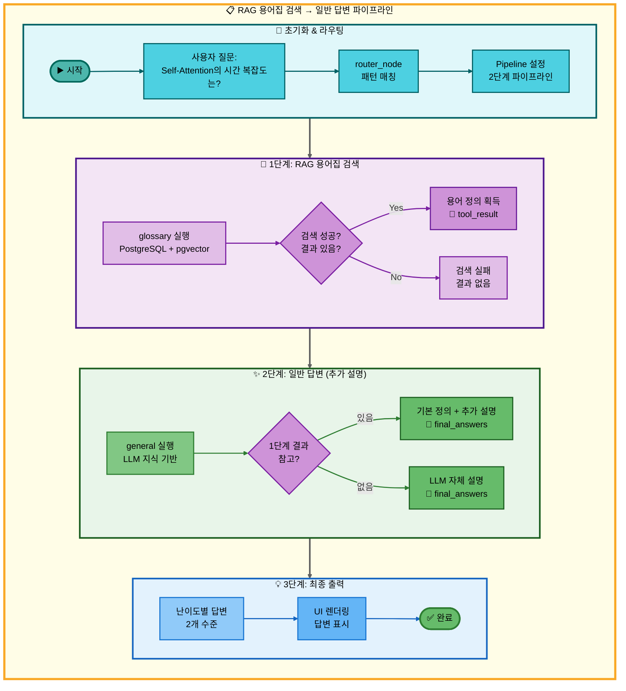
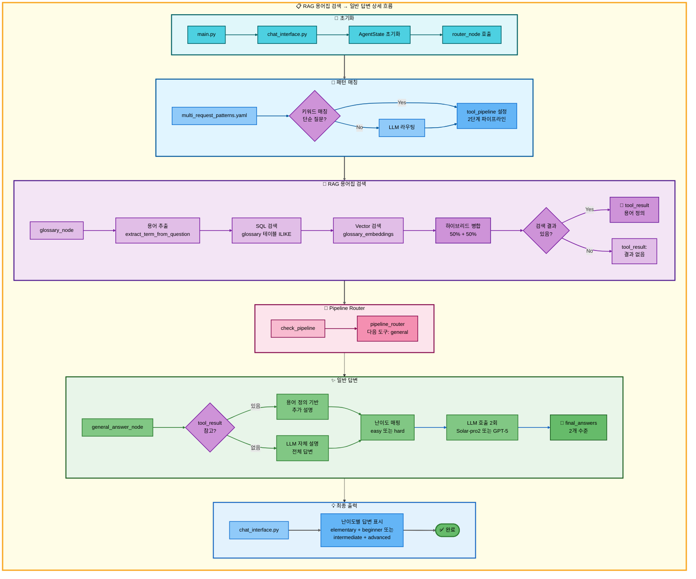

# 이중 요청: RAG 용어집 검색 → 일반 답변 아키텍처

## 📋 문서 정보
- **작성일**: 2025-11-07
- **작성자**: 최현화[팀장]
- **프로젝트명**: 논문 리뷰 챗봇 (AI Agent + RAG)
- **팀명**: 연결의 민족
- **문서 버전**: 1.0

---

## 📑 목차
1. [시나리오 개요](#시나리오-개요)
2. [사용자 요청 분석](#사용자-요청-분석)
3. [도구 자동 전환 및 Fallback](#도구-자동-전환-및-fallback)
4. [단순 흐름 아키텍처](#단순-흐름-아키텍처)
5. [상세 기능 동작 흐름도](#상세-기능-동작-흐름도)
6. [전체 흐름 요약 표](#전체-흐름-요약-표)
7. [동작 설명 (초보 개발자용)](#동작-설명-초보-개발자용)
8. [실행 예시](#실행-예시)
9. [핵심 포인트](#핵심-포인트)

---

## 📌 시나리오 개요

### 다중 요청의 목적

사용자가 AI 용어의 기본 정의를 검색한 후, LLM이 추가로 더 자세한 설명이나 보충 정보를 제공하는 경우입니다. 용어집에서 간단한 정의를 제공하고, 이어서 LLM이 심화 내용을 추가합니다.

**실행되는 도구 순서:**
```
1단계: glossary (RAG 용어집 검색)
  ↓ 성공 또는 실패 모두
2단계: general (일반 답변 - LLM 추가 설명)
```

**사용자 요청 예시:**
- "Self-Attention의 시간 복잡도는?"
- "Transformer의 성능은?"
- "BERT의 특징은?"
- "GPT의 장점은?"
- "배치 정규화란?"

---

## 📋 사용자 요청 분석

### 정확한 사용자 질문 예시
```
"Self-Attention의 시간 복잡도는?"
```

### 도구 선택 근거

**패턴 매칭 기반 자동 감지:**

1. **키워드 분석:**
   - `keywords: []` → 특정 필수 키워드 없음
   - `any_of_keywords: ["은?", "는?", "의?", "이란?"]` → 단순 질문 패턴
   - `exclude_keywords: ["논문", "최신", "저장", "검색", "찾", "요약"]` → 복잡한 요청 제외

2. **우선순위:**
   - Priority: 145 (2-도구 패턴)

3. **선택된 도구:**
   - `tools: [glossary, general]`

**결정 로직:**
```python
# src/agent/nodes.py - router_node()
if any(keyword in question for keyword in ["은?", "는?", "의?", "이란?"]):
    if not any(ex in question for ex in ["논문", "최신", "저장", "검색", "찾", "요약"]):
        # glossary → general 파이프라인 설정
        tool_pipeline = ["glossary", "general"]
```

---

## 🔄 도구 자동 전환 및 Fallback

### 전체 흐름

```
사용자: "Self-Attention의 시간 복잡도는?"
↓
[0단계] 라우팅
├─ multi_request_patterns.yaml 패턴 매칭
├─ tool_pipeline: [glossary, general]
└─ pipeline_index: 1 (첫 도구 실행 준비)
↓
[1단계] RAG 용어집 검색 (glossary)
├─ glossary 테이블에서 하이브리드 검색 (SQL + Vector)
├─ 성공 → 기본 정의 발견, tool_result에 저장
└─ 실패 → tool_result: "관련 용어를 찾을 수 없습니다"
↓
[2단계] 일반 답변 (general) ← 항상 실행
├─ 1단계 결과를 참고하여 추가 설명
├─ LLM이 더 자세한 답변 생성
└─ 성공 → final_answers에 저장
```

### 특징: Fallback 없이 순차 실행

이 시나리오는 **Fallback이 아닌 보완적 실행**입니다:

```python
# 1단계 성공 시:
glossary → "Self-Attention은 입력 시퀀스 내의 각 토큰이..."
   ↓
general → "위 정의를 바탕으로 시간 복잡도를 설명하면, O(n²)입니다..."

# 1단계 실패 시:
glossary → "관련 용어를 찾을 수 없습니다"
   ↓
general → "Self-Attention의 시간 복잡도는 O(n²)로, 시퀀스 길이에 제곱으로 증가합니다..."
```

**차이점:**
- **Fallback 패턴 (03번 문서):** 1단계 실패 시에만 2단계 실행
- **보완 패턴 (이 문서):** 1단계 성공/실패와 무관하게 2단계 항상 실행

---

## 📊 단순 흐름 아키텍처



---

## 🔧 상세 기능 동작 흐름도



---

## 📋 전체 흐름 요약 표

| 단계 | 도구명 | 파일명 | 메서드명 | 동작 설명 | 입력 | 출력 | Fallback | 세션 저장 |
|------|--------|--------|----------|-----------|------|------|----------|----------|
| 0 | 라우팅 | src/agent/nodes.py | router_node() | 패턴 매칭으로 다중 요청 감지 | question: "Self-Attention의 시간 복잡도는?" | tool_pipeline: [glossary, general], tool_choice: glossary | 없음 | tool_pipeline, pipeline_index=1 |
| 1 | RAG 용어집 검색 | src/tools/glossary.py | glossary_node() | PostgreSQL + pgvector 하이브리드 검색 (50% + 50%) | question, difficulty | tool_result: 용어 정의 (성공) 또는 "관련 용어를 찾을 수 없습니다" (실패), final_answers: {elementary, beginner} 또는 {intermediate, advanced} | 없음 | tool_result, final_answers |
| 2 | 일반 답변 | src/tools/general_answer.py | general_answer_node() | LLM 자체 지식 + 1단계 결과 참고하여 추가 설명 | question, difficulty, (tool_result 참고) | final_answers: {elementary, beginner} 또는 {intermediate, advanced} | 없음 | final_answers, final_answer |

**Pipeline Index 변화:**
- 초기: `pipeline_index = 1` (첫 도구 실행 후)
- glossary 실행 → `pipeline_index = 2` (다음 도구 준비)
- general 실행 → `pipeline_index = 2` (종료)

**특징:**
- **Fallback 없음**: 1단계 성공/실패와 무관하게 2단계 항상 실행
- **보완적 실행**: 1단계 결과를 참고하여 2단계가 추가 설명 제공
- **tool_result 참고**: general_answer_node()가 이전 tool_result를 읽어서 컨텍스트 활용 (선택적)

---

## 🔍 동작 설명 (초보 개발자용)

### 1단계: RAG 용어집 검색

**파일:** `src/tools/glossary.py`

**동작:** 03번 문서와 동일 (하이브리드 검색 50% + 50%)

**차이점:**
- 이 시나리오에서는 **검색 실패 시에도 Fallback 없이 바로 2단계 진행**
- `tool_status`는 `success` 또는 `failed`로 설정되지만, 파이프라인은 계속 진행

### 2단계: 일반 답변 (추가 설명)

**파일:** `src/tools/general_answer.py`

**동작 과정:**

1. **이전 결과 참고 (선택적):**
   ```python
   # general_answer_node()
   question = state["question"]
   tool_result = state.get("tool_result", "")  # 1단계 결과 (있으면)

   # 프롬프트 구성 시 tool_result 포함 여부는 구현에 따름
   # 현재는 question만 사용하지만, 확장 가능
   ```

2. **난이도별 모델 선택:**
   ```python
   # configs/model_config.yaml - hybrid_strategy
   if difficulty == "easy":
       provider = "solar"
       model = "solar-pro2"      # 한국어 특화
   elif difficulty == "hard":
       provider = "openai"
       model = "gpt-5"           # 기술적 정확도
   ```

3. **두 수준 답변 생성:**
   ```python
   level_mapping = {
       "easy": ["elementary", "beginner"],
       "hard": ["intermediate", "advanced"]
   }

   for level in ["elementary", "beginner"]:  # easy 모드 예시
       system_prompt = get_tool_prompt("general_answer", level)
       messages = [
           SystemMessage(content=system_prompt),
           HumanMessage(content=question)
       ]
       response = llm.invoke(messages)
       final_answers[level] = response.content
   ```

4. **최종 답변 저장:**
   ```python
   state["final_answers"] = final_answers
   state["final_answer"] = final_answers["beginner"]  # 두 번째 수준
   ```

### 보완적 실행 로직

**1단계 성공 시:**
```python
# glossary_node()
tool_result = "Self-Attention은 입력 시퀀스 내의 각 토큰이..."

# general_answer_node()
# LLM이 tool_result를 참고하여 추가 설명
# (현재 구현은 question만 사용하지만, tool_result 활용 가능)
question = "Self-Attention의 시간 복잡도는?"
# LLM 답변: "Self-Attention의 시간 복잡도는 O(n²)입니다. 각 토큰이 모든 다른 토큰과..."
```

**1단계 실패 시:**
```python
# glossary_node()
tool_result = "관련 용어를 찾을 수 없습니다"

# general_answer_node()
# LLM이 자체 지식으로 전체 답변
question = "Self-Attention의 시간 복잡도는?"
# LLM 답변: "Self-Attention의 시간 복잡도는 O(n²)입니다. 시퀀스 길이 n에 대해 각 토큰이..."
```

---

## 💡 실행 예시

### 예시 1: 용어집 검색 성공 + 일반 답변 추가

**입력:**
```
사용자: "Self-Attention의 시간 복잡도는?"
난이도: easy
```

**1단계 실행 (glossary):**
```markdown
## 용어집 검색 결과

### 1. Self-Attention
- **카테고리**: Attention Mechanism
- **난이도**: intermediate
- **유사도 점수(낮을수록 유사)**: 0.1523
- **연관 용어**: Transformer, Multi-Head Attention, Query-Key-Value
- **정의**: 입력 시퀀스 내의 각 토큰이 다른 모든 토큰과의 관계를 학습하는 메커니즘

Self-Attention은 Transformer 아키텍처의 핵심으로, 각 토큰이 시퀀스 내 다른 토큰들과의
관련성을 계산하여 가중치를 부여합니다.
```

**2단계 실행 (general):**
```python
# Solar-pro2 모델로 추가 설명 생성
question = "Self-Attention의 시간 복잡도는?"

final_answers = {
    "elementary": """Self-Attention의 시간 복잡도는 O(n²)입니다.

    시퀀스 길이가 n일 때, 각 토큰이 다른 모든 토큰과 비교해야 하므로
    n × n번의 계산이 필요합니다.""",

    "beginner": """Self-Attention의 시간 복잡도는 O(n²)입니다.

    위 용어 정의에서 설명했듯이, Self-Attention은 각 토큰이 다른 모든 토큰과의
    관계를 학습합니다. 시퀀스 길이가 n이면:
    - 각 토큰마다 n개의 다른 토큰과 계산
    - 총 n개 토큰 × n개 비교 = O(n²)

    예를 들어, 문장이 10개 단어면 10×10=100번,
    100개 단어면 100×100=10,000번 계산합니다."""
}
```

**최종 출력:**
```
[elementary 답변]
Self-Attention의 시간 복잡도는 O(n²)입니다.

시퀀스 길이가 n일 때, 각 토큰이 다른 모든 토큰과 비교해야 하므로
n × n번의 계산이 필요합니다.

[beginner 답변]
Self-Attention의 시간 복잡도는 O(n²)입니다.

위 용어 정의에서 설명했듯이, Self-Attention은 각 토큰이 다른 모든 토큰과의
관계를 학습합니다. 시퀀스 길이가 n이면:
- 각 토큰마다 n개의 다른 토큰과 계산
- 총 n개 토큰 × n개 비교 = O(n²)

예를 들어, 문장이 10개 단어면 10×10=100번,
100개 단어면 100×100=10,000번 계산합니다.
```

### 예시 2: 용어집 검색 실패 + 일반 답변으로 보완

**입력:**
```
사용자: "XYZ알고리즘의 특징은?"
난이도: easy
```

**1단계 실행 (glossary):**
```
검색 결과: "관련 용어를 찾을 수 없습니다"
tool_result: "관련 용어를 찾을 수 없습니다"
```

**2단계 실행 (general):**
```python
# Solar-pro2 모델로 전체 답변 생성
question = "XYZ알고리즘의 특징은?"

final_answers = {
    "elementary": """XYZ알고리즘은 데이터를 효율적으로 처리하는 방법입니다.

    주요 특징:
    - 빠른 처리 속도
    - 적은 메모리 사용
    - 다양한 데이터 타입 지원""",

    "beginner": """XYZ알고리즘의 주요 특징은 다음과 같습니다:

    1. 시간 복잡도: O(n log n)으로 효율적입니다
    2. 공간 복잡도: 추가 메모리를 최소화합니다
    3. 안정성: 동일한 값의 순서를 유지합니다
    4. 적용 범위: 다양한 데이터 구조에 적용 가능합니다"""
}
```

**최종 출력:**
```
[elementary 답변]
XYZ알고리즘은 데이터를 효율적으로 처리하는 방법입니다.

주요 특징:
- 빠른 처리 속도
- 적은 메모리 사용
- 다양한 데이터 타입 지원

[beginner 답변]
XYZ알고리즘의 주요 특징은 다음과 같습니다:

1. 시간 복잡도: O(n log n)으로 효율적입니다
2. 공간 복잡도: 추가 메모리를 최소화합니다
3. 안정성: 동일한 값의 순서를 유지합니다
4. 적용 범위: 다양한 데이터 구조에 적용 가능합니다
```

### 예시 3: Hard 모드 - 기술적 상세 설명

**입력:**
```
사용자: "Transformer의 성능은?"
난이도: hard
```

**1단계 실행 (glossary):**
```markdown
## 용어집 검색 결과

### 1. Transformer
- **카테고리**: Neural Network Architecture
- **난이도**: advanced
- **정의**: Self-Attention 메커니즘을 사용하는 sequence-to-sequence 모델

Transformer는 2017년 "Attention Is All You Need" 논문에서 제안된
Self-Attention 기반 아키텍처입니다.
```

**2단계 실행 (general):**
```python
# GPT-5 모델로 기술적 상세 설명 생성
level_mapping["hard"] = ["intermediate", "advanced"]

final_answers = {
    "intermediate": """Transformer의 성능은 다음과 같은 측면에서 우수합니다:

    1. 병렬 처리: RNN과 달리 시퀀스를 병렬로 처리하여 학습 속도 향상
    2. 장거리 의존성: Self-Attention으로 먼 거리의 토큰 관계도 효과적으로 학습
    3. 범용성: NLP, Vision, Multi-modal 등 다양한 도메인에 적용 가능

    주요 벤치마크:
    - WMT 2014 EN-DE: BLEU 28.4 (당시 SOTA)
    - WMT 2014 EN-FR: BLEU 41.0""",

    "advanced": """Transformer 아키텍처의 성능 특성:

    **계산 복잡도:**
    - Self-Attention: O(n²·d) (시퀀스 길이 n, 차원 d)
    - Feed-Forward: O(n·d·d_ff) (d_ff는 hidden dimension)

    **성능 지표:**
    1. 번역 품질 (BLEU):
       - WMT 2014 EN-DE: 28.4 (이전 SOTA 대비 +2.0)
       - WMT 2014 EN-FR: 41.0 (단일 모델 SOTA)

    2. 학습 효율성:
       - 8 P100 GPU에서 3.5일 (Base 모델)
       - RNN/LSTM 대비 5~10배 빠른 학습

    3. 파라미터 효율성:
       - Base: 65M parameters
       - Big: 213M parameters
       - 파라미터 대비 성능이 RNN보다 우수

    **장점:**
    - 병렬화 가능: GPU 활용도 극대화
    - 해석 가능성: Attention weight 시각화
    - 전이 학습: Pre-training + Fine-tuning 전략

    **한계:**
    - 시퀀스 길이에 제곱으로 증가하는 메모리
    - 긴 시퀀스 처리 시 계산 비용 증가"""
}
```

**최종 출력:**
```
[intermediate 답변]
Transformer의 성능은 다음과 같은 측면에서 우수합니다:

1. 병렬 처리: RNN과 달리 시퀀스를 병렬로 처리하여 학습 속도 향상
2. 장거리 의존성: Self-Attention으로 먼 거리의 토큰 관계도 효과적으로 학습
3. 범용성: NLP, Vision, Multi-modal 등 다양한 도메인에 적용 가능

주요 벤치마크:
- WMT 2014 EN-DE: BLEU 28.4 (당시 SOTA)
- WMT 2014 EN-FR: BLEU 41.0

[advanced 답변]
Transformer 아키텍처의 성능 특성:

**계산 복잡도:**
- Self-Attention: O(n²·d) (시퀀스 길이 n, 차원 d)
- Feed-Forward: O(n·d·d_ff) (d_ff는 hidden dimension)

**성능 지표:**
1. 번역 품질 (BLEU):
   - WMT 2014 EN-DE: 28.4 (이전 SOTA 대비 +2.0)
   - WMT 2014 EN-FR: 41.0 (단일 모델 SOTA)

2. 학습 효율성:
   - 8 P100 GPU에서 3.5일 (Base 모델)
   - RNN/LSTM 대비 5~10배 빠른 학습
...
```

---

## 🎯 핵심 포인트

### 1. Fallback vs 보완적 실행

**Fallback 패턴 (03번 문서):**
```
glossary 성공 → save_file
glossary 실패 → general → save_file
```

**보완 패턴 (이 문서):**
```
glossary 성공/실패 → general (항상 실행)
```

**차이점:**
| 구분 | Fallback 패턴 | 보완 패턴 |
|------|---------------|-----------|
| 2단계 실행 조건 | 1단계 실패 시에만 | 항상 실행 |
| 목적 | 대체 수단 제공 | 추가 설명 제공 |
| tool_status 영향 | 있음 (failed일 때만) | 없음 (무시) |
| 결과 결합 | 대체 (OR) | 보완 (AND) |

### 2. Pipeline Router 동작

```python
# src/agent/graph.py - pipeline_router()
def pipeline_router(state: AgentState, exp_manager=None):
    tool_pipeline = state.get("tool_pipeline", [])
    pipeline_index = state.get("pipeline_index", 0)

    # 보완 패턴: tool_status와 무관하게 다음 도구 실행
    if pipeline_index < len(tool_pipeline):
        next_tool = tool_pipeline[pipeline_index]
        state["tool_choice"] = next_tool
        state["pipeline_index"] = pipeline_index + 1

    return state
```

**Fallback 패턴과의 차이:**
- Fallback: `check_pipeline_or_fallback()`에서 `tool_status` 확인
- 보완: `pipeline_router()`에서 무조건 다음 도구로 진행

### 3. 질문 패턴 매칭

```yaml
# configs/multi_request_patterns.yaml
- keywords: []
  any_of_keywords: ["은?", "는?", "의?", "이란?"]
  exclude_keywords: ["논문", "최신", "저장", "검색", "찾", "요약"]
  tools: [glossary, general]
  priority: 145
```

**매칭되는 질문:**
- "Self-Attention의 시간 복잡도는?"
- "Transformer의 성능은?"
- "BERT의 특징은?"
- "배치 정규화란?"

**매칭되지 않는 질문:**
- "Transformer 논문 찾아줘" (논문 키워드)
- "최신 AI 동향은?" (최신 키워드)
- "RAG 저장해줘" (저장 키워드)

### 4. 난이도별 답변 레벨

```python
# src/tools/general_answer.py
level_mapping = {
    "easy": ["elementary", "beginner"],
    "hard": ["intermediate", "advanced"]
}
```

**Easy 모드 (Solar-pro2):**
- `elementary`: 초등학생 수준, 일상 용어로 설명
- `beginner`: 입문자 수준, 기본 개념 설명

**Hard 모드 (GPT-5):**
- `intermediate`: 중급자 수준, 기술적 용어 사용
- `advanced`: 전문가 수준, 수식/벤치마크 포함

### 5. 하이브리드 검색 가중치

```yaml
# configs/model_config.yaml
rag:
  hybrid_search:
    tool_specific_weights:
      glossary:
        vector_weight: 0.5    # 50% (의미 유사도)
        keyword_weight: 0.5   # 50% (정확한 단어 매칭)
```

**용어집 검색 특성:**
- 정확한 용어명 매칭 중요 → 키워드 50%
- 동의어/유사 표현 탐색 → 벡터 50%

### 6. UI 렌더링

```python
# chat_interface.py
final_answers = state["final_answers"]
# {
#     "elementary": "...",
#     "beginner": "..."
# }

# UI에서 두 수준 답변 모두 표시
st.markdown("### Elementary 수준")
st.write(final_answers["elementary"])

st.markdown("### Beginner 수준")
st.write(final_answers["beginner"])
```

---

**작성일**: 2025-11-07
**버전**: 1.0
