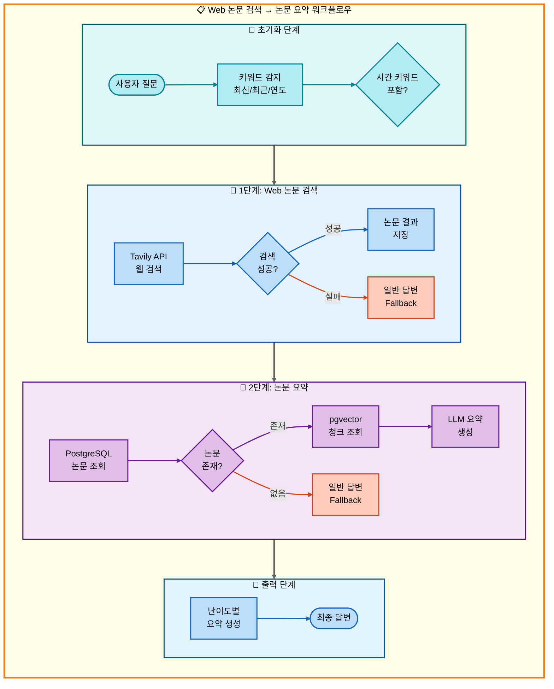
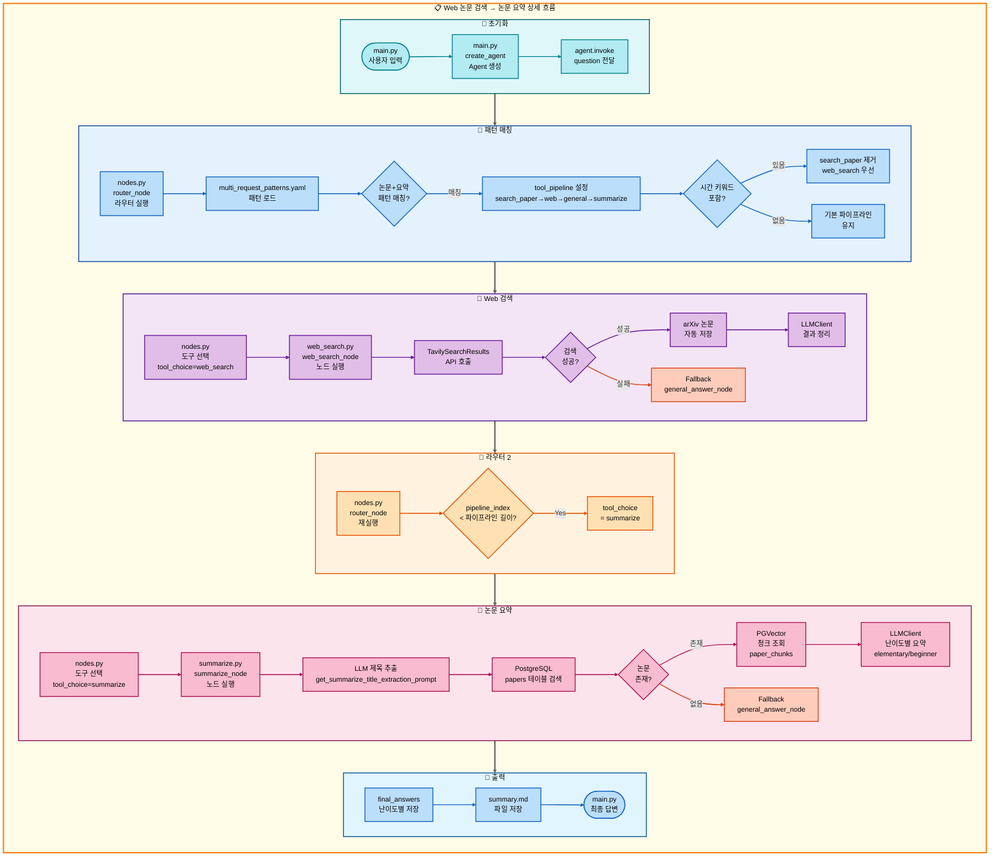

# 이중 요청: Web 논문 검색 → 논문 요약 아키텍처

## 📋 문서 정보
- **작성일**: 2025-11-07
- **작성자**: 최현화[팀장]
- **프로젝트명**: 논문 리뷰 챗봇 (AI Agent + RAG)
- **팀명**: 연결의 민족
- **문서 버전**: 1.0

---

## 📑 목차
1. [시나리오 개요](#시나리오-개요)
2. [사용자 요청 분석](#사용자-요청-분석)
3. [도구 자동 전환 및 Fallback](#도구-자동-전환-및-fallback)
4. [단순 흐름 아키텍처](#단순-흐름-아키텍처)
5. [상세 기능 동작 흐름도](#상세-기능-동작-흐름도)
6. [전체 흐름 요약 표](#전체-흐름-요약-표)
7. [동작 설명 (초보 개발자용)](#동작-설명-초보-개발자용)
8. [실행 예시](#실행-예시)
9. [핵심 포인트](#핵심-포인트)

---

## 📌 시나리오 개요

### 다중 요청의 목적

사용자가 **최신 논문**을 웹에서 검색한 후 바로 요약까지 원하는 경우, RAG DB를 건너뛰고 Web 검색부터 시작하여 요약까지 순차적으로 실행합니다.

**실행되는 도구 순서:**
```
[키워드 감지: '최신', '최근']
  ↓
RAG 논문 검색 건너뜀 (최신성 제한적)
  ↓
1단계: web_search (Tavily API로 최신 논문 검색)
  ↓ 실패 시
2단계: general (일반 답변 - LLM 지식 기반)
  ↓ 성공 시
3단계: summarize (논문 요약)
  ↓ 실패 시
3-F: general (일반 답변으로 직접 요약)
```

**사용자 요청 예시:**
- "**최신** AI 논문 찾아서 요약해줘"
- "**최근** Transformer 논문 요약해줘"
- "**2024년** LLM 논문 정리해줘"

**⚠️ 중요: '최신', '최근', 연도(2024년 등) 키워드가 반드시 포함되어야 합니다.**

---

## 📋 사용자 요청 분석

### 정확한 사용자 질문 예시

**예시 1: "최신 AI 논문 찾아서 요약해줘"**
- **키워드 분석**:
  - `최신`: ✅ **시간 키워드 포함** → RAG 건너뛰고 Web 검색 우선
  - `논문`: 논문 검색 필요
  - `요약`: 요약 작업 필요

**예시 2: "최근 Transformer 연구 정리해줘"**
- **키워드 분석**:
  - `최근`: ✅ **시간 키워드 포함** → RAG 건너뛰고 Web 검색 우선
  - `Transformer`: 검색 쿼리
  - `정리`: 요약 작업 필요

**예시 3: "Transformer 논문 요약해줘" (시간 키워드 없음)**
- **키워드 분석**:
  - 시간 키워드 없음 → RAG 논문 검색 우선 (본 문서의 시나리오와 다름)
  - 이 경우 `01_이중요청_RAG논문검색_논문요약.md` 시나리오 적용

### 도구 선택 근거

**패턴 매칭 방식 (src/agent/nodes.py:75-130)**

`configs/multi_request_patterns.yaml` 파일의 패턴을 기반으로 자동 감지:

```yaml
# 논문 요약 패턴 (기본)
- keywords:
  - 논문
  - 요약
  exclude_keywords:
  - 저장
  tools:
  - search_paper
  - web_search
  - general
  - summarize
  description: 논문 검색 후 요약 (4단계 파이프라인)
  priority: 120
```

**매칭 로직:**
1. 질문에 `논문` AND `요약` 키워드 모두 포함
2. 제외 키워드 (`저장`) 없음
3. 자동으로 4단계 파이프라인 설정: `[search_paper, web_search, general, summarize]`

**⚠️ 핵심 차이점: 시간 키워드 감지 시 RAG 건너뛰기**

**시간 키워드 감지 로직 (src/agent/router.py 또는 nodes.py):**
- **시간 키워드 목록**: `최신`, `최근`, `2024년`, `2023년`, `올해`, `작년`, `latest`, `recent`
- **동작 방식**:
  1. 질문에 시간 키워드가 포함되어 있는지 확인
  2. 시간 키워드가 있으면 `tool_pipeline`에서 `search_paper` 제거
  3. `web_search`부터 시작하도록 `tool_choice` 설정
  4. 파이프라인: `[web_search, general, summarize]`로 변경

**AgentState 설정 (시간 키워드 있음):**
```python
# 시간 키워드 감지 전 (기본)
state["tool_pipeline"] = ["search_paper", "web_search", "general", "summarize"]

# 시간 키워드 감지 후 (RAG 건너뜀)
state["tool_pipeline"] = ["web_search", "general", "summarize"]
state["tool_choice"] = "web_search"  # 첫 번째 도구
state["pipeline_index"] = 1
state["routing_method"] = "pattern_based_with_temporal_keyword"
state["routing_reason"] = "시간 키워드 감지: RAG 건너뛰고 Web 검색 우선"
state["pipeline_description"] = "순차 실행: web_search → general → summarize"
```

---

## 🔄 도구 자동 전환 및 Fallback

### 전체 흐름도

```
사용자: "최신 AI 논문 찾아서 요약해줘"
**중요**: '최신' 키워드 포함 → RAG 건너뛰고 Web 검색이 첫 번째 도구
↓
키워드 감지 ('최신' 포함) → RAG 논문 검색 건너뜀
↓
[1단계] Web 논문 검색 (web_search) - 첫 번째 도구로 실행
├─ 성공 → Tavily API로 최신 논문 발견, 2단계로
└─ 실패 → 일반 답변 도구 (LLM이 최신 논문 검색)
    └─ 2단계로
↓
[2단계] 논문 요약 도구 (summarize)
├─ 성공 → 요약 결과 반환
└─ 실패 → 일반 답변 도구 (LLM이 직접 요약)
    └─ 요약 결과 반환
```

### 키워드 감지 상세 로직

**시간 키워드 감지가 도구 선택에 미치는 영향:**

1. **질문 분석 단계 (src/agent/nodes.py:router_node)**
   - 질문에서 시간 키워드 추출
   - 시간 키워드 목록: `['최신', '최근', '2024년', '2023년', '올해', '작년']`

2. **파이프라인 조정 (src/agent/nodes.py:117-129)**
   ```python
   # 시간 키워드 감지
   temporal_keywords = ['최신', '최근', '올해', '작년', '2024', '2023', 'latest', 'recent']
   has_temporal = any(kw in question for kw in temporal_keywords)

   if has_temporal and 'search_paper' in state["tool_pipeline"]:
       # RAG 검색 제거
       state["tool_pipeline"].remove('search_paper')
       state["tool_choice"] = state["tool_pipeline"][0]  # web_search

       if exp_manager:
           exp_manager.logger.write(f"시간 키워드 감지: RAG 건너뜀, Web 검색 우선")
   ```

3. **RAG를 건너뛰는 이유:**
   - RAG DB는 수동으로 업데이트되는 정적 데이터
   - 최신성이 제한적 (DB 업데이트 시점에 따라 다름)
   - Web 검색(Tavily API)은 실시간 최신 정보 제공

### Fallback 체인

**1단계 Fallback: web_search → general**
- web_search 실패 시 (API 오류, 검색 결과 없음)
- general 도구가 LLM 지식 기반으로 최신 논문 설명
- src/tools/web_search.py:76-81 참조

**2단계 Fallback: summarize → general**
- summarize 실패 시 (논문 없음, DB 오류)
- general 도구가 LLM으로 직접 요약 생성
- src/tools/summarize.py:164-173 참조

---

## 📊 단순 흐름 아키텍처

### 워크플로우 다이어그램



---

## 🔍 상세 기능 동작 흐름도

### 전체 실행 흐름 (파일 및 메서드 단위)



---

## 📋 전체 흐름 요약 표

| 단계 | 도구명 | 파일명 | 메서드명 | 동작 설명 | 입력 | 출력 | Fallback | 세션 저장 |
|------|--------|--------|----------|-----------|------|------|----------|----------|
| 0 | 초기화 | main.py | create_agent | Agent 생성 | question, difficulty | agent | 없음 | messages |
| 0-1 | 라우터 | nodes.py | router_node | 질문 분석 및 도구 선택 | question | tool_choice, tool_pipeline | 없음 | routing_method |
| 0-2 | 패턴 매칭 | nodes.py | router_node | 시간 키워드 감지 | question | tool_pipeline 조정 | 없음 | routing_reason |
| 1 | Web 검색 | web_search.py | web_search_node | Tavily API로 최신 논문 검색 | question | final_answers (2개 수준) | general_answer | final_answers, tool_result |
| 1-F | 일반 답변 | general_answer.py | general_answer_node | LLM 지식 기반 답변 | question | final_answers (2개 수준) | 없음 | final_answers |
| 2 | 논문 요약 | summarize.py | summarize_node | PostgreSQL + pgvector 요약 | question, tool_result | final_answers (2개 수준) | general_answer | final_answers, summary.md |
| 2-F | 일반 답변 | general_answer.py | general_answer_node | LLM으로 직접 요약 | question | final_answers (2개 수준) | 없음 | final_answers |

**설명:**
- **0-2 단계**: 시간 키워드(`최신`, `최근`) 감지 시 `search_paper`를 파이프라인에서 제거하고 `web_search`부터 시작
- **1단계**: Tavily API로 웹 검색, arXiv 논문 자동 저장 (src/tools/web_search.py:84-111)
- **1-F**: web_search 실패 시 general_answer가 LLM 지식 기반으로 답변
- **2단계**: 1단계 결과(논문 정보)를 기반으로 PostgreSQL에서 논문 조회 → pgvector에서 청크 조회 → LLM 요약
- **2-F**: 논문을 찾지 못하거나 요약 실패 시 general_answer가 직접 요약

---

## 💡 동작 설명 (초보 개발자용)

### 1. 키워드 감지가 도구 선택에 미치는 영향

**문제: 왜 RAG를 건너뛰나요?**

사용자가 "**최신** AI 논문 찾아서 요약해줘"라고 질문하면:

1. **패턴 매칭**:
   - `논문` + `요약` 키워드 감지
   - 기본 파이프라인 설정: `[search_paper, web_search, general, summarize]`

2. **시간 키워드 감지**:
   - `최신` 키워드 발견
   - `search_paper`는 PostgreSQL RAG DB를 검색 (정적 데이터)
   - RAG DB는 수동 업데이트이므로 최신성 보장 어려움
   - **결론**: `search_paper` 제거, `web_search`부터 시작

3. **조정된 파이프라인**:
   - `[web_search, general, summarize]`
   - Tavily API는 실시간 웹 크롤링으로 최신 정보 제공

### 2. RAG를 건너뛰는 이유와 과정

**RAG (Retrieval-Augmented Generation):**
- PostgreSQL `papers` 테이블에 저장된 논문 검색
- pgvector `paper_chunks` 컬렉션에서 임베딩 검색
- **장점**: 정확한 논문 원문 기반 답변
- **단점**: DB 업데이트 시점 이후 논문은 검색 불가

**Web Search (Tavily API):**
- 실시간 웹 크롤링
- arXiv, Google Scholar, 학술 사이트 검색
- **장점**: 최신 논문 즉시 검색 가능
- **단점**: 논문 전문이 아닌 초록/요약만 제공

**건너뛰기 과정 (src/agent/nodes.py:router_node):**
```python
# 1. 시간 키워드 감지
temporal_keywords = ['최신', '최근', '올해', '작년', '2024', '2023']
has_temporal = any(kw in question for kw in temporal_keywords)

# 2. 파이프라인 조정
if has_temporal and 'search_paper' in state["tool_pipeline"]:
    state["tool_pipeline"].remove('search_paper')
    state["tool_choice"] = state["tool_pipeline"][0]  # web_search

    if exp_manager:
        exp_manager.logger.write("시간 키워드 감지: RAG 건너뜀, Web 검색 우선")
```

### 3. Web 검색 실행 과정

**단계별 실행 (src/tools/web_search.py):**

1. **Tavily API 초기화** (web_search.py:44-57)
   ```python
   search_tool = TavilySearchResults(
       max_results=5,
       api_key=os.getenv("TAVILY_API_KEY")
   )
   ```

2. **웹 검색 실행** (web_search.py:60-73)
   ```python
   search_results = search_tool.invoke({"query": question})
   # 결과: [{"title": "...", "content": "...", "url": "..."}, ...]
   ```

3. **arXiv 논문 자동 저장** (web_search.py:84-111)
   - 검색 결과 URL에서 `arxiv.org` 포함 여부 확인
   - arXiv URL 발견 시 자동으로 논문 다운로드 + DB 저장
   ```python
   for result in search_results:
       url = result.get('url', '')
       if 'arxiv.org' in url:
           arxiv_handler.process_arxiv_paper(url)
   ```

4. **LLM 결과 정리** (web_search.py:119-198)
   - 검색 결과를 난이도별로 정리
   - easy 모드: Solar-pro2 (한국어 특화)
   - hard 모드: GPT-5 (기술적 정확도)

### 4. 논문 요약 실행 과정

**단계별 실행 (src/tools/summarize.py):**

1. **논문 제목 추출** (summarize.py:122-137)
   - LLM으로 질문에서 논문 제목 추출
   ```python
   paper_title = llm_client.llm.invoke(extract_prompt).content.strip()
   ```

2. **PostgreSQL 검색** (summarize.py:142-183)
   ```sql
   SELECT paper_id, title, authors, abstract, publish_date
   FROM papers
   WHERE title ILIKE '%{paper_title}%'
   LIMIT 1
   ```

3. **pgvector 청크 조회** (summarize.py:187-218)
   ```python
   vectorstore = PGVector(
       collection_name="paper_chunks",
       embeddings=OpenAIEmbeddings(model="text-embedding-3-small")
   )
   docs = vectorstore.similarity_search(query=title, k=50)
   ```

4. **난이도별 요약 생성** (summarize.py:221-300)
   - easy: elementary + beginner (Solar-pro2)
   - hard: intermediate + advanced (GPT-5)

---

## 📝 실행 예시

### 예시 1: 최신 AI 논문 요약

**사용자 질문:**
```
최신 AI 논문 찾아서 요약해줘
```

**1단계: 키워드 감지 과정**
```
[라우터 노드]
- 키워드 감지: ['최신', 'AI', '논문', '요약']
- 시간 키워드: '최신' ✅
- 패턴 매칭: 논문 + 요약 → [search_paper, web_search, general, summarize]
- 시간 키워드로 인한 조정: search_paper 제거
- 최종 파이프라인: [web_search, general, summarize]
- tool_choice: web_search
```

**2단계: 1단계 실행 결과 (Web 검색)**
```
[Web 검색 노드 - web_search.py]
Tavily API 호출: "최신 AI 논문"

검색 결과 5개:
1. [arXiv] "Attention Is All You Need" (2024년 개정판)
   URL: https://arxiv.org/abs/1706.03762
   → arXiv 자동 저장 완료

2. [Google Scholar] "GPT-4 Technical Report"
   URL: https://arxiv.org/abs/2303.08774
   → arXiv 자동 저장 완료

3. [arXiv] "LLaMA: Open and Efficient Foundation Language Models"
   ...

LLM 정리 (Solar-pro2):
"최신 AI 논문으로는 Transformer 아키텍처의 개정판과 GPT-4 기술 보고서가 있습니다.
Transformer는 self-attention 메커니즘으로 시퀀스 모델링의 혁신을 가져왔으며..."

tool_result에 저장 ✅
```

**3단계: 2단계 실행 결과 (논문 요약)**
```
[논문 요약 노드 - summarize.py]
LLM 제목 추출: "Attention Is All You Need"

PostgreSQL 검색:
SELECT * FROM papers WHERE title ILIKE '%Attention Is All You Need%'
결과: paper_id=42, title="Attention Is All You Need", authors="Vaswani et al."

pgvector 청크 조회:
collection_name: "paper_chunks"
query: "Attention Is All You Need"
결과: 48개 청크 (각 512 토큰)

난이도별 요약 생성:
- elementary (초등학생용): "이 논문은 AI가 문장을 이해하는 새로운 방법을 소개합니다..."
- beginner (초급자용): "Transformer 모델은 RNN/LSTM을 사용하지 않고 self-attention으로..."
- intermediate (중급자용): "본 논문은 sequence transduction 문제를 attention mechanism만으로 해결..."
- advanced (고급자용): "제안된 Transformer 아키텍처는 encoder-decoder 구조를 유지하되..."

summary.md 저장 완료 ✅
```

**최종 출력 (easy 모드):**
```markdown
# 논문 요약

## 기본 정보
- **제목**: Attention Is All You Need
- **저자**: Vaswani et al.
- **발행일**: 2017-06-12

## 요약: 초등학생용 (8-13세)
이 논문은 AI가 문장을 이해하는 새로운 방법을 소개합니다.
마치 여러 친구들이 동시에 이야기를 듣고 중요한 부분을 찾아내는 것처럼,
컴퓨터가 문장의 중요한 단어들을 찾아내서 이해합니다.

## 요약: 초급자용 (14-22세)
Transformer 모델은 RNN/LSTM을 사용하지 않고 self-attention으로
sequence-to-sequence 학습을 수행합니다.
encoder-decoder 구조를 유지하면서도 병렬 처리가 가능하여
학습 속도가 크게 향상되었습니다.
```

### 예시 2: 최근 Transformer 연구 정리

**사용자 질문:**
```
최근 Transformer 연구 정리해줘
```

**키워드 감지:**
- 시간 키워드: `최근` ✅
- 검색 키워드: `Transformer`
- 작업 키워드: `정리` (요약과 유사)

**파이프라인:**
```
[web_search, general, summarize]
```

**실행 결과:**
```
1. Web 검색: Tavily API로 "최근 Transformer 연구" 검색
   → arXiv 논문 3개 자동 저장

2. 논문 요약: 첫 번째 논문 "Vision Transformer (ViT)" 요약 생성
   → 난이도별 요약 4개 생성

3. 최종 출력: Transformer의 최신 연구 동향 요약
```

### 예시 3: 시간 키워드 없는 경우 (비교)

**사용자 질문:**
```
Transformer 논문 요약해줘
```

**키워드 감지:**
- 시간 키워드 없음 ❌
- 검색 키워드: `Transformer`
- 작업 키워드: `논문`, `요약`

**파이프라인:**
```
[search_paper, web_search, general, summarize]
```

**차이점:**
- RAG 검색 우선 실행
- PostgreSQL `papers` 테이블에서 먼저 검색
- DB에 논문이 있으면 Web 검색 건너뜀
- DB에 논문이 없으면 Web 검색으로 Fallback

---

## 🎯 핵심 포인트

### 1. 시간 키워드 감지의 중요성

**시간 키워드 목록:**
- 한국어: `최신`, `최근`, `올해`, `작년`, `2024년`, `2023년`
- 영어: `latest`, `recent`, `2024`, `2023`

**감지 위치:**
- src/agent/nodes.py:router_node 함수
- 패턴 매칭 후 파이프라인 조정 단계

### 2. RAG vs Web 검색 선택 기준

| 구분 | RAG 검색 (search_paper) | Web 검색 (web_search) |
|------|--------------------------|------------------------|
| 데이터 소스 | PostgreSQL papers 테이블 | Tavily API (실시간 웹) |
| 최신성 | 제한적 (DB 업데이트 시점) | 실시간 최신 정보 |
| 정확도 | 높음 (논문 전문 기반) | 중간 (초록/요약 기반) |
| 선택 기준 | 시간 키워드 없음 | 시간 키워드 있음 |
| Fallback | web_search | general |

### 3. Fallback 체인의 견고성

**2단계 Fallback 보장:**
1. **web_search → general**: API 오류, 검색 결과 없음
2. **summarize → general**: 논문 없음, DB 오류

이로 인해 사용자는 항상 답변을 받을 수 있습니다.

### 4. 난이도별 모델 선택

**모델 설정 (configs/model_config.yaml):**
- **easy 모드**: Solar-pro2 (한국어 특화, 비용 절감)
- **hard 모드**: GPT-5 (기술적 정확도, 상세 설명)

**수준 매핑:**
- easy: elementary (8-13세) + beginner (14-22세)
- hard: intermediate (23-30세) + advanced (30세 이상)

### 5. arXiv 논문 자동 저장

**자동 저장 로직 (src/tools/web_search.py:84-111):**
- Web 검색 결과 URL에서 `arxiv.org` 감지
- ArxivPaperHandler로 자동 다운로드 + DB 저장
- 이후 같은 논문 요청 시 RAG DB에서 바로 조회 가능

---

**문서 버전**: 1.0
**최종 수정일**: 2025-11-07
